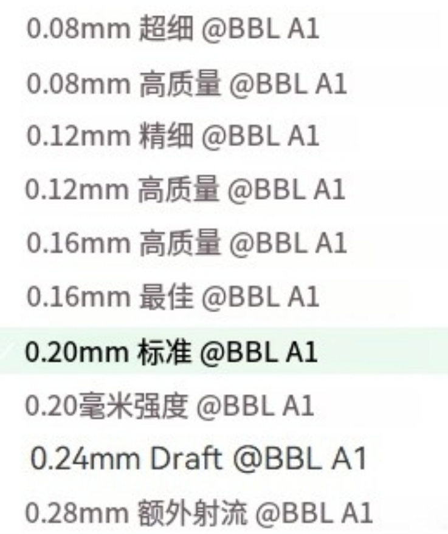
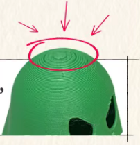

# 3D打印机知识

PVB可用于酒精抛光
PVA溶于水，支撑。
使用STEP 格式
与 STL 相比，STEP 带来了更多有效的信息。由于 STEP 的高精度，切片时可以生成更多的圆弧路径。STEP 还包括模型每个零件的装配关系，可分割模型后恢复装配视图。
## Bambu Studio使用
  
层高越小，打印时间越长。对于大多数用0.4mm喷嘴打印的模型来说，0.20 mm的层高是合适的。

## 参考链接
[Bambu Lab Wiki](https://wiki.bambulab.com/zh/filament-acc/filament/heat-creep)

## 切片细节
当模型顶部是曲面（如球体）时，切片时勾选不使用“顶面单层墙”能减少可见层纹

影响支撑移除难度的两个关键参数是支撑顶部Z距离和支撑/模型XY间距

打印有薄壁或精细结构的模型时，以下能提升打印质量。
1. 在“墙生成器”模块，打开Arachne功能
1. 在“工艺”选项卡中，选择层高更低的预设参数。

多色打印时，如何最大限度减少耗材浪费？
1. 在同一盘内，一次性打印多个相同模型  
1. 增加模型的打印层高，来减少换色次数  
1. 在BambuStudio中启用“冲刷到对象的填充”选项  
4. 到拓竹学院BambuStudio系列教程中学习  

单个模型可以开可变层高，依次点击自适应，平滑，可有效平衡打印质量和打印时间；
2️⃣不是一味增大填充增加墙层数可以使得打印件强度更高；
3️⃣填充优选螺旋体可以更好打印哦；
4️⃣接触面过少的底面在其他栏开启裙边，选择内侧和外侧，层数拉满；
5️⃣官方液体胶真的很好用，一瓶够几台机子用一年，个人觉得还是比较实惠滴；
6️⃣注意摆放朝向，不用一味追求一体打印，可用自带功能进行切片份件～
1️⃣ 悬空结构用树状支撑+角度调整，拆除轻松不伤模型
2️⃣ 精细件支撑顶板设0.15mm，表面平整度提升超明显
3️⃣ 功能件0.2mm层高+50mm/s慢速，强度增加还省时间！

| 问题                | 可能原因                   | 解决方案                                      |
|---------------------|----------------------------|-----------------------------------------------|
| 首层不粘            | 床面不平/喷嘴过高          | 重新校准热床，调整Z偏移（-0.02mm微调）         |
| 层间开裂            | 温度不足/冷却过快          | 提高喷嘴5-10°C，降低风扇速度                  |
| 挤出不足            | 喷嘴堵塞/耗材潮湿          | 通喷嘴或烘干耗材（55℃ 6小时）                 |