# AD笔记
## 绘制原理图库
### 元器件符号属性设置
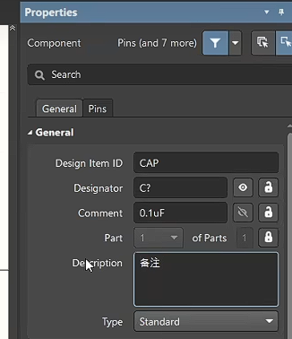

`vgs`快捷键，调整栅格大小

> 管脚放置格点：100mil
> 图形元素格点：10mil
> 
> 注意移动也要调整vgs

### 添加封装

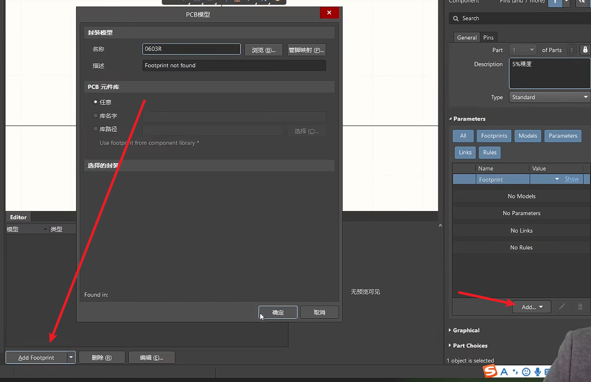
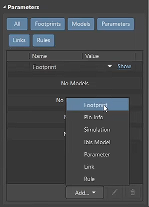

### 遮挡解决方法
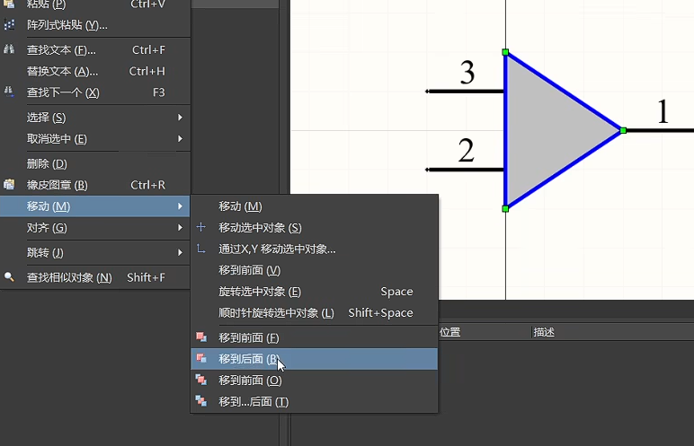

>A管脚表示二极管正极
>K管脚表示二极管负极

### 多Part部件

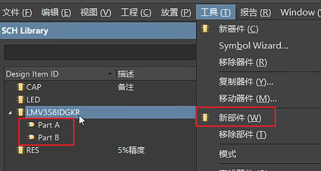

### 调用原理图库
1. 复制现有库
2. 已有原理图进行生成
3. 网络（IC封装网）
   
### 检查原理图库设计
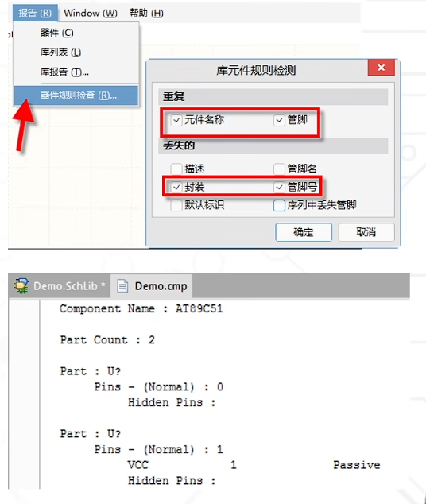

## 绘制原理图
### 放置元器件
格点选择100mil

### 添加原理图库
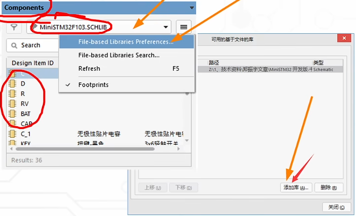
调库使用过程
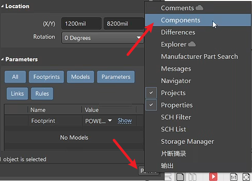

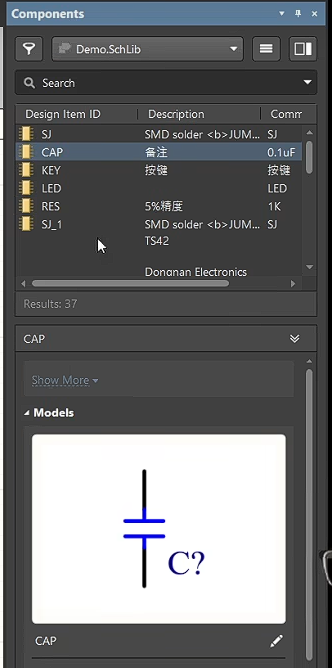

    
元器件对齐快捷键`a`
电气连线 `CTRL+W`

对后面PCB设计做粗细标识
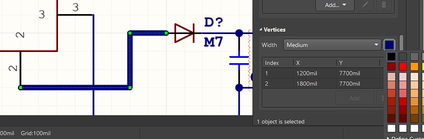

### 切换走线形式shift+空格
>信号一般是采用网络标签，电源一般采用端口

选中导线，按`alt`键可以高亮同一网络
### 分配元器件位号
快捷键`taa`

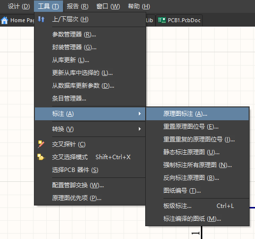
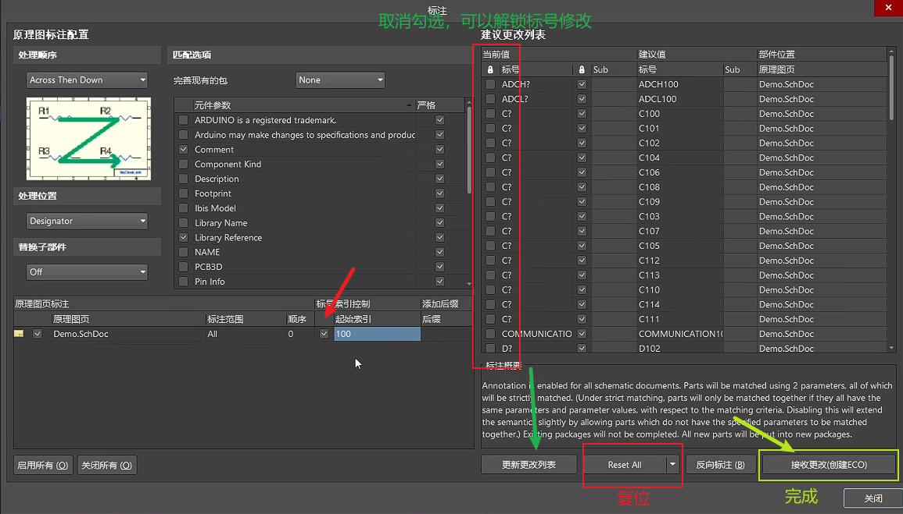

接着点击执行变更
如果不想整页原理图变更，可以框选后
taa 选择下拉的最后一个

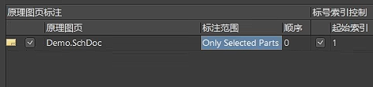

查找文字是`CTRL+F`
### 查找元器件快捷键是`JC`

## 绘制PCB库
修改助焊层形状及其大小

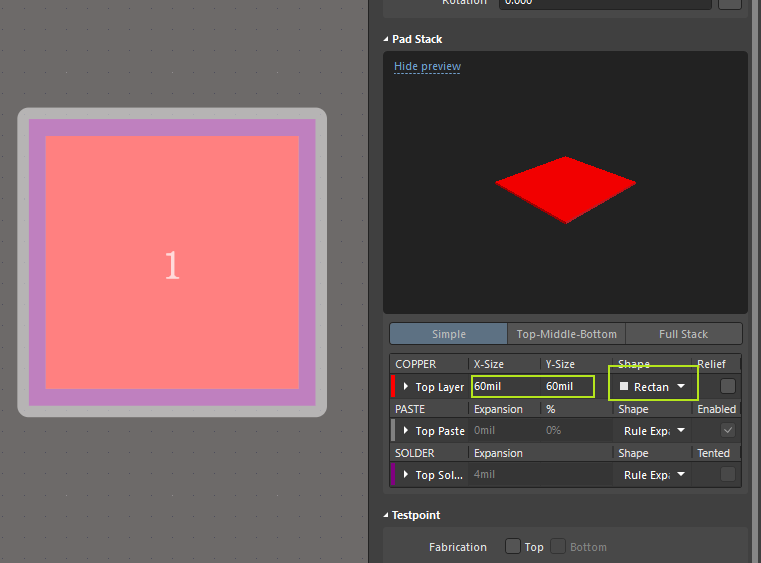

空白处点一下，按`q`切换mil和mm
或者是快捷键`ctrl q`

快捷键m移动，选择xy移动

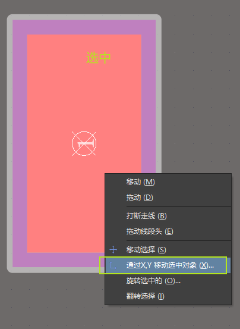

1. Top Layer 顶层
2. Bottom Layer 底层
3. Mechanical  机械层
4. Top Overlay 顶层丝印层
5. Bottom Overlay 底层丝印层
6. Top Paste 顶层锡膏层
7. Bottom Paste 底层锡膏层
8. Top Solder 
顶层阻焊层
9. Bottom Solder 底层阻焊层
10. Drill Guide
钻孔层
11.  Keep-O
ut Layer 防焊层
12. Drill Drawing
钻孔层
13. Multi-Layer 多层

快捷键`efc`设置原点为中间  
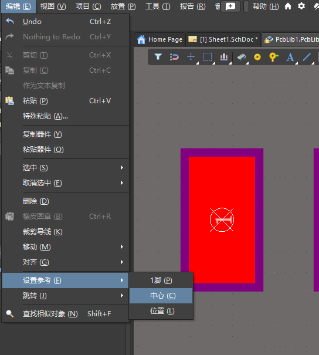

>丝印绘制一般为5mil

`shift+空格` 切换走线形式  

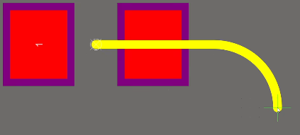

`ctrl m`测量距离

如果设计L形状的封装，焊盘可以进行叠加。序号要保持一致

通孔的一些属性  

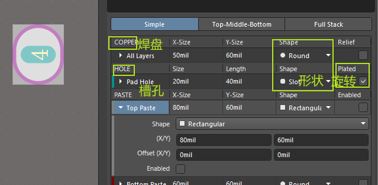

### 调用PCB库
1. 复制现有库
2. 已有PCB进行库生成
3. 网络（IC封装网）

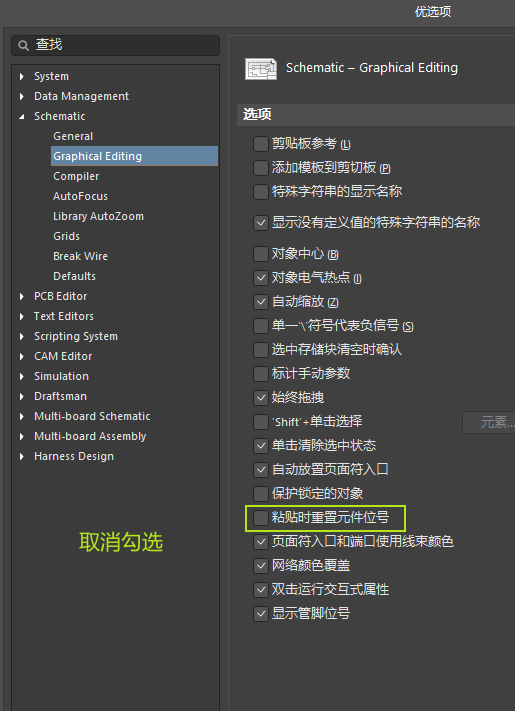

多个元素重叠，可以选择具体哪一个

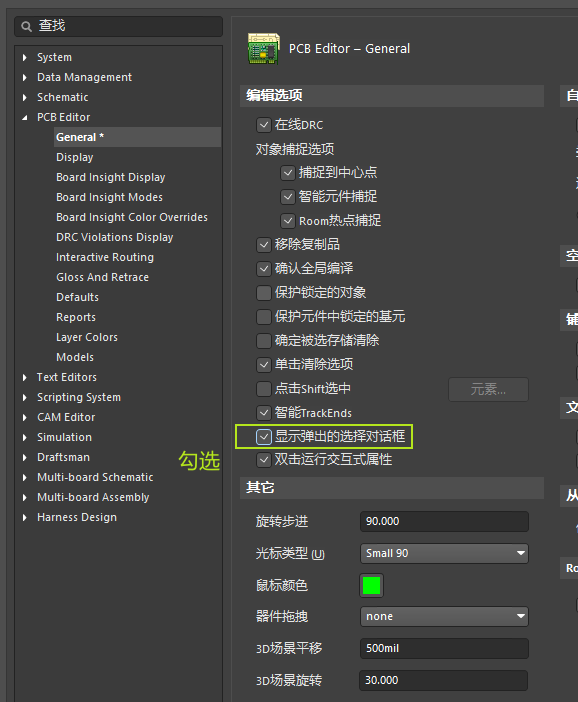
### 绘制3D模型
选择放置3D元件体

注意所在层是在机械1层

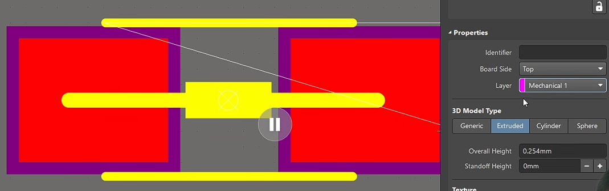

切换3D视图快捷键`ctrl d`

查看3D预览`shift +鼠标右键`

绘制完3D模型，进行更新

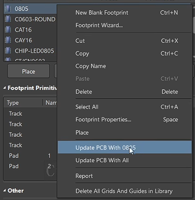
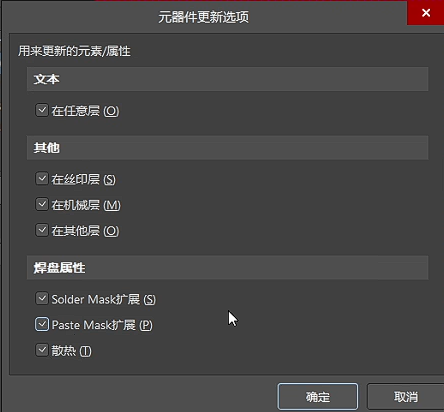
#### 导入3D模型

选择放置3D体，选择.STEP文件

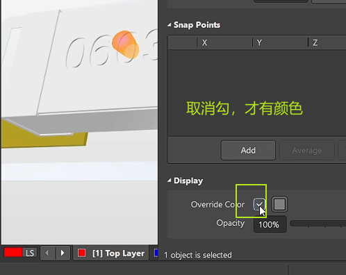

原理图导入PCB的几种错误

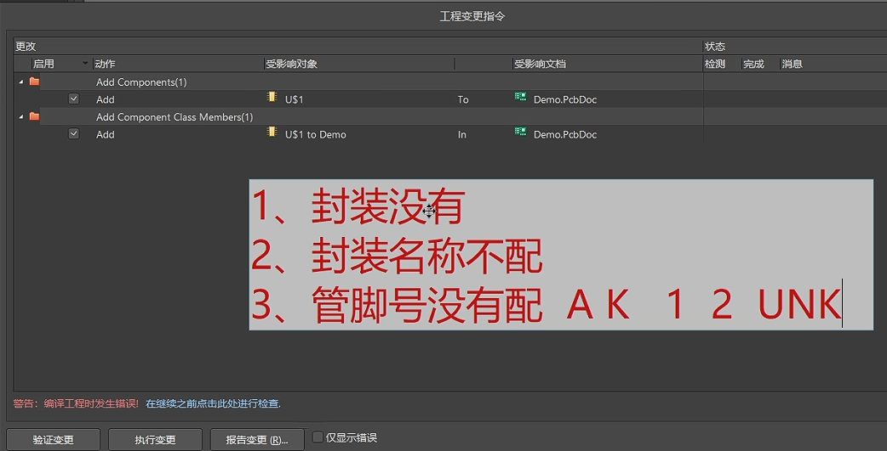
## 绘制PCB

### 交叉选择

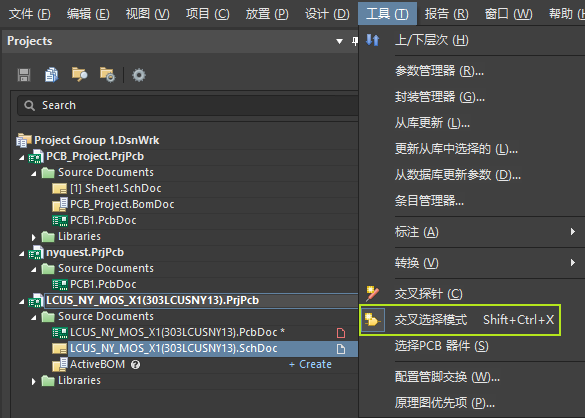

设置中设置

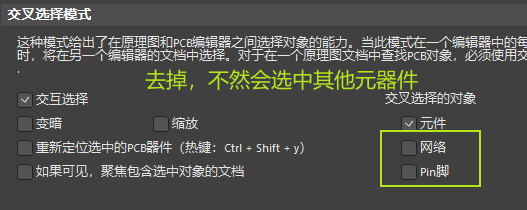

### 元器件按照模块放到一块

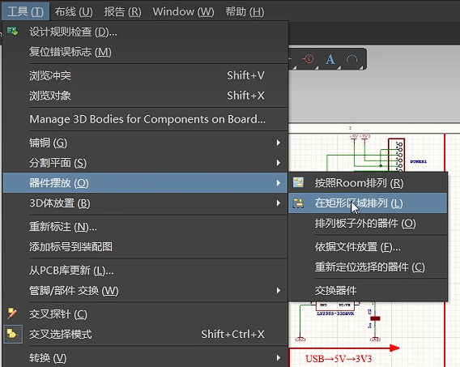

> 对准需要的菜单选项进行`ctrl +鼠标左键`进行 快捷键设置
> 这里我设置快捷键为`

进行上下移动时，立创eda可以直接方向键。AD需要按`ctrl`+方向键

拖动状态下，按`L`进行元器件换层
快捷键`n`进行隐藏飞线

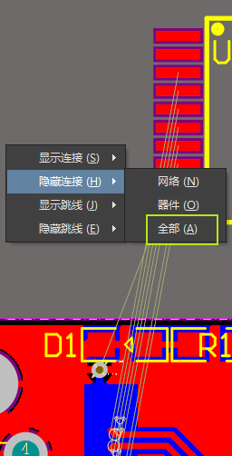

复制PCB快捷键`ea`
快捷键`dsd`将板框进行重新定义到闭合的机械层走线

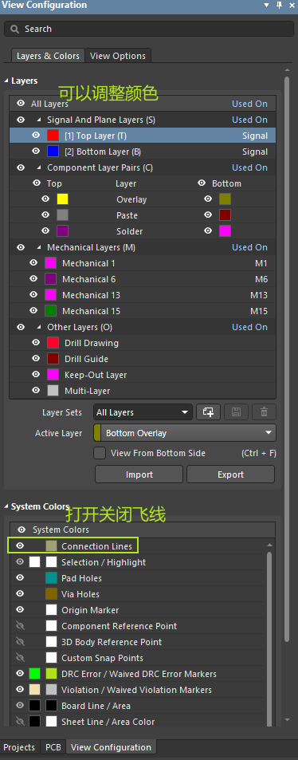

### 创建类并定义布线规则

快捷键`dc`进入类的创建

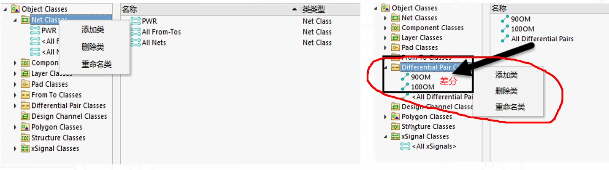

### 差分走线
1. 建立差分类
2. 定义差分

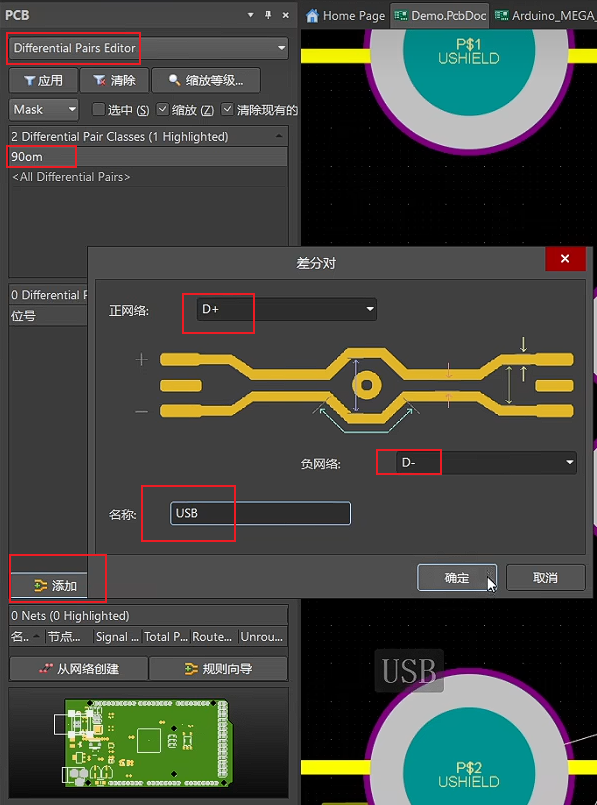
3. 选差分对布线

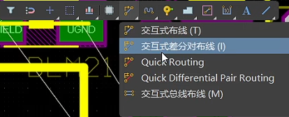

### 多线布线
快捷键`sl`进行线选

PCB走线的时候可以进行线选`sl`后快捷键`um`进行多根拉线

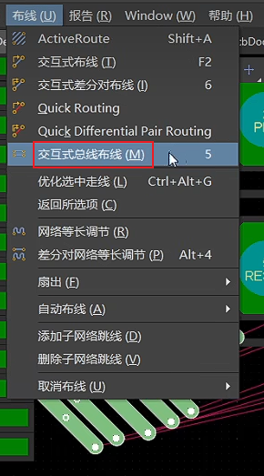

`ctrl+m`量尺寸 