# 金蝶管理物料操作步骤
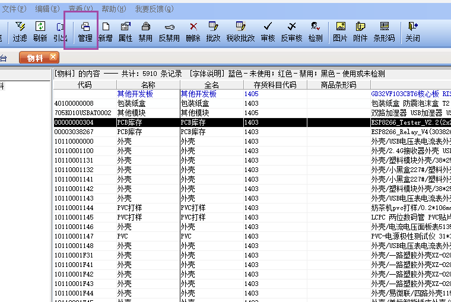  
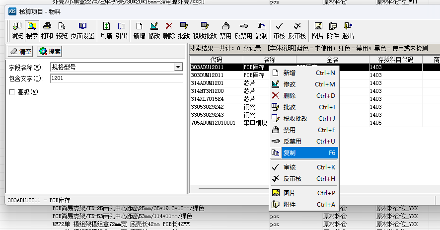  
进入搜索界面，随便找到一款PCB进行复制  
命名规则需要长度一致    
固定头303，固定尾1  
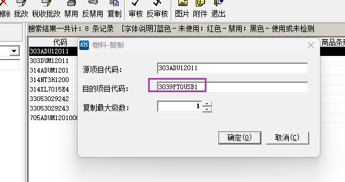  
  
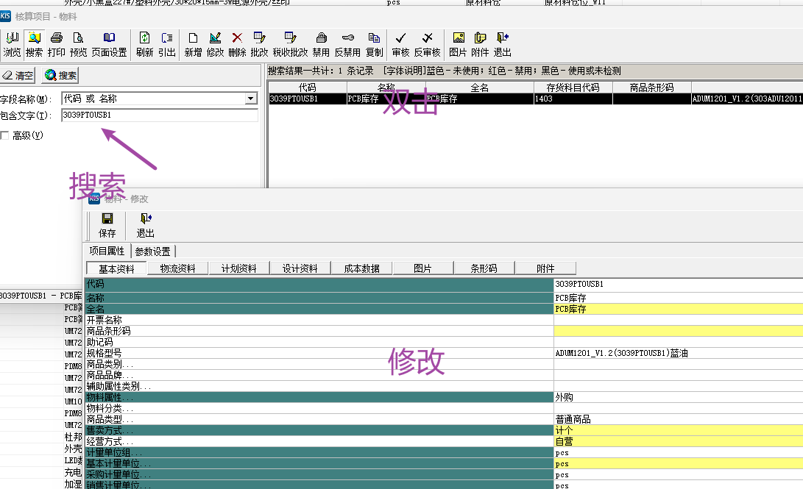  
# PCB文件结构
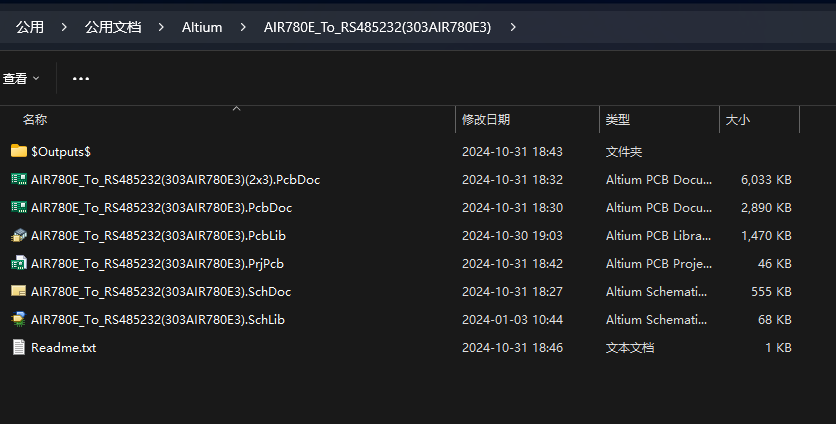
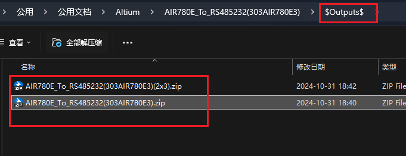
# BOM
## BOM文件结构

 
在非ERP中的表格：  
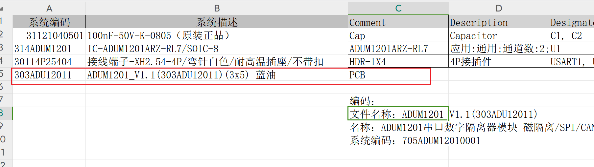
系统编码为SMT后的成品
最后一行为填写拼版PCB

在导入ERP表格中:  
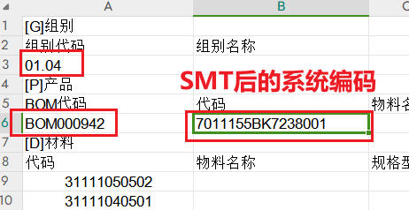  
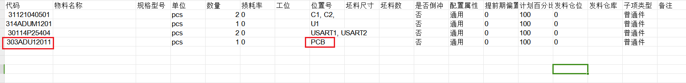
最后一行同样也是
组别代码生成如下：  
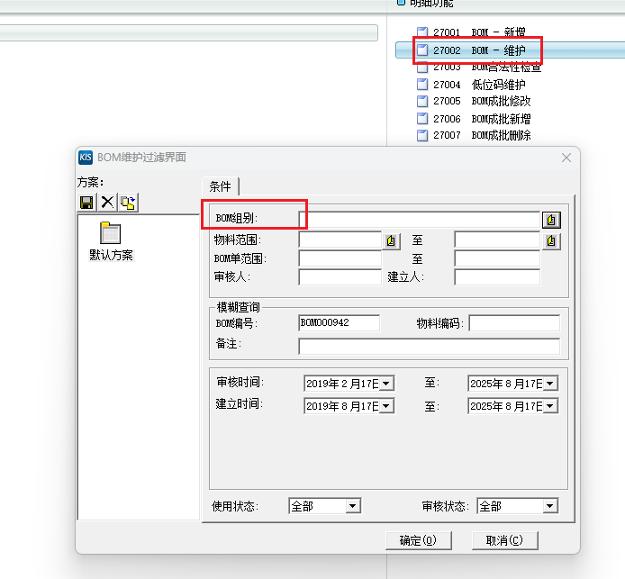
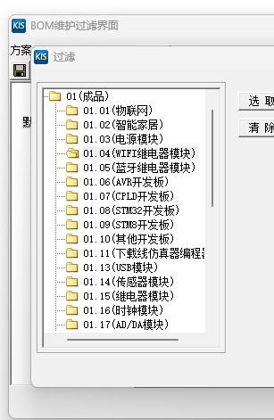  
其中BOM代码生成如下:  
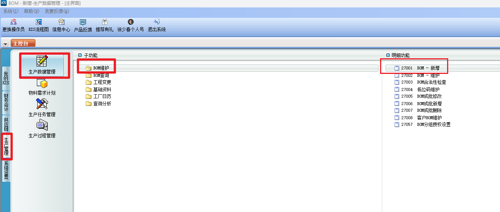
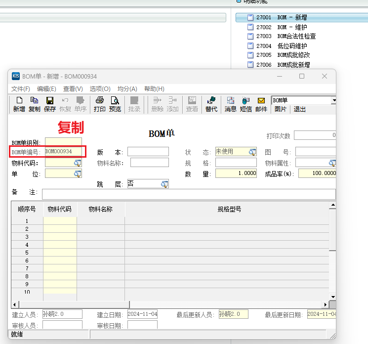
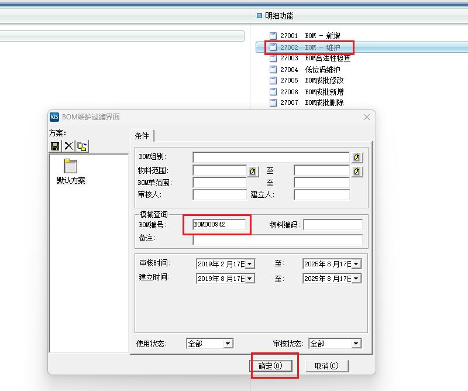
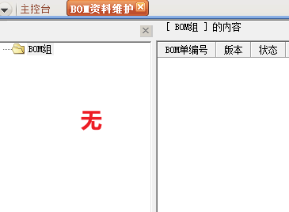  
即可使用