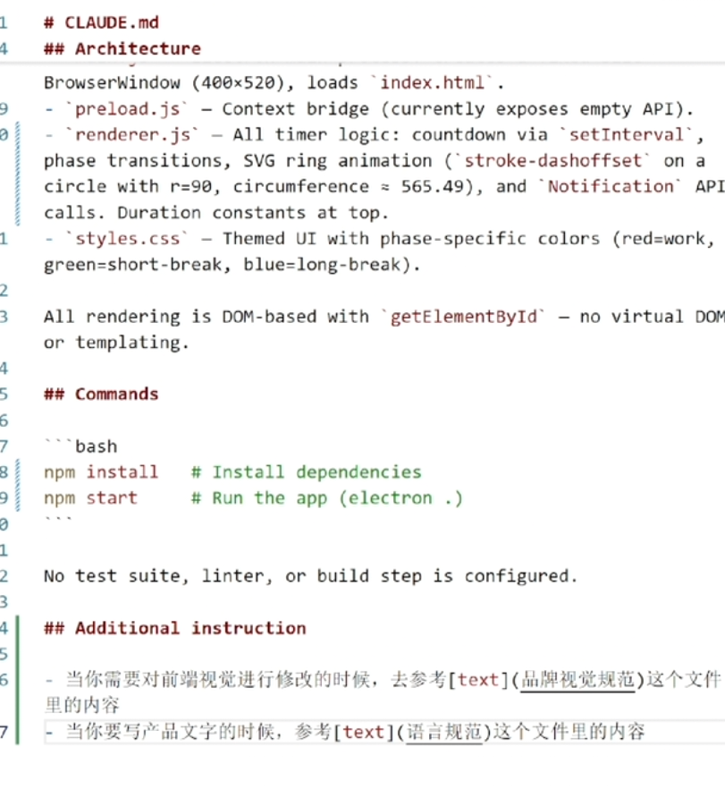
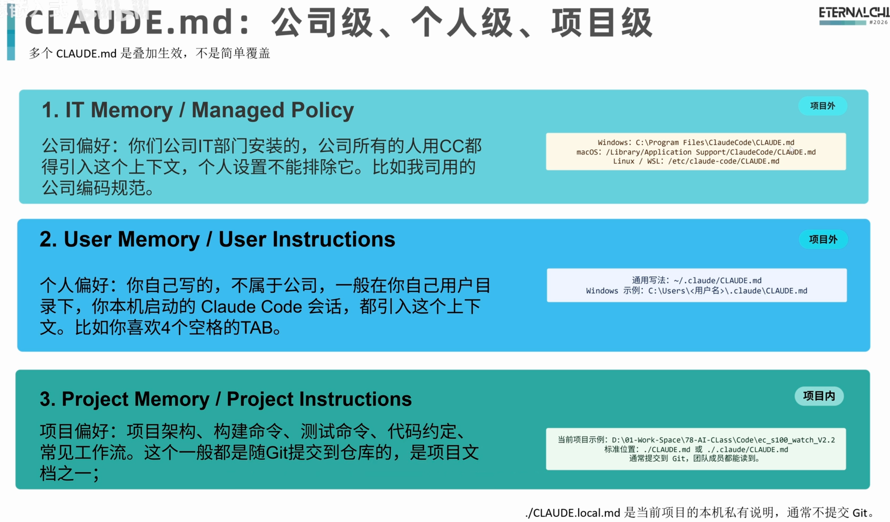
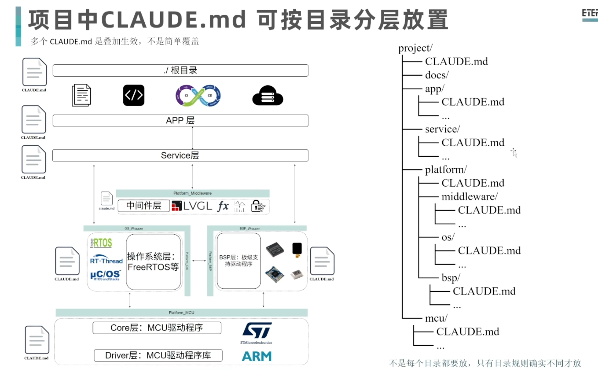
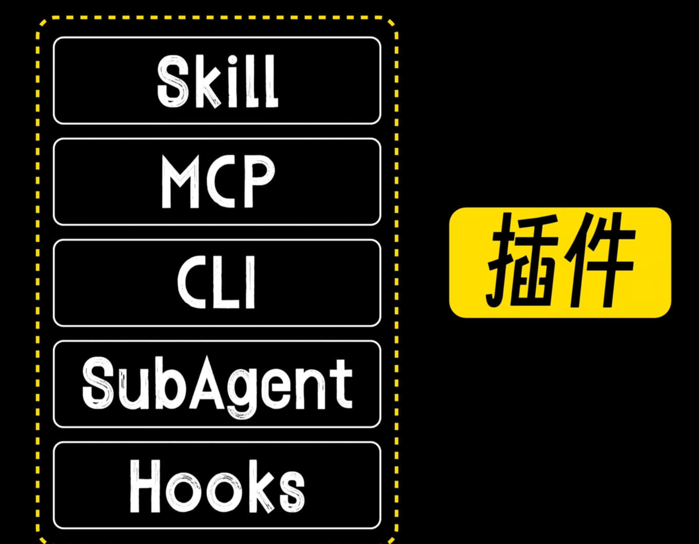
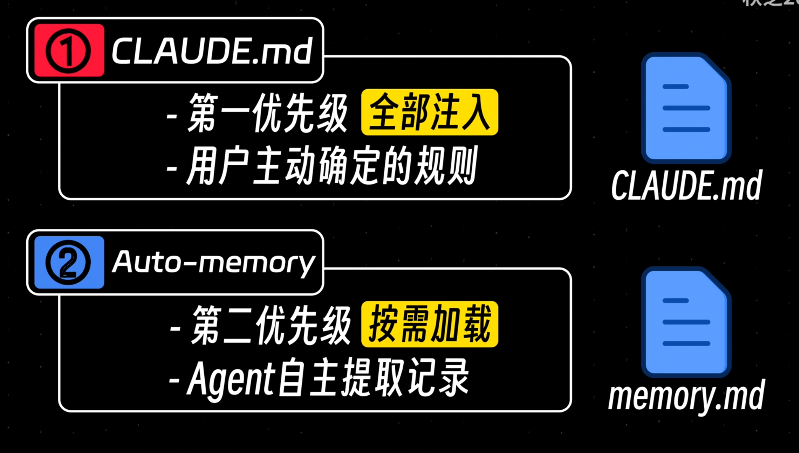
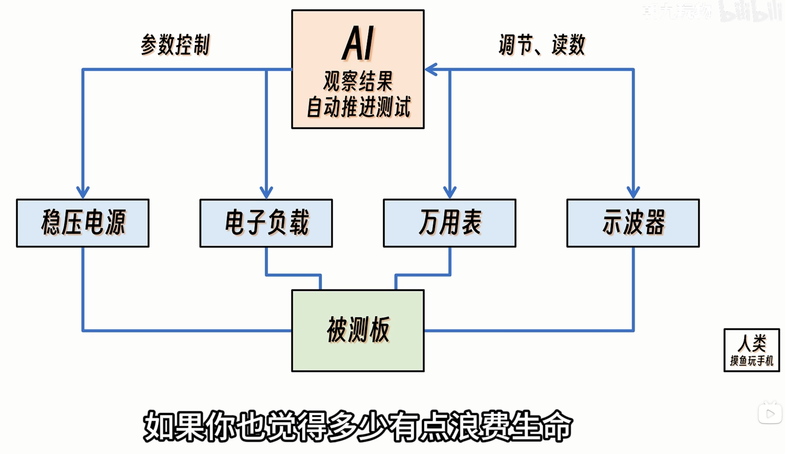

# Claude Code

| Claude指令 | 功能说明 |
| ---- | ---- |
| `/help` | 显示可用命令，以及指令背后遵循的意思 |
| `/model` | 切换高中低档模型 |
| `/btw` | By the way缩写，可以暂时切出正在执行的项目，隔离上下文，方便使用者与CC进行临时对话。会话完毕后，可按esc消除临时会话 |
| `/simplify` | 输入后会派生出3个agent，从代码质量、运行效率和复用性三个角度做一次代码审核，然后自动优化修改 |
| `/rewind` | 进入回滚界面 |
| `/compact` | 主动压缩精简上下文 |
| `/clear` | 清除对话历史 |
| `/context` | 详细展示agent当前的上下文信息，诸如：上下文占比，上下文类别等等 |
| `/resume` | 在全新的上下文窗口，选择恢复到之前的对话 |
| `/init` | 初始化创建项目级Claude.md |
| `/memory` | 针对Claude的全局、项目记忆，以及auto memory进行操作和管理 |
| `/agents` | 创建、调用、管理子agent(帮助您配置自定义 subagents) |
| `/plugin` | 发现新插件，管理已下载插件，新增插件生态 |
| `/exit` | 退出 Claude Code |
| `/status` | 环境状态 |
| `/reset` | 彻底重置全会话上下文，干净重启 |
| `/config` | 查看当前配置 |
| `/save` | 保存当前上下文 |
| `/load` | 加载上下文 |
| `/tools` | 列出可用工具 |

>帮我配一个 statusLine，能显示当前目录+模型+上下文剩余百分比的功能

## 最大权限（无确认）命令

```bash
claude --dangerously-skip-permissions
```

## 置顶链接

[OpenAI 官方 Codex 最佳实践系统学习文档](https://developers.openai.com/codex/learn/best-practices)
[GitHub Copilot 最佳实践](https://docs.github.com/en/copilot/get-started/best-practices)
[Claude Code 教程](https://www.runoob.com/claude-code/claude-code-tutorial.html)
[Claude Code 官方文档](https://code.claude.com/docs/zh-CN/overview)
[Claude Code 使用指南](https://github.com/tev6/andrej-karpathy-skills-zhCN)

## 安装

### 使用官方脚本安装（推荐）

```bash
# macOS、Linux、WSL：
curl -fsSL https://claude.ai/install.sh | bash
# Windows PowerShell：
irm https://claude.ai/install.ps1 | iex
# Windows CMD：
curl -fsSL https://claude.ai/install.cmd -o install.cmd && install.cmd && del install.cmd
# 安装完成后，验证是否安装成功：
claude --version
```

### 使用 npm 安装

```bash
# 请先确认已安装 Node.js
node --version

# 进入命令行界面，安装 Claude Code
npm install -g @anthropic-ai/claude-code

# 创建您的工作目录，例如 `your-project`，使用 `cd` 命令导航到您的项目
cd your-project

# 安装完成，运行命令 `claude` 即可进入 Claude Code 交互界面
claude
```

### 更新 Claude Code

```bash
# 二选一
claude install
claude update
```

### 安装qwen code

```bash
npx @qwen-code/qwen-code@latest 
```

## AI实用教程

1. 开干前先plan，先确定方向需求后再让agant干活。
2. 控制上下文，需要给精准的指令。而不是把所有内容扔个AI。AI的注意力及其分散。
3. claude.md不要超过300行。建议（60至120行）不是文档是宪法。硬性指令集（不可妥协的硬性原则）。每次会话启动都会读这个md载入上下文。
4. skills是可插拔的能力模块。真正需要时才加载进上下文窗口
5. 用 skills 和 subagents 减少不必要的上下文占用
技巧1：连按两次ESC键会弹出一串对话快照进入回溯对话功能，对它说“从这个检查点起，清空后续所有对话历史”

- Memory记忆：让AI记住你是谁
- Rules规则：你要求AI必须怎么配合你
- Skills技能：教AI怎么把活干好
- MCP模型上下文协议：让AI能真的动手干

1. 请求要具体

```text
不要说：“修复错误”
尝试：“修复登录错误，用户输入错误凭证后看到空白屏幕”
```

2. 使用分步说明
将复杂任务分解为步骤：

```text
1. 为用户配置文件创建新的数据库表
2. 创建 API 端点以获取和更新用户配置文件
3. 构建允许用户查看和编辑其信息的网页
```
3. 在进行更改之前，让 Claude 理解您的代码：

```text
分析数据库架构

构建一个仪表板，显示英国客户最常退货的产品
```

## CLAUDE.md 为每个会话都能看到的持久上下文

CLAUDE.md一定要大写


添加：

- 当你需要对前端视觉进行修改的时候，去参考[text](品牌视觉规范)这个文件里的内容
- 当你要写产品文字的时候，参考[text](语言规范)这个文件里的内容

- 分层加载




## Skills 添加可重用的知识和可调用的工作流

Skills是基于高标准的重复工作沉淀的可复用技能包，可以持续稳定的按照你的要求输出高质量的产物
创建skill.md:名称、描述、指令放进去

### Skill类型

> https://github.com/vercel-labs/skills帮我下载find-skills

### 内置Skill

- 文件搜索、代码搜索
- 任务规划与管理
- 项目诊断

### 自定义Skill

- 领域特定知识库
- 专用工具集成
- 工作流程自动化

### 使用场景

1. **代码开发**: 代码生成、调试、重构
2. **文档处理**: 文档创建、格式化、转换
3. **数据分析**: 数据清洗、可视化建议
4. **项目管理**: 任务分解、进度跟踪

### 创建自定义Skill

```json
{
  "name": "custom-skill",
  "description": "描述技能用途",
  "tools": ["tool1", "tool2"],
  "knowledge_base": "path/to/knowledge"
}
```

### 最佳实践

- 单一职责: 每个Skill专注一个领域
- 清晰命名: 便于AI理解和调用
- 文档完善: 说明输入输出格式
- 版本控制: 追踪Skill演进

## MCP 连接到外部服务和工具

MCP是一种用于AI模型与外部数据源和工具连接的协议标准。

### 配置示例

```json
{
  "mcpServers": {
    "filesystem": {
      "command": "npx",
      "args": ["-y", "@modelcontextprotocol/server-filesystem", "/path/to/dir"]
    },
    "git": {
      "command": "npx",
      "args": ["-y", "@modelcontextprotocol/server-git"]
    }
  }
}
```

常用MCP：
Filesystem
markitdown
Excel
context7
[乐鑫 MCP 服务器](https://mcp.espressif.com/)

### 智能体

智能体提示词：定义它的角色定位，行为风格，以及可以使用的工具。

-在条件允许时，优先参考Context7的最新文档，而非依赖训练数据

### 提示词

1. 现在所有的文档都落实到docs\系统架构设计.md和docs\需求与协议约定.md了，接下来帮我写一个prompt，用来按照文档落实整个工程代码。
2. 当前程已经按docs件夹中的档进了实现，请你根据实现的功能，给我制定份功能验证案，我按照验证案进操作，完成所有功能的验证

### 个人规则模板

把复杂问题拆解成更小、易处理的模块
若需求含糊不清，主动追问、澄清细节
遇到不确定事项或需工审核的内容，坦诚说明
当问题可能需要专业知识或监督介时，及时给出建议
绝不能记录敏感数据（如密码、令牌、个身份信息）
所有配置机密都通过环境变量来设置
执敏感操作前，务必做好身份验证检查

## CLI

https://github.com/jackwener/OpenCLI/releases/tag/v1.7.7 帮我安装opencli工具

## Hook（钩子）生命周期事件上触发，可以运行脚本、HTTP 请求、提示或 subagent

Hook = 钩子：在指定事件触发后，自动执行一段自定义脚本 / 命令
你这里需求：AI 任务跑完 (Done 结束事件) → 自动触发：播放提示音 + 飞书发消息

>帮我做个hook，你每次完成任务之后，自动发出一个提示音，最好还发一条飞书消息给我

## Subagents 在隔离的上下文中运行自己的循环，返回摘要

## Agent teams 协调多个独立会话，具有共享任务和点对点消息传递

## 插件



## Memory




## 自然语言描述

```bash
项目是做什么的？

这个项目使用了哪些技术？

主入口在哪里？

解释一下文件夹结构

审阅我的修改内容并给出优化建议

读取src/index.js并分析

在index.html添加导航栏

创建一个React TypeScript项目

提交这次修改，commit message要清晰

提交我的更改并附上描述性说明信息

帮我解决合并冲突

审查main分支的最新提交

运行单元测试并修复失败的用例

构建生产版本

这个报错是什么意思: Error: Cannot find module

分析这个函数的性能瓶颈

分析当前项目的代码仓库结构，绘制一张清晰的架构图。
要求用 Mermaid 语法输出，让完全不懂代码的人也能一眼看明白各模块的关系。
```

## 嵌入式

[嵌入式AI](https://embedai.top/)



- 提示词：

测试任务：Fly-Buck隔离电源自动化验证被测板LMR38020F，输入最大36V、典型24V，副边隔离输出约9V，输出最大1A、典型500mA，，原理图见"电路原理图.png"。测试内容：电源效率扫描；输出纹波；线性调整率、负载调整率；动态负载特性；启动特性。输出完整的电源测试报告。
仪器与接线：SPM6103电源(COM24)：电源输出经过自带万用表电流档，接被测板输入(C2两端)。UTL8212+负载(COM23)：正接34461A V端子，负接34461A 3A端子。34461A万用表(192.168.31.133)：V端子接副边+9V(C5正端)，LO端子接副边GND(C5负端)。DS4024E示波器(192.168.31.132)：CH1同轴线接C2两端；CH2同轴线接SW引脚；CH3通过电流探头检测副边输出电流(1V/A)；CH4同轴线接副边输出C5两端。

“我在COM口/IP地址连接了一个XX仪器，我希望你将来调用它做这些测试：XXXX、XXXX…。编程手册我已经找到了放在C:\xxxx。帮我试一下能否调用、保存成skill以便将来使用。”
视情况还可以加：“你可以参考这些开源项目：xxxx”、“我倾向于用pyvisa”、“编程手册帮我转成markdown和skill放在一起”、“尽量不改系统/装软件，如果必须装请经过我同意”。
