# BLE蓝牙知识
三个基本概念：Profile，Service，Characteristic。

Profile我理解为“子规划”，专门针对某种应用场景定义的。包含消息格式，标准，使用哪些蓝牙协议组件等。

Service就是“服务”，主要目的是定义我能做哪些功能。

Characteristic就是“特征”，其实就是真正的数据，我能做哪些功能，最终就是要靠这些数据来体现。
  
例如：针对“Find Me”这个应用场景，“Find Me” Profile 会描述主机设备和从机设备的角色和行为，如何广播，如何扫描，如何连接，等。并定义了从机必须要实现的服务，和可选实现的服务。主机需要实现的功能等。

Service 的目前是方便主机查找从机包含了哪些服务，或者快速指定使用哪个服务。因此Service 的 UUID就是用于这些目的的。另外，Service里面包含了可以读/写的数据，称为“Characteristic”。每个“Characteristic”也有自己的UUID，因为一个服务会包含多个特征，因此需要通过UUID区分。

Service 和 Characteristic 使用的数据结构，都是 “Attribute”。看来他们都是一个东西，只是赋予了不同的解释。

一条“Characteristic”不是对应一条“Attribute”，而是多条组成。  
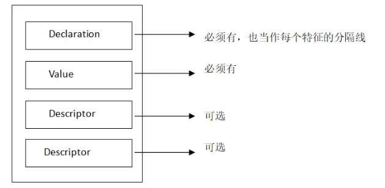  
当特征有 notify 或者 indicate 功能时，蓝牙规范必须为其添加 CCCD attribute。

每个服务和特征都有一个UUID。

16bit，官方认证过的，需要花钱购买

128bit，自定义的

主机与从机通讯均由“特征”实现。
主机与从机通讯均由“特征”实现。

以 Hear Rate Service 为例，官方 16bit UUID 为 0x180D，包含三个特征：Heart Rate Measurement，Body Sensor Location 和 Rate Control Point。并且只有第一个是必须的，其它可选。

因此，开发 BLE 应用，就是开发 Service 和 Characteristic，通过API添加自己需要的服务和特征。

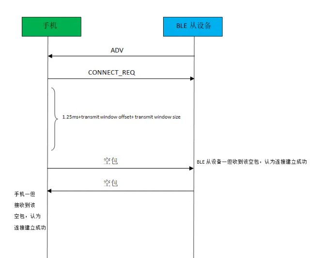  
在这个图片上，有个情况，就是手机在给ble从设备发第一个空包的时候，ble从设备如果没有收到第一个packet（M->S），则会以1.25 ms + transmit window offset为起点，等待connInterval之后，再次尝试接收，直到接收到为止，或者六次尝试都失败断开连接为止。ble从设备接收到packet之后，则以收到该packet的时间点为起始点（anchor point），以connInterval为周期，接着接收后续的packet（M->S），以及发送packet给手机（S->M）。

连接成功后，在其它时间里，设备也可以主动通知对方断开连接。断开连接的数据包如下：
LL_TERMINATE_IND
并且包含断开的错误码。

在 nimble 上开发，可以使用接口：
int ble_gap_terminate(uint16_t conn_handle, uint8_t hci_reason)。hci_reason可以填写我们想要告知对方的错误码。

ble从设备发送广播数据包ADV，发送完，马上侦听

手机收到广播包，马上发起连接请求 CONNECT_REQ，ble从设备在侦听，因此可以收到。ble从设备在收到的 CONNECT_REQ 包中，包含transmit window offset，transmit window size等参数，会根据这些计算出要等待多长时间，在哪个信道上，开始侦听手机发来的第一个空包

手机等待“1.25ms+transmit window offset+transmit window size”时间后，在之前说好的信道上，马上发出一个空包给ble从设备，然后进入侦听状态

ble从设备因为也在计算好的时间里进行了侦听，因此能收到这个包。并认为连接成功了。然后返回一个空包

手机收到ble从设备发来的第一个空包，并认为连接成功了

场景：蓝牙从设备开发板 + 手机 

手机连接开发板后，开发板通过打印，可以看到，在上报了连接成功的事件后，会马上再上报一个                                                                   BLE_GAP_EVENT_RD_REM_FEATS_COMPLETE 事件。

我们看到，手机连接开发板后，手机马上发出了查询特性的动作：LL_FEATURE_REQ，同时，开发板也想知道手机的特性，也发送了 LL_SLAVE_FEATURE_REQ。通过各自发送的包，其实里面已经包含了自己支持的特性数据以给到对方。

理论上，只要任何一方发起，对方回复了，那么大家就都获取到了对方支持的特性。不需要双方都发送查询这么麻烦。但是又怕对方不查询，因此自己就主动去做了。

开发板触发这个事件的动作在 LL_SLAVE_FEATURE_REQ 发送后，得到对方的 LL_FEATURE_RSP 的时候。

## 蓝牙的工作模式：
 1. 主机模式/从机模式
    主机模式下，蓝牙模块具备扫描从机广播以及主动建立连接的能力，能够与一个或者多个从设备实现连接通信。
  从机模式则是蓝牙模块先进入广播状态，等待被主机扫描。一旦主机扫描到从设备并建立连接之后，便能与主机设备进行数据的收发。在此模式下，从机无法主动建立连接，只能被动等待主机扫描并建立连接。
  2. 主从一体工作模式
    主从一体模式是指蓝牙模块既可以作为主设备，也可以作为从设备。这种模式允许蓝牙模块在两种角色之间自由切换。在从模式下，蓝牙模块会等待其他主设备前来连接，必要时再转换为主模式，向其他设备发起连接请求。
  3. 广播/观察模式
    广播模式：蓝牙模块会定期且持续地向周围发送一定长度的广播数据包，这些数据包可以被扫描到。在低功耗模式下，蓝牙模块可以持续进行广播操作，适用于极低功耗、小数据量以及单向传输的应用场景。
    观察模式：该模式下，蓝牙模块是非连接状态的。与广播模式的一对多发送广播相比，观察者可以一对多地接收数据。在该模式下，设备只能够监听和读取空中的广播数据，却无法发起连接，只能持续扫描从机。
  4. iBeacon模式
    苹果公司推出的一款基于低功耗蓝牙技术的新型通信协议，称之为iBeacon，实现持续不断地广播蓝牙设备的MAC地址、UUID等固定字节的字符串信息。是近些年来开始流行起来的蓝牙通讯技术应用，在精确营销方面有着广泛的应用，例如博物馆、展览馆等场所提供信息推送服务，或是在购物中心为商家提供向消费者发放优惠券和积分的功能。在室内高精度定位方面的应用也越来越多。

## GATT简单介绍：
  1.什么是GATT？
   GATT（Generic Attribute Profile）是BLE中用来定义通信数据结构的协议。GATT定义了如何在BLE设备之间传输数据，并规定了服务（Services）、特征（Characteristics）和描述符（Descriptors）的使用方式。通过这些概念，GATT实现了设备间的标准化通信。

  2. GATT服务
   GATT服务是用于组织特征的集合。每个服务通常代表一个设备或应用的特定功能模块。。
  3. GATT特征
   GATT特征是包含实际数据的基本单元。每个 GATT 服务都有一个唯一的 UUID（Universally Unique Identifier），用于唯一标识该服务。UUID 可以是 16 位、32 位或 128 位的标识符，其中 16 位和 32 位 UUID 通常是由蓝牙 SIG 定义的标准服务，128 位 UUID 通常用于自定义服务。特征可以用于读取、写入和订阅通知。标准的GATT特征值，可以从国际蓝牙联盟（BT-SIG）官方渠道了解：https://www.bluetooth.com/

     当一个BLE设备的特征接收GATT通知时，它意味着它订阅了一个特征的通知，并且当该特征的值发生变化时，它会接收到通知。这种通知机制可以用于实时监测特征值的变化，例如温度传感器的实时温度数据。

     GATT服务、特征、属性的关系大致如下：
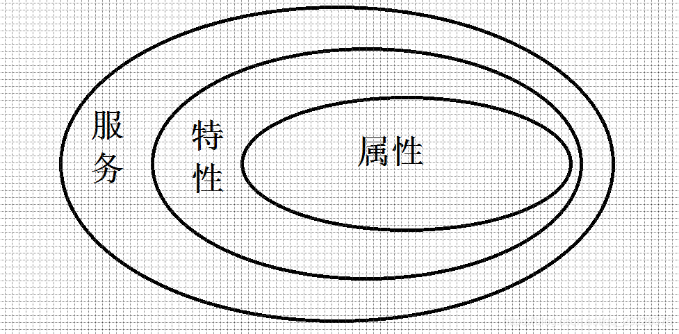
### 安信可SDK
  apps_ble_start：入口函数，开启BLE使能
  ble_slave_init：开启从机初始化
  ble_server_init：注册gatt服务
  ble_uuid1_notify_data：处理通知数据
  ble_uuid1_write_val：读取经GATT发送过来的数据
  BT_GATT_PRIMARY_SERVICE：定义GATT服务UUID
  BT_GATT_CHARACTERISTIC：定义收发的特征值
  BT_GATT_CCC：定义配置改变时的监听
## 鹏老师课程
https://www.bilibili.com/opus/697239519074713670
## 蓝牙广播
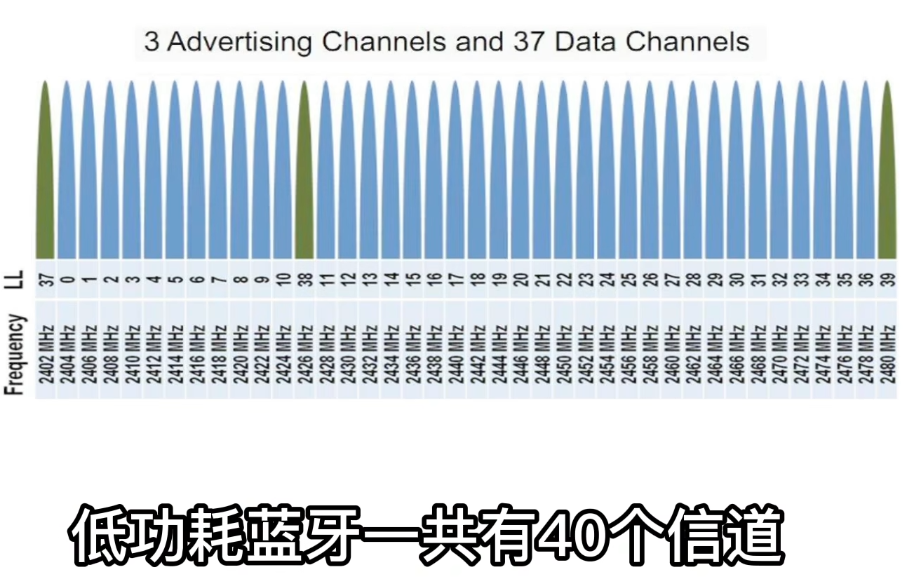
频率范围从2402Mhz到2480Mhz  
每2Mhz一个信道
37 38 39是广播信道，剩余的是数据信道
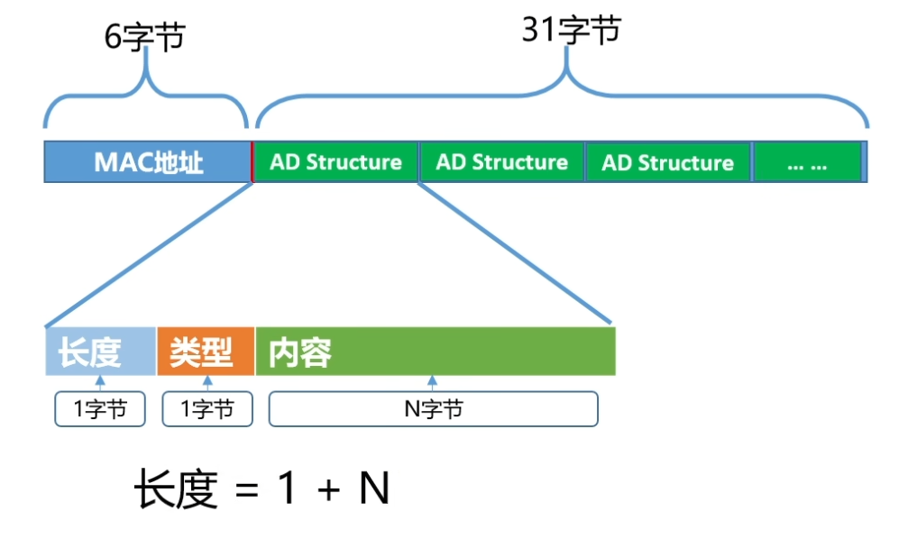  
一个广播数据包最长37个字节，6个字节用作蓝牙MAC地址。长度=类型+内容=1+n
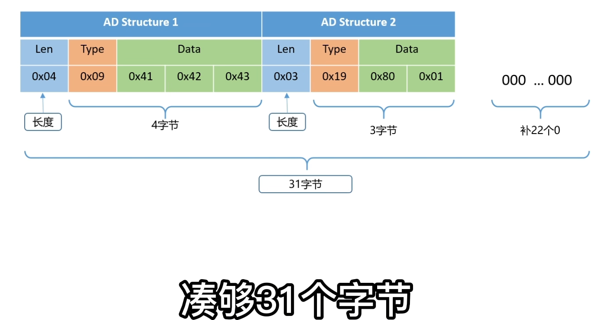  
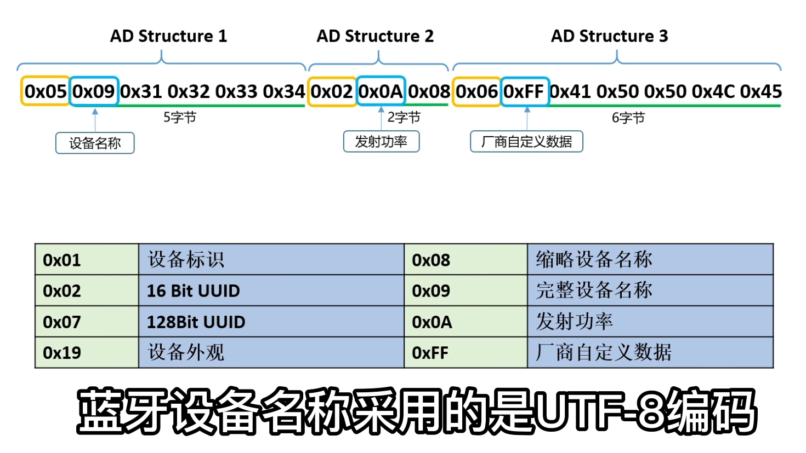  
设备名称：1234,；发射功率：8dBm；厂商自定义数据。  
一个汉字UTF-8编码占用3个字节
## 扫描响应
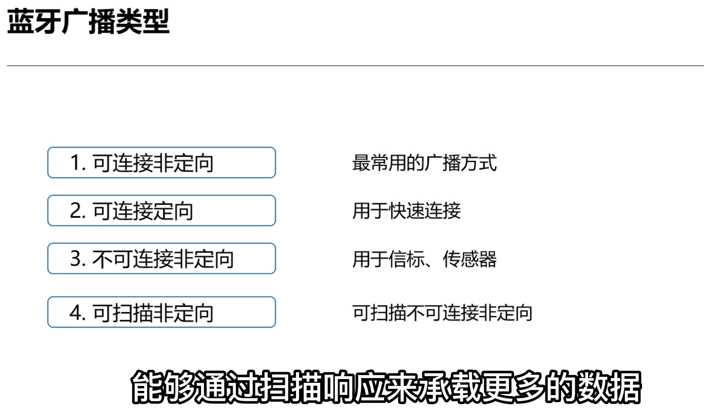  
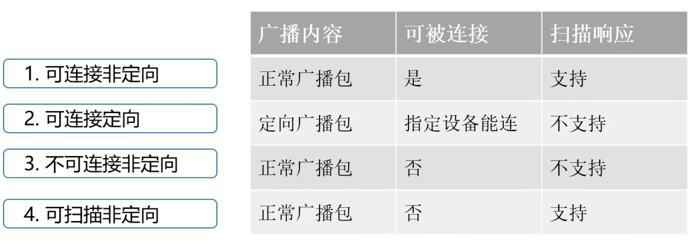  
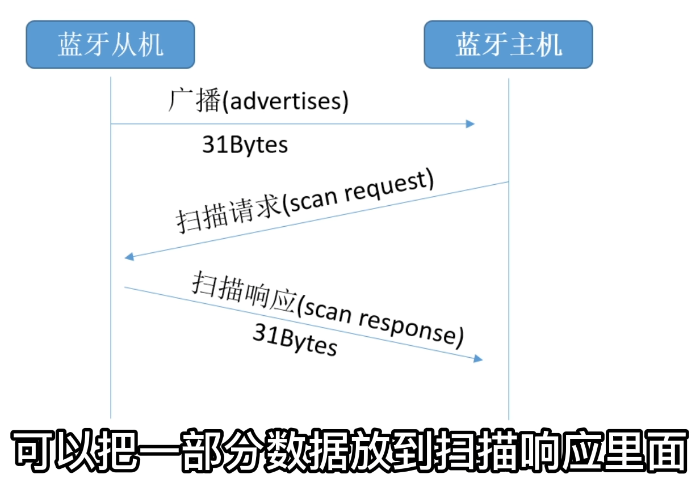
扫描响应的格式和蓝牙广播的数据格式是完全一样的。
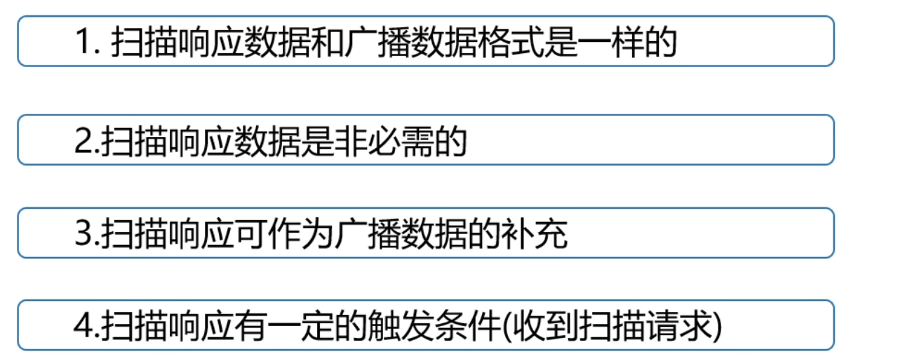

## 状态切换
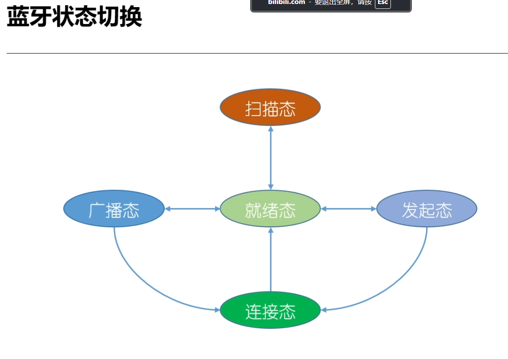
如果第一次连接后，并断开连接。回到就绪态，不是广播态所以会扫描不到。要编写程序代码，当设备从连接态进入就绪态后使其再次进入广播态。可以通过中断函数来处理蓝牙状态的变化
## 服务与特征  
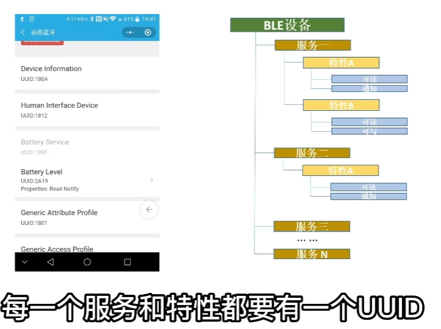  
UUID是蓝牙组织定义的，用于区分各个服务和特性的标识符。总长度是128bit。蓝牙组织联盟定义了一个UUID的基地址，允许用户使用16bit的UUID和32bit的UUID与该基地址拼接形成128bit的UUID  
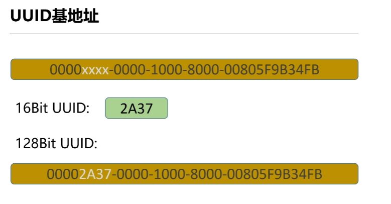
## 数据收发
BLE是基于一个个特性实现的，每一个特性可以被看作一个数据点。数据的收发都要依托于这些数据点。
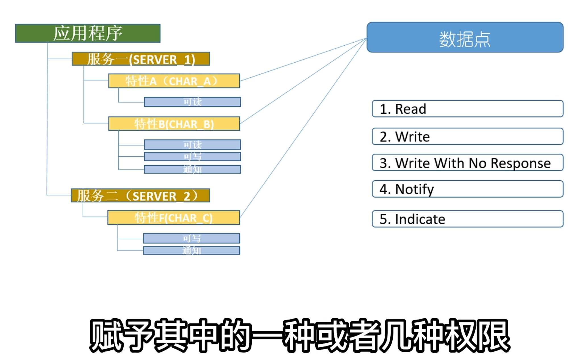  
write With No Response写完之后不需要从设备回应  
write需要回应  
Notify操作是设备里面的数据发生变化之后通知手机来取数据。需要在手机端订阅相应的通知才有效。不需要主设备回应从设备  
Indicate需要回应（回应从设备）  
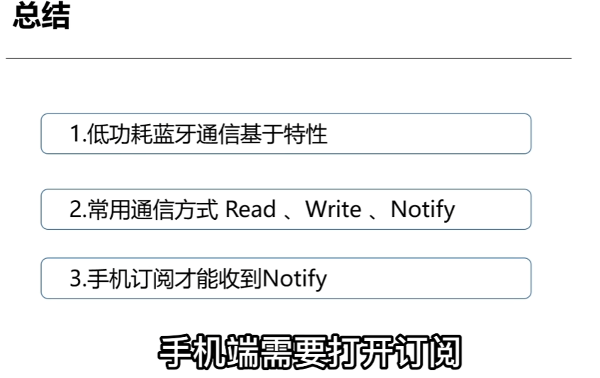
## SPP协议
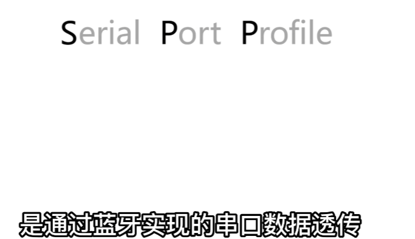  
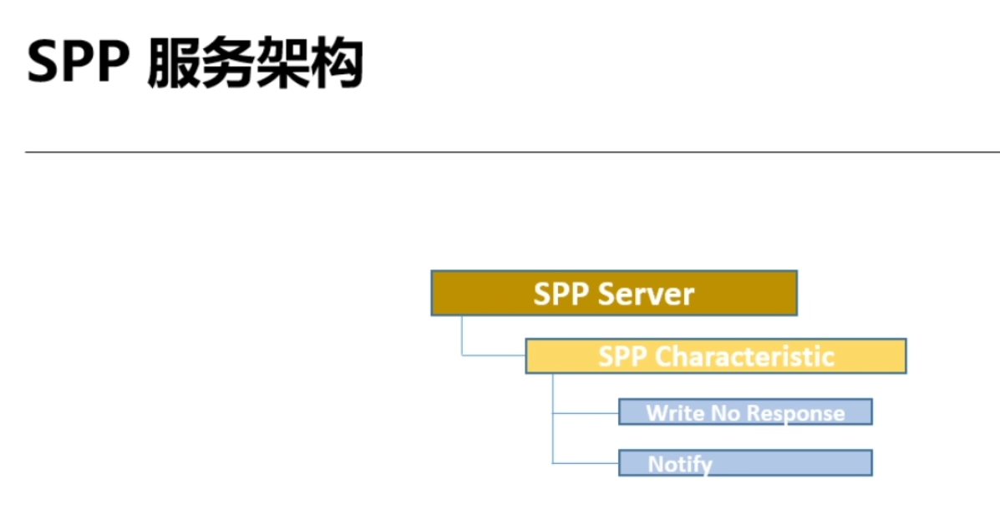

## ArduinoBLE
   1. 创建一个 BLE Server
   2. 创建一个 BLE Service
   3. 创建一个 BLE Characteristic
   4. 创建一个 BLE Descriptor
   5. 开始服务
   6. 开始广播
## 生成UUID网址：https://www.uuidgenerator.net/

## BK蓝牙配网

[Demo演示文档](https://docs.bekencorp.com/armino/bk7256/zh_CN/latest/examples/bluetooth/ble_boarding_demo.html)  
[蓝牙API参考说明文档](https://docs.bekencorp.com/armino/bk7256/zh_CN/latest/api-reference/bluetooth/ble.html)  
[蓝牙常用测试命令说明文档](https://docs.bekencorp.com/armino/bk7256/zh_CN/latest/examples/cli/bluetooth/ble.html)  
代码：  
[Demo](http://gitlab.bekencorp.com/wifi/armino/-/tree/main/components/demos/bluetooth/ble_boarding)  
[API](http://gitlab.bekencorp.com/wifi/armino/-/tree/main/include/modules/ble.h)  

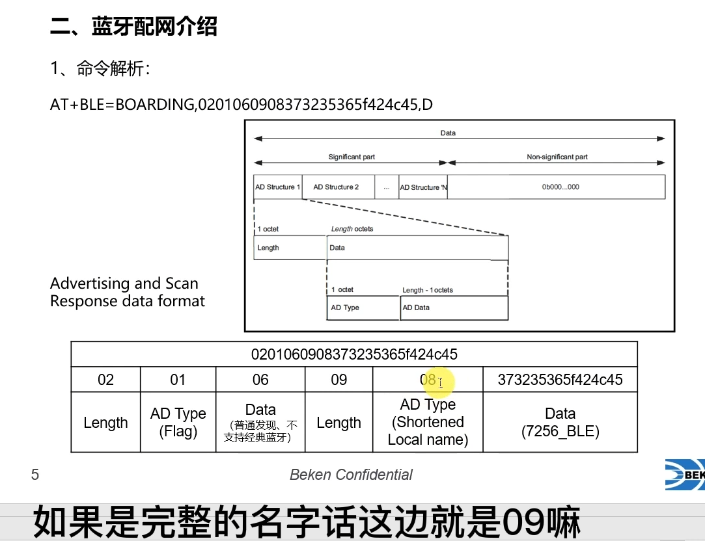  
根据SPEC上面的说明  


`bk_ble_init()`函数初始化蓝牙模块，并使能蓝牙功能。  

`bk_ble_set_notice_cb()`函数设置蓝牙通知回调函数，当蓝牙有数据需要通知时，会调用该函数。  
```c
示例：//注册 ble 事件通知回调。
   void ble_at_notice_cb(ble_notice_t notice, void *param)
{
    switch (notice) {

    case BLE_5_WRITE_EVENT: {

        if (w_req->prf_id == g_test_prf_task_id)
        {
            switch(w_req->att_idx)
            {
            case TEST_IDX_CHAR_DECL:
                break;
            case TEST_IDX_CHAR_VALUE:
                break;
            case TEST_IDX_CHAR_DESC:
                //when peer enable notification, we create time and notify peer, such as
                //write_buffer = (uint8_t *)os_malloc(s_test_data_len);
                //bk_ble_send_noti_value(s_test_data_len, write_buffer, g_test_prf_task_id, TEST_IDX_CHAR_VALUE);
                break;

            default:
                break;
            }
        }
        break;
    }
    case BLE_5_CREATE_DB:
    //bk_ble_create_db success here
    break;
    }
}

bk_ble_set_notice_cb(ble_at_notice_cb);
```
`bk_ble_create_db()`函数创建蓝牙数据库，用于保存蓝牙设备信息。  
注册 gatt 服务。
用户示例：首先，我们必须构建 test_service_db test_service_db 是 att 的数据库，用于 ble 发现。读取、写入和其他操作用于 ATT 数据库。
```c
enum {
    TEST_IDX_SVC,
    TEST_IDX_CHAR_DECL,
    TEST_IDX_CHAR_VALUE,
    TEST_IDX_CHAR_DESC,

    TEST_IDX_CHAR_DATALEN_DECL,
    TEST_IDX_CHAR_DATALEN_VALUE,

    TEST_IDX_CHAR_INTER_DECL,
    TEST_IDX_CHAR_INTER_VALUE,

    TEST_IDX_NB,
};

//att records database.

ble_attm_desc_t test_service_db[TEST_IDX_NB] = {
   //  Service Declaration
   [TEST_IDX_SVC]              = {DECL_PRIMARY_SERVICE_128, BK_BLE_PERM_SET(RD, ENABLE), 0, 0},
   // Characteristic declare
   [TEST_IDX_CHAR_DECL]    = {DECL_CHARACTERISTIC_128,  BK_BLE_PERM_SET(RD, ENABLE), 0, 0},
   // Characteristic Value
   [TEST_IDX_CHAR_VALUE]   = {{0x34, 0x12, 0},     BK_BLE_PERM_SET(NTF, ENABLE), BK_BLE_PERM_SET(RI, ENABLE) | BK_BLE_PERM_SET(UUID_LEN, UUID_16), 128},
   //Client Characteristic Configuration Descriptor
   [TEST_IDX_CHAR_DESC] = {DESC_CLIENT_CHAR_CFG_128, BK_BLE_PERM_SET(RD, ENABLE) | BK_BLE_PERM_SET(WRITE_REQ, ENABLE), 0, 0},
};
```
`bk_ble_start_advertising()`函数创建蓝牙广播，用于让蓝牙设备可以被搜索到。    

```c
ble_adv_param_t adv_param;

adv_param.own_addr_type = 0;//BLE_STATIC_ADDR
adv_param.adv_type = 0; //ADV_IND
adv_param.chnl_map = 7;
adv_param.adv_prop = 3;
adv_param.adv_intv_min = 0x120; //min
adv_param.adv_intv_max = 0x160; //max
adv_param.prim_phy = 1;// 1M
adv_param.second_phy = 1;// 1M
actv_idx = bk_ble_get_idle_actv_idx_handle();
if (actv_idx != UNKNOW_ACT_IDX) {
    bk_ble_create_advertising(actv_idx, &adv_param, ble_at_cmd_cb);
}
```

`bk_ble_set_adv_data()`函数设置广播数据，用于设置广播的名称、广播的类型、广播的UUID等。  
用户示例：
```c
const uint8_t adv_data[] = {0x02, 0x01, 0x06, 0x0A, 0x09, 0x37 0x32, 0x33, 0x31, 0x4e, 0x5f, 0x42, 0x4c, 0x45};
bk_ble_set_adv_data(actv_idx, adv_data, sizeof(adv_data), ble_at_cmd_cb);
```
必须在bk_ble_create_advertising后使用
`bk_ble_start_advretising()`函数启动广播，使蓝牙设备可以被搜索到。  

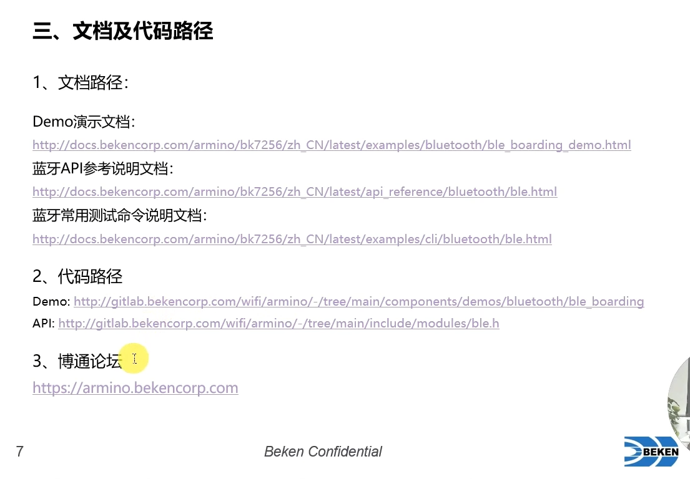


## WIFI连接过程

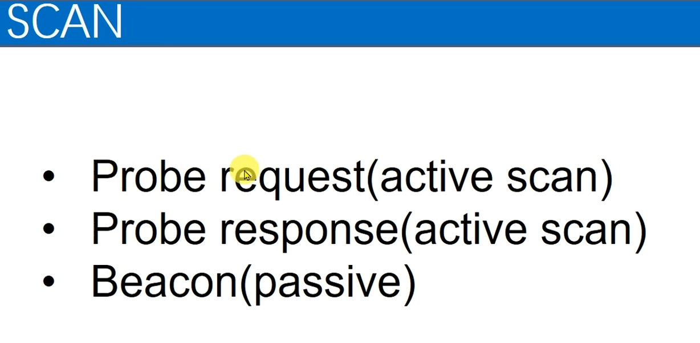
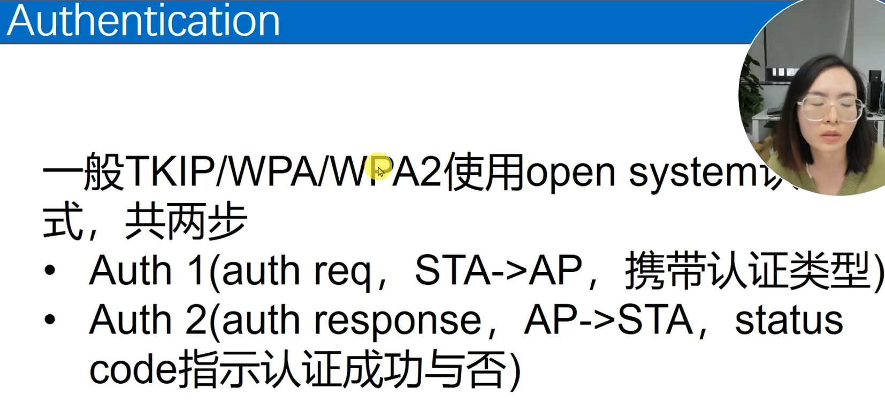
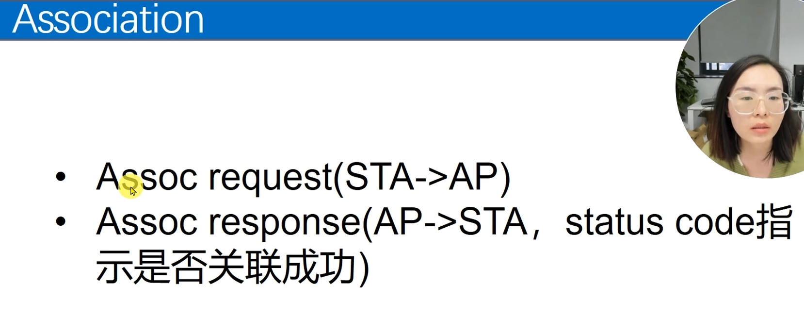
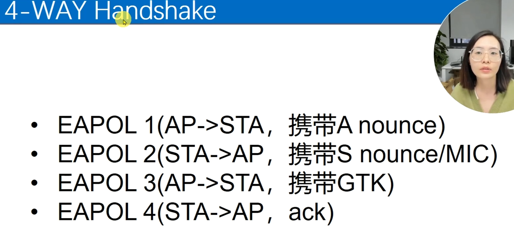


## BLE MESH  
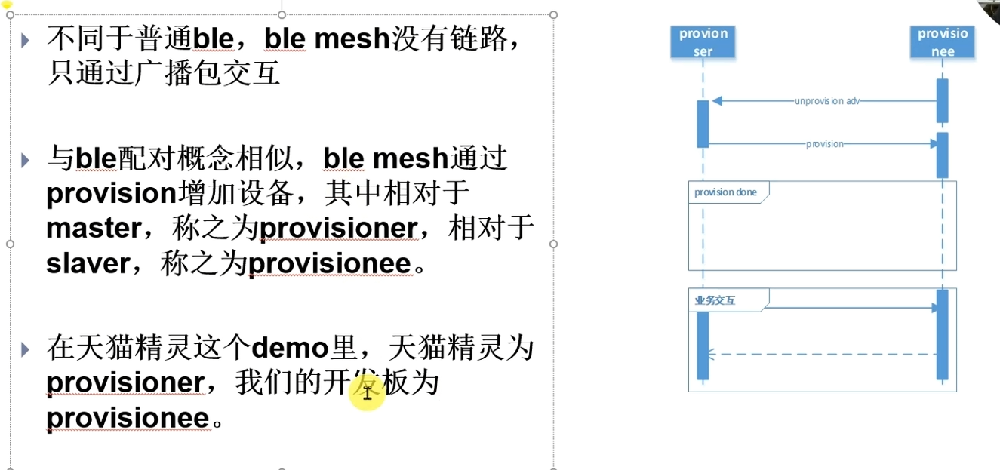
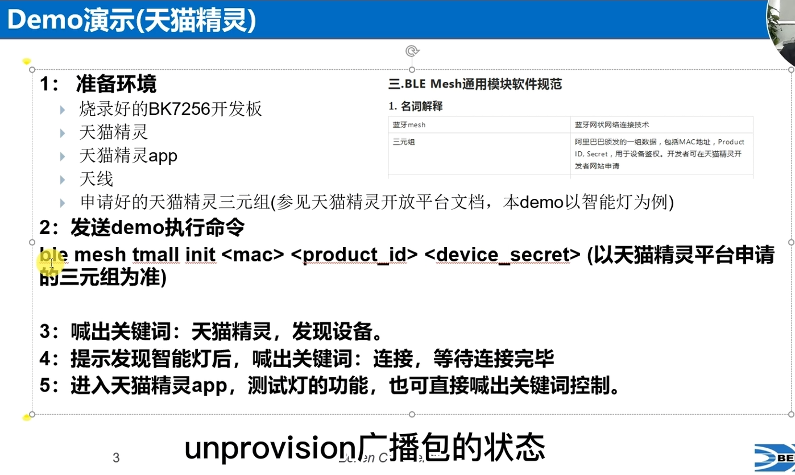
