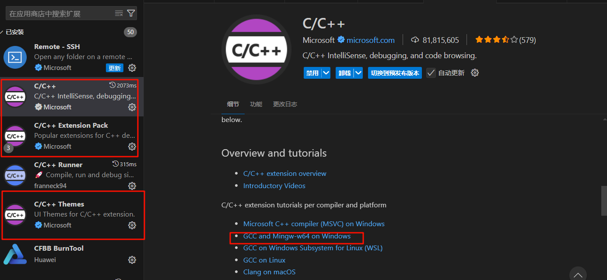
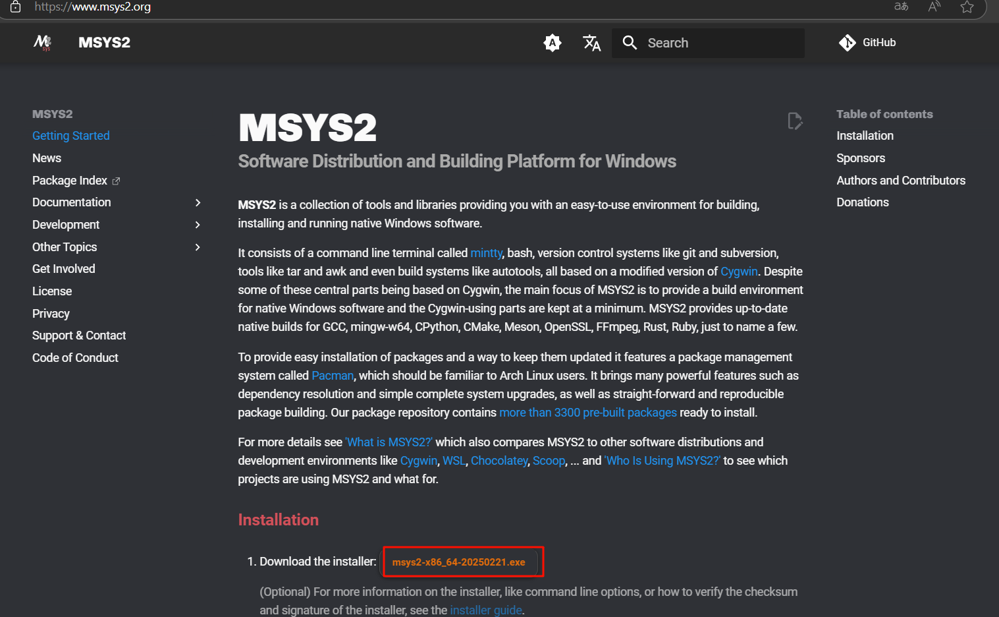
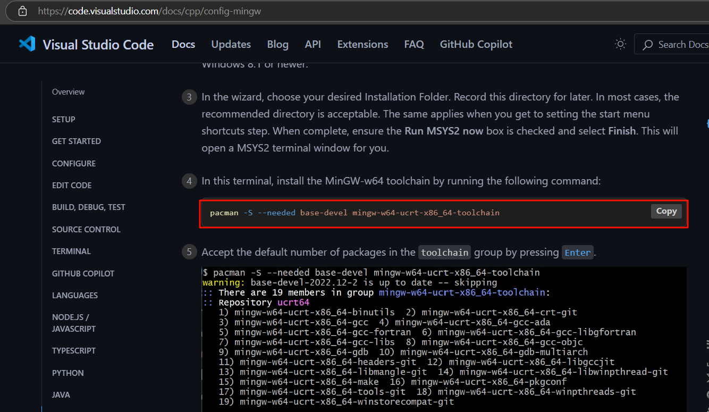
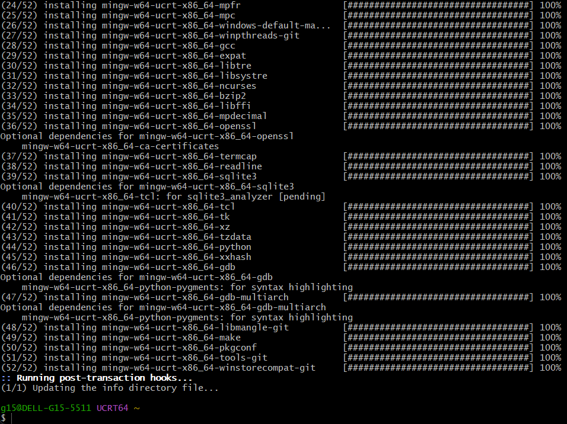
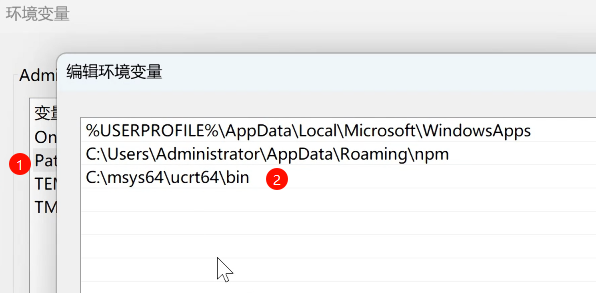

# VSCode运行C语言代码
- 安装C/C++扩展

- 安装MinGW

默认就行，不需要改路径
- 配置C/C++路径

复制这行命令
粘贴到刚刚打开的终端，不断回车需要Y输入Y。


输入验证是否成功安装
```bash
gcc --version
g++ --version
gdb --version
```

- 配置环境变量

C:\msys64\ucrt64\bin

最后VSCode右击选择RUN CODE就可以正常运行C语言代码了。
也可以使用gcc main.c -o main.exe编译，然后运行main.exe。

# 错题
将字符串赋值给指针P的数据寄存器
或者说指针P指向字符串的首地址。
    char* p = "12345";


sizeof(p) 返回指针 p 的大小，这取决于系统架构，通常是4字节（在32位系统上）或8字节（在64位系统上）。  

sizeof(*p) p是一个指向字符的指针，*p 解引用这个指针，得到的是字符 '1'。sizeof(*p) 返回的是这个字符的大小，在大多数系统中，字符的大小是1字节。  

strlen(p) 返回指针 p 所指向的字符串的长度，即5。  

# 错题2
```c
#include <stdio.h>

void main()
{

    int a[5] = {1, 2, 3, 4, 5};
    int *pstr = (int *)(&a + 1);
    printf("%d %d \n", *(a + 1), *(pstr - 1));

}
```
输出是2 5

`int (*)[5]` 是一个指向包含5个整数的数组的指针类型。让我们逐步分析这个类型：

1. `int` 表示指针指向的元素类型是整数。

2. `(*)` 表示这是一个指针。

3. `[5]` 表示这个指针指向的是一个包含5个整数的数组。

因此，`int (*)[5]` 是一个指向包含5个整数的数组的指针类型。例如，`int a[5] = {1, 2, 3, 4, 5};` 可以被声明为 `int (*p)[5] = &a;`，其中 `p` 是一个指向包含5个整数的数组的指针。

需要注意的是，`int (*)[5]` 和 `int *` 是不同的类型。`int *` 是一个指向整数的指针，而 `int (*)[5]` 是一个指向包含5个整数的数组的指针。它们不能直接进行算术运算，也不能直接赋值。

# 错题3 
```c
#include <stdio.h>
#include <string.h>
int main()
{
    for (int i = 0; i < 3; i++)
    {
        switch (i)
        {
        case 0:
            printf("%d", i);
        case 2:
            printf("%d", i);
        default:
            printf("%d", i);
        }
    }
    return 0;
}

```
switch没有break，会一直执行到case后面的语句。

# 错题4
```c
#include <stdio.h>
#include <string.h>
int main()
{

    int aa[2][5] = {1, 2, 3, 4, 5, 6, 7, 8, 9, 10};
    int *ptr1 = (int *)(&aa + 1);
    int *ptr2 = (int *)(*(aa + 1));
    printf("%d,%d", *(ptr1 - 1), *(ptr2 - 1));
    
    return 0;
}
```
输出是10 5
aa：在表达式中，二维数组名aa会隐式转换为指向其首行的指针，其类型为int (*)[5]。
aa + 1：指向二维数组aa的第二行。
*(aa + 1)：对aa + 1进行解引用，得到第二行数组的首地址，其类型为int *。
(int *)(*(aa + 1))：这里的强制类型转换实际上是多余的，因为*(aa + 1)本身就是int *类型。

# 遍历字符串
指针可以进行算术运算的特性使其可以用于遍历字符串：
```c
char* p = "12345";
while(*p != '\0') {
    printf("%c", *p);
    p++;
}
```
这个循环会一直执行，直到遇到字符串的结束符'\0'为止。在每次循环中，我们打印出当前字符，然后将指针p向后移动一个位置，指向下一个字符。这样，我们就可以遍历整个字符串了。

>char *str= "12345"和char str[]= "12345"有什么区别？
char *str= "12345"：
这是一种指针声明方式，使用指针变量str来指向一个字符串常量"12345"。
字符串常量是不可修改的，因此在这种声明方式中，str是一个指向字符串常量的指针，不能通过str来修改字符串的内容。
char str[]= "12345"：
这是一种数组声明方式，使用字符数组str来存储字符串"12345"。
数组是一个可以修改的内存块，因此在这种声明方式中，str是一个字符数组，可以通过str来修改字符串的内容。

# 冒泡排序
```c
#include <stdio.h>
int main()
{
    int a[10] = {10, 2, 3, 7, 4, 8, 6, 5, 9, 1};
    int n;
    for (int j = 0; j < 10 - 1; j++)
    {
        for (int i = 9; i > j; i--)
        {
            if (a[i] < a[i - 1])
            {

                n = a[i - 1];
                a[i - 1] = a[i];
                a[i] = n;
            }
        }
    }

// 正确输出数组元素
for(int i = 0; i < 10; i++)
{
    printf("%d ", a[i]);
}
return 0;
}

```
时间复杂度：O (n²)，适用于小规模数据。
循环设计：内层循环从后向前比较，确保每轮将最大元素移到右侧未排序部分的末尾。所以相应J循环次数减少1。
