# 置顶链接
## 官方资料
[SDK](https://gitee.com/Jieli-Tech/fw-AC63_BT_SDK)  
[ac695n_soundbox_sdk](https://gitlab.zh-jieli.com/soundbox/novisualization/ac695n_soundbox_sdk)  
[开发文档](https://doc.zh-jieli.com/AC63/zh-cn/master/getting_started/preparation/index.html)  
[芯片信息介绍](https://doc.zh-jieli.com/vue/#/docs/ac63)  
[AC63NN开发指导文档](https://www.kdocs.cn/l/cobIN9PMjvHG)  
[音频技术应用文档入口汇总](https://www.kdocs.cn/l/cpFuA4qTguho)  
[IIS音频接口应用](https://www.kdocs.cn/l/ccV9i2fG0gwq?openfrom=docs)  
[AC632N timer_pwm初始化会出现一段高电平](https://gitee.com/Jieli-Tech/fw-AC63_BT_SDK/issues/IBX3YY)  
[杰理之家论坛](http://bbs.yunthinker.com/)  
[BLE开发流程](https://www.kdocs.cn/l/ccXvkgEJkNJd)

[彩屏LVGL UI设计及工具使用](https://www.kdocs.cn/l/cu689yidv5lJ?openfrom=docs)  
[UI设计工具文档](https://doc.zh-jieli.com/JLGuiBuilder/zh-cn/master/)  
[死机分析](https://www.kdocs.cn/l/coGBef6Xm4Hq)  

[FCC工具](https://www.kdocs.cn/l/cfdMdCVtnqyZ)
[认证资料获取汇总](https://www.kdocs.cn/l/cugCGfEDWPhB)
## 其他资料
[教程1](https://zhuanlan.zhihu.com/p/568994186)  
[教程2](https://jindu-chen.github.io/2024/07/12/%E3%80%90%E6%9D%B0%E7%90%86%E3%80%91%E6%9D%B0%E7%90%86%E8%8A%AF%E7%89%87%E5%BC%80%E5%8F%91%E7%AC%94%E8%AE%B0/)  
[基于ac632n芯片实现控制ws2812b彩灯，按键控制案例视频演示](https://www.bilibili.com/video/BV1D9dFYwEK6/?share_source=copy_web&vd_source=0a59939778588b309551cce446111b0b)  
[基于ac632n芯片实现控制ws2812b彩灯，按键控制](https://gitee.com/OULIHONG1999/jieli-ac632n-ws2812b-dome.git)  
[黑马教程](https://www.yuque.com/icheima/oe12qp/pngr2k8wpe7v66i2)  
[AC632N timer_pwm初始化会出现一段高电平](https://gitee.com/Jieli-Tech/fw-AC63_BT_SDK/issues/IBX3YY)  
[三种添加用户代码的方式](https://www.codeleading.com/article/48014473513/)  
[杰理SDK-学习笔记](https://mp.weixin.qq.com/s/CSjP2vD1-PeG3cdN1YMGJA)  
[杰理SDK开发-系统功能进阶-按键配置](https://mp.weixin.qq.com/s/p7smbgRxZMPSfcioM1bevA)  
[杰理SDK开发-系统管理-模式管理与消息管理](https://mp.weixin.qq.com/s/zbpRlfwVqtEsyKLRJgbaUw)  
[云信代理文档](https://doc.yunthinker.com/#/)

## 杰理开发重点关注：board_ac635n_demo.c 、 app_config.h、app_main.c
borad.c里面定义了开发板相关的外设io口配置， app_config.h中声明了相关的功能开关

## IDE设置
## 设置中文
- [汉化包地址链接](https://pan.baidu.com/s/1Ce7oRSBIa7T4wo4_vPXjsg)  提取码：vtpt  
- 放置汉化文件：解压汉化包，会得到locale文件夹。找到 Code::Blocks 的安装目录，默认路径一般是C:\Program Files (x86)\CodeBlocks，依次进入share→CodeBlocks文件夹，将解压后的locale文件夹复制到该目录下。
- 配置语言设置：打开 Code::Blocks，依次点击Settings→Environment，在View选项下勾选Internationalization，选择Chinese(Simplified)，点击OK后重启软件，即可完成汉化。  
    
## 添加.c.h文件
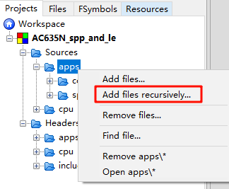    
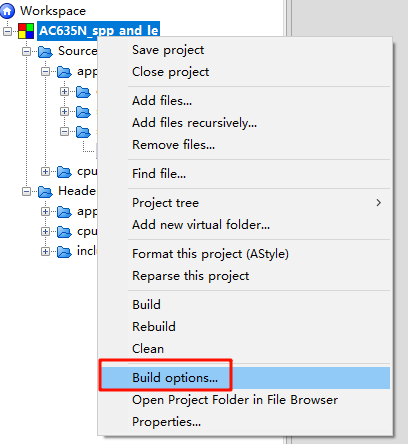    
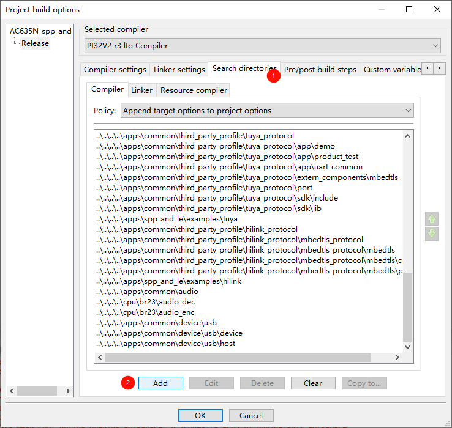    
## VSCODE设置
在VSCODE中使用Task Explorer编译的时候
在`.vscode`文件夹下查找`winmk.bat`文件，没有就创建并输入以下内容。
```c
SET SCRIPT_PATH=%~dp0%
SET PATH=%SCRIPT_PATH%\..\tools\utils;%PATH%
make "%1" -j %NUMBER_OF_PROCESSORS%
```
编译命令：
`.vscode/winmk.bat ac635n_spp_and_le`
## 开机流程


```mermaid
flowchart LR
    A[芯片启动] --> B[setup_arch]
    B --> C[driver init]
    C --> D[app_main]
    D --> E[os start]
    E --> F[app_core]

    style A fill:#f4cccc,stroke:#333,stroke-width:1px
    style B fill:#cfe2f3,stroke:#333,stroke-width:1px
    style C fill:#cfe2f3,stroke:#333,stroke-width:1px
    style D fill:#cfe2f3,stroke:#333,stroke-width:1px
    style E fill:#cfe2f3,stroke:#333,stroke-width:1px
    style F fill:#cfe2f3,stroke:#333,stroke-width:1px
```
## 打印跟踪
    log_info("%s, %s, %d", __FILE__, __FUNCTION__, __LINE__);
## 配置SDK
## 串口调试信息

    #define TCFG_UART0_ENABLE					ENABLE_THIS_MOUDLE                     //串口打印模块使能    

- 打印函数所在位置的打印
`printf("%s %s %d \\r\\n" ,__FILE__, __func__ , __LINE__) ;`
- 打开PMU的打印，复位后会打印复位源信息  
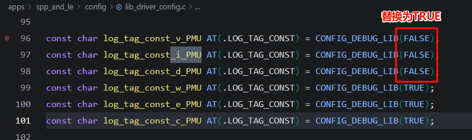    
>VDDIO POR 是首次上电，即芯片从没电到有电，从头跑  
VDDIO LVD 是电池电量不够或者VDDIO被扯，导致VDDIO 的电压低于设定的阈值，复位了  
WDT 是看门狗超时，复位了  
VCM 是芯片vcom引脚，默认的短按就会复位，就是通常板子上的reset键就是用这个脚做的。  
PPINR 是设置的长按复位脚，长按引起的复位  
SOFT RESET 是P33系统管理的复位，一般是程序里执行了复位函数，如果代码异常了，异常中断里会执行复位函数来复位芯片，比如一些非法操作：除0异常，非法地址访问等等。  
DVDD NO OK 是供电方式没有配置对，样机是DCDC供电的，但是配置成了LDO供电方式了  
POWER RETURN 软关机唤醒  
- 查看操作系统线程cpu占用率
```c
config_system_info = 1; //开启，若没有该变量可以不理会
void os_system_info_output(void); //输出信息，可以定时器5秒调用一次
void os_system_info_reset(void); //重置运行时间
```
注意：仅能查询操作系统线程的cpu占用率，此占用率不包含中断占用的cpu时间
置1`const int config_system_info   = 1;`并添加
```c
    sys_timer_add(NULL, os_system_info_output, 5000);
```

注意：如果程序使用`task_create` 函数创建任务里面会默认把任务加进记录，输出能看到对应的任务输出
`task_create(app_task_handler, NULL, "app_core");`
如果使用 `os_task_create` 是没有把该任务加进记录的此时需要调用多一条函数 ：
`void task_info_add(TaskHandle_t task) `把任务加进记录
```c
void task_info_add(TaskHandle_t task)
//demo
task_info_add(os_task_get_handle("my_task")); //my_task 为创建的任务
```

- 蓝牙协议的打印:
```c
u8 l2cap_debug_enable = 0xf0;
u8 rfcomm_debug_enable = 0xf;
u8 profile_debug_enable = 0xff;
u8 ble_debug_enable    = 0xff;
u8 btstack_tws_debug_enable = 0xf;
```
```c
//LE part
const char log_tag_const_v_LE_BB  = CONFIG_DEBUG_LIB(1);
const char log_tag_const_i_LE_BB  = CONFIG_DEBUG_LIB(1);
const char log_tag_const_d_LE_BB  = CONFIG_DEBUG_LIB(1);
const char log_tag_const_w_LE_BB  = CONFIG_DEBUG_LIB(1);
const char log_tag_const_e_LE_BB  = CONFIG_DEBUG_LIB(1);
```
- 关闭蓝牙跳频产生的日记：

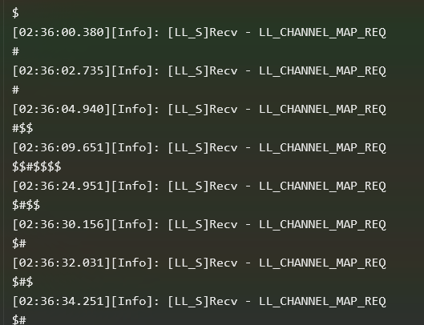
把这个改0，或者关库打印
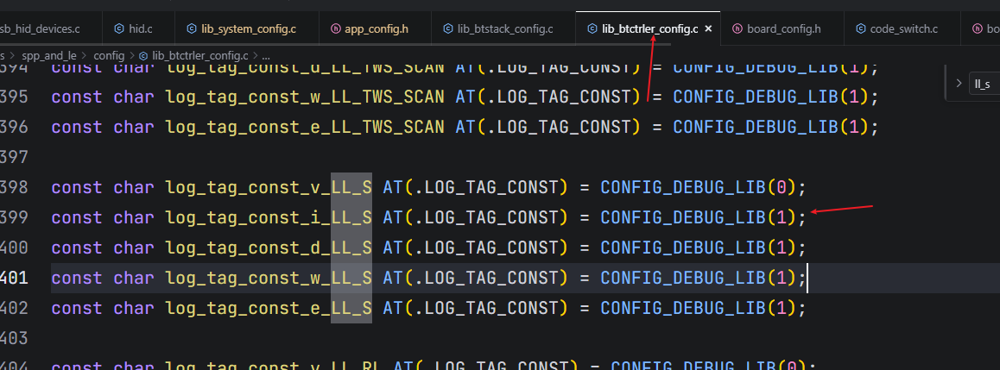

- 将LL从1设置为0 
const char log_tag_const_d_LL_E AT(.LOG_TAG_CONST) = CONFIG_DEBUG_LIB(0);
- LE_DEBUG_PRINT_EN设置为0
- 将log_tag_const_i_GATT_COMM、log_tag_const_d_GATT_COMM设置为0
- 将log_tag_const_i_GATT_SERVER、log_tag_const_d_GATT_SERVER设置为0

- 查看内存分配机制，将其取消注释（调用获取动态可用RAM的接口显示信息）
```c
extern void mem_stats(void);
static void spple_timer_handle_test(void)
{
    log_info("not_bt");
    mem_stats(); // see memory//需打开库打印,调用这个函数，就会有ram状态打印出来
    sys_timer_dump_time();
}
```
```c
//对应log会显示以下信息，physics memory size就是当前可用的malloc空间
[00:00:10.985][Debug]: [HEAP_MEM]Current free heap 56548 bytes, minimum ever free heap 56460 bytes, physics memory size 25344 bytes
```

- 时钟的打印
函数：clock_dump();需打开库打印
```c
[00:03:28.408][Debug]: [CLOCK][-------------Clock Dump-----------]
[00:03:28.416][Debug]: [CLOCK]---CHIP Ver. : 0x5e01
[00:03:28.426][Debug]: [CLOCK]--Internal OSC CLK : 24000000
[00:03:28.434][Debug]: [CLOCK]--OSC CLK : 0
[00:03:28.444][Debug]: [CLOCK]--PLL SYS CLK : 96000000
[00:03:28.452][Debug]: [CLOCK]--PLL ALNK CLK : 11294117
[00:03:28.460][Debug]: [CLOCK]---SFC CLK : 96000000
[00:03:28.468][Debug]: [CLOCK]---SPI CLK : 96000000
[00:03:28.478][Debug]: [CLOCK]---HSB CLK : 6000000
[00:03:28.486][Debug]: [CLOCK]---LSB CLK : 6000000
[00:03:28.496][Debug]: [CLOCK]---P33 CLK : 6000000
[00:03:28.504][Debug]: [CLOCK]--USB CLK : 48000000
[00:03:28.512][Debug]: [CLOCK]--AUDIO CLK : 48000000
[00:03:28.518][Debug]: [CLOCK]--UART CLK : 48000000
[00:03:28.528][Debug]: [CLOCK]--BT CLK : 48000000
[00:03:28.536][Debug]: [CLOCK]---SYS DVDD : 7
[00:03:28.544][Debug]: [CLOCK]---VDC13    : 7
[00:03:28.552][Debug]: [CLOCK]---RANGE  : 0
[00:03:28.560][Debug]: [CLOCK]---TRIM SYS DVDD : 3
[00:03:28.566][Debug]: [CLOCK]SFC_CON  : 002802b5
[00:03:28.578][Debug]: [CLOCK]SFC_QCNT  : 0000001f
[00:03:28.584][Debug]: [CLOCK]CACHE_CON  : 7ff23120
```

- 若设置扫描蓝牙广播，注意串口输出会一直输出`V~`，在`le_gatt_client.c`中注释掉putchar('V');和putchar('~');
### 删除编译宏定义~~CONFIG_RELEASE_ENABLE~~删除为 “调试版” 固件，保留为 “量产发布版” 固件
量产的时候记得恢复回去。  
    
    
> 顺便再删除无用的宏定义  
> 音频相关  
CONFIG_EQ_SUPPORT_ASYNC：启用 EQ（音效均衡器）异步处理功能，EQ 调节可在后台异步执行，不阻塞主线程。  
CONFIG_MIXER_CYCLIC：启用音频混音器的循环模式，混音器会循环处理音频数据，适配持续音频输出场景（如播放音乐）。  
CONFIG_SBC_CODEC_HW：启用 SBC 音频编解码器的硬件加速，使用芯片硬件模块处理 SBC 编码 / 解码（蓝牙音频常用），降低 CPU 占用。  
CONFIG_MSBC_CODEC_HW：启用 MSBC（增强型 SBC）音频编解码器的硬件加速，适配蓝牙语音通话场景。  
CONFIG_AEC_M=640：配置 AEC（回声消除）的缓存长度为 640 个采样点，数值决定回声消除的处理范围，需匹配音频采样率。  
蓝牙相关
CONFIG_TWS_ENABLE：启用 TWS（真无线立体声）功能，支持蓝牙耳机左右耳配对、音频同步等 TWS 核心逻辑。  

若实际编译烧录后有出入，可以修改这里  
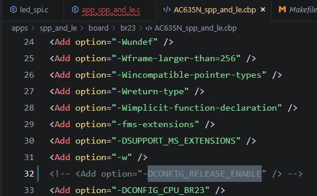  
    

如果在编译器里删除以及文件里面删除还是无法执行相关的打印。可以在#ifdef CONFIG_RELEASE_ENABLE的位置，将相关功能使能，后期代码正式版后再置为0.
- 置1开库打印，可以看到更多的打印信息，代码变大
    
        #define LIB_DEBUG    1
- 为0时会重启，为1时会打印最后运行的指针位置。
    ```c
    ///异常中断，asser打印开启
    #ifdef CONFIG_RELEASE_ENABLE
    const int config_asser         = 1;
    #else
    const int config_asser         = 1;
    #endif
    ```
- 注释掉`#define __LOG_LEVEL 0xff`，可以看到更多的打印信息
    ```c
    // #ifdef CONFIG_RELEASE_ENABLE
    // #undef __LOG_LEVEL
    // #define __LOG_LEVEL 0xff
    // #endif
    ```

## 裁剪SDK
可以在板级文件中搜索TCFG_DEC_这个宏，将不需要的音频解码关掉，节约空间~
## 在`apps\spp_and_le\modules\user_cfg.c`中
- 关闭加载用户配置

        #define USE_CONFIG_STATUS_SETTING            0        
## 在`apps/spp_and_le/include/app_config.h`中
- 使能CONFIG_APP_SPP_LE对应的工程是`apps\spp_and_le\examples\trans_data`
    
        #define CONFIG_APP_SPP_LE                 1 //SPP + LE or LE's client

## 在`apps\spp_and_le\config\lib_system_config.c`中
- 置0关闭打印时间(若置1无效果，一般需要打开库打印)
    
        const int config_printf_time         = 0;
## 在`apps/spp_and_le/board/br23/board_ac635n_demo_cfg.h`中
- 串口0配置为`IO_PORT_DP`
    
        #define TCFG_UART0_TX_PORT  				IO_PORT_DP                            //串口发送脚配置
- SPI1配置为A组, 主频80M

        #define TCFG_HW_SPI1_PORT		'A'
        #define TCFG_HW_SPI1_BAUD		80000000L
- 打开组合按键
    
        #define MULT_KEY_ENABLE						ENABLE 		//是否使能组合按键消息, 使能后需要配置组合按键映射表
- 使能IO按键，并指定IO端口
    
        #define TCFG_IOKEY_ENABLE					ENABLE_THIS_MOUDLE //是否使能IO按键
- 关闭adkey,否则一直输出`[Info]: [SPP_AND_LE]app_key_evnet: 0,9`
    
        #define TCFG_ADKEY_ENABLE                   DISABLE_THIS_MOUDLE //ENABLE_THIS_MOUDLE //是否使能AD按键
- 使能LED
    
        #define TCFG_PWMLED_ENABLE					ENABLE_THIS_MOUDLE			//是否支持PMW LED推灯模块
- 将系统时钟24M设置为240M
    
        #define TCFG_CLOCK_SYS_HZ					240000000                     //系统时钟设置
- 关闭睡眠，否则一直输出`<>`
    
        #define TCFG_LOWPOWER_LOWPOWER_SEL			0                     //SNIFF状态下芯片是否进入powerdown
- 禁用EQ配置
    
        #define TCFG_EQ_ENABLE                            0     //支持EQ功能
        #define TCFG_PC_MODE_EQ_ENABLE                    0     //pc播歌eq使能
- 禁用旋转编码器
    
        #define TCFG_CODE_SWITCH_ENABLE                   DISABLE_THIS_MOUDLE
- 自动关机时间设置为0
    
        #define TCFG_AUTO_SHUT_DOWN_TIME		          0   //没有蓝牙连接自动关机时间
- 关闭电量检测功能
    
        #define TCFG_SYS_LVD_EN 0
- 关闭EDR功能
    
        #define TCFG_USER_EDR_ENABLE                      0   //EDR功能使能
- 修改时钟切换配置（多一个0） 

        #define CONFIG_BT_NORMAL_HZ	            (24 * 10000000L)
## 在`apps\soundbox\board\br23\board_ac695x_lcd`在上方基础上
- 关闭音乐、音频线、FM、RTC、录音

        #define TCFG_APP_MUSIC_EN			        0
        #define TCFG_APP_LINEIN_EN					0
        #define TCFG_APP_FM_EN					    0
        #define TCFG_APP_RTC_EN					    0
        #define TCFG_APP_RECORD_EN				    0

- 关闭SD
  
        #define TCFG_SD0_ENABLE						DISABLE_THIS_MOUDLE
- 关闭U盘
  
        #define TCFG_UDISK_ENABLE					DISABLE_THIS_MOUDLE//U盘模块使能
- 关闭歌词显示
  
        #define TCFG_LRC_LYRICS_ENABLE              DISABLE_THIS_MOUDLE  //歌词显示
- 关闭DRC
        
        #define TCFG_DRC_ENABLE						0 	  //DRC 总使能
        #define TCFG_AUDIO_MDRC_ENABLE              0     //多带drc使能  0:关闭多带drc，  1：使能多带drc  2：使能多带drc 并且 多带drc后再做一次全带的drc
        #if TCFG_DRC_ENABLE
        #define TCFG_BT_MUSIC_DRC_ENABLE            0     //支持蓝牙音乐DRC
        #define TCFG_MUSIC_MODE_DRC_ENABLE          0     //支持音乐模式DRC
        #define TCFG_LINEIN_MODE_DRC_ENABLE         0     //支持LINEIN模式DRC
        #define TCFG_FM_MODE_DRC_ENABLE             0     //支持FM模式DRC
        #define TCFG_SPDIF_MODE_DRC_ENABLE          0     //支持SPDIF模式DRC
        #define TCFG_PC_MODE_DRC_ENABLE             0     //支持PC模式DRC
        #define TCFG_AUDIO_OUT_DRC_ENABLE			0 	  //高低音EQ后drc

- 关闭EDR功能
    
        #define TCFG_USER_BT_CLASSIC_ENABLE         0   //经典蓝牙功能使能
- 关闭经典蓝牙HFP、A2DP、AVCTP、HID、PNP
        
        #define USER_SUPPORT_PROFILE_HFP    0
        #define USER_SUPPORT_PROFILE_A2DP   0
        #define USER_SUPPORT_PROFILE_AVCTP  0
        #define USER_SUPPORT_PROFILE_HID    0
        #define USER_SUPPORT_PROFILE_PNP    0
- 关闭经典蓝牙来电报号播放

        #define BT_PHONE_NUMBER                     1   //是否播放来电报号

- 关闭music 配置
- 
        #define TCFG_DEC_G729_ENABLE                DISABLE
        #define TCFG_DEC_MP3_ENABLE					DISABLE
        #define TCFG_DEC_WMA_ENABLE					DISABLE
        #define TCFG_DEC_WAV_ENABLE					DISABLE
        #define TCFG_DEC_FLAC_ENABLE				DISABLE
        #define TCFG_DEC_APE_ENABLE					DISABLE
        #define TCFG_DEC_M4A_ENABLE					DISABLE
        #define TCFG_DEC_ALAC_ENABLE				DISABLE
        #define TCFG_DEC_AMR_ENABLE					DISABLE
        #define TCFG_DEC_DTS_ENABLE					DISABLE
        #define TCFG_DEC_SBC_ENABLE					DISABLE
        #define TCFG_DEC_PCM_ENABLE					DISABLE
        #define TCFG_DEC_CVSD_ENABLE				DISABLE

- 关闭fm 配置
- 
        #define TCFG_FM_INSIDE_ENABLE					DISABLE
- 关闭SPDIF & ARC 配置

        #define TCFG_SPDIF_OUTPUT_ENABLE                DISABLE
        #define TCFG_HDMI_ARC_ENABLE                    DISABLE
- 关闭encoder 配置  

        #define TCFG_ENC_CVSD_ENABLE               DISABLE
        #define TCFG_ENC_MSBC_ENABLE               DISABLE
        #define TCFG_ENC_G726_ENABLE               DISABLE
        #define TCFG_ENC_MP3_ENABLE                DISABLE
        #define TCFG_ENC_ADPCM_ENABLE              DISABLE
        #define TCFG_ENC_PCM_ENABLE                DISABLE
        #define TCFG_ENC_SBC_ENABLE                DISABLE
- 关闭电池检测功能

        #define BT_SUPPORT_DISPLAY_BAT              0   //是否使能电量检测
- 关闭fat 文件系统配置

        #define CONFIG_FATFS_ENABLE					DISABLE
## 在`apps\spp_and_le\board\br23\board_ac635n_demo_global_build_cfg.h`中
- 勾选OTA
    
        #define CONFIG_APP_OTA_ENABLE                   1       //是否支持RCSP升级(JL-OTA)
- NVS部分
    
        #define CONFIG_VM_LEAST_SIZE                    16K
可以根据需要调整NVS的大小, 这里将原本8K设置为16K。
> sdk已经做好机制，双备份存储，循环写方式，擦除均衡机制。
区域大小 #define CONFIG_VM_LEAST_SIZE 8K //必须按照8K的倍数递增
最小只能定8K，假如定8K大小，实际最大只能存4K数据，最好是定义16K以上的。
理想大小：用户存储的数据量 * 4  
    
修改VM区大小，需要修改2个地方，CONFIG_VM_LEAST_SIZE 和 图片位置保持一致
```c 
//VM使用规范
//读写flash，不可在hi_timer跟中断函数调用
//VM区域大小 #define CONFIG_VM_LEAST_SIZE      8K //按照8K的倍数
//syscfg_id.h    vm的id取值范围：CFG_USER_DEFINE_BEGIN(1) - CFG_USER_DEFINE_END(49)
//user_cfg_id.h  部分应用用了其中几个值，注意不要重叠
//syscfg_read、syscfg_write返回值：负值对应VM_ERR，正常值就是最后一个参数的值
//vm id不够用时，将几个变量整合成一个结构体的形式

#define CFG_USER_VAR	 2
#define CFG_USER_BUF	 3
#define CFG_USER_STRUCT	 4

typedef struct{
    u32 var1;
    u32 var2;
}var_struct;

static u32 var;
static u8 buf[512]  __attribute__((aligned(4)));
static var_struct var_t;

void vm_op_demo(void)
{
    log_info("%s", __func__);
    int ret = 0;
    //变量形式
    var = 0;
    ret = syscfg_read(CFG_USER_VAR, &var, sizeof(u32)); //变量的数据类型
    log_info("%s[CFG_USER_VAR -> syscfg_read:%d]", __func__, ret);
    if(ret != sizeof(u32)){
        log_error("CFG_USER_VAR -> syscfg_read -> err:%d", ret);
    }else{
        log_info("CFG_USER_VAR:%d", var);
    }
    var++;
    ret = syscfg_write(CFG_USER_VAR, &var, sizeof(u32)); //变量的数据类型
    log_info("%s[CFG_USER_VAR -> syscfg_write:%d]", __func__, ret);
    if(ret != sizeof(u32)){
        log_error("CFG_USER_VAR -> syscfg_write -> err:%d", ret);
    }

    //数组形式
    memset(buf, 0x00, sizeof(buf));
    ret = syscfg_read(CFG_USER_BUF, buf, sizeof(buf));
    log_info("%s[CFG_USER_BUF -> syscfg_read:%d]", __func__, ret);
    if(ret != sizeof(buf)){
        log_error("CFG_USER_BUF -> syscfg_read -> err:%d", ret);
    }else{
        log_info_hexdump(buf, sizeof(buf));
    }
    buf[0]++;
    memset(buf, buf[0], sizeof(buf));
    ret = syscfg_write(CFG_USER_BUF, buf, sizeof(buf));
    log_info("%s[CFG_USER_BUF -> syscfg_write:%d]", __func__, ret);
    if(ret != sizeof(buf)){
        log_error("CFG_USER_BUF -> syscfg_write -> err:%d", ret);
    }

    //结构体形式
    var_t.var1 = 0;
    var_t.var2 = 0;
    ret = syscfg_read(CFG_USER_STRUCT, &var_t, sizeof(var_struct));
    log_info("%s[CFG_USER_STRUCT -> syscfg_read:%d]", __func__, ret);
    if(ret != sizeof(var_struct)){
        log_error("CFG_USER_STRUCT -> syscfg_read -> err:%d", ret);
    }else{
        log_info("CFG_USER_STRUCT:%d %d", var_t.var1, var_t.var2);
    }
    var_t.var1++;
    var_t.var2++;
    ret = syscfg_write(CFG_USER_STRUCT, &var_t, sizeof(var_struct));
    log_info("%s[CFG_USER_STRUCT -> syscfg_write:%d]", __func__, ret);
    if(ret != sizeof(var_struct)){
        log_error("CFG_USER_STRUCT -> syscfg_write -> err:%d", ret);
    }
}
```
## 烧录
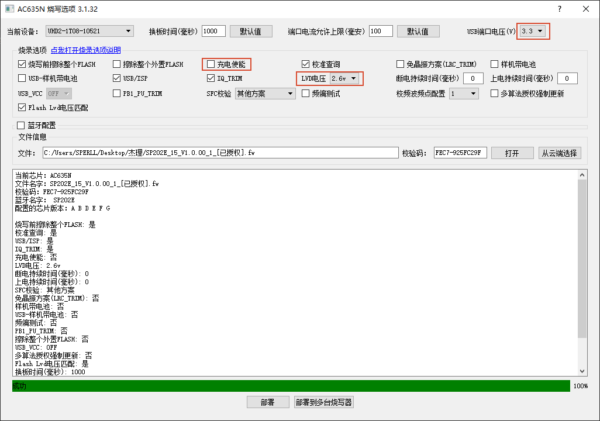
保持图片上一致。确定红色方框内修改正确
## 其他
刘工设置的任务大小：
```c
const struct task_info task_info_table[] = {
#if CONFIG_APP_FINDMY
    {"app_core",            1,     0,   640 * 2,   128  },
#else
    {"app_core", 1, 0, 1024, 128},
#endif

    {"sys_event", 7, 0, 512, 0},
    {"btctrler", 4, 0, 512, 256},
    {"btencry", 1, 0, 512, 128},
    {"btstack", 3, 0, 1024, 256},
    {"systimer", 7, 0, 512, 0},
    {"update", 1, 0, 512, 0},
    {"dw_update", 2, 0, 256, 128},
```
参数（从左到右）：
• 任务名 (名字长度不能超过configMAX_TASK_NAME_LEN字节)
• 任务优先级（0-7，越大优先级高，优先级数量由configMAX_PRIORITIES决定）
• 任务运行的位置（0：CPU0  1：CPU1）
• 任务的堆栈大小, 单位(u32)
• 任务的queue大小，单位(byte)

## 杰理SDK编程要点
## 新建任务-- 自定义消息池-- 信号量调度
新建一个c文件，复制这段代码进去
```c
#include "board_config.h"
#include "system/includes.h"
#include "asm/power_interface.h"
#include "app_config.h"

#undef _DEBUG_H_
#define LOG_TAG_CONST       CASE_TASK
#define LOG_TAG             "[CASE_TASK]"
#include "debug.h"
#define LOG_v(t)  log_tag_const_v_ ## t
#define LOG_i(t)  log_tag_const_i_ ## t
#define LOG_d(t)  log_tag_const_d_ ## t
#define LOG_w(t)  log_tag_const_w_ ## t
#define LOG_e(t)  log_tag_const_e_ ## t
#define LOG_c(t)  log_tag_const_c_ ## t
#define LOG_tag(tag, n) n(tag)
const char LOG_tag(LOG_TAG_CONST,LOG_v) AT(.LOG_TAG_CONST) = 0;
const char LOG_tag(LOG_TAG_CONST,LOG_i) AT(.LOG_TAG_CONST) = 1;
const char LOG_tag(LOG_TAG_CONST,LOG_d) AT(.LOG_TAG_CONST) = 0; //log_debug
const char LOG_tag(LOG_TAG_CONST,LOG_w) AT(.LOG_TAG_CONST) = 1;
const char LOG_tag(LOG_TAG_CONST,LOG_e) AT(.LOG_TAG_CONST) = 1;
const char LOG_tag(LOG_TAG_CONST,LOG_c) AT(.LOG_TAG_CONST) = 1;

//系统接口返回值错误码 #include "os/os_error.h"

//新建任务方式,任务有2种驱动方式
//1、发消息事件 来驱动
//2、信号量    来驱动
#define TASK_RUN_MSG      0x01 //消息
#define TASK_RUN_SEM      0x02 //信号量
#define TASK_RUN_WAY      TASK_RUN_MSG //TASK_RUN_SEM //
//消息大小限制
#define MAX_MSG      (16)                    //固定不能改大
#define MAX_BUF      ((MAX_MSG - 2) * 4 - 1) //固定不能改大

//任务的参数定义
#define CASE_TASK_NAME   "case_task" //小于11个字节
#define CASE_TASK_PRIO   2        //任务优先级：1-3
#define CASE_TASK_STACK  512      //任务栈大小：128*n <= 1024
#define CASE_TASK_QSIZE  256      //任务消息池大小：128*n <= 1024

typedef enum{
    CASE_TASK_MSG_0 = 0,
    CASE_TASK_MSG_1,
}CASE_TASK_MSG;

static int case_task_msg_deal(CASE_TASK_MSG msg, u8 *buf, u8 len)
{
    log_info("%s[msg:%d len:%d]", __func__, msg, len);
    int ret = 0;
    switch (msg) {
    case CASE_TASK_MSG_0:
        log_info("CASE_TASK_MSG_0");
        break;
    case CASE_TASK_MSG_1:
        log_info("CASE_TASK_MSG_1");
        log_info_hexdump(buf, len);
        break;
    default:
        break;
    }
    return ret;
}

static int case_task_post_msg(CASE_TASK_MSG msg, u8 *buf, u8 len)
{
    log_info("%s[msg:%d len:%d]", __func__, msg, len);
    int ret = OS_NO_ERR;
    if(buf == NULL){
        ret = os_taskq_post_msg(CASE_TASK_NAME, 1, msg);
    }else{
        if(len > MAX_BUF){
            ret = -1;
            goto _post_end;
        }
        log_debug_hexdump(buf, len);
        static u8 data[MAX_BUF + 5] ALIGNED(4);
        memset(data, 0x00, sizeof(data));
        data[4] = len;
        memcpy(data + 5, buf, len);
        ((u32 *)data)[0] = msg;
        ret = os_taskq_post_type(CASE_TASK_NAME, Q_MSG, MAX_MSG - 1, data);
    }
_post_end:
    if(ret) log_error("%s[ret:%d]", __func__, ret);
    return ret;
}

static int case_task_sem_deal(void)
{
    int ret = OS_NO_ERR;
    log_info("%s", __func__);

    //跑一些耗时操作

    return ret;
}

static OS_SEM case_task_sem;
static int case_task_post_sem(void)
{
    int ret = OS_NO_ERR;
    log_info("%s", __func__);
    ret = os_sem_post(&case_task_sem);
    if(ret) log_error("%s[ret:%d]", __func__, ret);
    return ret;
}

static void case_task(void *p)
{
#if (TASK_RUN_WAY == TASK_RUN_MSG)
    int ret = 0;
    u32 msg[MAX_MSG];
    while (1) {
        clr_wdt();
        memset(msg, 0x00, sizeof(msg));
        ret = os_taskq_pend("taskq", msg, ARRAY_SIZE(msg));
        if (ret != OS_TASKQ) {
            continue;
        }
        if (msg[0] != Q_MSG) {
            continue;
        }
        log_debug("%s[enter_msg:0x%x]", __func__, msg[1]);
        u8 *buf = (u8 *)(msg + 2);
        ret = case_task_msg_deal(msg[1], buf + 1, buf[0]);
        log_debug("%s[exit_msg:0x%x -> ret:%d]", __func__, msg[1], ret);
    }
#endif
#if (TASK_RUN_WAY == TASK_RUN_SEM)
    int ret = 0;
    while (1) {
        clr_wdt();
        ret = os_sem_pend(&case_task_sem, 0);
        /* os_sem_set(&case_task_sem, 0); */
        log_debug("%s[os_sem_pend -> ret:%d]", __func__, ret);
        ret = case_task_sem_deal();
        log_debug("%s[case_task_sem_deal -> ret:%d]", __func__, ret);
    }
#endif
}
int case_task_init(void)
{
    log_info("%s[MAX_BUF:%d]", __func__, MAX_BUF);
    int ret = OS_NO_ERR;
    os_sem_create(&case_task_sem, 0);
    os_sem_set(&case_task_sem, 0);
    /* ret = task_create(case_task, NULL, CASE_TASK_NAME); */
    ret = os_task_create(case_task, NULL, CASE_TASK_PRIO,
                         CASE_TASK_STACK, CASE_TASK_QSIZE, CASE_TASK_NAME);
    if(ret != OS_NO_ERR)
        log_error("%s %s create fail 0x%x", __func__, CASE_TASK_NAME, ret);
    return ret;
}

int case_task_delete(void)
{
    int ret = OS_NO_ERR;
    ret = task_kill(CASE_TASK_NAME);
    log_info("%s[task_kill(%s):%d]", __func__, CASE_TASK_NAME, ret);
    return ret;
}

///测试函数
static void case_task_loop(void *priv)
{
#if (TASK_RUN_WAY == TASK_RUN_MSG)
    static u32 cnt = 0;
    if(cnt > MAX_BUF){
        return;
    }
    if(cnt == MAX_BUF){
        case_task_delete();
    }
    cnt++;
#if 0
    log_info("只发消息---不带参数");
    case_task_post_msg(CASE_TASK_MSG_0, NULL, 0);
#else
    log_info("发消息---并带一个buf数组");
    u8 buf[MAX_BUF];
    memset(buf, 0x00, sizeof(buf));
    for(u8 i = 0;i < sizeof(buf);i++){
        buf[i] = 0x10 + i;
    }
    case_task_post_msg(CASE_TASK_MSG_1, buf, cnt);
#endif
#endif
}
static void case_task_hi_loop(void *priv)
{
#if (TASK_RUN_WAY == TASK_RUN_SEM)
    case_task_post_sem();
#endif
}

int case_task_test(void)
{
    log_info("%s", __func__);
    case_task_init();
    sys_timer_add(NULL, case_task_loop, 1000 * 1);
    /* sys_s_hi_timer_add(NULL, case_task_hi_loop, 1000 * 5); */
    /* sys_hi_timer_add(NULL, case_task_hi_loop, 4); */
}

```

✅ 代码结构全图（非常重要）
```scss
case_task_init()
    └── 创建任务 case_task()
         └── while(1) 等待消息 os_taskq_pend()
              └── case_task_msg_deal() 处理消息:任务收到消息后如何处理就在这里写你的逻辑。

case_task_post_msg()      <-- 主动发消息
case_task_post_sem()      <-- 主动发信号量(切换模式后生效)
case_task_delete()        <-- 删除任务

case_task_test()          <-- 示例：每秒发一次消息
```

用“发送消息”驱动任务
系统队列消息是：
msg[0] = Q_MSG
msg[1] = 自定义消息ID
msg[2] ~ msg[15] = buf 数据

发送不带参数的消息
os_taskq_post_msg(CASE_TASK_NAME, 1, msg);
发送带 buf 的消息
os_taskq_post_type(CASE_TASK_NAME, Q_MSG, MAX_MSG - 1, data);

| data[0..3] | data[4] | data[5..] |
| ---------- | ------- | --------- |
| msg ID     | 长度len   | 实际数据buf   |

## 转事件到最低优先级线程执行
对执行位置有限制的函数
- 关机函数
spple_set_soft_poweroff();
hidkey_set_soft_poweroff();
power_set_soft_poweroff();等等
- 播放提示音
tone_play(TONE_BT_MODE, 1);
- 写flash
syscfg_write();
fwrite();
### 需要转事件到最低优先级执行

```c
#define KEY_EVENT_FROM_TMR      (('T' << 24) | ('M' << 16) | ('R' << 8) | '\0')
void timer_event_to_key(u16 event, u32 value)
{
    struct sys_event e;
    e.type = SYS_KEY_EVENT;
    e.arg  = (void *)KEY_EVENT_FROM_TMR;
    e.u.key.event = event;
    e.u.key.value = value;
    sys_event_notify(&e);
}
static void timer_event_handler(struct sys_event *e)
{
    int ret = 0;
    if ((u32)e->arg == KEY_EVENT_FROM_TMR) {
        u16 event = e->u.key.event;
        u32 value = e->u.key.value;
        log_info("%s[event:%d value:%d]", __func__, event, value);
        switch(event)
        {
        case 1:
            spple_set_soft_poweroff();  //关机函数，必须放最低优先级线程执行
            break;
        case 2:
            tone_play(TONE_BT_MODE, 1); //播放提示音，放最低优先级线程执行
            break;
        case 3:
            u32 var;
            #define CFG_USER_VAR	 2
            ret = syscfg_write(CFG_USER_VAR, &var, sizeof(u32));
            break;
        }
    }
}

timer_event_handler(event);

timer_event_to_key(1, 0);

```
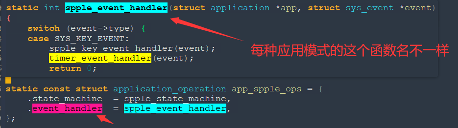    
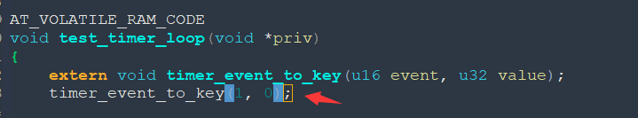    
## 实现推送某个函数到指定任务执行
```c
//不带参数的函数
static void callback_func_no_param(void)
{
    printf("%s\n", __func__);
}

//带1个参数的函数
static void callback_func_1_param(int mode)
{
    printf("%s %d\n", __func__, mode);
    bt_set_low_latency_mode(mode);
}

//带2个参数的函数
static void callback_func_2_param(int mode, int eq)
{
    printf("%s %d %d\n", __func__, mode, eq);
    bt_set_low_latency_mode(mode);
    eq_mode_set(eq);
}

//带1个指针参数的函数，可以间接做n个参数的回调
static void callback_func_n_param(int *param)
{
    //取出参数
    int param_num = param[0];
    int mode = param[1];
    int eq = param[2];
    int vbat = param[3];
    printf("%s %d %d %d %d\n", __func__, param_num, mode, eq, vbat);
    bt_set_low_latency_mode(mode);
    eq_mode_set(eq);
    chargestore_set_power_level(vbat);
    free(param);
}

//带1个指针参数的函数，传参是内存地址或者字符串地址
static void callback_func_1_pointer(int *pointer)
{
    u8 *path = (u8 *)pointer;
    printf("%s %x\n", __func__, path);
    tone_play(path, 1);
}

//推送某个函数到指定任务(如"app_core")执行
static void func_callback_in_task(void)
{
    int err;
    int msg[5];
    
    //推送不带参数的函数到app_core任务
    msg[0] = (int) callback_func_no_param;
    msg[1] = 0;//函数无需参数
    err = os_taskq_post_type("app_core", Q_CALLBACK, 2, msg);

    //推送带1个参数的函数到app_core任务
    msg[0] = (int) callback_func_1_param;
    msg[1] = 1;//函数需要1个参数
    msg[2] = 0;//对应参数 mode
    err = os_taskq_post_type("app_core", Q_CALLBACK, 3, msg);

    //推送带2个参数的函数到app_core任务
    msg[0] = (int) callback_func_2_param;
    msg[1] = 2;//函数需要2个参数
    msg[2] = 0;//对应第一个参数 mode
    msg[3] = 1;//对应第二个参数 eq
    err = os_taskq_post_type("app_core", Q_CALLBACK, 4, msg);

    //推送带1个指针参数的函数到app_core任务，参数是指针，可以实现n个参数的等效传参
    int *param = malloc(4 * sizeof(int));
    param[0] = 3;
    param[1] = 0;
    param[2] = 1;
    param[3] = 55;//申请内存存放要传递的参数
    msg[0] = (int) callback_func_n_param;
    msg[1] = 1;//函数需要1个参数
    msg[2] = (int)param;//对应参数 param
    err = os_taskq_post_type("app_core", Q_CALLBACK, 3, msg);

    //推送带1个指针参数的函数到app_core任务
    msg[0] = (int) callback_func_1_pointer;
    msg[1] = 1;//函数需要1个参数
    msg[2] = (int)TONE_BT_CONN;//对应参数 pointer
    err = os_taskq_post_type("app_core", Q_CALLBACK, 3, msg);

    printf("%s %d\n", __func__, err);
}

```

## 注册软件定时器不耗费硬件定时器（sys_timer_add、sys_timeout_add，sys_s_hi_timer_add）规范写法
### 介绍
系统默认使用了 timer1 为系统 1ms 时钟定时用，所有的软件定时器都基于这个 timer1 拓展出来。  
拓展出 2 种定时器使用方式：  

1. 在中断函数回调执行(切记不可调用延时、耗时、关机、写VM、写flash等操作)  
`sys_hi_timer_add()` 定时循环函数，会导致不进低功耗，直到主动删除  
`sys_hi_timeout_add()` 定时超时执行一次函数  
`sys_s_hi_timer_add()` 定时循环函数，不影响系统进低功耗，周期会变，建议使用此种定时器  
`sys_s_hi_timerout_add()` 定时超时执行一次函数  
注意点：此种定时器，注册的函数是在中断函数里面回调的，不可添加延时、耗时、关机、写flash、写VM的操作。  
要保证回调函数尽快返回，函数执行时间小于0.5ms  
单位是 ms， 但是是以 1ms 步进的。  
2. 在系统线程中执行， 几乎可执行所有的操作  
`sys_timer_add()` 定时循环函数，会影响下次进低功耗的时间点，周期太短会影响功耗。  
`sys_timeout_add()` 定时超时执行一次函数  
注意点：此种定时器，注册的函数是在线程执行的，优先级依赖于注册的线程的优先级。  
单位是 ms，但是是以 10ms 步进的。5ms 等同于 10ms 的。系统是以 10ms 为系统滴答的。  
3. 2种定时器不可嵌套使用  
由于2种定时器的回调函数，不在同一个地方执行，也不是顺序执行。  
hi_timer的回调函数，可以打断，sys_timer的回调函数。  
因此禁止以下使用方式：  
hi_timer的回调函数，禁止：注册、删除、修改sys_timer定时器  
sys_timer的回调函数，修改hi_timer定时器，注意临界操作。  
`local_irq_disable();`  
`local_irq_enable();`

### 规范写法
循环定时器写法  
```c
static u16 timer_loop = 0;

static void timer_loop_func(void *priv)
{
    static u8 cnt = 0;
    cnt++;
    log_info("%s[cnt:%d]", __func__, cnt);
}
void timer_loop_init(void)
{
    log_info("%s[id:%d]", __func__, timer_loop);
    if(timer_loop){
        sys_timer_del(timer_loop);//注册前,要判断是否注册过
        timer_loop = 0;
    }
    timer_loop = sys_timer_add(NULL, timer_loop_func, 5 * 1000); //ms单位
}
void timer_loop_del(void)
{
    log_info("%s[id:%d]", __func__, timer_loop);
    if(timer_loop){
        sys_timer_del(timer_loop);//删除前要判断
        timer_loop = 0;//删除后记得清0
    }
}
```
单次定时器写法  
```c
static u16 timer_one  = 0;

static void timer_one_func(void *priv)
{
    static u8 cnt = 0;
    cnt++;
    log_info("%s[cnt:%d]", __func__, cnt);
    //sys_timeout_add注册的只会执行一次,底层会自动删除
    //回调函数内不可调用sys_timeout_del
    timer_one = 0;//ID号清0,必须要有！！！
}
void timer_one_init(void)
{
    log_info("%s[id:%d]", __func__, timer_one);
    if(timer_one){
        sys_timeout_del(timer_one);//注册前,要判断是否注册过
        timer_one = 0;
    }
    timer_one = sys_timeout_add(NULL, timer_one_func, 5 * 1000);//ms单位
}
void timer_one_del(void)
{
    log_info("%s[id:%d]", __func__, timer_one);
    if(timer_one){
        sys_timeout_del(timer_one);
        timer_one = 0;
    }
}
```

## [sys_timer与usr_timer定时器]
sys_timer与usr_timer定时器各接口详细查看timer.h文件
1. sys_timer由systimer线程提供时基，在哪个线程中add的sys_timer定时(如sys_timer_add)，systimer线程中的定时时基到了，就由systimer线程发出事件通知对应的add线程执行回调函数（sys_timer系统定时器最小精度为10ms，该定时适用于某些不能在中断里面执行并且定时间隔较长的定时任务）
2. usr_timer定时器是由硬件定时器timer1提供的时基， 在其他线程add的usr_timer，在硬件定时器中时基到时，在硬件定时器定时中断中执行回调函数（所以回调函数不能写的过长），相对于sys_timer定时时基更加准确；并且使用usr_timer定时器时，不建议关闭系统总中断（会影响usr_timer硬件定时器中断执行回调函数）


## 延时方式汇总
1. 指令数延时（浪费cpu资源）
```c
void delay(unsigned int);
```
`delay(100); //执行100个nop`
受系统频率影响，同样的语句，实际延时时间波动很大

2. 按照系统时钟换算指令数延时（浪费cpu资源）
```c
// 小于10us的执行不精准，不同系统频率下需要自行调整div值
AT_VOLATILE_RAM_CODE
void delay_us_by_nop(u32 usec) 
{
    u32 sys = clk_get("sys");
    u32 cnt, div;
    if(usec == 1)     {  div = 30;}
    else if(usec == 2){  div = 12;}
    else if(usec == 3){  div = 8; }
    else if(usec < 10){  div = 6; }
    else              {  div = 5; }
    cnt = usec * (sys / 1000000L / div);
    while(cnt--){ asm volatile("nop"); }
}
```
`int clk_set_sys_lock(int clk, int lock_en);`
`extern void clk_set_en(u8 en);`
`clk_set_en(0);`
可执行此函数，锁住系统频率不被修改。

3. 定时器计算延时（浪费cpu资源）延时要大于5us
函数是AC632 - BD19的寄存器写法，其他芯片参考sdk对应工程的写法
```c
//有概率会被中断打断，导致延时变大
AT_VOLATILE_RAM_CODE
void delay_us_by_timer0(u32 usec)
{
    usec -= 2;  //usec > 5,减掉此函数执行本身的耗时，48M->2us，24M->5us
    JL_TIMER0->CON = BIT(14);
    JL_TIMER0->CNT = 0;
    JL_TIMER0->PRD = clk_get("lsb") / 2 / 1000000L * usec;
    JL_TIMER0->CON = BIT(0) | BIT(6); //lsb clk 2分频
    while ((JL_TIMER0->CON & BIT(15)) == 0);
    JL_TIMER0->CON = BIT(14);
}

//关中断，临界区延时
AT_VOLATILE_RAM_CODE
void delay_us_by_timer0_irq(u32 usec)
{
    usec -= 2;  //usec > 5,减掉此函数执行本身的耗时，48M->2us，24M->5us
    local_irq_disable();
    JL_TIMER0->CON = BIT(14);
    JL_TIMER0->CNT = 0;
    JL_TIMER0->PRD = clk_get("lsb") / 2 / 1000000L * usec;
    JL_TIMER0->CON = BIT(0) | BIT(6); //lsb clk 2分频
    while ((JL_TIMER0->CON & BIT(15)) == 0);
    JL_TIMER0->CON = BIT(14);
    local_irq_enable();
}

//ms级延时，一般要求不需要精准，不用加关中断
AT_VOLATILE_RAM_CODE
void delay_ms_by_timer0(u32 msec)
{
    JL_TIMER0->CON = BIT(14);
    JL_TIMER0->CNT = 0;
    JL_TIMER0->PRD = clk_get("lsb") / 64 / 1000L * msec;
    JL_TIMER0->CON = BIT(0) | BIT(5) | BIT(4); //lsb clk 64分频
    while ((JL_TIMER0->CON & BIT(15)) == 0);
    JL_TIMER0->CON = BIT(14);
}
```
4. 系统调度延时（不浪费CPU资源）单位：10ms
```c
void os_time_dly(int time_tick);
```
`os_time_dly(1); //参数1，即延时10ms，会切出当前任务，执行其他任务`  
小于10ms的延时方式，都会浪费CPU资源。
任务调度延时，只有10ms单位的，改不了 <10ms 的单位。
>小于1ms的定时器，整个过程设计的函数，变量都要定义到ram里面运行
## 查看当前在哪个线程运行
```c
/* --------------------------------------------------------------------------*/
/**
 * @brief 获取当前任务名
 *
 * @return 当前任务名
 */
/* ----------------------------------------------------------------------------*/
const char *os_current_task();
```
## 判断当前CPU是否处于中断中
判断`cpu_in_irq()`的返回值，0是不在中断中，非0则在中断中
## 判断当前CPU是否关闭了中断
判断`cpu_irq_disabled()`的返回值，0是没关中断，非0则关闭了中断

## 更改蓝牙名称
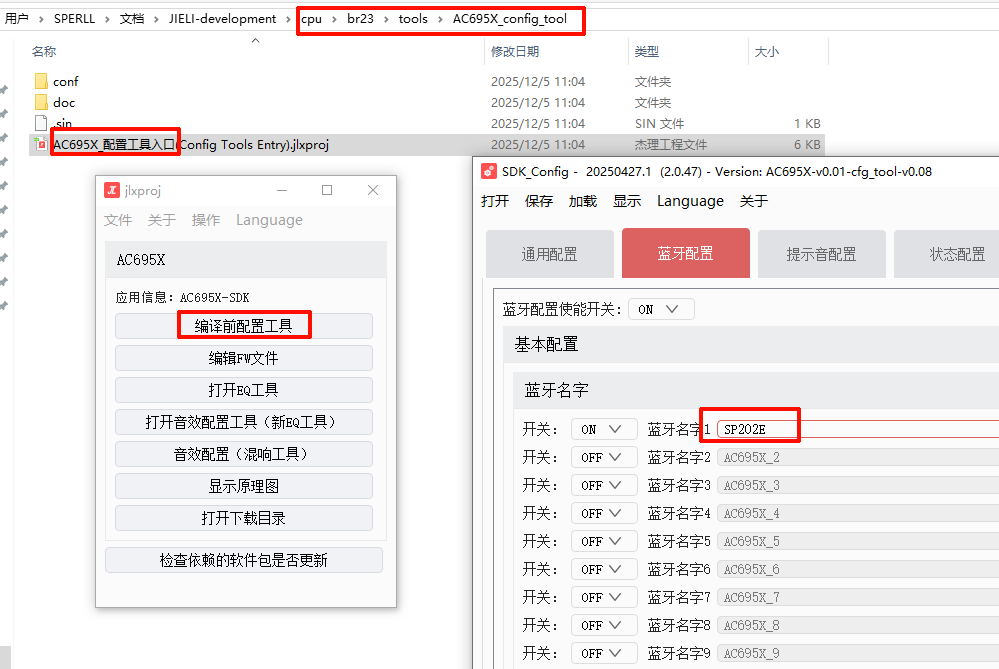    
记得保存bin
## 按键部分

单击：`[Info]: [SPP_AND_LE]app_key_evnet: 0,3`  
双击：`[Info]: [SPP_AND_LE]app_key_evnet: 4,3`  
三击：`[Info]: [SPP_AND_LE]app_key_evnet: 5,3`  
四击：`[Info]: [SPP_AND_LE]app_key_evnet: 6,3`  
最多支持五击  

长按：
按下：`[Info]: [SPP_AND_LE]app_key_evnet: 1,2`  
保持：`[Info]: [SPP_AND_LE]app_key_evnet: 2,2`  
松开：`[Info]: [SPP_AND_LE]app_key_evnet: 3,2`  
默认三击PB2（下一首next port）关机，单击PB1（电源power port）开机。  

利用`apps\common\device\key\iokey.c`和`apps\common\device\key\key_driver.c`官方提供的按键功能实现

在key_driver.c调用注册的scan_para的get_value()接口来获取当前按键按下的键值  
    
打开MULT_KEY_ENABLE后iokey.c获取键值的时候就会使用bit_mark的方式记录被按下的键值

    MARK_BIT_VALUE(bit_mark, ret_value);	//标记被按下的按键
记录下被按下的按键之后, 代码中需要实现组合键的重新映射
```c
#if MULT_KEY_ENABLE
    bit_mark = iokey_value_remap(bit_mark);  //组合按键重新映射按键值
    ret_value = (bit_mark != NO_KEY) ? bit_mark : ret_value;
#endif
```
SDK是调用了一个外部的组合键按键映射表 iokey_remap_data 就是需要自己外部实现组的合键映射表
```c
#if MULT_KEY_ENABLE
extern const struct key_remap_data iokey_remap_data;
static u8 iokey_value_remap(u8 bit_mark)
{
    for (int i = 0; i < iokey_remap_data.remap_num; i++) {
        if (iokey_remap_data.table[i].bit_value == bit_mark) {
            return iokey_remap_data.table[i].remap_value;
        }
    }

    return NO_KEY;
}
#endif
```
如下为官方提供的组合键映射表, 这里新增代码自定义的重映射键值, 
```c
#if MULT_KEY_ENABLE
//组合按键消息映射表
//配置注意事项:单个按键按键值需要按照顺序编号,如power:0, prev:1, next:2
//bit_value = BIT(0) | BIT(1) 指按键值为0和按键值为1的两个按键被同时按下,
//remap_value = 3指当这两个按键被同时按下后重新映射的按键值;
const struct key_remap iokey_remap_table[] = {
	{.bit_value = BIT(0) | BIT(1), .remap_value = 3},
	{.bit_value = BIT(0) | BIT(2), .remap_value = 4},
	{.bit_value = BIT(1) | BIT(2), .remap_value = 5},
};

const struct key_remap_data iokey_remap_data = {
	.remap_num = ARRAY_SIZE(iokey_remap_table),
	.table = iokey_remap_table,
};
#endif
```
当有组合键按下的时候, 与单按键的流程一样, 会先发送key_event给到sys_event_notify()
```c
_notify:
#if TCFG_IRSENSOR_ENABLE
    if (get_irSensor_event() == IR_SENSOR_EVENT_FAR) {  //未佩戴的耳机不响应按键
        return;
    }
#endif
    key_value &= ~BIT(7);  //BIT(7) 用作按键特殊处理的标志
    e.type = SYS_KEY_EVENT;
    e.u.key.init = 1;
    e.u.key.type = scan_para->key_type;//区分按键类型
    e.u.key.event = key_event;
    e.u.key.value = key_value;
    e.u.key.tmr = timer_get_ms();


    scan_para->click_cnt = 0;  //单击次数清0
    scan_para->notify_value = NO_KEY;

    e.arg  = (void *)DEVICE_EVENT_FROM_KEY;
    /* printf("key_value: 0x%x, event: %d, key_poweron_flag: %d\n", key_value, key_event, key_poweron_flag); */
    if (key_poweron_flag) {
        if (key_event == KEY_EVENT_UP) {
            clear_key_poweron_flag();
            return;
        }
        return;
    }
    if (key_event_remap(&e)) {
#if TCFG_SOFTOFF_WAKEUP_KEY_DRIVER_ENABLE
        if (key_wk_send_flag) {
            sys_event_notify(&e);
        } else {
            save_wakeup_key_notify(&e);
        }
        nonsrc_wakeup_flag = 0;
#else
        sys_event_notify(&e);
#endif

#if TCFG_KEY_TONE_EN
        audio_key_tone_play();
#endif
    }
```
会拿到基础的按键动作

## 中断
中断相关接口在hwi.h
中断优先级：0-7（越大优先级高，7为不可屏蔽中断）

注册不可屏蔽中断，需先使能`CONFIG_CPU_UNMASK_IRQ_ENABLE`
硬件I/O中断参数通过wk_param配置
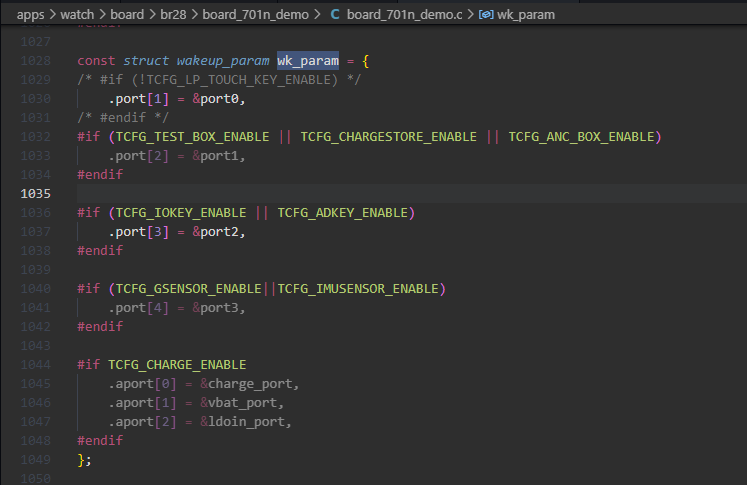
在wk_param里和自定义的port_wakeup建立映射，port_wakeup为中断触发参数配置
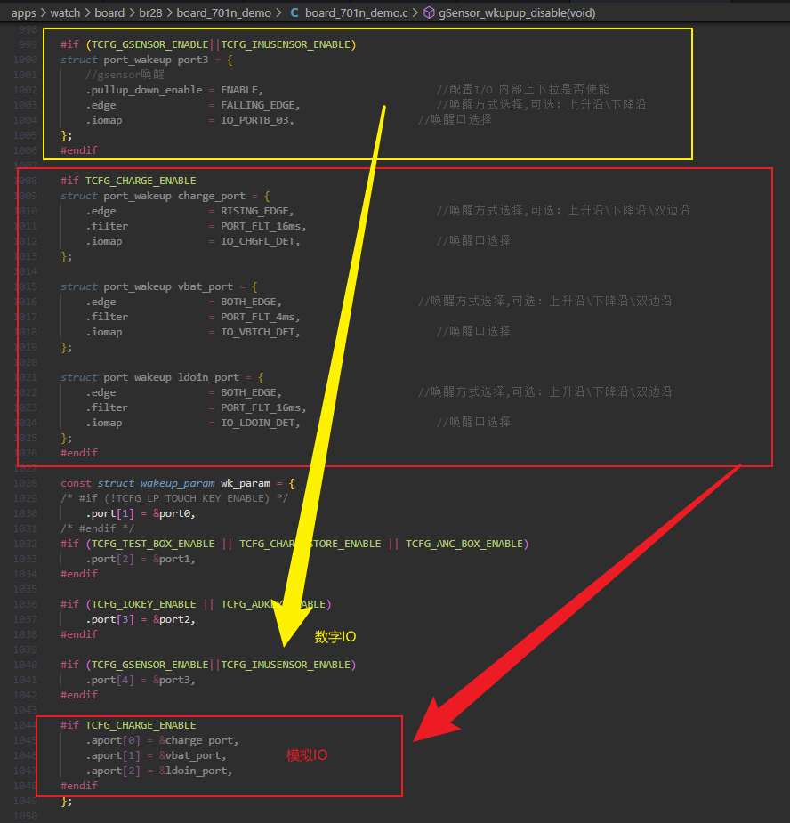
硬件中断相关接口在power_wakeup.h
• 不带a代表数字输入IO相关
• 带a代表模拟输入IO相关

```c
//数字输入IO相关接口
void power_wakeup_index_enable(u8 index, u8 enable);  //基于wk_param配置项使能中断IO
void power_wakeup_gpio_enable(u8 gpio, u8 enable);    //基于引脚号使能中断IO
void power_wakeup_gpio_edge(u8 gpio, POWER_WKUP_EDGE edge);    //配置中断IO触发方式
//模拟输入IO相关接口
void power_awakeup_index_enable(u8 index, u8 enable);
void power_awakeup_gpio_enable(u8 gpio, u8 enable);
void power_awakeup_gpio_edge(u8 gpio, POWER_WKUP_EDGE edge);
void power_awakeup_gpio_filter(u8 gpio, POWER_WKUP_FLT filter);

//数字输入IO中断响应注册接口
void power_wakeup_set_callback(void (*wakeup_callback)(u8 index, u8 gpio));
//模拟输入IO中断响应注册接口
void power_awakeup_set_callback(void (*wakeup_callback)(u8 index, u8 gpio, POWER_WKUP_EDGE edge));

//数字输入IO中断响应注册接口（基于wk_param配置项索引）
void port_edge_wkup_set_callback_by_index(u8 index, void (*wakeup_callback)(u8 index, u8 gpio));
//模拟输入IO中断响应注册接口（基于wk_param配置项索引）
void aport_edge_wkup_set_callback_by_index(u8 index, void (*wakeup_callback)(u8 index, u8 gpio, POWER_WKUP_EDGE edge));

//wk_param配置初始化
void power_wakeup_init(const struct wakeup_param *param);

//唤醒源判断
u8 is_wakeup_source(enum WAKEUP_REASON index);

//唤醒源打印
void power_wakeup_reason_dump();

//ldo唤醒判断
u8 is_ldo5v_wakeup(void);
```
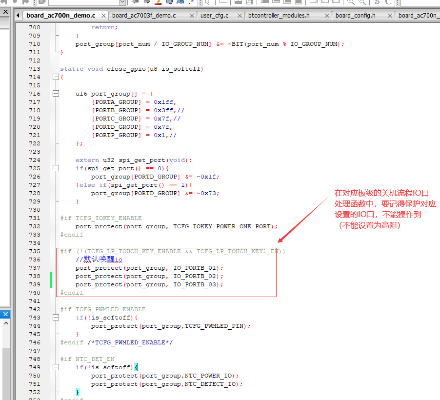
OTA 升级需要关闭不必要的外设
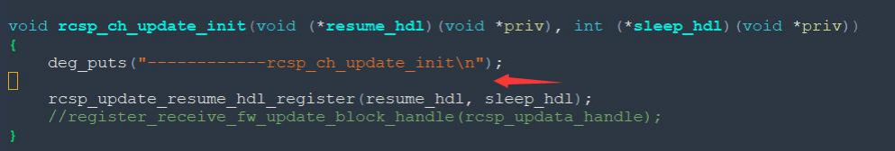
```c
void rcsp_ch_update_init(void (*resume_hdl)(void *priv), int (*sleep_hdl)(void *priv))
{
    deg_puts("----------------rcsp_ch_update_init\n");

    rcsp_update_resume_hdl_register(resume_hdl, sleep_hdl);
    //register_receive_fw_update_block_handle(rcsp_updata_handle);
}

```

如果开了定时器中断，串口，PWM 等外设时，启动 APP OTA 升级前，需要把这些外设关闭，否则会影响
到 OTA 升级时序，导致连接中断。
bit_clr_ie(IRQ_TIME3_IDX); //关闭中断使能,参考此函数，参数为中断号
## 杰理UI框架
数字组件没什么用，感觉就是为了用艺术字显示数字而已。
使用ui_text_set_str(text, "ascii", target_buf, strlen(target_buf), FONT_DEFAULT);要记得注释layout_on_focus(layout);、layout_lose_focus(layout);

ui_hide或者ui_show函数，此类函数不可跨线程调用。请使用UI_SHOW_WINDOW和UI_HIDE_WINDOW，此类函数可以跨线程。
## 置顶链接
[UI相关应用](https://www.kdocs.cn/l/ckhf4dZtUTjJ?openfrom=docs)
[手表穿戴技术应用文档入口汇总 ](https://www.kdocs.cn/l/csRItfaUZijL)
[AC695N系列手表SDK开发指南](https://www.kdocs.cn/l/csPPw163r8gg?openfrom=docs)
[AC695N手表软硬件问题整理](https://www.kdocs.cn/l/cbhlYjVVfqYc?openfrom=docs)  
[穿戴手表JL701N-入门到进阶开发指导](https://www.kdocs.cn/l/cqr0dt8Gazv5?openfrom=docs)  
[音箱可视化彩屏-入门到进阶开发指导](https://www.kdocs.cn/l/chwFstfLwzpb?openfrom=docs)  
[UI入门简单实列](https://www.kdocs.cn/l/clG1N5VuQ58s?openfrom=docs)  
[圆弧列表实现](https://app.yinxiang.com/fx/b50363fb-2849-4f1a-a62e-7fb510018616)  

## 编译下载
下载程序会调用SDK\cpu\br23\tools\download\watch下面 "download.bat" 将UI资源打包通过批处理下载到程序中。
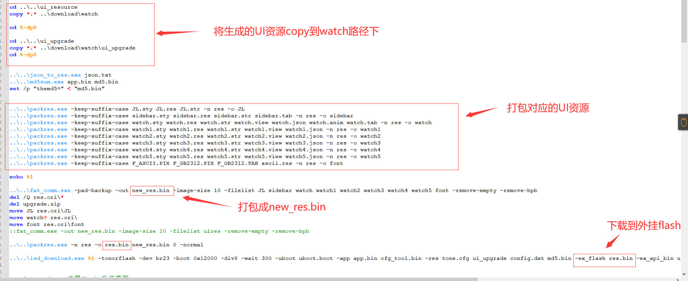  
## UI 控件
### 控件的映射
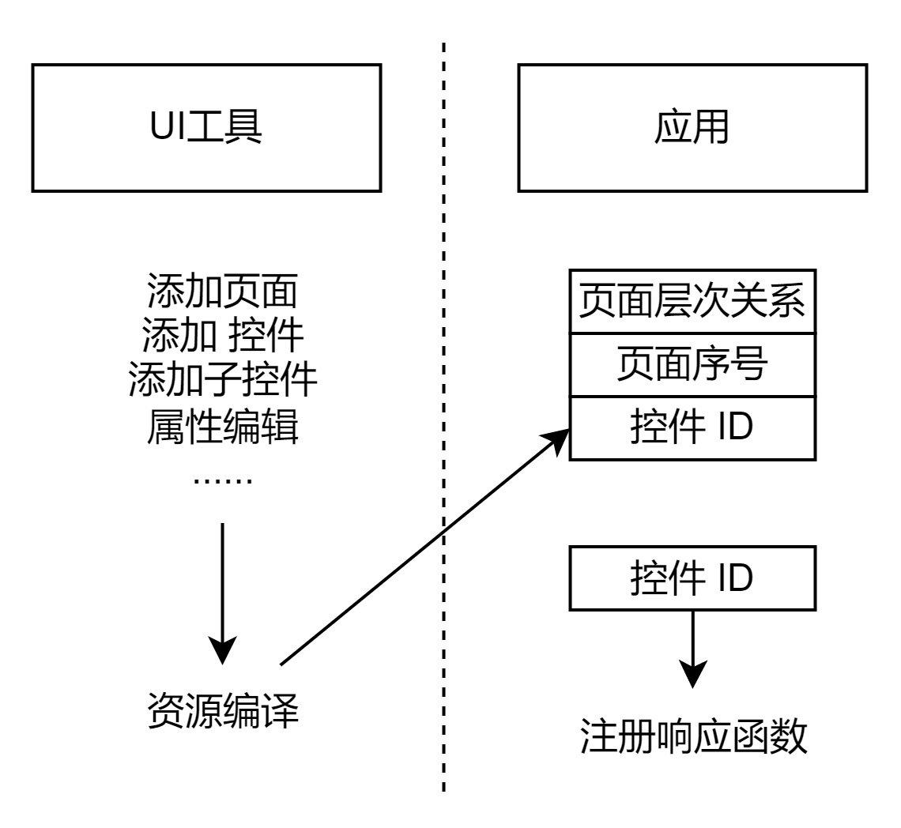    
杰理 UI 基本流程：下图为UI编译工具链的工作流程，UI工程=Json文件+资源文件，Json文件上记录了UI参数信息（位
置、尺寸等等）和资源索引地址，我们从UI编辑工具上改UI最后无非就是修改了Json文件内的内容而已，当然我们从脚本打开UI编辑工具时是自动读取读取Json文件参数来呈现。  
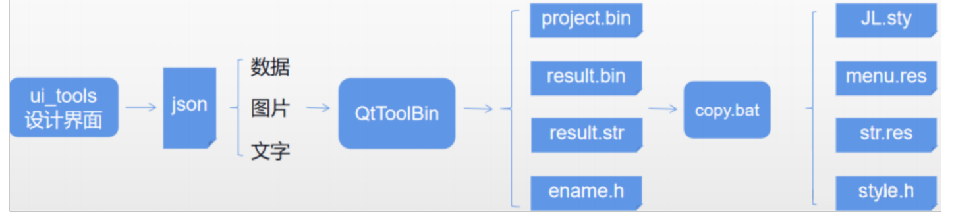    
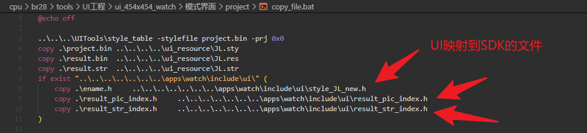    
### 控件的响应
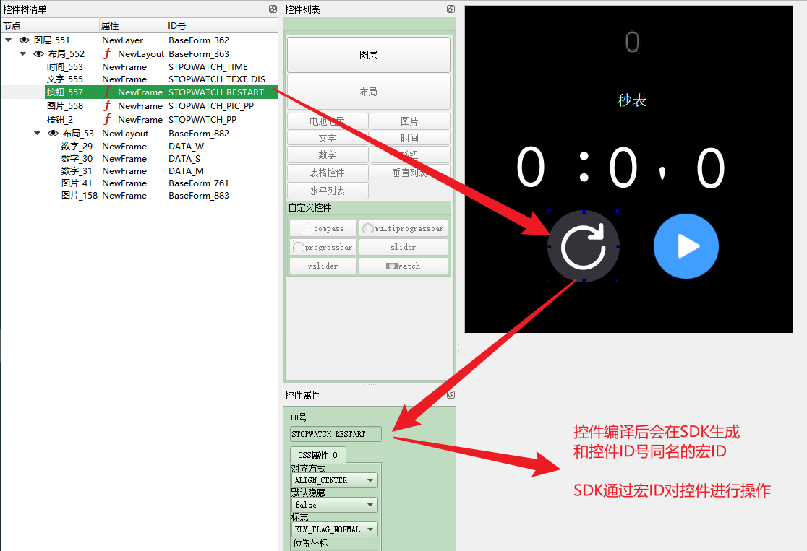    
编译后，控件映射为SDK内的一个宏ID：
我们可以根据UI工具编译出的控件宏ID，给该控件注册一些响应逻辑，UI内核提供 3 种响应注册接口：
    
自己实现响应逻辑的接口，然后在代码里注册到UI内核，例如我在屏幕上触控某个UI控件，就会调用你给该控件注册的.ontouch接口  
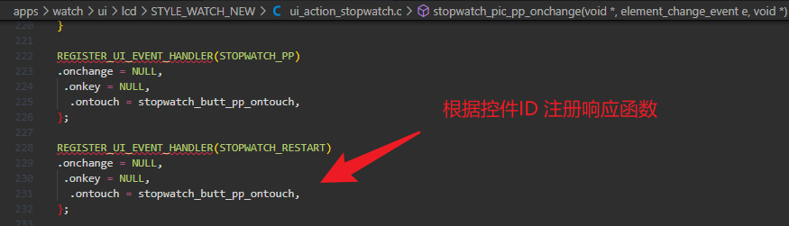    
在调用响应注册接口REGISTER_UI_EVENT_HANDLER 时，
必须在当前源文件定义#define STYLE_NAME  JL，否则控件响应会注册失败且编译不会报错，因为STYLE_NAME是REGISTER_UI_EVENT_HANDLER的隐含参数。
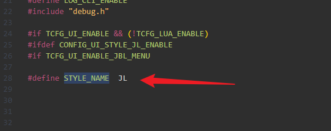    
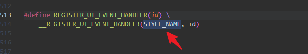    

```c
/**
* @brief onchange 响应函数
* @param ctrl ：控件句柄，如需访问控件的变量，则需强制转换成相应控件的类型，比如当前是图片控件的回调，则强制转换为 struct ui_pic *
* @param event: 事 件 类 型 ， 比 较 常 用 到 的 是ON_CHANGE_INIT,ON_CHANGE_RELEASE，分别对应控件的初始化与控件的销毁
* @return 0:成功 其他：失败
* @note 该接口禁止使用 ui_show、ui_hide
*/
static int xxx_onchange(void *ctrl, enum element_change_event event, void *arg)
{
    struct ui_pic *pic = (struct ui_pic *)ctrl; // 根据控件类型进行强制转换，这里假设为图片控件
    switch (event)
    {
    case ON_CHANGE_INIT: // 控件创建，可在此初始化
        break;
    case ON_CHANGE_SHOW: // 控件显示
        break;
    case ON_CHANGE_HIDE: // 控件隐藏
        break;
    case ON_CHANGE_RELEASE: // 控件销毁
        break;
    default:
        return FALSE;
    }
    return FALSE;
}
```
```c
/**
* @brief onkey 响应函数
* @param ctrl ：控件句柄，如需访问控件的变量，需要强制转换成相应控件的结构，比如当前是图片控件的回调，则强制转换为 struct ui_pic *
* @param event : 按键事件类型
* @return 0:成功 其他：失败
* @note 该接口可以使用 ui_show、ui_hide 控制控件的显示与隐藏
*/
static int xxx_onkey(void *ctrl, struct element_key_event *e)
{
    struct ui_pic *pic = (struct ui_pic *)ctrl; // 根据控件类型进行强制转换，这里假设为图片控件
    switch (e->event)
    {
    case KEY_EVENT_CLICK:
        switch (e->value)
        {
        case KEY_MENU:
            break;
        default:
            return false;
        }
        break;
    default:
        break;
    }
    return true;
}

REGISTER_UI_EVENT_HANDLER(控件 id 号) // 控件 id 号请参考 style.h
    .onchange = xxx_onchange,
    .onkey = xxx_onkey,
    .ontouch = xxx_ontouch,
};
```
### 控件的属性
每种控件都有自己的属性结构体（控件结构体 = 公共属性成员 + 私有属性成员）  
比如文字控件的属性结构体定义在ui_text.h里面；  
比如图片控件的属性结构体定义在ui_pic.h里面；  
比如列表控件的属性结构体定义在ui_grid.h里面；  
比如按键控件的属性结构体定义在ui_button.h里面；  
...........其他控件 以此类推...........  
举个例子🌰：按键控件  
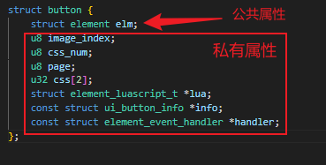  
修改字体显示颜色
```c
static int TEXT_TEST_onchange(void *ctr, enum element_change_event e, void *arg)
{
    struct ui_text *text = (struct ui_text *)ctr;
text->attrs.color = UI_RGB565(0x00aaff);    //蓝色
```

## UI 消息类型
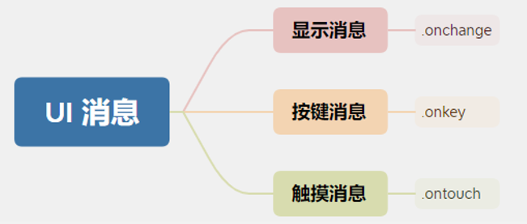  
### 显示消息
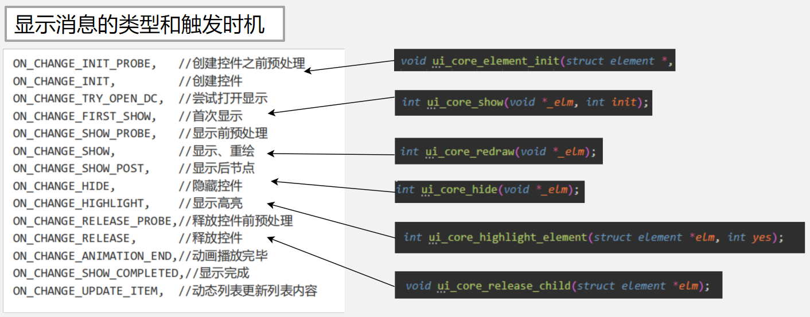  
注意：不要在onchange里面调用ui_XXX_by_id()、ui_show()、ui_hide()，这些接口会带有重绘（刷新）操作，因为onchange本身就会刷新，onchange里面调用重绘的接口会一直触发刷新（可能会导致卡顿死机）
建议：
1、想在onchange里面更新控件数据，用不带_by_id()后缀的接口，一般控件都会带有配套的接口；
2、想在onchange里面设置隐藏显示控件的话，编辑控件css属性里的invisible属性
（隐藏控件invisible = 1；显示控件invisible = 0；）

ui界面刷新资源出现卡顿？
先判断同一界面是否资源刷新过多导致，资源不多可使用show函数，资源过多则使用set函数设置index后，再调用重绘函数统一刷新
ui_core_redraw(ui_core_get_element_by_id(XXUI_XXID));//重绘函数
### 按键消息
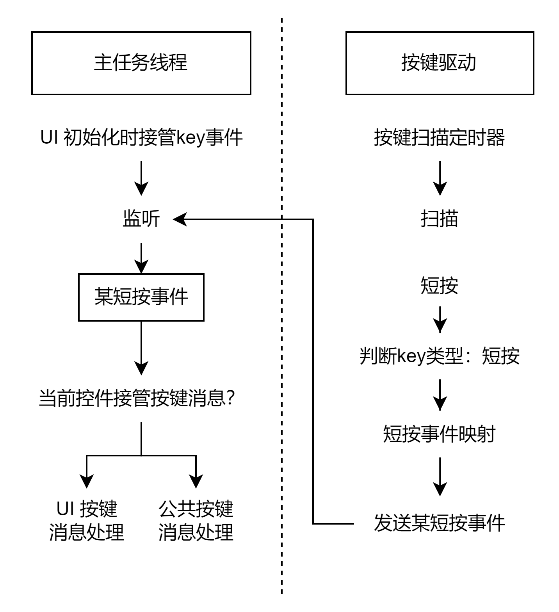  
在不同主任务模式下，每种key都有不同的映射表 ：  
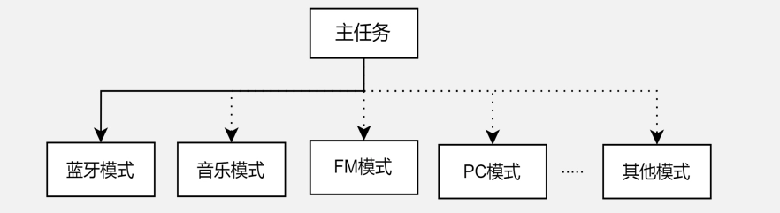  
体现在task_key.c文件里面：
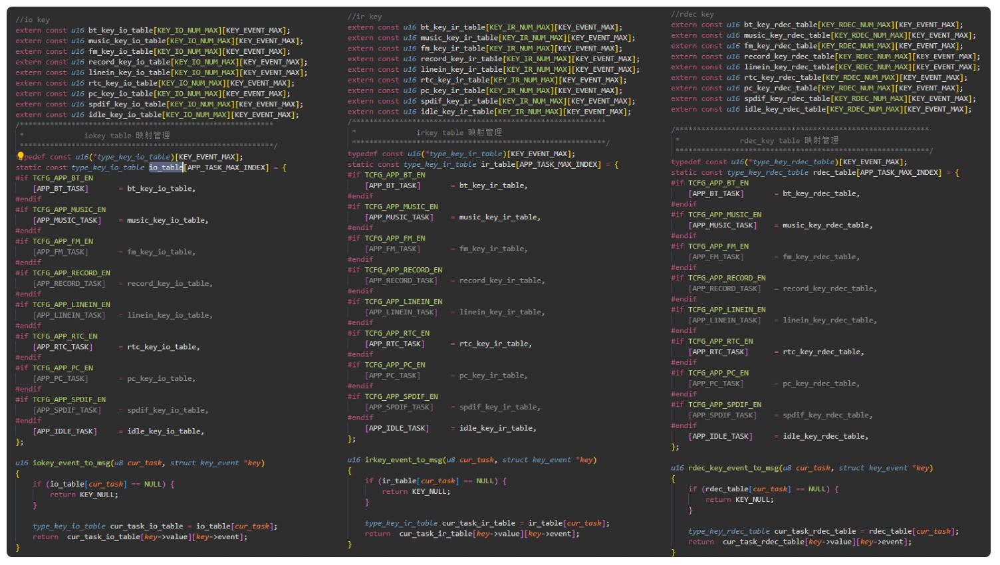  
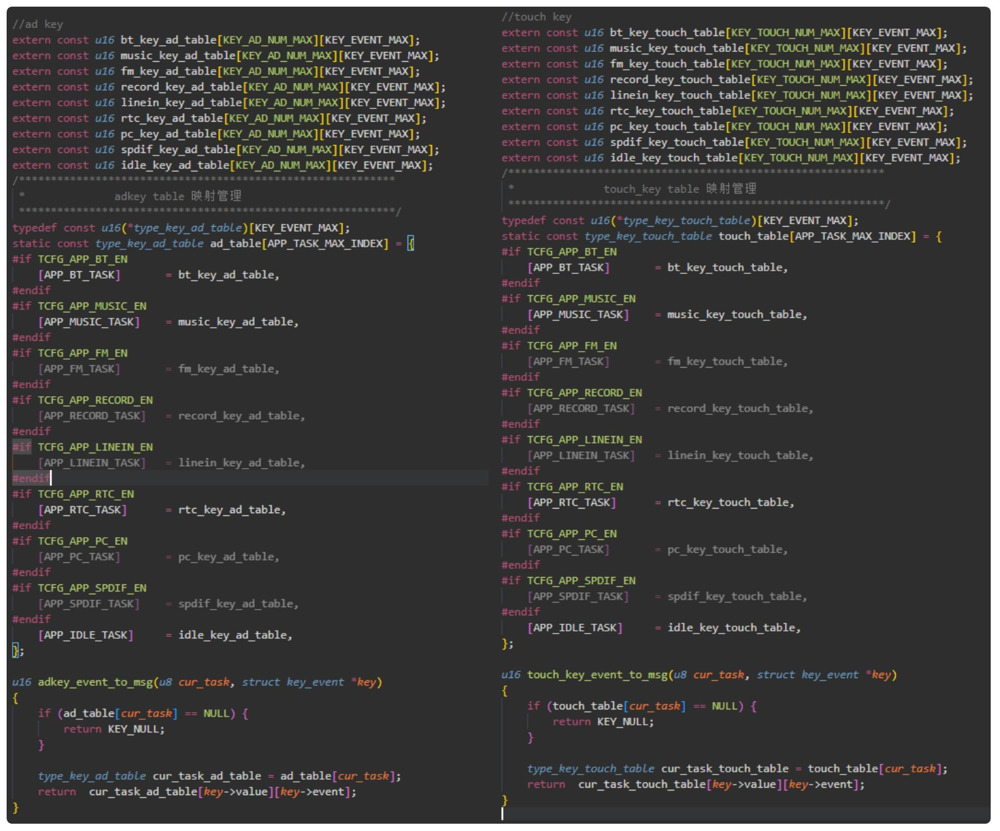  
按键检测通过定时器轮训：
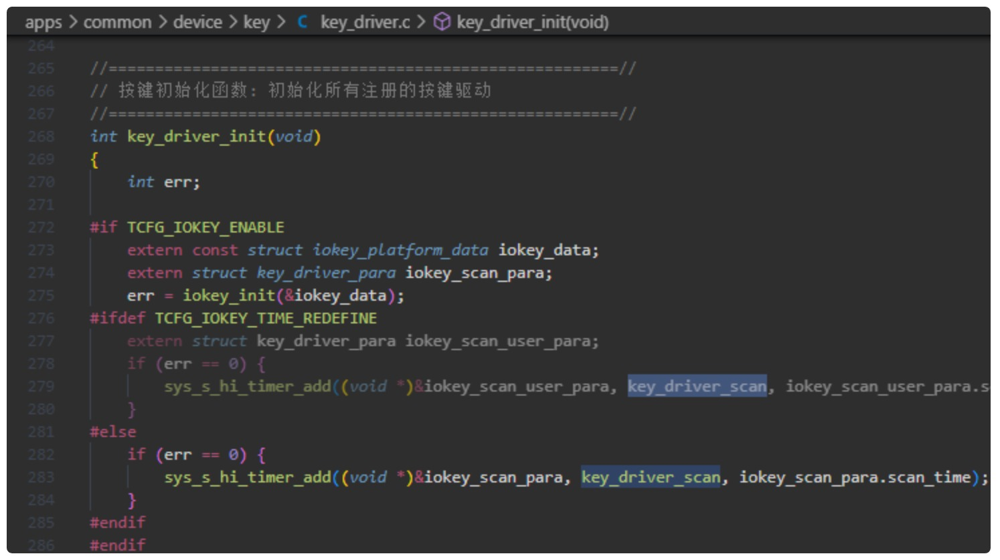  
按键事件类型判断逻辑在key_driver.c里面：
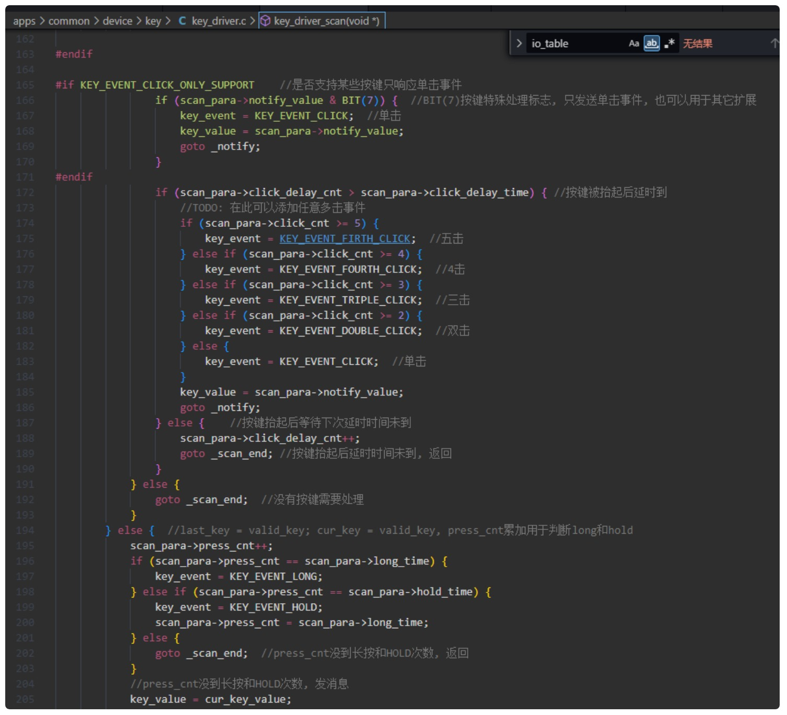  
为了更快地响应响应单击，SDK默认关闭双击判断，可通过以下宏配置：
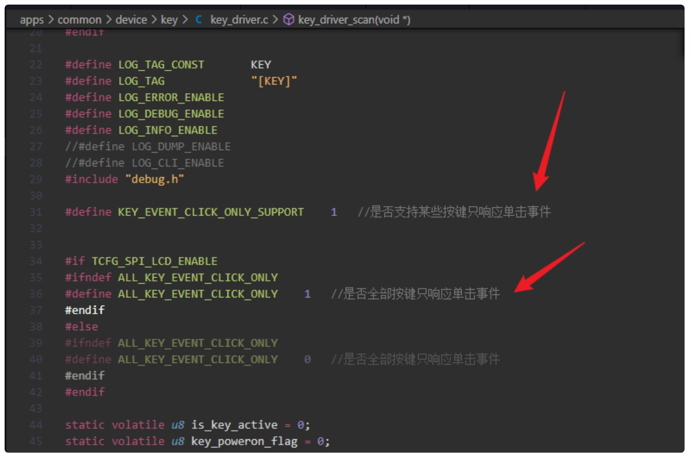  
举个例子🌰：
假设主任务在蓝牙模式（bt模式）下，我按下独立按键为例，bt模式的iokey table如下：
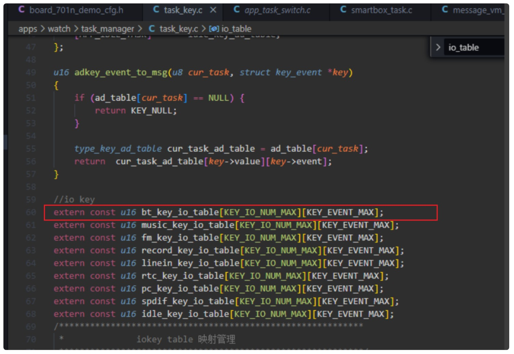    
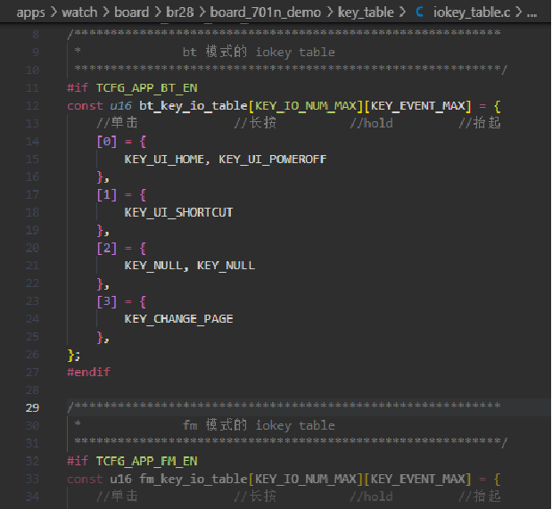  
上面二维数组，表示了4个按键（4行），对应了下图板级配置文件下的4个iokey配置，
每个按键都有四种状态（4列）表示按键状态触发时向主任务发送的事件，为空则不发。
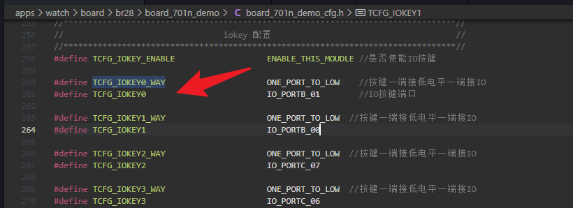  
比如，我单击按键KEY0，按键驱动判断是单击事件，然后索引到be_key_io_table[0][0]，然后往主任务发送KEY_UI_HOME事件，然后在主任务里，实现KEY_UI_HOME响应，处理KEY_UI_HOME事件。  
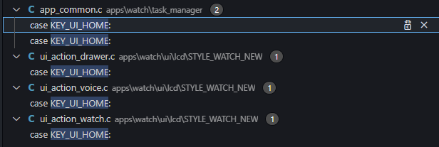  

控件默认不响应硬件按键，如果硬件按键想要操作UI，需要在硬件按键的公共事件处理里面接管，然后把按键消息转发到UI线程.onkey处理  
①被控控件，需要在初始化阶段设置接管按键消息  
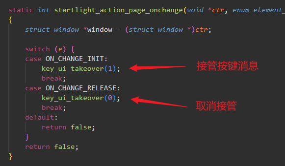  
②硬件按键公共事件处理，会先检测有没有想接管的UI控件  
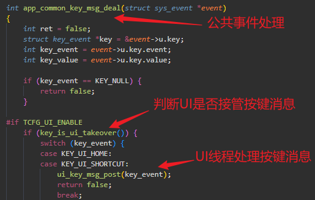  
③完成以上步骤，.onkey响应接口才会接收到事件消息  
## UI 消息传递机制
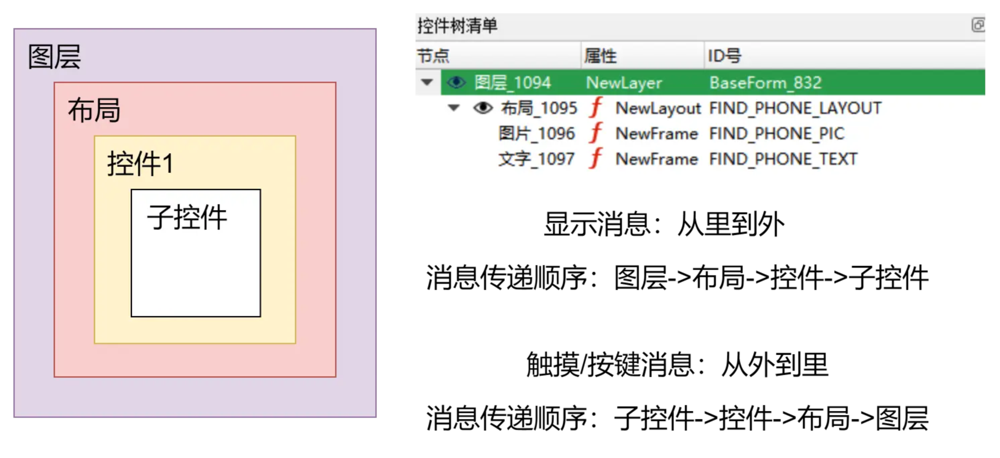    
注意：显示消息的ON_CHANGE_INIT传递顺序有特殊调整：子控件》控件》布局》图层，其他显示消息不变。

### 焦点控件
什么是焦点控件？焦点控件就是获取到焦点的控件，焦点可以灵活地在控件上转移，且有且只有一个焦点控件。控件成为焦点控件后，UI内核传递消息直接传达且只传达到焦点控件上，不会再传递到其他控件上。
设置焦点控件有两种方式：
①在控件初始化阶段锁定焦点在本控件  
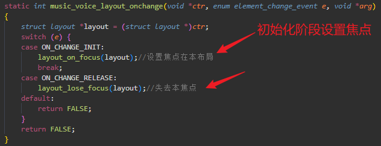    
②暂时接管，通过return true设置焦点，return false释放焦点  
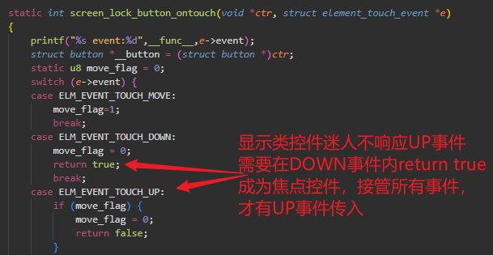  
注意：特殊调整
• 显示类控件（文字、图片）：默认不接收抬起事件，如要接收抬起事件，自行在down事件内return true；
• 按键控件：会自动设置为焦点控件

### 页面回退管理
UI开发过程中，通常会用到页面回退，相关代码逻辑主要在lcd_ui_return_page.c
页面回退管理的数据结构模拟栈结构，前进=压栈，回退=弹栈
普通页面和抢断页面，分开不同的两个栈进行管理，接口也分开两套：
普通页面翻页记录在page_return_tab数组内
抢断页面翻页记录在page_preemption数组内  
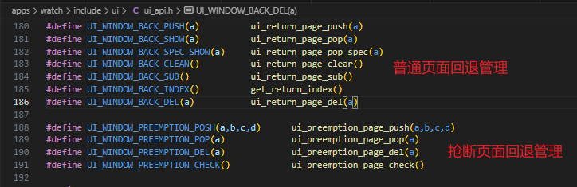  
```C
//普通页面
//压栈：用于处理页面返回时，返回的页面存储在page_return_tab
#define UI_WINDOW_BACK_PUSH(a)            ui_return_page_push(a)
//弹栈：用于处理当前页面左右滑动时是返回上一级页面还是直接滑屏切换页面
#define UI_WINDOW_BACK_SHOW(a)            ui_return_page_pop(a)
//用于处理当前页面左右滑动时是返回上一级页面还是直接滑屏切换页面
#define UI_WINDOW_BACK_SPEC_SHOW(a)        ui_return_page_pop_spec(a)
//用于清除页面返回记录
#define UI_WINDOW_BACK_CLEAN()          ui_return_page_clear()
//用于从page_return_tab表中回退1
#define UI_WINDOW_BACK_SUB()              ui_return_page_sub()
//用于获取当前page_return_tab索引值
#define UI_WINDOW_BACK_INDEX()          get_return_index()
//用于删除页面返回记录
#define UI_WINDOW_BACK_DEL(a)            ui_return_page_del(a)

//抢断页面
#define UI_WINDOW_PREEMPTION_POSH(a,b,c,d)         ui_preemption_page_push(a,b,c,d)
#define UI_WINDOW_PREEMPTION_POP(a)             ui_preemption_page_pop(a)
#define UI_WINDOW_PREEMPTION_DEL(a)             ui_preemption_page_del(a)
#define UI_WINDOW_PREEMPTION_CHECK()             ui_preemption_page_check()

```

## UI 消息交互
ui_key_msg_post 往 ui 核心发送 key 消息
ui_touch_msg_post 往 ui 核心发送触摸消息 消息
app_task_put_key_msg 软件发送一个虚拟按键消息
每个 ui 控件都可以注册按键响应和触摸响应消息，一般来说，我们会在列表控件或者布局控件注册
有按键消息，对于触摸类应用，则在需要响应的触摸的控件注册触摸消息
## 字库
只有text类型的字库才会调用字库，这也是歌词显示使用的数据类型
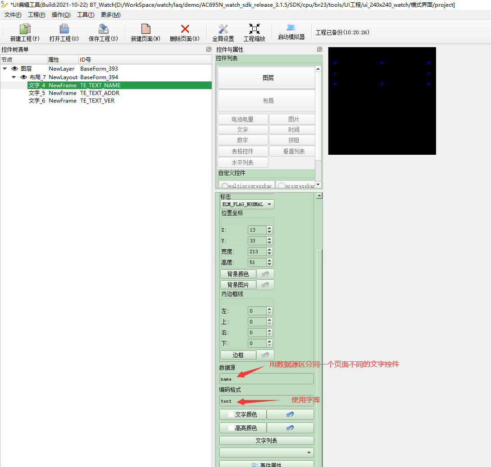  

## UI入门简单实列
示例将展现的内容包括：列表的创建与使用、多张图片切换显示、文字控件strpic和text格式的显示和使用、数字控件string格式和numb格式的使用、不同方式的页面切换和数据源的使用。
```c
//页面id管理
#define     USR_TE_GRID_PAGE            PAGE_39         //测试列表页面
#define     USR_TE_PIC_PAGE             PAGE_40         //测试图片页面
#define     USR_TE_TEXT_PAGE            PAGE_41         //测试文本页面
#define     USR_TE_NUMB_PAGE            PAGE_42         //测试数字页面

//垂直列表选中的布局id
#define     USR_TE_SWITCH_PIC            TE_SWITCH_PIC_LAYOUT
#define     USR_TE_SWITCH_TEXT           TE_SWITCH_TEXT_LAYOUT
#define     USR_TE_SWITCH_NUMB           TE_SWITCH_NUMB_LAYOUT

//控件id管理
#define     USR_TE_VERTLIST             TE_VERTLIST     //垂直列表id
#define     USR_TE_PIC                  TE_PIC          //图片控件id
#define     USR_TE_TEXT_NAME            TE_TEXT_NAME    //文本控件蓝牙名id
#define     USR_TE_TEXT_ADDR            TE_TEXT_ADDR    //文本控件蓝牙地址id
#define     USR_TE_TEXT_VER             TE_TEXT_VER     //文本控件版本号id
#define     USR_TE_NUMB_NUM             TE_NUMB_NUM     //数字控件TYPE_NUM格式  
#define     USR_TE_NUMB_STR             TE_NUMB_STR     //数字控件TYPE_STRING格式
```
1.新建列表控件
首先每新建一个页面后需要添加图层和布局（带背景颜色），因为所有控件都需要在布局中使用。列表控件有垂直列表和水平列表，列表是带有滑动效果的，所以不需要编写滑动逻辑。但客户软件可以配置滑动方向。添加列表后如下图一样右键添加行、设置行高和间隔即可。设置好列表格式后会得到与添加行对应数量布局，只需要像下图一样添加想要显示的内容即可。下面通过添加strpic格式的文字控件作为示例，实现点击不同的项会进入不同界面的功能  
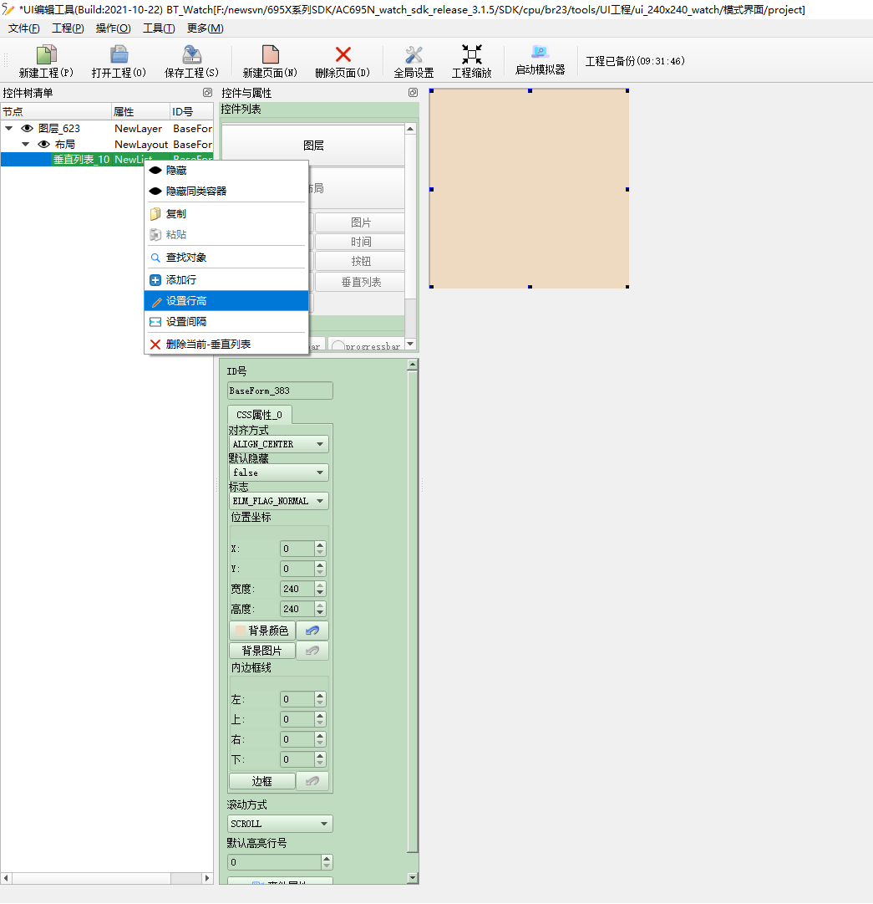  
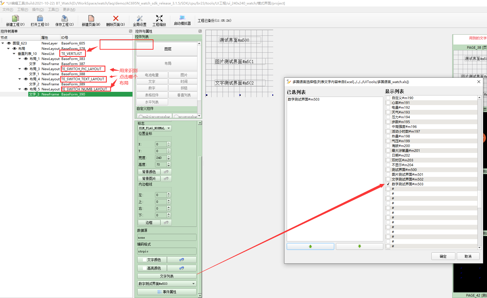  
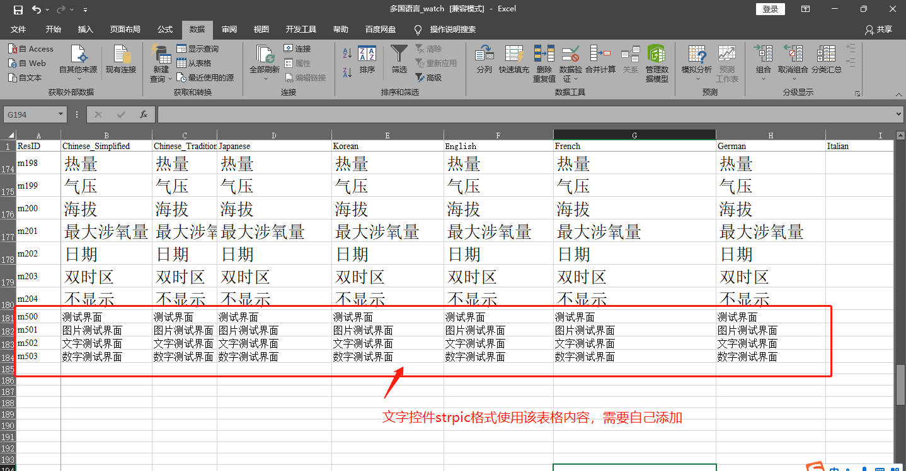  
```c
typedef struct usr_menu_callback {
    int sel_id;
    int (*exit_check)();
    int window;
    int (*enter_check)(int window);
} USR_MENU_CB;

const static USR_MENU_CB usr_menu_cb[] = {
  
    //{被选中的id,  退出检查, ，进入的页面id, ，进入检查},
    {USR_TE_SWITCH_PIC, NULL, USR_TE_PIC_PAGE, NULL}, 
    {USR_TE_SWITCH_TEXT, NULL, USR_TE_TEXT_PAGE, NULL}, 
    {USR_TE_SWITCH_NUMB, NULL, USR_TE_NUMB_PAGE, NULL},
};

//此处初始化的时候只需要限制一下滑动的方向
static int usr_test_grid_onchane(void *ctr, enum element_change_event e, void *arg)
{
    struct ui_grid *grid = (struct ui_grid *)ctr;
    switch (e) {
    case ON_CHANGE_INIT:
        ui_grid_set_slide_direction(grid, SCROLL_DIRECTION_UD);
        break;
    case ON_CHANGE_RELEASE:
        break;
    case ON_CHANGE_FIRST_SHOW:
        break;
    default:
        return false;
    }
    return false;
}


//选择处理
static int usr_menu_in_sel(struct ui_grid *grid)
{
    u32 sel_item = ui_grid_cur_item(grid);

    if (sel_item >= grid->avail_item_num) {
        return false;
    }
    int id = grid->item[sel_item].elm.id;

    for (int i = 0; i < (sizeof(usr_menu_cb) / sizeof(usr_menu_cb[0])); i++) {
        if (usr_menu_cb[i].sel_id == id) {
            printf("menu layout id = %x \n", id);
            if (usr_menu_cb[i].window) {
                if (usr_menu_cb[i].enter_check && (!usr_menu_cb[i].enter_check(usr_menu_cb[i].window))) {
                    return false;
                }
                UI_HIDE_CURR_WINDOW();
                UI_SHOW_WINDOW(usr_menu_cb[i].window);
            }
            return true;
            break;
        }
    }
    return false;
}

//列表控件滑动功能底层以及做好，所以只需要做点击选择切页面功能
static int usr_test_grid_ontouch(void *ctr, struct element_touch_event *e)
{
    struct ui_grid *grid = (struct ui_grid *)ctr;
    int sel_item;
    static u8 move_flag = 0;
    switch (e->event) {
    case ELM_EVENT_TOUCH_R_MOVE:
        break;
    case ELM_EVENT_TOUCH_L_MOVE:
        break;
    case ELM_EVENT_TOUCH_MOVE:
        move_flag = 1;
        return false;//不接管消息
        break;
    case ELM_EVENT_TOUCH_DOWN:
        move_flag = 0;
        return false;//不接管消息
        break;
    case ELM_EVENT_TOUCH_UP:
        if (move_flag) {
            move_flag = 0;
            return false;//不接管消息
        }
        return usr_menu_in_sel(grid);
        break;
    default:
        return false;
        break;
    }
    return true;//接管消息
}

//通过这种方式注册布局或者控件，实现软件控制UI各种动作
REGISTER_UI_EVENT_HANDLER(USR_TE_VERTLIST)
.onchange = usr_test_grid_onchane,
 .onkey = NULL,
  .ontouch = usr_test_grid_ontouch,
};

```
2.新建图片控件
同样往新建的页面中添加好图层和布局（需要填充背景颜色），然后在需要的位置添加上图片控件，本示例将通过图片列表的方式添加多张图片，然后通过定时器不断的刷新切换不同的图片。
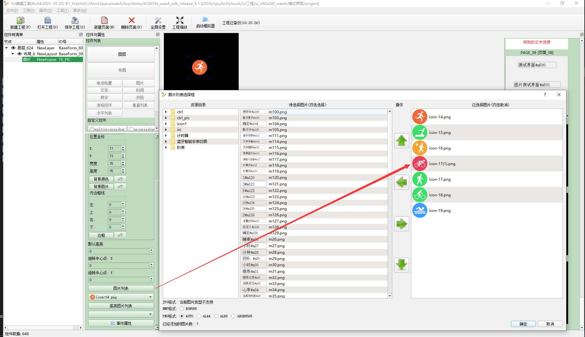  
```c
#define MAX_PIC_NUMBS           7

static void usr_pic_reflash(void)
{
    static u8 CurrPicIndex = 0;
    if(++CurrPicIndex >= MAX_PIC_NUMBS){
        CurrPicIndex = 0;
    }
    ui_pic_show_image_by_id(USR_TE_PIC ,CurrPicIndex);
} 

static int usr_test_pic_onchange(void *ctr, enum element_change_event e, void *arg)
{
    struct ui_pic *pic = (struct ui_pic *)ctr;
    static u16 pic_timer_id = 0;
    switch (e) {
    case ON_CHANGE_INIT:
        if(!pic_timer_id){
            pic_timer_id = sys_timer_add(NULL , usr_pic_reflash , 1000);
        }
        //默认进入显示第几张图片
        ui_pic_set_image_index(pic ,2);
        break;
    case ON_CHANGE_FIRST_SHOW:
    
        break;
    case ON_CHANGE_RELEASE:
        if(pic_timer_id){
            sys_timer_del(pic_timer_id);
            pic_timer_id = 0;
        }
        break;
    default:
        return false;
    }
    return false;
}


REGISTER_UI_EVENT_HANDLER(USR_TE_PIC)
.onchange = usr_test_pic_onchange,
 .onkey = NULL,
  .ontouch = NULL,
};

static int usr_change_page_ontouch(void *ctr, struct element_touch_event *e)
{
    struct window *window = (struct window *)ctr;
    printf("%s:e->event=%d" , __func__ , e->event);
    switch (e->event) {
    case ELM_EVENT_TOUCH_R_MOVE:
        ui_send_event(KEY_CHANGE_PAGE , USR_TE_GRID_PAGE|BIT(31));
        return false;
    case ELM_EVENT_TOUCH_L_MOVE:
        ui_send_event(KEY_CHANGE_PAGE , USR_TE_GRID_PAGE|BIT(31));
        return false;
    default:
        break;
    }
    return false;
}

REGISTER_UI_EVENT_HANDLER(USR_TE_PIC_PAGE)
.onchange = NULL,
 .onkey = NULL,
  .ontouch = usr_change_page_ontouch,
};
```
3.新建文本控件
文本控件格式分为ascii、strpic、text三种格式，strpic格式使用的是多国语言表中设置好的文本，一般会使用在菜单、标题等固定显示的页面；text格式是使用字库进行显示，一般使用在消息通知、歌词显示等不固定内容显示。同样往新建的页面中添加好图层和布局（需要填充背景颜色），然后添加对应的文字控件。本示例将使用三个text格式的文本控件，通过数据源作为区分，分别显示蓝牙名、mac地址和版本号内容。
  
```c
//text 格式显示
extern const u8 *bt_get_mac_addr();
extern const char *bt_get_local_name();
static u8 VStr[]="v1.0.0";

static int usr_test_text_onchange(void *ctr, enum element_change_event e, void *arg)
{
    struct ui_text *text = (struct ui_text *)ctr;
    u8 * buf;
    u8 * addr_buf = NULL ;
    u8 mac_addr[6] = {0};
    switch (e) {
    case ON_CHANGE_INIT:
        if (!strcmp(text->source, "name")) {
            buf = bt_get_local_name();
            ui_text_set_text_attrs(text , buf , strlen(buf) , FONT_ENCODE_UTF8 , FONT_ENDIAN_SMALL , FONT_DEFAULT);
        }
        else if (!strcmp(text->source, "addr")){
            //log_info("set bt addr");
            memcpy(mac_addr, bt_get_mac_addr(), 6);
            put_buf(mac_addr ,6);
            addr_buf = malloc (20);
            if(addr_buf == NULL){
                ASSERT(0, "addr_buf malloc fail");
            }
            for(u8 i = 0 ; i < 6 ; i++){
                if(i == 0 ){
                    sprintf(addr_buf , "%X%c",mac_addr[i],':');
                }
                else if (i < 5){
                    sprintf(addr_buf , "%s%X%c",addr_buf ,mac_addr[i] ,':');
                }
                else{
                    sprintf(addr_buf , "%s%X",addr_buf ,mac_addr[i]);
                }
            } 
            ui_text_set_text_attrs(text , addr_buf , strlen(addr_buf) , FONT_ENCODE_UTF8 , FONT_ENDIAN_SMALL , FONT_DEFAULT);
        }
        else if (!strcmp(text->source, "ver")){
            ui_text_set_text_attrs(text , VStr , strlen(VStr) , FONT_ENCODE_UTF8 , FONT_ENDIAN_SMALL , FONT_DEFAULT);
        }
        break;
    case ON_CHANGE_RELEASE:
        if(addr_buf){
            free(addr_buf);
            addr_buf = NULL;
        }
        break;
    }
    return false;
}


REGISTER_UI_EVENT_HANDLER(USR_TE_TEXT_NAME)
.onchange = usr_test_text_onchange,
 .onkey = NULL,
  .ontouch = NULL,
};

REGISTER_UI_EVENT_HANDLER(USR_TE_TEXT_ADDR)
.onchange = usr_test_text_onchange,
 .onkey = NULL,
  .ontouch = NULL,
};

REGISTER_UI_EVENT_HANDLER(USR_TE_TEXT_VER)
.onchange = usr_test_text_onchange,
 .onkey = NULL,
  .ontouch = NULL,
};

static int usr_change_page_ontouch(void *ctr, struct element_touch_event *e)
{
    struct window *window = (struct window *)ctr;
    printf("%s:e->event=%d" , __func__ , e->event);
    switch (e->event) {
    case ELM_EVENT_TOUCH_R_MOVE:
        UI_HIDE_CURR_WINDOW();
        UI_SHOW_WINDOW(-1);
        return false;
    case ELM_EVENT_TOUCH_L_MOVE:
        UI_HIDE_CURR_WINDOW();
        UI_SHOW_WINDOW(-1);
        return false;
    default:
        break;
    }
    return false;
}

REGISTER_UI_EVENT_HANDLER(USR_TE_TEXT_PAGE)
.onchange = NULL,
 .onkey = NULL,
  .ontouch = usr_change_page_ontouch,
};
```
4.新建数字控件
数字控件有TYPE_STRING和TYPE_NUM两种方式进行显示，两者区别在于TYPE_NUM格式最多只能显示xx/xx这样格式长度的内容，对于xx/xx/xx...这种多位数字格式的内容无法显示，这时候就可以TYPE_STRING进行显示。 同样往新建的页面中添加好图层和布局（需要填充背景颜色），然后添加对应的数字控件。本示例将使用两个数字控件，通过获取RTC的时间，然后使用TYPE_STRING和TYPE_NUM两种方式显示不同长度内容信息。同样使用数据源的格式区分同一个页面中两个数字控件
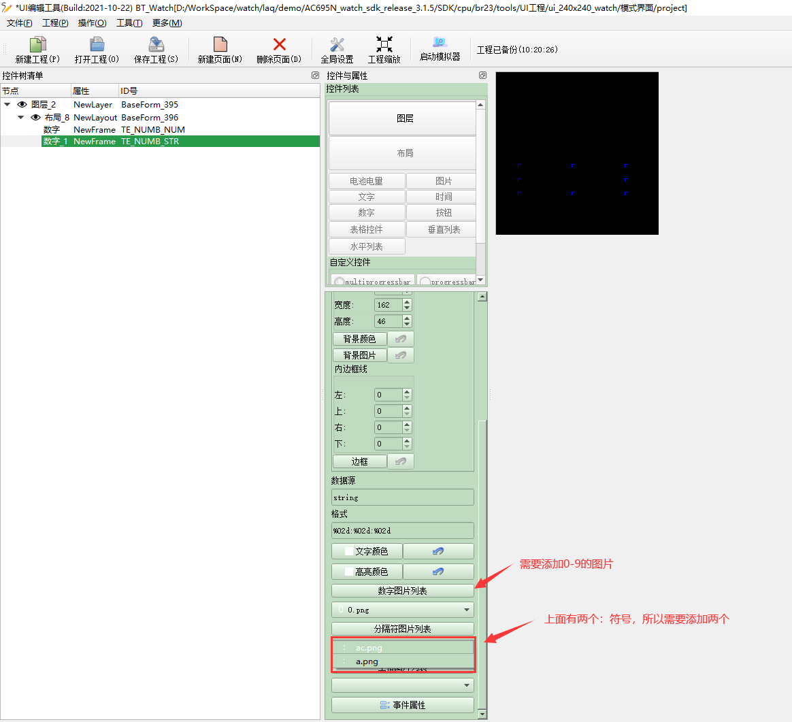  
```c
static u8 stopwatch_num_buf[10] = {0};

static void get_sys_time(struct sys_time *time)
{
    void *fd = dev_open("rtc", NULL);
    if (!fd) {
        memset(time, 0, sizeof(*time));
        return;
    }
    dev_ioctl(fd, IOCTL_GET_SYS_TIME, (u32)time);
    /* printf("get_sys_time : %d-%d-%d,%d:%d:%d\n", time->year, time->month, time->day, time->hour, time->min, time->sec); */
    dev_close(fd);
}

void usr_string_reflash(void)
{
    struct sys_time time;
    struct unumber str_unumb;
    struct unumber num_unumb;
    get_sys_time(&time);
    sprintf(stopwatch_num_buf, "%2d%c%2d%c%2d", time.hour, ':', time.min, '.', time.sec);
    str_unumb.type = TYPE_STRING;
    str_unumb.num_str = &stopwatch_num_buf;
    num_unumb.type = TYPE_NUM;
    num_unumb.numbs = 2;
    num_unumb.number[0] = time.min;
    num_unumb.number[1] = time.sec;
    ui_number_update_by_id(USR_TE_NUMB_STR, &str_unumb);
    ui_number_update_by_id(USR_TE_NUMB_NUM, &num_unumb);
}
static int usr_test_num_onchange(void *ctrl, enum element_change_event e, void *arge)
{
    struct ui_number *num = (struct ui_number *) ctrl;
    static u16 numb_timer_id = 0;
    struct unumber unumb;
    struct sys_time time;
    switch (e) {
    case ON_CHANGE_INIT:
        if (!strcmp(num->source, "string")) {
            get_sys_time(&time);
            sprintf(stopwatch_num_buf, "%2d%c%2d%c%2d", time.hour, ':', time.min, '.', time.sec);
            unumb.type = TYPE_STRING;
            unumb.num_str = &stopwatch_num_buf;
            ui_number_update(num, &unumb);
        }
        else if (!strcmp(num->source, "munb")) {
            get_sys_time(&time);
            unumb.type = TYPE_NUM;
            unumb.numbs = 2;
            unumb.number[0] = time.min;
            unumb.number[1] = time.sec;
            ui_number_update(num, &unumb);
        }

        if (!numb_timer_id) {
            numb_timer_id = sys_timer_add(NULL, usr_string_reflash, 500);
        }
        break;
    case ON_CHANGE_RELEASE:
        if(numb_timer_id){
            sys_timer_del(numb_timer_id);
            numb_timer_id = 0;
        }
        break;
    default:
        break;
    }
    return false;
}

REGISTER_UI_EVENT_HANDLER(USR_TE_NUMB_NUM)
.onchange = usr_test_num_onchange,
 .onkey = NULL,
  .ontouch = NULL,
};

REGISTER_UI_EVENT_HANDLER(USR_TE_NUMB_STR)
.onchange = usr_test_num_onchange,
 .onkey = NULL,
  .ontouch = NULL,
};

static int usr_change_page_ontouch(void *ctr, struct element_touch_event *e)
{
    struct window *window = (struct window *)ctr;
    printf("%s:e->event=%d" , __func__ , e->event);
    switch (e->event) {
    case ELM_EVENT_TOUCH_R_MOVE:
        ui_send_event(KEY_CHANGE_PAGE, 1);
        return false;
    case ELM_EVENT_TOUCH_L_MOVE:
        ui_send_event(KEY_CHANGE_PAGE, 1);
        return false;
    default:
        break;
    }
    return false;
}

REGISTER_UI_EVENT_HANDLER(USR_TE_NUMB_PAGE)
.onchange = NULL,
 .onkey = NULL,
  .ontouch = usr_change_page_ontouch,
};
```
以上只是拿部分控件的部分简单使用作为一个示例，多参考案例在
SDK\apps\watch\ui\lcd\STYLE_WATCH路径下面，可自行查看。除了使用UI工具中控件进行UI显示外，SDK还提供自定义绘图功能，可以自定义控制显示位置和显示内容，具体可查看自定义绘图功能可以参考SDK下的SDK\apps\watch\ui\lcd\STYLE_WATCH\ui_draw_demo.c文件。更
## 注意事项 
### 所有UI线程的控件操作都需要在UI线程下调用。传递消息的方法使用跨线程控制UI的控件
• 消息类事件
    如蓝牙连接成功、开始播放音乐等系统事件等需要在UI线程中做处理的。
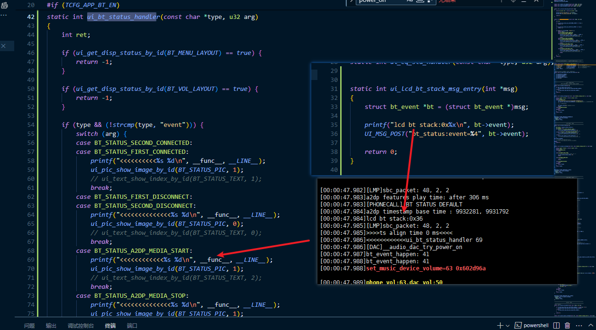  
通过UI_MSG_POST将消息发送到UI线程进行处理
• 数据类事件
    如歌词等，需要使用全局buf传递。数据接收完成后，发送消息让UI线程读取buf进去处理。

### AC695N 使用内部框架推点阵屏需要高亮显示操作
控件高亮显示功能 ，点阵屏需要使用 int ui_invert_element_by_id(int id); 但是该接口只改变了显存的内容，并没有更新显存到屏幕
需要新增接口
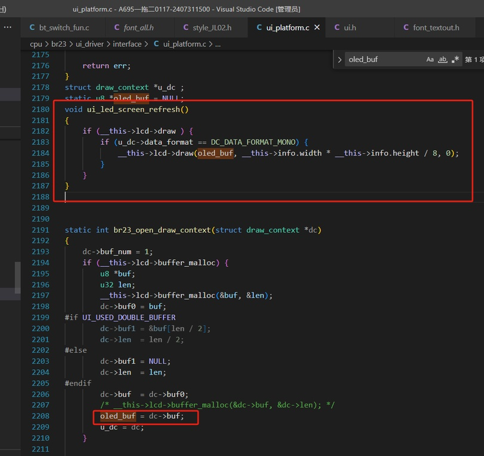  
```c
void ui_led_screen_refresh()
{
    if (__this->lcd->draw)
    {
        if (u_dc->data_format == DC_DATA_FORMAT_MONO)
        {
            __this->lcd->draw(oled_buf, __this->info.width* __this->info.height / 8, 0);
        }
    }
}

oled_buf = dc->buf;
```

在设置完高亮后，需要刷一遍屏幕  
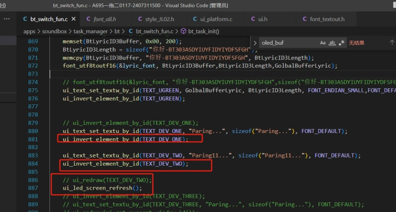  
```c
// 设置文本并反显文本框
ui_text_set_textu_by_id(TEXT_DEV_ONE, "Paring...", sizeof("Paring..."), FONT_DEFAULT);
ui_invert_element_by_id(TEXT_DEV_ONE);

ui_text_set_textu_by_id(TEXT_DEV_TWO, "Paring11...", sizeof("Paring11..."), FONT_DEFAULT);
ui_invert_element_by_id(TEXT_DEV_TWO);

// 刷新屏幕
// ui_redraw(TEXT_DEV_TWO);
ui_led_screen_refresh();
```

### V315垂直列表中的滚动文字布局外出现了叠影并乱码的情况    ---SCB  20220512
v315版本 列表范围外显示叠影花屏问题，为控件覆盖区域计算的问题需要更新ui.a库解决。

百度网盘（替换ui.a库并全编译）
链接：https://pan.baidu.com/s/192nPTa4WblvWm02fqqfjdw 
提取码：fz43

## PWM驱动七彩灯带
使用mcpwm.c文件的timer_pwm_init函数产生PWM波形：
```c
#define     OSC_Hz      24000000
/**
 * @param JL_TIMERx : JL_TIMER0/1/2/3/4/5
 * @param fre : 频率，单位Hz，不小于95
 * @param duty : 初始占空比，0~10000对应0~100%
 * @param port : pwm脚，可选硬件脚，也可选非硬件脚。(建议选择硬件引脚)
 * @param output_ch : 映射通道，当pwm脚选择非硬件脚时有效，这时我们给他分配output_channel 0/1/2
 */
int timer_pwm_init(JL_TIMER_TypeDef *JL_TIMERx, u32 fre, u32 duty, u32 port, int output_ch)
{
    u32 hw_port;
    switch ((u32)JL_TIMERx) {
    case (u32)JL_TIMER0 :
        hw_port = IO_PORTA_05;
        break;
    case (u32)JL_TIMER1 :
        hw_port = IO_PORTC_04;
        break;
    case (u32)JL_TIMER2 :
        hw_port = IO_PORTB_03;
        break;
    case (u32)JL_TIMER3 :
        bit_clr_ie(IRQ_TIME3_IDX);
        hw_port = IO_PORTB_05;
        break;
    case (u32)JL_TIMER4 :
        hw_port = IO_PORTA_01;
        break;
    case (u32)JL_TIMER5 :
        hw_port = IO_PORTB_07;
        break;
    default:
        return (-1);
    }
    if ((output_ch == (-1)) && (hw_port != port)) {
        //not support output_ch
        return (-1);
    }
​
    //初始化timer
    JL_TIMERx->CON = 0;
    JL_TIMERx->CON |= (0b10 << 2);                      //选择晶振时钟源：24MHz
    JL_TIMERx->CON |= (0b0001 << 4);                    //时钟源4分频
    JL_TIMERx->PRD = OSC_Hz / (4 * fre);                //设置周期
    JL_TIMERx->PWM = (JL_TIMERx->PRD * duty) / fre; //0~10000对应0~100g
    JL_TIMERx->CNT = 0;                                 //清计数值
    JL_TIMERx->CON |= (0b01 << 0);                      //计数模式
​
    if (hw_port == port) {
        gpio_set_die(hw_port, 1);
        gpio_set_pull_up(hw_port, 0);
        gpio_set_pull_down(hw_port, 0);
        gpio_set_direction(hw_port, 0);
        JL_TIMERx->CON |= BIT(8);                       //PWM使能
    } else {
        gpio_output_channle(port, output_ch);
        return 1;
    }
    return 0;
}​
```
参数输入如上图所示，注意点如下：
1. 每个定时器都对应一个固定的IO口，如TIMER1->IO_PORTA_12,如果在芯片上能找到对应定时器的对应脚则优先使用。没有对应IO口的情况下，则可以任选一个IO口，然后通过通道映射的方式来使选择的IO口产生PWM。
示例：
```c
timer_pwm_init(JL_TIMER3, 2000, 5000, IO_PORTB_05, 0);   //对应IO口产生
timer_pwm_init(JL_TIMER3, 2000, 5000, IO_PORTB_04, CH2_T3_PWM_OUT);  //通道映射
```
通道可以在gpio.h文件查询到，CHx_Tn_PWM_OUT,x代表通道x，n代表定时器，每个通道只能映射一个IO口，定时器必须跟选择的定时器一致。
备注：定时器无论是正常对应IO口输出，映射输出都只会产生一个PWM波形，由最后执行的函数为准，且映射输出时，定时器对应的IO口也会产生对应波形，所以最优先选择定时器对应的IO口，避免造成IO口浪费。
 
2. 占空比，公版代码的占空比输入不是0-1000控制0-100%，如果需要改成此效果改此处：
`JL_TIMERx->PWM = (JL_TIMERx->PRD * duty) / 10000;   //0~10000对应0~100%`

3. 时钟选择：
`JL_TIMERx->CON = (0b10 << 2);                      //选择晶振时钟源：24MHz`
公版SDK默认选择晶振时钟源，695，696均为24MHZ，608由于不带晶振的缘故需要选择系统时钟源，配置如下：
`JL_TIMERx->CON = (0b00 << 2);                      //选择系统时钟源`
695，696的系统时钟源一般会比晶振时钟源的时钟高，695为60MHZ，如果需要产生高频率的PWM波形时可以改为系统时钟源。

4. 产生PWM波形失败的可能原因：
(1) IO口被其他地方占用，程序是按前文配置，选择的IO口没有输出对应的波形时，可以通过代码编辑搜索看看是否IO口被其他地方占用；  
(2) 定时器被占用，一般这种情况会导致程序复位或者死机。一般TIMER1为系统自己本身使用的时钟，不建议使用。TIMER2默认用于UI显示，建议关掉UI显示再使用TIMER2；  


## 移植LCD驱动
## 从ac695n_soundbox_sdk中的文件夹复制到fw-AC63_BT_SDK
- 复制dev_manager文件夹到`apps\common\dev_manager`
- 复制相应ui文件夹到`apps\common\ui`
- 复制font文件夹到`apps\spp_and_le\font`
- 复制相应ui文件夹到`apps\spp_and_le\include\ui`
- 复制相应ui文件夹到`apps\spp_and_le\ui`
- 复制ui_driver文件夹到`cpu\br23\ui_driver`
- 复制liba文件夹到`include_lib\liba`
- 复制相应ui文件夹到`include_lib\system\ui`
添加.h文件  
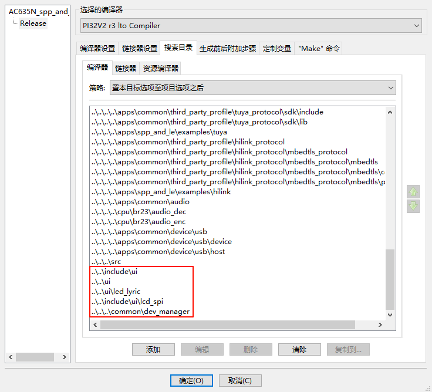    
添加.a文件  
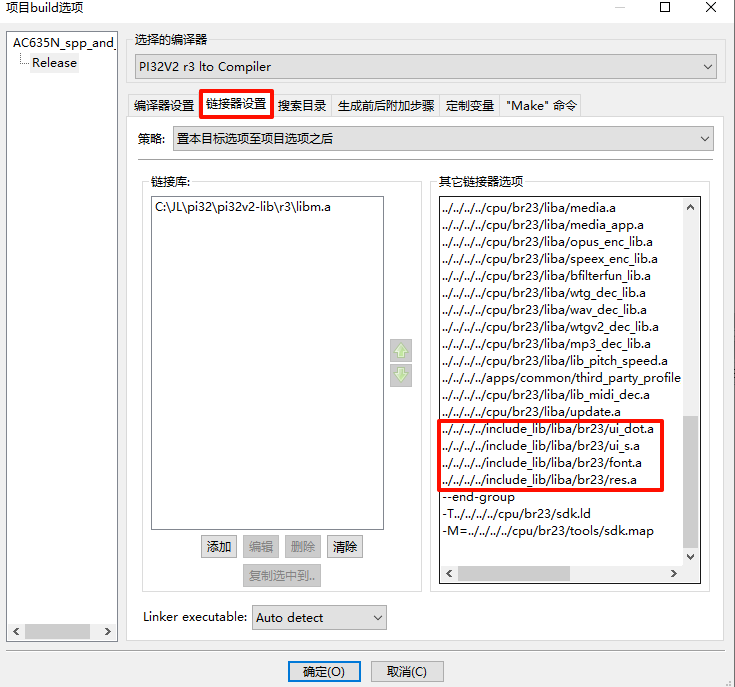    

## 在main.c 的task_info_table[]中添加
```c
#if (TCFG_SPI_LCD_ENABLE||TCFG_SIMPLE_LCD_ENABLE)
    {"ui",                  2,     0,   768,   256  },
#elif (LED_LYRICS_ENABLE && TCFG_LRC_LYRICS_ENABLE)
    {"ui",                  3,     0,   768,   128  },
#else
    {"ui",                  3,     0,   384 - 64,   128  },
```

## 在board_ac635n_demo_cfg.h添加UI配置
```c
//*********************************************************************************//
//                                  UI 配置                                        //
//*********************************************************************************//
#define TCFG_UI_ENABLE 						ENABLE_THIS_MOUDLE 	//UI总开关
#define CONFIG_UI_STYLE                     STYLE_JL_SOUNDBOX
// #define CONFIG_UI_STYLE                  STYLE_UI_SIMPLE //这是309 sdk ui 风格 需要再开启TCFG_SIMPLE_LCD_ENABLE
// #define TCFG_UI_LED7_ENABLE 			 	ENABLE_THIS_MOUDLE 	//UI使用LED7显示
// #define TCFG_UI_LCD_SEG3X9_ENABLE 		ENABLE_THIS_MOUDLE 	//UI使用LCD段码屏显示
// #define TCFG_LCD_ST7735S_ENABLE	        ENABLE_THIS_MOUDLE
#define TCFG_LCD_ST7789VW_ENABLE	        ENABLE_THIS_MOUDLE
// #define TCFG_LCD_ST7789V_ENABLE             ENABLE_THIS_MOUDLE
#define TCFG_LRC_LYRICS_ENABLE              ENABLE_THIS_MOUDLE  //歌词显示
// #define TCFG_LCD_OLED_ENABLE	            ENABLE_THIS_MOUDLE
#define TCFG_SPI_LCD_ENABLE                 ENABLE_THIS_MOUDLE //spi lcd开关
#define TCFG_SIMPLE_LCD_ENABLE              DISABLE_THIS_MOUDLE//去ui 框架的驱动开关 开启请关闭了TCFG_SPI_LCD_ENABLE
#define TCFG_TFT_LCD_DEV_SPI_HW_NUM			 1// 1: SPI1    2: SPI2 配置lcd选择的spi口
#define LCD_SPI_INTERRUPT_ENABLE             0//默认开启 需要主动关闭
#define ALL_KEY_EVENT_CLICK_ONLY	         1 	//是否全部按键只响应单击事件
```

## 在board_ac635n_demo.c添加下述代码
```c
#include "ui/ui_api.h"
#include "asm/spi.h"


#if (TCFG_SPI_LCD_ENABLE || TCFG_SIMPLE_LCD_ENABLE)

LCD_SPI_PLATFORM_DATA_BEGIN(lcd_spi_data)

#if TCFG_LCD_OLED_ENABLE
    .pin_reset	= IO_PORTC_01,
    .pin_cs		= IO_PORTC_03,
    .pin_rs		= IO_PORTC_02,
    .pin_bl     = IO_PORTC_00,
#else
    .pin_reset	= -1,
    .pin_cs		= IO_PORTC_03,
    .pin_rs		= IO_PORTC_02,
    .pin_bl     = IO_PORTC_01,
#endif

#if (TCFG_TFT_LCD_DEV_SPI_HW_NUM == 1)
    .spi_cfg	= SPI1,
    .spi_pdata  = &spi1_p_data,
#elif (TCFG_TFT_LCD_DEV_SPI_HW_NUM == 2)
    .spi_cfg	= SPI2,
    .spi_pdata  = &spi2_p_data,
#endif
LCD_SPI__PLATFORM_DATA_END()

const struct ui_devices_cfg ui_cfg_data = {
	.type = TFT_LCD,
	.private_data = (void *)&lcd_spi_data,
};
#endif

#if TCFG_HW_SPI0_ENABLE
const struct spi_platform_data spi0_p_data = {
    .port = TCFG_HW_SPI0_PORT,
    .mode = TCFG_HW_SPI0_MODE,
    .clk = TCFG_HW_SPI0_BAUD,
    .role = TCFG_HW_SPI0_ROLE,
};
#endif

#if TCFG_HW_SPI1_ENABLE
const struct spi_platform_data spi1_p_data = {
    .port = TCFG_HW_SPI1_PORT,
    .mode = TCFG_HW_SPI1_MODE,
    .clk = TCFG_HW_SPI1_BAUD,
    .role = TCFG_HW_SPI1_ROLE,
};
#endif

#if TCFG_HW_SPI2_ENABLE
const struct spi_platform_data spi2_p_data = {
    .port = TCFG_HW_SPI2_PORT,
    .mode = TCFG_HW_SPI2_MODE,
    .clk  = TCFG_HW_SPI2_BAUD,
    .role = TCFG_HW_SPI2_ROLE,
};
#endif

static void board_devices_init(void)
{
    //...省略代码
#if TCFG_UI_ENABLE
    UI_INIT(&ui_cfg_data);
#endif /* #if TCFG_UI_ENABLE */
}
```
## 在app_config.h添加如下代码
```c
#define STYLE_JL_WTACH              (1)//彩屏demo
#define STYLE_JL_SOUNDBOX           (2)//点阵屏demo
#define STYLE_JL_CHARGE             (3)//点阵屏充电仓
#define STYLE_JL_LED7               (4)//led7
#define STYLE_JL_LED_LYRICS         (5)//led_lyric
#define STYLE_UI_SIMPLE             (6)//没有ui框架
```
## 在user_cfg_id.h添加如下代码
```c
#define     CFG_UI_SYS_INFO					 37
```

**1. 确认新工程的 Makefile / 工程工程文件有把这些目录编进来**

你现在写的是“复制文件夹”，但还要确保编译系统知道去编这些 `.c` 文件：

- `apps/common/dev_manager`
- `apps/common/ui`
- `apps/spp_and_le/ui`
- `cpu/br23/ui_driver`
- `include_lib/liba`
- `include_lib/system/ui`
- `apps/spp_and_le/font`

在 `fw-AC63_BT_SDK` 里：

- 看它的顶层 `Makefile` 或各 app 的 `Makefile` 里有没有类似：

  ```make
  APPSRC += apps/common/ui/xxx.c
  APPSRC += cpu/br23/ui_driver/lcd_spi/spi_lcd_st7789vw.c
  ```

- 如果原来没有 UI，这一步是必须补的，否则你拷了文件也不会被编译进去。
  
设置屏幕旋转
    `{0x36, 1, {0x60}},`
    然后UI部分宽高对调
```c
#define LCD_WIDTH 320
#define LCD_HIGHT 240
```
修改显示窗口指令（0x2A/0x2B）
```c
    0X2A, 4, {0x00, 0x00, 0x01, 0x3F}, // 列范围0~319（320列）
    0X2B, 4, {0x00, 0x00, 0x00, 0xEF}, // 行范围0~239（240行）
```

## 移植灯效笔记
引用`#include "ColorPalette.h"`

107的延时是myDelay(Non_Music_Speed);替换为自己的延时函数，单位为1ms，其Non_Music_Speed取值为1-255
我替换为了os_time_dly();这个函数单位为10ms。

创建函数指针变量，并让它指向指定的函数
```c
void (*Send_pixel_bits)(uint8_t dat1, uint8_t dat2, uint8_t dat3, uint8_t dat4) = led_send_pixel_bits;
void (*rst)(void) = led_rst;
```
led_send_pixel_bits和led_rst实现参考
```c
void led_send_pixel_bits(uint8_t r, uint8_t g, uint8_t b, uint8_t w)
{
    if (pixel_idx == 0) {
        led_spi_wait_idle();
    }
    if (pixel_idx < NUM_LEDS) {
        // 假设顺序为RGB。可调整（例如GRB）
        led_rgb_to_buf(r, g, b, led_rgb_val_buf, pixel_idx);
        pixel_idx++;
    }
}

void led_rst(void)
{
    led_send_rgbbuf(led_rgb_val_buf, NUM_LEDS);
    pixel_idx = 0;
}
```
创建任务处理
`os_task_create(led_pattern_task, NULL, 10, 1024, 0, "led_task");`
在led_pattern_task函数中的while1中添加107的while1代码
### 移植PWM灯效笔记
从SP702E上找到相应的灯效代码源文件，以及所需要的必要代码文件->裁剪代码（删除不是通用的头文件包含，用不上的代码）->复制到工程里，加入到编译文件中->编译下载是否成功。
->将底层驱动函数改为自己的驱动函数
```c
void set_channel(uint32_t timer_periph, uint16_t timer_channel, uint8_t value)
{
    pwm_strip_init_once();

    mcpwm_set_duty(pwm_ch_map[timer_channel], pwm_timer_map[timer_channel], pwm_val_to_duty(value));
}

```
补充自己的初始化函数
```c
static u8 pwm_strip_inited;
static const pwm_ch_num_type pwm_ch_map[5] = {pwm_ch0, pwm_ch1, pwm_ch2, pwm_ch3, pwm_ch4};
static const pwm_timer_num_type pwm_timer_map[5] = {pwm_timer0, pwm_timer1, pwm_timer2, pwm_timer3, pwm_timer4};
static const s8 pwm_pin_map[5] = {IO_PORTA_01, IO_PORTB_02, IO_PORTB_06, IO_PORTB_10, IO_PORTA_10};

static void pwm_strip_init_once(void)
{
    if (pwm_strip_inited) {
        return;
    }

    struct pwm_platform_data pwm_p_data;
    pwm_p_data.pwm_aligned_mode = pwm_edge_aligned;
    pwm_p_data.frequency = 16000;
    pwm_p_data.h_pin = -1;
    pwm_p_data.complementary_en = 1;

    for (u8 i = 0; i < 5; i++) {
        pwm_p_data.pwm_ch_num = pwm_ch_map[i];
        pwm_p_data.pwm_timer_num = pwm_timer_map[i];
        pwm_p_data.duty = 10000;
        pwm_p_data.l_pin = pwm_pin_map[i];
        mcpwm_init(&pwm_p_data);
    }

    pwm_strip_inited = 1;
}

static u16 pwm_val_to_duty(u8 val)
{
    u32 duty = (u32)(255 - val) * 10000u;
    duty /= 255u;
    if (duty > 10000u) {
        duty = 10000u;
    }
    return (u16)duty;
}
```
创建任务
```c

extern pixel_t curPWMVals;

static const led_chanOrder_t pwm_rgb_order_map[] = {
    RGBCW,
    RBGCW,
    GRBCW,
    GBRCW,
    BRGCW,
    BGRCW,
};

static led_chanOrder_t pwm_map_rgb_order(u8 order)
{
    if (order < (sizeof(pwm_rgb_order_map) / sizeof(pwm_rgb_order_map[0]))) {
        return pwm_rgb_order_map[order];
    }
    return RGBCW;
}

static const efctLayoutTp_t pwm_layout_map[] = {
    jumpPWM,// 七彩跳变
    allClrBreathPWM,// 七彩呼吸
    strobePWM,// 七彩闪烁
    heartBeatPWM,// 七彩心跳
    gradientPWM,// 七彩渐变
    oneClrBreathPWM,// 七彩单彩呼吸
};

/**
 * @brief PWM 模式灯效运行函数
 * 
 * 当 IC 类型配置为 PWM 时，此函数替代原有的 IC 灯效逻辑。
 * 它处理静态颜色设置和动态效果切换。
 */
static void pwm_run_pattern(void)
{
    // 使用 allprj[0] 作为 PWM 灯效的运行上下文
    argument_t *arg = &allprj[0].argument;
    light_para_t *para = &allprj[0].lightPara;

    // --- 初始化检查 ---
    // 如果是第一次运行（pwmChanNum 为 0），则初始化必要的参数
    if (para->pwmChanNum == 0) {
        para->SHARE_CHAN_ID = 0;
        if (para->ledType == 0) {
            para->ledType = 10;
        }
        ledDetailPara(para);
        para->chanOrder = RGBCW;
        para->globalAniBri = Non_Music_Bright;
        arg->SHARE_CHAN_ID = 0;
        arg->clrScheme = sevenClr;      // 默认颜色方案
        arg->pwmDigiDir = pwmRgb;       // 默认方向
    }

    para->chanOrder = pwm_map_rgb_order(RGB_Order);

    // --- 同步亮度参数 ---
    // 从全局变量同步亮度设置，响应 APP 或按键调节
    arg->bri = Non_Music_Bright;
    arg->wBri = Non_Music_Bright;

    // --- 静态颜色模式处理 (Mode 181) ---
    // 当 Mode 为 181 时，直接显示静态颜色，不运行动态效果
    if (Mode == 181) {
        arg->staticRed = (u8)Non_Music_R;
        arg->staticGreen = (u8)Non_Music_G;
        arg->staticBlue = (u8)Non_Music_B;
        arg->staticColdWhite = (u8)Non_Music_White;
        arg->staticWarmWhite = (u8)Non_Music_White;

        staRGBPWM(arg);
        os_time_dly(2);
        return;
    }

    // --- 动态效果模式映射 ---
    // 将 Mode (1-180) 映射到 6 种内置的 PWM 动态效果
    u8 mapped_mode = (Mode - 1) % 6;
    efctLayoutTp_t target_layout = pwm_layout_map[mapped_mode];

    // --- 效果切换处理 ---
    // 如果检测到效果类型变化，重置帧计数器以从头开始播放新效果
    if (arg->LayoutTp_t.efctLayout != target_layout) {
        arg->LayoutTp_t.efctLayout = target_layout;
        arg->currentFrame = 0;
    }

    // --- 执行动态效果计算 ---
    DynamicEfctPWM(arg);
    os_time_dly(Non_Music_Speed);
}
```
# 报错分析笔记
## 中断优先级错误
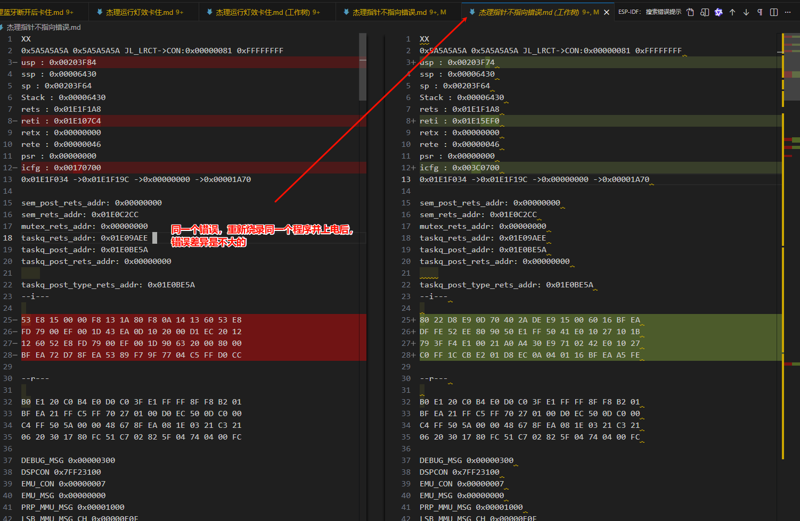  
```c
XX
0x5A5A5A5A 0x5A5A5A5A JL_LRCT->CON:0x00000081 0xFFFFFFFF 
usp : 0x00203FF0 
ssp : 0x00006430 
sp : 0x000063D0 
Stack : 0x00006430 
rets : 0x00002E0C 
reti : 0x01E1FC1C 
retx : 0x00000000 
rete : 0x00000000 
psr : 0x00000000 
icfg : 0x07010280 
0x01E1F91A ->0x01E1FC1C ->0x01E1F91A ->0x01E1FC1C 

sem_post_rets_addr: 0x00000000 
sem_rets_addr: 0x01E0C2BE 
mutex_rets_addr: 0x00000000 
taskq_rets_addr: 0x01E026EC 
taskq_post_addr: 0x01E0275C 
taskq_post_rets_addr: 0x00000000 
	
taskq_post_type_rets_addr: 0x01E0275C 
--i--- 
 
50 ED 7C 04 31 E1 FF 0F 50 ED 7D 14 00 FF 00 00 
86 FE 50 ED 78 13 6A 64 68 63 81 E8 01 20 D0 4C 
00 FF 00 00 E3 09 68 69 00 FF 1E 00 F6 09 6C 64 
30 E1 FF 4F 81 17 08 FF B4 10 71 FE 00 FC 95 06 

--r--- 
 
C2 FF EC 55 00 00 04 88 D8 EC 1A 30 D8 EC 2A 40 
03 E8 01 40 A0 00 C0 21 80 F8 F6 03 BF EA 45 F6 
54 04 75 04 02 16 64 E0 00 03 C4 FF 94 59 01 00 
C0 60 BF EA A1 F9 00 5B C0 FF 8A 55 00 00 22 41 

DEBUG_MSG 0x00000001 
DSPCON 0x7FF23120 
EMU_CON 0x00000007 
EMU_MSG 0x00000000 
PRP_MMU_MSG 0x00000000 
LSB_MMU_MSG_CH 0x00001617 
PRP_WR_LIMIT_MSG 0x00000000 
LSB_WR_LIMIT_CH 0x00000000 
PRP_SRM_INV_MSG 0x00000000 
LSB_SRM_INV_CH 0x00000000 
ZZ
debug err msg : watchdog
0=0x00000001 
1=0x0000FFFF 
2=0x000055EC 
3=0x00000006 
4=0x00000000 
5=0x01E15A46 
6=0x00005A50 
7=0x00011C10 
8=0x08080808 
9=0x09090909 
A=0x00000000 
B=0x11111111 
C=0x12121212 
D=0x13131313 
E=0x14141414 
F=0x15151515 0x321C651C 
usp = 0x00203FF0 
12 12 12 12 13 13 13 13 14 14 14 14 15 15 15 15 
00 00 00 00 00 00 00 00 00 00 00 00 00 00 00 00 
```
```c
C:\JL\pi32\bin\llvm-objdump.exe -d -start-address=0x01E1F900 -stop-address=0x01E1FD00 cpu/br23/tools/sdk.elf

C:\JL\pi32\bin\llvm-objdump.exe  # 工具路径：杰理SDK自带的LLVM反汇编工具
-d                               # 核心参数：对二进制文件进行反汇编（disassemble）
-start-address=0x01E1F900        # 起始地址：只解析从0x01E1F900开始的指令
-stop-address=0x01E1FD00         # 结束地址：解析到0x01E1FD00为止（范围约1KB）
cpu/br23/tools/sdk.elf           # 目标文件：杰理AC63的固件ELF文件（带符号表）
```

## 音箱key事件传递
### 按PREV、NEXT键日记：
[Debug]: [BT]bt key_event:40 0 40 1 
对应->bt_key_event_handler 对应-> bt_sys_event_handler 对应->app_bt_task->app_default_event_deal->app_common_key_msg_deal

[Info]: [APP_ACTION]common_key_event:40 
对应->app_common_key_msg_deal

bt_layout_onkey 40 
BT_MUSIC_NEXT 
对应->bt_layout_onkey

[Info]: [SPP_AND_LE]app_key_evnet: 40,0
在IOT的SDK中多一个

[Debug]: [BT]bt key_event:136 0 136 0 
对应->bt_key_event_handler

[Info]: [BT]    KEY_MUSIC_NEXT 
对应->bt_key_event_handler
## SDK-BUG
1. 这个数据源不能超过7个字符（UI设计工具填入上限是8个字符），否则编译不报错一直找不到问题点在哪里。（内部静态库可能定义的是u8[],最后一个\n）  
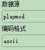
会导致只显示一半
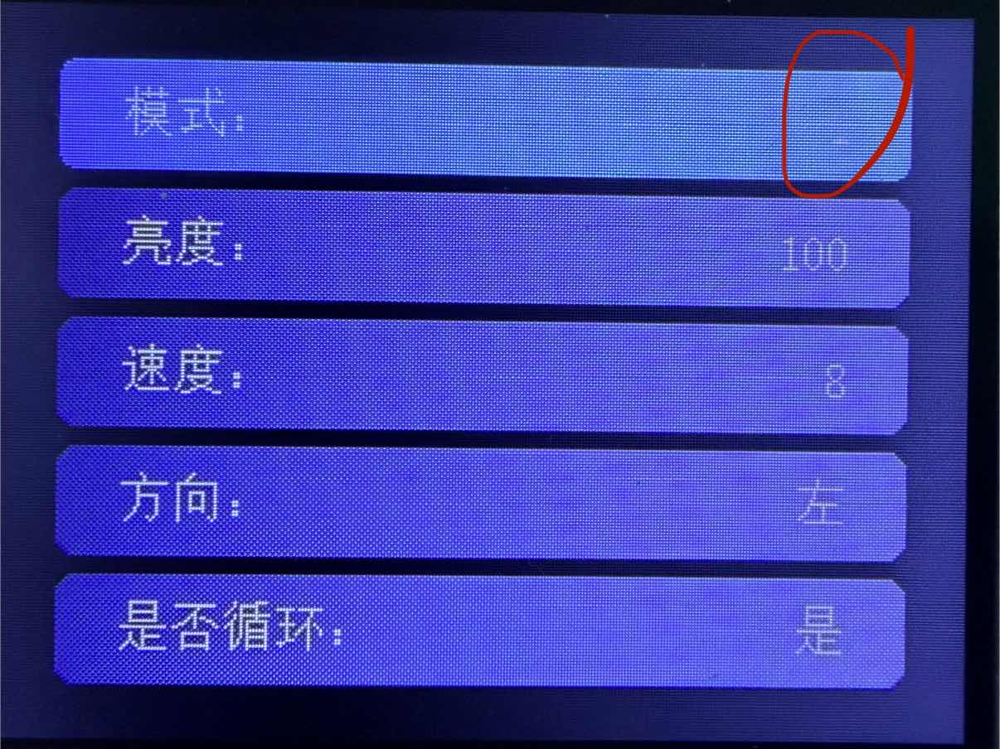
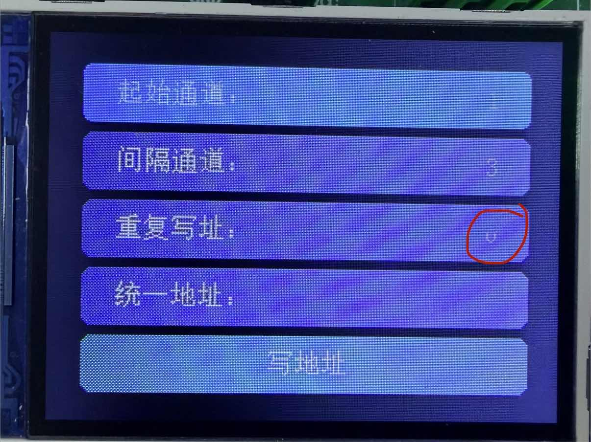
2. 给进度条（0-100）写一个61会不显示，60和62都显示正常。只能规避61了

        if (persent == 61) {
            persent = 60;
        }
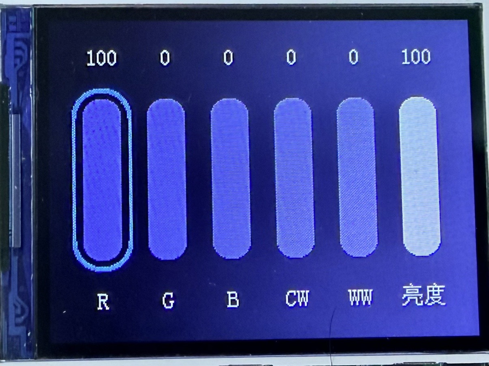
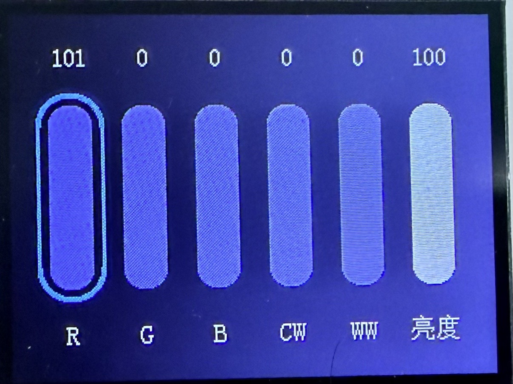
另外进度条只能从上往下调，不能设置方向。只好用100-去实际数来设置进度条。并且UI底图和填充色图要互换。  
3. 使用ui_hide();隐藏布局的时候。显示上一个布局的时候整个屏幕都会叠影或者说整个页面分成12份斜体。跑的也是例程。UI例程 json文件的bug导致编译出的资源有问题。页面新建后再绘制编译出来的资源文件就没问题了。
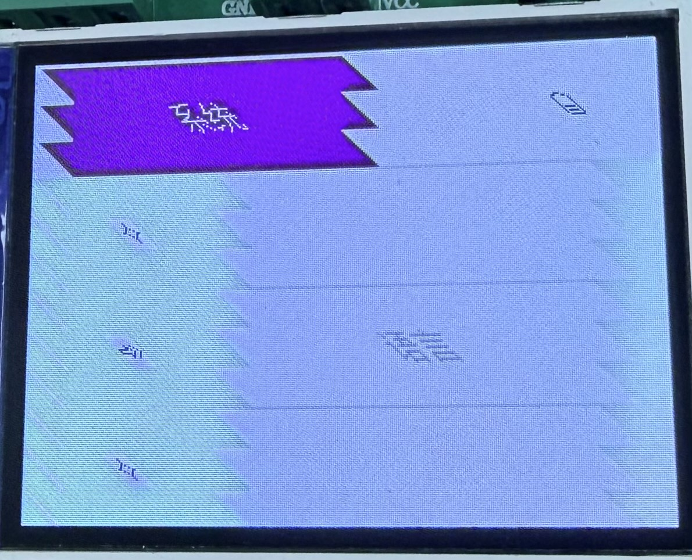
4. 还有UI编辑器修改坐标以及长宽数值后，必须在页面上点击一下该控件才可以生效。否则设置编译后显示有问题。