# 置顶链接
## 官方资料
[维晟智能官方网站](http://www.wisesun.com/)  
[WS8100 Datasheet (V1.8)](https://file1.elecfans.com/web2/M00/CF/54/wKgaomYhdhaAbytGAB59JY864vI282.pdf)  
[WS8100 Mesh 开发指南](https://dianyuan-public.oss-cn-shenzhen.aliyuncs.com/community/2022/06/80e5c202206171505001871.pdf)  

## 其他资料
[维晟CSDN官方博客（含应用案例/模组资料）](https://blog.csdn.net/2401_86272061)  

## 芯片信息
WS8100 是深圳前海维晟智能技术有限公司（WiseSun）推出的一款符合 **BLE 5.0** 规范的高性能低功耗蓝牙 SOC 芯片。

片上集成了 Balun，**无需阻抗匹配网络，无需外挂晶振负载电容，无需外部 32KHz 晶振**，最大限度地节省 BOM 成本。片上集成了高效率 DC-DC 降压转换器以实现超低功耗。

### 参数
#### 微控制器
- 32 位高性能 RISC 核心
- 16MHz / 32MHz 可配置时钟
- **512KB / 1MB Flash**（两种型号可选）
- 40KB 缓存静态 RAM（SRAM）
- 2 引脚 cJTAG 和 JTAG 调试接口
- 支持无线升级（OTA）
- 工作温度：-40°C ~ +105°C

#### 射频部分
- 2.4GHz RF 收发器，符合蓝牙低功耗（BLE）5.0 规范
- **接收灵敏度**：-97dBm
- **发射功率**：-20dBm ~ +7dBm 可编程输出功率
- 单端 RF 接口（集成 Balun，无需外部匹配电路）

#### 外设资源
所有数字外设引脚均可连接任意 GPIO（IO 多路复用）：
- **UART ×2**：硬件支持流控（CTS/RTS）
- **SSI ×2**（SPI/MICROWIRE/TI 模式）同步串行接口
- **I2C ×1**
- **PWM ×2**
- **通用定时器 ×4**
- **RTC**（实时时钟）
- 键盘控制器
- 正交解码器（旋转编码器等）
- **AES-128** 安全模块
- **10-bit ADC**：1.3MSPS，8 通道模拟多路复用
- 集成电压检测、温度传感器
- 高精度 32KHz RC 振荡器（省外部 32K 晶振）
- 支持 16MHz IO 时钟输出

### 低功耗
#### 工作电压
- **1.8V ~ 3.6V**
- 芯片内部集成 DC-DC 转换器

#### 电流消耗
| 模式 | 电流 | 条件 |
|-----|------|-----|
| MCU 工作 | 1.4mA | @ 16MHz |
| 接收 | 8.5mA | BLE RX |
| 发送 | 9.5mA | @ 0dBm |
| 发送 | 16mA | @ +7dBm |
| 深度休眠（IO 唤醒） | 0.6uA | 仅 AON 域 |
| 深度休眠（32K on，8K RAM on） | 1.0uA | - |
| 深度休眠（32K on，24K RAM on） | 1.1uA | - |
| 1s 间隔可连接广播 | 24uA | 平均 |
| 1s 间隔连接保持 | 12uA | 平均 |
| 1s 间隔不可连接广播 | 15uA | 平均 |

#### 低功耗模式电源域

| Power Domain | Peri | Ram | AON | Flash |
|---|---|---|---|---|
| (断电休眠) Deep Sleep+ | Off | Off | On | Off |
| (低功耗休眠) Deep Sleep | Off | Ret. | On | Off |
| (休眠) Sleep(HOSC off) | On | On | On | On |

## Keil配置

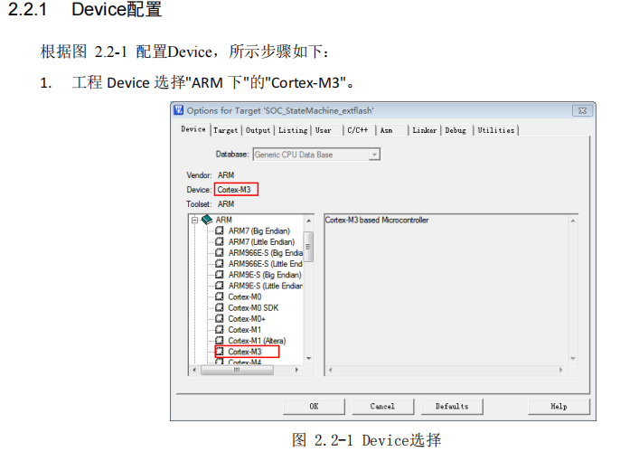

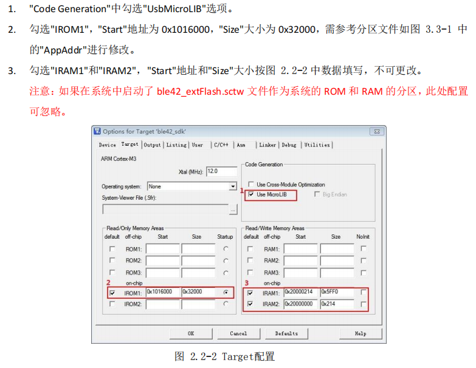

此处为官方,实际上好易达使用了WS8100.sct文件也就是ble42_extFlash.sct,这两处可以忽略

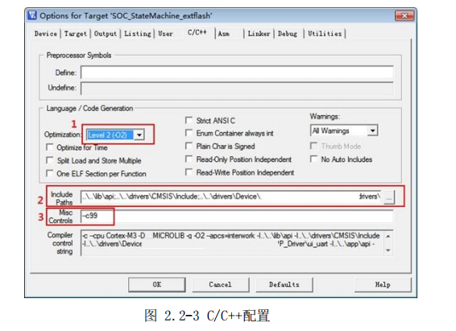

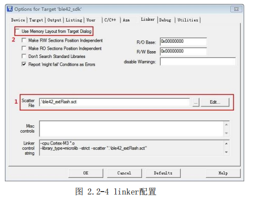

将官方的.\ble42_extFlash.sct替换为.\WS8100.sct

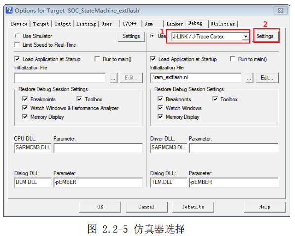  

需要.\ram_extflash.ini将替换为.\WS8100.ini  

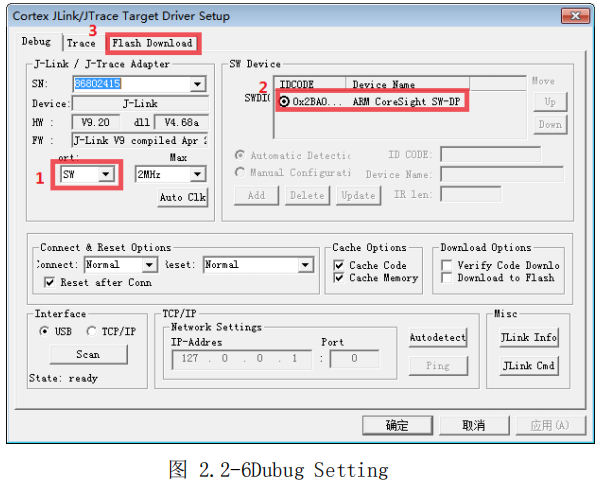

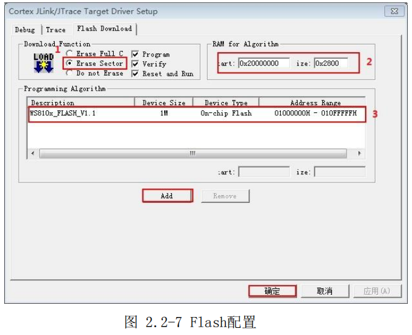  

好易达没有添加编程算法文件，选择章节 1.3 步骤添加的文件"WS810x_FLASH_V1.1.FLM"，配置成功后点击"确定"。如需添加：


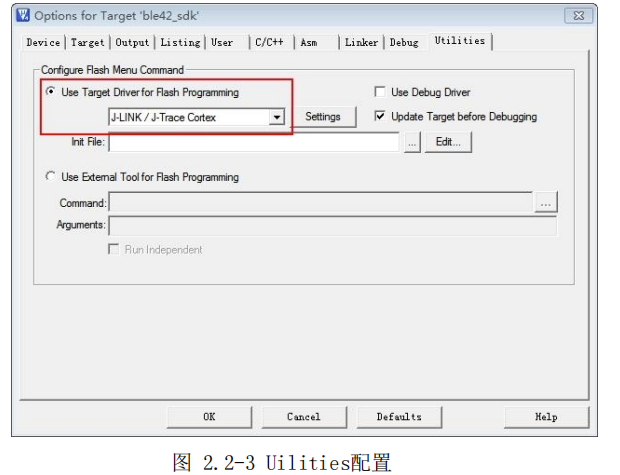

好易达没有勾选Update Target before Debugging

## 打印跟踪

```c
dbg_printf("%s, %s, %d\r\n", __FILE__, __FUNCTION__, __LINE__);
```

---
## SDK工程介绍：

- App：通用应用程序代码
  - Inc：通用应用程序源码头文件
  - Src：通用应用程序源码源文件
- Dm：设备管理程序代码（通用矩阵键盘，通用案件模块）
  - Inc：设备管理程序代码头文件
  - Src：设备管理程序代码源文件
- Drivers：芯片外设程序代码
  - CMSIS：芯片核相关头文件
  - Cpu：芯片相关文件
  - Cpu_driver：芯片外设驱动代码
  - User_driver：芯片外设用户驱动代码
- Example：sdk 示例代码工程文件
  - At_demo：AT 指令集示例工程
  - Beacon_demo：Beacon 功能示例工程
  - Ble_keyboard_demo：键盘功能示例工程
  - Ble_mouse_demo：鼠标功能示例工程
  - Findme_demo：防丢器功能示例工程
  - Remote_control_demo：遥控器功能示例工程
  - Transpond_demo：透传功能示例工程
- Lib：host 协议栈 lib 库
  - Inc：host 协议栈 lib 库接口头文件
  - Src：host 协议栈库文件

2. 上电到广播工作流程

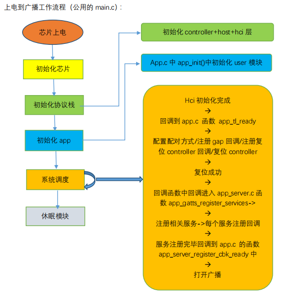

3. 任务调度机制
 系统通过调度，处理插入到事件列表中的事件

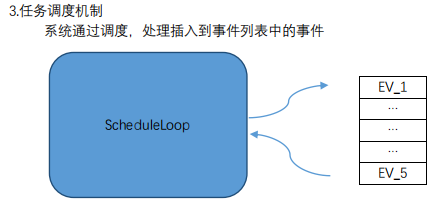

4. 插入一个事件到调度链表中

```c
void fsm_event_func(fsm_func *func, fsm_func *freefunc, void *arg, UINT8 event);
/*
api简介：插入一个事件到调度队列中
func：事件被调度时，回调的函数
freefunc：事件被调度后，回调函数中释放参数的函数。
Arg： 事件被调度室，回调函数中携带的参数
Event：事件被调度室，回调函数中携带的参数
*/
//例子：
void gap_fsm_evt (UINT8 event, UINT16 *arg)
{
    Dbg_printf( "event was schedule\r\n" );
    FREE(arg);
}

UINT16 *arg;
arg = NEW(sizeof(UINT16));
*arg = 1;
fsm_event_func((fsm_func *) gap_fsm_evt, (fsm_func *) gap_fsm_evt, arg, 1);
```

4. timer 使用介绍
```c
struct fsm_timer *timer_add(UINT32 millisec, UINT8 event, fsm_func *func, void *arg);
/*
Api简介：添加一个timer定时器
Millisec：timer超时时间，单位：ms
Func ：当timer定时到时间，回调并执行这个函数
Arg ：毁掉执行函数的时候，携带的参数
*/
UINT8 *timer_del_byp(struct fsm_timer *ft);
/*
api简介：删除一个timer通过创建timer时返回的ft指针
*/
void timer_del_byp_free(struct fsm_timer **ft);
/*
Api简介：删除一个timer通过创建timer时返回的ft指针的时针。
*/
struct fsm_timer *timer_restart(struct fsm_timer *ft, UINT32 millisec, UINT8 event,
                                fsm_func *func, void *arg);
/*
api简介：重新启动一个timer
ft：重启timer的ft指针
Millisec：timer超时时间，单位：ms
Func ：当timer定时到时间，回调并执行这个函数
Arg ：毁掉执行函数的时候，携带的参数
*/
//举例说明：
struct fsm_timer *timer_id = NULL;

void app_adv_timer_timeout_cbk(UINT8 event, void *arg)
{
    dbg_printf( "timer timeout\r\n" );
    timer_del_byp_free(&timer_id);
}

timer_id = timer_add (30000, 1, app_adv_timer_timeout_cbk, NULL);

```
定义一个30s超时的timer，超时后打印并删除timer id。


## 3 gatt服务介绍
### 3.1 服务注册流程介绍
服务相关操作在文件app_server.c 中进行处理
当协议栈初始化完成以后会回调到函数app_server_reg_service()中
```c
/* * @brief this function is register user's services. */ 
void app_server_reg_service(void) 
{ 
    //注册battery service 
    app_gatts_register_bat_service();
    //在此处加入user 需要的服务注册接口调用
    //记录最后一个服务的service uuid 
    s_last_service = GATT_UUID_BATTERY_SERVICE; 
}
```

#### 3.1.1 如何添加一个服务
```c
void app_gatts_register_bat_service(void) 
{
    struct gatt_service_stru *service; 
    struct att_uuid_stru uuid; 
    struct gatt_characteristic_stru *character; 
    UINT8 val; 
    //给service 分配空间 
    service = (struct gatt_service_stru *)List_NodeNew(sizeof(struct gatt_service_stru)); 
    //给这个服务注册回调函数 
    service->cbk = (void *)app_gatts_common_service_cbk;
    //service uuid 赋值 
    att_uuid_set_u2(&service->uuid, GATT_UUID_BATTERY_SERVICE); 
    /* Battery Level, uint8 */ 
    val = 100; 
    //characteristic uuid 赋值 
    att_uuid_set_u2(&uuid, GATT_UUID_BATTERY_LEVEL); 
    //注册characteristic 进入service 
    character=gatt_add_characteristic(service,&val,1,&uuid,GATT_PROPERTIES_BATTERY_LEVEL_BATTERY_SERVICE); 
    //注册characteristic 的descriptor cccd 
    gatt_add_descriptor_ccc(character, 0, GATT_PROPERTIES_CCC_BATTERY_LEVEL_BATTERY_SERVICE); 
    //注册自己到协议栈中 
    gatt_server_reg_tree(service); 
}
```

#### 3.1.2 如何修改服务特征值权限
ATT_READ :打开读权限  
ATT_WRITE_NORSP :打开无回复的写权限  
ATT_WRITE :打开又回复的写权限  
ATT_NOTIFY :打开notify 权限  
ATT_INDICATE :打开indication 权限  

打开characteristic 读权限和notify 权限的例子:
```c
character=gatt_add_characteristic(service,&val,1,&uuid, (ATT_REAED | ATT_NOTIFY) );
```

#### 3.1.3 如何从service接收master的数据
注意:想要接收master 数据,必须确保这个service 中的characteristic value 打开了ATT_WRITE_NORSP 或ATT_WRITE 得权限,确保master 有写操作的权限｡
```c
void app_gatts_battery_service_cbk(void *context, UINT8 ev, void *arg) 
{
    UINT16 uuid; 
    struct att_pend_ind_stru *req = arg; 
    switch (ev) { 
        case GATT_EV_HDL_TREE: 
            //注册服务完成,应用层备份一份service 
            app_gatts_save_service(arg); 
            //释放这个服务 
            gatt_free_service(arg); 
            arg = NULL; 
            break;
        case GATT_EV_PEND_IND: 
            //获取被写的characterictic 的uuid 
            uuid = att_uuid_get_u2(&req->uuid); 
            //一个特征值的cccd 被写了 
            if (uuid == GATT_UUID_CLIENT_CHARACTERISTIC_CONFIGURATION) { 
                dbg_printf("ccc handle=%x\r\n",req->it.hdl); 
                //回复master 的写完成 
                gatt_server_pend_ind_response(arg); 
                arg = NULL; 
                break; 
            }
        default: 
            break; 
    }
    //释放此参数 
    FREE(arg); 
}
```
如果master 操作slave 一个service 的characteristic 就会回调到注册事件中的回调中,回调事件case GATT_EV_PEND_IND:通过uuid 获知被操作的characteristic,req->it.val.value 中是数据,req->it.val.len 是数据长度｡

#### 3.1.4 如何知道master写了cccd
同上操作,获知master 写了一个service 的charasteristic,如果uuid 是cccd,则判断master 写了这个服务的uuid

#### 3.1.5 如何给master notify/indicate 一段数据
注意:slave 想要给master 上报数据,首先确定master 打开了此上报服务的cccd 权限,才可以给master 上报数据｡

## 4 gap状态切换介绍

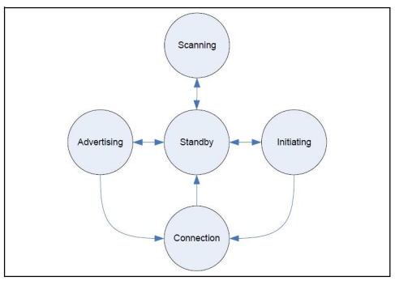
### 4.1 进入不同的广播模式
接口API:
```c
void app_gap_set_ble_operation_modes(app_ble_mode_t mode,UINT16 adv_min_interval, UINT16 adv_max_interval, struct hci_address_stru *peer_addr)
```
参数一 mode:
```c
/*关闭广播不可发现不可连接*/ APP_BLE_MODE_NONE_DISCOVERABLE_NONE_CONNECTABLE, 
/*限定可发现不可连接*/ APP_BLE_MODE_LIMITED_DISCOVERABLE_NONE_CONNECTABLE, 
/*通用可发现不可连接广播*/ APP_BLE_MODE_GENERAL_DISCOVERABLE_NONE_CONNECTABLE, 
/*限制可发现可连接*/ APP_BLE_MODE_LIMITED_DISCOVERABLE_CONNECTABLE, 
/*通用可发现可连接*/ APP_BLE_MODE_GENERAL_DISCOVERABLE_CONNECTABLE, 
/* HIGH_DUTY 定向广播*/ APP_BLE_MODE_HIGH_DUTY_CYCLE_DIRECTED_CONNECTABLE, 
/* LOW_DUTY 定向广播*/ APP_BLE_MODE_LOW_DUTY_CYCLE_DIRECTED_CONNECTABLE, 
/* Mode for Broadcaster */ APP_BLE_MODE_BROADCAST,
```
- 参数二/三 adv_min_interval/ adv_max_interval:
- 广播参数N 最大间隔必须大于等于最小间隔,范围:20ms~10.24s, N*0.625=实际广播参数,例: 20ms 广播间隔,实际广播参数adv_min_interval=20/0.625=32=0x20

### 4.2 更新链接参数
接口API:
```c
void ble_conn_updata_parameter(struct hci_address_stru *addr,uint16_t conn_min_interval, conn_min_interval, uint16_t conn_max_interval, uint16_t conn_latency, uint16_t conn_timeout)
```
参数一:对端地址  
参数二:最小连接间隔  
参数三:最大连接间隔  
参数四:latency  
参数五:连接超时时间  

### 4.3 主动发起配对
接口API:
```c
void ble_security_start(struct hci_address_stru *addr)
```
参数一:对端地址

### 4.4 主动断开链接
接口API:
```c
void app_ble_disconn_req(struct hci_address_stru *addr)
```
参数一:对端地址

### 4.5 清除配对信息
接口API:
```c
void smp_peer_keys_remove(struct smp_key_miss_stru *in)
```
参数一:对端地址

## 5 低功耗休眠介绍
低功耗休眠流程图:  
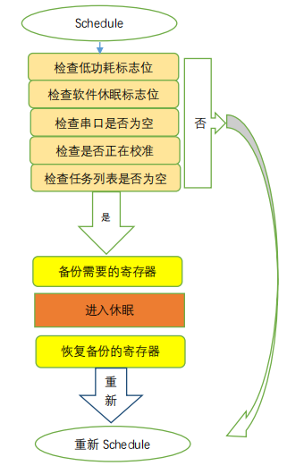

休眠状态除了retention 的寄存器,其他寄存器会丢失｡需要通过备份到retention RAM 区,唤醒以后再进行恢复或者重新初始化寄存器｡
```c
/* run task schedule. */ 
lib_schedule(); 
if(get_low_power_mode() == 0) 
continue; 
/* check some work is ongoing. */ 
if(cpu_prevent_sleep_get()) 
continue; 
/* check uart tx is idle.*/ 
if(!ui_uart_tx_is_idle()) 
continue; 
/* check calibrate if working. */
if(get_calibrate_ing()) 
continue; 
/* mask interrupt */ 
__set_FAULTMASK(1); 
/* is into sleep */ 
if(lib_sleep()) 
{
    /* prepare for into sleep. */ 
    /* into sleep. */ 
    Deepsleep_prepare(); 
    DeepSleepEnter(); 
    /* exit sleep */ 
    Deepsleep_exit(); 
    /* cancle mask interrupt */ 
    __set_FAULTMASK(0); 
}
```
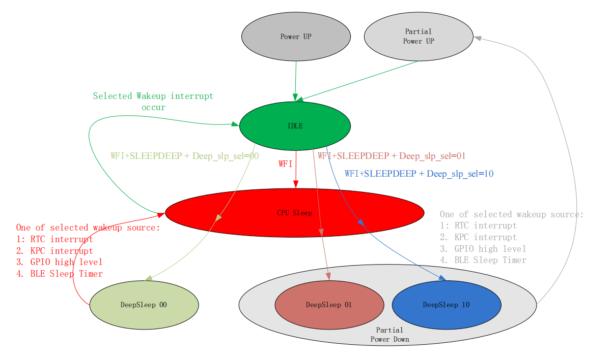

### 开启低功耗，系统重启
低功耗设置保护区最大可设置 24K，也就是 0x6000，超过了限定，系统重启。
查看方式：在 list 目录下有 Project.map

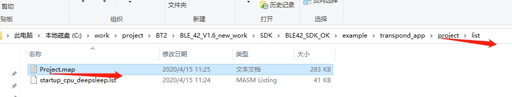

查看__initial_sp 地址，不要超过 0x20006000,超过了无法使用低功耗功能。

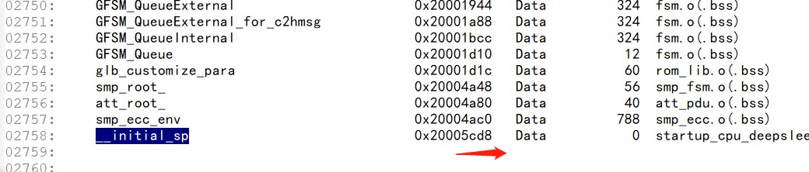

## Flash分区

### 1.1 默认分区大小

表 1-1 512K Flash 分区表

| 512K Flash 分区表 | 起始地址 | 大小 |
|-------------------|----------|------|
| UserData2 | 0x0107f000 | 4k |
| UserData1 | 0x0107a000 | 20k |
| Free | 0x01048000 | 200k |
| App | 0x01016000 | 200k |
| Stack | 0x01002000 | 44k |
| Boot | 0x01001000 | 40k |
| PartInfo | 0x01000000 | 4k |

### 1.2 分区配置

表 1-2 WS8100_ble_part_config

| 配置名称 | 数据 | 说明 |
|----------|------|------|
| UserData2Addr | 00 F0 07 00 | 用户数据 2 区首地址 |
| UserData2Size | 00 10 00 00 | 用户数据 2 区大小 |
| UserData1Addr | 00 A0 07 00 | 用户数据 1 区首地址 |
| UserData1Size | 00 50 00 00 | 用户数据 1 区大小 |
| FreeAddr | 00 80 04 00 | App 备份区首地址 |
| FreeSize | 00 20 03 00 | App 备份区首大小 |
| AppAddr | 00 60 01 00 | 应用固件区首地址 |
| AppSize | 00 20 03 00 | 应用固件区大小 |
| StackAddr | 00 B0 00 00 | 协议栈固件区首地址 |
| StackSize | 00 B0 00 00 | 协议栈固件区大小 |
| BootAddr | 00 10 00 00 | Boot 区首地址 |
| BootSize | 00 A0 00 00 | Boot 区大小 |
| partvalid | D4 2D 91 D3 | 是否启用 Flash 分区 |

### 2.1 控制字描述

表 2-1 512K Flash 分区表

| 控制字 | 说明 |
|--------|------|
| AccessInfoValid | 为 0xD3912DD4 时说明访问控制信息有效 |
| JtagDisValid | 为 0xD3912DD4 时说明 Jtag 被禁用 |
| UserPassword | 用户密码，默认 0xFFFFFFFF |
| RunOtaValid | 为 0xD3912DD4 时说明下次上电启动 OTA 程序 |
| Reserved | 保持 0xFFFFFFFF |

### 2.2 制字默认数据

表 2-2 WS8100_ble_access_config

| 控制字 | 数据 |
|--------|------|
| AccessInfoValid | D4 2D 91 D3 |
| JtagDisValid | FF FF FF FF |
| UserPassword | FF FF FF FF |
| RunOtaValid | FF FF FF FF |
| reserved1 | FF FF FF FF |
| reserved2 | FF FF FF FF |
| reserved3 | FF FF FF FF |

1. 行顺序不能更改
2. Valid 有效标志：0xD3912DD4; 无效标志:其他(一般 0xFFFFFFFF)。
3. 数据按小端模式存放，如：0x1000 地址需要在该文件中写成 00 10 00 00。

## API接口

### 3.1 app_server.c

蓝牙 GATT 服务相关处理，例如：注册服务、接受数据、notify 数据。

| # | 函数签名 | 功能说明 |
|---|---------|---------|
| 1 | `void app_server_reg_service(void)` | 注册服务，修改此函数来注册不同的服务 |
| 2 | `void app_gatts_register_iot_service(void)` | 注册透传 IoT 服务 |
| 3 | `void app_gatts_iot_service_cbk(void *context, UINT8 ev, void *arg)` | master 端对 slave 透传服务的操作，例如：写 CCCD、写数据 |
| 4 | `void app_gatts_iot_semd_packets(tAppGattIOTServiceDataStru *iot_data, UINT8 *data_pkt, UINT16 pkt_len)` | slave 端通过此接口 notify 数据给 master 端 |

### 3.2 app.c

蓝牙 GAP 相关功能管理，例如：广播、连接等。

| # | 函数签名 | 功能说明 |
|---|---------|---------|
| 1 | `void app_server_register_cbk_ready(void)` | 注册服务完成的 ready 回调 |
| 2 | `void start_advertising(app_ble_modet mode, uint16_t adv_min_interval, uint16_t adv_max_interval)` | 打开广播 |
| 3 | `void app_ble_disconnect_req(structHCI_AddressStru *addr)` | slave 主动断开连接 |
| 4 | `void ble_security_start(structHCI_AddressStru *addr)` | slave 端主动申请配对加密 |
| 5 | `void app_ble_connected_ind(structHCI_AddressStru *addr)` | 被 master 连接成功的回调 |
| 6 | `void app_gatts_disconnect_ind(tAppDeviceInstStru *device, UINT8 reason)` | 被 master 断开连接的回调，reason 为断开原因码 |
#### 定时功能协议
| buf下标 | 取值范围 | 字段说明 |
| ---- | ---- | ---- |
| buf[0] | 0x1D | 指令头 |
| buf[1] | 0x1F | 子指令 |
| buf[2] | 0x01/0x02 | 方向：0x01 App ➜ 设备；0x02 设备 ➜ App |
| buf[3] | 0x01/0x02 | 定时编号：0x01 定时1；0x02 定时2 |
| buf[4] | 0x00/0x01 | 定时开关：0x00 关闭；0x01 开启 |
| buf[5] | 0~23 | 定时小时 |
| buf[6] | 0~59 | 定时分钟 |
| buf[7] | 0~240 | 定时状态运行时长 |
| buf[8] | 0x01/0x02/0x03 | 灯光模式：0x01 RGB；0x02 暖光；0x03 动态场景 |
| buf[9] | RGB模式：0~255(R通道)<br>暖光模式：0~100(WW亮度)<br>动态场景：(场景ID) | 模式专属参数 |
| buf[10] | 0~255 | G通道数值 |
| buf[11] | 0~255 | B通道数值 |
| buf[12] | 1~9 | 音乐编号 |
| buf[13] | 0~100 | 音量大小 |
| buf[14] | 0x01/0x02/0x04/0x08/0x10/0x20/0x40 | 周循环掩码，支持多日按位或叠加 |
| buf[15] | 0x00 | 预留字节，固定传0 |
| buf[16] | 0/1/2 | 灯光变化方式：0=普通，1=渐亮，2=渐灭 |
| buf[17] | 0xFF | 预留 |
| buf[18] | 0xD1 | 协议尾标识 |

## 平安灯硬件电路 

### LED（高电平有效）

PC3、PC4、PC5 ：定时指示灯（对应30分钟/60分钟/90分钟）
通过按键PC1切换定时时间（无定时/30分钟/60分钟/90分钟）处于定时亮，定时结束熄灭。
PA0 ：状态提示灯（相关逻辑：开机会亮 3 秒、灭 7 秒，关机会保持熄灭）

### 按键 (低电平有效)

PC2 ：电源/模式切换 按键（短按场景模式切换，长按开关机）
PC1 ：定时切换按键（短按切换定时时间）
PA2 ：白噪声开关/切换 按键（短按切换白噪声音，长按开关白噪声）

### ADC

PA3 ：MIC 采集
PA1 ：电池电压采集

### PWM

PB4 ：暖光PWM输出

### SPI

PB3 ：归零码输出,5*6灯屏输出

### 其他引脚作用

PB5 ：MCU 控制引脚输出高电平维持开机状态，输出低电平即关机
PB6 P_DEC：判断是电池供电还是外接 USB5V 供电。MCU 读到高电平，判定：**USB 电源已插入**。读到**低电平**，判定：只有电池供电。

低功耗开关：
PD7 灯板供电关断
PA4 音频供电开关
PB7 DCDC 5V 供电开关
接入电池默认是低电平。需要输出高电平开启，然后输出低电平关闭。


### 音乐模块串口

PA7 ：UART1RX
PA6 ：UART1TX

PC0 TEST的作用？
可能是测试用的引脚

## 两路壁灯硬件电路
### 按键输入（低电平有效）PC2
### PWM输出 暖白PB4，冷白PB1
### 32M晶振
### 烧录串口：
UART_TX: PD3
UART_RX: PD2


