# 置顶链接
1. [DMX512协议](https://www.ledyilighting.com/zh-CN/everything-you-need-to-know-about-dmx512-control/)  
2. [百度百科](https://baike.baidu.com/item/DMX512/2904121)  
3. [CSDN](https://blog.csdn.net/weixin_63723467/article/details/145046968)  
4. [嵌入式平台DMX&RDM协议开源项目说明](https://blog.csdn.net/weixin_63723467/article/details/149570899?spm=1001.2014.3001.5501)  
5. [dmx-rdm库](https://github.com/murongbaibai/dmx-rdm)  
6. [CSDN2](https://blog.csdn.net/weixin_43870206/article/details/107692446)  

# DMX512
DMX512是舞台灯光中的一种专用协议，让灯光和操控台之间进行通信的，是美国舞台灯光协会1990年提出的。是一种多路复用，主从关系的通信协议。DMX就是数字多路复用的缩写。  
多路复用的意思是这些所有的灯都是并联在一根总线上面的。通过差分Date-和Date+这两根线进行通信的。每个灯都会有它对应的地址。  
DMX512代表每一包的数据有512帧。（已发送 513 个，但未使用第一个）

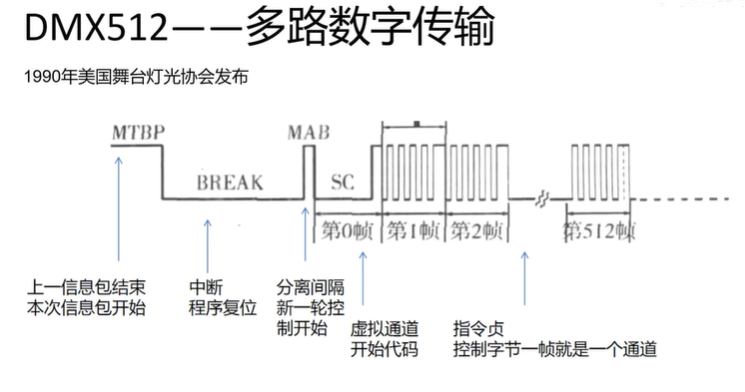  

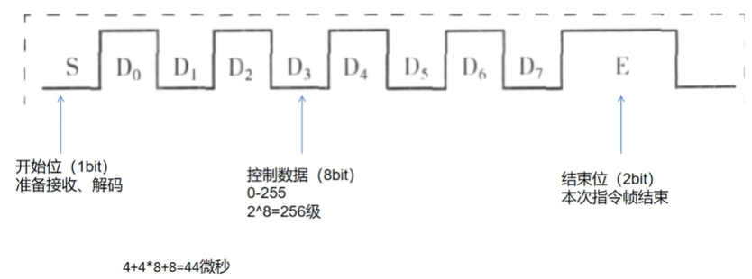  
每一位就需要4微秒的时间。一条指令帧（11位）就要44微秒。


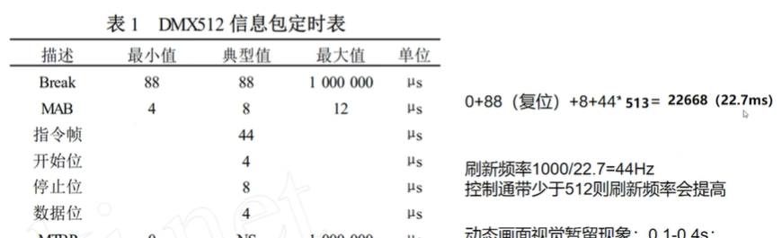  

如果是512个灯 一个指令包到下一个指令包需要耗时22.7ms，刷新频率就是44ms

如果是1024个灯 一个指令包到下一个指令包需要耗时45.4ms，刷新频率就是22.7ms
（会出现信号卡顿）


所有芯片应该是并联的 收取到所有的数据512个 然后根据自己的地址取出对应的数。是一个数据发完所有的灯根据自己的地址同时改变一次的。信号是所有的灯一起收到的。  

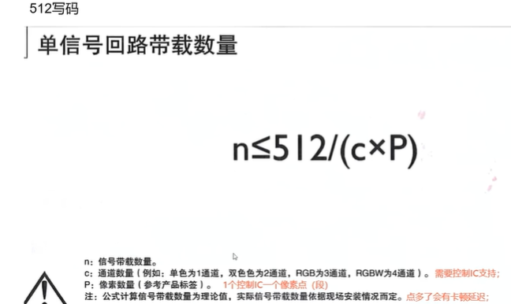  
这是 **DMX512 系统中，计算单信号回路可带载设备数量的公式** ，核心用于舞台灯光、LED 控制等场景，判断在 512 通道总数限制下，能接多少个设备（或像素段），以下拆解每个参数：

### 公式含义  
`n ≤ 512 / (c × P)`  
- `n`：**可带载的设备（或像素段）数量**（比如能接多少个 LED 灯、摇头灯，或多少段像素灯带 ）。  
- `512`：DMX512 协议单回路最大通道数（一条回路最多控制 512 个独立通道 ）。  
- `c`：**单个设备（或像素段）的通道数量**（如单色灯 1 通道、RGB 灯 3 通道、RGBW 灯 4 通道 ）。  
- `P`：**单个设备（或像素段）的像素数量**（比如 1 个灯具是 1 像素，1 段灯带含 10 像素，就填 10  ）。  


### 实际应用示例  
假设你要控制 **RGB 灯带（c=3 通道）**，且 **一条灯带含 10 个IC（P=10）**：  
代入公式得 `n ≤ 512 / (3×10) ≈ 17.06` → 实际最多带 17 条灯带（通道数不能超 512 ）。  

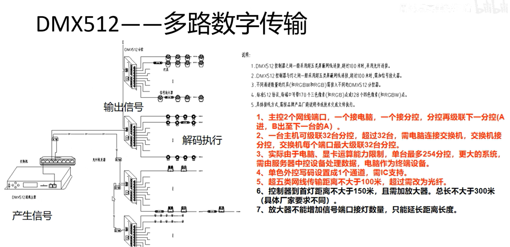  

灯带PO是写码线
# 传输介质
Art-Net：是一个基于 TCP/IP 协议族的以太网协议，通过 UDP 传输 DMX512 协议数据和 RDM 协议数据，用于在节点和控制器之间通信。Art-Net 主要解决了原来 DMX512 协议在传输距离、带宽、通用性及构建复杂网络等方面的缺陷。它已经历了 4 个版本，Art-Net 4 允许一个网关支持超过 1000 个 DMX 端口，还整合了管理 sACN 的能力，用户可以选择 Art-Net 作为发现、管理和 RDM 工具，同时将 sACN 用于实时控制数据。  
sACN：是一种 E1.31 协议，基于以太网传输来进行 DMX 控制。sACN 通过以太网进行数据传输，用户可以使用标准的 RJ45 网络连接将多个设备连接在一起，减少了对 DMX 电缆和分配器的需求，简化了系统的布线和安装过程。此外，sACN 还可以传输更多的控制信息，如灯光效果和参数，不仅可以控制灯光的亮度和颜色，还可以实现更复杂的灯光效果，提供更多的创意自由度。  
## XLR-3接口顺序
1为GND，2为Date-，3为Date+。
### XLR-5接口顺序
1为GND，2为Date-，3为Date+，4为预留Date-，5为预留Date+。
# DMX控台
DMX192控台后面有个左右切换的开关。往右是2为Date-，3为Date+。往左是2为Date+，3为Date-。默认往右（即设备外）即可。
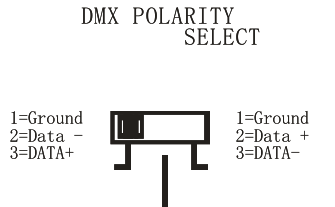
# 时序
其实就是起始信号，后面跟数据包，每帧数据之间插入一个占。即帧间标记时间(MTBF) 最长可达一整秒。 数据帧之后是另一个可以持续长达一秒钟的 MTBP。 但它们很少用于保持帧速率稳定。
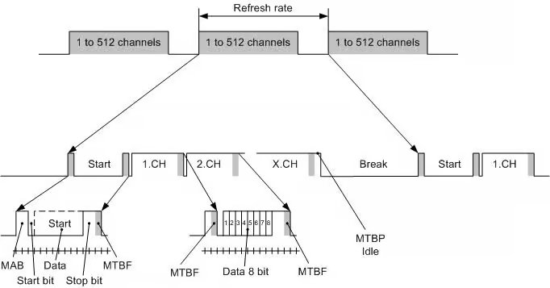
## 起始信号
DMX512波特率：250Kbps，即每比特宽度是4 us。  
数据帧格式：11位（1位开始位，8位数据，2位停止位）。  
标准的DMX512信号包括一个MTBP位、一个Break位、一个MAB位、一个SC和512个数据帧。其中Break位不小于88us（即两个帧），MAB位不小于8us（即两个位）。时序图如下：  
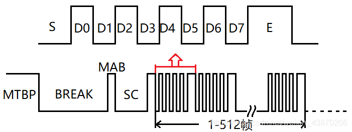  
（1）MTBP（Mark Time Between Packages）标志着一个完整的DMX512数据包的发送完毕，同时也是下一个数据包即将开始是标示位，高电平有效，表示当前传输线处于空闲状态，没有数据传输。  
（2）BREAK是一个DMX512数据包的启示控制信号，对应着一个数据包结束后的复位阶段，复位完成后接着应该发送下一包的数据。协议规定BREAK的信号为低电平有效，并且持续时间不小于两个DMX512的数据帧的长度，即88us。  
（3）MAB（Mark After Break）是一个数据包开始发送的标识，由于每一个数据帧的第一个位为低电平，故为了区分BREAK的低电平和数据帧的起始位的低电平，加入了MAB信号。协议规定了MAB的典型持续时长为8us，即两个位的时间，高电平有效。  
（4）SC（Start Code）SC即起始码，它和一个普通的数据帧一样，但是它的8位数据位均为零，标示数据包中数据帧的开始。  
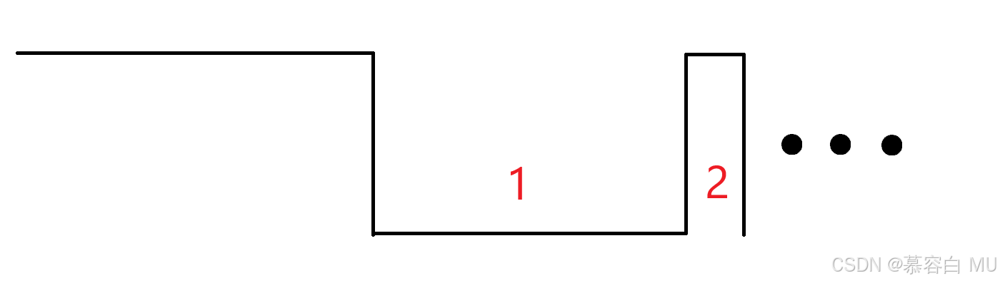  
说白了起始信号就是先拉低后拉高，但是要产生这个起始信号可不容易，因为串口无法输出持续两帧的低电平，每一帧后面固定会跟随停止位（高电平），所以要产生起始信号需要通过GPIO的输出实现，代码在后面有。  

|信号	|最少持续时间	|最大持续时间   
|---|---|---|
|1	|2帧（88us）	|1s 
|2	|1位（4us）	|1s 
## 数据包时序
 1是数据帧之间的占，用于分割每帧数据，可有可无。2就是数据帧，数据帧为一位起始位，八位数据位及两位停止位组成。按照上面配置即可。  
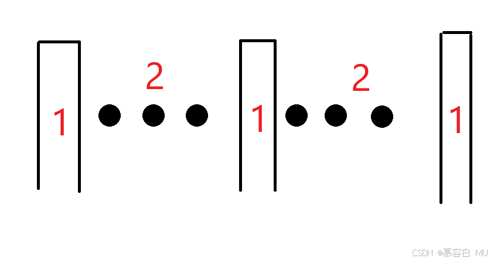  

|信号	|最短持续时间	|最长持续时间
|---|---|---|
|1	|0s	|1s |
|2	|44us	|44us   |

数据帧与数据帧之间的时间小于1s，如果调光器在1s内没有收到新的数据帧，便可知数据已经丢失。
## 数据包格式
DMX512的数据包格式比较简单，由一个起始码和512个通道值组成，DMX512协议标准中规定0x00作为DMX512的固定起始码，一般不做更改，但实际生产中可以自定义，例如0x00作为舞台灯光控制，0x01作为舞台火花机控制......但是以下的起始码不能自定义。  
Start Code 0x17 表示文本数据包，而 Start Code 0xCC 表示远程设备管理数据包。 在 Start Code 之后，其余的 DMX 数据以 512 帧的形式发送，这些帧都是相同的。 这些帧称为 SLOT（RGB 值、CMY 值、伺服位置、烟雾机压力等）。  
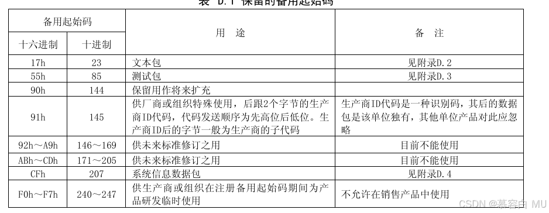  
1~512（最大是512）作为通道值，用于控制舞台设备，例如有个彩灯，彩灯有四个RGB灯珠DMX512地址是1，占据通道有16个。那么这个彩灯就处理DMX512数据包的通道1到通道16，通过这些通道的值完成相应的动作。如：当DMX512数据包的通道1为0~255时，彩灯就调自己的亮度为0~255。当通道2为0~255时就调自己的R值,通道3调G值......这样就可以使用DMX512协议进行对灯光设备的控制。一般发送DMX512数据的设备是DMX512控台，可以去淘宝搜索看看。  
# 芯片
## UCS512联芯科

# STM32实现代码
## 方式一：发送BREAK信号使用GPIO，后续数据帧切换为使用串口DMA发送。接收BREAK信号使用串口帧错误中断，后续数据帧使用串口DMA接收。
### 配置串口
设置为 250000 bps（比特率），这是 DMX512 协议的标准波特率。

UART_STOPBITS_2 表示使用 2 个停止位，这也是 DMX512 协议的强制要求
```c
// 配置UART句柄结构体，指定使用USART1外设
huart1.Instance = USART1;
// 配置波特率为250000 bps
huart1.Init.BaudRate = 250000;
// 配置数据位长度为8位
huart1.Init.WordLength = UART_WORDLENGTH_8B;
// 配置停止位为2位
huart1.Init.StopBits = UART_STOPBITS_2;
// 配置无奇偶校验
huart1.Init.Parity = UART_PARITY_NONE;
// 配置为同时支持发送和接收模式
huart1.Init.Mode = UART_MODE_TX_RX;
// 禁用硬件流控制(RTS/CTS)
huart1.Init.HwFlowCtl = UART_HWCONTROL_NONE;
// 配置过采样率为8倍
huart1.Init.OverSampling = UART_OVERSAMPLING_8;

// 根据上述配置参数初始化USART1外设
HAL_UART_Init(&huart1);
```
### 数据包发送

 使用串口发送数据包，首先需要使用GPIO拉低再拉高产生起始信号，再复用为串口发送数据。这里就需要切换模式。又因为RS485是半双工的，所以还需要切换串口的输入/输出模式。
 ```c
 //改变模式
// 改变DMX512模块的工作模式
void MU_DMX_Change_Mode(enum dmx_mode mode)
{
    GPIO_InitTypeDef GPIO_Init;  // GPIO初始化结构体，用于配置引脚参数
    
    // DMX发送模式：配置为数据发送状态
    if(mode == DMX_SEND_DATA)
    {
        HAL_UART_DMAStop(&huart1);          // 停止USART1的DMA传输，防止数据冲突
        HAL_NVIC_DisableIRQ(USART1_IRQn);   // 禁用USART1中断，避免中断干扰发送过程
        DMX512_SEND;                        // 宏定义：切换DMX512硬件至发送状态（可能涉及使能发送器等操作）
 
        GPIO_Init.Pin = GPIO_PIN_6;         // 配置GPIOB的第6引脚
        GPIO_Init.Mode = GPIO_MODE_AF_PP;   // 设置为复用推挽输出模式（用于USART1发送）
        GPIO_Init.Alternate = GPIO_AF2_USART1; // 指定复用功能为USART1（AF2映射）
        HAL_GPIO_Init(GPIOB,&GPIO_Init);    // 应用上述配置初始化GPIOB
    }
    // DMX发送起始信号模式：配置为发送复位/起始信号状态
    else if(mode == DMX_SEND_RESET)
    {
        HAL_UART_DMAStop(&huart1);          // 停止USART1的DMA传输
        HAL_NVIC_DisableIRQ(USART1_IRQn);   // 禁用USART1中断
        DMX512_SEND;                        // 切换DMX512硬件至发送状态
 
        GPIO_Init.Pin = GPIO_PIN_6;         // 配置GPIOB的第6引脚
        GPIO_Init.Mode = GPIO_MODE_OUTPUT_PP; // 设置为通用推挽输出模式（用于发送特殊复位信号）
        HAL_GPIO_Init(GPIOB,&GPIO_Init);    // 应用上述配置初始化GPIOB
    }
    // DMX接收数据模式：配置为数据接收状态
    else if(mode == DMX_RECV_DATA)
    {
        DMX512_RECV;                        // 宏定义：切换DMX512硬件至接收状态（可能涉及使能接收器等操作）
        HAL_NVIC_EnableIRQ(USART1_IRQn);    // 使能USART1中断，用于处理接收事件
 
        // 启动USART1的DMA接收，将数据存储到rx_buf.buf缓冲区，最大接收长度为RX_BUF_MAX
        HAL_UART_Receive_DMA(&huart1,rx_buf.buf,RX_BUF_MAX);
    }
}
```
接下来就是发送的函数了
```c
// DMX512发送缓冲区，容量为520字节（包含1字节起始码+512字节通道数据+7字节预留）
// 初始值全部设为0
uint8_t dmx_send_buf[520] = {0};

// 设置DMX512数据包的起始码
// start_code：要设置的起始码（标准DMX512使用0x00作为标准起始码）
static inline void DMX_Set_Start_Code(uint8_t start_code)
{
    dmx_send_buf[0] = start_code;  // 将起始码存入发送缓冲区的第0个位置
}

// 设置DMX512指定通道的数据
// dmx_addr：目标起始通道地址（DMX512通道地址从1开始）
// channel_data：待发送的通道数据数组指针
// channel_num：要发送的通道数量
static inline void DMX_Set_Channel_Date(uint16_t dmx_addr,uint8_t* channel_data,uint16_t channel_num)
{
    // 确保通道地址不小于1（DMX512协议规定通道地址从1开始）
    dmx_addr = dmx_addr < 1 ? 1 : dmx_addr;
    
    // 将数据填充到发送缓冲区的对应位置
    // 循环写入从dmx_addr开始的channel_num个通道数据
    for(int i = dmx_addr; i < dmx_addr+channel_num; i++)
    {
        dmx_send_buf[i] = channel_data[i-dmx_addr];  // 计算偏移量并赋值
    }
}

// 发送DMX512数据包
// package_len：要发送的数据包长度（包含起始码，范围1-513）
// 注意：数据包越短，发送速度越快，设备刷新率越高
void DMX_Send(uint16_t package_len)
{
    // 限制数据包长度在有效范围内（1-513字节，含起始码）
    package_len = package_len > 513 ? 513 : package_len;  // 最大不超过513字节
    package_len = package_len < 1 ? 1 : package_len;      // 最小不小于1字节（至少包含起始码）

    // 发送DMX512起始信号（复位信号）
    MU_DMX_Change_Mode(DMX_SEND_RESET);                  // 切换到发送复位信号模式
    HAL_GPIO_WritePin(GPIOB,GPIO_PIN_6,GPIO_PIN_RESET);  // 将GPIOB引脚6拉低（发送低电平复位信号）
    delay_us(88*2);                                      // 保持低电平至少88μs（此处实际为176μs）
    HAL_GPIO_WritePin(GPIOB,GPIO_PIN_6,GPIO_PIN_SET);    // 将GPIOB引脚6拉高（结束低电平）
    delay_us(12*2);                                      // 保持高电平至少8μs（此处实际为24μs）


    // 发送DMX512数据包内容
    MU_DMX_Change_Mode(DMX_SEND_DATA);                   // 切换到数据发送模式

#ifdef DMX512_ZHAN  // 如果定义了DMX512_ZHAN宏（可能用于需要额外延时的场景）
    // 逐个字节发送数据包
    for(int i = 0; i < package_len; i++)
    {
        // 发送缓冲区中的第i个字节，超时时间为最大延时
        HAL_UART_Transmit(&huart1,&dmx_send_buf[i],1,HAL_MAX_DELAY);
        // 延时产生特定的间隔（可能用于满足某些设备的时序要求）
        delay_us(DMX512_ZHAN);
    }
    // 发送完成后切换回接收模式
    MU_DMX_Change_Mode(DMX_RECV_DATA);
#else  // 未定义DMX512_ZHAN宏，使用DMA方式发送以提高效率
    // 先发送起始码（第0个字节）
    HAL_UART_Transmit(&huart1,&dmx_send_buf[0],1,HAL_MAX_DELAY);
    // 剩余数据（从第1个字节开始）使用DMA方式发送，提高传输效率
    HAL_UART_Transmit_DMA(&huart1,dmx_send_buf+1,package_len-1);
    // 注意：DMA发送完成后，会在中断回调函数中切换回接收模式
#endif

}
```
### 数据包接收
按照协议的标准进行接收就需要注意不能使用空闲中断来进行接收，因为每帧之间的占就可能会进入空闲中断导致数据包接收不完整。那既然这样就会有人问为什么不一次接收512个，接收完就代表接收到一个数据包呢？  

这样肯定是不行的，因为协议没有规定每个数据包的长度固定是512。如果按512接收就可能会导致两个包的数据混合到一起。那可不可以逐个接收呢？  

也是不行的，因为逐个接收无法区分每个数据包，而且起始信号也会被串口接收到然后被串口识别为错误帧。想要不定长的接收每个数据包只能通过起始信号来区分每个数据包。那么怎么配置才能让串口识别DMX512的起始信号呢？  

排除所有方法就只剩一种方法就是用串口BREAK中断进行接收，DMX512的起始信号会被串口识别为断开帧，具体的解释看兼容DMX及RDM协议的数据包接收方式 & 串口BREAK中断，这里给出代码 
```c
// DMX512相关的USART1中断服务函数
// 处理USART1的各种中断事件（主要用于DMX512接收）
void USART1_IRQHandler(void)
{
    // 如果使能了USART1的空闲中断（IDLEIE位被设置）
    if(huart1.Instance->CR1 & USART_CR1_IDLEIE)
        HAL_UART_ReceiveIdleCallback(&huart1);  // 调用空闲中断回调函数（处理接收完成事件）
    
    // 如果使能了USART1的 LIN中断（LBDIE位被设置，用于检测DMX512的Break信号）
    if(huart1.Instance->CR2 & USART_CR2_LBDIE)
        HAL_UART_BreakCallback(&huart1);        // 调用中断回调函数（处理Break信号检测）
    
    // 调用HAL库的USART通用中断处理函数，处理其他标准中断事件
    HAL_UART_IRQHandler(&huart1);

    // 清除USART1的LIN中断标志位（LBD），防止中断被重复触发
    __HAL_UART_CLEAR_FLAG(&huart1,USART_SR_LBD);
}

// DMX512接收相关的DMA1通道2中断服务函数
// 处理USART1接收对应的DMA通道中断（用于高效接收DMX512数据）
void DMA1_Channel2_IRQHandler(void)
{
    // 调用HAL库的DMA通用中断处理函数，处理DMA传输相关事件
    // hdma_usart1_rx是USART1接收对应的DMA通道句柄
    HAL_DMA_IRQHandler(&hdma_usart1_rx);
}
```
```c
// 串口BREAK中断回调函数（用于DMX512协议中的Break信号处理）
// 当检测到Break信号时触发，用于处理DMX数据包的接收逻辑
void HAL_UART_BreakCallback(UART_HandleTypeDef *huart)
{
    // 判断是否是USART1触发的中断（确保只处理DMX512相关的中断）
    if(huart->Instance == USART1)
    {
        // 检查是否是LIN中断标志位（LBD）触发（用于检测DMX512的Break信号）
        if(huart->Instance->SR & USART_SR_LBD)
        {
            // 清除LIN中断标志位，防止重复触发
            __HAL_UART_CLEAR_FLAG(&huart1,USART_SR_LBD);
            
            // 关闭USART1的空闲中断，避免干扰当前包处理
            __HAL_UART_DISABLE_IT(&huart1,UART_IT_IDLE);
            
            // 停止当前的DMA接收，准备处理已接收的数据
            HAL_UART_DMAStop(huart);

            // 计算实际接收的字节数：已接收索引 + DMA剩余计数器的补值
            // __HAL_DMA_GET_COUNTER获取DMA剩余未接收的字节数
            rx_buf.index += RX_BUF_MAX - (__HAL_DMA_GET_COUNTER(&hdma_usart1_rx));
            
            // 判断是否为有效的DMX数据包（起始码为0x00且长度大于1字节）
            if(rx_buf.buf[0] == 0x00 && rx_buf.index > 1)
            {
                // 将接收到的数据包复制到二级缓冲区dmx_package_buf
                memcpy((void *)dmx_package_buf,(void *)&rx_buf.buf,rx_buf.index);
                dmx_package_ne = 1;  // 标记有新的DMX数据包需要处理
            }
            
            // 准备接收下一个数据包的包头
            rx_buf.index = 0;  // 重置接收索引
            // 启动中断方式接收，先接收1字节（包头/起始码）
            HAL_UART_Receive_IT(&huart1,rx_buf.buf,1);
        }
    }
}

// 串口接收完成中断回调函数
// 当使用DMA接收时，也会在DMA接收完成时触发
// 注：仅接收包头时会进入此中断，其他数据通过DMA接收，不触发完成中断
void HAL_UART_RxCpltCallback(UART_HandleTypeDef *huart)
{
    // 判断是否是USART1触发的中断
    if(huart->Instance == USART1)
    {
        // 如果接收到的第一个字节是0xCC（RDM协议的起始码）
        if(rx_buf.buf[0] == 0xCC)
        {
            // 清除空闲中断标志位
            __HAL_UART_CLEAR_IDLEFLAG(huart);
            // 使能USART1的空闲中断，用于检测RDM包接收完成
            __HAL_UART_ENABLE_IT(&huart1,UART_IT_IDLE);
        }
        // 如果是特定的升级包起始码（0x91/0x92/0xAA/0xFF）
        else if(rx_buf.buf[0] == 0x91 || rx_buf.buf[0] == 0x92 || rx_buf.buf[0] == 0xAA || rx_buf.buf[0] == 0xFF)
        {
            // 准备进入BootLoader模式进行程序升级
            // 清除RCC复位标志
            __HAL_RCC_CLEAR_RESET_FLAGS();
            // 触发系统复位（复位后会进入BootLoader）
            HAL_NVIC_SystemReset();
        }
        // 如果是标准DMX512起始码（0x00）
        else if(rx_buf.buf[0] == 0x00)
        {
            // ...（此处省略标准DMX包的处理逻辑）
        }
        
        // 启动DMA方式接收后续数据，缓冲区为rx_buf.buf，最大长度RX_BUF_MAX
        HAL_UART_Receive_DMA(&huart1,rx_buf.buf,RX_BUF_MAX);
    }
}
```
### 数据包解析
  上面的接收代码会将一个完整的DMX包接收到二级缓冲区 dmx_package_buf 中，并置位dmx_package_ne ，接下来就可以对数据包进行解析
  ```c
uint8_t dmx_package_buf[520] = {0};
uint8_t dmx_package_ne = 0;
  ```
 这里直接给出数据包解析函数，主要就是根据本设备的DMX基地址和占据通道数取出DMX512包中对自己有用的数据。
```c
typedef struct dmx_package_prase_t
{
    uint8_t* channel;     //通道数据
    uint8_t  channel_num; //通道数
}dmx_package_prase_t;
```

```c
// DMX数据包解析函数
// 功能：从接收到的DMX数据包中解析出当前设备所需的通道数据
// 返回值：解析后的数据包结构，包含通道数据指针和通道数量
static dmx_package_prase_t DMX_Package_Prase(void)
{
    dmx_package_prase_t package_prase;  // 定义解析结果结构体变量
    
    int i = 0;  // 用于遍历缓冲区寻找包头
    
    // 定位DMX数据包的起始码（包头），值为0x00
    // 遍历整个缓冲区（最大520字节）寻找标准DMX起始码
    // 增加此步骤可提高代码健壮性，应对可能的数据包偏移或噪声
    for(i = 0; i < 520; i++)
    {
        if(dmx_package_buf[i] == 0x00)  // 找到标准DMX起始码（0x00）
            break;
    }
    
    // 如果遍历完整个缓冲区都未找到起始码（0x00），说明数据包无效
    if(i == 520)
    {
        package_prase.channel = NULL;  // 通道数据指针置空，表示无效
        return package_prase;          // 返回无效结果
    }
    
    // 为解析出的通道数据分配内存
    // 分配大小为当前设备所需的DMX通道数量（device_info.info.dmx_channel）
    package_prase.channel = (uint8_t *)malloc(device_info.info.dmx_channel);
    
    // 计算设备起始通道在数据包中的偏移位置
    // i是起始码（0x00）在缓冲区中的索引，加上设备的DMX起始地址（dmx_start_addr）
    uint16_t index = i + device_info.info.dmx_start_addr;
    
    // 从数据包中提取当前设备所需的所有通道数据
    // 循环次数为设备支持的通道数量（dmx_channel）
    for(int j = 0; j < device_info.info.dmx_channel; j++)
    {
        // 从计算好的偏移位置开始，依次读取每个通道的数据
        package_prase.channel[j] = dmx_package_buf[index + j];
    }
    
    // 记录解析出的通道数量（即设备支持的通道数）
    package_prase.channel_num = device_info.info.dmx_channel;
 
    // 注意：此函数分配的内存（package_prase.channel）需要在外部使用完成后手动释放
    return package_prase;  // 返回解析结果
}
```
然后得到有用的数据之后就使用这些数据，使用完后把数据占用的空间释放掉即可，这里给出示例代码，是我正在开发的一个电脑灯的产品。

```c
// DMX数据包解包并设置设备参数
// 功能：检查是否有新的DMX数据包，解析后将数据映射到设备运行参数
// 返回值：1表示成功解析并设置参数，0表示无新数据包或解析失败
uint8_t DMX_Unpack_And_Set(void)
{
    // 如果没有新的DMX数据包（dmx_package_ne为0），直接返回0
    if(dmx_package_ne == 0)
        return 0;
    
    dmx_package_prase_t package;  // 定义解析结果结构体变量
    package = DMX_Package_Prase();  // 调用解析函数处理接收到的DMX数据包
 
    // 如果解析成功（通道数据指针不为空）
    if(package.channel != NULL)
    {
        // 将解析出的DMX通道数据映射到设备运行参数
        
        // X轴位置（通道0）
        run_parameters.manual_value[0]  = package.channel[0];
        // Y轴位置（通道1）
        run_parameters.manual_value[1] = package.channel[1];
        // X轴细调（通道2）
        run_parameters.manual_value[11] = package.channel[2];
        // Y轴细调（通道3）
        run_parameters.manual_value[12] = package.channel[3];
        // XY轴运动速度（通道4）
        run_parameters.manual_value[13] = package.channel[4];
        // 雾镜控制（通道5）
        run_parameters.manual_value[5] = package.channel[5];
        // 频闪控制（通道6）
        run_parameters.manual_value[8]  = package.channel[6];
        // 调光控制（通道7）
        run_parameters.manual_value[2]  = package.channel[7];
        
#ifdef DIMMING  // 如果定义了DIMMING宏（支持调光功能）
        MU_Set_Lamp(package.channel[7]);  // 调用调光设置函数
#else  // 不支持调光，仅开关控制
        if(package.channel[7] >= 5)  // 调光值>=5时开灯
            Lamp_ON();
        else  // 否则关灯
            Lamp_OFF();
#endif
        
        // 色盘控制（通道8）
        run_parameters.manual_value[2]  = package.channel[8];
        // 色盘控制方式（通道9）：将0-255值分为3档（0-85,86-171,172-255）
        run_parameters.adv_set[2] = package.channel[9]/86+1;
        // 图案控制（通道10）
        run_parameters.manual_value[3] = package.channel[10];
        // 图案控制方式（通道11）：同样分为3档
        run_parameters.adv_set[3] = package.channel[11]/86+1;
        // 调焦控制（通道12）
        run_parameters.manual_value[4] = package.channel[12];
        // 棱镜1控制（通道13）
        run_parameters.manual_value[9] = package.channel[13];
        // 棱镜1自转速度（通道14）
        run_parameters.manual_value[14] = package.channel[14];
        // 棱镜2控制（通道15）
        run_parameters.manual_value[10] = package.channel[15];
        // 棱镜2旋转速度（通道16）
        run_parameters.manual_value[15] = package.channel[16];
        
        // 复位控制（通道17）：值>=250时触发复位
        if(package.channel[17] >= 250)
        {
            InnerCmd_Reset();  // 内部命令复位
            APP_Reset();       // 应用程序复位
        }
        
        // 如果数据包包含20个通道，处理剩余通道（此处省略具体实现）
        if(package.channel_num == 20)
        {
            //...
        }
 
        // 发送更新后的运行参数（可能用于通知其他模块参数变化）
        InnerCmd_Run_Paremeters();
 
        // 释放解析时分配的内存，防止内存泄漏
        free(package.channel);
 
        // 标记数据包已解析处理完成
        dmx_package_ne = 0;
        return 1;  // 返回1表示成功处理
    }
    
    return 0;  // 解析失败返回0
}
```

## 方式二：发送BREAK信号使用GPIO，后续数据帧切换为使用串口DMA发送。接收BREAK信号使用外部中断+定时器来测算BREAK与MAB。后续数据帧使用串口DMA接收。
### CubeMX
### 配置串口
打开外部时钟，本实验HCLK为64MHZ。  
配置uart1，波特率为115200，打开中断，添加DMA。  
配置uart2，波特率为250000，打开中断，添加DMA，停止位2位。  
配置定时器1，64MHz/预分频器(63+1)/自动重装周期值(3+1) = 250kHz，即4us，NVIC打开中断，这里我配置优先级为1。  
### 数据包发送
在usart.c/h中，串口2初始化和发送DMX信号的编写，DMX的break和MAB信号在定时中断中产生。DMX信号发送需要对TX引脚进行普通输出模式和复用输出模式的配置。
```c
#define DMXBUFFER_SIZE  512
uint8_t DMXrxbuffer[DMXBUFFER_SIZE];
volatile uint8_t DMXrecv_start_flag = 0,DMXrecv_end_flag = 0;
void MX_USART2_UART_Init(void)
{
  huart2.Instance = USART2;
  huart2.Init.BaudRate = 250000;
  huart2.Init.WordLength = UART_WORDLENGTH_8B;
  huart2.Init.StopBits = UART_STOPBITS_2;
  huart2.Init.Parity = UART_PARITY_NONE;
  huart2.Init.Mode = UART_MODE_TX_RX;
  huart2.Init.HwFlowCtl = UART_HWCONTROL_NONE;
  huart2.Init.OverSampling = UART_OVERSAMPLING_16;
  if (HAL_UART_Init(&huart2) != HAL_OK)
  {
    Error_Handler();
  }
  __HAL_UART_ENABLE_IT(&huart2, UART_IT_TC);//使能发送完成中断
}

void TX_gpioConfig(uint8_t tx_select)//普通输出模式和复用输出模式
{
  GPIO_InitTypeDef GPIO_InitStruct = {0}; 
 /* GPIO Ports Clock Enable */
// __HAL_RCC_GPIOA_CLK_ENABLE();
 /*Configure GPIO pin : PA2 */
  GPIO_InitStruct.Pin = GPIO_PIN_2;
  if(tx_select == 1) {GPIO_InitStruct.Mode = GPIO_MODE_OUTPUT_PP;GPIO_InitStruct.Pull = GPIO_NOPULL;}
  if(tx_select == 2) {GPIO_InitStruct.Mode = GPIO_MODE_AF_PP;}
 
  GPIO_InitStruct.Speed = GPIO_SPEED_FREQ_HIGH;  
  HAL_GPIO_Init(GPIOA, &GPIO_InitStruct);
}

void DMX512_Send(uint8_t *buf,uint16_t len)//DMX信号发送
{
  if(DMXsend_start_flag == 0)
 {
  DMXsend_start_flag = 1;
  HAL_GPIO_WritePin(GPIOA,GPIO_PIN_2,GPIO_PIN_RESET); //拉低tx引脚，改为普通输出模式
  TX_gpioConfig(1); //普通输出模式
  HAL_GPIO_WritePin(GPIOA,GPIO_PIN_4,GPIO_PIN_SET); //使能485发送
  dmx_mode = 2;
  tim1_count = 0;
  HAL_TIM_Base_Start_IT(&htim1);//打开定时器
  delay_us(100);// 延时us，等待计数结束
 }
   if(DMX_break == 1)
 {
  HAL_UART_Transmit_DMA(&huart2,buf,len);
  if(DMXsend_end_flag == 1)
  {
   DMX_break = 0;
   DMXsend_end_flag = 0;
   DMXsend_start_flag = 0;
   dmx_mode = 1;
   HAL_GPIO_WritePin(GPIOA,GPIO_PIN_4,GPIO_PIN_RESET); //发送完成，使能485接收
  }
 }
}

```
在stm32f1xx_it.c中，有多处中断，包括串口1、串口2、定时器1、外部中断
```c
void USART2_IRQHandler(void)//DMX信号接收
{
 /* USER CODE BEGIN USART2_IRQn 0 */
 static uint8_t clean_idle;
 if(USART2 == huart2.Instance)
 {
   DMXsend_end_flag = 1;// 接受完成标志位置1 
  if(__HAL_UART_GET_FLAG(&huart2,UART_FLAG_ORE) != RESET)
  {
   clean_idle = USART2->SR;
   clean_idle = USART2->DR;
   __HAL_UART_CLEAR_OREFLAG(&huart2);
  }
 }
  HAL_UART_IRQHandler(&huart2);
}
```
在主函数的大循环中，把接收到的数据通过uart1发送。
### 数据包接收
在usart.c/h中，自行添加打开IDLE中断函数和DMA接收。
```c
// 定义串口接收缓冲区大小为100字节
#define BUFFER_SIZE  100

// 串口接收缓冲区数组，用于存储DMA接收的串口数据
uint8_t aRxBuffer[BUFFER_SIZE];

// volatile修饰的变量，确保多线程/中断环境下数据可见性
volatile uint8_t rx_len = 0;          // 实际接收的数据长度
volatile uint8_t recv_end_flag = 0;   // 接收完成标志（0：未完成，1：完成）

// USART1串口初始化函数（使用HAL库，含DMA接收配置）
void MX_USART1_UART_Init(void)
{
    // 1. 指定UART句柄对应的外设为USART1
    huart1.Instance = USART1;
    
    // 2. 配置串口核心参数
    huart1.Init.BaudRate = 115200;                // 波特率：115200 bps（常用串口速率）
    huart1.Init.WordLength = UART_WORDLENGTH_8B;  // 数据位：8位
    huart1.Init.StopBits = UART_STOPBITS_1;       // 停止位：1位
    huart1.Init.Parity = UART_PARITY_NONE;        // 校验位：无校验
    huart1.Init.Mode = UART_MODE_TX_RX;           // 工作模式：同时支持发送（TX）和接收（RX）
    huart1.Init.HwFlowCtl = UART_HWCONTROL_NONE;  // 硬件流控制：禁用（不使用RTS/CTS）
    huart1.Init.OverSampling = UART_OVERSAMPLING_16; // 过采样率：16倍（高精度接收，抗干扰性强）

    // 3. 调用HAL库初始化函数，应用上述配置
    // 若初始化失败（返回值非HAL_OK），进入错误处理函数
    if (HAL_UART_Init(&huart1) != HAL_OK)
    {
        Error_Handler();  // 自定义错误处理（通常包含死循环或复位逻辑）
    }

    // 4. 使能USART1的空闲中断（IDLE IT）
    // 空闲中断：当串口接收完一串数据后，若一段时间无新数据，触发中断（用于判断数据帧结束）
    __HAL_UART_ENABLE_IT(&huart1, UART_IT_IDLE);
    
    // 5. 启动USART1的DMA接收
    // 将接收的数据直接存入aRxBuffer缓冲区，最大接收长度为BUFFER_SIZE（100字节）
    // DMA接收优势：无需CPU干预，高效处理数据传输，降低CPU占用率
    HAL_UART_Receive_DMA(&huart1, aRxBuffer, BUFFER_SIZE);
}
```
在stm32f1xx_it.c中编写串口1的接收中断函数。
```c
// USART1串口中断服务函数
// 处理USART1的中断事件（此处主要处理空闲中断，用于判断DMA接收数据帧结束）
void USART1_IRQHandler(void)
{
    /* USER CODE BEGIN USART1_IRQn 0 */
    uint8_t temp;  // 临时变量，用于存储DMA未传输数据的计数
    
    // 1. 判断当前中断是否来自USART1外设（避免误处理其他串口中断）
    if(USART1 == huart1.Instance)
    {
        // 2. 检查是否触发了USART1的空闲中断（UART_FLAG_IDLE标志位是否置1）
        // 空闲中断：串口接收完一段数据后，无新数据输入时触发，用于标记数据帧结束
        if(__HAL_UART_GET_FLAG(&huart1, UART_FLAG_IDLE) != RESET)
        {
            recv_end_flag = 1;  // 接收完成标志位置1（通知其他模块：已收到一帧完整数据） 
            __HAL_UART_CLEAR_IDLEFLAG(&huart1);  // 清除空闲中断标志位，防止中断重复触发
            
            HAL_UART_DMAStop(&huart1);  // 停止当前USART1的DMA接收（避免后续数据干扰当前帧处理）
            
            // 3. 计算实际接收的数据长度
            // __HAL_DMA_GET_COUNTER：获取DMA通道中剩余未传输的字节数
            temp = __HAL_DMA_GET_COUNTER(&hdma_usart1_rx);
            // 总接收缓冲区大小（BUFFER_SIZE） - 未传输字节数 = 已接收字节数
            rx_len = BUFFER_SIZE - temp; 
            
            // 4. 重新启动USART1的DMA接收
            // 准备接收下一段数据，缓冲区复用aRxBuffer，最大长度仍为BUFFER_SIZE
            HAL_UART_Receive_DMA(&huart1, aRxBuffer, BUFFER_SIZE);
        }
    }
    
    // 5. 调用HAL库通用UART中断处理函数
    // 处理其他未自定义的标准中断（如发送完成、接收错误等），确保中断逻辑完整性
    HAL_UART_IRQHandler(&huart1);
}
```
然后直接在main.c大循环里面加入
```c
if(recv_end_flag == 1)
  {
   DMA_USART1_Send(aRxBuffer,rx_len);
   recv_end_flag = 0;
   rx_len = 0;
  }
```
定时器1主要用做处理DMX信号接收和发送的时间基准，接收时，dmx_mode为1；发送时为2。
```c
void EXTI9_5_IRQHandler(void)
{
 if(__HAL_GPIO_EXTI_GET_IT(GPIO_PIN_8) != RESET)
 {
  __HAL_GPIO_EXTI_CLEAR_IT(GPIO_PIN_8);
  if(HAL_GPIO_ReadPin(GPIOA,GPIO_PIN_8)==1)//上升沿
  { 
   if(tim1_count2>23)//检测到break
   {
    break_notic = 1;
    HAL_UART_DMAStop(&huart2);
    if(rece_notic == 1) {DMXrecv_end_flag = 1;} 
   }
   if(break_notic == 2)
   {
    break_notic = 0;
    HAL_UART_Receive_DMA(&huart2,DMXrxbuffer,DMXBUFFER_SIZE);//打开DMA接收
    HAL_TIM_Base_Stop_IT(&htim1);//关闭定时器
   }
   tim1_count2 = 0;
  }
  else if(HAL_GPIO_ReadPin(GPIOA,GPIO_PIN_8)==0)//下降沿
  {
   
   if(break_notic == 1&&tim1_count2<=4)//检测到MAB
   {
    break_notic = 2;
    rece_notic = 1;
   }
   tim1_count2= 0;
   HAL_TIM_Base_Start_IT(&htim1);//打开定时器
  }
 }
 HAL_GPIO_EXTI_IRQHandler(GPIO_PIN_8);
}
```
```c
void TIM1_UP_IRQHandler(void)
{
  if(TIM1 == htim1.Instance)
 {
   switch(dmx_mode)
  {
   case 1:
   {
    tim1_count2++;
    if(tim1_count2>60) HAL_TIM_Base_Stop_IT(&htim1);//关闭定时器
   }
   break;
   case 2:
   {
    if(tim1_count <= 20)//break信号>88us
    {   
     HAL_GPIO_WritePin(GPIOA,GPIO_PIN_2,GPIO_PIN_RESET); 
    }
    else if(tim1_count == 21||tim1_count ==22)//MAB信号>8us
    {
     HAL_GPIO_WritePin(GPIOA,GPIO_PIN_2,GPIO_PIN_SET);
    }
    else if(tim1_count >= 23&&tim1_count <=30)//模拟SC信号，此处应该还有更好办法处理SC信号
    {
     HAL_GPIO_WritePin(GPIOA,GPIO_PIN_2,GPIO_PIN_RESET); 
    }
    else if(tim1_count >= 31&&tim1_count <=33)//tx引脚转换为复用模式
    {
     TX_gpioConfig(2);
    }
    else
    {
     DMX_break = 1;
     tim1_count = 0;
     HAL_TIM_Base_Stop_IT(&htim1);//关闭定时器
    }
    tim1_count++;
   }
   break;
   default: break;
  }
 }
 HAL_TIM_IRQHandler(&htim1);
}
```
### 总结
用外部中断+定时器基准处理break和MAB信号  
---
**发送信号**：开启定时器1,4us进入一次中断服务函数；配置USART2的TX引脚；开始88us配置为普通输出模式，输出为低；接下来8us为普通输出模式，输出为高；之后配置为复用输出模式，再开启DMA发送数据；发送过程不需要延时：44us*512=22528us（不占用CPU），只需要判断是否进入发送完成中断。  
**接收信号**：STM32单片机打开外部中断（模式为上升沿或者下降沿触发），当检测为下降沿时，打开定时器计数，检测到上升沿时，查看计数值，若计算出大于88us，则为break信号；继续捕捉下降沿，即为MAB信号，随后就可以打开DMA接收。当下一个break信号来临时，也就是说已经接收好第一个DMX信号，同时也是下一个信号的开始。