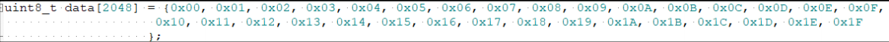
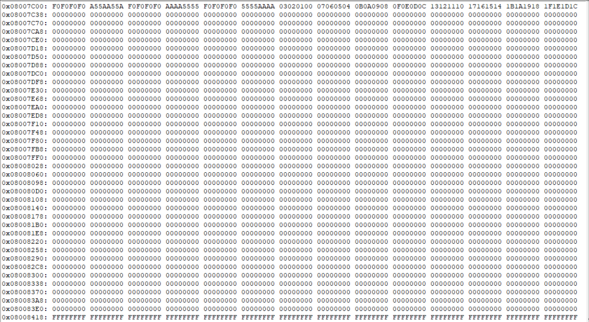

# 置顶链接
1. [立创·GD32VW553开发板环境搭建](https://wiki.lckfb.com/zh-hans/gd32vw553/beginner/environment-setup.html)  
2. [GD32 Embedded Builder界面中文化（保姆级教程）](https://blog.csdn.net/qq_45762107/article/details/147348992)  
3. [MDK543.exe](https://armkeil.blob.core.windows.net/eval/MDK543.exe)

# 笔记

在中断中如果要查看接收的DMA数据，不要在中断中打印。通过枚举变量标志位来在主函数中打印，然后相应数据用变量来接受

# 代码
## LCD 清屏指定区域
在`lcd_driver.h`中添加声明
```c
void lcd_clear_region(uint16_t x_start, uint16_t y_start, uint16_t x_end, uint16_t y_end, uint16_t color);
```
在`lcd_driver.c`中添加实现
```c

/*!
    \brief      用指定颜色清除LCD的特定区域
    \param[in]  x_start: 起始x坐标
    \param[in]  y_start: 起始y坐标
    \param[in]  x_end: 结束x坐标
    \param[in]  y_end: 结束y坐标
    \param[in]  color: LCD显示颜色
    \param[out] 无
    \retval     无
*/
void lcd_clear_region(uint16_t x_start, uint16_t y_start, uint16_t x_end, uint16_t y_end, uint16_t color)
{
    unsigned int i, m;
    unsigned int width = x_end - x_start + 1;
    unsigned int height = y_end - y_start + 1;
    
    /* set lcd display region */
    lcd_set_region(x_start, y_start, x_end, y_end);
    LCD_RS_SET;

    LCD_CS_CLR;
    for(i = 0; i < height; i ++) {
        for(m = 0; m < width; m ++) {
            spi_write_byte(SPI1, color >> 8);
            spi_write_byte(SPI1, color);
        }
    }
    LCD_CS_SET;
}
```
在`main.c`中添加调用
```c
void display_effect_name(uint8_t effect_id)
{
    static uint8_t last_effect_id = 0xFF;  /* 记录上次显示的效果ID */
    static uint8_t last_strip_status = 0xFF;  /* 记录上次的灯带状态 */
    static uint8_t initialized = 0;  /* 记录是否已初始化显示 */
    const char* effect_name;
    uint8_t current_strip_status = g_led_strip_enabled ? 1 : 0;
    
    /* 只有在效果改变或灯带状态改变时才需要更新显示 */
    if (last_effect_id == effect_id && last_strip_status == current_strip_status && initialized) {
        return;  /* 没有变化，直接返回 */
    }
    
    /* 首次显示时，显示所有内容 */
    if (!initialized) {
        /* 清屏为黑色背景 */
        lcd_clear(BLACK);
        
        /* 显示固定内容 */
        gui_draw_font_gbk24(10, 10, WHITE, BLACK, (char *)"Effect:");
        gui_draw_font_gbk24(10, 60, WHITE, BLACK, (char *)"Key Functions:");
        gui_draw_font_gbk24(10, 80, WHITE, BLACK, (char *)"USER_KEY: Switch Effect");
        gui_draw_font_gbk24(10, 100, WHITE, BLACK, (char *)"WAKEUP_KEY: On/Off Strip");
        
        initialized = 1;
    }
    
    /* 更新效果名称（第二行） */
    if (last_effect_id != effect_id) {
        /* 清除效果名称显示区域 */
        lcd_clear_region(10, 30, 230, 50, BLACK);
        
        /* 获取并显示新的效果名称 */
        effect_name = dmx512_test_get_effect_name((dmx512_effect_t)effect_id);
        gui_draw_font_gbk24(10, 30, YELLOW, BLACK, (char *)effect_name);
        
        last_effect_id = effect_id;
    }
    
    /* 更新灯带状态（第六行） */
    if (last_strip_status != current_strip_status) {
        /* 清除状态显示区域 */
        lcd_clear_region(10, 120, 210, 140, BLACK);
        
        /* 显示新的灯带状态 */
        if (g_led_strip_enabled) {
            gui_draw_font_gbk24(10, 120, GREEN, BLACK, (char *)"Strip: ON");
        } else {
            gui_draw_font_gbk24(10, 120, RED, BLACK, (char *)"Strip: OFF");
        }
        
        last_strip_status = current_strip_status;
    }
}
```

## 官方代码 FLASH 模拟 EEPROM
**1. 简介**

FLASH 和 EEPROM 都是非易失性储存器，在掉电后数据还会保留。 FLASH 和 EEPROM 最大的区别是擦除方式不同，EEPROM 可以按字节进行擦除，但 FLASH 最小擦除单位是页，一页通常包含多个字节甚至几 K 字节。FLASH 和 EEPROM 擦写属性决定了 EEPROM 容量小但擦写寿命比较高，而 FLASH 容量非常大，但擦写寿命短。

在 MCU 主频高的情况下， 可以采用 FLASH 模拟 EEPROM 来降低成本。 本文介绍了一种采用 FLASH 模拟 EEPROM 的方法，实现了 EEPROM 按字节进行数据修改， 可防止复位或掉电产生的数据丢失，当采用的 FLASH 存储空间越大， EEPROM 性能越好。


**2. EEPROM 备份区结构**

本文以GD32C2X1的后33页FLASH模拟2K字节EEPROM来介绍FLASH模拟EEPROM的方法。

**2.1. GD32C2x1 FLASH 简介**

GD32C2x1提供高达64KB片上FLASH 。本文使用的GD32C2X1闪存基地址和大小如[**_表2-1._**](#bookmark16) [**_GD32C2x1 64KB闪存基地址和大小_**](#bookmark16)所示。

**表** **2-1. GD32C2x1 64KB 闪存基地址和大小**

|     |     |     |     |
| --- | --- | --- | --- |
| **闪存块** | **名称** | **地址范围** | **大小（字节）** |
| 主存储闪存块 | 第0页 | 0x0800 0000 – 0x0800 03FF | 1KB |
| 主存储闪存块 | 第1页 | 0x0800 0400 – 0x0800 07FF | 1KB |
| 主存储闪存块| 第2页 | 0x0800 0800 – 0x0800 0BFF | 1KB |
| 主存储闪存块| .   |     |     |
| 主存储闪存块| 第63页 | 0x0800 FC00 - 0x0800 FFFF | 1KB |
| 信息块 | 引导装载程序 | 0x1FFF 0000 - 0x1FFF 0BFF | 3KB |
| 选项字节块 | 选项字节 | 0x1FFF 7800 - 0x1FFF 787F | 128B |
| 一次性编程块 | OTP字节 | 0x1FFF 7000~0x1FFF 73FF | 1KB |

**2.2. EEPROM 数据备份结构**

**表** **2-2. EEPROM 页数据备份存储结构**

|     |     |     |
| --- | --- | --- |
| **功能** |     | **大小（字节）** |
| EEPROM页 0 | FLASH 页使用标记 | 8   |
| EEPROM页 0 | EEPROM 页开始标记 | 8   |
| EEPROM页 0 | EEPROM 页结束标记 | 8   |
| EEPROM页 0 | EEPROM 数据 | 2048 |
| EEPROM页 1 | FLASH 页使用标记 | 8   |
| EEPROM页 1 | EEPROM 页开始标记 | 8   |
| EEPROM页 1 | EEPROM 页结束标记 | 8   |
| EEPROM页 1 | EEPROM 数据 | 2048 |
| …   | …   | …   |
| EEPROM页 n | FLASH 页使用标记 | 8   |
| EEPROM页 n | EEPROM 页开始标记 | 8   |
| EEPROM页 n | EEPROM 页结束标记 | 8   |
| EEPROM页 n | EEPROM 数据 | 2048 |


**3\. FLASH 模拟** **EEPROM 方案**

**3.1. 算法实现**

**3.1.1. 参数宏**

**表** **3-1. 参数宏**

|     |     |
| --- | --- |
| **名称** | **功能** |
| EEPROM_DATA_SIZE | 模拟 EEPROM 大小 |
| EEPROM_FLASH_PAGE_NUM | 使用的 FLASH 页数 |
| FLASH_PAGE_SIZE | FLASH 页大小 |
| EEPROM_PAGE_SIZE | EEPROM 页大小 |
| EEPROM_PAGE_DW_NUM | 每页 EEPROM 包含的双字数 |
| EEPROM_BACKUP_SIZE | EEPROM 备份区大小 |
| EEPROM_BACKUP_END_ADDR | EEPROM 备份区结束地址 |
| EEPROM_BACKUP_START_ADDR | EEPROM 备份区起始地址 |
| EEPROM_PAGE_HEAD_FLAG | EEPROM 起始标记 |
| EEPROM_PAGE_END_FLAG | EEPROM 结束标记 |
| EEPROM_WORK_PAGE_FLAG | FLASH 页使用标记 |
| FLASH_PAGES_PER_EEPROM_PAGE | 每页 EEPROM 包含的 FLASH 页数 |

**3.1.2. API 函数**

**函数** **eeprom_init**

函数 eeprom_init 用于初始化 EEPROM 备份区，并获取当前正在用于 EEPROM 备份的 FLASH页相对编号。

**表** **3-2. EEPROM 初始化**
```c
void eeprom_init(void)
{

    uint16_t i = 0;

    uint8_t flag_mark_num = 0;

    uint64_t flag_work_page = 0;

    uint8_t check_ff_flag = 0;

    for (i = 0; i < EEPROM_FLASH_PAGE_NUM; i += FLASH_PAGES_PER_EEPROM_PAGE)
    {

        flag_work_page = REG64(EEPROM_BACKUP_START_ADDR + i * FLASH_PAGE_SIZE);

        check_ff_flag = check_ff(EEPROM_BACKUP_START_ADDR + i * FLASH_PAGE_SIZE, FLASH_PAGE_SIZE * FLASH_PAGES_PER_EEPROM_PAGE);

        /* if the flash is without EEPROM_WORK_PAGE_FLAG but the page is not empty, erase the flash page */

        if (((0xffffffffffffffff == flag_work_page) && (0x01 != check_ff_flag)) || ((0xffffffffffffffff != flag_work_page) && (EEPROM_WORK_PAGE_FLAG != flag_work_page)))
        {
            eeprom_block_erase(EEPROM_BACKUP_START_ADDR + i * FLASH_PAGE_SIZE);
        }
        else if (REG64(EEPROM_BACKUP_START_ADDR + i * FLASH_PAGE_SIZE) == EEPROM_WORK_PAGE_FLAG)
        { /* find the flash page with EEPROM_WORK_PAGE_FLAG marked */
            current_page = i;
            flag_mark_num++;
        }
    } /* no EEPROM_WORK_PAGE_FLAG is found */
    if (flag_mark_num == 0)
    {
        current_page = 0;
    }
    if (flag_mark_num > 1)
    { /* the first block is not the marked page */
        if (REG64(EEPROM_BACKUP_START_ADDR) == 0xffffffffffffffff)
        {
            if (REG64(EEPROM_BACKUP_START_ADDR + current_page * FLASH_PAGE_SIZE + 8 * 2) == EEPROM_PAGE_END_FLAG)
            { /* erase the page whose index is current_page- FLASH_PAGES_PER_EEPROM_PAGE(the forward EEPROM block) */
                eeprom_block_erase(EEPROM_BACKUP_START_ADDR + (current_page - FLASH_PAGES_PER_EEPROM_PAGE) * FLASH_PAGE_SIZE);
            }
            else
            { /* erase the page whose index is current_page, because EEPROM_PAGE_END_FLAG is not found, and the data is incomplete, discard the data */
                eeprom_block_erase(EEPROM_BACKUP_START_ADDR + current_page * FLASH_PAGE_SIZE);
                current_page -= FLASH_PAGES_PER_EEPROM_PAGE;
            } /* the first block is the marked block */
        }
        else
        { /* the marked block is the first block and the last block */
            if (FLASH_PAGES_PER_EEPROM_PAGE != current_page)
            {
                if (REG64(EEPROM_BACKUP_START_ADDR + 8 * 2) == EEPROM_PAGE_END_FLAG)
                {
                    eeprom_block_erase(EEPROM_BACKUP_START_ADDR + current_page * FLASH_PAGE_SIZE);
                    current_page = 0;
                }
                else
                {
                    eeprom_block_erase(EEPROM_BACKUP_START_ADDR);
                } /* the marked block is the first block and the second block */
            }
            else
            {
                if (REG64(EEPROM_BACKUP_START_ADDR + current_page * FLASH_PAGE_SIZE + 8 * 2) == EEPROM_PAGE_END_FLAG)
                {
                    eeprom_block_erase(EEPROM_BACKUP_START_ADDR);
                }
                else
                {
                    eeprom_block_erase(EEPROM_BACKUP_START_ADDR + current_page * FLASH_PAGE_SIZE);
                    current_page = 0;
                }
            }
        }
    }
}
```
**函数** **eeprom_write**

函数 eeprom_write 用于索引当前可写的地址，并将数据写到对应 FLASH 地址。注意该函数的入参 ee_addr 是模拟 EEPROM 地址，范围为 0-2047。

**表** **3-3. EEPROM 写函数**
```c
uint8_t eeprom_write(uint16_t ee_addr, uint8_t *data, uint16_t size)
{

    uint8_t ee_state = 0x01, i = 0;

    uint32_t block_addr = 0, ee_data_addr = 0;

    uint64_t temp_flag = 0;

    uint16_t tmp_size = 0, addr_tmp = 0;

    uint8_t *p_tmp = data;

    if (ee_addr + size > EEPROM_DATA_SIZE)
    {

        ee_state = 0x00;

        size = EEPROM_DATA_SIZE - ee_addr;
    }

    eeprom_read(0, (uint8_t *)record_buf, EEPROM_DATA_SIZE);

    tmp_size = size;

    addr_tmp = ee_addr;

    /* refresh the data in EEPROM */

    while (tmp_size--)
    {

        ((uint8_t *)record_buf)[addr_tmp++] = *p_tmp++;
    }

    /* find the block start address to write data */

    if (0xffffffffffffffff != REG64(EEPROM_BACKUP_START_ADDR + current_page * FLASH_PAGE_SIZE + 8))
    {

        if ((EEPROM_FLASH_PAGE_NUM - FLASH_PAGES_PER_EEPROM_PAGE) == current_page)
        {

            current_page = 0;
        }
        else
        {
            current_page = current_page + FLASH_PAGES_PER_EEPROM_PAGE;
        }
    }
    block_addr = EEPROM_BACKUP_START_ADDR + current_page * FLASH_PAGE_SIZE + 8;
    ee_data_addr = block_addr + 8 * 2;
    temp_flag = EEPROM_WORK_PAGE_FLAG;
    if (0 == flash_program(block_addr - 8, &temp_flag, 1))
    {
        ee_state = 0x00;
    } /* write the EEPROM_PAGE_HEAD_FLAG */
    temp_flag = EEPROM_PAGE_HEAD_FLAG;
    if (0 == flash_program(ee_data_addr - 8 * 2, &temp_flag, 1))
    {
        ee_state = 0x00;
    } /* write the data */
    if (0 == flash_program(ee_data_addr, record_buf, EEPROM_PAGE_DW_NUM))
    {
        ee_state = 0x00;
    } /* read back data */
    flash_read_word(ee_data_addr, (uint8_t *)record_buf, EEPROM_DATA_SIZE);
    tmp_size = size;
    addr_tmp = ee_addr;
    while (tmp_size--)
    { /* check the data */
        if (((uint8_t *)record_buf)[addr_tmp++] != *data++)
        {
            ee_state = 0x00;
        }
    } /* write the EEPROM_PAGE_END_FLAG */
    if (ee_state == 0x01)
    {
        temp_flag = EEPROM_PAGE_END_FLAG;
        if (0 == flash_program(ee_data_addr - 8, &temp_flag, 1))
        {
            ee_state = 0x00;
        }
    }
    if (ee_data_addr == block_addr + 8 * 2)
    {
        if (block_addr == EEPROM_BACKUP_START_ADDR + 8)
        {
            /* the current page is the last flash page */
            eeprom_block_erase(EEPROM_BACKUP_START_ADDR + (EEPROM_FLASH_PAGE_NUM - FLASH_PAGES_PER_EEPROM_PAGE) * FLASH_PAGE_SIZE);
        }
        else
        { /* the current page is not the last flash page */
            eeprom_block_erase(EEPROM_BACKUP_START_ADDR + (current_page - FLASH_PAGES_PER_EEPROM_PAGE) * FLASH_PAGE_SIZE);
        }
    }
    return ee_state;
}

```
**函数** **eeprom_read**

函数 eeprom_read 用于读取 EEPROM 备份区最新的数据。注意该函数的入参 ee_addr 是EEPROM 地址，范围为 0-2047。

**表** **3-4. EEPROM 读函数**
```c
uint8_t eeprom_read(uint16_t ee_addr, uint8_t *data, uint16_t size)
{

    uint8_t ee_state = 1, i = 0;

    uint32_t page_addr, ee_data_addr;

    /* find the page start address to write data */

    page_addr = EEPROM_BACKUP_START_ADDR + current_page * FLASH_PAGE_SIZE + 8;

    /* locate at the address to read data */

    ee_data_addr = page_addr + 8 * 2;

    if (ee_addr + size > EEPROM_DATA_SIZE)
    {

        ee_state = 0x00;

        size = EEPROM_DATA_SIZE - ee_addr;
    }

    /* read data */

    flash_read_word(ee_data_addr + ee_addr, data, size);

    return (ee_state);
}
```
**3.1.3. 测试结果**

测试在 EEPROM 中改写第一个字节共 16 次。写入数据如[**_图3-1. 读写数据_**](#bookmark14)所示。
  
**图** **3-1. 读写数据**

代码如[**_表3-5. 测试_** **_demo_**](#bookmark28)所示。

**表** **3-5. 测试** **demo**
```c
int main(void)
{

    gd_eval_led_init(LED1);

    gd_eval_led_init(LED2);
    eeprom_init();
    eeprom_read(0, data_read, 2048);
    for (int i = 0; i < 16; i++)
    {
        data[0] = i;
        eeprom_write(0, data, 2048);
        eeprom_read(0, data_read, 2048);
        if (SUCCESS != byte_memory_compare(data, data_read, 2048))
        {
            gd_eval_led_on(LED2);
            return ERROR;
        }
    }
    gd_eval_led_on(LED1);
    while (1)
    {
    }
}
```
测试结果如[**_图3-2. EEPROM 备份区数据_**](#bookmark29)所示。

**图** **3-2. EEPROM 备份区数据**
  
### 我的代码
main引入`eeprom_emulation.h`
main函数
```c
    /* 从EEPROM加载用户数据 */
    uint8_t saved_effect, saved_led_state;
    user_data_load(&saved_effect, &saved_led_state);
    g_current_effect = saved_effect;
    g_led_strip_enabled = (saved_led_state != 0);
    printf("\r\n   从EEPROM加载数据: 效果=%d, 灯带状态=%d", g_current_effect, g_led_strip_enabled);
```
在改变状态变量的地方调用
```c
 /* 保存当前效果到EEPROM */
        user_data_save(g_current_effect, g_led_strip_enabled ? 1 : 0);
```
### 实现eeprom_emulation.c,以及实现eeprom_test.c及相应头文件
```c

```

```c

```

```c

```
## DMX512灯带
### main.c
引头文件
```c
#include "dmx512.h"
#include "dmx512_test.h"
#include "gui.h"
```
定义全局变量
```c
/* DMX512效果控制变量 */
volatile uint8_t g_key_pressed = 0;//区分不同按键按下的变量
volatile uint8_t g_effect_changed = 0;//更新显示标志位
uint8_t g_current_effect = 0;//效果编号变量
bool g_led_strip_enabled = true;  /* 灯带开关状态 */
```
声明函数
```c
void display_effect_name(uint8_t effect_id); // 显示效果名称到LCD屏幕
void handle_key_press(void);                // 处理按键按下事件
```
main函数添加  
```c
int main(void)
{
    /* 初始化DMX512 */
    dmx512_init();
    /* 启用DMX512自动刷新，25ms间隔(40Hz) */
    dmx512_enable_auto_refresh(25);
    /* 初始化DMX512测试模块 */
    dmx512_test_init(10, false); /* 10个LED，不自动循环 */
    /* 设置初始效果 */
    dmx512_test_set_effect((dmx512_effect_t)g_current_effect);
    /* 显示初始效果名称 */
    display_effect_name(g_current_effect);
    /* 强制触发一次效果更新 */
    g_effect_changed = 1;
    
    /* 立即执行初始静态效果 */
    if (g_current_effect < DMX512_EFFECT_RAINBOW) {
        dmx512_test_run();
        /* 确保数据发送 */
        if (dmx512_is_transmission_complete()) {
            dmx512_send_frame();
        }
    }
    /* 主循环 */
    while (1)
    {
        /* 检查按键按下 */
        if (g_key_pressed) {
            handle_key_press();
            g_key_pressed = 0;
        }
        
        /* 如果效果改变，更新显示 */
        if (g_effect_changed) {
            display_effect_name(g_current_effect);
            dmx512_test_set_effect((dmx512_effect_t)g_current_effect);
            g_effect_changed = 0;
        }
        
        /* 只在灯带开启时运行效果 */
        if (g_led_strip_enabled) {
            /* 所有效果都持续刷新，简化逻辑 */
            dmx512_test_run();
        }
        
        /* 发送DMX512数据（当未启用自动刷新时） */
        if (!g_dmx512.auto_refresh && dmx512_is_transmission_complete()) {
            dmx512_send_frame();
        }
        
        /* 延时50ms */
        delay_1ms(50);
    }
}
```
函数实现：  
```c
/*!
    \brief      显示效果名称到LCD屏幕
    \param[in]  effect_id: 效果ID
    \param[out] none
    \retval     none
*/
void display_effect_name(uint8_t effect_id)
{
    static uint8_t last_effect_id = 0xFF;  /* 记录上次显示的效果ID */
    static uint8_t last_strip_status = 0xFF;  /* 记录上次的灯带状态 */
    static uint8_t initialized = 0;  /* 记录是否已初始化显示 */
    const char* effect_name;
    uint8_t current_strip_status = g_led_strip_enabled ? 1 : 0;
    
    /* 只有在效果改变或灯带状态改变时才需要更新显示 */
    if (last_effect_id == effect_id && last_strip_status == current_strip_status && initialized) {
        return;  /* 没有变化，直接返回 */
    }
    
    /* 首次显示时，显示所有内容 */
    if (!initialized) {
        /* 清屏为黑色背景 */
        lcd_clear(BLACK);
        
        /* 显示固定内容 */
        gui_draw_font_gbk24(10, 10, WHITE, BLACK, (char *)"Effect:");
        gui_draw_font_gbk24(10, 60, WHITE, BLACK, (char *)"Key Functions:");
        gui_draw_font_gbk24(10, 80, WHITE, BLACK, (char *)"USER_KEY: Switch Effect");
        gui_draw_font_gbk24(10, 100, WHITE, BLACK, (char *)"WAKEUP_KEY: On/Off Strip");
        
        initialized = 1;
    }
    
    /* 更新效果名称（第二行） */
    if (last_effect_id != effect_id) {
        /* 清除效果名称显示区域 */
        lcd_clear_region(10, 30, 230, 50, BLACK);
        
        /* 获取并显示新的效果名称 */
        effect_name = dmx512_test_get_effect_name((dmx512_effect_t)effect_id);
        gui_draw_font_gbk24(10, 30, YELLOW, BLACK, (char *)effect_name);
        
        last_effect_id = effect_id;
    }
    
    /* 更新灯带状态（第六行） */
    if (last_strip_status != current_strip_status) {
        /* 清除状态显示区域 */
        lcd_clear_region(10, 120, 210, 140, BLACK);
        
        /* 显示新的灯带状态 */
        if (g_led_strip_enabled) {
            gui_draw_font_gbk24(10, 120, GREEN, BLACK, (char *)"Strip: ON");
        } else {
            gui_draw_font_gbk24(10, 120, RED, BLACK, (char *)"Strip: OFF");
        }
        
        last_strip_status = current_strip_status;
    }
}

/*!
    \brief      处理按键按下事件
    \param[in]  none
    \param[out] none
    \retval     none
*/
void handle_key_press(void)
{
    if (g_key_pressed == 1) {
        /* USER_KEY: 切换效果 */
        g_current_effect++;
        if (g_current_effect >= DMX512_EFFECT_COUNT) {
            g_current_effect = 0;
        }
        g_effect_changed = 1;
        
        if (g_led_strip_enabled) {
            printf("\r\nUSER_KEY: 切换到效果 %d - %s", g_current_effect, 
                   dmx512_test_get_effect_name((dmx512_effect_t)g_current_effect));
        } else {
            printf("\r\nUSER_KEY: 效果已切换到 %d - %s (灯带关闭中)", g_current_effect, 
                   dmx512_test_get_effect_name((dmx512_effect_t)g_current_effect));
        }  
        /* 闪烁LED1一次表示USER_KEY被按下 */
        flash_led(1);
    } else if (g_key_pressed == 2) {
        /* WAKEUP_KEY: 开关灯带 */
        g_led_strip_enabled = !g_led_strip_enabled;
        
        if (g_led_strip_enabled) {
            printf("\r\nWAKEUP_KEY: 灯带已开启");
            g_effect_changed = 1;  /* 重新显示当前效果 */
        } else {
            printf("\r\nWAKEUP_KEY: 灯带已关闭");
            /* 关闭所有LED */
            dmx512_set_all_color(DMX512_COLOR_BLACK, 10);
            /* 立即发送数据确保LED熄灭 */
            if (dmx512_is_transmission_complete()) {
                dmx512_send_frame();
            }
            /* 立即更新LCD显示状态 */
            display_effect_name(g_current_effect);
        }
        /* 闪烁LED1两次表示WAKEUP_KEY被按下 */
        flash_led(2);
    }
}
```
### gd32c2x1_it.c
引入头文件`#include "dmx512.h"`
并extern一下：
```c
extern volatile uint8_t g_key_pressed;
```

在中断函数中添加处理：
```c
void EXTI4_IRQHandler(void)
{
    if(RESET != exti_interrupt_flag_get(EXTI_4)) {
        /* KEY_USER按键按下，切换效果 */
        g_key_pressed = 1;  /* USER_KEY: 切换效果 */
        exti_interrupt_flag_clear(EXTI_4);
    }
}

void EXTI0_IRQHandler(void)
{
    if(RESET != exti_interrupt_flag_get(EXTI_0)) {
        /* KEY_WAKEUP按键按下，开关灯带 */
        g_key_pressed = 2;  /* WAKEUP_KEY: 开关灯带 */
        exti_interrupt_flag_clear(EXTI_0);
    }
}
```
添加对串口以及DMA的中断处理
```c
void DMA_Channel1_IRQHandler(void)
{
    dmx512_dma_irq_handler();
}

void USART1_IRQHandler(void)
{
    dmx512_uart_irq_handler();
}

void TIMER2_IRQHandler(void)
{
    dmx512_timer_irq_handler();
}
```
### 实现dmx512.c,以及实现dmx512_test.c及相应头文件

## WS2812灯带
### main.c
引头文件  
```c
#include "ws2812.h"
#include "ws2812_test.h"
```
main函数添加  
```c
int main(void)
{
    /* 初始化WS2812驱动，使用30个LED灯珠 */
    ws2812_init(30);
    /* 启用WS2812自动刷新，25ms间隔(40Hz) */
    ws2812_enable_auto_refresh(25);
    /* 初始化WS2812测试模块 */
    ws2812_test_init(30, false); /* 30个LED，不自动循环 */
    /* 设置初始效果 */
    ws2812_test_set_effect((ws2812_effect_t)g_current_effect);
    /* 立即执行初始静态效果 */
    if (g_current_effect < DMX512_EFFECT_RAINBOW) {
        dmx512_test_run();
        ws2812_test_run();
        /* 确保数据发送 */
        if (dmx512_is_transmission_complete()) {
            dmx512_send_frame();
        }
        if (ws2812_is_transmission_complete()) {
            ws2812_send_data();
        }
    }

    /* 主循环 */
    while(1) {
        /* 检查按键按下 */
        if (g_key_pressed) {
            handle_key_press();
            g_key_pressed = 0;
        }
        
        /* 如果效果改变，更新显示 */
        if (g_effect_changed) {
            display_effect_name(g_current_effect);
            dmx512_test_set_effect((dmx512_effect_t)g_current_effect);
            ws2812_test_set_effect((ws2812_effect_t)g_current_effect);
            printf("\r\n切换到效果: %s", dmx512_test_get_effect_name((dmx512_effect_t)g_current_effect));
            g_effect_changed = 0;
        }
        
        /* 只在灯带开启时运行效果 */
        if (g_led_strip_enabled) {
            /* 所有效果都持续刷新，简化逻辑 */
            dmx512_test_run();
            ws2812_test_run();
        }
        
        /* 处理WS2812自动刷新 */
        ws2812_auto_refresh_handler();
        
        /* 发送DMX512数据（当未启用自动刷新时） */
        if (!g_dmx512.auto_refresh && dmx512_is_transmission_complete()) {
            dmx512_send_frame();
        }
        
        /* 发送WS2812数据（当未启用自动刷新时） */
        if (!g_ws2812.auto_refresh && ws2812_is_transmission_complete()) {
            ws2812_send_data();
        }
        
        /* 延时50ms */
        delay_1ms(50);
    }
}

```
在`handle_key_press`函数中添加对WS2812的处理  

```c
            /* 关闭所有LED */
            dmx512_set_all_color(DMX512_COLOR_BLACK, 10);
            ws2812_set_all_color(WS2812_COLOR_BLACK);
            /* 立即发送数据确保LED熄灭 */
            if (dmx512_is_transmission_complete()) {
                dmx512_send_frame();
            }
            if (ws2812_is_transmission_complete()) {
                ws2812_send_data();
            }
```
### gd32c2x1_it.c  
引入头文件`#include "ws2812.h"`  
添加对DMA的中断处理  
```c
/*!
    \brief      this function handles DMA_Channel2_IRQHandler interrupt (WS2812)
    \param[in]  none
    \param[out] none
    \retval     none
*/
void DMA_Channel2_IRQHandler(void)
{
    ws2812_dma_irq_handler();
}
```
### 实现ws2812.c,以及实现ws2812_test.c及相应头文件  

## 接收DMX512数据
### main.c
引头文件  
```c
#include "dmx512_receiver.h"
#include "dmx512_led_controller.h"
#include <stdio.h>
```

```c
bool g_dmx_reception_mode = false; /* DMX512接收模式标志 */

void dmx512_frame_received_callback(uint16_t led_count, rgb_color_t *colors); // DMX512帧接收回调
void dmx512_error_callback(const char *error_msg); // DMX512错误回调
void display_dmx_status(void);              // 显示DMX512接收状态

```
在main函数中添加
```c
 while(1) {
        /* 如果效果改变，更新显示 */
        if (g_effect_changed) {
            if (g_dmx_reception_mode) {
                display_dmx_status();
            } else {
                display_effect_name(g_current_effect);
                dmx512_test_set_effect((dmx512_effect_t)g_current_effect);
                ws2812_test_set_effect((ws2812_effect_t)g_current_effect);
            }
            g_effect_changed = 0;
        }
        
        /* DMX512接收模式处理 */
        if (g_dmx_reception_mode && g_led_strip_enabled) {
            /* 处理接收到的DMX512帧 */
            dmx512_led_controller_process_frame();
            
            /* 每5秒输出一次接收状态 */
            static uint32_t last_status_time = 0;
            static uint32_t status_counter = 0;
            status_counter++;
            if (status_counter >= 100) {  /* 50ms * 100 = 5秒 */
                dmx512_rx_stats_t rx_stats;
                dmx512_rx_get_stats(&rx_stats);
                printf("\r\nDMX512状态: 接收帧=%u, 有效帧=%u, 错误帧=%u", 
                       rx_stats.frames_received, rx_stats.frames_valid, rx_stats.frames_error);
                if (rx_stats.frames_received == 0) {
                    printf(" [无信号 - 检查PA3连接和DMX192控台输出]");
                }
                status_counter = 0;
            }
        }
        /* 本地效果模式 - 只在灯带开启且非DMX接收模式时运行效果 */
        else if (g_led_strip_enabled && !g_dmx_reception_mode) {
            /* 所有效果都持续刷新，简化逻辑 */
            dmx512_test_run();
            ws2812_test_run();
        }
 }
```
`handle_key_press`函数修改
```c
    if (g_key_pressed == 1) {
        /* USER_KEY: 切换效果或DMX接收模式 */
        if (!g_dmx_reception_mode) {
            /* 本地效果模式：切换效果 */
            g_current_effect++;
            if (g_current_effect >= DMX512_EFFECT_COUNT) {
                /* 切换到DMX接收模式 */
                g_dmx_reception_mode = true;
                dmx512_led_controller_start();
                printf("\r\nUSER_KEY: 切换到DMX512接收模式");
            } else {
                printf("\r\nUSER_KEY: 切换到效果 %d - %s (两种灯带同步)", g_current_effect, 
                       dmx512_test_get_effect_name((dmx512_effect_t)g_current_effect));
            }
        } else {
            /* DMX接收模式：切换回本地效果模式 */
            g_dmx_reception_mode = false;
            g_current_effect = 0;
            dmx512_led_controller_stop();
            printf("\r\nUSER_KEY: 切换回本地效果模式");
        }
        
        g_effect_changed = 1;
        
        /* 只有在本地效果模式下才保存到EEPROM，DMX模式不保存 */
        if (!g_dmx_reception_mode) {
            user_data_save(g_current_effect, g_led_strip_enabled ? 1 : 0);
            printf("\r\n   数据已保存到EEPROM");
        } else {
            printf("\r\n   DMX模式不保存到EEPROM");
        }
        
        /* 闪烁LED1一次表示USER_KEY被按下 */
        flash_led(1);
```
函数实现：  
```c

/*!
    \brief      DMX512帧接收回调函数
    \param[in]  led_count: LED数量
    \param[in]  colors: LED颜色数组
    \param[out] none
    \retval     none
*/
void dmx512_frame_received_callback(uint16_t led_count, rgb_color_t *colors)
{
    static uint32_t frame_count = 0;
    frame_count++;
    
    /* 每100帧打印一次统计信息 */
    if (frame_count % 100 == 0) {
        dmx512_led_stats_t stats;
        dmx512_led_controller_get_stats(&stats);
        printf("\r\nDMX512接收: 帧数=%u, 更新=%u, 频率=%dHz, LED数=%d", 
               stats.frames_processed, stats.frames_updated, stats.update_rate, led_count);
    }
}

/*!
    \brief      DMX512错误回调函数
    \param[in]  error_msg: 错误消息
    \param[out] none
    \retval     none
*/
void dmx512_error_callback(const char *error_msg)
{
    printf("\r\nDMX512错误: %s", error_msg);
    
    /* 错误时闪烁LED1三次 */
    flash_led(3);
}

/*!
    \brief      显示DMX512接收状态
    \param[in]  none
    \param[out] none
    \retval     none
*/
void display_dmx_status(void)
{
    static uint8_t initialized = 0;
    
    /* 首次显示时，显示所有内容 */
    if (!initialized) {
        /* 清屏为黑色背景 */
        lcd_clear(BLACK);
        
        /* 显示固定内容 */
        gui_draw_font_gbk24(10, 10, WHITE, BLACK, (char *)"DMX512 Reception Mode");
        gui_draw_font_gbk24(10, 40, WHITE, BLACK, (char *)"Waiting for DMX data...");
        gui_draw_font_gbk24(10, 80, WHITE, BLACK, (char *)"Key Functions:");
        gui_draw_font_gbk24(10, 100, WHITE, BLACK, (char *)"USER_KEY: Back to Effects");
        gui_draw_font_gbk24(10, 120, WHITE, BLACK, (char *)"WAKEUP_KEY: On/Off Strip");
        
        initialized = 1;
    }
    
    /* 更新接收状态 */
    dmx512_rx_stats_t rx_stats;
    dmx512_rx_get_stats(&rx_stats);
    
    dmx512_led_stats_t led_stats;
    dmx512_led_controller_get_stats(&led_stats);
    
    /* 清除状态显示区域 */
    lcd_clear_region(10, 60, 230, 75, BLACK);
    
    char status_str[50];
    if (rx_stats.frames_received > 0) {
        snprintf(status_str, sizeof(status_str), "Frames: %u, Rate: %dHz", 
                rx_stats.frames_received, led_stats.update_rate);
        gui_draw_font_gbk24(10, 60, GREEN, BLACK, status_str);
    } else {
        gui_draw_font_gbk24(10, 60, YELLOW, BLACK, (char *)"No DMX signal detected");
    }
    
    /* 显示灯带状态 */
    lcd_clear_region(10, 140, 210, 160, BLACK);
    if (g_led_strip_enabled) {
        gui_draw_font_gbk24(10, 140, GREEN, BLACK, (char *)"Strip: ON");
    } else {
        gui_draw_font_gbk24(10, 140, RED, BLACK, (char *)"Strip: OFF");
    }
}
```
### gd32c2x1_it.c  
引头文件`#include "dmx512_receiver.h"`
```c

/*!
    \brief      this function handles DMA_Channel0_IRQHandler interrupt (DMX512 RX)
    \param[in]  none
    \param[out] none
    \retval     none
*/
void DMA_Channel0_IRQHandler(void)
{
    dmx512_rx_dma_irq_handler();
}
void USART1_IRQHandler(void)
{
    /* Handle both TX and RX interrupts for USART1 */
    dmx512_uart_irq_handler();      /* DMX512 transmitter */
    dmx512_rx_uart_irq_handler();   /* DMX512 receiver */
}

```

### 实现dmx512_receiver.c及相应头文件