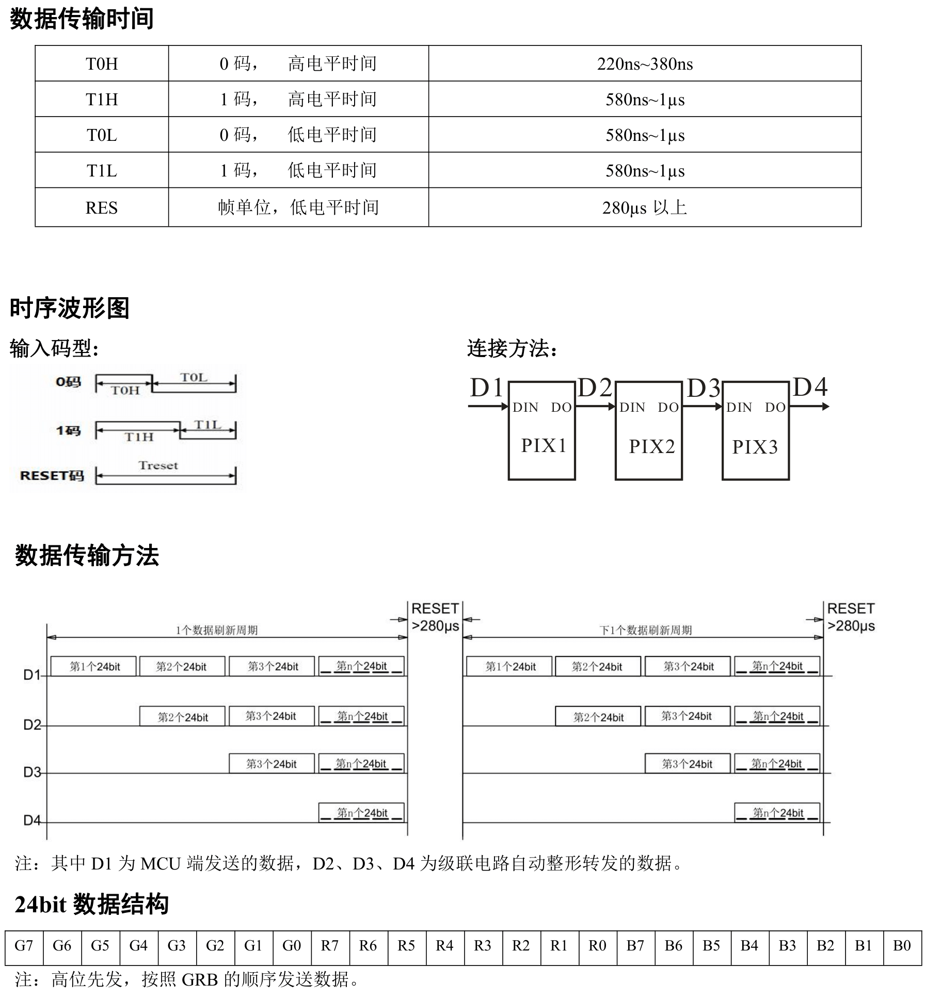
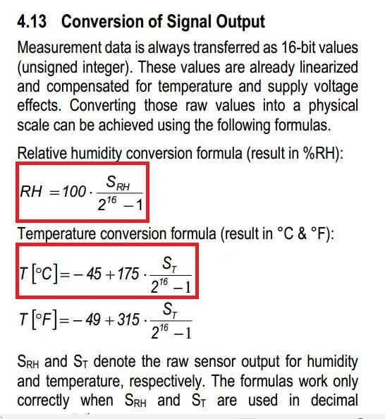
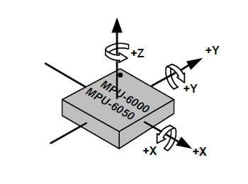

[Arduino官方API网址](https://docs.arduino.cc/language-reference/)  
[合宙Arduino AirMCU网址](https://arduino.luatos.com/)
# 置顶知识
    Serial.setDebugOutput(true) 设置串口为调试输出模式。

# 开发板管理器地址
合宙Air001：https://arduino.luatos.com/package_air_cn_index.json  
博通BK7238：https://dl2.bekencorp.com/arduino/package_bk7238_index.json

# 合宙的RP2040 树莓派 Pico
将开发板的 USB 连接移除，按住开发板上的按键，再重新插入 USB 接口。

# API
## GPIO

###  attachInterrupt 用于将中断附加到定义的引脚。

    void attachInterrupt(uint32_t pin, callback_function_t callback, uint32_t mode)

pin：要配置的引脚号。
callback：中断回调函数。
mode：中断触发模式。可以是以下值之一：

CHANGE：引脚状态发生变化时触发中断。  
RISING：引脚状态从低电平变为高电平时触发中断。  
FALLING：引脚状态从高电平变为低电平时触发中断。  
LOW：引脚状态为低电平时触发中断。  
HIGH：引脚状态为高电平时触发中断。  


### detachInterrupt 函数来分离 GPIO。从特定引脚分离中断。

    void detachInterrupt(uint32_t channel)
channel：要分离的引脚号。

### digitalPinToInterrupt(interruptPin) 是 Arduino 提供的一个函数，用于将数字引脚编号转换为中断编号，以便与 attachInterrupt() 配合使用。

作用:  
这个函数的主要目的是将数字引脚编号映射到相应的中断编号，从而在 attachInterrupt() 中指定正确的中断源。不同的 Arduino 板子上，每个引脚对应的中断编号可能不同，所以使用 digitalPinToInterrupt() 能确保代码在不同板子上兼容。

用法示例  
在代码中，使用 attachInterrupt() 时通常会指定以下三个参数：  

    attachInterrupt(digitalPinToInterrupt(interruptPin), blink, CHANGE);
## UART
### write
此函数用于向串口发送数据。
    size_t write(uint8_t data)
返回值：发送的字节数
data：要发送的字节
当然，您也可以使用

    size_t write(const uint8_t *buffer, size_t size)
来发送多个字节。

buffer：要发送的字节缓冲区
size：要发送的字节数
返回值：发送的字节数

### flush
此函数用于清空串口接收缓冲区。
### peek
此函数用于查看串口接收缓冲区中的下一个字节，但不会将其从缓冲区中删除。

    int peek()
返回值：下一个字节，如果没有可读取的字节，则返回-1
### 合宙Air001

    //                      RX    TX
    HardwareSerial Serial2(PA1, PA0);

## ADC
### analogRead 此函数用于获取给定引脚/ADC 通道的 ADC 原始值。
    uint32_t analogRead(uint32_t pin);
pin GPIO 引脚或 ADC 通道。  
ADC的内部通道可以为ATEMP (内部温度传感器)、AVBAT (VBAT电压)、AREF (内部参考电压)。
### analogReadResolution(12)：设置模拟输入的分辨率为 12 位。

### analogReadMillivolts 函数
是根据已知的参考电压和模拟输入的数字值计算出对应的电压值。毫伏（mV）为单位通过串口输出。
### analogReadTempSensor()：读取芯片温度

### analogReadVref 函数用于读取芯片的参考电压值。毫伏（mV）为单位.

### analogReference 配置模拟输入所用的基准电压（即用作输入范围上限的值）。

    void analogReference(eAnalogReference ulMode) ;

## PWM
### analogWrite此函数用于设置 PWM 输出的占空比
    void analogWrite(uint32_t ulPin, uint32_t ulValue)
ulPin：要设置的 PWM 输出引脚
ulValue：占空比

## I2C
### I2C 主模式
    #include <Wire.h>
    Wire.begin();
    Wire.begin(uint32_t sda, uint32_t scl);

调用 begin 后，我们可以通过调用 beginTransmission 并传递 I2C 从机地址来开始传输：

    Wire.beginTransmission(address);
要将一些字节写入从设备，请使用 write 函数。

    Wire.write(data);
您可以使用 write 函数传递不同的数据类型。
要结束传输，请使用 endTransmission 函数。
>write 函数不会直接写入从设备，而是添加到I2C缓冲区。为此，您需要使用 endTransmission 函数将缓冲的字节发送到从设备。

    Wire.endTransmission();
    uint8_t endTransmission(bool stopBit = true);
stopBit：如果为 true ，则发送停止位。
请求从从设备读取数据。 requestFrom 将要求通过提供地址和大小来读取所选设备的数据。

    Wire.requestFrom(I2C_DEV_ADDR, SIZE);
readBytes 将读取它。

    Wire.readBytes(temp, error);

### requestFrom要从从设备读取，请使用 requestFrom 函数。

    uint8_t requestFrom(uint8_t address, uint8_t quantity, uint32_t iaddress, uint8_t isize, uint8_t sendStop)

address：从设备地址。
quantity：要读取的字节数。
iaddress：内部地址。
isize：内部地址大小。
sendStop：如果为 true ，则发送停止位。
或者，您可以使用

    uint8_t requestFrom(uint8_t address, uint8_t quantity, uint8_t sendStop)

此函数将调用 requestFrom ，并将 iaddress 和 isize 设置为 0 。
或者，您可以使用

    uint8_t requestFrom(uint8_t address, uint8_t quantity)

此函数将调用 requestFrom ，并将 iaddress 和 isize 设置为 0 ，并将 sendStop 设置为 true 。
### I2C 从模式
调用 begin 之前，我们必须创建两个回调函数来处理与主设备的通信。

    Wire.onReceive(requestEvent);//onReceive 函数用于定义从主机接收到的数据的回调。
    Wire.onRequest(receiveEvent);//onRequest 函数用于定义要发送到主机的数据的回调。

onReceive 将根据从属设备读取请求处理来自主设备的请求， onRequest 将处理对主设备的应答。
现在，我们可以通过使用设备地址调用 begin 函数来开始外设配置。

    Wire.begin(I2C_ADDR);
通过使用不带任何参数的 begin ，所有设置都将使用默认值完成。如需自行设置值，请参阅函数说明
### 多个I2C
默认情况下，只有一个 Wire 实例可用，它使用了默认的I2C引脚，具体可以参考开发板的手册。要使用第二个 I2C 端口，应在代码中在 setup() 函数之前声明 TwoWire 对象：  

    TwoWire Wire2(SDA_PIN, SCL_PIN);

## SPI

    #include <SPI.h>
    //            MOSI  MISO  SCLK
    SPIClass SPI_3(PC12, PC11, PC10);
    void setup() {
    SPI_3.begin(2); //Enables the SPI_3 instance with default settings and attaches the CS pin  
    SPI_3.beginTransaction(1, settings); //Attaches another CS pin and configure the SPI_3 instance with other settings  
    SPI_3.transfer(2, 0x52); //Transfers data to the first device
    SPI_3.transfer(1, 0xA4); //Transfers data to the second device. The SPI_3 instance is configured with the right settings  
    SPI_3.end() //SPI_3 instance is disabled
    }

## void beginTransaction(uint8_t pin, SPISettings settings)
允许使用其他参数配置SPI。这些新参数保存在关联的 CS 引脚上。  
pin：CS 引脚号，由 SPI 库管理。  
settings：SPI 设置，包括速率、位顺序和数据模式。  
## EEPROM
对于没有内置的 EEPROM，但是可以使用 Flash 模拟 EEPROM。一般来说，我们采用内置 flash 的最后一个 page 扇区（或者是其它可擦写的最小单位）来模拟。

    #include <EEPROM.h>
### write()将一个字节写入 EEPROM。
    EEPROM.write(address, value)
address：要写入的地址，从 0 开始。
value：要写入的值。

### update()将一个字节写入 EEPROM，但仅在值不同的情况下才写入。
    EEPROM.update(address, value)

### put()将一个值写入 EEPROM。

    EEPROM.put(address, value)
address：要写入的地址，从 0 开始。
value要写入的数据，可以是原始类型（例如 float）或自定义结构。
返回值：对传入数据的引用
>注意：此函数使用 EEPROM.update() 执行写入，因此如果值没有更改，则不会重写该值。

### read()从 EEPROM 读取一个字节。
    EEPROM.read(address)
address：要读取的地址，从 0 开始。
返回值：读取的字节。

### get()从 EEPROM 读取一个值。
    EEPROM.get(address, value)
address：要读取的地址，从 0 开始。
value要读取的数据，可以是原始类型（例如 float）或自定义结构。
返回值：对传入数据的引用

### EEPROM[]读取
是一个重载了EEPROM类的operator[]运算符，可以像数组一样使用。
该运算符允许像数组一样使用标识符。使用这种方法可以直接读写 EEPROM 单元。

    EEPROM[address]

address：要读取的地址，从 0 开始。
返回值：EEPROM 自身的引用

### length()
该函数返回一个无符号整数，其中包含 EEPROM 中的单元数。

    EEPROM.length()
返回值：EEPROM 中的单元数。类型为unsigned int。


## 异或运算： stateLED = stateLED^1;
相同时，异或结果为 0。
不同时，异或结果为 1。
和stateLED = !stateLED类似

# 应用示例
## OLED屏 SSD1306
>DC连接可以决定I²C从机地址：
DC连接VCC则I²C从机地址为0x3d
DC连接GND则I²C从机地址为0x3c

安装Adafruit GFX Library库与Adafruit SSD1306库。
```
#include <SPI.h>
#include <Wire.h>
#include <Adafruit_GFX.h>
#include <Adafruit_SSD1306.h>
#define SCREEN_WIDTH 128
#define SCREEN_HEIGHT 64
#define OLED_RESET     4
Adafruit_SSD1306 display(SCREEN_WIDTH, SCREEN_HEIGHT, &Wire, OLED_RESET);
void setup() {
  Serial.begin(9600);
  if(!display.begin(SSD1306_SWITCHCAPVCC, 0x3C)) {
    Serial.println("SSD1306 allocation failed");
    while(1);
  }
  display.clearDisplay();
  ShowText();
}
void ShowText(void) {
  //清空屏幕信息
  display.clearDisplay();
  //设置文本字体大小为2
  display.setTextSize(2);
  //设置屏幕颜色为白色
  display.setTextColor(SSD1306_WHITE);
  //设置打印的起始坐标10,16
  display.setCursor(10, 16);
  //设置显示的文本信息
  display.println(F("happy day"));
  //将屏幕缓冲区数据刷到屏幕上，显示出来
  display.display();
}
void loop() {}

```
## LCD彩屏 ST7735

安装Adafruit ST7735 and ST7789 Library库

```
#include <Adafruit_GFX.h>
#include <Adafruit_ST7735.h>
#include <SPI.h>

#define TFT_CS PA_4
#define TFT_RST PA_6
#define TFT_DC PB_1
#define TFT_MOSI PA_7
#define TFT_SCLK PA_5
#define SerialDebugging true

Adafruit_ST7735 tft = Adafruit_ST7735(TFT_CS, TFT_DC, TFT_MOSI, TFT_SCLK, TFT_RST);

const uint8_t Button_pin = PB_6;
const uint16_t Display_Color_Black = 0x0000; //黑
const uint16_t Display_Color_Blue = 0x001F;  //蓝
const uint16_t Display_Color_Red = 0xF800;      //红
const uint16_t Display_Color_Cyan = 0x07FF;     //青
const uint16_t Display_Color_Green = 0x07E0;    //绿
const uint16_t Display_Color_White = 0xFFFF;    //白
const uint16_t Display_Color_Yellow = 0xFFE0;   //黄
const uint16_t Display_Color_Magenta = 0xF81F;  //粉
//这里的颜色格式为RGB565，每个像素用16比特位表示，占2个字节，RGB分量分别使用5位、6位、5位。

uint16_t Display_Text_Color = Display_Color_Black;
uint16_t Display_Backround_Color = Display_Color_Blue;

const size_t MaxString = 32;
char oldTimeString[MaxString]           = { 0 };

void setup() {
    //SerialDebugging在开头被定义为TRUE，这片宏定义区域生效
    #if (SerialDebugging)
    //初始化串口，用于输出日志
    Serial.begin(115200);
    while (!Serial);
    Serial.println();
    #endif
    delay(250);
    //初始化屏幕
    tft.initR(INITR_BLACKTAB);
    //初始化字体
    tft.setFont();
    //用蓝色填充屏幕
    tft.fillScreen(Display_Backround_Color);
    //设定文字颜色
    tft.setTextColor(Display_Text_Color);
    //设定文字大小
    tft.setTextSize(2);
}
void loop() {
    //显示当前的时间
    displayUpTime();
    delay(100);
}

void displayUpTime() {
    unsigned long upSeconds = millis() / 1000;
    unsigned long days = upSeconds / 86400;
    upSeconds = upSeconds % 86400;
    unsigned long hours = upSeconds / 3600;
    upSeconds = upSeconds % 3600;
    unsigned long minutes = upSeconds / 60;
    upSeconds = upSeconds % 60;
    char newTimeString[MaxString] = { 0 };
    sprintf(
        newTimeString,
        "%lu %02lu:%02lu:%02lu",
        days, hours, minutes, upSeconds
    );
    if (strcmp(newTimeString,oldTimeString) != 0) {
        tft.setCursor(0,0);
        tft.setTextColor(Display_Backround_Color);
        tft.print(oldTimeString);
        tft.setCursor(0,0);
        tft.setTextColor(Display_Text_Color);
        tft.print(newTimeString);
        strcpy(oldTimeString,newTimeString);
    }
}

```

## 数码管 TM1637
安装Grove_4Digital_Display库

```
#include "TM1637.h"
#define CLK PA_14
#define DIO PA_13
int i;
TM1637 tm1637(CLK, DIO);

void setup()
{
    tm1637.init();
    tm1637.point(1);
    tm1637.set(2);
}

void loop() 
{
    tm1637.display(0, 1);
    tm1637.display(1, 2);
    tm1637.display(2, 3);
    tm1637.display(3, 4);
}

```
我们用init方法初始化tm1637。
用point方法控制四位数码管中间的冒号显示，并设置为1为打开（若设置为0则关闭）。
用set方法来调节数码管亮度，有0~7七个亮度等级，数字越大越亮。
用display方法，来更改某一位显示的值。
## 温度传感器 DS18B20

每个DS18B20具有唯一的64位序列号，从而允许多个DS18B20挂接在同一条1-Wire总线。

安装DallasTemperature库
为了保证单总线的时序保持正常，我们需要将芯片主频设置为最高的 48M。

```
// 引用必要的库
#include <OneWire.h>
#include <DallasTemperature.h>

// 初始化一个单总线对象，设置使用PA_5引脚进行通信
OneWire oneWire(PA_5);
// 初始化一个传感器对象，使用刚新建的单总线对象
DallasTemperature sensors(&oneWire);

void setup() {
  //初始化串口
  Serial.begin(9600);
  //初始化传感器库
  sensors.begin();
}

void loop() {
  Serial.print("开始获取温度信息...");
  sensors.requestTemperatures();  //发出获取温度的请求
  Serial.println("获取完成");
  // 我们只取第一个传感器的温度信息
  float tempC = sensors.getTempCByIndex(0);

  //检查一下是不是真的获取成功了
  if (tempC != DEVICE_DISCONNECTED_C) {
    Serial.print("获取到的温度为：");
    Serial.print(tempC);
    Serial.println("℃");
  } else {
    Serial.println("数据读取失败！");
    delay(500);
  }
  Serial.println();
}


```
使用sensors.requestTemperatures方法，尝试获取温度。
使用sensors.getTempCByIndex方法，获取到第一个设备的温度值。
如果成功获取，将温度值打印出来

## 气压传感器 BMP180
>BMP180 使用I²C通信接口，是专为测量大气压力而设计的基本传感器， BMP180可以测量300至1100 hPa（海拔9000m至-500m）的大气压，以及-40°C至85°C的温度。

安装Adafruit BMP085 Library库  
```
#include <Adafruit_BMP085.h>
Adafruit_BMP085 bmp;

void setup() {
  Serial.begin(9600);//初始化串口，波特率9600
  if (!bmp.begin()) {//初始化设备
    Serial.println("initial failed");
    while (1);
  }
}

void loop() {
  Serial.print("温度");
  Serial.print(bmp.readTemperature());
  Serial.println("℃");

  Serial.print("气压");
  Serial.print(bmp.readPressure());
  Serial.println("Pa");

  // 粗略计算海拔高度
  Serial.print("海拔");
  Serial.print(bmp.readAltitude());
  Serial.println("米");

  Serial.println();
  delay(500);
}

```

使用bmp.readTemperature方法，获取当前温度。
使用bmp.readPressure方法，获取当前气压。
使用bmp.readAltitude()方法，粗略计算当前的海拔高度.
## 彩色灯珠 WS2812
由于 WS2812 的时序要求相对严格，我们将使用 SPI 的 MOSI 引脚（PA_7）对其进行驱动。

首先，为了保证 SPI 频率在 8MHz，我们需要将芯片的主频设置为 16M，这样只要设置 SPI 二分频即可实现输出为 8MHz。
```
#include<SPI.h>
//LED灯的个数
#define LED_N   64
//用于存储当前LED灯的状态，默认全为(0,0,0)不亮
unsigned char LED_T[LED_N][3] = {0};

void setup (void) {
  //初始化SPI
  SPI.begin();
  SPI.setBitOrder(MSBFIRST);
  SPI.setDataMode(SPI_MODE1);
  // 这里需要让SPI处于8MHz
  // 所以芯片要设置16M，SPI配置为2分频：
  // 16/2=8MHz
  SPI.setClockDivider(SPI_CLOCK_DIV2);
  delay(10);
  //刷新一下所有灯的状态，函数见文档接下来的内容
  WS2812_refresh();
}
int count = 0;
void loop(void) {
  count++;
  //把上一次亮的灯灭了
  LED_T[(count-1)%LED_N][0] = 0;
  LED_T[(count-1)%LED_N][1] = 0;
  LED_T[(count-1)%LED_N][2] = 0;
  //点亮这次的这个灯
  //来个浅蓝色吧
  //亮度低一点，不然刺眼
  LED_T[count%LED_N][0] = 5; //R
  LED_T[count%LED_N][1] = 5; //G
  LED_T[count%LED_N][2] = 20;//B
  //刷新所有灯的状态
  WS2812_refresh();
  //延时一小会
  delay(10);
}

void WS2812_send(unsigned char r, unsigned char g, unsigned char b) {
  unsigned char bits = 24;
  unsigned long value = 0x00000000;
  value = (((unsigned long)g << 16) | ((unsigned long)r << 8) | ((unsigned long)b));
  while (bits > 0) {
    if ((value & 0x800000) != LOW) {
      SPI.transfer(0xF8);//1
      asm("nop");
      asm("nop");
    } else {
      SPI.transfer(0xC0);//0
    }
    value <<= 1;
    bits--;
  }
}

void WS2812_refresh() {
  unsigned int n = 0;
  for (n = 0; n < LED_N; n++) {
    WS2812_send(LED_T[n][0], LED_T[n][1], LED_T[n][2]);
  }
  delayMicroseconds(60);
}

```
这里的重点是SPI.setClockDivider函数，它设置了 SPI 频率在 8MHz。
SPI.setBitOrder和SPI.setDataMode的配置，也保证了后续模拟时序的正确性。
接下来是真正模拟WS2812时序的函数，这个函数传入 RGB 值，转换为信号进行发送WS2812_send()

由于WS2812灯珠是串在一起进行通信的，当需要控制所有灯珠时，只要将颜色数据一个个发送出去就可以了。
所以WS2812_refresh刷新函数就像下面这样，依次发送颜色数据
## 温湿度计 SHT30
SHT30是一款使用I²C通信接口的温湿度传感器。
```
#include <Wire.h>
//SHT30 I²C通信从机地址为0x44
#define Addr_SHT30 0x44
void setup() {
  //设定SCL和SDA引脚
  Wire.setSDA(PF_0);
  Wire.setSCL(PF_1);
  //初始化I²C
  Wire.begin();
  //设定波特率为9600
  Serial.begin(9600);
  //延时
  delay(300);
}

void loop() {
  //定义数组以存储获取的6个数据
  unsigned char data[6];
  //开始传输，设置I²C从机地址
  Wire.beginTransmission(Addr_SHT30);
  //发送测量命令0x2C06,由于一次只能发一个8位数据，因此分开发两次
  Wire.write(0x2C);
  Wire.write(0x06);
  //I²C停止
  Wire.endTransmission();
  //延时（等待测量数据）
  delay(500);
  //请求获取6字节的数据，传入对应的从机地址
  Wire.requestFrom(Addr_SHT30, 6);
  //判断是否成功读取到6个字节
  if (Wire.available() == 6) {
    //成功读取，则将数据存入data数组
    for (int i = 0; i <= 5; i++) {
      data[i] = Wire.read();
    }
  } else {
    //读取失败则打印"error!"
    Serial.println("error!");
    return;
  }
  //计算得到的数据将其转化为直观的温度和湿度，公式参考下方说明
  int cTemp = ((((data[0] * 256) + data[1]) * 175) / 65535) - 45;
  int humidity = ((((data[3] * 256) + data[4]) * 100) / 65535);
  //在串口里输出得到的数据
  Serial.printf("湿度：%d%%RH\n",humidity);
  Serial.printf("温度：%d℃",cTemp);
  //延时
  delay(500);
}

```
温湿度计算公式可以参考官方文档：

## 6轴传感器 MPU6050
MPU6050使用I²C通信接口，内部整合了三轴MEMS陀螺仪、三轴MEMS加速度计和一个内置温度传感器，可以读取三轴角度，三轴加速度以及当前温度。
连接I2C和电源，剩余的XDA,XCL,ADO,INT引脚不用连接。

对于陀螺仪：令芯片表面(有文字的一面)朝上，将其表面文字转至正向自己，以芯片内部中心为原点，水平向右的为X轴正方向，水平指向外侧的为Y轴正方向，竖直向上的为Z轴正方向。
```
#include<Wire.h>
//定义数组用于存放测量的三轴角度、三轴加速度和温度
int16_t data[7];
//MPU6050的总线地址是0x68
const int mpu_addr =0x68;
//依据加速度计和陀螺仪的量程设定精度
const uint16_t AccelScaleFactor = 16384;
const uint16_t GyroScaleFactor = 131;

void getData(){
  //开启MPU6050的传输
  Wire.beginTransmission(mpu_addr);
  //寄存器的地址为0x3b
  Wire.write(0x3b);
  //结束传输
  Wire.endTransmission(false);
  //获取7个数据，每个两位
  Wire.requestFrom(mpu_addr,14,true);
  //赋值
  for(byte i=0;i<7;i++) {
    data[i] = Wire.read() << 8 | Wire.read();
  }
}

void setup() {
  //设定SCL、SDA引脚
  Wire.setSCL(PF_1);
  Wire.setSDA(PF_0);
  //初始化I²C接口
  Wire.begin();
  //初始化陀螺仪参数
  Wire.beginTransmission(mpu_addr);
  Wire.write(0x6B);
  Wire.write(0);
  Wire.endTransmission(true);
  //初始化加速度计参数
  Wire.beginTransmission(mpu_addr);
  Wire.write(0x1c);
  Wire.write(0x08);
  Wire.endTransmission(true);
  //初始化串口，用于输出日志
  Serial.begin(9600);
}
void loop() {
  //声明双精度实型变量三轴加速度，温度，和三轴角度
  double Ax, Ay, Az, T, Gx, Gy, Gz;
  //引用之前定义的函数读取数据
  getData();
  //赋值
  Ax = (double)data[0]/AccelScaleFactor;
  Ay = (double)data[1]/AccelScaleFactor;
  Az = (double)data[2]/AccelScaleFactor;
  T = (double)data[3]/340+36.53;
  Gx = (double)data[4]/GyroScaleFactor;
  Gy = (double)data[5]/GyroScaleFactor;
  Gz = (double)data[6]/GyroScaleFactor;
  //输出三轴加速度
  Serial.print(" Ax:"); Serial.print(Ax);Serial.print(",");
  Serial.print(" Ay:"); Serial.print(Ay);Serial.print(",");
  Serial.print(" Az:"); Serial.print(Az);Serial.print(",");
  //输出三轴角度
  Serial.print(" Gx:"); Serial.print(Gx);Serial.print(",");
  Serial.print(" Gy:"); Serial.print(Gy);Serial.print(",");
  Serial.print(" Gz:"); Serial.print(Gz);Serial.print(",");
  //输出温度
  Serial.print(" T:"); Serial.print(T);
  //换行
  Serial.print("\r\n");
  //延时
  delay(50);
}

```

加速度计的范围有2g、4g、8g、16g可选。
陀螺仪的范围有±250、±500、±1000、±2000可选，而对应的精度分别是131LSB/(°/s)、65.5LSB/(°/s)、32.8LSB/(°/s)、16.4 LSB/(°/s)。