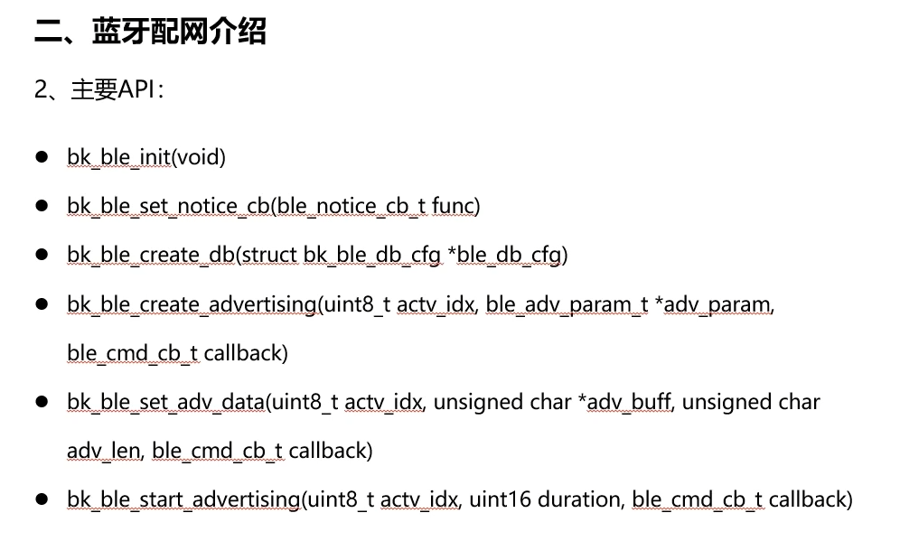
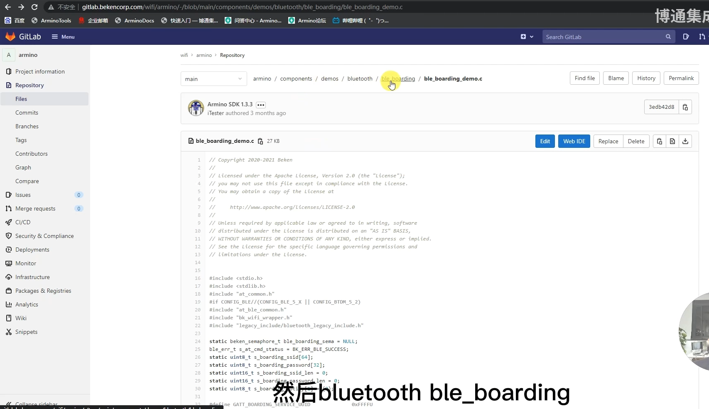
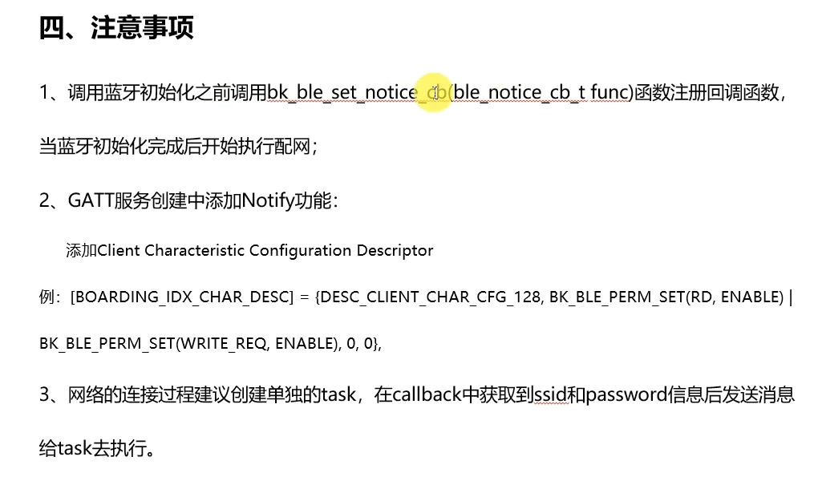
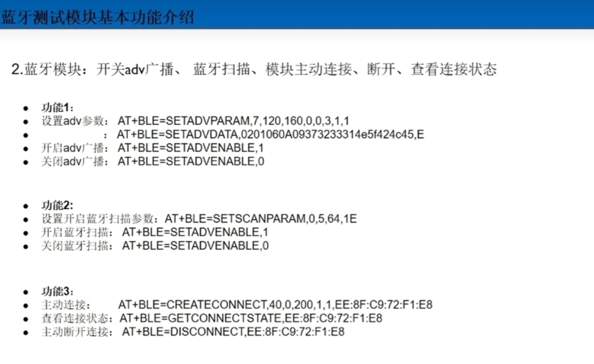
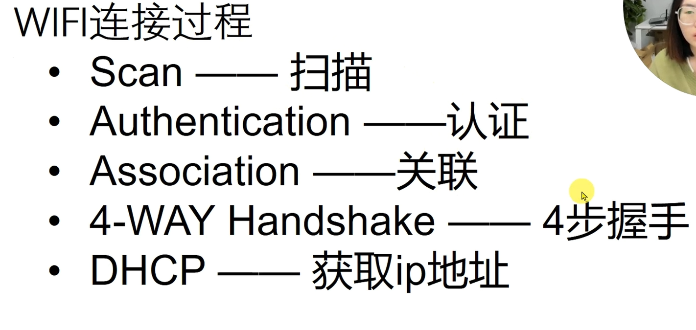
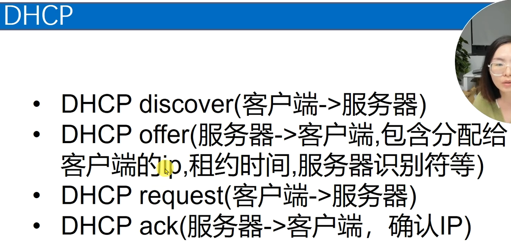
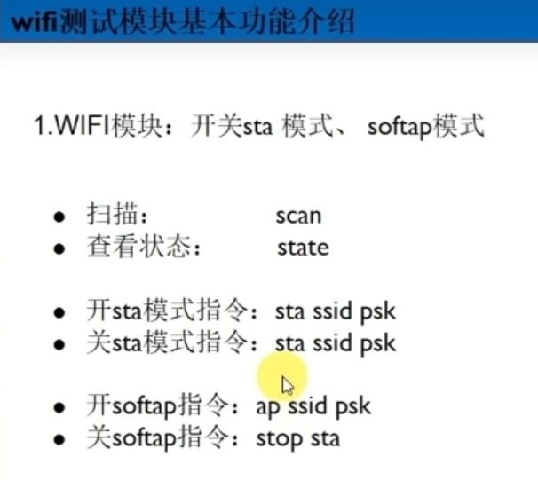
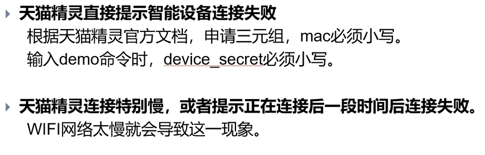

## 蓝牙配网
https://docs.bekencorp.com/armino/bk7256/zh_CN/latest/examples/bluetooth/ble_boarding_demo.html  
https://docs.bekencorp.com/armino/bk7256/zh_CN/latest/api_reference/bluetooth/ble.html  
https://docs.bekencorp.com/armino/bk7256/zh_CN/latest/examples/cli/bluetooth/ble.html
代码：
http://gitlab.bekencorp.com/wifi/armino/-/tree/main/components/demos/bluetooth/ble_boarding  
http://gitlab.bekencorp.com/wifi/armino/-/tree/main/include/modules/ble.h  

根据SPEC上面的说明

## WIFI连接过程

## BLE MESH  

