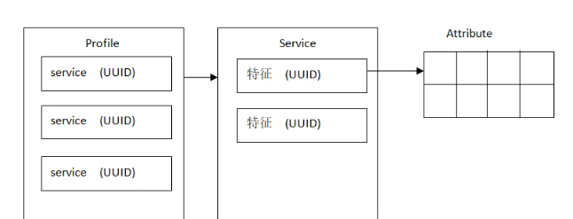

# BLE蓝牙知识
三个基本概念：Profile，Service，Characteristic。

Profile我理解为“子规划”，专门针对某种应用场景定义的。包含消息格式，标准，使用哪些蓝牙协议组件等。

Service就是“服务”，主要目的是定义我能做哪些功能。

Characteristic就是“特征”，其实就是真正的数据，我能做哪些功能，最终就是要靠这些数据来体现。
  
例如：针对“Find Me”这个应用场景，“Find Me” Profile 会描述主机设备和从机设备的角色和行为，如何广播，如何扫描，如何连接，等。并定义了从机必须要实现的服务，和可选实现的服务。主机需要实现的功能等。

Service 的目前是方便主机查找从机包含了哪些服务，或者快速指定使用哪个服务。因此Service 的 UUID就是用于这些目的的。另外，Service里面包含了可以读/写的数据，称为“Characteristic”。每个“Characteristic”也有自己的UUID，因为一个服务会包含多个特征，因此需要通过UUID区分。

Service 和 Characteristic 使用的数据结构，都是 “Attribute”。看来他们都是一个东西，只是赋予了不同的解释。

一条“Characteristic”不是对应一条“Attribute”，而是多条组成。
  
当特征有 notify 或者 indicate 功能时，蓝牙规范必须为其添加 CCCD attribute。

每个服务和特征都有一个UUID。

16bit，官方认证过的，需要花钱购买

128bit，自定义的

主机与从机通讯均由“特征”实现。
主机与从机通讯均由“特征”实现。

以 Hear Rate Service 为例，官方 16bit UUID 为 0x180D，包含三个特征：Heart Rate Measurement，Body Sensor Location 和 Rate Control Point。并且只有第一个是必须的，其它可选。

因此，开发 BLE 应用，就是开发 Service 和 Characteristic，通过API添加自己需要的服务和特征。

  
在这个图片上，有个情况，就是手机在给ble从设备发第一个空包的时候，ble从设备如果没有收到第一个packet（M->S），则会以1.25 ms + transmit window offset为起点，等待connInterval之后，再次尝试接收，直到接收到为止，或者六次尝试都失败断开连接为止。ble从设备接收到packet之后，则以收到该packet的时间点为起始点（anchor point），以connInterval为周期，接着接收后续的packet（M->S），以及发送packet给手机（S->M）。

连接成功后，在其它时间里，设备也可以主动通知对方断开连接。断开连接的数据包如下：
LL_TERMINATE_IND
并且包含断开的错误码。

在 nimble 上开发，可以使用接口：
int ble_gap_terminate(uint16_t conn_handle, uint8_t hci_reason)。hci_reason可以填写我们想要告知对方的错误码。

ble从设备发送广播数据包ADV，发送完，马上侦听

手机收到广播包，马上发起连接请求 CONNECT_REQ，ble从设备在侦听，因此可以收到。ble从设备在收到的 CONNECT_REQ 包中，包含transmit window offset，transmit window size等参数，会根据这些计算出要等待多长时间，在哪个信道上，开始侦听手机发来的第一个空包

手机等待“1.25ms+transmit window offset+transmit window size”时间后，在之前说好的信道上，马上发出一个空包给ble从设备，然后进入侦听状态

ble从设备因为也在计算好的时间里进行了侦听，因此能收到这个包。并认为连接成功了。然后返回一个空包

手机收到ble从设备发来的第一个空包，并认为连接成功了

场景：蓝牙从设备开发板 + 手机 

手机连接开发板后，开发板通过打印，可以看到，在上报了连接成功的事件后，会马上再上报一个                                                                   BLE_GAP_EVENT_RD_REM_FEATS_COMPLETE 事件。

我们看到，手机连接开发板后，手机马上发出了查询特性的动作：LL_FEATURE_REQ，同时，开发板也想知道手机的特性，也发送了 LL_SLAVE_FEATURE_REQ。通过各自发送的包，其实里面已经包含了自己支持的特性数据以给到对方。

理论上，只要任何一方发起，对方回复了，那么大家就都获取到了对方支持的特性。不需要双方都发送查询这么麻烦。但是又怕对方不查询，因此自己就主动去做了。

开发板触发这个事件的动作在 LL_SLAVE_FEATURE_REQ 发送后，得到对方的 LL_FEATURE_RSP 的时候。


## 蓝牙配网
https://docs.bekencorp.com/armino/bk7256/zh_CN/latest/examples/bluetooth/ble_boarding_demo.html  
https://docs.bekencorp.com/armino/bk7256/zh_CN/latest/api-reference/bluetooth/ble.html
https://docs.bekencorp.com/armino/bk7256/zh_CN/latest/examples/cli/bluetooth/ble.html  
代码：  
http://gitlab.bekencorp.com/wifi/armino/-/tree/main/components/demos/bluetooth/ble_boarding  
http://gitlab.bekencorp.com/wifi/armino/-/tree/main/include/modules/ble.h  


根据SPEC上面的说明


`bk_ble_init`()函数初始化蓝牙模块，并使能蓝牙功能。  

`bk_ble_set_notice_cb()`函数设置蓝牙通知回调函数，当蓝牙有数据需要通知时，会调用该函数。  
```
示例：//注册 ble 事件通知回调。
   void ble_at_notice_cb(ble_notice_t notice, void *param)
{
    switch (notice) {

    case BLE_5_WRITE_EVENT: {

        if (w_req->prf_id == g_test_prf_task_id)
        {
            switch(w_req->att_idx)
            {
            case TEST_IDX_CHAR_DECL:
                break;
            case TEST_IDX_CHAR_VALUE:
                break;
            case TEST_IDX_CHAR_DESC:
                //when peer enable notification, we create time and notify peer, such as
                //write_buffer = (uint8_t *)os_malloc(s_test_data_len);
                //bk_ble_send_noti_value(s_test_data_len, write_buffer, g_test_prf_task_id, TEST_IDX_CHAR_VALUE);
                break;

            default:
                break;
            }
        }
        break;
    }
    case BLE_5_CREATE_DB:
    //bk_ble_create_db success here
    break;
    }
}

bk_ble_set_notice_cb(ble_at_notice_cb);
```
`bk_ble_create_db()`函数创建蓝牙数据库，用于保存蓝牙设备信息。  
注册 gatt 服务。
用户示例：首先，我们必须构建 test_service_db test_service_db 是 att 的数据库，用于 ble 发现。读取、写入和其他操作用于 ATT 数据库。
```
enum {
    TEST_IDX_SVC,
    TEST_IDX_CHAR_DECL,
    TEST_IDX_CHAR_VALUE,
    TEST_IDX_CHAR_DESC,

    TEST_IDX_CHAR_DATALEN_DECL,
    TEST_IDX_CHAR_DATALEN_VALUE,

    TEST_IDX_CHAR_INTER_DECL,
    TEST_IDX_CHAR_INTER_VALUE,

    TEST_IDX_NB,
};

//att records database.

ble_attm_desc_t test_service_db[TEST_IDX_NB] = {
   //  Service Declaration
   [TEST_IDX_SVC]              = {DECL_PRIMARY_SERVICE_128, BK_BLE_PERM_SET(RD, ENABLE), 0, 0},
   // Characteristic declare
   [TEST_IDX_CHAR_DECL]    = {DECL_CHARACTERISTIC_128,  BK_BLE_PERM_SET(RD, ENABLE), 0, 0},
   // Characteristic Value
   [TEST_IDX_CHAR_VALUE]   = {{0x34, 0x12, 0},     BK_BLE_PERM_SET(NTF, ENABLE), BK_BLE_PERM_SET(RI, ENABLE) | BK_BLE_PERM_SET(UUID_LEN, UUID_16), 128},
   //Client Characteristic Configuration Descriptor
   [TEST_IDX_CHAR_DESC] = {DESC_CLIENT_CHAR_CFG_128, BK_BLE_PERM_SET(RD, ENABLE) | BK_BLE_PERM_SET(WRITE_REQ, ENABLE), 0, 0},
};
```
`bk_ble_start_advertising()`函数创建蓝牙广播，用于让蓝牙设备可以被搜索到。    

```
ble_adv_param_t adv_param;

adv_param.own_addr_type = 0;//BLE_STATIC_ADDR
adv_param.adv_type = 0; //ADV_IND
adv_param.chnl_map = 7;
adv_param.adv_prop = 3;
adv_param.adv_intv_min = 0x120; //min
adv_param.adv_intv_max = 0x160; //max
adv_param.prim_phy = 1;// 1M
adv_param.second_phy = 1;// 1M
actv_idx = bk_ble_get_idle_actv_idx_handle();
if (actv_idx != UNKNOW_ACT_IDX) {
    bk_ble_create_advertising(actv_idx, &adv_param, ble_at_cmd_cb);
}
```

`bk_ble_set_adv_data()`函数设置广播数据，用于设置广播的名称、广播的类型、广播的UUID等。  
```
用户示例：

const uint8_t adv_data[] = {0x02, 0x01, 0x06, 0x0A, 0x09, 0x37 0x32, 0x33, 0x31, 0x4e, 0x5f, 0x42, 0x4c, 0x45};
bk_ble_set_adv_data(actv_idx, adv_data, sizeof(adv_data), ble_at_cmd_cb);
```
必须在bk_ble_create_advertising后使用
`bk_ble_start_advretising()`函数启动广播，使蓝牙设备可以被搜索到。  
必须在bk_ble_create_advertising后使用


## WIFI连接过程


## BLE MESH  


