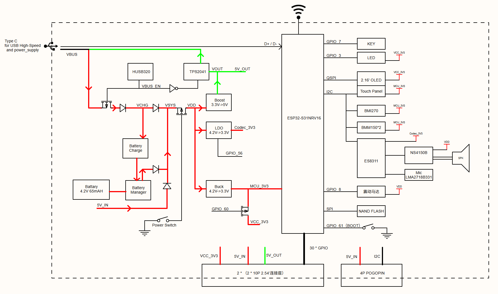

## 用户指南

[docs.espressif.com/projects/esp-dev-kits/zh_CN/latest/esp32s31/esp-mosaico/index.html](https://docs.espressif.com/projects/esp-dev-kits/zh_CN/latest/esp32s31/esp-mosaico/index.html)

## 产品官网

[mosaico.espressif.com](https://mosaico.espressif.com/)

## 软件资源

[github.com/esp-mosaico](https://github.com/esp-mosaico)

## 硬件资源

### MCU 与管脚分配

下表按功能分组列出 ESP-Mosaico BSP 中的主要管脚分配。

| 分类 | 信号 | GPIO | 说明 |
| --- | --- | --- | --- |
| I2C / 传感器 | I2C0_SDA | GPIO0 | 共享 I2C：触摸、ES8311、BMI270、BMM150、BQ27220、模块 EEPROM |
| I2C / 传感器 | I2C0_SCL | GPIO1 | 共享 I2C 时钟 |
| I2C / 传感器 | SENSOR_INT | GPIO2 | IMU / 磁力计中断或信号 |
| I2C / 传感器 | TOUCH_INT | GPIO6 | 触摸中断 |
| 人机交互 | STATUS_LED | GPIO3 | 橙色状态灯，程序可控，低电平点亮 |
| 人机交互 | AI_BUTTON | GPIO7 | 应用按键，低电平有效 |
| 人机交互 | MOTOR | GPIO8 | 振动马达，高电平开启 |
| LCD | LCD_DATA3 | GPIO9 | CO5300 QSPI DATA3 |
| LCD | LCD_DATA2 | GPIO35 | CO5300 QSPI DATA2 |
| LCD | LCD_DATA0 | GPIO36 | CO5300 QSPI DATA0 |
| LCD | LCD_RST | GPIO42 | LCD 复位 |
| LCD | LCD_TE | GPIO43 | LCD_TE 防撕裂同步 |
| LCD | LCD_SCL | GPIO44 | QSPI 时钟 |
| LCD | LCD_CS | GPIO50 | LCD 片选 |
| LCD | LCD_DATA1 | GPIO51 | CO5300 QSPI DATA1 |
| 音频 | I2S_BCK | GPIO37 | 音频位时钟 |
| 音频 | I2S_DOUT | GPIO40 | 音频数据输出（DAC） |
| 音频 | PA_CTRL | GPIO45 | 功放使能 |
| 音频 | I2S_WS | GPIO49 | 音频帧时钟（字选择） |
| 音频 | I2S_DIN | GPIO52 | 音频数据输入（ADC） |
| 音频 | I2S_MCLK | GPIO54 | 音频主时钟 |
| 音频 | CODEC_PW | GPIO56 | Codec 3.3 V 电源控制 |
| 电源 | POWER_SWITCH | GPIO57 | 开关机请求 |
| 电源 | VCC_3V3_CTRL | GPIO60 | 系统 3.3 V 电源控制 |
| NAND Flash | NAND_CLK | GPIO20 | SPI NAND（SD_D0） |
| NAND Flash | NAND_D | GPIO21 | SPI NAND（SD_D1 / SIO0） |
| NAND Flash | NAND_Q | GPIO22 | SPI NAND（SD_D2 / SIO1） |
| NAND Flash | NAND_CS | GPIO23 | SPI NAND（SD_D3） |
| NAND Flash | NAND_HOLD | GPIO24 | SPI NAND（SD_CLK / SIO3） |
| NAND Flash | NAND_WP | GPIO25 | SPI NAND（SD_CMD / SIO2） |

### I2C 设备地址

共享 I2C 总线（I2C0_SDA / I2C0_SCL）上的 7-bit 地址如下。其中板载器件位于 CoreBoard / BaseBoard；模块 EEPROM 位于外接模块上，不在主板上，仅在对应模块插槽接入带 EEPROM 的模块时出现。

| I2C 地址 | 器件 | 说明 |
| --- | --- | --- |
| 0x11 | BMM150 #2 | 板载三轴地磁传感器 |
| 0x12 | BMM150 #3 | 板载三轴地磁传感器 |
| 0x19 | ES8311 | 板载音频编解码芯片 |
| 0x50 | 模块 EEPROM（Left） | 位于左侧模块上，不在主板；由 GPIO14 低电平选通 |
| 0x51 | 模块 EEPROM（Right） | 位于右侧模块上，不在主板；由 GPIO39 高电平选通 |
| 0x55 | BQ27220 | 板载电池电量计 |
| 0x5A | CST9220 | 板载触摸控制器 |
| 0x69 | BMI270 | 板载六轴 IMU |