# ESP-IDF 
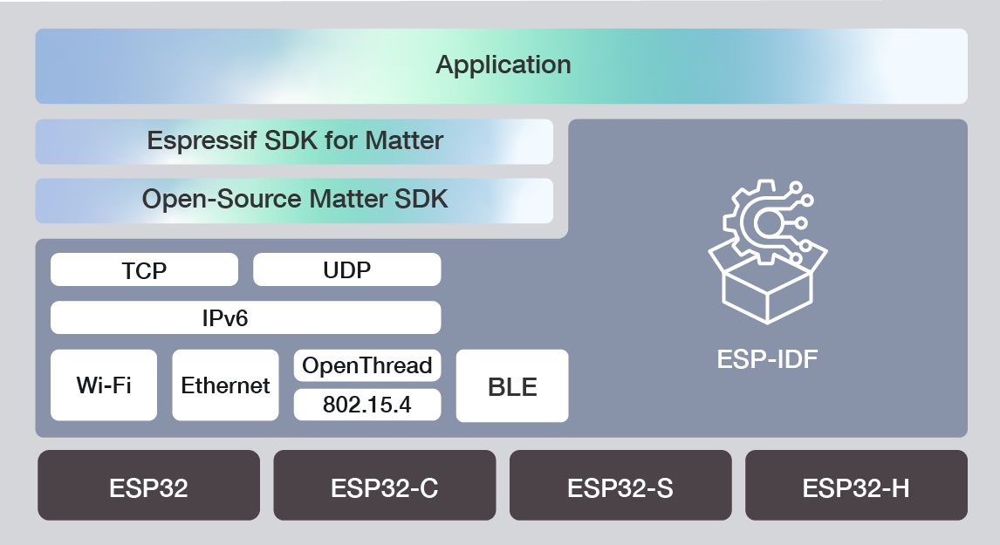  
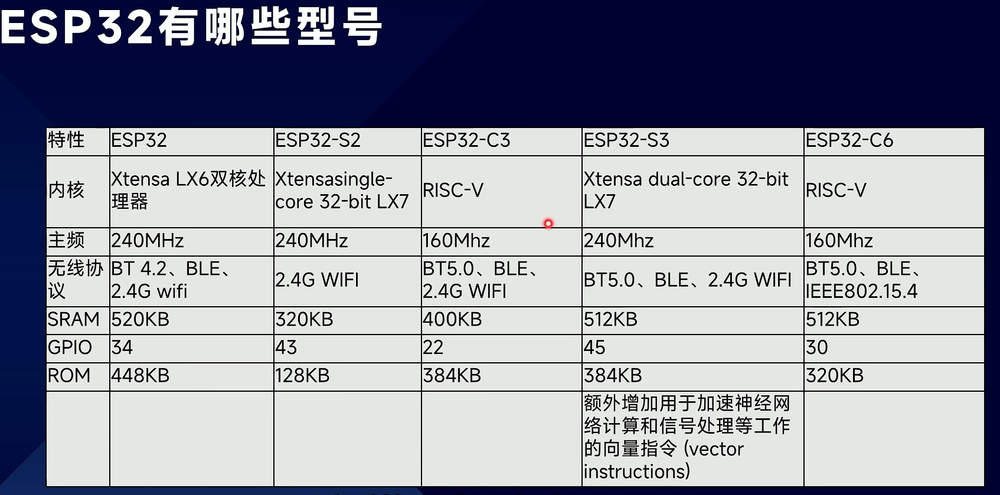  
esp-idf最主要的目录如下：  
components:组件代码，esp-idf 的核心，包含通用的功能部件，比如 freeRTOS、wifi、GPIO
驱动、PWM 驱动等等  
examples:官方例程，大部分的应用都可以在这里找到相关例子  
docs:一些介绍文档  
tools：一些工具，如编译、烧录 

IDF 编程指南：https://docs.espressif.com/projects/esp-idf/zh_CN/latest/esp32/index.html  
ESP-IDF Github 地址：https://github.com/espressif/esp-idf  
VSCode 下载地址：https://code.visualstudio.com/Download  
百度地图 API 天气查询接口文档：lbsyun.baidu.com/faq/api?title=webapi/weather/base  
ESP RainMaker 官方文档：https://rainmaker.espressif.com/zh-hans/docs/intro  
ESP RainMaker Github 地址：https://github.com/espressif/esp-rainmaker  
ESP RainMaker Gitee 地址：https://gitee.com/EspressifSystems/esp-rainmaker  
ESP 组件 地址：https://components.espressif.com/
ChatGPT：https://chat.openai.com/auth/login  
## 编程注意
>头文件中只应该进行变量和函数的声明，而将变量的定义和初始化放在一个源文件中进行。这样可以避免重复定义的问题。  
>创建任务函数在app_main函数中调用。任务服务函数在main.c文件中定义,调用相关初始化函数(或配置相应结构体)后编写自己的程序逻辑（while循环）。初始化函数写在（定义）对应.c文件里，需要对外界公开的话，在.h文件中声明。  
```c
// 不推荐：在栈上分配大数组
int large_array[1000];

// 推荐：动态分配在堆上
int* large_array = (int*)malloc(1000 * sizeof(int));
```
在中断里面调用的函数，前面加`IARM_ATTR`修饰，函数是放在内存中执行的，而不是放在flash中执行的
# 使用Linux编译指令
```bash
idf.py create-project myproject
idf.py set-target esp32c6
idf.py menuconfig
idf.py build
idf.py -p (COM端口号) flash
idf.py -p (COM端口号) monitor
ctrl+]
```
在 `idf.py build` 编译完成后，我们输入 `idf.py flash` 命令直接将编译的 bin 文件烧录到板子中。  
`idf.py monitor` 命令，就可以启用监控串口打印了。
串口监控工具退出方法是 ctrl+]
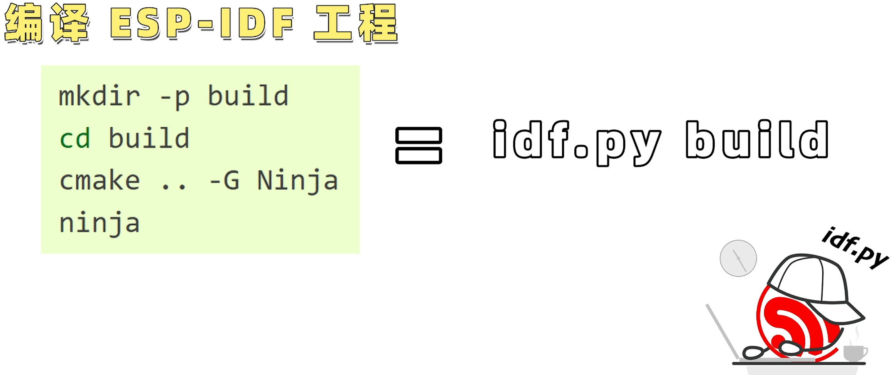
# 安装VSCode
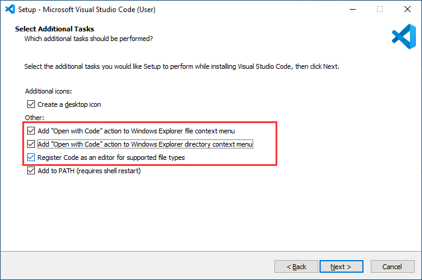  
运行安装包后，其余均可以默认安装，但这里为了后续的体验建议，建议在此处勾选框中的1、2、3项
第一二项开启后，可以直接通过鼠标右键文件或者目录打开VSCode，可以提高后续的使用体验.
第三项开启后，选择打开方式时，可以直接选择VSCode  
## 若使用虚拟机开发，VSCode连接SSH步骤
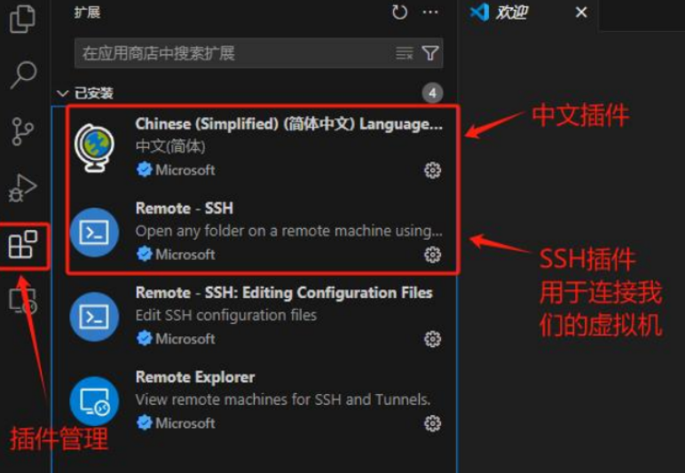  
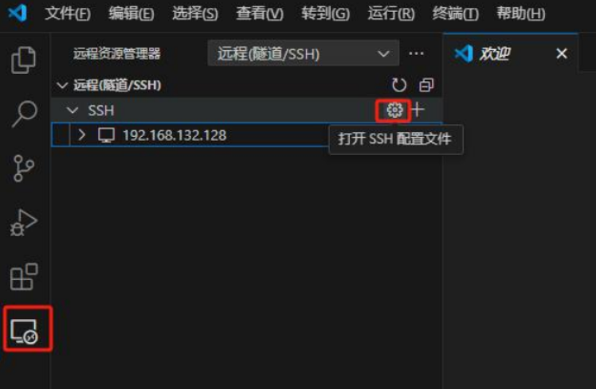  
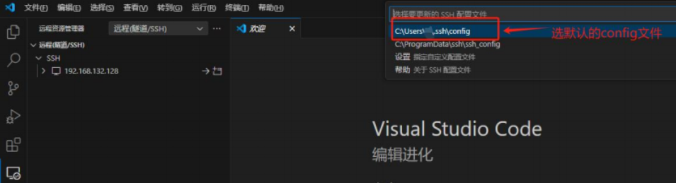  
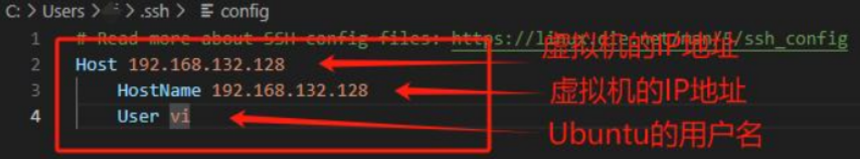  
保存，重启一下 VSCode，就能看见可以连接的远程主机了  
# JTAG 调试
修改 launch.json 文件  
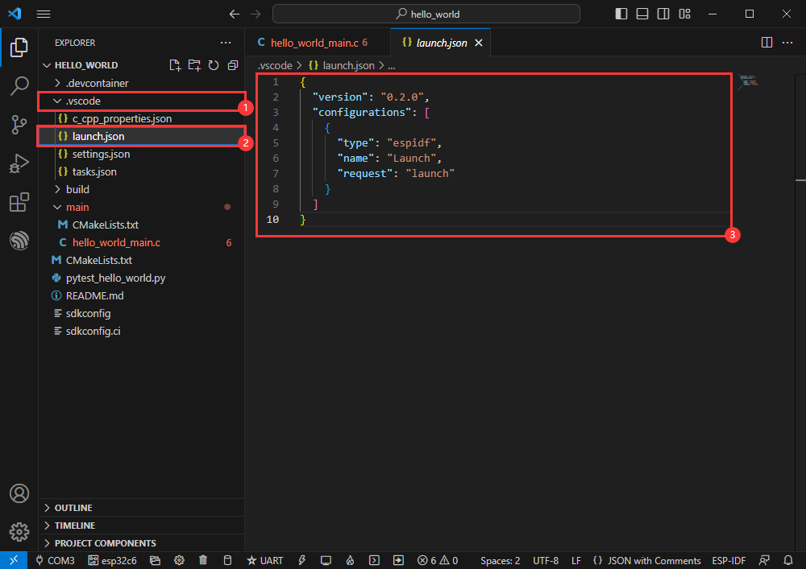  
```json
{
 "version": "0.2.0",
 "configurations": [
   {
     "name": "GDB",
     "type": "cppdbg",
     "request": "launch",
     "MIMode": "gdb",
     "miDebuggerPath": "${command:espIdf.getXtensaGdb}",
     "program": "${workspaceFolder}/build/${command:espIdf.getProjectName}.elf",
     "windows": {
       "program": "${workspaceFolder}\\build\\${command:espIdf.getProjectName}.elf"
     },
     "cwd": "${workspaceFolder}",
     "environment": [{ "name": "PATH", "value": "${config:idf.customExtraPaths}" }],
     "setupCommands": [
       { "text": "target remote :3333" },
       { "text": "set remote hardware-watchpoint-limit 2"},
       { "text": "mon reset halt" },
       { "text": "thb app_main" },
       { "text": "flushregs" }
     ],
     "externalConsole": false,
     "logging": {
       "engineLogging": true
     }
   }
 ]
}
```
>请使用 USB 接口，UART 接口并不支持JTAG调试

点击快捷键 F1，输入`ESP-IDF:Device configuration`,选择 OpenOcd Config Files,输入 board/esp32c6-builtin.cfg (若默认是这个，就直接回车就可以)  

点击 [OpenOCD Server]，选择 Start OpenOCD  
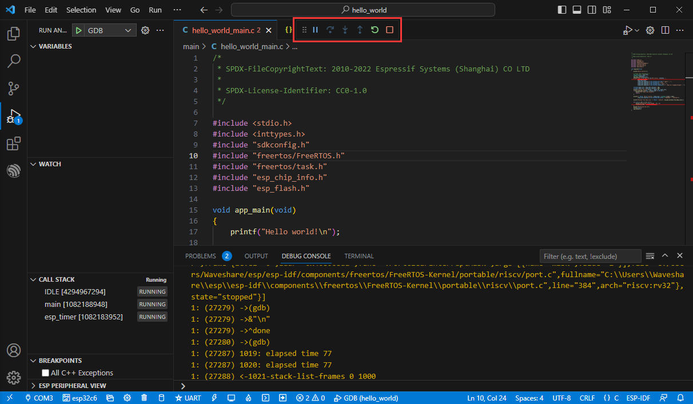
# 工程目录的基本组成
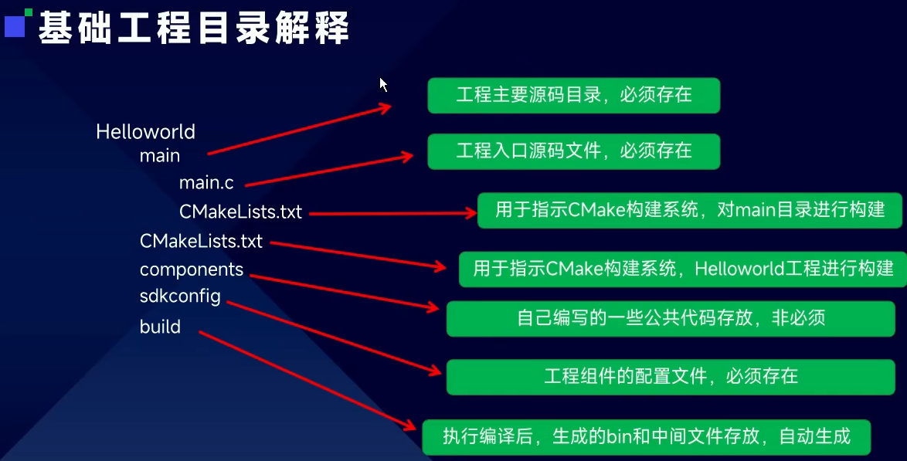  
main/目录，项目工程的主要源码目录，这个是必须要存在的，不然编译不过  
main/ 目 录 下 有 main.c 里 面 包 含 我 们 应 用 代 码 的 入 口 函 数 app_main()。  
项目顶层也有一个 CMakeLists.txt 文件，用于指示 CMake 构建系统，对 helloworld 工程进行构建，如果我们想要修改工程名称，需要修改这个文件中 project(main)中的 main，改成我们想要的名称即可。CMakeLists必须出现在两个地方：工程的最顶层目录以及每个组件的目录。  
sdkconfig 文件，这个是工程配置文件，如果不存在，idf 会为我们生成一个默认的，这个文件也很关键，以后我们用 idf.py menuconfig 命令配置工程，就会自动生成这个文件。  
build/目录执行编译后，生成的 bin 和中间文件存放，自动生成  

## CMakeLists
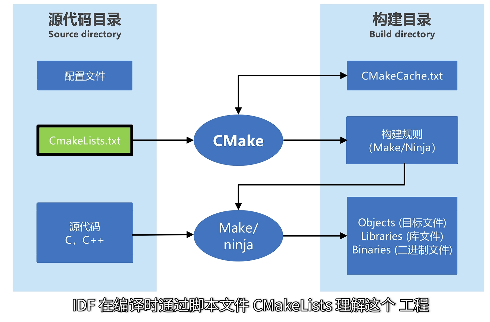
main文件夹下的CMakeLists.txt 用于指示 CMake 构建系统，对 main/目录进行构建，大家增加源码文件，需要在这个 CMakeLists.txt 中增加源码文件。  
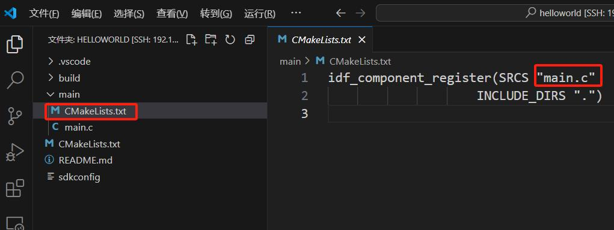  
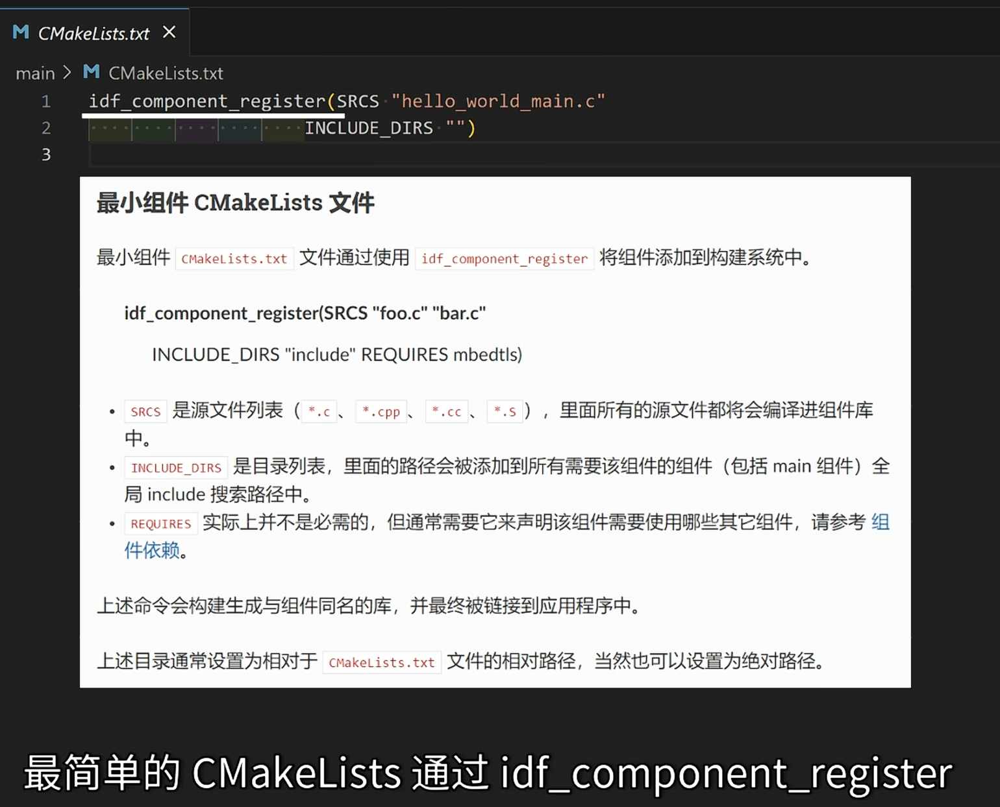

## 添加组件
> 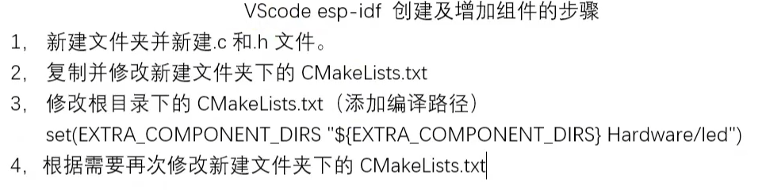  
> 在新建的组件下调用库函数需要添加  
> REQUIRES driver  或者 PRIV_REQUIRES driver

新建组件目录，需要对顶层CMakeLists.txt文件进行修改，增加组件的路径，IDF默认组件保存在IDF路径下的components文件夹中，不需要在CMakeLists中声明就可以直接调用。只有main组件会默认require IDF相关组件。其他组件都需要手动添加依赖。

    set(EXTRA_COMPONENT_DIRS ./components)
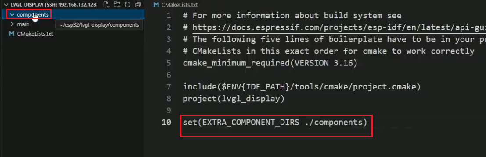
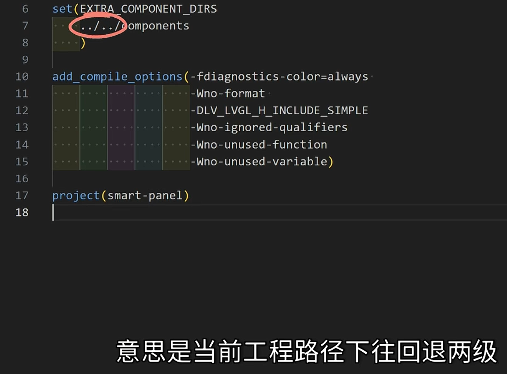
EXTRA_COMPONENT_DIRS会指定一个路径去寻找组件，可以使用相对路径或者绝对路径，多个路径使用空格隔开。
如果遇到重名组件，就会使用最后搜索到的组件进行覆盖。工程中components文件夹优先程度是最高的。
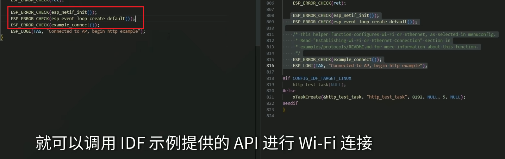  

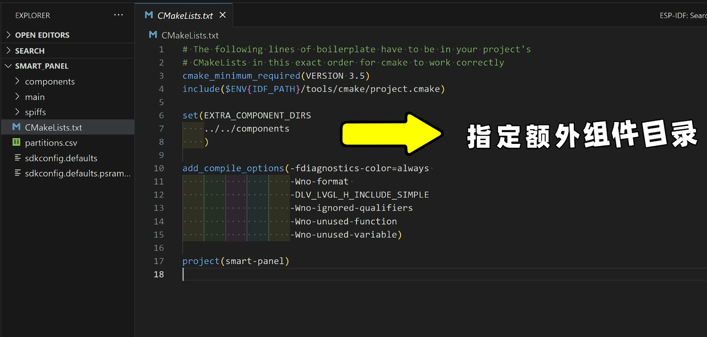  

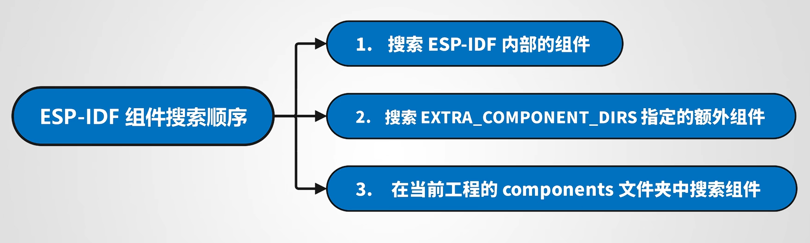  
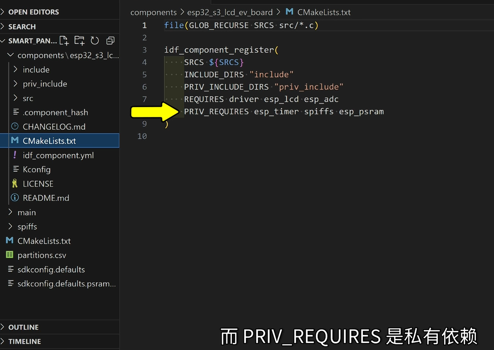  
使用组件库：
在main组件下有idf_component.yml组件管理文件  
编译后会自动下载组件管理器里的组件，保存在`managed_components`文件夹
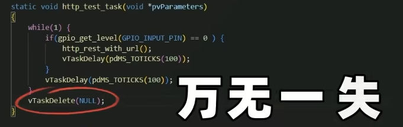  
组件锁文件`dependencies.lock`是为了确保每次编译`managed_components`的文件不被修改
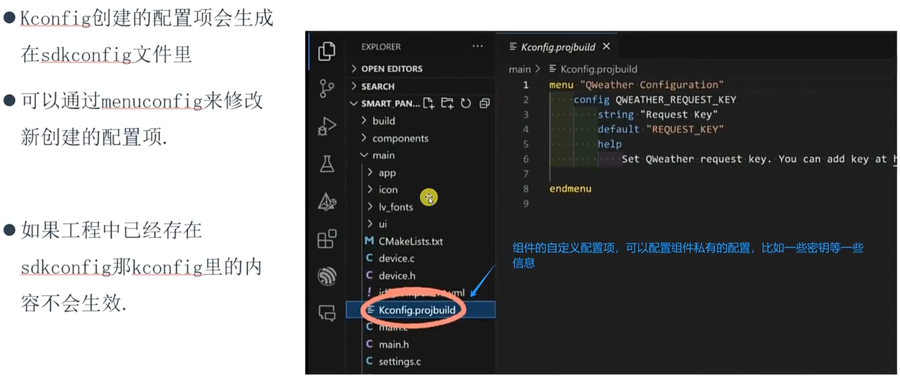
## 编译bin文件
生成的 bin 放在 build 的什么地方，其实这个工程生成了几个有用的 bin，看下 cat build/  flasher_args.json 这个文件  
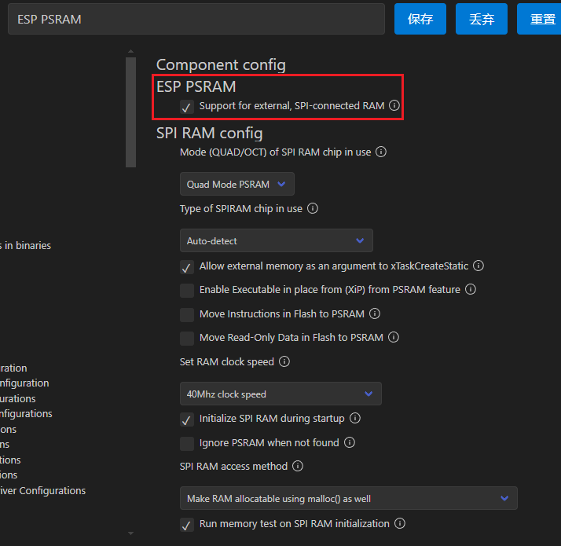  
里面清楚的可以看到，我们生成了这三个文件，并且分别对应烧录的位置。  
bootloader，应用启动前的一段代码。  
main.bin，我们的应用代码  
partition-table.bin 分区表，用于表示我们的几个区分别存放了什么  
在build/flash_project_args中可以看到，烧录的地址。
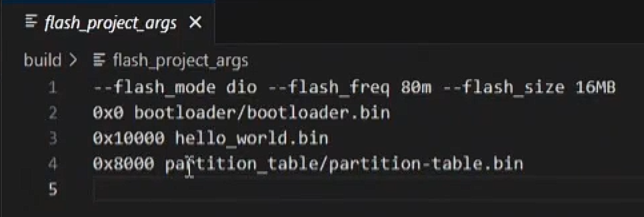
## 配置芯片menuconfig
工作主频->默认 160Mhz，ESP32 最高支持 240Mhz  
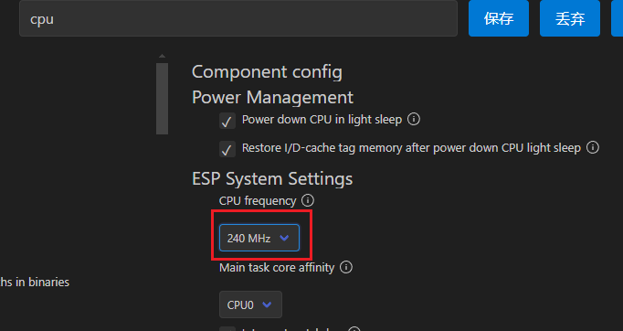  
Flash 大小->默认 2M，ESP32S3模组是 8M Flash,ESP32-WROOM-32E模组是 4M Flash  
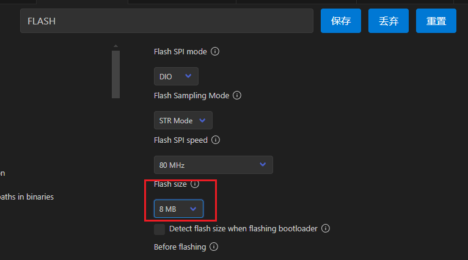  
PSRAM->默认没有，ESP32S3模组内部集成是 8M PSRAM，ESP32-WROOM-32E模组是没哟  选择OPI  
烧录是用内部集成PSRAM的，就是OPI，如果是直接外部焊接的PSRAM，那就是QSPI  
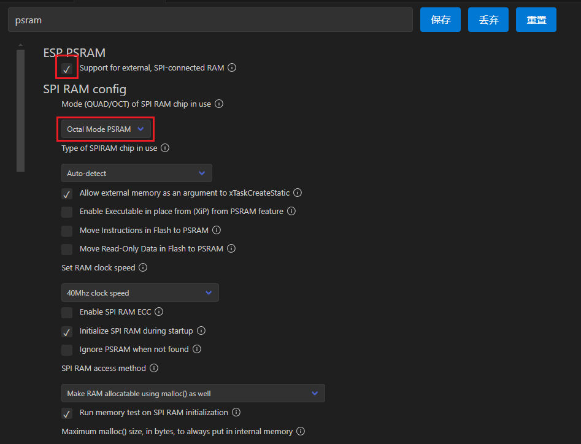  
进行HTTP连接的时候，忽略证书验证，选择不验证。否则会报证书错误  
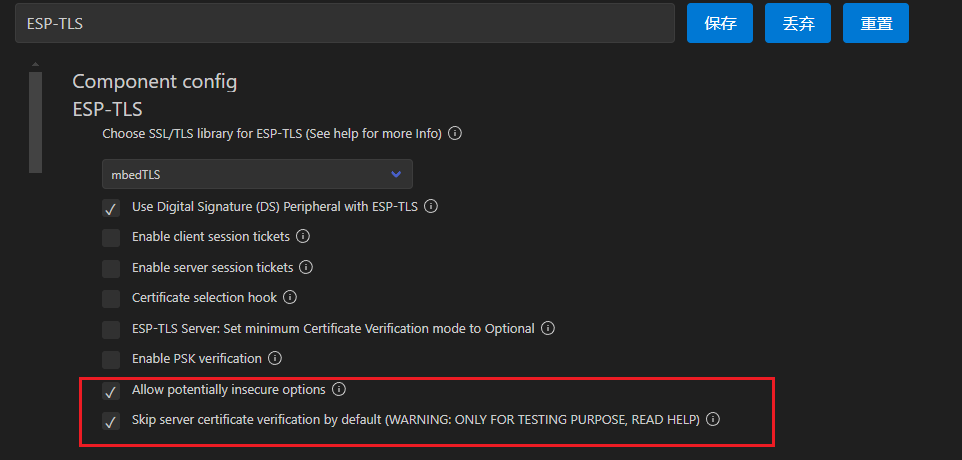  
## 相关开发板引脚图
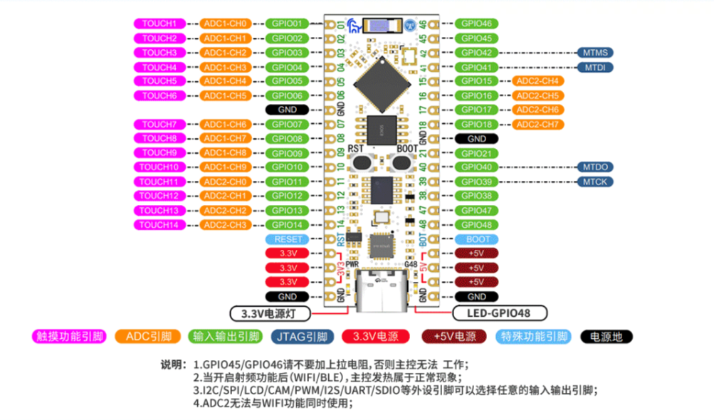  


# 程序结构和启动流程
指令总线是可以执行的，比如我们定义的函数。  
数据总线不可以执行，只能通过字节操作访问，比如全局变量  
1. 数据总线，static变量以及初始化为0的全局变量
2. 数据总线，未初始化的全局变量
3. 指令总线
4. 指令总线
5. 数据总线，常量数据const
6. 数据总线
7. 可以作为指令存储器，也可以作为数据存储器  
   
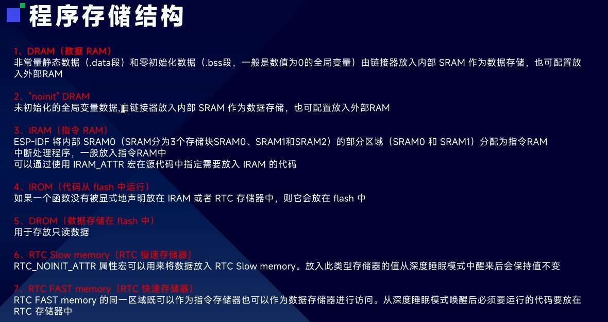
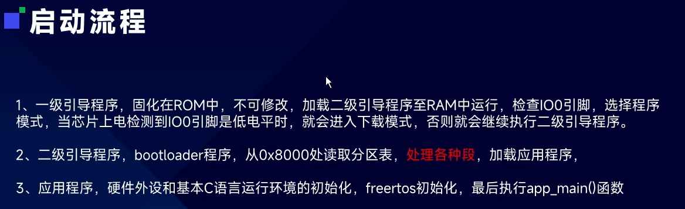
# 最小代码
```c
//立创示例代码
#include <stdio.h>
#include <inttypes.h>
#include "sdkconfig.h"
#include "freertos/FreeRTOS.h"
#include "freertos/task.h"

void app_main(void)
{
    printf("Hello world!\n");
    vTaskDelay(1000 / portTICK_PERIOD_MS);
    fflush(stdout);
    esp_restart();
}
```
`fflush(stdout);`：刷新标准输出缓冲区，确保所有输出都已发送到终端或串口。通常 printf 会将数据存入缓冲区，fflush 可以立即输出。

`esp_restart();`：调用 ESP32 的系统重启函数，重启芯片。程序在打印 "Hello world!" 后延时 1 秒，接着重启设备

# FreeRTOS之IDF
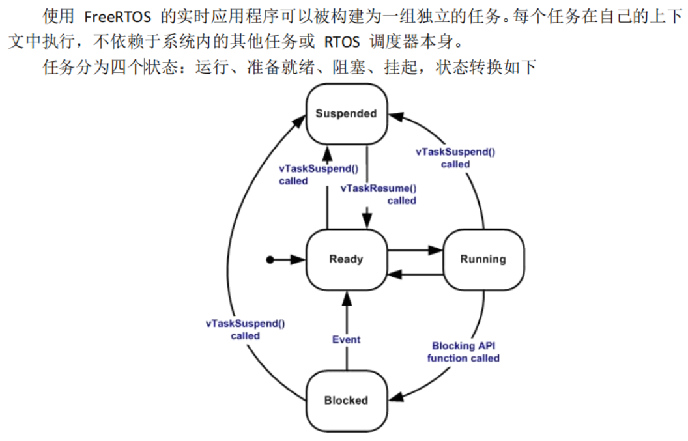  
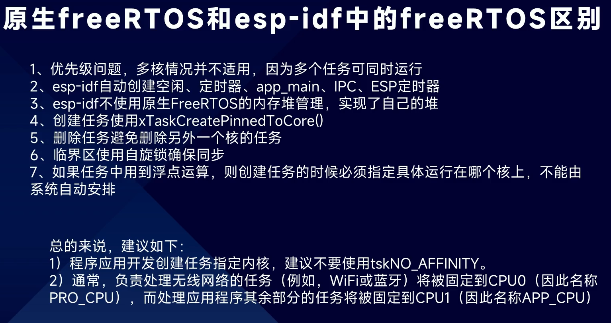  
  
优先级：每个任务均被分配了从 0 到 ( configMAX_PRIORITIES - 1 ) 的优先级，其中的
configMAX_PRIORITIES 在 FreeRTOSConfig.h 中定义，低优先级数字表示低优先级任务。 空闲任务的优先级为零。  
关于 freeRTOS 经典例程，源码在于 esp32-board/rtos 中，这个例程 main.c 中包含了
freeRTOS 在实际应用中非常常用的例程，也有丰富的注释，大家看完之后肯定能学会如何使用 freeRTOS。  
## 任务创建：
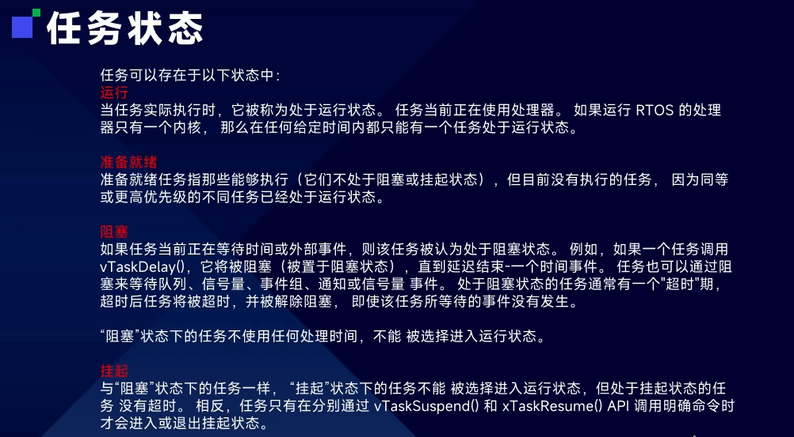  
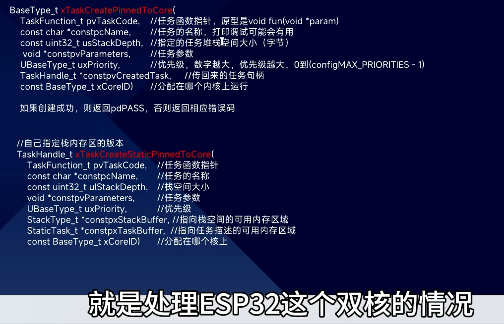  
```c
    #include "freertos/FreeRTOS.h"
    #include "freertos/task.h"
    #include "esp_log.h"

    //以下创建两个任务，任务栈大小为2048字节，优先级为3，并设定运行在CORE1上
    xTaskCreatePinnedToCore(taskA,"taskA",2048,NULL,3,NULL,1);//任务函数指针,任务的名称,指定的任务堆栈空间大小（字节）,任务参数,优先级,任务句柄,运行在哪个核心上
    xTaskCreatePinnedToCore(taskB,"taskB",2048,NULL,3,NULL,1);

    xPortGetCoreI() 获取当前程序所运行的内核ID，ID有0和1
```
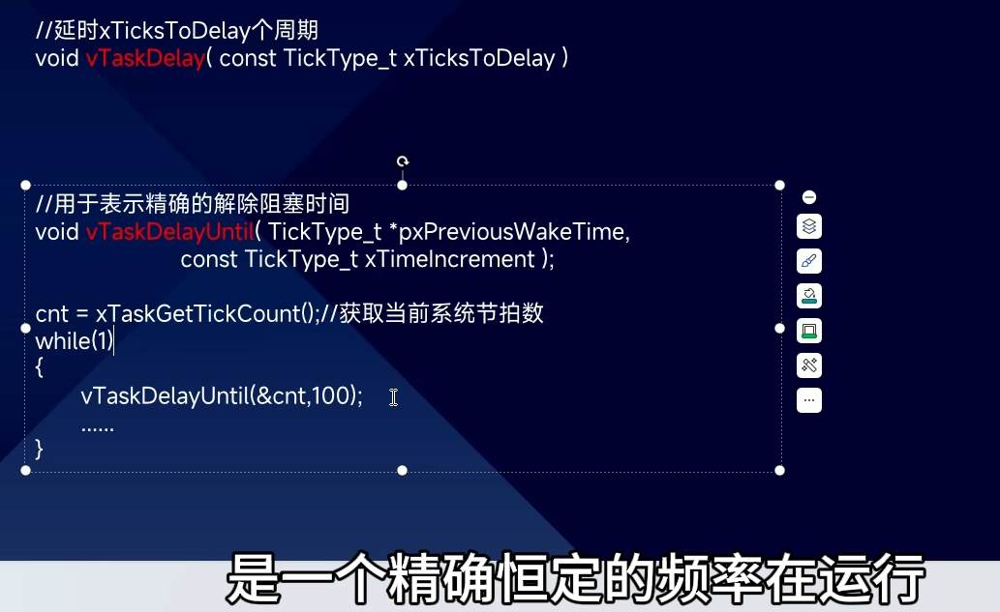
```c
void taskA(void *param)
{
    while(1)
    {
        //每隔500ms打印
        ESP_LOGI(TAG,"this is taskA");
        vTaskDelay(pdMS_TO_TICKS(500));
        //vTaskDelay(500 / portTICK_PERIOD_MS);
    }
}
```
执行vTaskDelayUntil() 函数后会立刻解除阻塞状态，而vTaskDelay() 函数则不会。

`void vTaskDelay( const TickType_t xTicksToDelay ) `函数，将一个任务延迟给定的`xTicksToDelay`数。任务被阻止的实际时间取决于`tick rate`。常数`portTICK_PERIOD_MS`可以用来从tick rate计算实时时间，分辨率为一个tick 周期。至于一个时钟节拍数是1ms，2ms，还是10ms，取决于`configTICK_RATE_Hz`，即 `cONFI6_FREERTOS_HZ`。CONFIG_FREERTOS_HZ在sdkconfig中定义，默认是100Hz。则一个时钟节拍数是10ms。可以将其修改为1000Hz，则一个时钟节拍数是1ms，计时更加精确。不过这样也会增加系统的开销,造成不必要的浪费。  
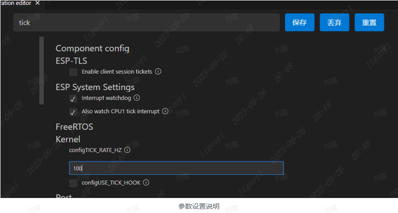  
## 队列操作：（先进先出）
  
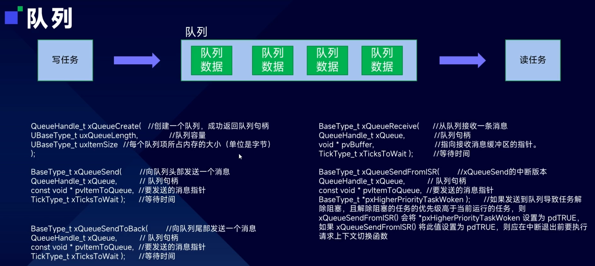  
使用xQueueSendFromISR() 用户需要在退出中断函数后，手动执行任务调度函数，以执行系统调度。

```c
#include "freertos/queue.h"

//队列句柄
static QueueHandle_t s_testQueue;
//定义一个队列数据内容结构体
typedef struct
{
    int num;    //里面只有一个num成员，用来记录一下数据
}queue_packet;

        //发送queue_packet数据
        queue_packet packet;
        packet.num = test_cnt++;
        //向队列头部发送一个消息
        xQueueSend(s_testQueue,&packet,pdMS_TO_TICKS(200));//队列句柄,要发送的消息指针,等待时间

        //接收queue_packet数据
        queue_packet packet;
        //从队列接收一条消息
        BaseType_t ret = xQueueReceive(s_testQueue,&packet,pdMS_TO_TICKS(200));//队列句柄,指向接收消息缓冲区的指针,等待时间

    //创建一个队列，成功返回队列句柄，队列容量是5
    s_testQueue = xQueueCreate(5,sizeof(queue_packet));//队列容量,每个队列项所占内存的大小（单位是字节）
```

## 信号量
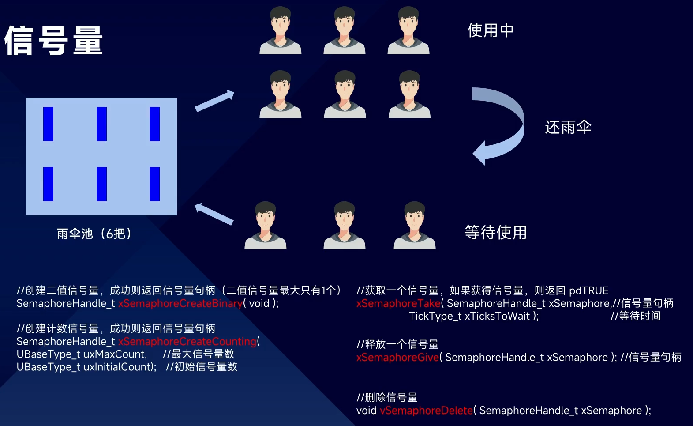  
这个图里面，雨伞池是我们的信号量句柄，雨伞是信号量，而用户就是任务，任务
可以等待是否取得信号量，再去继续执行后续操作，保证资源的正确访问，当使用完信
号量后，需要释放信号量。  
信号量使用起来比较简单。因为在 freeRTOS 中它本质上就是队列，只不过信号量
只关心队列中的数量而不关心队列中的消息内容，在 freeRTOS 中有两种常用的信号量，
一是计数信号量，而是二进制信号量。  
二进制信号量很简单，就是信号量总数只有 1，也就是这个图中总雨伞数量只有 1。
计数信号量则可以自定义总共的信号量。  
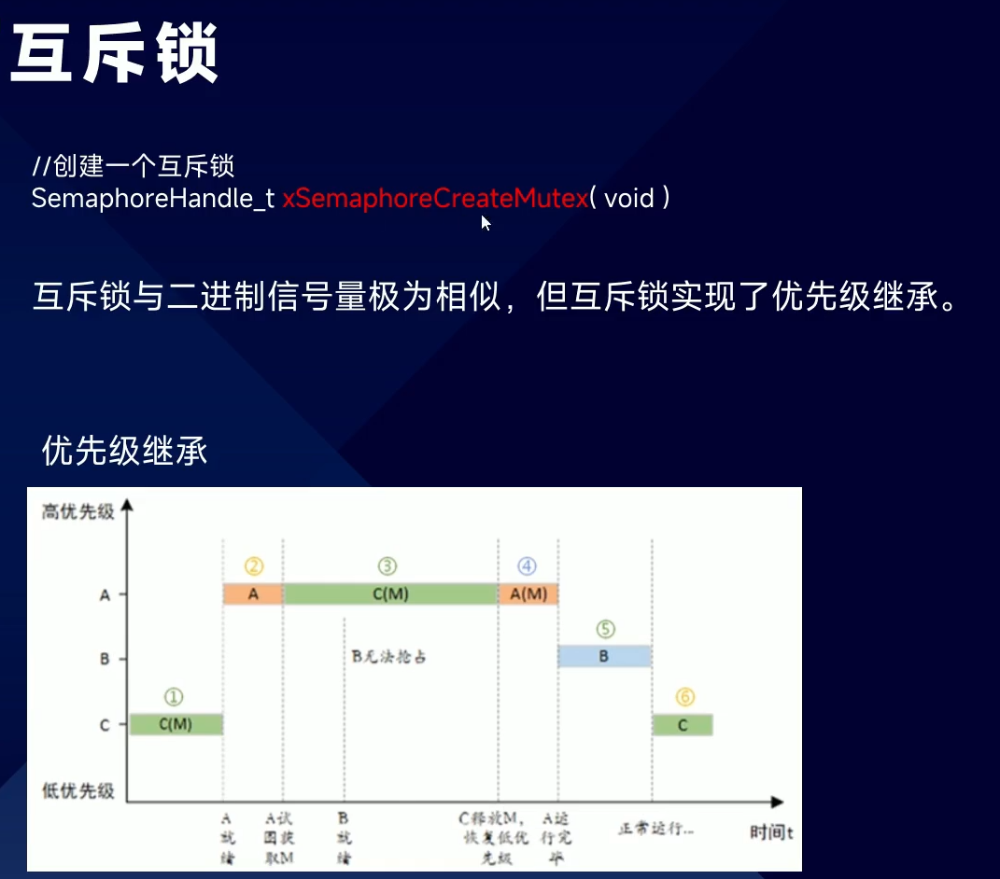
```c
#include "freertos/semphr.h"

//二进制信号量
static SemaphoreHandle_t s_testBinSem;
//计数信号量
static SemaphoreHandle_t s_testCountSem;
//互斥信号量
static SemaphoreHandle_t s_testMuxSem;

        //向二值信号量释放信号
        xSemaphoreGive(s_testBinSem);//信号量句柄
        //向互斥信号量释放信号
        xSemaphoreGiveRecursive(s_testMuxSem);

        //获取一个信号量，如果获得信号量，则返回 pdTRUE
        ret = xSemaphoreTake(s_testBinSem,portMAX_DELAY);//信号量句柄,等待时间
        //无限等待互斥信号量，直到获取成功才返回，这里用法和二进制信号量极为类似
        ret = xSemaphoreTakeRecursive(s_testMuxSem,portMAX_DELAY);

    //创建二值信号量，成功则返回信号量句柄（二值信号量最大只有 1 个）
    s_testBinSem = xSemaphoreCreateBinary();
    //创建计数信号量，成功则返回信号量句柄
    s_testCountSem = xSemaphoreCreateCounting(5,0);//最大信号量数，初始信号量数
    //创建一个互斥锁
    s_testMuxSem = xSemaphoreCreateMutex();

    //删除信号量
    void vSemaphoreDelete( SemaphoreHandle_t xSemaphore );
```
## 事件组和直达任务通知

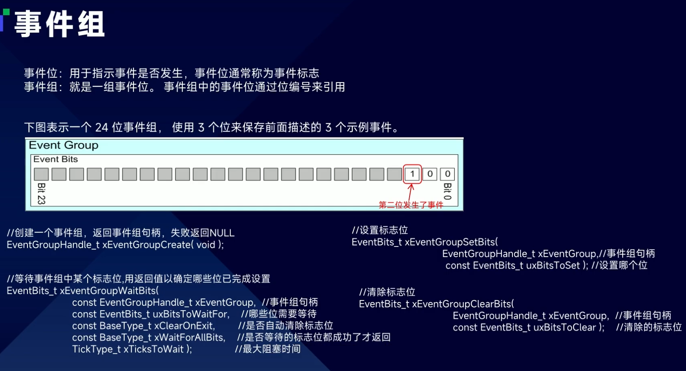  
```c
#include "freertos/event_groups.h"

//事件组句柄
static EventGroupHandle_t s_testEvent;

        xEventGroupSetBits(s_testEvent,BIT0);//事件组句柄,设置哪个位
        xEventGroupSetBits(s_testEvent,BIT1);

EventBits_t ev;
//等待事件组中某个标志位,用返回值以确定哪些位已完成设置
ev = xEventGroupWaitBits(s_testEvent,BIT0|BIT1,pdTRUE,pdFALSE,portMAX_DELAY);//事件组句柄,哪些位需要等待,是否自动清除标志,是否等待的标志位都成功了才返回,最大阻塞时间

//创建一个事件组，返回事件组句柄，失败返回 NULL
s_testEvent = xEventGroupCreate();


//清除标志位
EventBits_t xEventGroupClearBits(
EventGroupHandle_t xEventGroup, //事件组句柄
const EventBits_t uxBitsToClear ); //清除的标志位
```
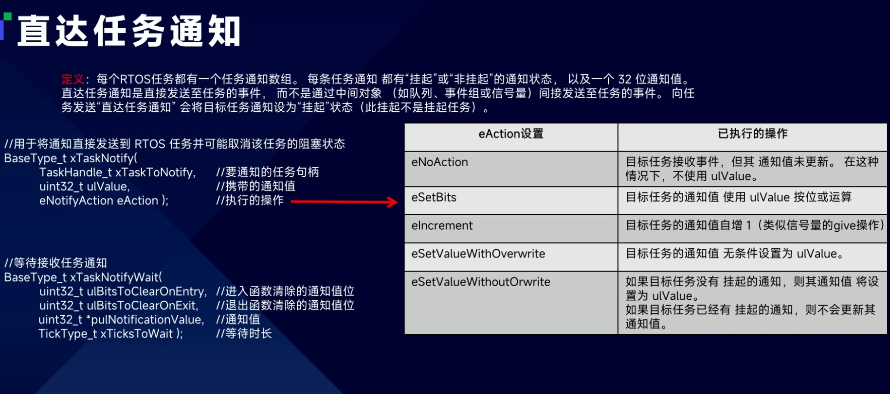
无需再初始化或新建其他对象句柄，直接使用任务句柄来操作通知的发送。
ulBitsToClearOnEntry以及ulBitsToClearOnExit参数用于设置在进入和退出临界区时要清除的事件组位，是按位掩码。目的是清除位。
直达任务通知需要用到任务句柄，不能NULL。
```c
//要使用任务通知，需要记录任务句柄
static TaskHandle_t s_notifyTaskAHandle;
static TaskHandle_t s_notifyTaskBHandle;

        //等待接收任务通知
        if (xTaskNotifyWait(0x00, ULONG_MAX, &rec_val, pdMS_TO_TICKS(1000)) == pdTRUE)//进入函数清除的通知值位,退出函数清除的通知值位,通知值,等待时长
        {
            ESP_LOGI(TAG,"receive notify value:%lu",rec_val);
        }

//用于将事件直接发送到 RTOS 任务并可能取消该任务的阻塞状态
xTaskNotify(s_notifyTaskAHandle, notify_val, eSetValueWithOverwrite);//要通知的任务句柄,携带的通知值,执行的操作

    xTaskCreatePinnedToCore(notify_taskA,"notify_taskA",2048,NULL,3,&s_notifyTaskAHandle,1);
    xTaskCreatePinnedToCore(notify_taskB,"notify_taskB",2048,NULL,3,&s_notifyTaskBHandle,1);
```
# GPIO驱动LED
## LED闪烁
```c
#include "driver/gpio.h"
#include "freertos/FreeRTOS.h"
#include "freertos/task.h"
#include <stdio.h>


// 定义 LED 的 GPIO 口
#define LED_GPIO GPIO_NUM_27

// LED 闪烁运行任务
void led_run_task(void *param) {
  int gpio_level = 0;
  while (1) {
    vTaskDelay(pdMS_TO_TICKS(500));
    gpio_set_level(LED_GPIO, gpio_level);
    gpio_level = gpio_level ? 0 : 1;
  }
}

// LED 闪烁初始化
void led_flash_init(void) {
  gpio_config_t led_gpio_cfg = {
      .pin_bit_mask = (1 << LED_GPIO),       // 指定 GPIO
      .mode = GPIO_MODE_OUTPUT,              // 设置为输出模式
      .pull_up_en = GPIO_PULLUP_DISABLE,     // 禁止上拉
      .pull_down_en = GPIO_PULLDOWN_DISABLE, // 禁止下拉
      .intr_type = GPIO_INTR_DISABLE,        // 禁止中断
  };
  gpio_config(&led_gpio_cfg);
}

void app_main() {
  led_flash_init();
  xTaskCreatePinnedToCore(led_run_task, "led", 2048, NULL, 3, NULL, 1);
}
```
## 呼吸灯
高低电平脉冲切换速度达到一定程度时（大约是 25Hz），我们人眼是看不出来一闪一闪的效果，只会看到 LED 较暗，那到底暗多少，这就需要 PWM 脉宽调制的占空比来决定，所谓占空比，简单来说就是高电平时间占 PWM 周期的百分比时间，比如占空比是 50%，我们看到 LED 就是半亮，占空比 100%就是全亮，和直接输出高电平没区别，如果我们动态的改变占空比，那么就可以看到 LED 从暗到亮，从亮到暗的变化，这就是呼吸灯的效果。    

在IDF中已经为我们封装好了简单的PWM操作，称为LEDC组件。  
```c
#include <string.h>
#include <freertos/FreeRTOS.h>
#include <freertos/task.h>
#include <driver/rmt_rx.h>
#include <driver/rmt_tx.h>
#include <soc/rmt_reg.h>
#include "driver/gpio.h" 
#include <esp_log.h>
#include <freertos/queue.h>
#include <freertos/event_groups.h>
#include "esp32/rom/ets_sys.h"
#include "driver/ledc.h"

#define LEDC_TIMER              LEDC_TIMER_0            //定时器0
#define LEDC_MODE               LEDC_LOW_SPEED_MODE     //低速模式
#define LEDC_OUTPUT_IO          (LED_GPIO)              //选择GPIO端口
#define LEDC_CHANNEL            LEDC_CHANNEL_0          //PWM通道
#define LEDC_DUTY_RES           LEDC_TIMER_13_BIT       //分辨率
#define LEDC_DUTY               (4095)                  //最大占空比值，这里是2^13-1
#define LEDC_FREQUENCY          (5000)                  //PWM周期

// 用于通知渐变完成
static EventGroupHandle_t s_ledc_ev = NULL;
// 关灯完成事件标志
#define LEDC_OFF_EV (1 << 0)
// 开灯完成事件标志
#define LEDC_ON_EV (1 << 1)
// 渐变完成回调函数
bool IRAM_ATTR ledc_finish_cb(const ledc_cb_param_t *param, void *user_arg) {
  BaseType_t xHigherPriorityTaskWoken;
  if (param->duty) {
    xEventGroupSetBitsFromISR(s_ledc_ev, LEDC_ON_EV,
                              &xHigherPriorityT askWoken);
  } else {
    xEventGroupSetBitsFromISR(s_ledc_ev, LEDC_OFF_EV,
                              &xHigherPriority TaskWoken);
  }
  return xHigherPriorityTaskWoken;
}

// LED 呼吸灯初始化
void led_breath_init(void) {
  // 初始化一个定时器
  ledc_timer_config_t ledc_timer = {
      .speed_mode = LEDC_MODE,          // 低速模式
      .timer_num = LEDC_TIMER,          // 定时器 ID
      .duty_resolution = LEDC_DUTY_RES, // 占空比分辨率，这里是 13 位，2^13-1
      .freq_hz = LEDC_FREQUENCY, // PWM 频率,这里是 5KHZ
      .clk_cfg = LEDC_AUTO_CLK   // 时钟
  };
  ESP_ERROR_CHECK(ledc_timer_config(&ledc_timer));

  // ledc 通道初始化
  ledc_channel_config_t ledc_channel = {
      .speed_mode = LEDC_MODE, // 低速模式
      .channel = LEDC_CHANNEL, // PWM 通道 0-7
      .timer_sel = LEDC_TIMER, // 关联定时器，也就是上面初始化好
      的那个定时器.intr_type = LEDC_INTR_DISABLE, // 不使能中断
      .gpio_num = LEDC_OUTPUT_IO, // 设置输出 PWM 方波的 GPIO 管脚
      .duty = 0,                  // 设置默认占空比为 0
      .hpoint = 0};
  ESP_ERROR_CHECK(ledc_channel_config(&ledc_channel));

  // 开启硬件 PWM
  ledc_fade_func_install(0);
  // 创建一个事件组，用于通知任务渐变完成
  s_ledc_ev = xEventGroupCreate();
  // 配置 LEDC 渐变
  ledc_set_fade_with_time(LEDC_MODE, LEDC_CHANNEL, LEDC_DUTY, 2000);
  // 启动渐变
  ledc_fade_start(LEDC_MODE, LEDC_CHANNEL, LEDC_FADE_NO_WAIT);
  // 设置渐变完成回调函数
  ledc_cbs_t cbs = {
      .fade_cb = ledc_finish_cb,
  };
  ledc_cb_register(LEDC_MODE, LEDC_CHANNEL, &cbs, NULL);
}

// ledc 渐变任务
void ledc_breath_task(void *param) {
  EventBits_t ev;
  while (1) {
    ev = xEventGroupWaitBits(s_ledc_ev, LEDC_ON_EV | LEDC_OFF_EV, pdTRUE,
                             pdFALSE, pdM S_TO_TICKS(5000));
    if (ev) {
      // 设置 LEDC 开灯渐变
      if (ev & LEDC_OFF_EV) {
        ledc_set_fade_with_time(LEDC_MODE, LEDC_CHANNEL, LEDC_DUTY, 2000);
        ledc_fade_start(LEDC_MODE, LEDC_CHANNEL, LEDC_FADE_NO_WAIT);
      } else if (ev & LEDC_ON_EV) // 设置 LEDC 关灯渐变
      {
        ledc_set_fade_with_time(LEDC_MODE, LEDC_CHANNEL, 0, 2000);
        ledc_fade_start(LEDC_MODE, LEDC_CHANNEL, LEDC_FADE_NO_WAIT);
      }
      // 再次设置回调函数
      ledc_cbs_t cbs = {
          .fade_cb = ledc_finish_cb,
      };
      //用于注册一个回调函数
      ledc_cb_register(LEDC_MODE, LEDC_CHANNEL, &cbs, NULL);
    }
  }
}

// 主函数
void app_main(void)
{
  //led_breath_init();      //呼吸灯
  xTaskCreatePinnedToCore(ledc_breath_task,"ledc",2048,NULL,3,NULL,1);
}
```
`ledc_set_fade_with_time` 设置一个 PWM 占空比目标值和渐变周期，这里代码示例是，需要在 2000ms，将目前的占空比渐变至 LEDC_DUTY（满占空比）
`ledc_fade_start` 函数启动渐变，通过 LEDC_FADE_NO_WAIT 参数设置为立刻返回，那我们怎么知道渐变完成呢？可以通过 `ledc_cb_register` 函数，注册一个回调函数，当渐变完成的时候会调用我们的回调函数  

任务函数等待渐变完成事件，如果渐变结束后占空比是 0，则重新启动渐变至满占空比
的操作；如果渐变结束后占空比是满占空比，则重新启动渐变至 0 占空比的操作。
## RMT驱动WS2812
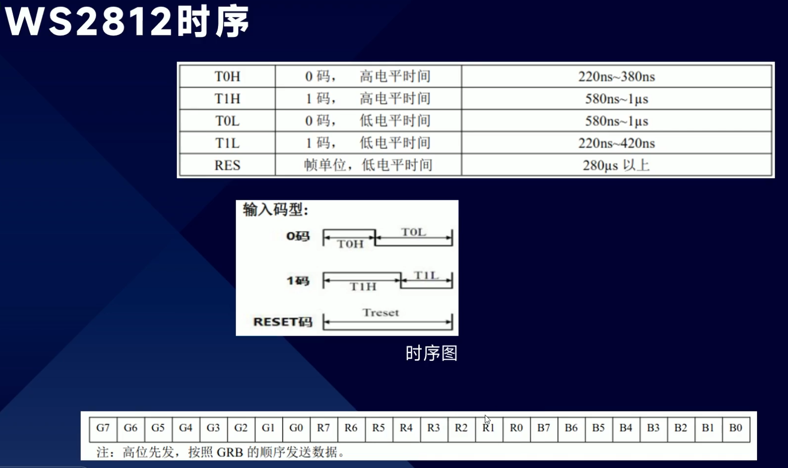  
高位在前  
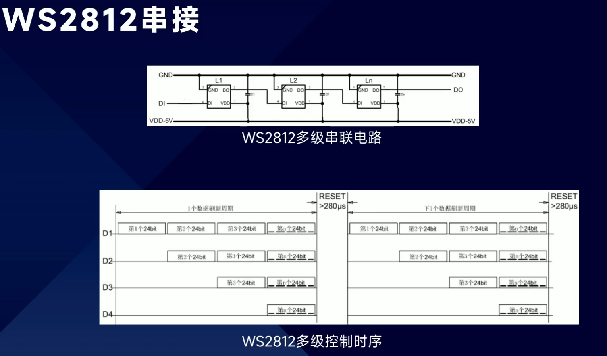  
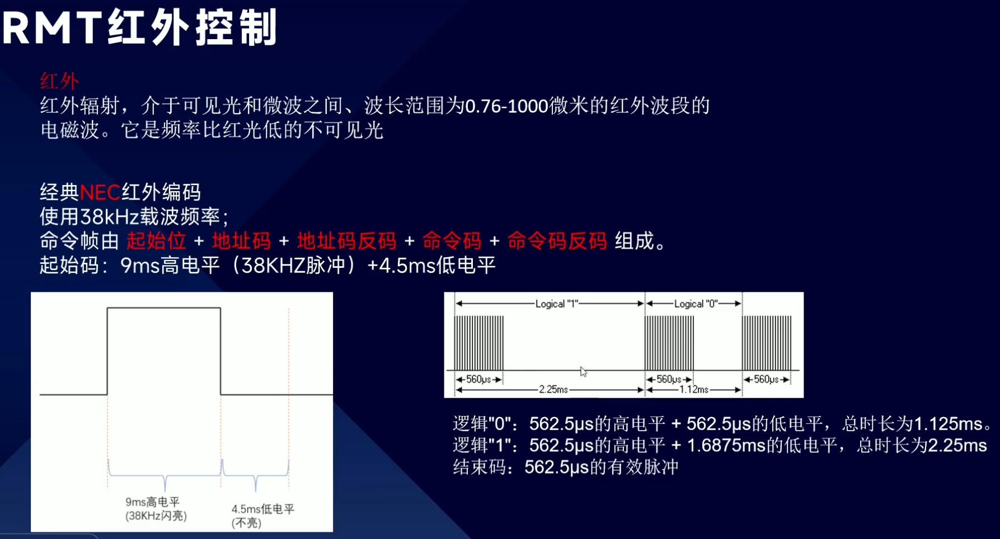  
最核心的代码在 led_ws2812.c 中，ws2812_strip_t 结构体为 WS2812 驱动描述，保存了 RMT 通道、RGB buffer 数据、led 个数信息。  
rmt_tx_channel_config_t 结构体用于定义 RMT 发送通道配置，包含时钟源、GPIO 管脚、分辨率、发送缓存等。最后调用 rmt_new_tx_channel 函数设置。  

```c
/** 初始化 WS2812 外设
 * @param gpio 控制 WS2812 的管脚
 * @param maxled 控制 WS2812 的个数
 * @param led_handle 返回的控制句柄
 * @return ESP_OK or ESP_FAIL
 */
esp_err_t ws2812_init(gpio_num_t gpio,int maxled,ws2812_strip_handle_t* handle)
{
    struct ws2812_strip_t* led_handle = NULL;
    //新增一个WS2812驱动描述
    led_handle = calloc(1, sizeof(struct ws2812_strip_t));
    assert(led_handle);
    //按照led个数来分配RGB缓存数据
    led_handle->led_buffer = calloc(1,maxled*3);
    assert(led_handle->led_buffer);
    //设置LED个数
    led_handle->led_num = maxled;

    //定义一个RMT发送通道配置
    rmt_tx_channel_config_t tx_chan_config = {
        .clk_src = RMT_CLK_SRC_DEFAULT,         //默认时钟源
        .gpio_num = gpio,                       //GPIO管脚
        .mem_block_symbols = 64,                //内存块大小，即 64 * 4 = 256 字节
        .resolution_hz = LED_STRIP_RESOLUTION_HZ,   //RMT通道的分辨率10000000hz=0.1us，也就是可以控制的最小时间单元
        .trans_queue_depth = 4,                 //底层后台发送的队列深度
    };

    //创建一个RMT发送通道
    ESP_ERROR_CHECK(rmt_new_tx_channel(&tx_chan_config, &led_handle->led_chan));

    //创建自定义编码器（重点函数），所谓编码，就是发射红外时加入我们的时序控制
    ESP_ERROR_CHECK(rmt_new_led_strip_encoder(&led_handle->led_encoder));

    //使能RMT通道
    ESP_ERROR_CHECK(rmt_enable(led_handle->led_chan));

    //返回WS2812操作句柄
    *handle = led_handle;

    return ESP_OK;
}
```

rmt_new_led_strip_encoder 函数是本篇的重点，里面设定了编码器，对发送的数据格式进行配置。  
```c
/** 创建一个基于 WS2812 时序的编码器
* @param ret_encoder 返回的编码器，这个编码器在使用 rmt_transmit 函数传输时
会用到
* @return ESP_OK or ESP_FAIL
*/
esp_err_t rmt_new_led_strip_encoder(rmt_encoder_handle_t *ret_encoder)
{
    esp_err_t ret = ESP_OK;

    //创建一个自定义的编码器结构体，用于控制发送编码的流程
    rmt_led_strip_encoder_t *led_encoder = NULL;
    led_encoder = calloc(1, sizeof(rmt_led_strip_encoder_t));
    ESP_GOTO_ON_FALSE(led_encoder, ESP_ERR_NO_MEM, err, TAG, "no mem for led strip encoder");
    led_encoder->base.encode = rmt_encode_led_strip;    //这个函数会在rmt发送数据的时候被调用，我们可以在这个函数增加额外代码进行控制
    led_encoder->base.del = rmt_del_led_strip_encoder;  //这个函数在卸载rmt时被调用
    led_encoder->base.reset = rmt_led_strip_encoder_reset;  //这个函数在复位rmt时被调用

    //新建一个编码器配置(0,1位持续时间，参考芯片手册)
    rmt_bytes_encoder_config_t bytes_encoder_config = {
        .bit0 = {
            .level0 = 1,
            .duration0 = 0.3 * LED_STRIP_RESOLUTION_HZ / 1000000, // T0H=0.3us
            .level1 = 0,
            .duration1 = 0.9 * LED_STRIP_RESOLUTION_HZ / 1000000, // T0L=0.9us
        },
        .bit1 = {
            .level0 = 1,
            .duration0 = 0.9 * LED_STRIP_RESOLUTION_HZ / 1000000, // T1H=0.9us
            .level1 = 0,
            .duration1 = 0.3 * LED_STRIP_RESOLUTION_HZ / 1000000, // T1L=0.3us
        },
        .flags.msb_first = 1 //高位先传输
    };
    //传入编码器配置，获得数据编码器操作句柄
    rmt_new_bytes_encoder(&bytes_encoder_config, &led_encoder->bytes_encoder);

    //新建一个拷贝编码器配置，拷贝编码器一般用于传输恒定的字符数据，比如说结束位
    rmt_copy_encoder_config_t copy_encoder_config = {};
    rmt_new_copy_encoder(&copy_encoder_config, &led_encoder->copy_encoder);

    //设定结束位时序
    uint32_t reset_ticks = LED_STRIP_RESOLUTION_HZ / 1000000 * 50 / 2; //分辨率/1M=每个ticks所需的us，然后乘以50就得出50us所需的ticks
    led_encoder->reset_code = (rmt_symbol_word_t) {
        .level0 = 0,
        .duration0 = reset_ticks,
        .level1 = 0,
        .duration1 = reset_ticks,
    };

    //返回编码器
    *ret_encoder = &led_encoder->base;
    return ESP_OK;
err:
    if (led_encoder) {
        if (led_encoder->bytes_encoder) {
            rmt_del_encoder(led_encoder->bytes_encoder);
        }
        if (led_encoder->copy_encoder) {
            rmt_del_encoder(led_encoder->copy_encoder);
        }
        free(led_encoder);
    }
    return ret;
}
```
这个函数重点在于 rmt_bytes_encoder_config_t 结构体配置，这个结构体里面定义了RMT 控制 0 码和 1 码的高低电平时间，这时候就可以把 WS2812 的 0 码、1 码的高低电平时间填入。其中LED_STRIP_RESOLUTION_HZ 宏定义的是时钟分辨率，例程里是 10MHz，也就是低于 0.1us 的脉冲无法发出，LED_STRIP_RESOLUTION_HZ/10000000 表示的是 1us 对应时钟节拍 tick 数。完成配置后，通过 rmt_new_bytes_encoder 函数设置并返回一个编码器，这个编码器用于将我们要发送的字节数据转为 RMT 格式的数据，在 esp-idf 中 RMT 格式的数据称为 RMT 符号，对应的是 rmt_symbol_word_t 结构体。  
另外一个较重点的是 rmt_encode_led_strip 函数，这个函数会在执行红外发送的时候调用，其目的就是将数据编码成 RMT 格式，编码 RESET 符号，控制结束流程。
具体和其余的代码，大家通过看代码中的注释即可知道什么意思。  
现在我们看一下怎么应用这个代码，我们看下 led_ws2812.h 头文件的接口
```c
typedef struct ws2812_strip_t *ws2812_strip_handle_t;
/** 初始化 WS2812 外设
* @param gpio 控制 WS2812 的管脚
* @param maxled 控制 WS2812 的个数
* @param led_handle 返回的控制句柄
* @return ESP_OK or ESP_FAIL
*/
esp_err_t ws2812_init(gpio_num_t gpio,int maxled,ws2812_strip_handle_t*
led_handle);
/** 反初始化 WS2812 外设
* @param handle 初始化的句柄
* @return ESP_OK or ESP_FAIL
*/
esp_err_t ws2812_deinit(ws2812_strip_handle_t handle);
/** 向某个 WS2812 写入 RGB 数据
* @param handle 句柄
* @param index 第几个 WS2812（0 开始）
* @param r,g,b RGB 数据
* @return ESP_OK or ESP_FAIL
*/
esp_err_t ws2812_write(ws2812_strip_handle_t handle,uint32_t index,uint32_t r,uint32_t g,uint32_t b);
```
只有三个接口，初始化、反初始化、设置 RGB 值。  
现在我们主要看下 ws2812_write 函数如何使用  
ws2812_strip_handle_t 句柄是 ws2812_init 函数返回的句柄，我们对 WS2812 操作都是基于这个句柄进行。  
index 要操作的灯珠下标，0 开始。比如说开发板配套的 WS2812 器件上有 12 个灯珠，我们要操作第 5 个灯珠，index=4。  
rgb rgb 数据每个值最大 255,3 个值就是 24 位  
在 app_main()中，调用如下  
```c
void app_main(void)
{
    ws2812_strip_handle_t ws2812_handle = NULL;
    int index = 0;
    ws2812_init(WS2812_GPIO_NUM, WS2812_LED_NUM, &ws2812_handle);
    while (1)
    {
        // 红色跑马灯
        for (index = 0; index < WS2812_LED_NUM; index++)
        {
            uint32_t r = 230, g = 20, b = 20;
            ws2812_write(ws2812_handle, index, r, g, b);
            vTaskDelay(pdMS_TO_TICKS(80));
        }
        // 绿色跑马灯
        for (index = 0; index < WS2812_LED_NUM; index++)
        {
            uint32_t r = 20, g = 230, b = 20;
            ws2812_write(ws2812_handle, index, r, g, b);
            vTaskDelay(pdMS_TO_TICKS(80));
        }
        // 蓝色跑马灯
        for (index = 0; index < WS2812_LED_NUM; index++)
        {
            uint32_t r = 20, g = 20, b = 230;
            ws2812_write(ws2812_handle, index, r, g, b);
            vTaskDelay(pdMS_TO_TICKS(80));
        }
    }
}
```
大家可以直接将这两个 led_ws2812.h、led_ws2812.c 应用在自己工程中，减少后面重复的编码工作
# BUTTON灯控程序
按键事件的处理很简单，看如下代码
```c
EventBits_t ev;
while (1) {
  // 等待按键按下事件
  ev = xEventGroupWaitBits(s_pressEvent, SHORT_EV | LONG_EV, pdTRUE, pdFALSE,
                           portMA X_DELAY);
  if (ev & SHORT_EV) {
    // 短按事件，亮一下熄灭
    gpio_set_level(LED_GPIO, 1);
    vTaskDelay(pdMS_TO_TICKS(200));
    gpio_set_level(LED_GPIO, 0);
  }
  if (ev & LONG_EV) {
    // 长按事件，闪烁 8 下，然后熄灭
    for (int i = 0; i < 8; i++) {
      gpio_set_level(LED_GPIO, 1);
      vTaskDelay(pdMS_TO_TICKS(200));
      gpio_set_level(LED_GPIO, 0);
      vTaskDelay(pdMS_TO_TICKS(200));
    }
  }
  xEventGroupClearBits(s_pressEvent, SHORT_EV);
  xEventGroupClearBits(s_pressEvent, LONG_EV);
}
```
我们通过一个事件组来标识短按和长按事件，然后在任务循环中实时监控这个事件，短
按事件则控制 LED 点亮，200ms 后熄灭。长按事件则用 for 循环来执行 8 次 led 的亮灭即可。
在最后清除掉事件防止 LED 闪亮没处理完，又有事件重复触发。
那么接下来关键的是如何检测到这两个事件。这边思路是建立一个定时器，定时器中实
时检测按键的状态，当检测到按键按下时，跳转到按键按下状态，同时触发按键短按回调函
数，然后开始计数，当计数值到达预设的长按值时，就触发长按回调函数，同时把状态转入
LONG_HOLD 状态，不做任何处理，直到检测到按键释放。上面说的短按回调函数和长按回
调函数里面，主要实现就是设置了相应的短按和长按事件位。

```c
/** 定时器回调函数，本例中是 5ms 执行一次
 * @param cfg 配置结构体
 * @return ESP_OK or ESP_FAIL
 */
static void button_handle(void *param) {
  int increase_cnt = (int)param; // 传入的参数是 5，表示定时器运行周期是 5ms
  button_dev_t *btn_target = s_button_head;
  for (; btn_target; btn_target = btn_target->next) {
    switch (btn_target->state) {
    case BUTTON_RELEASE: // 按键没有按下
      if (gpio_get_level(btn_target->btn_cfg.gpio_num) ==
          btn_target->btn_cfg.active_level) {
        btn_target->press_cnt += increase_cnt;
        btn_target->state = BUTTON_PRESS; // 调转到按下状态
      }
      break;
    case BUTTON_PRESS: // 按键按下了，等待一点延时（消抖），然后触发短按回调事件，进入BUTTON_HOLD
      if (gpio_get_level(btn_target->btn_cfg.gpio_num) ==
          btn_target->btn_cfg.active_level) {
        btn_target->press_cnt += increase_cnt;
        if (btn_target->press_cnt >=
            FILITER_TIMER) // 过了滤波时间，执行短按回调函数
        {
          ESP_LOGI(TAG, "short press detect");
          if (btn_target->btn_cfg.short_cb)
            btn_target->btn_cfg.short_cb();
          btn_target->state = BUTTON_HOLD; // 状态转入按下状态
        }
      } else {
        btn_target->state = BUTTON_RELEASE;
        btn_target->press_cnt = 0;
      }
      break;
    case BUTTON_HOLD: // 按住状态，如果时间长度超过设定的超时计数，将触发长按回调函数，进入
                      // BUTTON_LONG_PRESS_HOLD
      if (gpio_get_level(btn_target->btn_cfg.gpio_num) ==
          btn_target->btn_cfg.active_level) {
        btn_target->press_cnt += increase_cnt;
        if (btn_target->press_cnt >=
            btn_target->btn_cfg
                .long_press_time) // 已经检测到按下大于预设长按时间,执行长按回调函数
        {
          ESP_LOGI(TAG, "long press detect");
          if (btn_target->btn_cfg.long_cb)
            btn_target->btn_cfg.long_cb();
          btn_target->state = BUTTON_LONG_PRESS_HOLD;
        }
      } else {
        btn_target->state = BUTTON_RELEASE;
        btn_target->press_cnt = 0;
      }
      break;
    case BUTTON_LONG_PRESS_HOLD: // 此状态等待电平消失，回到BUTTON_RELEASE 状态
      if (gpio_get_level(btn_target->btn_cfg.gpio_num) !=
          btn_target->btn_cfg.active_level) // 检测到释放，就回到初始状态
      {
        btn_target->state = BUTTON_RELEASE;
        btn_target->press_cnt = 0;
      }
      break;
    default:
      break;
    }
  }
}
```
button_handle 是定时器，每隔 5ms 执行一次， button_dev_t 结构体是对于单个按键的
描述，本例程考虑了有多个按键，将这些按键描述通过链表串起来，然后循环遍历，对应配
套教程的开发板只有一个按键，因此这个循环只执行一次，button_dev_t 链表只有一个内容。
在这个循环中，会判断按键当前的状态，btn_target->state 状态类型分别有 4 个
1) BUTTON_RELEASE,//此状态表示按键没有按下，但会一直检测，如果检测到有按键按
下，会进入到 BUTTON_PRESS 状态
2) BUTTON_PRESS,//按键按下了，如果计数值超过滤波时间，触发短按回调事件，然后
进入 BUTTON_HOLD
3) BUTTON_HOLD, /按住状态，如果计数值超过预设长按超时，将触发长按回调函数，
进入 BUTTON_LONG_PRESS_HOLD
4 )BUTTON_LONG_PRESS_HOLD, //此状态等待电平消失，回到 BUTTON_RELEASE 状态
btn_target->press_cnt 成员就是记录按键按下的时间，如果按键按下，每个定时器周期
都会增加(本例中是 5ms)。

再看看 button 的相关初始化代码
```c
// 按键配置结构体
typedef struct
{
    int gpio_num;             // gpio 号
    int active_level;         // 按下的电平
    int long_press_time;      // 长按时间
    button_press_cb short_cb; // 短按回调函数
    button_press_cb long_cb;  // 长按回调函数
} button_config_t;
/** 设置按键事件
 * @param cfg 配置结构体
 * @return ESP_OK or ESP_FAIL
 */
esp_err_t button_event_set(button_config_t *cfg);
```
这里的初始化需要新建一个按键配置，设定 gpio_num、按下时的电平、长按时间、短
按和长按的回调函数，然后通过 button_event_set 把按键配置添加到按键配置链表中。看看
在主函数中，是如果应用这个函数的。
```c
/** 短按按键回调函数
 * @param 无
 * @return 无
 */
void short_press_handle(void)
{
    xEventGroupSetBits(s_pressEvent, SHORT_EV);
}
/** 长按按键回调函数
 * @param 无
 * @return 无
 */
void long_press_handle(void)
{
    xEventGroupSetBits(s_pressEvent, LONG_EV);
}
/** 完整的按键+LED 演示程序
 * @param 无
 * @return 无
 */
void complete_btn_test(void *arg)
{
    s_pressEvent = xEventGroupCreate();
    button_config_t btn_cfg =
        {
            .gpio_num = BTN_GPIO,           // gpio 号
            .active_level = 0,              // 按下的电平
            .long_press_time = 3000,        // 长按时间
            .short_cb = short_press_handle, // 短按回调函数
            .long_cb = long_press_handle    // 长按回调函数
        };
    button_event_set(&btn_cfg); // 添加按键响应事件处理
}
```
上述我们定义了短按和长按回调函数，然后填充了 button_config_t 结构体，最后通过
button_event_set 把按键处理添加到链表中。
# UART

校验位就是0
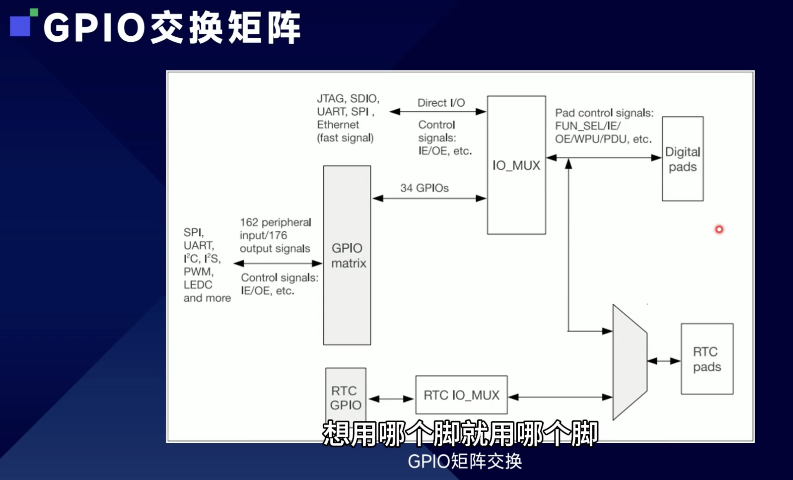
```c
#include <stdio.h>
#include "esp_log.h"
#include "driver/uart.h"
#include "driver/gpio.h"
#define TAG     "uart"

#define     USER_UART_NUM   UART_NUM_2
#define     UART_BUFFER_SIZE        1024

static uint8_t uart_buffer[1024];

static QueueHandle_t uart_queue;

static void uart_event_task(void *pvParameters)
{
    uart_event_t event;
    size_t buffered_size;
    while (1)
    {
        //等待UART事件
        if (xQueueReceive(uart_queue, (void *)&event, (TickType_t)portMAX_DELAY)) 
        {
            ESP_LOGI(TAG, "uart[%d] event:", USER_UART_NUM);
            switch (event.type) {
            case UART_DATA:
                ESP_LOGI(TAG, "[UART DATA]: %d", event.size);
                // 读取UART数据
                uart_read_bytes(USER_UART_NUM, uart_buffer, event.size, portMAX_DELAY);
                ESP_LOGI(TAG, "[DATA EVT]:");
                // 回写UART数据
                uart_write_bytes(USER_UART_NUM, uart_buffer, event.size);
                break;
            // 检测到硬件FIFO溢出事件
            case UART_FIFO_OVF:
                ESP_LOGI(TAG, "hw fifo overflow");
                // 清空UART输入缓冲区
                uart_flush_input(USER_UART_NUM);
                xQueueReset(uart_queue);
                break;
            // UART环形缓冲区满事件
            case UART_BUFFER_FULL:
                ESP_LOGI(TAG, "ring buffer full");
                // 如果发生缓冲区满，应考虑增加缓冲区大小
                // 示例中直接清空缓冲区以便读取更多数据
                uart_flush_input(USER_UART_NUM);
                xQueueReset(uart_queue);
                break;
            // 检测到UART RX中断事件
            case UART_BREAK:
                ESP_LOGI(TAG, "uart rx break");
                break;
            // UART奇偶校验错误事件
            case UART_PARITY_ERR:
                ESP_LOGI(TAG, "uart parity error");
                break;
            // UART帧错误事件
            case UART_FRAME_ERR:
                ESP_LOGI(TAG, "uart frame error");
                break;
            default:
                ESP_LOGI(TAG, "uart event type: %d", event.type);
                break;
            }
        }
    }
    vTaskDelete(NULL);
}

void app_main(void)
{
    uart_config_t uart_cfg={
        .baud_rate=115200,                          // 波特率115200
        .data_bits=UART_DATA_8_BITS,                // 8位数据位
        .flow_ctrl=UART_HW_FLOWCTRL_DISABLE,        // 无硬件流控制
        .parity=UART_PARITY_DISABLE,                // 无校验位
        .stop_bits=UART_STOP_BITS_1                 // 1位停止位
    };
    // 安装串口驱动
    uart_driver_install(USER_UART_NUM,1024,1024,20,&uart_queue,0);     
    // 配置串口参数
    uart_param_config(USER_UART_NUM,&uart_cfg);
    // 设置引脚，TX为32，RX为33
    uart_set_pin(USER_UART_NUM,GPIO_NUM_32,GPIO_NUM_33,UART_PIN_NO_CHANGE,UART_PIN_NO_CHANGE); 
    
    // 创建UART事件处理任务
    xTaskCreatePinnedToCore(uart_event_task,"uart",4096,NULL,3,NULL,1);
    #if 0
    while(1)
    {
        // 从UART读取数据
        int rec = uart_read_bytes(USER_UART_NUM,uart_buffer,sizeof(uart_buffer),pdMS_TO_TICKS(100));
        if(rec)
        {
            // 将读取的数据回写到UART
            uart_write_bytes(USER_UART_NUM,uart_buffer,rec);
        }
    }
    #endif
}


```
# ESP32中的分区表
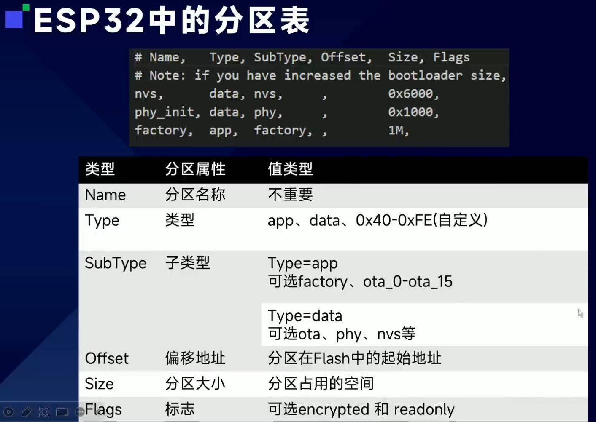  
#号后面是注释，不参与实际内容，大家主要看标出的那 5 列，列头分别是  
Name、Type、SubType、Offset、Size  
逐个分析  
Name: 表示分区名称（并不重要）  
Type：表示分区类型，可选值有 app、data，用户还可以自定义写 0x40-0xFE  
app 一般用于表示运行程序  
data 一般用于表示存储数据  
SubType：表示子类型，与类型有关，当 Type 定义为 app 时，SubType 字段可以指定  
为 factory (0x00)、 ota_0 (0x10) … ota_15 (0x1F) ；当 Type 定义为 data 时，SubType 字段可以指定为 ota (0x00)、phy (0x01)、nvs (0x02)、nvs_keys (0x04) 或者其他组件特定的子类型。  
Offset：表示在 Flash 中的偏移地址  
Size：表示分区总大小  
第三行 nvs  
nvs 表示非易失存储区，掉电之后数据依然保存。在 ESP32 中预留了一块 NVS 区域，专门用于存储如下内容  
1）用于存储每台设备的 PHY 校准数据（注意，并不是 PHY 初始化数据）。
2）用于存储 Wi-Fi 数据（如果使用了 `esp_wifi_set_storage(WIFI_STORAGE_FLASH)` 初始化函数）。  
3）其他应用程序数据。  
SubType=nvs，表示此分区专门用于 NVS 存储。
大家这里可能有个疑问，为什么 Offset 是空的？到底在 Flash 中的偏移地址是多少？可能在其他 esp-idf 版本中这里的 Offset 不是空的，但在 v5.2 版本中，这里的确是空的，大家浏览 esp-idf/components/partition_table/文件中中其他分区表文件，大部分 Offset 也是空的。
其实这里并非没有指定地址，在 esp-idf 中，还默认有个 bootloader 程序，这个程序在分区表中的地址是 0x1000，另外还有分区表本身也需要存储，分区表在 flash 中存储的地址是0x8000，大小是 0x1000，也就是除开 bootloader 和分区表本身，可用的地址是从 0x9000 开始的，也就是说，esp-idf 中 nvs 分区其实地址是从 0x9000 开始存储，然后 Size=0x6000。  
再看第四行 phy_init  
此分区子类型是 phy，表示用于分区用于存放 PHY 初始化数据，从而保证可以为每个设备单独配置 PHY，默认配置下，phy 分区并不启用，而是直接将 phy 初始化数据编译至应用程序中，从而节省分区表空间（直接将此分区删掉）而非必须采用固件中的统一 PHY初始化数据，我们在应用开发中一般用不到这个分区。这里 Offset 也是空的，因为如果我们留空，esp-idf 就会自动帮我们计算，在上一个分区Offset+Size 后，就会作为这个分区起始地址，本例中起始地址就是 0x9000+0x6000=0xF000，大小 Size = 0x1000  
再看第五行 factory  
此分区子类型是 factory，是默认的 app 分区，上电后程序会从这里启动，但如果存在Subtype=ota 的分区，bootloader 会检查 ota 分区里面的内容，再决定用哪个 app 分区里面的程 序 启 动 。 app 分 区 的 偏 移 地 址 必 须 与 0x10000 (64 KB) 对 齐 ， 本 例 中
Offset=0xF000+0x1000=0x10000，大小是 1M（esp-idf 中支持这种 1M、1K 的表示形式）  
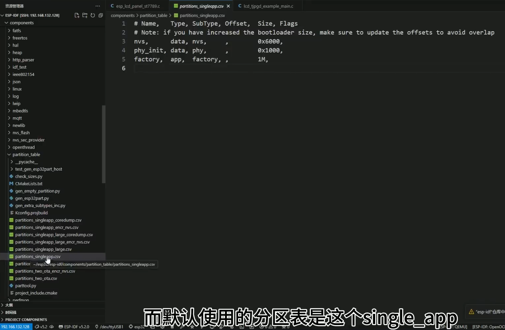  
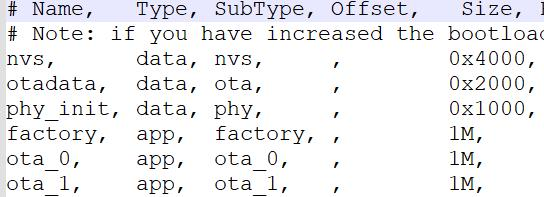  
路径：esp-idf/components/partition_table/partitions_two_ota.csv  
主要关注新增这几个  
otadata、ota_0、ota_1  
otadata，Subtype = ota,用于存储当前所选的 OTA 应用程序的信息。这个分区的大小需要设定为 0x2000
ota_0，Subtype=ota_0，为 OTA 应用程序分区，启动加载器将根据 OTA 数据分区中的数据来决定加载哪个 OTA 应用程序分区中的程序。在使用 OTA 功能时，应用程序应至少拥有 2 个 OTA 应用程序分区（ota_0 和 ota_1）ota_1，和 ota_0 分区一样。  
那么以上介绍的两个分区表，都是 esp-idf 中默认支持的，我们可以在 esp 工程中使用 idf.py menuconfig 配置命令调出配置菜单  
## 自定义分区
  
  
我们在 partitions_singleapp.csv 的基础上追加了一行我们自定义的分区类型 0x40，子类型是 0x01，因为我们指定了分区类型是自定义类型，所以子类型这里 esp 编译系统不会太关注这个值，我们只需要记得这个子类型是 0x01 即可,偏移 Offset 自动计算,大小 Size 为0x1000。接下来请看例程。  
具体例程源码位于 esp32-board/partition  
  
`esp_partition_find_first `从分区中找到我们自定义的分区，第一个参数是类型 0x40，第二个参数是子类型 0x01，返回值是分区指针，后续的操作都是基于这个指针进行。  
`esp_partition_erase_range` 擦除一段内容，第一个参数是分区指针，第二个参数是偏移地址，第三个参数是大小。偏移地址和擦除大小需 0x1000 对齐（4096 的整数倍）。  
`esp_partition_write` 写入数据，第一个参数是分区指针，第二个参数是偏移地址，第三个参数是写入数据，第四个参数是写入的数据内容，需要注意的是，写入之前，需要执行擦除，否则写入无效   
`esp_partition_read` 读取数据，参数与写入类似   
# NVS
NVS 即 Non-volatile storage，意思是非易失存储，也就是掉电后能依然能持久化保存数据。在嵌入式系统中，NVS 主要是在 flash 进行键值对的存储。但 NVS 操作更加轻量级。  
在 ESP32 中对于 NVS 的操作，还需要指定一个命名空间，是因为还考虑了一种情况，在各个不同的功能模块中，键名是有可能取到一样的，比如对于 wifi 模块，存在一个 password键名，对于管理员模块，可能也存在一个 password 键名，这样有可能就造成了重复，程序无法按我们的意思进行。如果我们增加了一个命名空间进行隔离，那么键名有重复也不怕，比如说在 wifi 模块中，我们指定一个命名空间”wifi”，在此命名空间下有 ssid 和 password 键名，在管理员模块，我们指定一个命名空间”manager”，在此命名空间下有 password 键名，这两组命名空间互不干扰。  
  
```c
// 打开一个 NVS 存储操作
esp_err_t nvs_open(const char *namespace_name, /*命名空间名称*/
                   nvs_open_mode_t open_mode, /* 打开的模式NVS_READONLY，只读
                                                 NVS_READWRITE 读写 */
                   nvs_handle_t *out_handle); /* 返回的 nvs 操作句柄*/

// 向 NVS 中读取字符串数据
esp_err_t nvs_get_str(nvs_handle_t handle, /*nvs 操作句柄*/
                      const char *key,     /*键名*/
                      char *out_value,     /*读取到的值*/
                      size_t *length)      /*读取到的字符串长度*/

    // 向 NVS 中读取二进制数据
    esp_err_t nvs_get_blob(nvs_handle_t handle, /*nvs 操作句柄*/
                           const char *key,     /*键名*/
                           void *out_value,     /*返回的值*/
                           size_t *length);     /*返回值的长度*/

// 向 NVS 中写入字符串数据(最大 4000 字节)
esp_err_t nvs_set_str(nvs_handle_t handle, /*nvs 操作句柄*/
                      const char *key,     /*键名*/
                      const char *value);  /*值*/

// 向 NVS 中写入二进制数据（最大值:NVS 分区大小*97.6%-4000）
esp_err_t nvs_set_blob(nvs_handle_t handle, /*nvs 操作句柄*/
                       const char *key,     /*键名*/
                       const void *value,   /*值*/
                       size_t length);      /*大小*/

// 擦除对应命名空间下所有的 nvs 值
esp_err_t nvs_erase_all(nvs_handle_t handle); /*nvs 操作句柄*/

// 在执行写操作后，为了确保写入到 NVS 区域中，需要调用此函数
esp_err_t nvs_commit(nvs_handle_t handle); /*nvs 操作句柄*/

// 关闭 NVS 操作句柄，释放资源
void nvs_close(nvs_handle_t handle); /*nvs 操作句柄*/
```
以上操作有几点注意：
1) 操作 NVS 的第一步就是调用 nvs_open，获取到 nvs 句柄后才能执行其他操作
2) 命名空间长度、key 长度，默认是 15 字节
3) 在执行写操作后，需要 nvs_commit，才能确保写入到了 nvs 区域
# WIFI-STA
```c
#include "esp_err.h"
#include "esp_event.h"
#include "esp_log.h"
#include "esp_wifi.h"
#include "nvs_flash.h"
#include "stdio.h"

#define DEFAULT_WIFI_SSID "wifitest"
#define DEFAULT_WIFI_PASSWORD "12345678"
static const char *TAG = "wifi";
/** 事件回调函数
 * @param arg 用户传递的参数
 * @param event_base 事件类别
 * @param event_id 事件 ID
 * @param event_data 事件携带的数据
 * @return 无
 */
static void event_handler(void *arg, esp_event_base_t event_base,
                          int32_t event_id, void *event_data) {
  if (event_base == WIFI_EVENT) {
    switch (event_id) {
    case WIFI_EVENT_STA_START: // WIFI 以 STA 模式启动后触发此事件
      esp_wifi_connect();      // 启动 WIFI 连接
      break;
    case WIFI_EVENT_STA_CONNECTED: // WIFI 连上路由器后，触发此事件
      ESP_LOGI(TAG, "connected to AP");
      break;
    case WIFI_EVENT_STA_DISCONNECTED: // WIFI 从路由器断开连接后触发此事件
      esp_wifi_connect();             // 继续重连
      ESP_LOGI(TAG, "connect to the AP fail,retry now");
      break;
    default:
      break;
    }
  }
  if (event_base == IP_EVENT) // IP 相关事件
  {
    switch (event_id) {
    case IP_EVENT_STA_GOT_IP: // 只有获取到路由器分配的 IP，才认为是连上了路由器
      ESP_LOGI(TAG, "get ip address");
      break;
    }
  }
}
// WIFI STA 初始化
esp_err_t wifi_sta_init(void) {
  ESP_ERROR_CHECK(esp_netif_init()); // 用于初始化 tcpip 协议栈
  ESP_ERROR_CHECK(esp_event_loop_create_default()); // 创建一个默认系统事件调度循环，之后可以注册回调函数来处理系统的一些事件
  esp_netif_create_default_wifi_sta();  // 使用默认配置创建 STA 对象
  // 初始化 WIFI
  wifi_init_config_t cfg = WIFI_INIT_CONFIG_DEFAULT();
  ESP_ERROR_CHECK(esp_wifi_init(&cfg));
  // 注册事件
  ESP_ERROR_CHECK(esp_event_handler_register(WIFI_EVENT, ESP_EVENT_ANY_ ID,
                                             &event_handler, NULL));
  ESP_ERROR_CHECK(esp_event_handler_register(IP_EVENT, IP_EVENT_STA_GOT _IP,
                                             &event_handler, NULL));
  // WIFI 配置
  wifi_config_t wifi_config = {
      .sta =
          {
              .ssid = DEFAULT_WIFI_SSID,                // WIFI 的 SSID
              .password = DEFAULT_WIFI_PASSWORD,        // WIFI 密码
              .threshold.authmode = WIFI_AUTH_WPA2_PSK, // 加密方式
              .pmf_cfg = {.capable = true, .required = false},
          },
  };
  // 启动 WIFI
  ESP_ERROR_CHECK(esp_wifi_set_mode(WIFI_MODE_STA)); // 设置工作模式为STA
  ESP_ERROR_CHECK(esp_wifi_set_config(WIFI_IF_STA,
                                      &wifi_config)); // 设置 wifi 配置
  ESP_ERROR_CHECK(esp_wifi_start());                  // 启动WIFI 
  ESP_LOGI(TAG, "wifi_init_sta finished.");
  return ESP_OK;
}
void app_main(void) {
  // NVS 初始化（WIFI 底层驱动有用到 NVS，所以这里要初始化）
  nvs_flash_init();
  // wifi STA 工作模式初始化
  wifi_sta_init();
  while (1) {
    vTaskDelay(pdMS_TO_TICKS(500));
  }
}
```
上述这部分是标准的 WiFi 底层初始化代码，包含网卡初始化、创建事件循环系统、STA默认配置、WIFI 默认配置，这部分代码不用去动它，这些代码涉及到底层的初始化，感兴趣的同学可以看看 WIFI_INIT_CONFIG_DEFAULT()这个默认配置到底配置了什么。然 后 调 用 esp_event_handler_register 函 数 ， 注 册 回 调 函 数 处 理 各 种 WIFI 事 件（WIFI_EVENT）的以及 IP 事件（IP_EVENT）。ESP_EVENT_ANY_ID 参数表示任何的 WIFI 事件都执行回调函数，IP_EVENT_STA_GOT_IP 表示获取到 IP 地址才会执行回调函数。wifi_config_t wifi_config 定义了 WiFi 连接配置，这个配置里面我们填入了要连接的 SSID和密码，还有加密方式，目前大部分路由器都支持 WPA2-PSK 方式，pmf_cfg 这个成员表示对 WiFi 保护管理帧的配置，.capable 成员不推荐使用，设置为 true 即可，表示 ESP32 一直使用保护管理帧(pmf)方式连接，.required 表示是否只与支持保护管理帧(pmf)的设备进行连接。如果大家不知道这里是什么意思，按我这里设定就行，esp-idf 官方例程也是如此。esp_wifi_set_mode(WIFI_MODE_STA)表示 WiFi 工作在 STA 模式esp_wifi_set_config(WIFI_IF_STA, &wifi_config)表示将设置 WiFi 连接配置esp_wifi_start()表示启动 wifi在启动 WiFi 后，WiFi 驱动程序就会用配置的 SSID 和密码去尝试连接路由器，如果连接成功会触发 WiFi 事件 WIFI_EVENT_STA_CONNECTED，我们在回调函数中可以将这个事件打印出来，但这个事件不代表可以连接网络，仅仅表示已经连接了AP 热点，只有我们获取到了 IP 事件 IP_EVENT_STA_GOT_IP，这个事件是路由器给 ESP32 分配了地址，到这才认为是已经连接到了网络，当然这个也是要求你的路由器能连接互联网。
# SmartConfig 配网
## 原理：
首先要让 WiFi 芯片处于混杂模式下,监听网络中的所有报文;手机 APP 将 SSID 和密码编
码到 UDP 报文中,通过广播包或组播报发送,智能硬件接收到 UDP 报文后解码,得到正确的
SSID 和密码,然后主动连接指定 SSID 的路由完成连接      
  
  
>上述是数据传输的基本原理，但由于每一家厂商的算法常量、传输内容格式、前导码等都不一样，因此不同厂家之间的 SmartConfig 一般无法通用  


  
由于在实际应用工程中，进入 SmartConfig 一般都是长按某个按键，因此这个例程中也把之前按键短按长按处理的例程搬过来用了，长按 3 秒触发 SmartConfig。
app_main()中注册了长按按键事件，主循环中检测到了长按事件，执行 smartconfig_start
函数，启动 SmartConfig。
```c
#include "esp_smartconfig.h"

// 按键事件组
static EventGroupHandle_t s_pressEvent;
#define SHORT_EV BIT0 // 短按
#define LONG_EV BIT1  // 长按
#define BTN_GPIO GPIO_NUM_39
/** 长按按键回调函数
 * @param 无
 * @return 无
 */
void long_press_handle(void) { xEventGroupSetBits(s_pressEvent, LONG_EV); }
void app_main(void) {
  nvs_flash_init();  // 初始化 NVS
  initialise_wifi(); // 初始化 wifi
  s_pressEvent = xEventGroupCreate();
  button_config_t btn_cfg = {
      .gpio_num = BTN_GPIO,        // gpio 号
      .active_level = 0,           // 按下的电平
      .long_press_time = 3000,     // 长按时间
      .short_cb = NULL,            // 短按回调函数
      .long_cb = smartconfig_start // 长按回调函数
  };
  button_event_set(&btn_cfg); // 添加按键响应事件处理
  EventBits_t ev;
  while (1) {
    ev = xEventGroupWaitBits(s_pressEvent, LONG_EV, pdTRUE, pdFALSE,
                             portMAX_DELAY);
    if (ev & LONG_EV) {
      smartconfig_start(); // 检测到长按事件，启动 smartconfig
    }
  }
}
```
接下来看下 main/wifi_smartconfig.c 文件对 SmartConfig 的处理
```c
void smartconfig_start(void) {
  if (!s_is_smartconfig) {
    s_is_smartconfig = true;
    esp_wifi_disconnect();
    xTaskCreate(smartconfig_example_task, "smartconfig_example_task", 4096,
                NULL, 3, NULL);
  }
}
```
smartconfig_start 函 数 里 面 ， 会 断 开 wifi 连 接 然 后 启 用 一 个 smartconfig 任 务 ，
s_is_smartconfig 标志是 SmartConfig 运行标志，防止重复执行 SmartConfig。
```c
static void smartconfig_example_task(void *parm) {
  EventBits_t uxBits;
  ESP_ERROR_CHECK(esp_smartconfig_set_type(SC_TYPE_ESPTOUCH_V2));
  // 设定 SmartConfig 版本
  smartconfig_start_config_t cfg = SMARTCONFIG_START_CONFIG_DEFAULT();
  ESP_ERROR_CHECK(esp_smartconfig_start(&cfg)); // 启动 SmartConfig
  while (1) {
    uxBits = xEventGroupWaitBits(s_wifi_event_group,
                                 CONNECTED_BIT | ESPTOUCH_DONE_BIT, true, false,
                                 portMAX_DELAY);
    if (uxBits & CONNECTED_BIT) {
      ESP_LOGI(TAG, "WiFi Connected to ap");
    }
    if (uxBits & ESPTOUCH_DONE_BIT) { // 收到 smartconfig 配网完成通知
      ESP_LOGI(TAG, "smartconfig over");
      esp_smartconfig_stop();               // 停止 smartconfig 配网
      write_nvs_ssid(s_ssid_value);         // 将 ssid 写入 NVS
      write_nvs_password(s_password_value); // 将 password 写入 NVS
      s_is_smartconfig = false;
      vTaskDelete(NULL); // 退出任务
    }
  }
}
```
在 smartconfig_example_task 中会设定 SmartConfig 的版本，可以选 V1、V2、AirKiss（微
信用的），版本之间不兼容，我这边选用了 V2，然后 esp_smartconfig_start(&cfg)启动
SmartConfig，后面会监听两个事件，一个是 WiFi 连接成功事件，一个是 SmartConfig 完成事
件，当 SmartConfig 完成后，我们把 SSID 和密码保存到 NVS 中，然后退出任务，结束整个
SmartConfig 流程。
```c
static void event_handler(void *arg, esp_event_base_t event_base,
                          int32_t event_id, void *event_data) {
  if (event_base == WIFI_EVENT && event_id == WIFI_EVENT_STA_START) {
    if (s_ssid_value[0] != 0)
      esp_wifi_connect();
  } else if (event_base == WIFI_EVENT &&
             event_id == WIFI_EVENT_STA_DISCONNECTED) {
    // WIFI 断开连接后，再次发起连接
    if (!s_is_smartconfig)
      esp_wifi_connect();
    // 清除连接标志位
    xEventGroupClearBits(s_wifi_event_group, CONNECTED_BIT);
  } else if (event_base == IP_EVENT && event_id == IP_EVENT_STA_GOT_IP) {
    // 获取到 IP，置位连接事件标志位
    xEventGroupSetBits(s_wifi_event_group, CONNECTED_BIT);
  } else if (event_base == SC_EVENT && event_id == SC_EVENT_SCAN_DONE) {
    // smartconfig 扫描完成
    ESP_LOGI(TAG, "Scan done");
  } else if (event_base == SC_EVENT && event_id == SC_EVENT_FOUND_CHANNEL) {
    // smartconfig 找到对应的通道
    ESP_LOGI(TAG, "Found channel");
  } else if (event_base == SC_EVENT && event_id == SC_EVENT_GOT_SSID_PSWD) {
    // smartconfig 获取到 SSID 和密码
    ESP_LOGI(TAG, "Got SSID and password");
    smartconfig_event_got_ssid_pswd_t *evt =
        (smartconfig_event_got_ssid_pswd_t *)event_data;
    wifi_config_t wifi_config;
    uint8_t ssid[33] = {0};
    uint8_t password[65] = {0};
    // 从 event_data 中提取 SSID 和密码
    bzero(&wifi_config, sizeof(wifi_config_t));
    memcpy(wifi_config.sta.ssid, evt->ssid, sizeof(wifi_config.sta.ssid));
    memcpy(wifi_config.sta.password, evt->password,
           sizeof(wifi_config.sta.password));
    wifi_config.sta.bssid_set = evt->bssid_set;
    if (wifi_config.sta.bssid_set == true) {
      memcpy(wifi_config.sta.bssid, evt->bssid, sizeof(wifi_config.sta.bssid));
    }
    memcpy(ssid, evt->ssid, sizeof(evt->ssid));
    memcpy(password, evt->password, sizeof(evt->password));
    ESP_LOGI(TAG, "SSID:%s", ssid);
    ESP_LOGI(TAG, "PASSWORD:%s", password);
    snprintf(s_ssid_value, 33, "%s", (char *)ssid);
    snprintf(s_password_value, 65, "%s", (char *)password);
    // 重新连接 WIFI
    ESP_ERROR_CHECK(esp_wifi_disconnect());
    ESP_ERROR_CHECK(esp_wifi_set_config(WIFI_IF_STA, &wifi_config));
    esp_wifi_connect();
  } else if (event_base == SC_EVENT && event_id == SC_EVENT_SEND_ACK_DONE) {
    // smartconfig 已发起回应
    xEventGroupSetBits(s_wifi_event_group, ESPTOUCH_DONE_BIT);
  }
}
```
在 事 件 处 理 回 调 函 数 中 ， 包 含 了 对 SmartConfig 的 处 理 ， 比 较 关 键 的 是
SC_EVENT_GOT_SSID_PSWD 和 SC_EVENT_SEND_ACK_DONE 事件，SC_EVENT_GOT_SSID_PSWD
事件表示已经获取到 SSID 和密码了，接下来我们可以发起连接。SC_EVENT_SEND_ACK_DON
事件表示 SmartConfig 完成，配网可以结束了，通知 SmartConfig 任务退出。
由此可见，esp-idf 对 SmartConfig 功能进行了高度封装，我们基本不用做复杂的处理就
可以使用，十分方便，完整的代码请看 esp32-board/wifi_smartconfig，idf.py build+idf.py flash
烧录到开发板后，就可以运行。另外大家可以看下官方的 demo APP

# 蓝牙配网 
  
使用ESP_BLE_Prov.apk软件配网  
  
  
参考代码：
https://github.com/espressif/esp-idf/blob/master/examples/provisioning/wifi_prov_mgr/main/app_main.c  

app_main函数:  
```c
#include "wifi_provisioning/manager.h"
#include "wifi_provisioning/scheme_ble.h"
void app_main(void)
{
    nvs_flash_init();
    esp_event_loop_create_default();
    esp_netif_init();
    esp_netif_create_default_wifi_sta();

    wifi_init_config_t wifi_init_config = WIFI_INIT_CONFIG_DEFAULT();
    esp_wifi_init(&wifi_init_config);

    esp_event_handler_register(WIFI_EVENT, ESP_EVENT_ANY_ID, esp_event_cb, NULL);
    esp_event_handler_register(IP_EVENT, IP_EVENT_ETH_GOT_IP, esp_event_cb, NULL);
    esp_event_handler_register(WIFI_PROV_EVENT, ESP_EVENT_ANY_ID, esp_event_cb, NULL);
    esp_event_handler_register(PROTOCOMM_TRANSPORT_BLE_EVENT, ESP_EVENT_ANY_ID, esp_event_cb, NULL);
    esp_event_handler_register(PROTOCOMM_SECURITY_SESSION_EVENT, ESP_EVENT_ANY_ID,esp_event_cb, NULL);

    wifi_prov_mgr_config_t config = {
        .scheme = wifi_prov_scheme_ble,
        .scheme_event_handler = WIFI_PROV_SCHEME_BLE_EVENT_HANDLER_FREE_BTDM,
    };
    wifi_prov_mgr_init(config);

    const char *pop = "123456";

    wifi_prov_security1_params_t *wifi_prov_sec_params = pop;
    
    // wifi_prov_mgr_start_provisioning(WIFI_PROV_SECURITY_0,  (void*)wifi_prov_sec_params,"PROV_HaHa", NULL);
    wifi_prov_mgr_start_provisioning(WIFI_PROV_SECURITY_0,  NULL,"PROV_HaHa", NULL);
    while (1)
    {
        vTaskDelay(1000 / portTICK_PERIOD_MS);
    }
    

}
```

自定义分区表，可以参考这个官网文档，https://docs.espressif.com/projects/esp-idf/zh_CN/release-v5.3/esp32c3/api-guides/partition-tables.html  

## 重置配网
  
  
修改配网
调用`wifi_prov_mgr_reset_provisioning`  
`wifi_prov_mgr_reset_sm_state_on_failure()`  
nvs_flash_erase() 是 ESP-IDF 提供的一个函数，用于擦除 NVS（非易失性存储）分区中的所有数据。它的作用是将 NVS 分区恢复到未使用的状态，所有存储的数据都会被清除  

wifi_prov_mgr_deinit() 是 ESP-IDF 中用于解除 Wi-Fi 配网管理器（Wi-Fi Provisioning Manager）的初始化的函数。当设备不再需要 Wi-Fi 配网功能时，可以调用该函数来释放资源并清理配网管理器的状态。  

esp_err_t wifi_prov_mgr_reset_provisioning（void)  
重置 Wi-Fi 配置。    
调用此 API 会将 WiFi 堆栈持久设置恢复为默认值。  
返回  
ESP_OK ： 已成功重置 Provisioning 配置  
ESP_FAIL ： 无法重置 Provisioning 配置  
## BluFi


# MQTT协议


## 连接MQTT服务器
mqtt 连接之前，需要 WiFi 连接成功，因此需要 WIFI——STA 章节的代码，我在 WIFI—
—STA 章节代码上做了一些改善，增加了一个回调函数通知主函数 WiFi 已连接。  
  
请看 IP_EVENT_STA_GOT_IP 事件处理，会执行 wifi_cb 函数通知 WIFI_CONNECTED 事件。  
接下来请看 main.c 文件实现  
```c
#define MQTT_ADDRESS "mqtt://broker-cn.emqx.io" // MQTT 连接地址
#define MQTT_PORT 1883                          // MQTT 连接端口号
#define MQTT_CLIENT "mqttx_d11213" // Client ID（设备唯一，大家最好自行改一下）
#define MQTT_USERNAME "hello"               // MQTT 用户名
#define MQTT_PASSWORD "12345678"            // MQTT 密码
#define MQTT_PUBLIC_TOPIC "/test/topic1"    // 测试用的,推送消息主题
#define MQTT_SUBSCRIBE_TOPIC "/test/topic2" // 测试用的,需要订阅的主题
// 定义一个事件组，用于通知 main 函数 WIFI 连接成功
#define WIFI_CONNECT_BIT BIT0
static EventGroupHandle_t s_wifi_ev = NULL;
// MQTT 客户端操作句柄
static esp_mqtt_client_handle_t s_mqtt_client = NULL;
// MQTT 连接标志
static bool s_is_mqtt_connected = false;
/**
 * mqtt 连接事件处理函数
 * @param event 事件参数
 * @return 无
 */
static void aliot_mqtt_event_handler(void *event_handler_arg,
                                     esp_event_base_t event_base,
                                     int32_t event_id, void *event_data) {
  esp_mqtt_event_handle_t event = event_data;
  esp_mqtt_client_handle_t client = event->client;
  // your_context_t *context = event->context;
  switch ((esp_mqtt_event_id_t)event_id) {
  case MQTT_EVENT_CONNECTED: // 连接成功
    ESP_LOGI(TAG, "mqtt connected");
    s_is_mqtt_connected = true;
    // 连接成功后，订阅测试主题
    esp_mqtt_client_subscribe_single(s_mqtt_client, MQTT_SUBSCRIB E_TOPIC, 1);
    break;
  case MQTT_EVENT_DISCONNECTED: // 连接断开
    ESP_LOGI(TAG, "mqtt disconnected");
    s_is_mqtt_connected = false;
    break;
  case MQTT_EVENT_SUBSCRIBED: // 收到订阅消息 ACK
    ESP_LOGI(TAG, " mqtt subscribed ack, msg_id=%d", event->msg_id);
    break;
  case MQTT_EVENT_UNSUBSCRIBED: // 收到解订阅消息 ACK
    break;
  case MQTT_EVENT_PUBLISHED: // 收到发布消息 ACK
    ESP_LOGI(TAG, "mqtt publish ack, msg_id=%d", event->msg_id);
    break;
  case MQTT_EVENT_DATA:
    printf("TOPIC=%.*s\r\n", event->topic_len,
           event->topic); // 收到 Pub 消息直接打印出来
    printf("DATA=%.*s\r\n", event->data_len, event->data);
    break;
  case MQTT_EVENT_ERROR:
    ESP_LOGI(TAG, "MQTT_EVENT_ERROR");
    break;
  default:
    break;
  }
}
/** 启动 mqtt 连接
 * @param 无
 * @return 无
 */
void mqtt_start(void) {
  esp_mqtt_client_config_t mqtt_cfg = {0};
  mqtt_cfg.broker.address.uri = MQTT_ADDRESS;
  mqtt_cfg.broker.address.port = MQTT_PORT;
  // Client ID
  mqtt_cfg.credentials.client_id = MQTT_CLIENT;
  // 用户名
  mqtt_cfg.credentials.username = MQTT_USERNAME;
  // 密码
  mqtt_cfg.credentials.authentication.password = MQTT_PASSWORD;
  ESP_LOGI(TAG, "mqtt
                connect->clientId
           : % s, username
           : % s, password
           : % s ",mqtt_cfg.credentials.clie
                 nt_id,
             mqtt_cfg.credentials.username,
             mqtt_cfg.credentials.authentication.pa ssword);
  // 设置 mqtt 配置，返回 mqtt 操作句柄
  s_mqtt_client = esp_mqtt_client_init(&mqtt_cfg);
  // 注册 mqtt 事件回调函数
  esp_mqtt_client_register_event(s_mqtt_client, ESP_EVENT_ANY_ID,
                                 aliot_mqtt_event_handler, s_mqtt_client);
  // 启动 mqtt 连接
  esp_mqtt_client_start(s_mqtt_client);
}
/** wifi 事件通知
 * @param 无
 * @return 无
 */
void wifi_event_handler(WIFI_EV_e ev) {
  if (ev == WIFI_CONNECTED) {
    xEventGroupSetBits(s_wifi_ev, WIFI_CONNECT_BIT);
  }
}
void app_main(void) {
  esp_err_t ret = nvs_flash_init();
  if (ret == ESP_ERR_NVS_NO_FREE_PAGES ||
      ret == ESP_ERR_NVS_NEW_VERSION_FOUND) {
    // NVS 出现错误，执行擦除
    ESP_ERROR_CHECK(nvs_flash_erase());
    // 重新尝试初始化
    ESP_ERROR_CHECK(nvs_flash_init());
  }
  s_wifi_ev = xEventGroupCreate();
  EventBits_t ev = 0;
  // 初始化 WIFI，传入回调函数，用于通知连接成功事件
  wifi_sta_init(wifi_event_handler);
  // 一直监听 WIFI 连接事件，直到 WiFi 连接成功后，才启动 MQTT 连接
  ev = xEventGroupWaitBits(s_wifi_ev, WIFI_CONNECT_BIT, pdTRUE, pdFALSE,
                           portMAX_D ELAY);
  if (ev & WIFI_CONNECT_BIT) {
    mqtt_start();
  }
  static char mqtt_pub_buff[64];
  while (1) {
    int count = 0;
    // 延时 2 秒发布一条消息到/test/topic1 主题
    if (s_is_mqtt_connected) {
      snprintf(mqtt_pub_buff, 64, "{\"count\":\"%d\"}", count);
      esp_mqtt_client_publish(s_mqtt_client, MQTT_PUBLIC_TOPIC, mqtt_pub_buff,
                              strlen(mqtt_pub_buff), 1, 0);
      count++;
    }
    vTaskDelay(pdMS_TO_TICKS(2000));
  }
  return;
}
```

# HTTP
  


# Json
ESP-IDF 自带cJSON组件，在头文件中include "cJSON.h"即可使用。
  

## 生成JSON

    cJSON* js_root = cJSON_CreateObject();  

字符串  

    cJSON_AddStringToObject(js_root, "id", "123456");  

对象和数字 

    cJSON* value_js = cJSON_CreateObject();  
    cJSON_AddNumberToObject(value_js, "time", 1234567890);  
    cJSON_AddItemToObject(js_root, "value", value_js);  


数组

    cJSON* arr_js = cJSON_CreateArray();  
    cJSON_AddItemToArray(arr_js, cJSON_CreateNumber(1));  
    cJSON_AddItemToArray(arr_js, cJSON_CreateNumber(2));  
    cJSON_AddItemToArray(arr_js, cJSON_CreateNumber(3));  
    cJSON_AddItemToObject(js_root, "arr", arr_js);  

    输出
    char* js_str = cJSON_PrintUnformatted(js_root);  
    //char* js_str = cJSON_Print(js_root);  //清晰，但字节数长
    ESP_LOGI(TAG, "js:\r\n: %s", js_str);  
    cJSON_free(js_str); //释放内存
    cJSON_Delete(js_root); //释放内存
## 解析JSON

    cJSON* js_root = cJSON_Parse(json_str);  

字符串  

    cJSON* id_js = cJSON_GetObjectItem(js_root, "id");  
    ESP_LOGI(TAG, "id: %s", cJSON_GetStringValue(id_js));  

对象和数字  

    cJSON* value_js = cJSON_GetObjectItem(js_root, "value");  
    cJSON* time_js = cJSON_GetObjectItem(value_js, "time");  
    ESP_LOGI(TAG, "time: %.1lf", cJSON_GetNumberValue(time_js));

数组

    cJSON* arr_js = cJSON_GetObjectItem(js_root, "arr");  
    cJSON* sub_js =array_js->child;  
    int num = 0;  
    while(sub_js) {  
        ESP_LOGI(TAG, "arr[%d]: %d", num, cJSON_GetNumberValue(sub_js));  
        sub_js = sub_js->next;  
        num++;  
    }  
    cJSON_Delete(js_root); //释放内存
# BLE
## BLE基础——BLE和GATT介绍
  
  
  
  
  
  
  
UUID表查询  
http://www.corenchip.com/2280.html
## BLE基础——BLE连接和广播
  
  
  
  
## 代码
不同芯片SDK之间，蓝牙这部分代码是几乎完全不一样的，没有移植的可能。  
参考蓝牙模板`esp-idf/example`  
  
  
1. 初始化NVS
2. 初始化BLE
3. 创建自己的任务

下面两个回调函数，当发生数据读写或者有设备连接成功时就会触发GATT回调函数。
当有广播启动成功，或者说停止广播成功，或者说修改了连接参数等等，就会触发这个gap回调函数。

    ESP_ERROR_CHECK(esp_ble_gatts_register_callback(gatts profile event_handler));
    ESP_ERROR_CHECK(esp_ble_gap_register_callback(gap_event_handler));


设置MTU，MTU是单次蓝牙传输的数据包长度，4.2之前最大只能是20，4.2之后可以到520  

  

如果要设置两个服务，是不能直接复制一份在gatt描述表函数里面。用服务ID注册一个attr表，每张表对应一个服务。   

注册attr表成功之后，触发一个事件，将ATT表中的这个句柄保存下来，保存进一个数组。接着使用`esp_ble_gatts_start_service`启动这个服务。两个服务函数。  

蓝牙固定mac地址需要购买  
## 基于ble_basic修改自己的代码 
1. 修改gatt描述表`esp_gatts_attr_db_t`  
特征声明的权限  
特征值的权限  
2. 想要增加一个特征 
增加枚举（GATT表的结构体数组）  
  
增加特征  
  
增加特征值数组  
    
3. 修改收到客户端读取事件  
  
4. 修改收到客户端写入事件  
  
  
5. 编写自己的应用函数  
使用`ble_set_ch1_value`函数发送  
  


# RainMaker
RainMaker 可以调 API 重新配网：esp_rmaker_wifi_reset

你可以参考 ESP RainMaker 自带的 4M 分区表：
```c
esp_secure_cert, 0x3F, , 0xD000, 0x2000, encrypted
nvs_key, data, nvs_keys, 0xF000, 0x1000, encrypted
nvs, data, nvs, 0x10000, 0x6000,
otadata, data, ota, , 0x2000
phy_init, data, phy, , 0x1000,
ota_0, app, ota_0, 0x20000, 0x1E0000,
ota_1, app, ota_1, 0x200000, 0x1E0000,
reserved, 0x06, , 0x3E0000, 0x1A000,
fctry, data, nvs, 0x3FA000, 0x6000
```
## 板子是ESP32-wroom-32E 4M，报错“region `iram0_0_seg' overflowed by 5632 bytes”
在SDKCONFIG里面修改“CONFIG_FREERTOS_PLACE_FUNCTIONS_INTO_FLASH=y”，ESP32没有IRAM的链路C6也得要改SDKCONFIG

通过 menuconfig 配置需要保存才能生效。如果你是在 sdkconfig.defaults 配置的，在已经生成sdkconfig 的情况下是不会生效的

## 死在了连接APP的第四步Confirming Node association log报错：***ERROR*** A stack overflow in task rmaker_queue_task has been detected.

 栈溢出了，把 ESP_RMAKER_WORK_QUEUE_TASK_STACK 调大一点就好了

创建按钮时还需要为这个 Device 注册回调函数：esp_rmaker_device_add_cb(temp_sensor_device, write_cb, NULL);
## 缝纫式编程
  
  

event_handler 是事件处理器，用于定义在HTTP请求期间处理不同事件的回调函数  
  
使用user data 字段将 local_response_buffer 地址传给 HTTP客户端,在执行HTTP请求时，可以将响应数据写入到这个地址中。 请求完成之后可使用local_response_buffer 读取响应数据。  

json部分  
  
添加组件
  

  
这里使用信号量进行两个任务之间同步  
一个用于同步天气数据  
一个用于等待LED任务使用完最新的天气数据   

1. 声明  
2. 在main中创建二进制信号量  
3. 在HTTP任务解析完JSON数据之后，传递信号量  
4. 在led中接收信号量  
5. 读取完天气内容后传递信号量给HTTP任务  
6. 在HTTP任务中接收信号量，等待接受信号量收到后跳出循环释放JSOON数据  
添加RainMaker组件  
  
  

  

  

  

  

除了之前一样使用IDF组件管理器还可以手动为项目配置组件，在顶层路径中创建components文件夹  

  
  


  
手动设置密钥，不需要申请内存，删掉。  
  
  

  
  
  

  
  
  
  

如果检查到控制LED颜色的参数  
  
  

HUE原理 每60为一个色彩分成6种色彩  
  
APP按键  
  
  
在回调函数中，如果参数是按键的名字，就根据返回的布尔值改变weather get 的值  
  
  

  
手动调大  
  

  
使能BLE 4.2用于蓝牙配网  
# esptool工具来烧写固件
```
pip install esptool 
//刷除Flash
esptool.py --port /dev/tty.SLAB_USBtoUART erase_flash 
//烧写固件
esptool.py --chip esp32c3 --port COM3 erase_flash 
esptool.py --chip esp32c3 --port COM3 write_flash -z 0x000 esp32c3-rtos.bin
```
## 指定MAC地址
有三种方式：
1. 使用 AT 固件和 AT 指令更改 MAC 地址
2. 通过 esptool 终端命令修改 EFUSE BLOCK3 中的 MAC 地址，然后在软件调用 esp_efuse_mac_get_custom(uint8_t *mac) 设置 MAC 地址
3. 通过 API 直接更改 MAC 地址
详细步骤可以看这个：https://blog.csdn.net/Marchtwentytwo/article/details/117555657

## esptool读取固件
如果没有进行固件加密的话可以参考这个文档的操作导出固件：  
https://docs.espressif.com/projects/esptool/en/latest/esp32/esptool/basic-commands.html#read-flash-contents-read-flash  
`pip install esptool==3.3.2`  
`esptool --chip esp32c3 read_flash 0x0 0x400000 Output.bin`  
不行再升级重试  
`pip install --upgrade esptool`  
# 问题汇总
1. 头文件爆红但是编译能够通过，怎么去除爆红？
实测用这个更方便  
可以按下ctrl+shift+p弹出搜索框，输入Add vscode configuration folder，点一下即可  
  
（下面为立创推荐设置）  
打开ESP-IDF扩展的配置。  
  
   @ext:espressif.esp-idf-extension path  
找到 Esp Adf Path 和 Esp Idf Path Win。将 Esp Adf Path的路径改为 Esp Idf Path Win 的路径。  
  
  

2. 文件移动之后无法编译
修改settings.json里的路径，修改为自己成功编译的工程里的路径

3. 关闭看门狗
写的代码，经常触发看门狗。  
  
通过以下代码将其关闭。  
  
```c
#include "esp_task_wdt.h"
...
int app_main(void)
{
    //关闭看门狗
    esp_task_wdt_deinit();
    ...
}
```