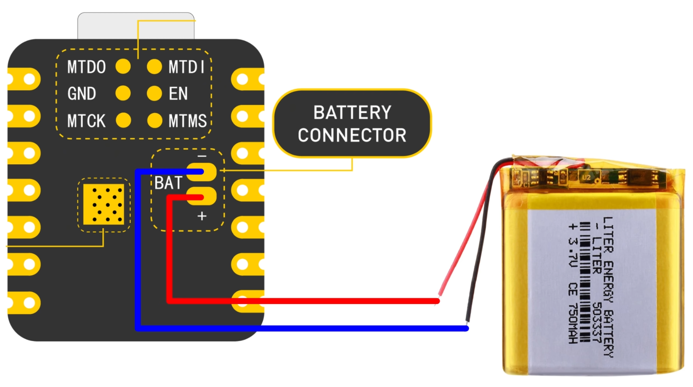
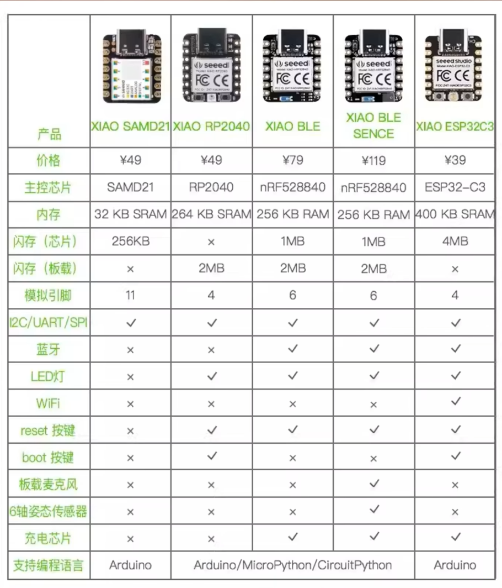
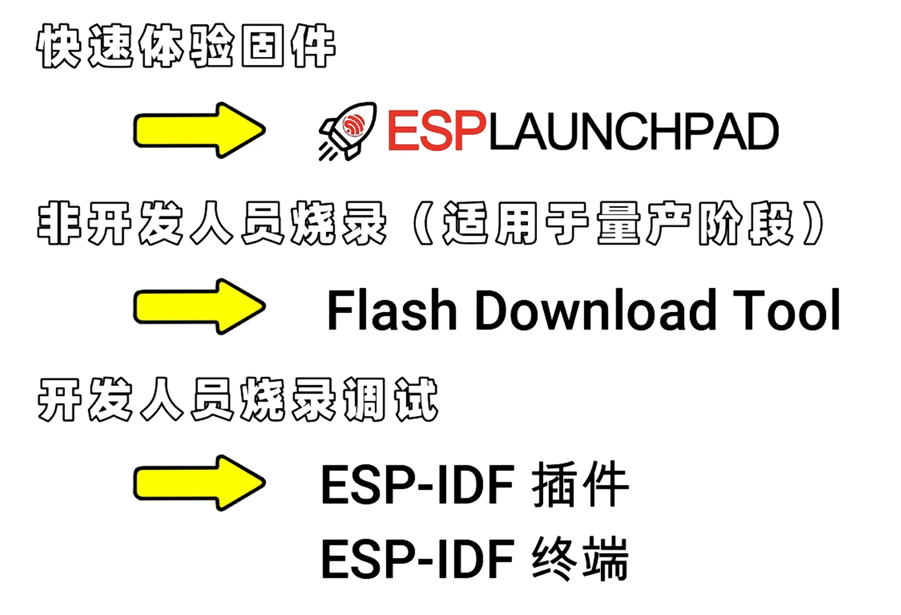
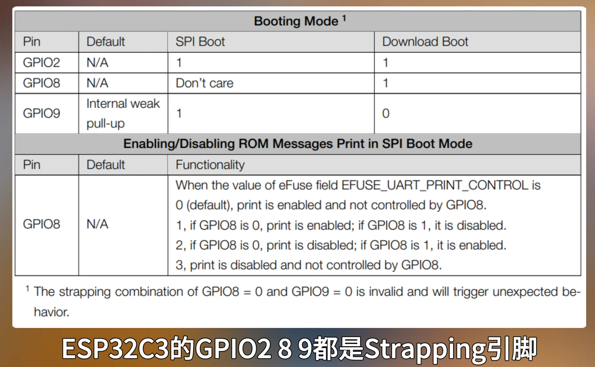
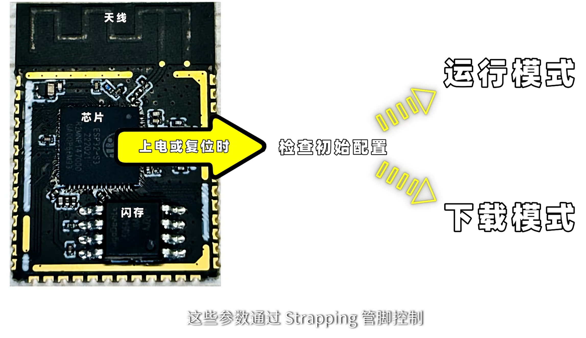
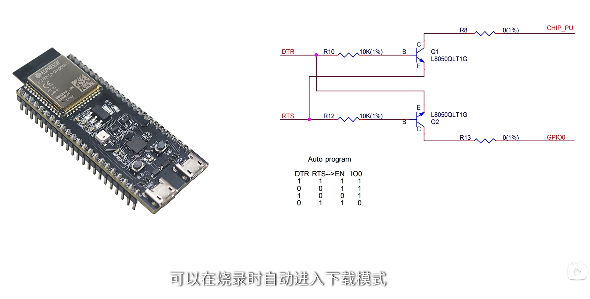
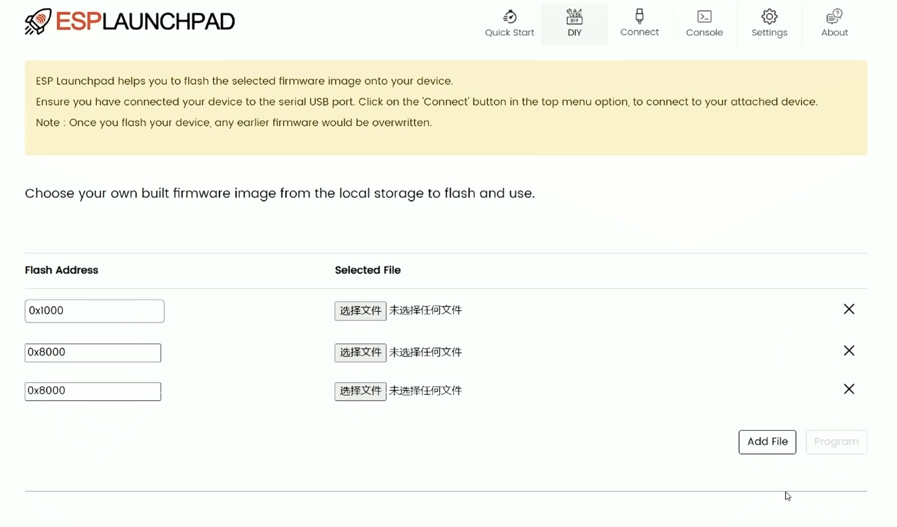
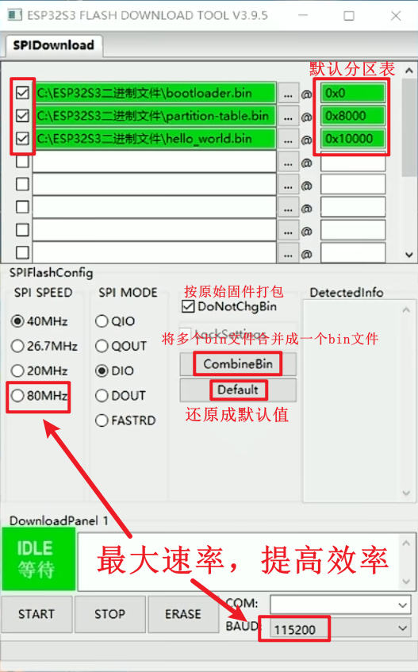

# ESP芯片选型

带锂电池管理芯片  
片上400KB SRAM 板载4MB Flash

# 烧录
  
ESP Friends 固件烧录文档：https://docs.espressif.com/projects/esp-techpedia/zh_CN/latest/esp-friends/get-started/try-firmware/index.html  
查看偏移地址：https://docs.espressif.com/projects/esp-idf/zh_CN/latest/esp32/api-guides/startup.html  
网页烧录：https://espressif.github.io/esp-launchpad/  

Strapping引脚：用于配置芯片启动模式，如启动模式选择、时钟源选择等。
用到这些引脚可能会影响到开发板重启，开发板程序的上传。
USB烧录一般不用进入下载模式，除非一直处于不断复位的情况，需要进入下载模式来进行USB烧录。  
  
自动下载电路，无需进入下载模式  
  
 
  
 ESP LAUNCHPAD 固件快速烧录还可以上传自己的固件。  

bootloader偏移地址固定是0x0，分区表的偏移地址默认是0x8000，可以在menuconfig中修改`PARTITION_TABLE_OFFSET`。  
应用程序的偏移地址默认是0x10000，可以在menuconfig中修改`APP_OFFSET`。工程编译结果中也可以看到对应的偏移地址。  
##  Flash Download Tool 烧录
ESP系列芯片通过SPI与Flash进行通讯。  
  
CombineBins可以将多个bin文件合并成一个bin文件，保存在combine文件中。  
如果勾选DoNotChgBin则会按照原始固件打包。固件之间的非数据区会以0xff进行填充。  
