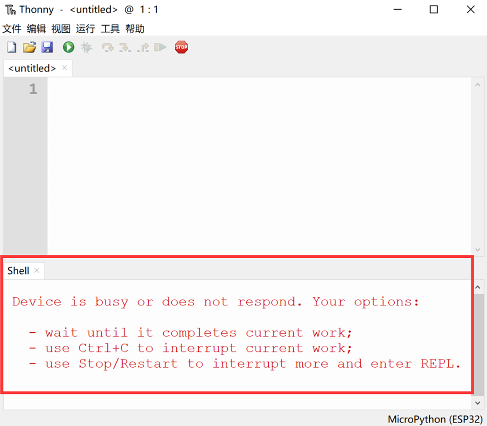
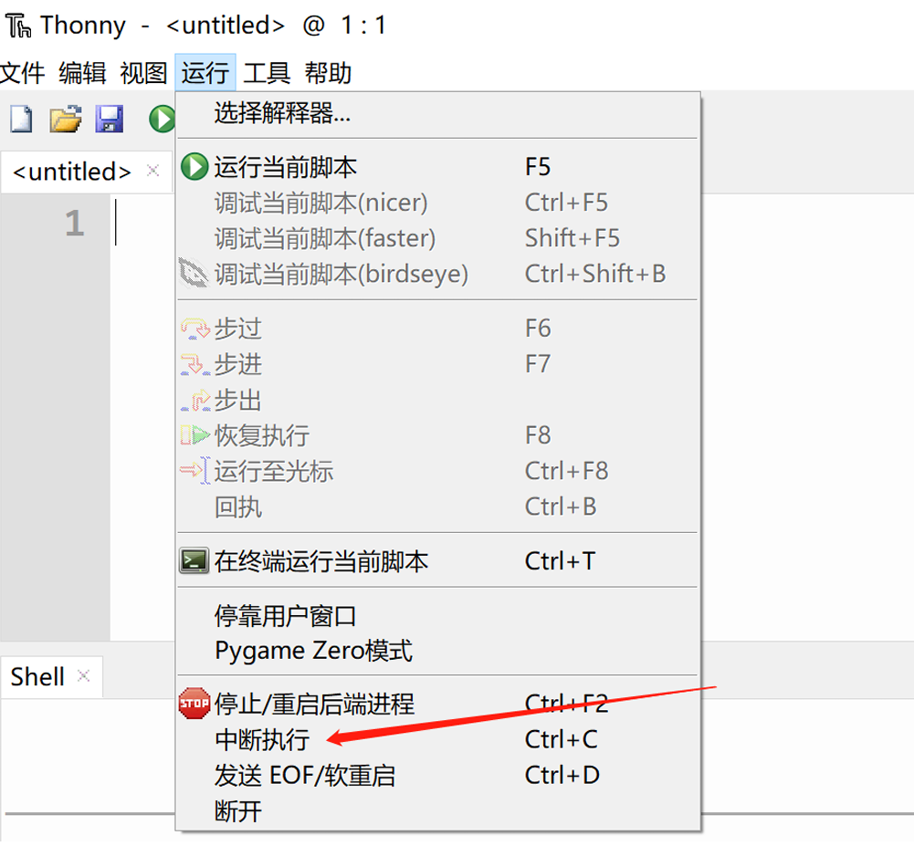
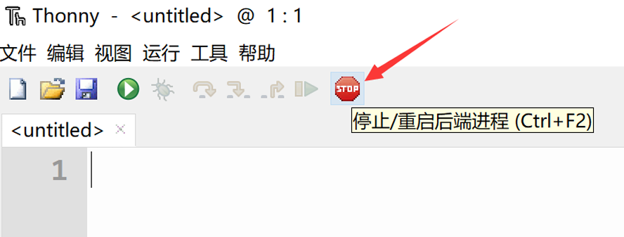
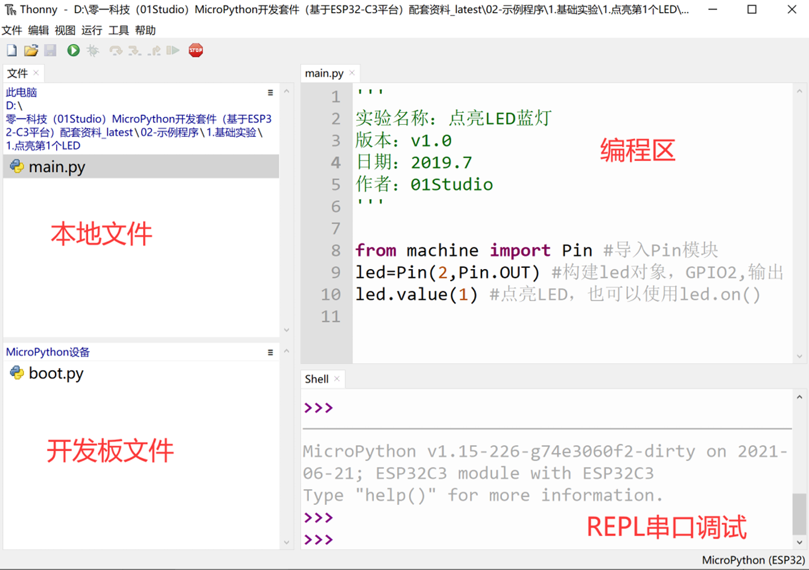
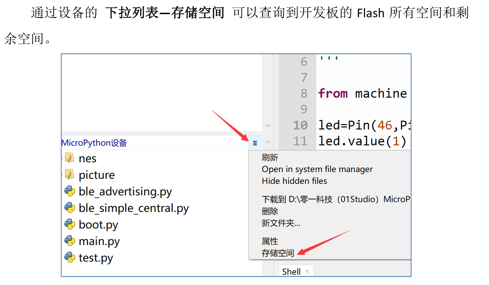
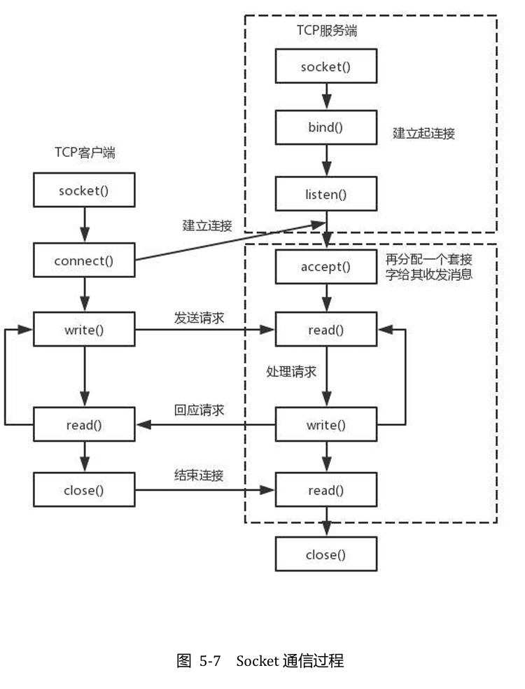

[零一科技K230教程](https://wiki.01studio.cc/docs/canmv_k230/intro/canmv_k230)  
[立创庐山派K230教程](https://wiki.lckfb.com/zh-hans/lushan-pi-k230/)

 [MicroPython 文档（中文）](网址：docs.01studio.cc)

 MicroPython固件集成了交互解释器REPL 【读取(Read)-运算(Eval)
输出(Print)-循环(Loop) 】


如果连接后出现下图错误提示，那么请检查设备管理器中串口驱动是否安装
成功以及开发板的串口号是否选对。
  
驱动正常以及串口号选对的话那么就是pyClock里面有出厂程序代码在跑阻
塞了IO，这时候可以按一下 运行—中断执行 打断程序。
  
或者直接断电再上电复位一下开发板（pyClock没有引出复位键），然后按“停
止/重启后端进程”按钮，即可出现REPL。

REPL 终端常用键盘按键： 
Ctrl + C : 打断正在运行的程序（特别是含While True: 的代码）； 
Ctrl + D : 软件复位开发板。 
也可以使用thonny菜单栏工具实现打断或软件复位功能： 


Micropython 上电默认先运行名字为 boot.py 文件，然后在运行 main.py 文
件，如果没有boot.py那么直接运行main.py。 
boot.py: 一般用于配置初始化参数（可以不需要）； 
main.py：主程序  
也就是我们只需要将代码以main.py文件发送到开发板，那么开发板就可以
实现上电运行相关程序。

# 时间函数：
```python
import time 
time.sleep(1)           
# 睡眠1秒 
time.sleep_ms(500)      
# 睡眠500毫秒 
time.sleep_us(10)       
# 睡眠10微妙 
start = time.ticks_ms() # 获取毫秒计时器开始值
start = time.ticks_ms() # 获取毫秒计时器开始值 
delta = time.ticks_diff(time.ticks_ms(), start) # 计算从上电开始到当前时间
的差值
```
# 定时器 
```python
from machine import Pin,Timer 
 
led=Pin(2,Pin.OUT) 
Counter = 0 
Fun_Num = 0 
 
def fun(tim): 
 
    global Counter 
    Counter = Counter + 1 
    print(Counter) 
    led.value(Counter%2) 
 
#开启RTOS定时器，编号为-1 
tim = Timer(-1) 
tim.init(period=1000, mode=Timer.PERIODIC,callback=fun) #周期为1000ms
```
在定义回调函数fun的时候，需要将Pin对象KEY传递进去。

# LCD
## LCD是1.54寸，驱动是的ST7789，使用SPI
```python
#导入相关模块
from tftlcd import LCD15
import time

#定义常用颜色
RED = (255,0,0)
GREEN = (0,255,0)
BLUE = (0,0,255)
BLACK = (0,0,0)
WHITE = (255,255,255)

########################
# 构建1.5寸LCD对象并初始化
########################
d = LCD15(portrait=1) #默认方向竖屏

#填充白色
d.fill(WHITE)

#画点
d.drawPixel(5, 5, RED)
 
#画线段
d.drawLine(5, 10, 100, 10, RED)
 
#画矩形
d.drawRect(5, 20, 100, 30, RED, border=5)

#画圆
d.drawCircle(50, 80, 20, RED, border=5)
 
#写字符,4种尺寸
d.printStr('Hello 01Studio', 10, 120, RED, size=1)
d.printStr('Hello 01Studio', 10, 150, GREEN, size=2)
d.printStr('Hello 01Studio', 10, 190, BLUE, size=3)

time.sleep(5) #等待5秒

#显示图片
d.Picture(0,0,"/picture/1.jpg")
time.sleep(3)
d.Picture(0,0,"/picture/2.jpg")
time.sleep(3)
d.Picture(0,0,"/picture/01studio.jpg")
```

# RTC
```python
# 导入相关模块
from machine import Pin, RTC, Timer
from tftlcd import LCD15

# 定义星期和时间（时分秒）显示字符列表
week = ['Mon', 'Tues', 'Wed', 'Thur', 'Fri', 'Sat', 'Sun']
time_list = ['', '', '']

#定义常用颜色
RED = (255,0,0)
GREEN = (0,255,0)
BLUE = (0,0,255)
BLACK = (0,0,0)
WHITE = (255,255,255)

########################
# 构建1.5寸LCD对象并初始化
########################
d = LCD15(portrait=1) #默认方向竖屏

#填充白色
d.fill(WHITE)

#显示标题
d.printStr('01Studio',10,5,color=BLACK,size=2) # 首行显示01Studio
d.printStr('RTC Clock',10,55,color=BLACK,size=2) # 次行显示实验名称

# 初始化RTC
rtc = RTC()

# 首次上电配置时间，按顺序分别是：年，月，日，星期，时，分，秒，次秒级；这里做了
# 一个简单的判断，检查到当前年份不对就修改当前时间，开发者可以根据自己实际情况来
# 修改。
if rtc.datetime()[0] != 2022:
    rtc.datetime((2022, 4, 1, 4, 0, 0, 0, 0))

def RTC_Run(tim):

    datetime = rtc.datetime()  # 获取当前时间

    # 显示日期，字符串可以直接用“+”来连接
    d.printStr(str(datetime[0]) + '-' + str(datetime[1]) + '-' + str(datetime[2]) + ' ' + week[datetime[3]],10,105,color=BLACK,size=2)

    # 显示时间需要判断时、分、秒的值否小于10，如果小于10，则在显示前面补“0”以达
    # 到较佳的显示效果
    for i in range(4, 7):
        if datetime[i] < 10:
            time_list[i - 4] = "0"
        else:
            time_list[i - 4] = ""

    # 显示时间
    d.printStr(time_list[0] + str(datetime[4]) + ':' + time_list[1] + str(datetime[5]) + ':' + time_list[2] + str(datetime[6]),10,155,color=BLACK,size=2)

#开启RTOS定时器
tim = Timer(-1)
tim.init(period=300, mode=Timer.PERIODIC, callback=RTC_Run) #周期300ms
```

# WIFI 
```python
import network,time
from machine import Pin
from tftlcd import LCD15

#定义常用颜色
RED = (255,0,0)
GREEN = (0,255,0)
BLUE = (0,0,255)
BLACK = (0,0,0)
WHITE = (255,255,255)

########################
# 构建1.5寸LCD对象并初始化
########################
d = LCD15(portrait=1) #默认方向竖屏

#填充白色
d.fill(WHITE)

#WIFI连接函数
def WIFI_Connect():

    WIFI_LED=Pin(2, Pin.OUT) #初始化WIFI指示灯

    wlan = network.WLAN(network.STA_IF) #STA模式
    wlan.active(True)                   #激活接口
    start_time=time.time()              #记录时间做超时判断

    if not wlan.isconnected():
        print('connecting to network...')
        wlan.connect('01Studio', '88888888') #输入WIFI账号密码

        while not wlan.isconnected():

            #LED闪烁提示
            WIFI_LED.value(1)
            time.sleep_ms(300)
            WIFI_LED.value(0)
            time.sleep_ms(300)

            #超时判断,15秒没连接成功判定为超时
            if time.time()-start_time > 15 :
                print('WIFI Connected Timeout!')
                wlan.active(False) #反使能WiFi
                break

    if wlan.isconnected():
        #LED点亮
        WIFI_LED.value(1)

        #串口打印信息
        print('network information:', wlan.ifconfig())
        
        #显示IP信息
        d.printStr('IP/Subnet/GW:',10,10,color=BLUE,size=2)
        d.printStr(wlan.ifconfig()[0],10,50,color=BLACK,size=2)
        d.printStr(wlan.ifconfig()[1],10,80,color=BLACK,size=2)
        d.printStr(wlan.ifconfig()[2],10,110,color=BLACK,size=2)

#执行WIFI连接函数
WIFI_Connect()
```

# Socket 通信
应用层的HTTP通过传输层进行数据通信时，TCP会遇到同时为多个应用程序进程提供并发服务的问题。多个TCP连接或多个应用程序进程可能需要通过同一个 TCP协议端口传输数据。为了区别不同的应用程序进程和连接，许多计算机操作系统为应用程序与 TCP／IP 协议交互提供了套接字(Socket)接口。应用层可以和传输层通过Socket 接口，区分来自不同应用程序进程或网络连接的通信，实现数据传输的并发服务。

套接字（socket）是通信的基石，是支持TCP/IP协议的网络通信的基本操作
单元。它是网络通信过程中端点的抽象表示，包含进行网络通信必须的五种信息：
连接使用的协议（通常是TCP或UDP），本地主机的IP地址，本地进程的协议端
口，远地主机的IP地址，远地进程的协议端口。 
所以，socket的出现只是可以更方便的使用TCP/IP协议栈而已，简单理解就
是其对TCP/IP进行了抽象，形成了几个最基本的函数接口。比如create，listen，
accept，connect，read 和write 等等。以下是通讯流程：

```python
#导入相关模块
import network,usocket,time
from machine import Pin,Timer
from tftlcd import LCD15

#定义常用颜色
RED = (255,0,0)
GREEN = (0,255,0)
BLUE = (0,0,255)
BLACK = (0,0,0)
WHITE = (255,255,255)

########################
# 构建1.5寸LCD对象并初始化
########################
d = LCD15(portrait=1) #默认方向竖屏

#填充白色
d.fill(WHITE)

#WIFI连接函数
def WIFI_Connect():

    WIFI_LED=Pin(2, Pin.OUT) #初始化WIFI指示灯

    wlan = network.WLAN(network.STA_IF) #STA模式
    wlan.active(True)                   #激活接口
    start_time=time.time()              #记录时间做超时判断

    if not wlan.isconnected():
        print('Connecting to network...')
        wlan.connect('01Studio', '88888888') #输入WIFI账号密码

        while not wlan.isconnected():

            #LED闪烁提示
            WIFI_LED.value(1)
            time.sleep_ms(300)
            WIFI_LED.value(0)
            time.sleep_ms(300)

            #超时判断,15秒没连接成功判定为超时
            if time.time()-start_time > 15 :
                print('WIFI Connected Timeout!')
                wlan.active(False) #反激活WiFi
                break

    if wlan.isconnected():
        #LED点亮
        WIFI_LED.value(1)

        #串口打印信息
        print('network information:', wlan.ifconfig())

        #显示IP信息
        d.printStr('IP/Subnet/GW:',10,10,color=BLUE,size=2)
        d.printStr(wlan.ifconfig()[0],10,50,color=BLACK,size=2)
        d.printStr(wlan.ifconfig()[1],10,80,color=BLACK,size=2)
        d.printStr(wlan.ifconfig()[2],10,110,color=BLACK,size=2)
        
        return True

    else:
        return False

def Socket_fun(tim):

    text=s.recv(128) #单次最多接收128字节
    if text == '':
        pass

    else: #打印接收到的信息为字节，可以通过decode('utf-8')转成字符串
        print(text)
        s.send('I got:'+text.decode('utf-8'))

#判断WIFI是否连接成功
if WIFI_Connect():

    #创建socket连接TCP类似，连接成功后发送“Hello 01Studio！”给服务器。
    s=usocket.socket()
    addr=('192.168.1.124',10000) #服务器IP和端口
    s.connect(addr)
    s.send('Hello 01Studio!')

    #开启RTOS定时器，编号为-1,周期300ms，执行socket通信接收任务
    tim = Timer(-1)
    tim.init(period=300, mode=Timer.PERIODIC,callback=Socket_fun)

```
# MQTT 通信

public
```python
import network,time
from simple import MQTTClient #导入MQTT板块
from machine import SoftI2C,Pin,Timer
from tftlcd import LCD15

#定义常用颜色
RED = (255,0,0)
GREEN = (0,255,0)
BLUE = (0,0,255)
BLACK = (0,0,0)
WHITE = (255,255,255)

########################
# 构建1.5寸LCD对象并初始化
########################
d = LCD15(portrait=1) #默认方向竖屏

#填充白色
d.fill(WHITE)

#WIFI连接函数
def WIFI_Connect():

    WIFI_LED=Pin(2, Pin.OUT) #初始化WIFI指示灯

    wlan = network.WLAN(network.STA_IF) #STA模式
    wlan.active(True)                   #激活接口
    start_time=time.time()              #记录时间做超时判断

    if not wlan.isconnected():
        print('connecting to network...')
        wlan.connect('01Studio', '88888888') #输入WIFI账号密码

        while not wlan.isconnected():

            #LED闪烁提示
            WIFI_LED.value(1)
            time.sleep_ms(300)
            WIFI_LED.value(0)
            time.sleep_ms(300)

            #超时判断,15秒没连接成功判定为超时
            if time.time()-start_time > 15 :
                print('WIFI Connected Timeout!')
                wlan.active(False) #反激活WiFi
                break

    if wlan.isconnected():
        #LED点亮
        WIFI_LED.value(1)

        #串口打印信息
        print('network information:', wlan.ifconfig())

        #显示IP信息
        d.printStr('IP/Subnet/GW:',10,10,color=BLUE,size=2)
        d.printStr(wlan.ifconfig()[0],10,50,color=BLACK,size=2)
        d.printStr(wlan.ifconfig()[1],10,80,color=BLACK,size=2)
        d.printStr(wlan.ifconfig()[2],10,110,color=BLACK,size=2)
        
        return True

    else:
        return False

#发布数据任务
def MQTT_Send(tim):
    client.publish(TOPIC, 'Hello 01Studio!')

#执行WIFI连接函数并判断是否已经连接成功
if WIFI_Connect():

    SERVER = 'mq.tongxinmao.com'
    PORT = 18830
    CLIENT_ID = '01Studio-ESP832' # 客户端ID
    TOPIC = '/public/01Studio/1' # TOPIC名称
    client = MQTTClient(CLIENT_ID, SERVER, PORT)
    client.connect()

    #开启RTOS定时器，编号为-1,周期1000ms，执行socket通信接收任务
    tim = Timer(-1)
    tim.init(period=1000, mode=Timer.PERIODIC,callback=MQTT_Send)


```
subscribe
```python
'''
实验名称：MQTT通信
版本：v1.0
日期：2022.5
作者：01Studio
说明：编程实现MQTT通信，实现订阅（接收）数据。
MQTT助手：http://www.tongxinmao.com/txm/webmqtt.php#collapseOne
'''
import network,time
from simple import MQTTClient #导入MQTT板块
from machine import Pin,Timer
from tftlcd import LCD15

#定义常用颜色
RED = (255,0,0)
GREEN = (0,255,0)
BLUE = (0,0,255)
BLACK = (0,0,0)
WHITE = (255,255,255)

########################
# 构建1.5寸LCD对象并初始化
########################
d = LCD15(portrait=1) #默认方向竖屏

#填充白色
d.fill(WHITE)

#WIFI连接函数
def WIFI_Connect():

    WIFI_LED=Pin(2, Pin.OUT) #初始化WIFI指示灯

    wlan = network.WLAN(network.STA_IF) #STA模式
    wlan.active(True)                   #激活接口
    start_time=time.time()              #记录时间做超时判断

    if not wlan.isconnected():
        print('connecting to network...')
        wlan.connect('01Studio', '88888888') #输入WIFI账号密码

        while not wlan.isconnected():

            #LED闪烁提示
            WIFI_LED.value(1)
            time.sleep_ms(300)
            WIFI_LED.value(0)
            time.sleep_ms(300)

            #超时判断,15秒没连接成功判定为超时
            if time.time()-start_time > 15 :
                print('WIFI Connected Timeout!')
                wlan.active(False) #反激活WiFi
                break

    if wlan.isconnected():
        #LED点亮
        WIFI_LED.value(1)

        #串口打印信息
        print('network information:', wlan.ifconfig())

        #显示IP信息
        d.printStr('IP/Subnet/GW:',10,10,color=BLUE,size=2)
        d.printStr(wlan.ifconfig()[0],10,50,color=BLACK,size=2)
        d.printStr(wlan.ifconfig()[1],10,80,color=BLACK,size=2)
        d.printStr(wlan.ifconfig()[2],10,110,color=BLACK,size=2)
        
        return True

    else:
        return False


#设置MQTT回调函数,有信息时候执行
def MQTT_callback(topic, msg):
    print('topic: {}'.format(topic))
    print('msg: {}'.format(msg))

#接收数据任务
def MQTT_Rev(tim):
    client.check_msg()

#执行WIFI连接函数并判断是否已经连接成功
if WIFI_Connect():

    SERVER = 'mq.tongxinmao.com'
    PORT = 18830
    CLIENT_ID = '01Studio-ESP32' # 客户端ID
    TOPIC = '/public/01Studio/1' # TOPIC名称

    client = MQTTClient(CLIENT_ID, SERVER, PORT) #建立客户端对象
    client.set_callback(MQTT_callback)  #配置回调函数
    client.connect()
    client.subscribe(TOPIC) #订阅主题

    #开启RTOS定时器，编号为-1,周期300ms，执行socket通信接收任务
    tim = Timer(-1)
    tim.init(period=300, mode=Timer.PERIODIC,callback=MQTT_Rev)
```

# 通过局域网的方式来调试或者传输文件
你的电脑和设备是连接到同一个路由器上
在串口终端输入以下命令： 
`import webrepl_setup`
中输入’E’，按回车，使能WebREPL相关功能
设置密码，设置完成后输入‘y’,选择重启。按y后如果没反
应，可以断电重新上电复位板子。
打开浏览器输入`IP:8266/`，输入密码后，就可以上传文件了。