  
边缘AI是将人工智能AI算法部署在边缘设备上，使其能够处理数据，进行推理和决策，而无需将数据发送到云端  
  
  
  

Python 中input()函数用于从用户输入中获取数据，并将其返回为字符串。如果需要数字类型的输入，就需要类型转换。  
分布转换，代码清晰，容易理解每步作用  
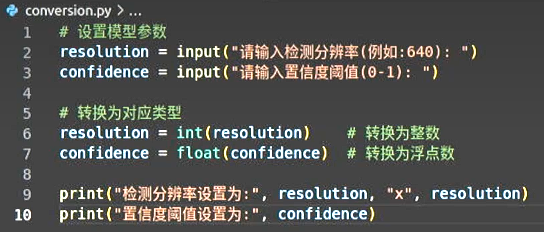  

直接转换  
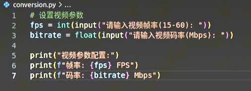  
运算符  
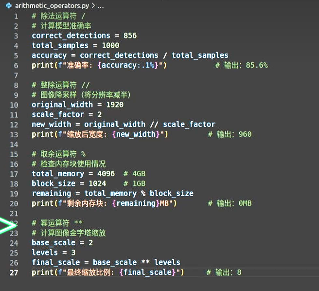  

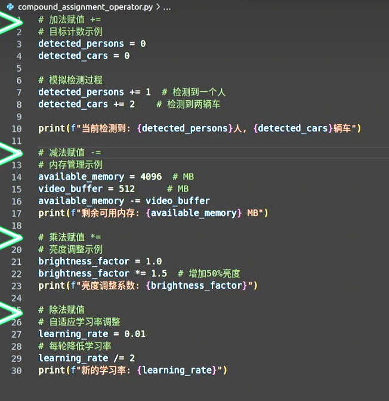  
使用*号运算符重复字符串  
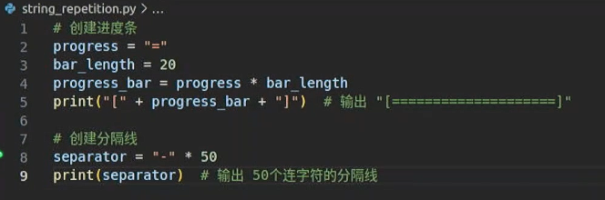  
提取字符串  
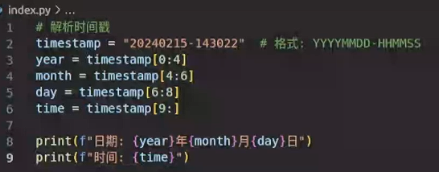  
字符串格式化
1. 百分号格式化  
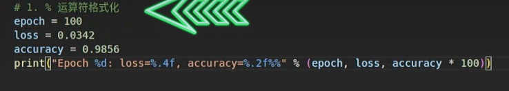  
2. format()方法  
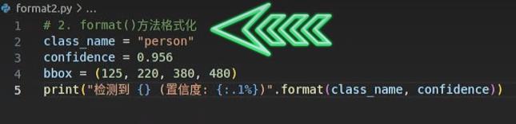
3. f-string格式化（Python3.6引入）  
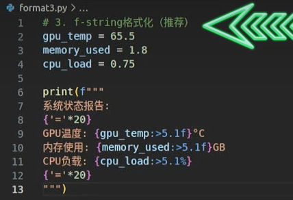  
总结：
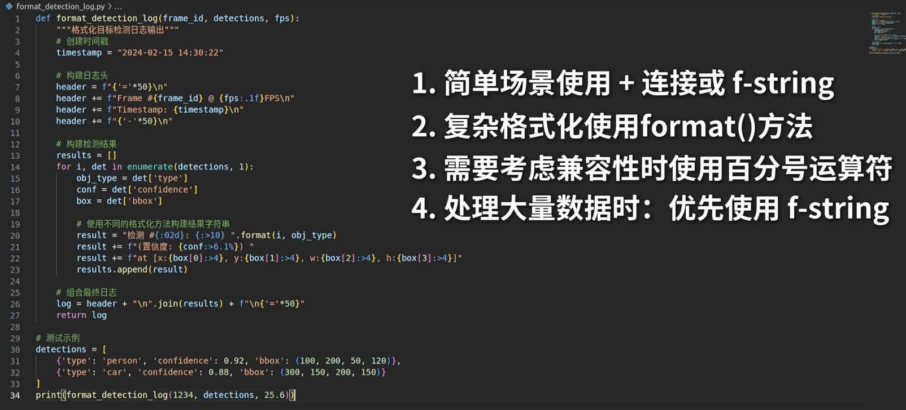  

AI提问话语  
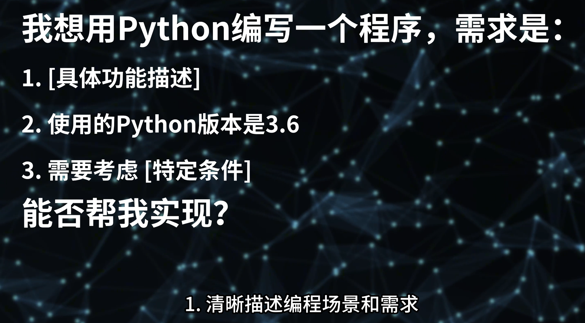  