# 置顶链接

# 归零码
800kHz → 1bit = 1.25µs
0码:  T0H ≈ 0.4µs
1码:  T1H ≈ 0.8µs
## 三通道：SM16703、TM1804、UCS1903、WS2811、SK6812、INK1003、APA105、P943S、P9411、TX1812、TX1813、GS8206、GS8208
## 四通道：SK6812、P9412
## 高辉
### TM2918 三通道
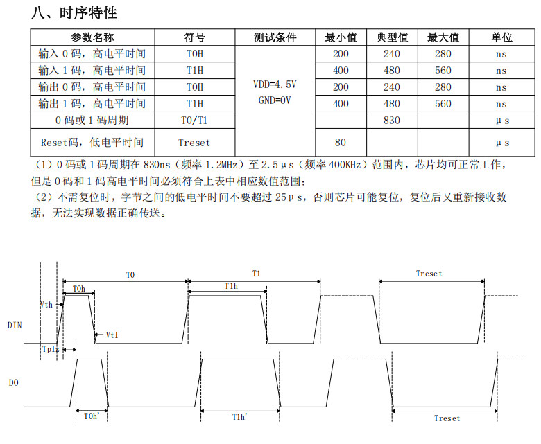  
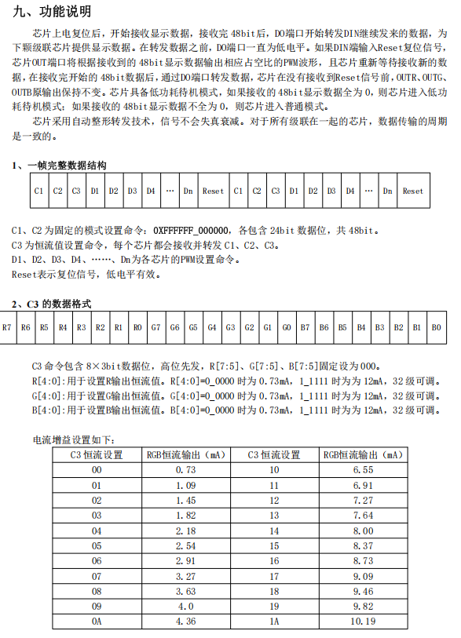  
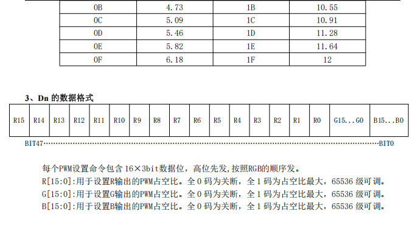  
### SM16705PD 五通道
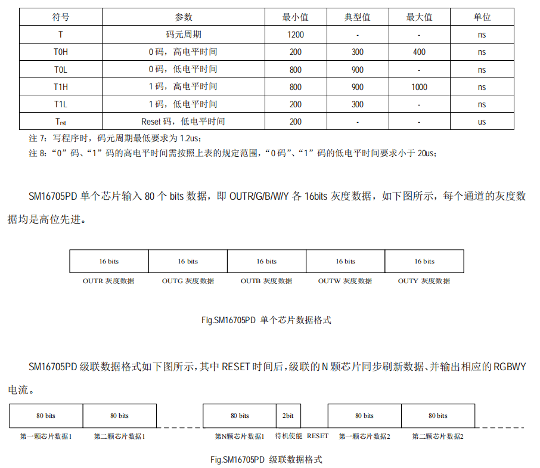
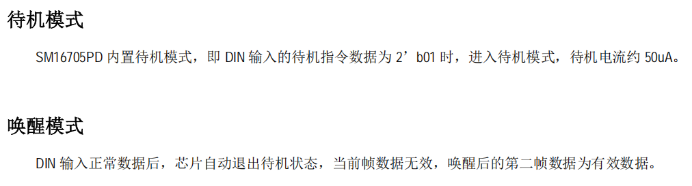
### SM16803PB 三通道
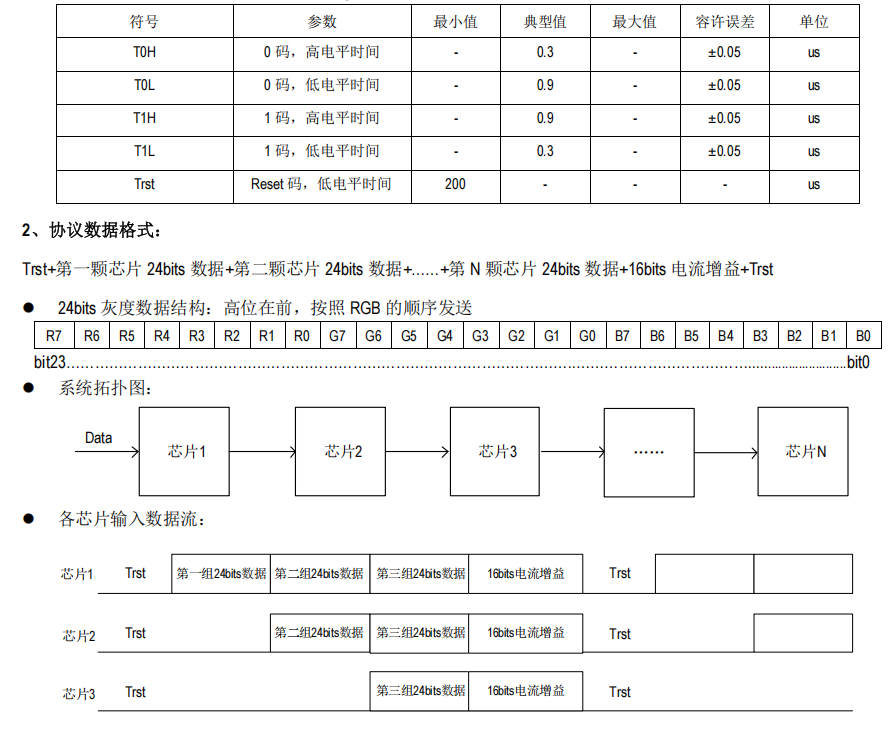  
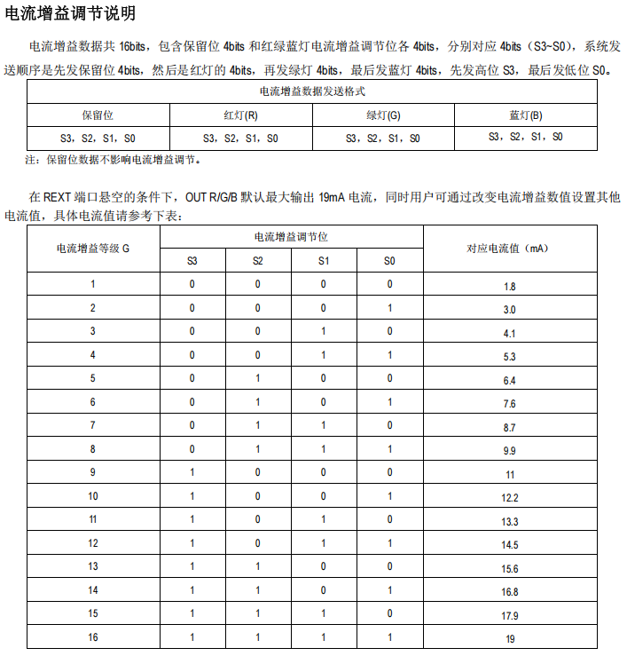  
# 归一码
800kHz → 1bit = 1.25µs
0码:  T0L ≈ 0.4µs
1码:  T1L ≈ 0.8µs
## 三通道：TM1913
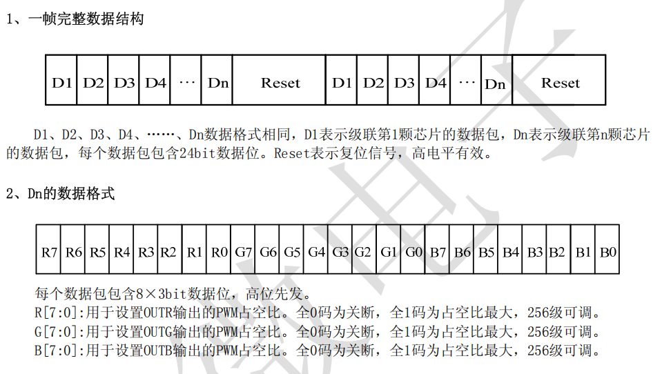
## 三通道：TM1914（双线备份，一帧含有48bit头）
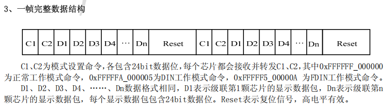
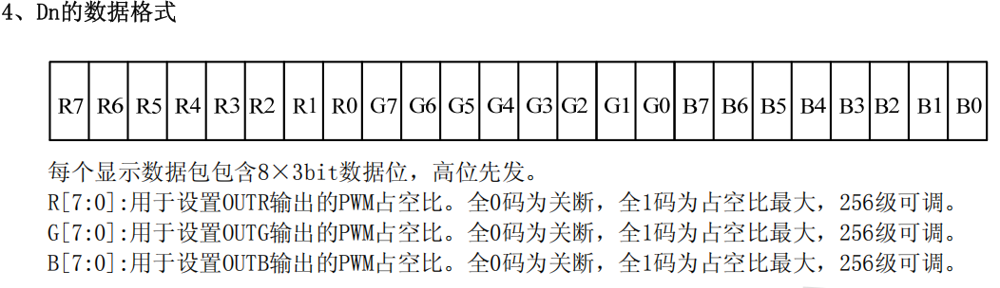  
## 四通道：P9414
无TM1814前面的C1、C2头
## 四通道：TM1814
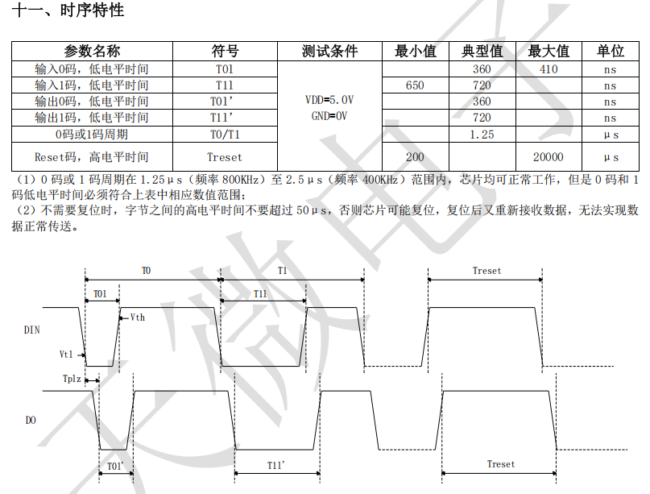  
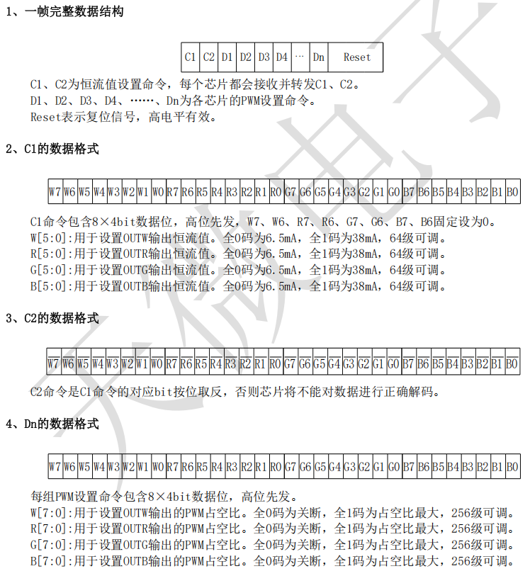  
# 双线
800KHz
CLK 上升沿被采样
时钟线在不传输时保持 低电平
线序：黑VCC，绿CLK，红DIN，蓝GND
## WS2801
24bit（仅 RGB 各 8bit）
仅连续 LED 帧 + 时钟低电平复位（发完所有 LED 后，时钟线保持低电平≥500μs 触发复位）
颜色顺序RGB
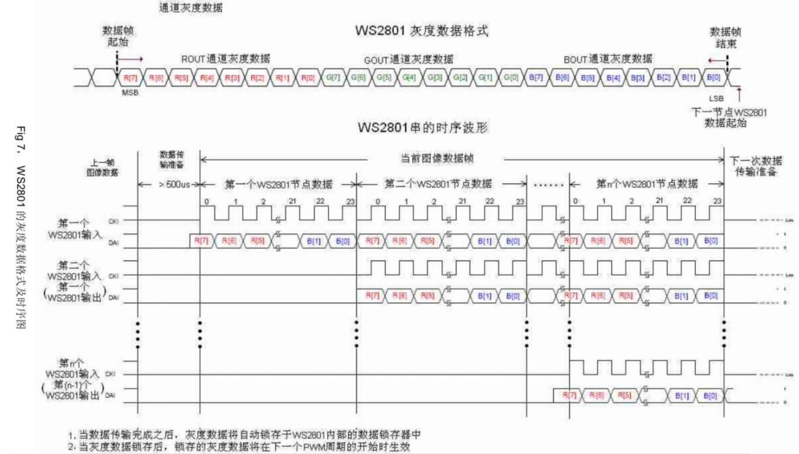
## LPD8803/8806
一颗IC控两个灯珠24bit+24bit
48bit（固定头1bit RGB 各 7bit）
起始帧（≥32个"0"）+ （24bit+24bit）+ 补位（每颗芯片1个"0"）如果要驱动1200颗灯珠就是发600个0即数据线为低的情况下时钟线600次上升沿
颜色顺序BRG
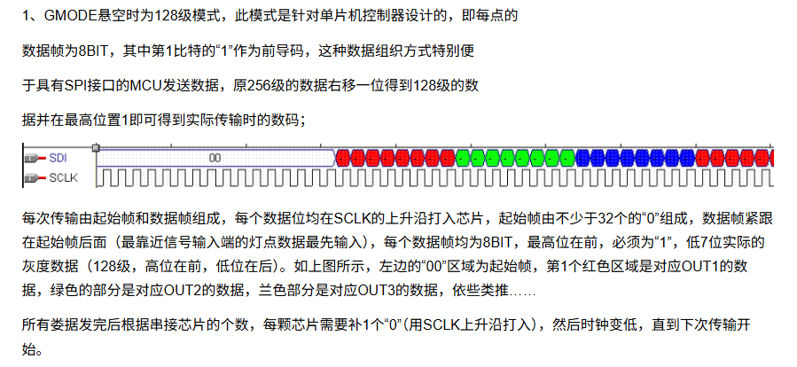
## LPD6803
一颗 IC 控一个灯珠 16bit，16bit（起始位 1bit+RGB 各 5bit），起始帧（固定 32 个 "0"）+（16bit× 灯珠总数）+ 补位（每颗灯珠 1 个 "0"，即驱动 N 颗灯珠发 N 个 0，数据线为低时时钟线 N 次上升沿）  
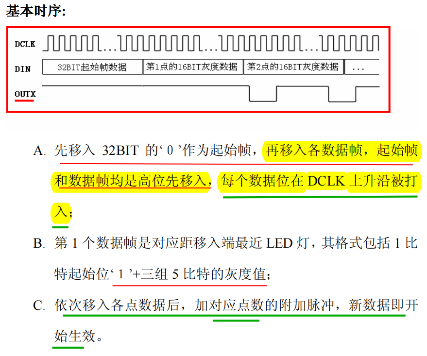  
## APA102、SK9822、P9413 
单 LED 数据长度	32bit（含 3bit 起始码固定为111 + 5bit 亮度）
有 Start Frame（32 个 0）+LED 帧 + End Frame（32 个 1）
颜色顺序BGR
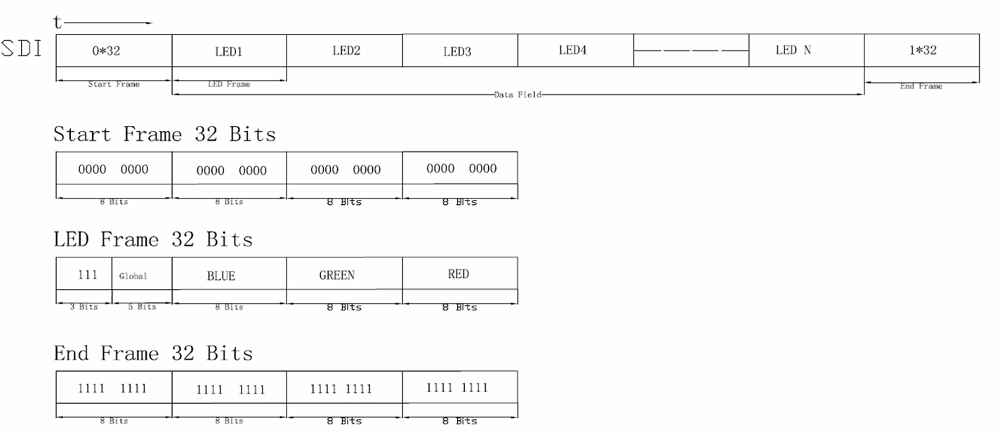
## P9813
单 LED 数据长度	： 
[2bit标志位(固定11)] + [2bit B7'/B6'] + [2bit G7'/G6'] + [2bit R7'/R6'] + [8bit B] + [8bit G] + [8bit R]    
解释：32bit（2bit 标志位（固定 11）+2bit 校验位（B7’/B6’，蓝色高 2 位反码）+2bit 校验位（G7’/G6’，绿色高 2 位反码）+2bit 校验位（R7’/R6’，红色高 2 位反码）+ 8bit 蓝色灰度 + 8bit 绿色灰度 + 8bit 红色灰度） 
数据帧格式： 
Start Frame(32个0) + LED1数据 + LED2数据 + ... + LEDn数据  
颜色顺序BGR  
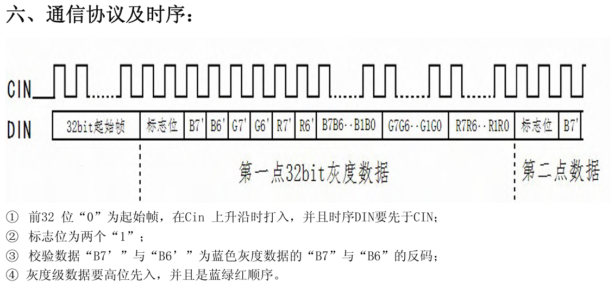  

# DMX512
250KHz
1 bit = 4 µs
# PWM
16KHz
PWM效果很少，只有五种：七彩跳变\七彩呼吸\七彩闪烁\七彩心跳\七彩渐变\。其中呼吸\闪烁\心跳可以加第四、第五通道也就是CW、WW。单色呼吸有红色、绿色、蓝色、黄色、青色、紫色、白色。
# 线材
线序（自箭头往下）：黑绿红蓝  
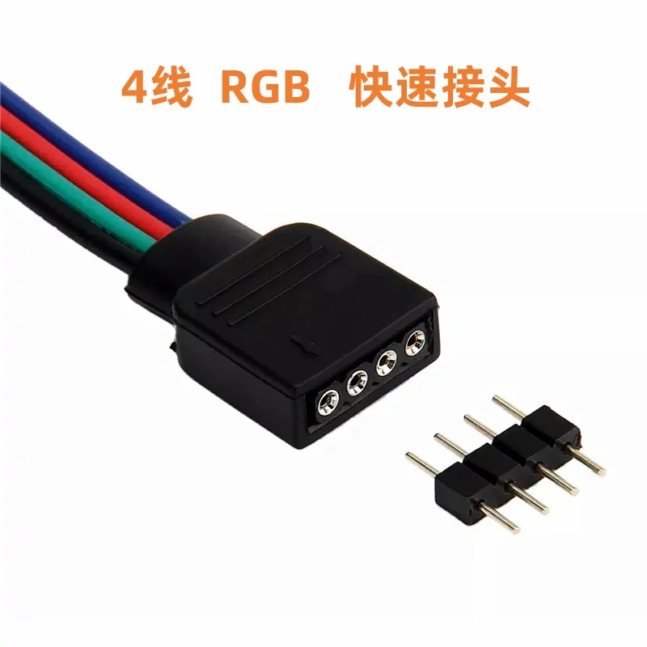  
其实是给PWM用的，黑色是共阴，接着是GRB顺序。  

VCC黑 R红 G绿 B蓝 WW黄 W白

# 灯效
低辉灯带

每个颜色通道：8 bit

RGB：R8 G8 B8（0~255）

高辉灯带

每个颜色通道：16 bit

RGB：R16 G16 B16（0~65535）

# DMX512写码
[天微官网](http://www.titanmec.com/product/led-decorative-driver-chip/512-protocol-series/p/1.html)  
## 使用PI线写码型号
UCS品牌：UCS512A、UCS512B  
TM品牌：TM512、TM512AB、TM512AL  
SM品牌：DMX512AP  
HI、GS、HM品牌无PI写码  
使用逻辑分析仪实测样品。
## PI线串行写码说明:UCS512A/B、TM512AB/AL系列 
### 一、完整写码数据格式
**单数据包完整格式**：复位前标记（0~1s空闲高电平即可）→复位信号（UCS≥2s低电平、TM≥1.5s低电平建议2.5s）→复位后标记（即MAB）（100µs~1s）→0起始字段（11位：0+00000000+11）→[IC4字段数据（11位×4）]×N  
- 整体写码流程：首帧数据包（发所有 IC 主地址 4 字段）→次帧数据包（发所有 IC 备份地址 4 字段）（顺序不可颠倒）  
- 字段结构：所有字段固定11位 = 0起始位（低电平）+ 8位数据位 + 2停止位（高电平）；  
- 比特率：默认20Kbps（位时长50µs），UCS额外支持40Kbps；
- 生效规则：写码成功均亮蓝灯，UCS即刻生效，TM需断电重启生效。

### 二、核心基础规则
1. 写码方式：采用PI线串行写码，类似DMX512协议，需2个数据包完成写址；地址码为**双备份模式**，主地址与备份地址需分别写码。
2. 总线与接线：
   - UCS512/512A1：IC的PI线接写码器PO端，AB线接写码器A(D+)/B(D-)端，写码时需保持A(D+)高、B(D-)低；
   - UCS512B/B3/B4：IC的PI线接写码器PO端，DAI线接写码器A(D+)端，写码时需保持A(D+)高电平；
   - TM512AB/AL系列芯片数据通讯线AI（或DAI）即A线需保持**高电平**，方可正常写码；
3. 首个IC识别：**PI脚与写码器相连的IC**为第一个接收数据的IC；
4. 字段衔接：字段之间占（高电平）时长≤1s，可以为0。所有字段的位时长需与起始字段一致；
1. 0起始字段：固定为0000_0000。发送时高位在前。同数据包内所有位时长一致，且与0起始字段位时长相同；

### 三、4字段数据定义（首帧/次帧通用，仅1处差异）
每字节高位在前，仅第2字段区分主/备地址，其余字段完全一致：

| 序号 | 主地址字段值 | 备份地址字段值 | 核心说明 |
| :---: | :---: | :---: | :---: |
| 1 | 0xAC（1010_1100） | 0xAC（1010_1100） | 固定校验码/写地址命令 |
| 2 | 0x80（1000_0000） | 0xC0（1100_0000） | E2存储位置标识（主/备） |
| 3 | 10A11~A6（adh） | 10A11~A6（adh） | 12位地址高6位（高2位为校验位），格式：S+1+0+D11~D6+T |
| 4 | 01A5~A0（adl） | 01A5~A0（adl） | 12位地址低6位（高2位为校验位），格式：S+0+1+D5~D0+T |

#### 地址码特殊说明
- 第一有效地址：DMX512首地址为0000_0000_0000（非0000_0000_0001），对应第3字段=0x80、第4字段=0x40；
- 地址长度：总12位（D11~D0），高2位为校验位，低6位拼接为完整地址；
- 一致性要求：同一芯片主/备地址数据必须完全一致。

### 四、完整写码发送步骤（首/次帧通用）
1. 发送复位前标记（0~1000000µs 高电平）；
2. 发送2.5s低电平作为复位码；
3. 发送复位后标记（100µs~1s 高电平）；
4. 发送11位0起始字段（0+00000000+11）；
5. 发送第1个IC的4个11位字段（按序号1-4顺序）；
6. 依次发送后续IC的4字段数据，直至所有IC发送完成；
7. 首帧（主地址）发送完成后，按相同步骤发送次帧（备份地址，仅第2字段改为0xC0，其余数据不变）。

### 五、上电地址读取流程
1. IC上电且电压稳定后，延时100ms开始读取E2存储的地址数据；
2. 首次读取：从E2的1000_0000位置连续读2字节，校验高2位（第1字节=10、第2字节=01），校验成功则作为地址；
3. 二次读取：若首次校验失败，从E2的1100_0000位置连续读2字节，直接作为地址。
### 六、写码示例（级联芯片）
#### 需求
第1颗芯片地址0000_0000_0000，第2颗芯片地址0000_0000_0011  

#### 主地址数据包（字段顺序）
0x00（起始字段）→ 0xAC → 0x80 → 0x80 → 0x40 → 0xAC → 0x80 → 0x80 → 0x43 → ……（后续芯片按格式延续）  

#### 备份地址数据包（字段顺序）
0x00（起始字段）→ 0xAC → 0xC0 → 0x80 → 0x40 → 0xAC → 0xC0 → 0x80 → 0x43 → ……（后续芯片按格式延续）

## AB线差分写码双地址包有占说明:UCS512C系列  
### 一、完整写码数据格式
**单数据包完整格式**：2S低电平（复位码）→高电平（≤1s）→0起始字段（11位：0+00000000+11）→W高电平（>44μS）→[IC8字段数据（11位×8）→W高电平（>44μS）]×N  
- 整体写码流程：首帧数据包（发所有IC主地址8字段）→次帧数据包（发所有IC备份地址8字段）（顺序不可颠倒）
- 字段结构：所有字段固定11位 = 0起始位（低电平）+ 8位数据位 + 2停止位（高电平）；数据发送均为高位在前
- 比特率：默认250Kbps（位时长4μS），特殊场景可使用200Kbps，支持频率自适应
- 关键标识：W=大于44μS的高电平，为强制插入字段
- 生效规则：写码校验成功后，IC的RGBW通道以固定灰度全亮（白灯）；带转发功能的UCS512C1/C0，会同步从DO口发送192通道同等灰度数据至下级IC

### 二、核心基础规则
1. 写码方式：采用AB线差分写码，类似DMX512协议，需2个数据包完成双备份地址写码；地址码为双备份模式，主地址与备份地址需分别写码，且地址数据完全一致。
2. 总线与接线：写码器仅需接A/D+、B/D-、GND三个端子与灯具相连，**写码器与首颗IC之间无需连接写码线，但IC与IC之间必须用写码线级联**。
3. 首个IC识别：控制器单端口所带的级联链路中，**PI脚悬空的IC**为第一个接收数据的IC。
4. 字段衔接：复位码与字段、字段与字段之间，均用高电平衔接，所有高电平衔接时长最长≤1s。
5. 频率规则：同数据包内所有位时长必须完全一致，且每个字段的位时长必须与0起始字段的位时长相同。
6. 0起始字段：固定为0000_0000，发送时高位在前，用于速率匹配。
7. W高电平强制要求：0起始字段发送完成后、每颗IC的8字段数据发送完成后，必须插入1段时长>44μS的W高电平，否则会导致写码失败。

### 三、8字段数据定义（首帧/次帧通用，仅1处差异）
每字节高位在前，仅第6字段区分主/备份地址存储位置，其余字段完全一致：

| 序号 | 首帧（主地址）字段值 | 次帧（备份地址）字段值 | 核心说明 |
| :---: | :---: | :---: | :---: |
| 1 | 0xAA（1010_1010） | 0xAA（1010_1010） | 固定校验码1 |
| 2 | 0xF0（1111_0000） | 0xF0（1111_0000） | 固定校验码2 |
| 3 | 0x34（0011_0100） | 0x34（0011_0100） | 固定校验码3 |
| 4 | 0x55（0101_0101） | 0x55（0101_0101） | 固定校验码4 |
| 5 | 0xAC（1010_1100） | 0xAC（1010_1100） | 固定校验码5/写地址命令 |
| 6 | 0x80（1000_0000） | 0xC0（1100_0000） | 唯一差异：E2存储位置标识（主/备） |
| 7 | 10A11~A6（adh） | 10A11~A6（adh） | 12位地址高6位（高2位为校验位），格式：S+1+0+D11~D6+T |
| 8 | 01A5~A0（adl） | 01A5~A0（adl） | 12位地址低6位（高2位为校验位），格式：S+0+1+D5~D0+T |

#### 地址码特殊说明
- 第一有效地址：DMX512画面数据包第一有效字段地址为`0000_0000_0000`（非0000_0000_0001），对应第7字段=0x80、第8字段=0x40；
- 地址长度：总12位（D11~D0），高2位为校验位，低6位拼接为完整地址；
- 一致性要求：同一芯片首帧与次帧的地址数据必须完全一致，仅第6字段区分存储位置。

### 四、完整写码发送步骤（首帧/次帧通用）
1. 发送2S低电平，作为写码复位码；
2. 发送11位0起始字段（0+00000000+11）；
3. 插入W高电平（时长>44μS）；
4. 发送第1个IC的8个11位字段数据（按上述序号1-8顺序）；
5. 插入W高电平（时长>44μS）；
6. 重复步骤4-5，直至所有IC的8字段数据全部发送完成；
7. 首帧（主地址）发送完成后，按相同步骤发送次帧（备份地址，仅第6字段改为0xC0，其余数据不变），顺序不可颠倒。

### 五、上电地址读取流程
1. IC上电，电压稳定后**延时100ms**，开始读取E2存储的地址数据；
2. 首次读取：从E2的1000_0000位置连续读2字节，校验高2位（第1字节=10、第2字节=01），校验成功则作为数据截取地址；
3. 二次读取：若首次校验失败，从E2的1100_0000位置连续读2字节，直接作为数据截取地址；
4. 双E2兼容：带辅助E2的双E2芯片，若主E2无有效地址或校验失败，将自动从辅助E2中读取地址数据。

### 六、写码示例（级联芯片）
#### 需求
级联2颗三通道IC，第1颗芯片地址`0000_0000_0000`，第2颗芯片地址`0000_0000_0011`

#### 首帧（主地址）数据包（字段顺序，省略起始位/停止位）
0x00（起始字段）→ W高电平 → 0xAA、0xF0、0x34、0x55、0xAC、0x80、0x80、0x40（第1颗IC）→ W高电平 → 0xAA、0xF0、0x34、0x55、0xAC、0x80、0x80、0x43（第2颗IC）→ W高电平 → ……（后续芯片按格式延续）

#### 次帧（备份地址）数据包（字段顺序，省略起始位/停止位）
0x00（起始字段）→ W高电平 → 0xAA、0xF0、0x34、0x55、0xAC、0xC0、0x80、0x40（第1颗IC）→ W高电平 → 0xAA、0xF0、0x34、0x55、0xAC、0xC0、0x80、0x43（第2颗IC）→ W高电平 → ……（后续芯片按格式延续）

### 样品时序
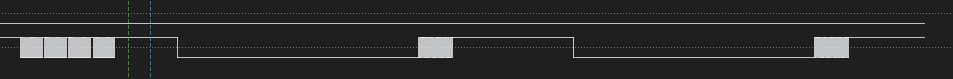  
每隔20ms发了4遍4096个通道的0  
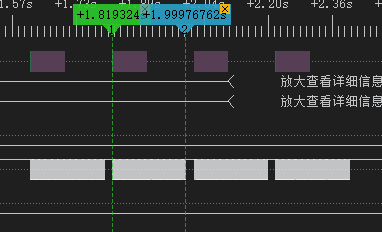  
高电平维持520ms后转低电平维持2s  
发首包，接着发完后高电平维持1s后转低电平维持2s后发次包，发完后一直高电平。  

## AB线差分写码单地址包有占说明:UCS512C7/C8/G/H  
UCS512C7/C8/G/H 无需发送两包数据、W 间隔时长与 UCS512C 不同。“W”时长的高电平（W＞176uS）。其他一致。  
### 写参数
级联写参数过程类似于级联写码，只是写入的不是地址码而是参数
#### UCS512C7/C8参数功能

| 参数 | 选项 |
|------|------|
| 字段数 | 1 / 2 / 3 / 4 |
| 上电亮灯 | 灰度自定义 |
| 1.5S无信号亮灯状态 | 恢复上电亮灯 / 保留最后一帧 |
| 电流值 | UCS512C7系列 2.4mA-20.4mA ；UCS512C8系列 7.06mA-60.01mA |

##### 写上电亮灯方案（上电亮灯，1.5 S无信号，字段数）

下表是写上电亮灯参数需要控制器发送的，数据表中只给出数据，没有0起始位和停止位

| 字节数据 | 说明 |
|--------|------|
| 1010_1010 | 验证码1 |
| 1111_0000 / 0000_1111 | 验证码2 1111_0000：级联写 / 0000_1111：并联写 |
| 0011_0100 | 验证码3 |
| 0101_0100 | 验证码4 |
| 1010_1100 | 验证码5 |
| 1000_0010 | E2存储参数的地址 |
| PT（1:0）_WT_00110 | PT（1：0）：字段选择；WT:1.5S无信号亮灯状态。1保留最后一帧（默认值），0恢复上电亮灯；00110：取默认值的验证码，上电亮灯默认值为蓝灯22% |
| R[7:0] | 红灯上电灰度 |
| G[7:0] | 绿灯上电灰度 |
| B[7:0] | 蓝灯上电灰度 |
| W[7:0] | 白灯上电灰度 |

###### 字段选择

| P1 | P0 | 模式 |
|----|----|------|
| 0  | 0  | 4字段模式：收取4字段，分别对应R，G，B，W（默认值） |
| 0  | 1  | 3字段模式：收取3字段，对应R，G，B（W保持关闭） |
| 1  | 0  | 2字段模式：收取2字段，对应RG，BW |
| 1  | 1  | 1字段模式：收取1字段，对应RGBW |

---

##### 写电流值方案

下表是写电流参数需要控制器发送的，数据表中只给出数据，没有0起始位和停止位

| 字节数据 | 说明 |
|--------|------|
| 1010_1010 | 验证码1 |
| 1111_0000 / 0000_1111 | 验证码2 1111_0000：级联写 / 0000_1111：并联写 |
| 0011_0100 | 验证码3 |
| 0101_1010 | 验证码4 |
| 1010_1100 | 验证码5 |
| 1000_1000 | E2存储参数的地址 |
| ＣR ：0_000_R3R2R1R0 | 0：默认值验证码，000：固定位，R3-R0：红灯电流 |
| ＣG ：1_000_G3G2G1G0 | 1：默认值验证码，000：固定位，G3-G0：绿灯电流 |
| ＣB ：0_000_B3B2B1B0 | 0：默认值验证码，000：固定位，B3-B0：蓝灯电流 |
| ＣW：1_000_W3W2W1W0 | 1：默认值验证码，000：固定位，W3-W0：白灯电流 |

注：任意一位电流默认值验证码错，RGBW通道都取最大电流。

###### 电流值对照表

软件可向 E2 中写入电流值数据来调整实际输出电流， RGBW 任一通道输出均对应 4 位电流数
据，设置 16 级电流

| BIT3 | BIT2 | BIT1 | BIT0 | 十进制 | UCS512C7系列 电流（mA） | UCS512C8系列 电流（mA） |
|------|------|------|------|--------|----------------------|----------------------|
| 0    | 0    | 0    | 0    | 1      | 2.4                  | 7.06                 |
| 0    | 0    | 0    | 1    | 2      | 3.6                  | 10.59                |
| 0    | 0    | 1    | 0    | 3      | 4.8                  | 14.12                |
| 0    | 0    | 1    | 1    | 4      | 6                    | 17.65                |
| 0    | 1    | 0    | 0    | 5      | 7.2                  | 21.18                |
| 0    | 1    | 0    | 1    | 6      | 8.4                  | 24.71（默认值）        |
| 0    | 1    | 1    | 0    | 7      | 9.6                  | 28.24                |
| 0    | 1    | 1    | 1    | 8      | 10.8                 | 31.77                |
| 1    | 0    | 0    | 0    | 9      | 12                   | 35.3                 |
| 1    | 0    | 0    | 1    | 10     | 13.2                 | 38.83                |
| 1    | 0    | 1    | 0    | 11     | 14.4                 | 42.36                |
| 1    | 0    | 1    | 1    | 12     | 15.6                 | 45.89                |
| 1    | 1    | 0    | 0    | 13     | 16.8                 | 49.42                |
| 1    | 1    | 0    | 1    | 14     | 18（默认值）           | 52.95                |
| 1    | 1    | 1    | 0    | 15     | 19.2                 | 56.48                |
| 1    | 1    | 1    | 1    | 16     | 20.4                 | 60.01                |

> 注1：上电亮灯灰度数据是低位先发，其他数据是高位先发。
>
> 注2：写不同参数时，验证码4和验证码6不同，其他验证码均相同。

---

#### UCS512G参数功能

| 参数 | 选项 |
|------|------|
| 字段数 | 1/2/3/4/5/6（UCS512G6） / 1/2/3/4（UCS512G4） |
| 上电亮灯状态 | 地址线检测模式 / 自变程序模式 / 灰度自定义模式 |
| 1.5S无信号亮灯状态 | 恢复上电亮灯 / 保留最后一帧 |
| 端口刷新频率选择 | 250HZ / 4K / 8K / 32K |
| 电流档 | 1—64级 |

##### 写字段数的方案

下表是写字段参数需要控制器发送的，数据表中只给出数据，没有0起始位和停止位

| 字节数据 | 说明 |
|--------|------|
| 1010_1010 | 验证码1 |
| 1111_0000 / 0000_1111 | 验证码2 1111_0000：级联写 / 0000_1111：并联写 |
| 0011_0100 | 验证码3 |
| 1001_0011 | 验证码4 |
| 1010_1100 | 验证码5 |
| 1000_0010 | E2存储参数的地址 |
| 1_0000_PT(2:0) | 1：验证码，验证码错，写入后不亮灯；0000: 固定位,此4位写错写入后不亮灯，自动写码不开启；PT(2:0)：字段数 |

- PT

| P2 | P1 | P0 | UCS512G6/G6H | UCS512G4/G4H |
|----|---|----|-------------|-------------|
| 0  | 0 |0   | 1字段模式：收取1字段，对应RGBW1W2W3 | 1字段模式：收取1字段，对用RGBW1 |
| 0  | 0 |1   |  2字段模式：收取2字段，对应RGB，W1W2W3 | 2字段模式：收取2字段，对应RG，BW1 |
| 0  | 1 |0   | 3字段模式：收取3字段，对应RG，BW1，W2W3 | 3字段模式：收取3字段，对应R，G，B |
| 0  | 1 |1   | 4（3W）字段模式：收取4字段，分别对应R，G，B，W1W2W3 | 4字段模式：收取4字段，分别对应R，G，B，W1 |
| 1  | 0 |0   | 5字段模式：收取5字段，分别对应R，G，B，W1，W2W3 | 4字段模式：收取4字段，分别对应R，G，B，W1 |
| 1  | 0 |1   | 6字段模式：收取6字段，分别对应R，G，B，W1，W2，W3 | 4字段模式：收取4字段，分别对应R，G，B，W1 |

注1: 字段选择必须按照实际进行设置，否则无法正确自动写码

---

##### 写参数方案（上电亮灯，1.5S无信号，端口刷新频率）

| 字节数据 | 说明 |
|--------|------|
| 1010_1010 | 验证码1 |
| 1111_0000 / 0000_1111 | 验证码2 1111_0000：级联写 / 0000_1111：并联写 |
| 0011_0100 | 验证码3 |
| 0110_0110 | 验证码4 |
| 1010_1100 | 验证码5 |
| 1000_1000 | E2存储参数的地址 |
| 0_AT_WT_FQ（1：0）_010 | 0：固定位 AT：地址线检测模式，0为开启，1为不开启。地址线检测模式开启情况下，上电或1.5S无信号时亮黄灯，如果此时为手动写码，则保持亮黄灯，如果为自动写码，收到有效地址数据的IC亮红灯（首灯保持黄灯），以此检测地址线连接是否正常。地址线检测模式动态亮灯显示，一旦出现故障，即时亮黄灯，一旦故障修复，立刻转为亮红灯。地址线检测模式优先，只有在地址线检测模式未开启情况下，才按KM(2:0)的参数确定的自变花样或自定义灰度亮灯 WT：1.5S无信号亮灯状态。0保留最后一帧，1恢复上电亮灯，此功能只在自定义灰度亮灯情况下有效 FQ1FQ0：端口刷新频率选择，250HZ，4K，8K，32K 010：取默认值的验证码，默认值为端口刷新频率4K，上电亮灯默认为地址线检测模式 |
| R[7:0] | 红灯上电灰度 |
| G[7:0] | 绿灯上电灰度 |
| B[7:0] | 蓝灯上电灰度 |
| W1[7:0] | 白灯1上电灰度 |
| W2[7:0] | 白灯2上电灰度 |
| W3[7:0] | 白灯3上电灰度 |
| KＭ（２：0）_ST（２：0）_00 | KＭ２ＫＭ１ＫＭ0：自变花样程序选择，1为有效，0为无效。全部为0代表自定义灰度模式，花样可以单选也可以多选，花样多选时1有效（0无效），所选花样每种走3次，多选时花样顺序如下：花样顺序：整体跳变优先，RGB全彩渐变其次，整体渐变最后 KM2：整体跳变  ST2：代表KM2速度 KM1：RGB全彩渐变  ST1：代表KM1速度 KM0：整体渐变 ST0：代表KM0速度 00：固定值 | 

###### 端口刷新频率选择
默认值为4K
| FQ1 FQ0 | 端口刷新频率 |
|----------|-------------|
| 0    0   | 250HZ       |
| 0    1   | 4K          |
| 1    0   | 8K          |
| 1    1   | 32K         |

###### 花样程序选择

| KＭ２ | 说明 |
|-------|------|
| 1     | 整体跳变 |
| 0     | 无       |

| KＭ１ | 说明 |
|-------|------|
| 1     | RGB全彩渐变 |
| 0     | 无          |

| KＭ0 | 说明 |
|-------|------|
| 1     | 整体（无交叠）渐变 |
| 0     | 无                 |

> 注：参数KM2-KM1，1为有效选择，0为不选择，可以多选，多选时选中的花样按KM2—KM1的顺序跑动，每种花样跑3次，如果KM2—KM0均为0，则上电根据E2中设定的灰度数据亮灯

###### 变化速度选择

| 位 | KＭ | 值 | 说明 |
|----|-----|----|------|
| SＴ２ | KＭ２ | 0 | 对应KＭ２花样，跑动速度 1S/步 |
| SＴ２ | KＭ２ | 1 | 对应KＭ２花样，跑动速度 4S/步 |
| SＴ１ | KＭ１ | 0 | 对应KＭ１花样，跑动速度 25mS/步 |
| SＴ１ | KＭ１ | 1 | 对应KＭ１花样，跑动速度 200mS/步 |
| SＴ0 | KＭ0 | 0 | 对应KＭ0花样，跑动速度 20mS/步 |
| SＴ0 | KＭ0 | 1 | 对应KＭ0花样，跑动速度 200mS/步 |

###### 上电亮灯优先级顺序

地址线检测模式 → 自变花样程序 → 自定义灰度
均不要地址线检测模式和花样程序，只用自定义灰度模式上电

---

##### 写电流值方案

下表是写电流参数需要控制器发送的，数据表中只给出数据，没有0起始位和停止位

| 字节数据 | 说明 |
|--------|------|
| 1010_1010 | 验证码1 |
| 1111_0000 / 0000_1111 | 验证码2 1111_0000：级联写 / 0000_1111：并联写 |
| 0011_0100 | 验证码3 |
| 0101_1010 | 验证码4 |
| 1010_1100 | 验证码5 |
| 1001_0000 | E2存储参数的地址 |
| ＣR ：0_X_R5R4R3R2R1R0 | 0：默认值验证码，X：任意数，R5-R0：红灯电流 |
| ＣG ：1_X_G5G4G3G2G1G0 | 1：默认值验证码，X：任意数，G5-G0：绿灯电流 |
| ＣB ：0_X_B5B4B3B2B1B0 | 0：默认值验证码，X：任意数，B5-B0：蓝灯电流 |
| ＣW1：1_X_W5W4W3W2W1W0 | 1：默认值验证码，X：任意数，W5-W0：白灯1电流 |
| ＣW2：0_X_W5W4W3W2W1W0 | 0：默认值验证码，X：任意数，W5-W0：白灯2电流 |
| ＣW3：1_X_W5W4W3W2W1W0 | 1：默认值验证码，X：任意数，W5-W0：白灯3电流 |

> 注：任意一位电流默认值验证码错，RGBW1W2W3通道都取最大电流。

###### 电流档设置

电流最大值通过电阻设定，软件可向E2中写入电流档位数据来调整实际输出电流，RGBW1W2W3任一通道输出均对应6位电流档位数据，设置64级电流

| BIT5 | BIT4 | BIT3 | BIT2 | BIT1 | BIT0 | 十进制 | 电流级别 |
|------|------|------|------|------|------|--------|----------|
| 0    | 0    | 0    | 0    | 0    | 0    | 1      | 1/64     |
| 0    | 0    | 0    | 0    | 0    | 1    | 2      | 2/64     |
| ...  | ...  | ...  | ...  | ...  | ...  | ...    | ...      |
| 1    | 1    | 1    | 1    | 1    | 1    | 64     | 64/64    |

---

#### UCS512H参数功能

| 参数          | 选项                      |
| ----------- | ----------------------- |
| 字段数         | 1 / 2 / 3 / 4           |
| 上电亮灯状态      | 地址线检测模式 / 灰度自定义模式       |
| 1.5S无信号亮灯状态 | 恢复上电亮灯 / 保留最后一帧         |
| 端口刷新频率选择    | 250HZ / 4K / 8K / 32K   |
| 电流档         | 1—64级                   |

##### 写字段数的方案

下表是写字段参数需要控制器发送的，数据表中只给出数据，没有0起始位和停止位

| 字节数据                    | 说明                                                           |
| ----------------------- | ------------------------------------------------------------ |
| 1010\_1010              | 验证码1                                                         |
| 1111\_0000 / 0000\_1111 | 验证码2 1111\_0000：级联写 / 0000\_1111：并联写                         |
| 0011\_0100              | 验证码3                                                         |
| 1001\_0011              | 验证码4                                                         |
| 1010\_1100              | 验证码5                                                         |
| 1000\_0010              | E2存储参数的地址                                                    |
| 1\_0000\_PT(1:0)        | 1：验证码，验证码错，写入后不亮灯；00000: 固定位,此4位写错写入后不亮灯，自动写码不开启；PT(1:0）：字段数 |

###### 字段模式

| P1 | P0  | 模式                         |
| ---|--- | -------------------------- |
| 0  |  0 | 1字段模式：收取1字段，对应RGBW         |
| 0  |  1 | 2字段模式：收取2字段，对应RG，BW        |
| 1  |  0 | 3字段模式：收取3字段，对应R，G，B（W保持关闭） |
| 1  |  1 | 4字段模式：收取4字段，分别对应R，G，B，W    |

注: 字段选择必须按照实际进行设置，否则无法正确自动写码

***

##### 写上电亮灯方案（上电亮灯，1.5S无信号，端口刷新频率）

| 字节数据                    | 说明                                                                                                                                                                                        |
| ----------------------- | ----------------------------------------------------------------------------------------------------------------------------------------------------------------------------------------- |
| 1010\_1010              | 验证码1                                                                                                                                                                                      |
| 1111\_0000 / 0000\_1111 | 验证码2 1111\_0000：级联写 / 0000\_1111：并联写                                                                                                                                                      |
| 0011\_0100              | 验证码3                                                                                                                                                                                      |
| 0110\_0110              | 验证码4                                                                                                                                                                                      |
| 1010\_1100              | 验证码5                                                                                                                                                                                      |
| 1000\_1000              | E2存储参数的地址                                                                                                                                                                                 |
| 0\_AT\_WT\_FQ（1：0）\_010 | 0：固定位  AT：地址线检测模式，0为开启，1为关闭。地址线检测模式开启，自定义灰度无效；地址线检测模式关闭，自定义灰度有效  WT：1.5S无信号亮灯状态。0保留最后一帧，1恢复上电亮灯  FQ1FQ0：端口刷新频率选择，250HZ，4K，8K，32K  010：取默认值的验证码，默认值为端口刷新频率4K，上电亮灯默认为地址线检测模式，1.5S无信号为恢复上电亮灯 |
| R\[7:0]                 | 红灯上电灰度                                                                                                                                                                                    |
| G\[7:0]                 | 绿灯上电灰度                                                                                                                                                                                    |
| B\[7:0]                 | 蓝灯上电灰度                                                                                                                                                                                    |
| W\[7:0]                 | 白灯上电灰度                                                                                                                                                                                    |

###### 端口刷新频率选择
默认值为4K

| FQ1 FQ0 | 端口刷新频率 |
| ------- | ------ |
| 0    0  | 250HZ  |
| 0    1  | 4K     |
| 1    0  | 8K     |
| 1    1  | 32K    |

***

##### 写电流值方案

下表是写电流参数需要控制器发送的，数据表中只给出数据，没有0起始位和停止位

| 字节数据                    | 说明                                   |
| ----------------------- | ------------------------------------ |
| 1010\_1010              | 验证码1                                 |
| 1111\_0000 / 0000\_1111 | 验证码2 1111\_0000：级联写 / 0000\_1111：并联写 |
| 0011\_0100              | 验证码3                                 |
| 0101\_1010              | 验证码4                                 |
| 1010\_1100              | 验证码5                                 |
| 1001\_0000              | E2存储参数的地址                            |
| ＣR ：0\_X\_R5R4R3R2R1R0  | 0：默认值验证码，0：固定位，R5-R0：红灯电流            |
| ＣG ：1\_X\_G5G4G3G2G1G0  | 1：默认值验证码，0：固定位，G5-G0：绿灯电流            |
| ＣB ：0\_X\_B5B4B3B2B1B0  | 0：默认值验证码，0：固定位，B5-B0：蓝灯电流            |
| ＣW：1\_X\_W5W4W3W2W1W0   | 1：默认值验证码，0：固定位，W5-W0：白灯电流            |

> 注：任意一位电流默认值验证码错，RGBW通道都取最大电流。

###### 电流档设置

电流最大值通过电阻设定，软件可向E2中写入电流档位数据来调整实际输出电流，RGBW任一通道输出均对应6位电流档位数据，设置64级电流

| BIT5 | BIT4 | BIT3 | BIT2 | BIT1 | BIT0 | 十进制 | 电流级别  |
| ---- | ---- | ---- | ---- | ---- | ---- | --- | ----- |
| 0    | 0    | 0    | 0    | 0    | 0    | 1   | 1/64  |
| 0    | 0    | 0    | 0    | 0    | 1    | 2   | 2/64  |
| ...  | ...  | ...  | ...  | ...  | ...  | ... | ...   |
| 1    | 1    | 1    | 1    | 1    | 1    | 64  | 64/64 |

> 注1：上电亮灯灰度数据是低位先发，其他数据是高位先发。
> 注2：写不同参数时，验证码4和验证码6不同，其他验证码均相同。

***


### Hi512A、Hi512D、Hi512E
与UCS512C7/C8/G/H相同，差异为其MAB（即复位信号和开始码（START CODE）的间隔高电平）时长为12us。其W（占）时长为50us。

## AB线差分/PI线串行写码单地址包（指令1帧+地址帧N帧）有占说明:SM17500系列、SM1852X系列、SM1952X系列
### 一、完整写码数据格式
**单数据包完整格式**：1.5s低电平（Break复位码）→高电平（8us）→0起始字段（11位：0+00000000+11）→写地址指令数据（4字节）→ 高电平间隔（>44μS）→ [单芯片地址数据（4字节）→ 高电平间隔（>44μS）] × N（N为级联芯片总数）
- 整体写码流程：单数据包即可完成全链路芯片写地址，先发送固定写地址指令，再按级联顺序依次发送每颗芯片的地址数据，数据仅需发送一次，每颗芯片自动截取对应顺序的地址数据
- 字段结构：所有指令/地址数据均为4字节单元，字节发送顺序为第1字节→第4字节，单字节内位发送顺序为b0→b7（低位在前），4字节单元整体按b0→b31顺序依次发送
- 比特率：默认推荐250Kbps，支持速率自适应，可根据实际场景调整传输速率
- 关键标识：高电平间隔>44μS为强制插入字段，指令与地址数据、相邻芯片地址数据之间必须插入，否则写码失败
- 总线规则：支持A/B差分总线、DAT单总线两种模式；差分模式下B端口（D-）信号为A端口（D+）信号的反相；单总线模式仅需DAT与GND线
- 生效规则：写地址校验成功后，首芯片亮红灯，其余级联芯片亮绿灯，4秒后所有芯片自动切换至上电默认态，可进行后续地址验证与显示控制

### 二、核心基础规则
1. 写码方式：采用类DMX512协议时序，单数据包完成全链路芯片地址写入，支持差分/单总线两种硬件模式，无需多包备份写入
2. 接线规则：
   - 差分AB线模式：写码器仅需连接A/D+、B/D-、GND三个端子与灯具首端相连，**写码器与首颗IC之间无需连接写码线，IC与IC之间必须通过写码线级联**
   - 单总线DAT模式：写码器仅需连接DAT、GND两个端子与灯具首端相连，**写码器与首颗IC之间无需连接写码线，IC与IC之间必须通过写码线级联**
3. 复位码要求：写码前必须发送持续1.5s的低电平Break复位码，确保所有芯片进入写地址就绪状态
4. 间隔强制要求：4字节写地址指令、每颗IC的4字节地址数据之间，必须插入时长>44μS的高电平间隔，无最大时长限制
5. 发送顺序规则：必须先发送完整的4字节写地址指令，再按芯片级联顺序依次发送对应地址数据，顺序颠倒会导致芯片地址匹配错误
6. 地址匹配规则：写N颗芯片地址，必须发送N组4字节地址数据，芯片按发送顺序依次截取对应地址，第1组地址数据对应级联第1颗IC，第N组对应第N颗IC

### 三、核心数据格式定义
#### 3.1 写地址固定指令数据格式（4字节，固定不变）
| 字节序号 | 固定值（十六进制） | 固定值（二进制） | 核心说明 |
| :---: | :---: | :---: | :---: |
| 第1字节 | 0xA5 | 10100101 | 写地址指令固定校验头1 |
| 第2字节 | 0x5A | 01011010 | 写地址指令固定校验头2 |
| 第3字节 | 0x4B | 01001011 | 写地址指令固定校验头3 |
| 第4字节 | 0x5A | 01011010 | 写地址指令固定校验头4 |

#### 3.2 单芯片地址数据格式（4字节，每颗IC对应1组）
| 字节序号 | 位定义 | 核心说明 |
| :---: | :---: | :---: |
| 第1字节 | b0~b3：A8~A11（地址高4位）<br>b4~b7：b0~b3的反相数据（校验位） | 地址高4位+校验位，b4必须是b0的反相，b5是b1的反相，b6是b2的反相，b7是b3的反相，校验错误会导致地址写入失败 |
| 第2字节 | b0~b7：A0~A7（地址低8位） | 地址低8位，A0为地址最低位，A7为地址次高位 |
| 第3字节 | 0x4B（01001011） | 地址数据固定校验码1 |
| 第4字节 | 0x5A（01011010） | 地址数据固定校验码2 |

#### 地址位补充说明
- 地址总长度：12位（A0~A11），A0为地址最低位，A11为地址最高位，支持4096个地址节点
- 地址发送顺序：12位地址按A0→A11的顺序，拆分到第2字节（A0~A7）、第1字节b0~b3（A8~A11）依次发送
- 校验强制要求：第1字节的b4~b7必须与b0~b3完全反相，否则该地址数据校验失败，芯片不写入该地址

### 四、完整手动写码发送步骤
1. 拉低总线电平，持续发送1.5s低电平Break复位码，确保所有级联芯片进入写地址就绪状态
2. 发送复位后标记MAB（8us 高电平）；
3. 发送11位0起始字段（0+00000000+11）；
4. 按字节顺序发送4字节固定写地址指令数据（0xA5、0x5A、0x4B、0x5A），单字节内按b0→b7顺序发送
5. 插入一段时长>44μS的高电平间隔
6. 按级联顺序，发送第1颗IC的4字节地址数据，严格遵循上述地址数据格式与校验规则
7. 插入一段时长>44μS的高电平间隔
8. 重复步骤6~7，依次发送第2颗至第N颗IC的地址数据，每颗IC地址数据发送完成后必须插入>44μS高电平间隔

### 五、写码示例（级联2颗IC手动写码）
#### 需求
级联2颗IC，第1颗IC分配12位地址`0000_0000_0000`（十进制0），第2颗IC分配12位地址`0000_0000_0011`（十进制3）
#### 地址数据计算
- 第1颗IC地址：A0~A7=0x00，A8~A11=0b0000；第1字节b0~b3=0b0000，反相b4~b7=0b1111，第1字节=0b11110000=0xF0；完整地址数据4字节：0xF0、0x00、0x4B、0x5A
- 第2颗IC地址：A0~A7=0x03，A8~A11=0b0000；第1字节=0xF0；完整地址数据4字节：0xF0、0x03、0x4B、0x5A
#### 完整写码数据包发送顺序
1.5s低电平Break → MAB高电平→ 0起始字段 →0xA5、0x5A、0x4B、0x5A（写地址指令）→ >44μS高电平 → 0xF0、0x00、0x4B、0x5A（第1颗IC地址）→ >44μS高电平 → 0xF0、0x03、0x4B、0x5A（第2颗IC地址）→ >44μS高电平

### 写参数
**说明：**

1. 图2写参数协议类似DMX512协议（同写地址码一样），数据只需发送一次；
2. 写参数时，所有芯片均同时接收参数数据；
3. 写电流增益时，所有芯片同时接收电流增益数据；
4. 图2协议中Break持续时间为**1.5s**，4个字节写参数指令数据或4字节地址数据之间的间隔时间需大于**44us**；传输速率可自适应，客户可根据实际情况调整传输速率，建议传输速率为**250Kbps**；
5. 该写参数协议为A/B差分总线写地址信号，上图协议波形为控制器A端口写地址信号协议波形，B端口信号波形为A端口信号波形的反相。

#### SM17500参数功能

| 参数 | 选项 |
| --- | --- |
| 字段选择 |  3 / 4 |
| 无信号状态 | 保留最后一帧 / 恢复上电状态  |
| 上电亮灯状态 | 4通道 [0, 255] |
| 电流设置 | 4通道电流值 [1, 64] |
##### 写参数说明
1. 写参数指令数据格式

| 第1字节(b0-b7) | 第2字节(b8-b15) | 第3字节(b16-b23) | 第4字节(b24-b31) |
|---------------|----------------|-----------------|-----------------|
| 11000101      | 00111010       | 01001011        | 01011010        |

**说明：**  
发送参数指令数据时，第1字~第4字节依次发送，按照b0→b31顺序依次发送。

2. 参数数据格式：

| 第1字节(b0-b7) | 第2字节(b8-b15) | 第3字节(b16-b23) | 第4字节(b24-b31) |
|---------------|----------------|-----------------|-----------------|
| R0 R1 R2 R3 R4 R5 R6 R7 | G0 G1 G2 G3 G4 G5 G6 G7 | B0 B1 B2 B3 B4 B5 B6 B7 | W0 W1 W2 W3 W4 W5 W6 W7 |

| 第5字节(b32-b39) | 第6字节(b40-b47) | 第7字节(b48-b55) | 第8字节(b56-b63) |
|-----------------|-----------------|-----------------|-----------------|
| IC 000_0000     | 0 REDIS 0 CH RTZ EN0 EN1 0 | 01001011        | 01011010        |

**备注：**

1. 发送参数数据时，第1字~第12字节依次发送，按照b0→b63顺序依次发送。
2. 发送自检颜色显示数据时，**R7/G7/B7/W7为数据高位，R0/G0/B0/W0为数据低位**，写程序时特别注意！

---

###### 参数设置具体说明：

###### (1) 芯片上电亮灯颜色设置（第1字节-第4字节）

| R0~R7 | G0~G7 | B0~B7 | W0~W7 |
|-------|-------|-------|-------|
| 串联芯片的OUTR端口自检颜色 | 串联芯片的OUTG端口自检颜色 | 串联芯片的OUTB端口自检颜色 | 串联芯片的OUTW端口自检颜色 |

**发送自检颜色显示数据时，R0/G0/B0/W0为数据低位，R7/G7/B7/W7为数据高位，写程序时特别注意！**

###### (2) 带电流增益串联芯片选择（第5字节：b39）

IC为芯片选择位：

| 数据位 | IC=1 | IC=0 |
|-------|------|------|
| 功能说明 | SM16813 | 其它 |

**注意：** 此位只对3通道4bit电流增益芯片进行选择，两种选择：SM16813与其它芯片
默认为SM16813
###### (3) 无信号显示状态设置（第6字节：b41）

REDIS是无信号状态切换标志，具体表示如下：

| 数据位 | REDIS=1 | REDIS=0 |
|-------|---------|---------|
| 功能说明 | 无信号输入约2秒后，串联芯片切换为自检颜色 | 无信号输入时不切换自检颜色，保留显示最后一帧 |

###### (4) 灯珠颜色选择(第6字节：b43)

灯珠颜色选择如下：

| 数据位 | CH=0 | CH=1 |
|-------|------|------|
| 颜色选择 | 3色 | 4色 |

**注意：** 灯珠颜色选择，主要影响上电默认态，写地址，写参数和写电流增益的亮灯颜色。
即为字段选择
###### (5) DAO转码输出协议选择(第6字节：b44)

RTZ转码协议选择如下：

| 数据位 | RTZ=1 | RTZ=0 |
|-------|-------|-------|
| 协议选择 | DMX512协议 | 归零码协议 |

**注意：**
1. 归零码数据格式为0.3u/0.9u 速率为800kbps；DMX512速率500K与250K可选(默认250kbps)
2. 默认归零码协议

###### (6) EN0、EN1电流增益模式选择(第6字节：b45-b46)

电流增益模式选择具体表示如下：

| 数据位 | EN1 EN0=00 | EN1 EN0=01 | EN1 EN0=10 | EN1 EN0=11 |
|-------|------------|------------|------------|------------|
| 电流增益模式 | 无电流增益 | 4位电流增益 | 5位电流增益 | 6位电流增益 |

**注意：**
1. 电流增益模式选择根据后面串接芯片电流增益调节位确定
2. 选择为6位电流增益

---

##### 写电流增益说明

###### 1. 写电流增益指令数据格式

| 第1字节(b0-b7) | 第2字节(b8-b15) | 第3字节(b16-b23) | 第4字节(b24-b31) |
|---------------|----------------|-----------------|-----------------|
| 00110101      | 11001010       | 01001011        | 01011010        |

**说明：**  
发送写电流增益指令数据时，第1字~第4字节依次发送，按照b0→b31顺序依次发送。

###### 2. 电流增益数据格式：

| 第1字节(b0-b7) | 第2字节(b8-b15) | 第3字节(b16-b23) |
|---------------|----------------|-----------------|
| IR0 IR1 IR2 IR3 IR4 IR5 IR6 IR7 | IG0 IG1 IG2 IG3 IG4 IG5 IG6 IG7 | IB0 IB1 IB2 IB3 IB4 IB5 IB6 IB7 |

| 第4字节(b24-b31) | 第5字节(b32-b39) | 第6字节(b40-b47) |
|-----------------|-----------------|-----------------|
| IW0 IW1 IW2 IW3 IW4 IW5 IW6 IW7 | 01001011        | 01011010        |

**说明：**

(1) 发送电流增益数据时，第1字~第6字节依次发送，按照b0→b47顺序依次发送；

(2) **IR7/IG7/IB7/IW7为高位，IR0/IG0/IB0/IW0为低位**；

| IR7~IR0 | IG7~IG0 | IB7~IB0 | IW7~IW0 |
|---------|---------|---------|---------|
| 串联芯片的OUTR端口电流增益 | 串联芯片的OUTG端口电流增益 | 串联芯片的OUTB端口电流增益 | 串联芯片的OUTW端口电流增益 |

(3) 通过参数指令数据EN1 EN0位设定电流增益模式，不同模式下对应电流增益数据如下表：

| EN1 EN0 | 电流增益位数 | OUTR电流增益 | OUTG电流增益 | OUTB电流增益 | OUTW电流增益 |
|---------|-------------|-------------|-------------|-------------|-------------|
| 00      | 无电流增益   | 无          | 无          | 无          | 无          |
| 01      | 4位电流增益  | 0-15        | 0-15        | 0-15        | 0-15        |
| 10      | 5位电流增益  | 0-31        | 0-31        | 0-31        | 0-31        |
| 11      | 6位电流增益  | 0-63        | 0-63        | 0-63        | 0-63        |

**注：** 电流等级选择时根据不同的电流增益位确定最大选择等级，如4位时15，5位时31

---

#### SM1852X参数功能

| 参数 | 选项 |
| --- | --- |
| 字段数 | 1 / 2 / 3 / 4 |
| 无信号状态 | 保留最后一帧 / 恢复上电状态  |
| 上电亮灯状态 | 4通道 [0, 255] |
| 电流设置 | 4通道电流值 [1, 32] |

##### 写参数说明
1. 写参数指令数据格式

| 第1字节(b0~b7) | 第2字节(b8~b15) | 第3字节(b16~b23) | 第4字节(b24~b31) |
|---------------|----------------|-----------------|-----------------|
| 11000101 | 00111010 | 01001011 | 01011010 |

**说明：**
发送参数指令数据时，第1字~第4字节依次发送，按照b0→b31顺序依次发送。

2. 参数数据格式

| 第1字节(b0~b7) | 第2字节(b8~b15) | 第3字节(b16~b23) | 第4字节(b24~b31) |
|---------------|----------------|-----------------|-----------------|
| R0 R1 R2 R3 R4 R5 R6 R7 | G0 G1 G2 G3 G4 G5 G6 G7 | B0 B1 B2 B3 B4 B5 B6 B7 | W0 W1 W2 W3 W4 W5 W6 W7 |

| 第5字节(b32~b39) | 第6字节(b40~b47) | 第7字节(b48~b55) | 第8字节(b56~b63) | 第9字节(b64~b71) |
|---------------|---------------|---------------|---------------|---------------|
| ld0 ld1 ld2 ld3 ld4 ld5 ld6 ld7 | Gamma0 Gamma1 iout0 iout1 iout2 ch0 ch1 ch2 | 0 redis check0 check1 0000 | 01001011 | 01011010 |

**备注：**
1. 发送参数数据时，第1字~第9字节依次发送，按照b0→b71顺序依次发送，b0对应数据 R0;
2. 发送自检颜色显示数据时，R7/G7/B7/W7为数据高位，R0/G0/B0/W0为数据低位，写程序时特别注意！
3. 发送自动编址步进数据时，ld7为数据高位，ld0为数据低位，写程序时特别注意！
4. 发送通道设置数据时，CH2为数据高位，CH0为数据低位，写程序时特别注意！

##### 参数设置具体说明

###### (1) 芯片上电自检颜色设置（第1字节~第4字节）

| R0~R7 | G0~G7 | B0~B7 | W0~W7 |
| ----- | ----- | ----- | ----- |
| OUTR端口自检颜色 | OUTG端口自检颜色 | OUTB端口自检颜色 | OUTW端口自检颜色 |

发送自检颜色显示数据时，R7/G7/B7/W7为数据高位，R0/G0/B0/W0为数据低位，写程序时特别注意！

###### (2) 自动编址步进设置（第5字节）

ld0 ~ ld7 是自动编址时的步进值，ld0为数据低位，ID7为数据高位，步进值设置区间0-255；

默认设置为3。
###### (3) GAMMA设置（第6字节：b40-b41）

Gamma为芯片自动编地址使能标志：

| 数据位  | Gamma1/Gamma0=00或11  | Gamma1/Gamma0=01  | Gamma1/Gamma0=10  |
| ----- | ------------------ | ---------------- | ---------------- |
| 功能说明  | OUT对应Gamma2.2映射输出  | OUT对应Gamma2.0映射输出  | 禁止选择此项  |

**备注：** Gamma1/Gamma0不能选择10，否则芯片不能正常显示；

默认设置为Gamma2.2。
###### (4) OUT端口开启延迟（第6字节：b42-b44）

Iout0-iout2是OUT端口开启延时设置，具体如下表：

| Iout2,iout1,iout0  | 等级  | OUT端口开启补偿（ns）  |
| ------------------ | --- | -------------- |
| 000  | 0   | 无      |
| 001  | 1   | 260ns  |
| 010  | 2   | 520ns  |
| 011  | 3   | 780ns  |
| 100  | 4   | 1.04us  |
| 101  | 5   | 1.30us  |
| 110  | 6   | 1.56us  |
| 其它   | -   | 禁止选择    |

默认设置为000，即无延迟。
###### (5) CH0、CH1、CH2是芯片通道数设置（第6字节：b45-b47）

通道数的具体表示如下：

| 数据位  | CH2 CH1 CH0=000  | CH2 CH1 CH0=001  | CH2 CH1 CH0=010  | CH2 CH1 CH0=011  |
| ----- | --------------- | --------------- | --------------- | --------------- |
| 通道模式  | 1通道模式  | 2通道模式  | 3通道模式  | 4通道模式  |

| 数据位  | CH2 CH1 CH0=100  | CH2 CH1 CH0=101  | CH2 CH1 CH0=110  | CH2 CH1 CH0=111  |
| ----- | --------------- | --------------- | --------------- | --------------- |
| 通道模式  | 1通道模式  | 2通道模式  | 3通道模式  | 4通道模式  |

发送芯片通道设置数据位时，CH1为数据高位，CH0为数据低位，写程序时特别注意！

**不同通道模式下输出端口OUTR/G/B/W亮灯情况与显示数据、自检颜色调节位的对应关系：**

| 通道模式 | OUTR端口显示情况 | | OUTG端口显示情况 | | OUTB端口显示情况 | | OUTW端口显示情况 | |
| --- | --- | --- | --- | --- | --- | --- | --- | --- |
| | 截取显示<br>数据字节 | 对应自检<br>颜色调节位 | 截取显示<br>数据字节 | 对应自检<br>颜色调节位 | 截取显示<br>数据字节 | 对应自检<br>颜色调节位 | 截取显示<br>数据字节 | 对应自检<br>颜色调节位 |
| 1通道模式 | 第1字节 | R0-R7/G0-G7<br>B0-B7/W0-W7 | 第1字节 | R0-R7/G0-G7<br>B0-B7/W0-W7 | 第1字节 | R0-R7/G0-G7<br>B0-B7/W0-W7 | 第1字节 | R0-R7/G0-G7<br>B0-B7/W0-W7 |
| 2通道模式 | 第1字节 | R0-R7/G0-G7 | 第1字节 | R0-R7/G0-G7 | 第2字节 | B0-B7/W0-W7 | 第2字节 | B0-B7/W0-W7 |
| 3通道模式 | 第1字节 | R0-R7 | 第2字节 | G0-G7 | 第3字节 | B0-B7 | 关闭显示 | 无 |
| 4通道模式 | 第1字节 | R0-R7 | 第2字节 | G0-G7 | 第3字节 | B0-B7 | 第4字节 | W0-W7 |

**控制器厂家写程序时，请注意：**
1. 1通道模式下，自检颜色数据位 R0-R7/G0-G7/B0-B7/W0-W7 必须同时跟随调节，即客户在上位机界面操作时，调节任意自检颜色数据位，其他三个自检颜色对应数据位必须跟随变动；
2. 2通道模式下，自检颜色数据位R0-R7/G0-G7必须同时跟随调节，B0-B7/W0-W7必须同时跟随调节；
3. 3、4通道模式下，自检颜色数据位R0-R7、G0-G7、B0-B7、W0-W7单独调节即可。

###### (6) 无信号显示状态设置（第7字节：b49）

REDIS 是无信号状态切换标志，具体表示如下：

| 数据位   | REDIS=1  | REDIS=0  |
| ----- | -------- | -------- |
| 功能说明  | 无信号输入约2秒后，切换为自检颜色  | 无信号输入时不切换自检颜色，保留显示最后一帧  |

###### (7) 地址线开路检测 （第7字节：b50-b51）

check 是地址线开路检测切换标志，具体表示如下：

| 数据位   | Check1Check0=01  | Check1Check0=00、10、11  |
| ----- | ---------------- | ---------------------- |
| 功能说明  | 开启  | 关闭  |

---
默认关闭。
##### 写电流增益说明

1. 写电流增益指令数据格式

| 第1字节(b0~b7) | 第2字节(b8~b15) | 第3字节(b16~b23) | 第4字节(b24~b31) |
|---------------|----------------|-----------------|-----------------|
| 00110101 | 11001010 | 01001011 | 01011010 |

**说明：**
发送写电流增益指令数据时，第1字~第4字节依次发送，按照b0→b31顺序依次发送。

2. 电流增益数据格式

###### SM18522PH 电流增益数据如下：

| 第1字节(b0-b7) | 第2字节(b8-b15) | 第3字节(b16-b23) |
|---------------|----------------|-----------------|
| 0 IR1 IR2 IR3 IR4 IR5 00 | 0 IG1 IG2 IG3 IG4 IG5 00 | 0 IB1 IB2 IB3 IB4 IB5 00 |

| 第4字节(b24-b31) | 第5字节(b32-b39) | 第6字节(b40-b47) |
|-----------------|-----------------|-----------------|
| 0 IW1 IW2 IW3 IW4 IW5 00 | 01001011 | 01011010 |

**说明：**
1. 发送电流增益数据时，第1字~第6字节依次发送，按照b0→b47顺序依次发送；
2. **IR5/IG5/IB5/IW5为高位，IR1/IG1/IB1/IW1为低位**。

| IR5~IR0 | IG5~IG0 | IB5~IB0 | IW5~IW0 |
|---------|---------|---------|---------|
| OUTR端口电流增益调节位 | OUTG端口电流增益调节位 | OUTB端口电流增益调节位 | OUTW端口电流增益调节位 |

**发送电流增益数据时，IR5/IG5/IB5/IW5为数据高位，IR1/IG1/IB1/IW1为数据低位，写程序时特别注意！**

以OUTR通道电流调节举例，电流等级0-31共32级，电流等级与调节位对应关系如下：

| IR5 | IR4 | IR3 | IR2 | IR1 | 电流等级 |
|-----|-----|-----|-----|-----|---------|
| 0 | 0 | 0 | 0 | 0 | 0 |
| 0 | 0 | 0 | 0 | 1 | 1 |
| 0 | 0 | 0 | 1 | 0 | 2 |
| 0 | 0 | 0 | 1 | 1 | 3 |
| 0 | 0 | 1 | 0 | 0 | 4 |
| 0 | 0 | 1 | 0 | 1 | 5 |
| 0 | 0 | 1 | 1 | 0 | 6 |
| 0 | 0 | 1 | 1 | 1 | 7 |
| ... | ... | ... | ... | ... | ... |
| 1 | 1 | 1 | 0 | 0 | 28 |
| 1 | 1 | 1 | 0 | 1 | 29 |
| 1 | 1 | 1 | 1 | 0 | 30 |
| 1 | 1 | 1 | 1 | 1 | 31 |

###### SM18522PH 输出电流设置

SM18522PH OUT R/G/B/W可外接REXT电阻扩展OUT R/G/B/W输出电流最大值至300mA。SM18522PH的输出电流值由以下等式设定(电流增益表示为G)：

$$I_{OUT}(mA) = \frac{12}{REXT(KΩ)} * (6.7 + 1.7G)$$

例如，REXT=12KΩ，G=31电流增益时，OUT R/G/B/W输出最大电流值为59.4mA。

###### SM18522P 电流增益数据如下：

| 第1字节(b0-b7) | 第2字节(b8-b15) | 第3字节(b16-b23) |
|---------------|----------------|-----------------|
| 0 IR1 IR2 IR3 IR4 0 00 | 0 IG1 IG2 IG3 IG4 0 00 | 0 IB1 IB2 IB3 IB4 0 00 |

| 第4字节(b24-b31) | 第5字节(b32-b39) | 第6字节(b40-b47) |
|-----------------|-----------------|-----------------|
| 0 IW1 IW2 IW3 IW4 0 00 | 01001011 | 01011010 |

**说明：**
3. 发送电流增益数据时，第1字~第6字节依次发送，按照b0→b39顺序依次发送；  
4. **IR4/IG4/IB4/IW4为高位，IR1/IG1/IB1/IW1为低位**。

| IR4~IR1 | IG4~IG1 | IB4~IB1 | IW4~IW1 |
|---------|---------|---------|---------|
| OUTR端口电流增益调节位 | OUTG端口电流增益调节位 | OUTB端口电流增益调节位 | OUTW端口电流增益调节位 |

**发送电流增益数据时，IR4/IG4/IB4/IW4为数据高位，IR1/IG1/IB1/IW1为数据低位，写程序时特别注意！**

以OUTR通道电流调节举例，电流等级0-15共16级，电流等级与调节位对应关系如下：

| IR4 | IR3 | IR2 | IR1 | 电流等级 |
|-----|-----|-----|-----|---------|
| 0 | 0 | 0 | 0 | 0 |
| 0 | 0 | 0 | 1 | 1 |
| 0 | 0 | 1 | 0 | 2 |
| 0 | 0 | 1 | 1 | 3 |
| 0 | 1 | 0 | 0 | 4 |
| 0 | 1 | 0 | 1 | 5 |
| 0 | 1 | 1 | 0 | 6 |
| 0 | 1 | 1 | 1 | 7 |
| 1 | 0 | 0 | 0 | 8 |
| 1 | 0 | 0 | 1 | 9 |
| 1 | 0 | 1 | 0 | 10 |
| 1 | 0 | 1 | 1 | 11 |
| 1 | 1 | 0 | 0 | 12 |
| 1 | 1 | 0 | 1 | 13 |
| 1 | 1 | 1 | 0 | 14 |
| 1 | 1 | 1 | 1 | 15 |

###### SM18522P 输出电流设置

REXT端口悬空的状态下，SM18522P OUT R/G/B/W默认输出电流最大值为18mA。也可外接REXT电阻扩展OUT R/G/B/W输出电流最大值至60mA。SM18522P的输出电流值由以下等式设定(电流增益表示为G)：

$$I_{OUT}(mA) = (16 + \frac{V_{REXT}(V)}{REXT(KΩ) - 0.4(KΩ)} * 128) * \frac{G + 1}{16}$$

公式中，VREXT是REXT端口电压，VREXT≈1.18V。

例如，REXT=3.9KΩ，最大电流增益时，OUT R/G/B/W输出电流值为60mA。

**建议控制器厂家支持协议时，请将REXT悬空及REXT外接电阻分别表示，在电流增益列表中，可实现输入REXT阻值，实时显示电流值，并可通过调节电流增益等级，实时显示电流大小，以便客户可直观观察电流大小。**

---

#### SM1952X参数功能

| 参数 | 选项 |
| --- | --- |
| 字段数 | 1 / 2 / 3 / 4 / 5 |
| 无信号状态 | 保留最后一帧 / 恢复上电状态  |
| 上电亮灯状态 | 5通道 [0, 255] |
| 电流设置 | 5通道电流值 [1, 64] |

##### 写参数说明
1. 写参数指令数据格式

**表2-1 SM1952X 系列写参数数据格式**

| 功能 | BYTE位 | BIT位 | bit 数据 | 备注 |
|------|--------|-------|----------|------|
|写参数指令 | BYTE1 | bit0->bit7 | 11000101 | |
| | BYTE2 | bit0->bit7 | 00111010 | |
|  | BYTE3 | bit0->bit7 | 01001011 | |
| | BYTE4 | bit0->bit7 | 01011010 | |
|参数数据 | BYTE5| bit0 | Id0 | |
| | | bit1 | Id1 | |
| | | bit2 | Id2 | 自动编址步进： |
| |  | bit3 | Id3 | 1）Id0->Id7为自动编址步进；默认设置为6 |
| | | bit4 | Id4 | 2）步进值设置区间：0~255； |
| | | bit5 | Id5 | 3）Id0为数据低位，Id7为数据高位。 |
| | | bit6 | Id6 | |
| | | bit7 | Id7 | |
| | BYTE6 | bit0 | Gamma0 | 1）Gamma0->Gamma1是灰度校验设置； |
| | | bit1 | Gamma1 | 2）Gamma0是数据低位，Gamma1是数据高位。 |
| | | bit2 | Iout0 | 1）Iout0->Iout2是端口开启延迟设置； |
| |  | bit3 | Iout1 | 2）Iout0是数据低位，Iout2是数据高位。 |
| | | bit4 | Iout2 | |
| | | bit5 | Ch0 | 1）Ch0->Ch2是芯片通道数设置； |
| | | bit6 | CH1 | 2）Ch0是数据低位，Ch2是数据高位。 |
| | | bit7 | CH2 | |
| | BYTE7 | bit0 | Spwm | SPWM是OUT输出信号反相标志：1）Spwm=0：OUT输出信号正相；2）Spwm=1：OUT输出信号反相。（默认正向） |
| | | bit1 | Set_Iout | Set_Iout是WYZ通道开启3倍电流标志：1）Set_Iout=0：WYZ通道不开启3倍电流；2）Set_Iout=1：WYZ通道开启3倍电流。SM19522PHG无此项，数据Set_Iout=0（因不支持3倍电流扩流）（默认关闭） |
| |  | bit2 | Check0 | 1）Check0->Check1是地址开路检测标志；2）Check0是数据低位，Check1是数据高位。（默认关闭） |
| | | bit3 | Check1 | |
| | | bit4 | 0 | bit4=0。 |
| | | bit5 | Pwm0 | 1）Pwm0->Pwm1是端口刷新率设置；2）Pwm0是数据低位，Pwm1是数据高位。（默认4KHz） |
| | | bit6 | Pwm1 | |
| | | bit7 | S_en | S_en是平滑渐变标志：1）S_en=0：关闭平滑渐变；2）S_en=1：开启平滑渐变。（默认关闭） |
| | BYTE8 | bit0->bit7 | 01001011 | |
| | BYTE9 | bit0->bit7 | 01011010 | |

2. 参数设置具体说明

###### （1）Gamma配置

**表2-2 Gamma参数设置（BYTE6）**

| G0 (bit0) | G1 (bit1) | GAMMA值 |
|:---------:|:---------:|:--------|
| 0 | 0 | 1.0 |
| 1 | 0 | 2.0 |
| 0 | 1 | 2.2（默认） |
| 1 | 1 | 2.5 |

###### （2）低辉补偿

**表2-3 OUT低辉开启补偿参数（BYTE6）**

| Iout0 (bit2) | Iout1 (bit3) | Iout2 (bit4) | 补偿时间 |
|:------------:|:------------:|:------------:|:---------|
| 0 | 0 | 0 | 0ns（默认） |
| 1 | 0 | 0 | 220ns |
| 0 | 1 | 0 | 440ns |
| 1 | 1 | 0 | 660ns |
| 0 | 0 | 1 | 880ns |
| 1 | 0 | 1 | 1100ns |
| 0 | 1 | 1 | 1320ns |
| 1 | 1 | 1 | 1540ns |

###### （3）通道设置

**表2-4 芯片通道数设置（BYTE6）**

| Ch0 (bit5) | Ch1 (bit6) | Ch2 (bit7) | 通道模式 | 备注 |
|:----------:|:----------:|:----------:|:---------|:-----|
| 0 | 0 | 0 | 1通道 | |
| 1 | 0 | 0 | 2通道 | |
| 0 | 1 | 0 | 3通道 | |
| 1 | 1 | 0 | 4通道 | SM19522PG/PHG支持1~6通道设置<br>SM19522PH支持1~4通道设置 |
| 0 | 0 | 1 | 5通道 | |
| 1 | 0 | 1 | 6通道 | |

###### （4）不同通道模式下输出端口OUTR/G/B/W/Y/Z显示效果与灰度数据的对应关系

**表2-5 OUT端口显示与灰度数据对应关系**

| 通道模式 | OUTR显示效果 | OUTG显示效果 | OUTB显示效果 | OUTW显示效果 | OUTY显示效果 | OUTZ显示效果 |
|----------|--------------|--------------|--------------|--------------|--------------|--------------|
| 1通道 | BYTE1 | | | | | |
| 2通道 | BYTE1 |  | | BYTE2| | |
| 3通道 | BYTE1 |  | BYTE2 | |BYTE3 | |
| 4通道 | BYTE1 | BYTE2 | BYTE3 | BYTE4 | 关闭显示 | 关闭显示 |
| 5通道 | BYTE1 | BYTE2 | BYTE3 | BYTE4 | BYTE5 | 关闭显示 |
| 6通道 | BYTE1 | BYTE2 | BYTE3 | BYTE4 | BYTE5 | BYTE6 |

灰度数据协议格式如图2-1，图2-2所示。

**图2-1 灰度数据协议格式**

**图2-2 灰度数据发送顺序**

灰度数据协议格式时序表如下表2-6所示。

**表2-6 SM1952X灰度数据协议时序表**

| 序号 | 定义 | 典型值 | 单位 | 备注 |
|------|------|--------|------|------|
| 1 | 传输速率 | 250 | Kbit/s | |
| 2 | bit时间 | 4 | us | |
| 3 | Break | 88 | us | |
| 4 | MAB | 8 | us | 复位后标志 |
| 5 | Start Code | 9 | bit | 1bit 起始位+8bits0 |
| 6 | T | 2 | bit | 结束位用2bits1码，高电平表示 |
| 7 | S | 1 | bit | 起始位用1bit 0码，低电平表示 |
| 8 | 最低数据位 | b0 | - | |
| 9 | 最高数据位 | b7 | - | |
| 10 | 1 BYTE | 8 | bit | |

**其他说明：**
1. 协议发送顺序：低位数据优先于高位数据，低字节数据优先于高字节数据；
2. 本文提及的功能指令协议示意图，为控制器A端口或（D+）参考波形，B端口（或D-）信号波形为A端口（或D+）信号波形的反相。

###### （5）地址线开路检测

**表2-7 地址线开路检测切换设置（BYTE7）**

| Check0 (bit2) | Check1 (bit3) | 功能 |
|:-------------:|:-------------:|:-----|
| 1 | 0 | 开启 |
| 0 | 0 | 关闭（默认） |
| 0 | 1 | 关闭（默认） |
| 1 | 1 | 关闭（默认） |

###### （6）端口刷新率

**表2-8 PWM输出刷新率设置（BYTE7）**

| Pwm0 (bit5) | Pwm1 (bit6) | 功能 |
|:-----------:|:-----------:|:-----|
| 0 | 0 | OUT刷新率 250Hz |
| 1 | 0 | OUT刷新率 4KHz（默认） |
| 0 | 1 | OUT刷新率 16KHz |
| 1 | 1 | OUT刷新率 32KHz |

3. 写参数协议示意图

---

##### 写电流增益
 1. 写电流增益指令数据格式

**表3-1 SM1952X 系列写电流增益指令数据格式**

| 功能 | BYTE位 | BIT位 | bit 数据 | 备注 |
|------|--------|-------|----------|------|
| 写电流增益指令 | BYTE1 | bit0->bit7 | 00110101| |
| | BYTE2 | bit0->bit7 | 11001010 | |
| | BYTE3 | bit0->bit7 | 01001011 | |
| | BYTE4 | bit0->bit7 | 01011010 | |
|电流增益数据 | BYTE5 | bit0 | IR0 | IR0~IR5是OUTR电流增益设置；IR0是数据低位，IR5是数据高位 |
| | | bit1 | IR1 | |
| | | bit2 | IR2 | |
| | | bit3 | IR3 | |
| | | bit4 | IR4 | |
| | | bit5 | IR5 | |
| | | bit6 | 0 | |
| | | bit7 | 0 | |
|  | BYTE6 | bit0 | IG0 | IG0~IG5是OUTG电流增益设置；IG0是数据低位，IG5是数据高位 |
| | | bit1 | IG1 | |
| | | bit2 | IG2 | |
| | | bit3 | IG3 | |
| | | bit4 | IG4 | |
| | | bit5 | IG5 | |
| | | bit6 | 0 | |
| | | bit7 | 0 | |
| | BYTE7 | bit0 | IB0 | IB0~IB5是OUTB电流增益设置；IB0是数据低位，IB5是数据高位 |
| | | bit1 | IB1 | |
| | | bit2 | IB2 | |
| | | bit3 | IB3 | |
| | | bit4 | IB4 | |
| | | bit5 | IB5 | |
| | | bit6 | 0 | |
| | | bit7 | 0 | |
| | BYTE8 | bit0 | IW0 | IW0~IW5是OUTW电流增益设置；IW0是数据低位，IW5是数据高位 |
| | | bit1 | IW1 | |
| | | bit2 | IW2 | |
| | | bit3 | IW3 | |
| | | bit4 | IW4 | |
| | | bit5 | IW5 | |
| | | bit6 | 0 | |
| | | bit7 | 0 | |
| | BYTE9 | bit0 | IY0 | IY0~IY5是OUTY电流增益设置；IY0是数据低位，IY5是数据高位。仅适用于SM19522PG/PHG，不适用于SM19522PH |
| | | bit1 | IY1 | |
| | | bit2 | IY2 | |
| | | bit3 | IY3 | |
| | | bit4 | IY4 | |
| | | bit5 | IY5 | |
| | | bit6 | 0 | |
| | | bit7 | 0 | |
| | BYTE10 | bit0 | IZ0 | IZ0~IZ5是OUTZ电流增益设置；IZ0是数据低位，IZ5是数据高位。仅适用于SM19522PG/PHG，不适用于SM19522PH |
| | | bit1 | IZ1 | |
| | | bit2 | IZ2 | |
| | | bit3 | IZ3 | |
| | | bit4 | IZ4 | |
| | | bit5 | IZ5 | |
| | | bit6 | 0 | |
| | | bit7 | 0 | |
| | BYTE11 | bit0->bit7 | 01001011 | |
| | BYTE12 | bit0->bit7 | 01011010 | |

2. 写电流增益协议示意图

3. 电流增益等级对照表

**表3-2 电流增益等级对照表**

以OUTR通道电流调节举例，电流等级64级，电流等级与调节位对应关系如下：

| IR5 | IR4 | IR3 | IR2 | IR1 | IR0 | 电流等级 |
|:---:|:---:|:---:|:---:|:---:|:---:|:--------:|
| 0 | 0 | 0 | 0 | 0 | 0 | 0 |
| 0 | 0 | 0 | 0 | 0 | 1 | 1 |
| 0 | 0 | 0 | 0 | 1 | 0 | 2 |
| 0 | 0 | 0 | 0 | 1 | 1 | 3 |
| 0 | 0 | 0 | 1 | 0 | 0 | 4 |
| 0 | 0 | 0 | 1 | 0 | 1 | 5 |
| 0 | 0 | 0 | 1 | 1 | 0 | 6 |
| 0 | 0 | 0 | 1 | 1 | 1 | 7 |
| 0 | 0 | 1 | 0 | 0 | 0 | 8 |
| ... | ... | ... | ... | ... | ... | ... |
| 1 | 1 | 1 | 1 | 0 | 0 | 60 |
| 1 | 1 | 1 | 1 | 0 | 1 | 61 |
| 1 | 1 | 1 | 1 | 1 | 0 | 62 |
| 1 | 1 | 1 | 1 | 1 | 1 | 63（默认） |

---
##### 显示设置

1. 显示设置数据格式

**表5-1 SM1952X 系列显示设置指令数据格式**

| 功能 | BYTE位 | BIT位 | bit 数据 | 备注 |
|------|--------|-------|----------|------|
| 写显示设置指令 | BYTE1 | bit0->bit7 | 01100101 | |
| | BYTE2 | bit0->bit7 | 10011011 | |
| | BYTE3 | bit0->bit7 | 01001011 | |
| | BYTE4 | bit0->bit7 | 01011010 | |
|显示设置数据 | BYTE5 | bit0 | DE0 | DE0~DE3是上电显示效果；DE0为数据低位，DE3为数据高位 |
| | | bit1 | DE1 | |
| | | bit2 | DE2 | |
| | | bit3 | DE3 | |
| | | bit4 | ND0 | ND0~ND3是25无信号显示效果；ND0为数据低位，ND3为数据高位 |
| | | bit5 | ND1 | |
| | | bit6 | ND2 | |
| | | bit7 | ND3 | |
|  | BYTE6 | bit0 | IN0 | IN0~IN3是显示设置；IN0为数据低位，IN3为数据高位 |
| | | bit1 | IN1 | |
| | | bit2 | IN2 | |
| | | bit3 | IN3 | |
| | | bit4 | 0 | |
| | | bit5 | 0 | |
| | | bit6 | 0 | |
| | | bit7 | 0 | |
| | BYTE7 | bit0 | TA0 | TA0~TA1是七彩跳变内置效果；TA0为数据低位，TA1为数据高位 |
| | | bit1 | TA1 | |
| | | bit2 | TB0 | TB0~TB1是全白跳变内置效果；TB0为数据低位，TB1为数据高位 |
| | | bit3 | TB1 | |
| | | bit4 | TC0 | TC0~TC1是混色跳变内置效果；TC0为数据低位，TC1为数据高位 |
| | | bit5 | TC1 | |
| | | bit6 | TD0 | TD0~TD1是闪灯内置效果；TD0为数据低位，TD1为数据高位 |
| | | bit7 | TD1 | |
| | BYTE8 | bit0 | R0 | R0~R7是设定R端口上电灰度状态；R0为数据低位，R7为数据高位 |
| | | bit1 | R1 | |
| | | bit2 | R2 | |
| | | bit3 | R3 | |
| | | bit4 | R4 | |
| | | bit5 | R5 | |
| | | bit6 | R6 | |
| | | bit7 | R7 | |
| | BYTE9 | bit0 | G0 | G0~G7是设定G端口上电灰度状态；G0为数据低位，G7为数据高位 |
| | | bit1 | G1 | |
| | | bit2 | G2 | |
| | | bit3 | G3 | |
| | | bit4 | G4 | |
| | | bit5 | G5 | |
| | | bit6 | G6 | |
| | | bit7 | G7 | |
| | BYTE10 | bit0 | B0 | B0~B7是设定B端口上电灰度状态；B0为数据低位，B7为数据高位 |
| | | bit1 | B1 | |
| | | bit2 | B2 | |
| | | bit3 | B3 | |
| | | bit4 | B4 | |
| | | bit5 | B5 | |
| | | bit6 | B6 | |
| | | bit7 | B7 | |
| | BYTE11 | bit0 | W0 | W0~W7是设定W端口上电灰度状态；W0为数据低位，W7为数据高位 |
| | | bit1 | W1 | |
| | | bit2 | W2 | |
| | | bit3 | W3 | |
| | | bit4 | W4 | |
| | | bit5 | W5 | |
| | | bit6 | W6 | |
| | | bit7 | W7 | |
| | BYTE12 | bit0 | Y0 | Y0~Y7是设定Y端口上电灰度状态；Y0为数据低位，Y7为数据高位。仅适用于SM19522PG/PHG，不适用于SM19522PH |
| | | bit1 | Y1 | |
| | | bit2 | Y2 | |
| | | bit3 | Y3 | |
| | | bit4 | Y4 | |
| | | bit5 | Y5 | |
| | | bit6 | Y6 | |
| | | bit7 | Y7 | |
| | BYTE13 | bit0 | Z0 | Z0~Z7是设定Z端口上电灰度状态；Z0为数据低位，Z7为数据高位。仅适用于SM19522PG/PHG，不适用于SM19522PH |
| | | bit1 | Z1 | |
| | | bit2 | Z2 | |
| | | bit3 | Z3 | |
| | | bit4 | Z4 | |
| | | bit5 | Z5 | |
| | | bit6 | Z6 | |
| | | bit7 | Z7 | |
| | BYTE14 | bit0->bit7 | 01001011 | |
| | BYTE15 | bit0->bit7 | 01011010 | |

2. 显示设置具体说明

###### （1）上电显示状态

**表5-2 上电显示效果设置（BYTE5）**

| DE0 (bit0) | DE1 (bit1) | DE2 (bit2) | DE3 (bit3) | 功能 |
|:----------:|:----------:|:----------:|:----------:|:-----|
| 1 | 1 | 0 | 0 | 内置效果 |
| 0 | 0 | 1 | 1 | 上电灰度（默认） |

###### （2）2S无信号显示

**表5-3 无信号显示效果设置（BYTE5）**

| ND0 (bit4) | ND1 (bit5) | ND2 (bit6) | ND3 (bit7) | 功能 |
|:----------:|:----------:|:----------:|:----------:|:-----|
| 1 | 1 | 0 | 0 | 上电显示状态 |
| 0 | 0 | 1 | 1 | 保持最后一帧（默认） |

###### （3）内置效果场景设置

**表5-4 内置效果场景设置（BYTE6）**

| IN0 (bit0) | IN1 (bit1) | IN2 (bit2) | IN3 (bit3) | 功能 |
|:----------:|:----------:|:----------:|:----------:|:-----|
| 1 | x | x | x | 七彩跳变开启 |
| 0 | x | x | x | 七彩跳变关闭 |
| x | 1 | x | x | 混色跳变开启 |
| x | 0 | x | x | 混色跳变关闭 |
| x | x | 1 | x | 全白跳变开启 |
| x | x | 0 | x | 全白跳变关闭 |
| x | x | x | 1 | 闪灯开启 |
| x | x | x | 0 | 闪灯关闭 |

**注：**
1. x代表任意状态，选择x的值时注意其对应效果状态影响
2. 开启对应效果请按图5-4中的对应方框打"√"
3. 如有多个内置效果选中，选中的效果将自动循环播放

###### （4）场景播放速度设置

**表5-5 七彩跳变速度设置（BYTE7）**

| TA0 (bit0) | TA1 (bit1) | 显示时间 |
|:----------:|:----------:|:--------:|
| 0 | 0 | 8s |
| 1 | 0 | 4s |
| 0 | 1 | 2s |
| 1 | 1 | 1s（默认） |

**表5-6 混色渐变速度设置（BYTE7）**

| TB0 (bit2) | TB1 (bit3) | 显示时间 |
|:----------:|:----------:|:--------:|
| 0 | 0 | 51ms |
| 1 | 0 | 39ms |
| 0 | 1 | 28ms（默认） |
| 1 | 1 | 16ms |

**表5-7 全白渐变速度设置（BYTE7）**

| TC0 (bit4) | TC1 (bit5) | 显示时间 |
|:----------:|:----------:|:--------:|
| 0 | 0 | 51ms |
| 1 | 0 | 39ms （默认）|
| 0 | 1 | 28ms |
| 1 | 1 | 16ms |

**表5-8 闪灯速度设置（BYTE7）**

| TD0 (bit6) | TD1 (bit7) | 显示时间 |
|:----------:|:----------:|:--------:|
| 0 | 0 | 1s |
| 1 | 0 | 0.5s |
| 0 | 1 | 0.25s（默认） |
| 1 | 1 | 0.125s |

###### （5）上电灰度

**表5-9 上电灰度设置（默认：128）**

| 通道模式 | 自检颜色数据位调节 | 备注 |
|:--------:|:-------------------|:-----|
| 1 | R0~R7/G0~G7/B0~B7/<br>W0~W7/Y0~Y7/Z0~Z7 | 上位机调节任意一组自检颜色数据位，其余5组自检颜色数据位跟随调节 |
| 2 | 1）R0~R7/G0~G7/B0~B7<br>2）W0~W7/Y0~Y7/Z0~Z7 | 上位机调节1或2中任意一组自检颜色数据位，对应的其余2组自检颜色数据位跟随调节 |
| 3 | 1）R0~R7/G0~G7<br>2）B0~B7/W0~W7<br>3）Y0~Y7/Z0~Z7 | 上位机调节1或2或3中任意一组自检颜色数据位，对应其余1组自检颜色数据位跟随调节 |
| 4 | 1）R0~R7<br>2）G0~G7<br>3）B0~B7<br>4）W0~W7 | 自检颜色R/G/B/W每组单独可调 |
| 5 | 1）R0~R7<br>2）G0~G7<br>3）B0~B7<br>4）W0~W7<br>5）Y0~Y7 | 自检颜色R/G/B/W/Y每组单独可调 |
| 6 | 1）R0~R7<br>2）G0~G7<br>3）B0~B7<br>4）W0~W7<br>5）Y0~Y7<br>6）Z0~Z7 | 自检颜色R/G/B/W/Y/Z每组单独可调 |
3. 显示设置协议示意图

---

## AB线差分写码10包（4包DMX+6包归零码）说明:SM1651X系列
### 一、完整写码流程与数据格式
**整体写码总流程**：4包标准DMX512全0帧 → 1包归零码全0帧 → 连续3包完全相同的归零码地址数据帧
- 单包核心规范：
  1. DMX512包：固定250Kbps速率，复位时间≥120us，每包包含500字节全“0”数据帧；
  2. 归零码全0数据包：复位时间900us，包含3字节全“0”数据；
  3. 归零码地址数据包：复位时间900us，单包长度为3*N字节（N为级联芯片个数，1个芯片固定占用3字节地址数据）；
- 强制包间隔规则：所有相邻数据包之间的reset间隔时间**不得大于3ms**，否则写码失效；
- 地址包重复规则：地址数据包必须连续发送3次完全一致的内容，芯片才会识别并写入地址。

### 二、核心基础规则
1. 写码方式：采用AB线差分写码，基于标准DMX512协议结合定制归零码协议实现地址写入，无需额外专用写码线。
2. 总线与接线：写码器仅需连接A、B、GND三个端子与灯具/芯片链路相连，即可完成全链路写码功能。
3. 协议速率规范：DMX512协议部分固定采用250Kbps波特率，归零码协议部分遵循固定时序参数，不可随意修改。
4. 地址位宽限制：有效地址为低12位，最大可设置地址值为4096，超出范围地址无效。
5. 写码生效前提：3包地址数据帧必须完全一致，且帧间隔、复位时长、时序参数均符合规范，否则芯片不响应写码操作。

### 三、归零码核心时序参数表
所有参数容许偏差±0.05us，为写码硬件必须严格遵循的时序标准：
| 符号 | 定义 | 典型值 | 单位 |
| :---: | :---: | :---: | :---: |
| T0H | 数据0的高电平时间 | 8 | us |
| T0L | 数据0的低电平时间 | 139 | us |
| T1H | 数据1的高电平时间 | 32 | us |
| T1L | 数据1的低电平时间 | 115 | us |
| Trest | 归零码协议复位低电平时长 | 900 | us |
| DMX_Break | DMX512协议复位低电平时长 | =120 | us |
| 包间隔上限 | 相邻数据包reset间隔最大时长 | ≤3 | ms |

### 四、地址数据格式定义
单芯片地址数据固定为3字节，N个芯片级联时，按级联顺序依次排列每个芯片的3字节数据，单芯片3字节定义如下：

| 字节序号 | 字节名称 | 位定义 | 核心说明 |
| :---: | :---: | :---: | :---: |
| 第1字节 | 地址低字节 | a7 a6 a5 a4 a3 a2 a1 a0 | 12位目标地址的低8位（a0~a7） |
| 第2字节 | 地址高字节+功能配置位 | a15 a14 a13 a12 a11 a10 a9 a8 | 1. a0~a11：12位目标地址，最大值4096<br>2. a12：3/4通道选择位，`1=3通道`，`0=4通道`<br>3. a14 a13：上电效果选择位<br>  - 00=上电不亮灯<br>  - 01=上电50%白光<br>  - 10=上电100%白光<br>  - 11=上电50%蓝光<br>4. a15：a11的反码，必须严格匹配 |
| 第3字节 | 固定校验码 | 1101 0010（0xD2） | 固定值，不可修改，用于芯片写码校验 |

### 五、完整写码发送步骤
1. 发送4包标准DMX512全0数据帧
   - 每包先发送≥120us的低电平复位信号；
   - 每包连续发送500字节全“0”的DMX512数据帧；
   - 包间可插入2ms延时，完成4包全0帧发送。
2. 发送1包归零码全0帧
   - 先发送900us低电平的归零码复位信号；
   - 连续发送3字节全“0”的归零码数据；
3. 连续发送3包完全相同的归零码地址数据帧
   - 每帧先发送900us低电平的归零码复位信号；
   - 按芯片级联顺序，依次发送所有芯片的3字节地址/配置/校验数据，单帧总长度3*N字节；
   - 3包数据必须完全一致，相邻两包的间隔时间≤3ms（2ms即可），不可超出。
4. 可选退出操作：写址成功后，发送退出帧即可退出写址状态，无需系统重新上电。

### 六、退出写址成功状态规则
1. 退出触发条件：连续发送2包带错误校验码的归零码地址数据帧，即可强制退出写址状态。
2. 退出帧格式要求：
   - 每帧先发送900us低电平的归零码复位信号；
   - 数据帧沿用写址时的地址与配置数据，仅需将所有芯片的第3字节固定校验码（0xD2）修改为任意错误值；
   - 必须连续发送2包完全相同的错误校验码数据帧；
   - 两包之间的间隔时间≤3ms（2ms即可），否则退出操作失效。

### 七、写码示例（级联芯片）
#### 需求
级联1颗SM1651X芯片，目标地址1（0x0001），配置为4通道，上电100%白光效果。
#### 配置参数拆解
1. 12位目标地址：0x0001 → a0~a11 = 0000 0000 0001
2. 通道选择：4通道 → a12=0
3. 上电效果：100%白光 → a14 a13=10
4. a15：a11的反码 → a11=0 → a15=1
5. 地址高字节（第2字节）：1 1 0 0 0 0 0 0 → 0xC0
6. 地址低字节（第1字节）：0000 0001 → 0x01
7. 固定校验码（第3字节）：0xD2
#### 完整写码帧序列
1. 4包DMX512全0帧：每包120us复位 + 500字节全0数据
2. 1包归零码全0帧：900us复位 + 3字节全0数据（0x00 0x00 0x00）
3. 连续3包地址数据帧：每包900us复位 + 3字节数据（0x01 0xC0 0xD2），帧间隔≤3ms
4. 退出写址帧（可选）：连续2帧900us复位 + 3字节错误校验数据（0x01 0xC0 0x00），帧间隔≤3ms


## AB线差分写码双地址包无占说明:TM512AC/BC、AB线差分写码单地址包无占说明:TM512AD/AE系列
### 一、完整写码数据格式
**单数据包完整格式**：复位前标记（0~1000000µs 高电平）→复位信号（TM512AC≥1.5s低电平，建议2.0s。TM512AD≥2s低电平 ）→复位后标记（8~1000000µs 高电平）→0起始字段（11位：0起始位+00000000+2位停止位）→[单IC写码字段组（11位×8）]×N
- 整体写码流程：TM512AC：首帧数据包（发送所有IC主地址字段组）→次帧数据包（发送所有IC备份地址字段组），顺序不可颠倒，主/备地址写码时序完全一致。TM512AD:为单数据存储模式，无需主 / 备双帧写入，单数据包即可完成单次写入操作；  
- 字段结构：所有字段固定11位 = 1位0起始位（低电平）+ 8位数据位 + 2位停止位（高电平）；0起始位、数据位、停止位的位时长必须完全相同；数据位为0时对应时间段输出低电平，为1时对应输出高电平。  
- 比特率：TM512AC：写码比特率200~1000Kbps，对应位时长1~5µs；TM512AD：写码比特率200~1000Kbps，对应位时长1~5µs；采用DMX512标准250Kbps（4µs）即可。  
- 生效规则：TM512AC芯片主地址写码成功后亮白灯（25% PWM），DO口同步转发192BYTE的40H数据；TM512AD芯片写码成功后首地址亮黄灯，其他亮白灯。写码成功后无需重新上电，即可直接使用新地址。  

### 二、核心基础规则
1. 写码模式：采用AB线差分写码。TM512AC地址码为**双备份模式**，必须分别对主地址、备份地址进行写码，且同一芯片的主地址与备份地址的地址数据必须完全一致。TM512AD地址码为单存储模式，单次写入即可完成，无需双备份操作。
2. 0起始字段规则：
   - 数据包首个字段为0起始字段，8位数据固定为`0000_0000`，用于速率匹配；
   - 同数据包内，所有写码字段的位时长必须与0起始字段的位时长完全一致。
3. 字段衔接规则：字段之间的高电平间隔时长范围为0~1000000µs（≤1s），可设置为0。
4. 固定写码前缀：每个IC的写地址命令前，必须添加固定写码指令前缀：`0xAA、0xF0、0x34、0x55`。
5. 单IC写址字段构成：有效字段从0起始字段之后开始，每颗IC的写址数据固定为8个字段，依次为：写码指令前缀（4字段）、写地址命令、主/备份地址标识、地址高位数据、地址低位数据。
6. 级联首IC识别：PI脚与写码器相连的IC，为级联链路中第一个接收写码数据的IC。

### 三、写码字段数据定义（首帧/次帧通用，仅1处差异）
每字节高位在前，仅第6字段区分主/备份地址存储位置，其余字段完全一致：

| 序号 | 主地址字段值（首帧） | 备份地址字段值（次帧） | 核心说明 |
| :---: | :---: | :---: | :---: |
| 1 | 0xAA（1010_1010） | 0xAA（1010_1010） | 固定写码指令前缀1 |
| 2 | 0xF0（1111_0000） | 0xF0（1111_0000） | 固定写码指令前缀2 |
| 3 | 0x34（0011_0100） | 0x34（0011_0100） | 固定写码指令前缀3 |
| 4 | 0x55（0101_0101） | 0x55（0101_0101） | 固定写码指令前缀4 |
| 5 | 0xAC（1010_1100） | 0xAC（1010_1100） | 固定写地址命令/校验码 |
| 6 | 0x80（1000_0000） | 0xC0（1100_0000） | 唯一差异项：E2存储位置标识，0x80=主地址，0xC0=备份地址 |
| 7 | 10A11~A6（adh） | 10A11~A6（adh） | 12位地址高6位，高2位固定为校验位`10`，低6位为地址D11~D6 |
| 8 | 01A5~A0（adl） | 01A5~A0（adl） | 12位地址低6位，高2位固定为校验位`01`，低6位为地址D5~D0 |

#### 地址码特殊说明
- 地址总长度：12位（D11~D0），由高6位（D11~D6）和低6位（D5~D0）拼接而成；
- 校验位规则：地址高字节高2位固定为`10`，地址低字节高2位固定为`01`，作为硬件校验位；
- 首地址定义：第一有效地址为`0000_0000_0000`，对应第7字段=0x80、第8字段=0x40；
- 一致性要求：同一芯片的主地址与备份地址，地址高低位数据必须完全一致。

### 四、完整写码发送步骤（首帧/次帧通用）
1. 发送复位前标记：0~1000000µs的高电平；
2. 发送复位信号：≥1.5s的低电平（建议2.0s）；
3. 发送复位后标记：8~1000000µs的高电平；
4. 发送11位0起始字段：1位低电平起始位+8位00000000数据+2位高电平停止位；
5. 发送第1个IC的8个11位字段数据，按上述序号1-8的顺序依次发送；
6. 依次发送后续所有级联IC的8字段数据，直至全部IC发送完成；
7. 首帧（主地址）数据包发送完成后，按完全相同的步骤发送次帧（备份地址）数据包，仅需将第6字段的0x80替换为0xC0，其余所有数据保持不变，主/备帧顺序不可颠倒。

### 六、写码示例（级联芯片）
#### 需求
级联2颗芯片，第1颗芯片写址为`0000_0000_0000`，第2颗芯片写址为`0000_0000_0100`

#### 主地址数据包（首帧，字段顺序，省略起始位/停止位）
0x00（0起始字段）→ 0xAA → 0xF0 → 0x34 → 0x55 → 0xAC → 0x80 → 0x80 → 0x40（第1颗IC）→ 0xAA → 0xF0 → 0x34 → 0x55 → 0xAC → 0x80 → 0x80 → 0x44（第2颗IC）→ ……（后续级联IC按格式延续）

#### 备份地址数据包（次帧，字段顺序，省略起始位/停止位）
0x00（0起始字段）→ 0xAA → 0xF0 → 0x34 → 0x55 → 0xAC → 0xC0 → 0x80 → 0x40（第1颗IC）→ 0xAA → 0xF0 → 0x34 → 0x55 → 0xAC → 0xC0 → 0x80 → 0x44（第2颗IC）→ ……（后续级联IC按格式延续）


## AB线差分写码双地址4包3数据帧无占说明:GS8523/GS8524/GS8526
10位地址不支持重复写址

按通道和按灯数计算都和之前一样。只是芯片作用和之前的不一样。芯片内部会实现按灯数计算。故需要修改显示。按通道写要将显示改为按灯数写。按灯数写会双重计算，故舍弃。

按通道->按灯数
按灯数->删除
### 一、完整写码数据格式
**基础DMX512包格式**：IDLE（空闲高电平0us~1s）→ BREAK（复位低电平≥88us）→ MAB（复位后标记高电平8us~1s）→ START CODE（起始码9bits低电平）→ [START BIT（1bit低电平）+ SLOT通道数据（8bits，低位在前）+ STOP BIT（2bits高电平）]×N → IDLE
**写码配置包完整格式**：连续4包3通道DMX512数据（包间空闲<50ms，可以统一为5ms）→ 间隔5ms → 100us低电平复位信号 → 等待指定时长生效
- 整体写码流程：正常编址需2轮配置包（地址配置包→地址确认包，顺序不可颠倒）；统一地址/地址清零仅需1轮配置包即可完成
- 字段结构：单通道数据固定11位 = 1bit起始位（低电平）+ 8bits数据位（低位在前）+ 2bits停止位（高电平）
- 比特率：支持250K/400K/500Kbps可选，默认适配DMX512标准250Kbps
- 关键标识：BREAK=≥88us低电平复位信号；MAB=8us~1s高电平标记；配置包间空闲必须<50ms；第四包后必须间隔5ms再发100us复位

### 二、核心基础规则
1. 写码方式：基于标准DMX512差分协议，通过控制器软件选择对应芯片型号，支持3种编址模式：正常写入DMX地址、统一地址写入、地址清零
2. 芯片通道限制：GS8523仅支持1/2/3通道；GS8524/GS8526支持1/2/3/4通道，不可超范围设置，否则配置失效
3. 地址规则：芯片起始地址范围0-1022可设，10位地址编码规则为：通道2数据高4位=地址bit3~bit0，通道3数据=地址bit9~bit4
4. 通道模式配置：通道2数据低4位为PWM通道模式配置位，对应关系如下：

| 模式设置（二进制） | 对应通道数 | 支持芯片范围 |
| :---: | :---: | :---: |
| 0000 | 3通道 | GS8523/GS8524/GS8526 |
| 0001 | 2通道 | GS8523/GS8524/GS8526 |
| 0010 | 1通道 | GS8523/GS8524/GS8526 |
| 0011 | 4通道 | 仅GS8524/GS8526 |

### 三、写地址核心数据定义
按3种编址模式，分别定义4包的核心数据（以3通道为例，多通道可按规则扩展）：

#### 1. 正常写入DMX地址（需2轮配置包）
##### 第一轮：地址配置包
| 包序号 | 3通道数据内容（十六进制） | 核心说明 |
| :---: | :---: | :---: |
| 第1包 | 0x00, 0x00, 0x00 | 固定全0前导包，不可修改 |
| 第2包 | 0x00, 0x00, 0x00 | 固定全0前导包，不可修改 |
| 第3包 | 0x0E, DATA2, DATA3 | 地址配置命令包1，0x0E为固定命令码，DATA2=通道模式+地址低4位，DATA3=地址高6位 |
| 第4包 | 0x0D, DATA2, DATA3 | 地址配置命令包2，与第3包DATA2、DATA3完全一致，仅命令码为0x0D |
- 包发送后操作：第四包发送完成→间隔5ms→发送100us复位→等待1s

##### 第二轮：地址确认包
| 包序号 | 3通道数据内容（十六进制） | 核心说明 |
| :---: | :---: | :---: |
| 第1包 | 0x00, 0x00, 0x00 | 固定全0前导包，不可修改 |
| 第2包 | 0x00, 0x00, 0x00 | 固定全0前导包，不可修改 |
| 第3包 | 0x26, DATA2, DATA3 | 地址确认命令包1，0x26为固定命令码，DATA2、DATA3与第一轮完全一致 |
| 第4包 | 0x25, DATA2, DATA3 | 地址确认命令包2，与第3包DATA2、DATA3完全一致，仅命令码为0x25 |
- 包发送后操作：第四包发送完成→间隔5ms→发送100us复位→等待2s，写码完成

#### 2. 统一地址写入（仅需1轮配置包）
| 包序号 | 3通道数据内容（十六进制） | 核心说明 |
| :---: | :---: | :---: |
| 第1包 | 0x00, 0x00, 0x00 | 固定全0前导包，不可修改 |
| 第2包 | 0x00, 0x00, 0x00 | 固定全0前导包，不可修改 |
| 第3包 | 0x46, DATA2, DATA3 | 统一地址命令包1，0x46为固定命令码，DATA2=通道模式+地址低4位，DATA3=地址高6位 |
| 第4包 | 0x45, DATA2, DATA3 | 统一地址命令包2，与第3包DATA2、DATA3完全一致，仅命令码为0x45 |
- 包发送后操作：第四包发送完成→间隔5ms→发送100us复位→等待2s，整串芯片统一地址写入完成

#### 3. 地址清零（仅需1轮配置包）
| 包序号 | 3通道数据内容（十六进制） | 核心说明 |
| :---: | :---: | :---: |
| 第1包 | 0x00, 0x00, 0x00 | 固定全0前导包，不可修改 |
| 第2包 | 0x00, 0x00, 0x00 | 固定全0前导包，不可修改 |
| 第3包 | 0x06, 0x08, 0x00 | 地址清零命令包1，0x06为固定命令码，配置值固定为0x08、0x00 |
| 第4包 | 0x05, 0x08, 0x00 | 地址清零命令包2，与第3包配置值完全一致，仅命令码为0x05 |

| 包序号 | 4通道数据内容（十六进制） | 核心说明 |
| :---: | :---: | :---: |
| 第1包 | 0x00, 0x00, 0x00 | 固定全0前导包，不可修改 |
| 第2包 | 0x00, 0x00, 0x00 | 固定全0前导包，不可修改 |
| 第3包 | 0x06, 0x0B, 0x00 | 地址清零命令包1，0x06为固定命令码，配置值固定为0x0B、0x00 |
| 第4包 | 0x05, 0x0B, 0x00 | 地址清零命令包2，与第3包配置值完全一致，仅命令码为0x05 |  

- 包发送后操作：第四包发送完成→间隔5ms→发送100us复位→等待2s，芯片地址清零完成

### 四、完整写码发送步骤

#### 模式1：正常写入DMX地址完整步骤
1. 发送第一轮地址配置包：连续发送4包数据，包间空闲时间<50ms；
2. 第四包发送完成后，间隔5ms，发送100us低电平复位信号；
3. 等待1s，确保芯片暂存地址配置；
4. 发送第二轮地址确认包：连续发送4包数据，配置值与第一轮完全一致，包间空闲时间<50ms；
5. 第四包发送完成后，间隔5ms，发送100us低电平复位信号；
6. 等待2s，地址写入芯片存储，操作完成。

#### 模式2：统一地址写入完整步骤
1. 勾选「统一地址」选项，设置目标起始地址与通道数；
2. 发送统一地址配置包：连续发送4包数据，包间空闲时间<50ms；
3. 第四包发送完成后，间隔5ms，发送100us低电平复位信号；
4. 等待2s，单颗/整串芯片统一地址写入完成。

#### 模式3：地址清零完整步骤
1. 勾选「地址清零」选项，设置对应通道数；
2. 发送地址清零配置包：连续发送4包数据，包间空闲时间<50ms；
3. 第四包发送完成后，间隔5ms，发送100us低电平复位信号；
4. 等待2s，芯片地址清零完成。

### 五、写码关键约束与注意事项
1. 芯片适配约束：必须按芯片型号设置通道数，GS8523禁止设置4通道，否则配置直接失效；
2. 地址范围约束：起始地址仅支持0-1022，超出范围无法写入芯片；
3. 包格式约束：
   - 所有配置包前2包必须为全0数据，不可修改；
   - 第3、4包的配置值必须完全一致，仅命令码不同，否则芯片校验不通过；
   - 包间空闲时间必须<50ms。
4. 时序约束：复位信号必须在第四包发送完成后间隔5ms再发送，时长固定100us，提前/延后/时长错误都会导致配置不生效；
5. 等待时长约束：必须严格遵守复位后的等待时长，不可提前发送下一轮数据，否则芯片无法完成配置存储；

### 六、写码示例（常用场景）
#### 示例1：3通道GS8523芯片，正常写入起始地址311
- 地址拆解：10位地址311 = 二进制01 0011 0111，通道模式0000（3通道）；DATA2=0110 0000（0x60），DATA3=0001 0011（0x13）
- 第一轮地址配置包：
  第1包：0x00, 0x00, 0x00
  第2包：0x00, 0x00, 0x00
  第3包：0x0E, 0x60, 0x13
  第4包：0x0D, 0x60, 0x13
- 间隔5ms→100us复位→等待1s
- 第二轮地址确认包：
  第1包：0x00, 0x00, 0x00
  第2包：0x00, 0x00, 0x00
  第3包：0x26, 0x60, 0x13
  第4包：0x25, 0x60, 0x13
- 间隔5ms→100us复位→等待2s，写码完成


### GS8516E、GS8516F
12位地址支持重复写址

按通道和按灯数计算都和之前一样。只是芯片作用和之前的不一样。芯片只能按灯数写。按通道写不满足间隔通道整除会被截断。故舍弃按通道写。

按通道->删除
按灯数->保留

基本和上述GS8523/GS8524/GS8526相同，差异点为支持12位地址（4092）以及支持重复写址  
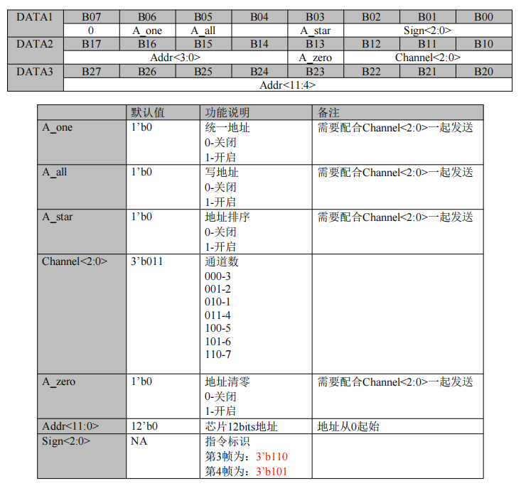  

| 写地址 |  |     |    |  |      |        |        |        |
|-------|----|--------|-------|-----|---------|-------|-----------|-----------|
| DATA1 | B07 | B06    | B05   | B04 | B03     | B02       | B01       | B00       |
|        | 0  | A_one  | A_all |     | A_star  | Sign<2:0>           |
| DATA2 | B17 | B16    | B15   | B14 | B13     | B12       | B11       | B10       |
|       |   Addr<3:0>  |     |     |    | A_zero    | Channel<2:0>          |
| DATA3 | B27 | B26    | B25   | B24 | B23     | B22       | B21       | B20       |
|       |  Addr<11:4>           |

---

| 参数名     | 默认值  | 功能说明                              | 备注                                   |
| -------- | ------ | ------------------------------------- | -------------------------------------- |
| A_one    | 1'b0   | 统一地址<br>0-关闭<br>1-开启          | 需要配合Channel<2:0>一起发送           |
| A_all    | 1'b0   | 写地址<br>0-关闭<br>1-开启            | 需要配合Channel<2:0>一起发送           |
| A_star   | 1'b0   | 地址排序<br>0-关闭<br>1-开启          | 需要配合Channel<2:0>一起发送           |
| Channel<2:0>| 3'b011 | 通道数<br>000-3<br>001-2<br>010-1<br>011-4<br>100-5<br>101-6<br>110-7 |                                        |
| A_zero   | 1'b0   | 地址清零<br>0-关闭<br>1-开启          | 需要配合Channel<2:0>一起发送           |
| Addr<11:0>| 12'b0  | 芯片12bits地址                        | 地址从0起始                            |
| Sign<2:0> | NA     | 指令标识<br>第3帧为：3'b110<br>第4帧为：3'b101 |                                        |

1.  地址位宽：12位地址，范围0-4092；编码规则：通道2高4位=地址bit3~bit0，通道3完整8位=地址bit11~bit4
2.  通道支持：GS8516F支持1-4通道，GS8516E支持1-7通道
3.  时序要求：不同类型配置帧发送间隔≥500ms。即重复写址包与完整写址之间间隔500ms。

#### 分段写地址/地址重复（Pixel_Copy）核心配置
**功能说明**：单组DMX数据重复控制1-16颗级联芯片，仅需1轮4包3通道配置包完成设置。

##### 1. 固定配置包定义
| 包序号 | 3通道数据内容（十六进制） | 核心说明 |
| :---: | :---: | :---: |
| 1 | 0x00, 0x00, 0x00 | 固定全0前导包 |
| 2 | 0x00, 0x00, 0x00 | 固定全0前导包 |
| 3 | 0x06, DATA2, 0x00 | 固定命令码0x06；DATA2低4位=重复次数配置值 |
| 4 | 0x07, DATA2, 0x00 | 固定命令码0x07；DATA2与第3包完全一致 |
- 生效操作：第4包发送完成→间隔5ms→发100us低电平复位

##### 2. 重复次数配置值对应表（DATA2低4位）
| 十六进制值 | 重复次数 | 控制效果 |
| :---: | :---: | :---: |
| 0x00 | 1次 | 1个地址控1颗芯片（默认） |
| 0x01 | 2次 | 1个地址控2颗芯片 |
| 0x02 | 3次 | 1个地址控3颗芯片 |
| 0x03 | 4次 | 1个地址控4颗芯片 |
| 0x04 | 5次 | 1个地址控5颗芯片 |
| 0x05 | 6次 | 1个地址控6颗芯片 |
| 0x06 | 7次 | 1个地址控7颗芯片 |
| 0x07 | 8次 | 1个地址控8颗芯片 |
| 0x08 | 9次 | 1个地址控9颗芯片 |
| 0x09 | 10次 | 1个地址控10颗芯片 |
| 0x0A | 11次 | 1个地址控11颗芯片 |
| 0x0B | 12次 | 1个地址控12颗芯片 |
| 0x0C | 13次 | 1个地址控13颗芯片 |
| 0x0D | 14次 | 1个地址控14颗芯片 |
| 0x0E | 15次 | 1个地址控15颗芯片 |
| 0x0F | 16次 | 1个地址控16颗芯片 |

##### 3. 写码示例
###### 示例1：重复8次配置
```
第1包：0x00, 0x00, 0x00
第2包：0x00, 0x00, 0x00
第3包：0x06, 0x07, 0x00
第4包：0x07, 0x07, 0x00
```
###### 示例2：重复16次配置
```
第1包：0x00, 0x00, 0x00
第2包：0x00, 0x00, 0x00
第3包：0x06, 0x0F, 0x00
第4包：0x07, 0x0F, 0x00
```
---
## AB线差分写码双地址4包3数据帧无占说明:GS8527
10位地址支持重复写址(地址计算公式不同)

数据手册写明计算公式，按通道写不满足间隔通道整除会被截断。故舍弃按通道写。

按通道->删除
按灯数->保留
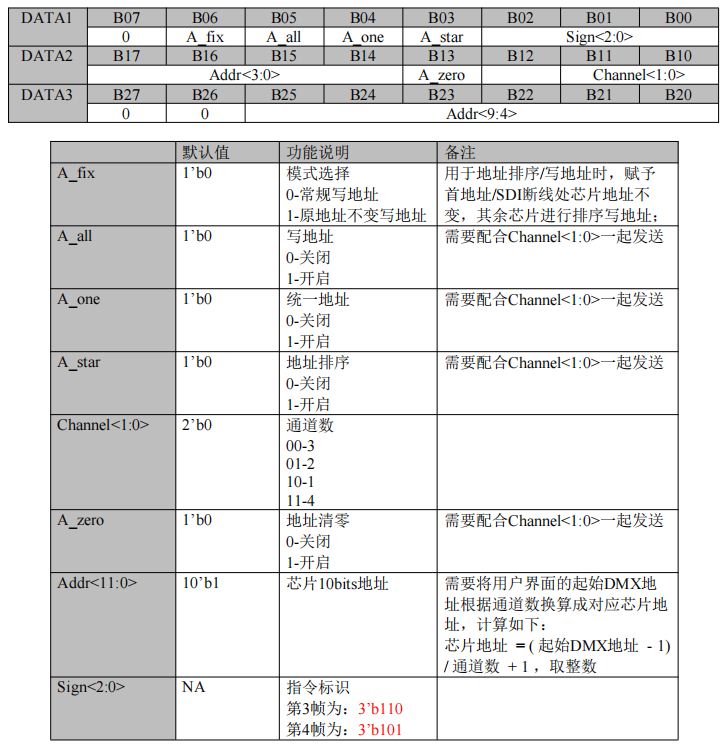
| 写地址 |  |     |    |  |      |        |        |        |
|-------|----|--------|-------|-----|---------|-------|-----------|-----------|
| DATA1 | B07 | B06    | B05   | B04 | B03     | B02       | B01       | B00       |
|        | 0  | A_fix  | A_all |  A_one   | A_star  | Sign<2:0>           |
| DATA2 | B17 | B16    | B15   | B14 | B13     | B12       | B11       | B10       |
|       |   Addr<3:0>               |||| A_zero |      |Channel<1:0>          |
| DATA3 | B27 | B26    | B25   | B24 | B23     | B22       | B21       | B20       |
|       |  0  |   0    |Addr<9:4>                                                  |

---
| 参数名         | 默认值   | 功能说明                                                                 | 备注                                                                 |
|----------------|----------|--------------------------------------------------------------------------|----------------------------------------------------------------------|
| A_fix          | 1'b0     | 模式选择<br>0-常规写地址<br>1-原地址不变写地址                            | 用于地址排序/写地址时，赋予首地址/SDI断线处芯片地址不变，其余芯片进行排序写地址 |
| A_all          | 1'b0     | 写地址<br>0-关闭<br>1-开启                                              | 需要配合Channel<1:0>一起发送                                          |
| A_one          | 1'b0     | 统一地址<br>0-关闭<br>1-开启                                              | 需要配合Channel<1:0>一起发送                                          |
| A_star         | 1'b0     | 地址排序<br>0-关闭<br>1-开启                                              | 需要配合Channel<1:0>一起发送                                          |
| Channel<1:0>   | 2'b0     | 通道数<br>00-3<br>01-2<br>10-1<br>11-4                                  |                                                                      |
| A_zero         | 1'b0     | 地址清零<br>0-关闭<br>1-开启                                              | 需要配合Channel<1:0>一起发送                                          |
| Addr<11:0>     | 10'b1    | 芯片10bits地址                                                           | 需要将用户界面的起始DMX地址根据通道数换算成对应芯片地址，计算如下：<br>芯片地址 = (起始DMX地址 - 1) / 通道数 + 1，取整数 |
| Sign<2:0>      | NA       | 指令标识<br>第3帧为：3'b110<br>第4帧为：3'b101                           |                                                                      |

#### 1. 正常写入DMX地址（需2轮配置包）
##### 第一轮：地址配置包
| 包序号 | 3通道数据内容（十六进制） | 核心说明 |
| :---: | :---: | :---: |
| 第1包 | 0x00, 0x00, 0x00 | 固定全0前导包，不可修改 |
| 第2包 | 0x00, 0x00, 0x00 | 固定全0前导包，不可修改 |
| 第3包 | 0x0E, DATA2, DATA3 | 地址配置命令包1，0x0E为固定命令码，DATA2=地址低4位+通道模式位，DATA3=地址高6位，A_zero位固定为0 |
| 第4包 | 0x0D, DATA2, DATA3 | 地址配置命令包2，与第3包DATA2、DATA3完全一致，仅命令码为0x0D |
- 包发送后操作：第四包发送完成→间隔5ms→发送100us复位→等待1s

##### 第二轮：地址确认包
| 包序号 | 3通道数据内容（十六进制） | 核心说明 |
| :---: | :---: | :---: |
| 第1包 | 0x00, 0x00, 0x00 | 固定全0前导包，不可修改 |
| 第2包 | 0x00, 0x00, 0x00 | 固定全0前导包，不可修改 |
| 第3包 | 0x26, DATA2, DATA3 | 地址确认命令包1，0x26为固定命令码，DATA2、DATA3与第一轮完全一致 |
| 第4包 | 0x25, DATA2, DATA3 | 地址确认命令包2，与第3包DATA2、DATA3完全一致，仅命令码为0x25 |
- 包发送后操作：第四包发送完成→间隔5ms→发送100us复位→等待2s，写码完成

#### 2. 统一地址写入（仅需1轮配置包）
| 包序号 | 3通道数据内容（十六进制） | 核心说明 |
| :---: | :---: | :---: |
| 第1包 | 0x00, 0x00, 0x00 | 固定全0前导包，不可修改 |
| 第2包 | 0x00, 0x00, 0x00 | 固定全0前导包，不可修改 |
| 第3包 | 0x16, DATA2, DATA3 | 统一地址命令包1，0x16为固定命令码，DATA2=地址低4位+通道模式位，DATA3=地址高6位 |
| 第4包 | 0x15, DATA2, DATA3 | 统一地址命令包2，与第3包DATA2、DATA3完全一致，仅命令码为0x15 |
- 包发送后操作：第四包发送完成→间隔5ms→发送100us复位→等待2s，整串芯片统一地址写入完成

#### 3. 地址重复写入（Pixel_Copy）
**功能说明**：单组DMX数据重复控制1-16颗级联芯片，配置前需执行前置灭灯操作：发送3包4092通道帧的灭灯数据（即全0），每包间隔10ms;然后3包发送完空闲等待50ms再发送1轮4包3通道配置包完成设置。
|地址重复|||||||||
|------|-----|-----|-----|-----|-----|-----|-----|-----|
| | B07 | B06 | B05 | B04 | B03 | B02 | B01 | B00 |
| DATA 1 | 0 | 0 | 0 | 0 | 1 | **Sign<2:0>** | | |
|  | B17 | B16 | B15 | B14 | B13 | B12 | B11 | B10 |
| DATA 2| 0 | 0 | 0 | 0 | **Pixel_copy<3:0>** | | | |
| | B27 | B26 | B25 | B24 | B23 | B22 | B21 | B20 |
|DATA 3  | 0 | 0 | 0 | 0 | 0 | 0 | 0 | 0 |

---

| 字段 | 默认值 | 功能说明 | 备注 |
|------|--------|----------|------|
| `Pixel_copy<3:0>` | 4'b0000 | 将一个像素点重复多次<br>0-重复1个<br>1-重复2个<br>2-重复3个<br>……<br>15-重复16个 | - |
| `Sign<2:0>` | NA | 指令标识<br>第3帧为：3'b110<br>第4帧为：3'b001 | - |

##### 固定配置包定义
| 包序号 | 3通道数据内容（十六进制） | 核心说明 |
| :---: | :---: | :---: |
| 第1包 | 0x00, 0x00, 0x00 | 固定全0前导包，不可修改 |
| 第2包 | 0x00, 0x00, 0x00 | 固定全0前导包，不可修改 |
| 第3包 | 0x0E, DATA2, 0x00 | 地址重复命令包1，0x0E为固定命令码，DATA2低4位=Pixel_copy<3:0>（重复次数配置值），DATA3固定为0x00 |
| 第4包 | 0x09, DATA2, 0x00 | 地址重复命令包2，与第3包DATA2完全一致，仅命令码为0x09 |
- 包发送后操作：第四包发送完成→间隔5ms→发送100us复位→等待2s，配置生效

1. 芯片适配约束：GS8527仅支持1/2/3/4通道设置
重复次数配置值对应表和GS8516E、GS8516F一致。

### 六、写码示例（常用场景）
#### 示例1：4通道GS8527芯片，正常写入起始DMX地址311
- 地址换算：芯片地址 = (311 - 1)/4 +1 = 78；10位地址78=二进制0001001110，地址低4位1110，地址高6位000100；通道模式11（4通道）
- 数据拆分：DATA2=0xE3，DATA3=0x04
- 第一轮地址配置包：
```
第1包：0x00, 0x00, 0x00
第2包：0x00, 0x00, 0x00
第3包：0x0E, 0xE3, 0x04
第4包：0x0D, 0xE3, 0x04
```
- 间隔5ms→100us复位→等待1s
- 第二轮地址确认包：
```
第1包：0x00, 0x00, 0x00
第2包：0x00, 0x00, 0x00
第3包：0x26, 0xE3, 0x04
第4包：0x25, 0xE3, 0x04
```
- 间隔5ms→100us复位→等待2s，写码完成

#### 示例2：4通道GS8527芯片，统一地址写入起始DMX地址311
- 地址换算与数据拆分同示例1，DATA2=0xE3，DATA3=0x04
- 统一地址配置包：
```
第1包：0x00, 0x00, 0x00
第2包：0x00, 0x00, 0x00
第3包：0x16, 0xE3, 0x04
第4包：0x15, 0xE3, 0x04
```
- 间隔5ms→100us复位→等待2s，整串芯片统一地址写入完成

#### 示例3：地址重复2次配置（1个地址控2颗芯片）
- 前置操作：发送3帧4092通道灭灯数据，每帧间隔10ms，空闲等待50ms
- 地址重复配置包：
```
第1包：0x00, 0x00, 0x00
第2包：0x00, 0x00, 0x00
第3包：0x0E, 0x01, 0x00
第4包：0x09, 0x01, 0x00
```
- 间隔5ms→100us复位→等待2s，配置生效

## AB线差分写码双地址4包3数据帧无占说明:GS8521：GS8521BC、GS8521E、GS8521D
12位地址不支持重复写址(地址计算公式不同)

数据手册写明计算公式，按通道写不满足间隔通道整除会被截断。故舍弃按通道写。

按通道->删除
按灯数->保留

均为7通道IC。对比GS8527差异为不支持重复写址。
Channel<1:0>	3'b0对应  
000-3
001-2
010-1
011-4
100-5
110-6
111-7

## AB线差分写码双地址5包3数据帧无占说明:GS512系列(GS8511/GS8512/GS8513/GS8515/GS8516（GS8516B、GS8516C、GS8516D）、GS8525
12位地址不支持重复写址
### 一、完整写码数据格式
**基础DMX512包格式**：IDLE（空闲高电平0us~1s）→ BREAK（复位低电平≥88us）→ MAB（复位后标记高电平8us~1s）→ START CODE（起始码9bits低电平）→ [START BIT（1bit低电平）+ SLOT通道数据（8bits，低位在前）+ STOP BIT（2bits高电平）]×N → IDLE
**写码配置包完整格式**：连续5包3通道DMX512数据（包间空闲<50ms，可以统一为5ms）→ 等待指定时长生效
- 整体写码流程：正常编址需2轮配置包（地址配置包→地址确认包，顺序不可颠倒）；统一地址仅需1轮配置包即可完成
- 字段结构：单通道数据固定11位 = 1bit起始位（低电平）+ 8bits数据位（低位在前）+ 2bits停止位（高电平）
- 比特率：支持250K/500Kbps可选，默认适配DMX512标准250Kbps
- 关键标识：BREAK=≥88us低电平复位信号；MAB=8us~1s高电平标记；配置包间空闲必须<50ms；所有配置包第1、2、5包固定全0，第3、4包仅命令码不同，配置值完全一致

### 二、核心基础规则
1. 写码方式：基于标准DMX512差分协议，通过控制器软件选择对应芯片型号，支持2种核心编址模式：正常写入DMX地址、统一地址写入
2. 芯片通道限制：GS8512/GS8513仅支持3通道；GS8511为转发芯片，支持1~48通道转发设置；GS8515/GS8516支持1/2/3/4通道，不可超范围设置，否则配置失效
3. 地址规则：芯片起始地址范围0-4092可设，12位地址编码规则为：通道2数据高4位=地址bit3~bit0，通道3数据=地址bit11~bit4
4. 通道模式配置：通道2数据低2位为PWM通道模式配置位，对应关系如下：

| 模式设置（二进制） | 对应通道数 | 支持芯片范围 |
| :---: | :---: | :---: |
| 00 | 3通道 | 全系列，GS8512/GS8513仅支持此模式 |
| 01 | 2通道 | 仅GS8515/GS8516 |
| 10 | 1通道 | 仅GS8515/GS8516 |
| 11 | 4通道 | 仅GS8515/GS8516 |

### 三、写地址核心数据定义
按2种编址模式，分别定义5包的核心数据（以3通道为例，多通道可按规则扩展）：

#### 1. 正常写入DMX地址（需2轮配置包）
##### 第一轮：地址配置包
| 包序号 | 3通道数据内容（十六进制） | 核心说明 |
| :---: | :---: | :---: |
| 第1包 | 0x00, 0x00, 0x00 | 固定全0前导包，不可修改 |
| 第2包 | 0x00, 0x00, 0x00 | 固定全0前导包，不可修改 |
| 第3包 | 0x0E, DATA2, DATA3 | 地址配置命令包1，0x0E为固定命令码，DATA2=通道模式+地址低4位，DATA3=地址高8位 |
| 第4包 | 0x0D, DATA2, DATA3 | 地址配置命令包2，与第3包DATA2、DATA3完全一致，仅命令码为0x0D |
| 第5包 | 0x00, 0x00, 0x00 | 固定全0结束包，不可修改 |
- 包发送后操作：第五包发送完成→持续发送4092通道首灯亮红测试帧→等待2s

##### 第二轮：地址确认包
| 包序号 | 3通道数据内容（十六进制） | 核心说明 |
| :---: | :---: | :---: |
| 第1包 | 0x00, 0x00, 0x00 | 固定全0前导包，不可修改 |
| 第2包 | 0x00, 0x00, 0x00 | 固定全0前导包，不可修改 |
| 第3包 | 0x26, DATA2, DATA3 | 地址确认命令包1，0x26为固定命令码，DATA2、DATA3与第一轮完全一致 |
| 第4包 | 0x25, DATA2, DATA3 | 地址确认命令包2，与第3包DATA2、DATA3完全一致，仅命令码为0x25 |
| 第5包 | 0x00, 0x00, 0x00 | 固定全0结束包，不可修改 |
- 包发送后操作：第五包发送完成→等待2s，写码完成

#### 2. 统一地址写入（仅需1轮配置包）
| 包序号 | 3通道数据内容（十六进制） | 核心说明 |
| :---: | :---: | :---: |
| 第1包 | 0x00, 0x00, 0x00 | 固定全0前导包，不可修改 |
| 第2包 | 0x00, 0x00, 0x00 | 固定全0前导包，不可修改 |
| 第3包 | 0x46, DATA2, DATA3 | 统一地址命令包1，0x46为固定命令码，DATA2=通道模式+地址低4位，DATA3=地址高8位 |
| 第4包 | 0x45, DATA2, DATA3 | 统一地址命令包2，与第3包DATA2、DATA3完全一致，仅命令码为0x45 |
| 第5包 | 0x00, 0x00, 0x00 | 固定全0结束包，不可修改 |
- 包发送后操作：第五包发送完成→等待2s，单颗/整串芯片统一地址写入完成

### 四、完整写码发送步骤
#### 模式1：正常写入DMX地址完整步骤
1. 发送第一轮地址配置包：连续发送5包数据，包间空闲时间<50ms；
2. 第五包发送完成后，持续发送4092通道首灯亮红测试帧时长2s；
3. 发送第二轮地址确认包：连续发送5包数据，配置值与第一轮完全一致，包间空闲时间<50ms；
4. 第五包发送完成后，等待2s，地址写入芯片存储，操作完成；
5. 校验：除GS8511外，地址0亮红色、非0地址亮青色即为写入成功。

#### 模式2：统一地址写入完整步骤
1. 控制器软件勾选「统一地址」选项，选择对应芯片型号，设置目标统一地址与通道数（原起始地址设置失效）；
2. 发送统一地址配置包：连续发送5包数据，包间空闲时间<50ms；
3. 第五包发送完成后，等待2s，单颗/整串芯片统一地址写入完成；
4. 校验：除GS8511外，芯片亮青色即为写入成功。

### 五、写码关键约束与注意事项
1. 芯片适配约束：必须按芯片型号设置通道数，GS8512/GS8513禁止设置3通道以外的模式，否则配置直接失效；GS8511为转发芯片，无写码成功亮灯提示
2. 地址范围约束：起始地址仅支持0-4092，超出范围无法写入芯片
3. 包格式约束：
   - 所有配置包第1、2、5包必须为全0数据，不可修改；
   - 第3、4包的配置值必须完全一致，仅命令码不同，否则芯片校验不通过；
   - 包间空闲时间必须<50ms，否则芯片丢失前导包，写码失败；
4. 时序约束：正常写入地址时，两轮配置包的DATA2、DATA3必须完全一致，不可修改，否则写码失败
5. 等待时长约束：必须严格遵守每轮配置后的等待时长，不可提前发送下一轮数据，否则芯片无法完成配置存储

### 六、写码示例（常用场景）
#### 示例1：3通道GS8513芯片，正常写入起始地址311
- 地址拆解：12位地址311 = 二进制0001 0011 0111，通道模式00（3通道）；DATA2=0110 0000（0x60），DATA3=0001 0011（0x13）
- 第一轮地址配置包：
  第1包：0x00, 0x00, 0x00
  第2包：0x00, 0x00, 0x00
  第3包：0x0E, 0x60, 0x13
  第4包：0x0D, 0x60, 0x13
  第5包：0x00, 0x00, 0x00
- 发送完成→持续发送首灯亮红测试帧→等待2s
- 第二轮地址确认包：
  第1包：0x00, 0x00, 0x00
  第2包：0x00, 0x00, 0x00
  第3包：0x26, 0x60, 0x13
  第4包：0x25, 0x60, 0x13
  第5包：0x00, 0x00, 0x00
- 发送完成→等待2s，芯片亮青色即为写入成功

#### 示例2：2通道GS8516芯片，统一写入起始地址311
- 地址拆解：12位地址311 = 二进制0001 0011 0111，通道模式01（2通道）；DATA2=0110 0001（0x61），DATA3=0001 0011（0x13）
- 统一地址配置包：
  第1包：0x00, 0x00, 0x00
  第2包：0x00, 0x00, 0x00
  第3包：0x46, 0x61, 0x13
  第4包：0x45, 0x61, 0x13
  第5包：0x00, 0x00, 0x00
- 发送完成→等待2s，整串芯片亮青色即为写入成功

#### 示例3：3通道GS8512芯片，正常写入起始地址0
- 地址拆解：12位地址0 = 二进制0000 0000 0000，通道模式00（3通道）；DATA2=0000 0000（0x00），DATA3=0000 0000（0x00）
- 第一轮地址配置包：
  第1包：0x00, 0x00, 0x00
  第2包：0x00, 0x00, 0x00
  第3包：0x0E, 0x00, 0x00
  第4包：0x0D, 0x00, 0x00
  第5包：0x00, 0x00, 0x00
- 发送完成→持续发送首灯亮红测试帧→等待2s
- 第二轮地址确认包：
  第1包：0x00, 0x00, 0x00
  第2包：0x00, 0x00, 0x00
  第3包：0x26, 0x00, 0x00
  第4包：0x25, 0x00, 0x00
  第5包：0x00, 0x00, 0x00
- 发送完成→等待2s，芯片亮红色即为写入成功

### GS8525芯片
-差异发送完4092个通道数据到第二个地址包5包数据发送间隔为1s，而GS8511/GS8512/GS8513/GS8515/GS8516是2s。