# 星闪入门

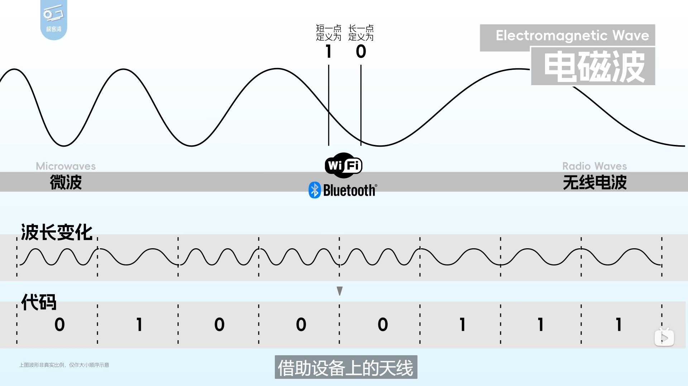
蓝牙通信过程短暂占用一个信道，跳频(加密的)
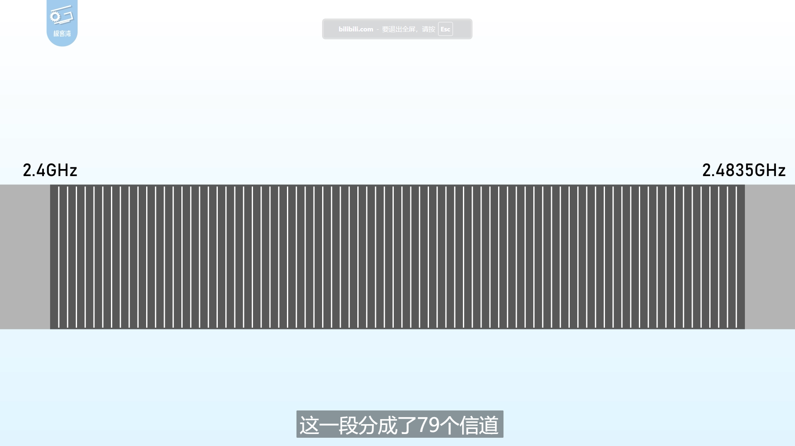
低功耗蓝牙为40个信道  
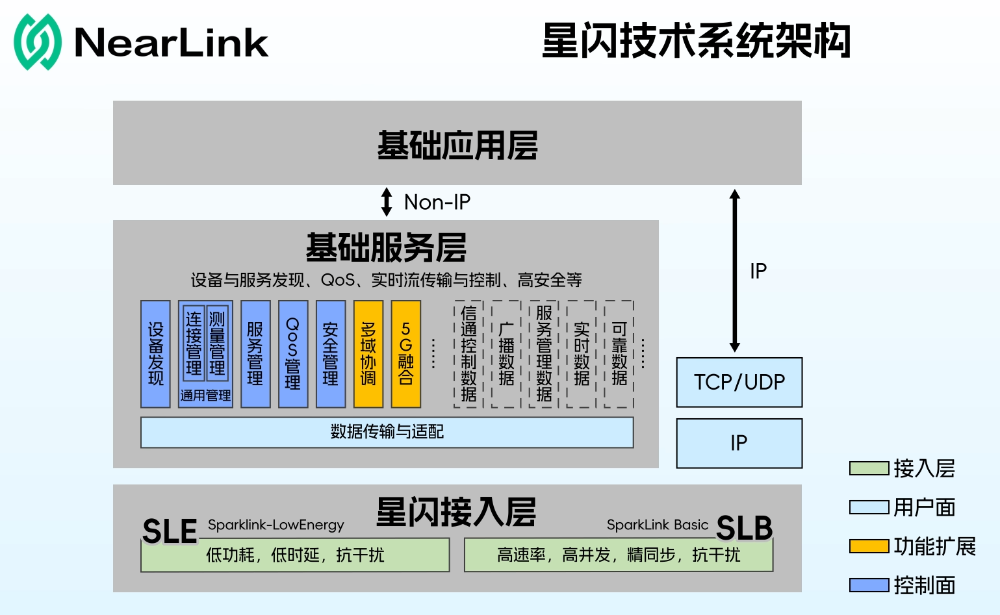


# 烧录步骤
打开工具BurnTool，选择板子  
  
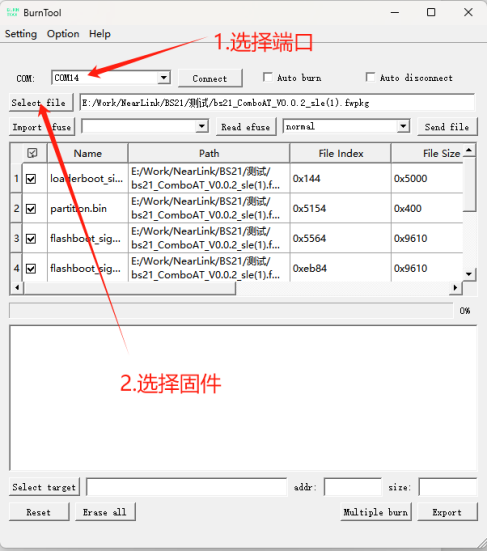   
方法一：  
连接端口并进入烧录模式（若没有固件则自动进入烧录模式），点击Connect后若没有出现Z”CCC等字样，开发板则按下左侧按钮RTS复位进入烧录模式，模组则手动插拔VDD进入烧录模式  
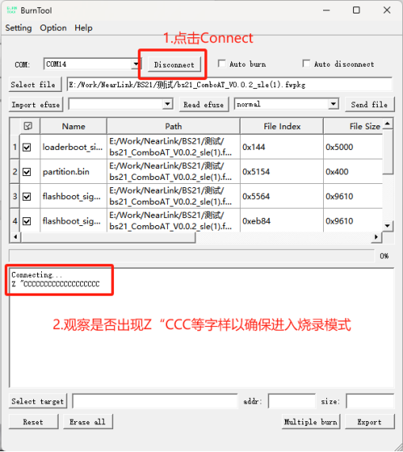  
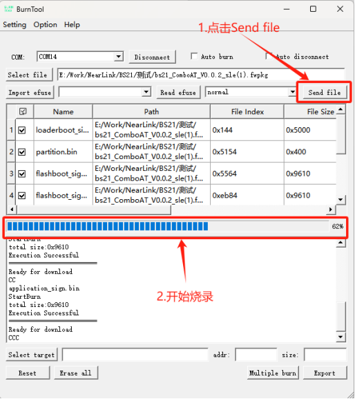  
方法二：  
固件生成目录：Ai-BS21_SDK\tools\pkg\fwpkg\bs21  
勾选“Auto burn”和“Auto disconnect”,点击Connect,按一下开发板的复位按键，即可启动烧录程序。  
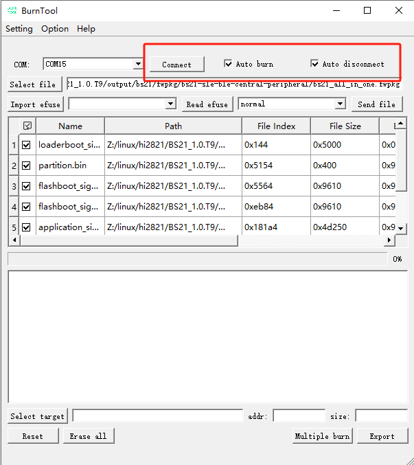

非必要步骤，可修改烧录波特率，最高支持750000  
 

# AT固件指令使用教程
## 检查AT版本并查询版本号
注意输入AT指令需要勾选发送新行（加回车换行）
```
AT    //输入AT查询是否返回OK
AT+GMR//查询版本号
```
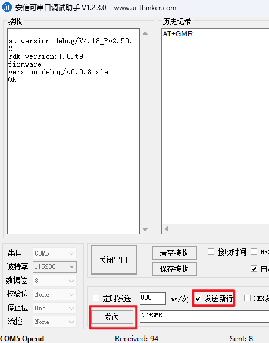
## 显示命令列表
输入`AT+HELP`
```
AT：测试命令
AT+HELP：显示命令列表
AT+RST：软重启
AT+RESTORE：恢复设置
ATE1：开启回显
ATE0：关闭回显
AT+SYSMSG：查询和设置系统消息
AT+GMR：显示版本信息
AT+SLEEP：设置低功耗模式
AT+UARTCFG：查询和设置 AT 串口配置
AT+SOCID：查询芯片 ID
AT+SYSIOMAP：查询和设置 IO 映射
AT+SYSGPIOWRITE：设置 GPIO 输出电平
AT+SYSGPIOREAD：获取 GPIO 电平
AT+SLEMAC：查询和设置 SLE MAC 地址
AT+SLEMODE：查询和设置 SLE 模式
AT+SLERFPWR：查询和设置 SLE 射频功率
AT+SLESTATE：查询 SLE 连接状态
AT+SLEDISCON：断开 SLE 连接
AT+SLEMTU：查询和设置 SLE 最大传输单元
AT+SLESEND：通过 SLE 透明传输发送
AT+SLESENDRAW：通过 SLE 透明传输发送（原始数据）
AT+SLESERUUID：查询和设置 SLE TT 服务器通用唯一识别码
AT+SLETXUUID：查询和设置 SLE 发送通用唯一识别码
AT+SLERXUUID：查询和设置 SLE 接收通用唯一识别码
AT+TRANSENTER：开始 SLE 透明传输
AT+SLENAME：查询和设置 SLE 名称
AT+SLECONINTV：查询和设置 SLE 连接间隔
AT+SLEADVINTV：查询和设置 SLE 广播时间
AT+SLEADVDATA：查询和设置 SLE 广播数据
AT+SLEADVEN：查询和设置 SLE 广播状态
AT+SLESCAN：开始 SLE 扫描
AT+SLECONNECT：开始 SLE 连接
AT+SLEAUTOCON：开始 SLE 自动连接
AT+SLEDISAUTOCON：关闭 SLE 自动连接
AT+NodeMCUTEST：设置开发板测试功能
AT+GPIOTEST：开始 GPIO 测试
AT+LEDTEST：开始测试板 LED 测试
```
## 透传模式
### 从机设置——设置MAC地址及进入从机模式  

    AT+SLEMAC?             //查询MAC地址  
    AT+SLEMAC=abcdef000000 //设置MAC地址为abcdef000000（12位）
    AT+SLEMODE=0           //进入从机模式
    //以下为小熊派设置——设置MAC地址及进入主机模式  
    AT+SETSLEADDR?
    AT+SETSLEADDR=ebef339b8d5d
    AT+SETMODE=0
### 主机设置——设置为主机模式并连接从机  

    AT+SLEMODE=1  //设置为主机模式
    AT+SLESCAN    //进入主机模式后，扫描附近从机
    AT+SLECONNECT=abcdef000000  //连接扫描到的从机MAC地址
    //以下为小熊派设置——设置主机模式  
    AT+SETMODE=1

出现SLE_CONNECT字样，此时会自动进入透传模式
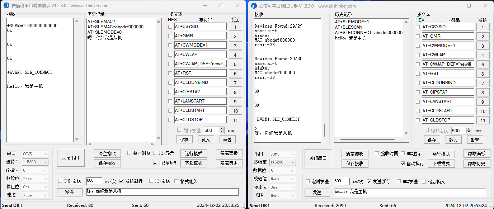
## 点灯
点灯之前要先映射好引脚，指令在 AT 指令手册的最后有:

    AT+SYSIOMAP=38,NC,NC,NC,25,2,26,27,11,12,13,28,29,30,31,NC,0,1,3,NC,NC,4,5,6,9,10,22,NC,N C,14,15,16,NC,NC,NC,NC,23,24,NC
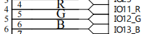

    AT+SYSGPIOWRITE=8,1 //红  
    AT+SYSGPIOWRITE=9,1 //蓝  
    AT+SYSGPIOWRITE=10,1 //绿  
不映射引脚点灯  

    AT+SYSIOMAP=1,11            //红  
    AT+SYSGPIOWRITE=1,1
    AT+SYSIOMAP=1,12            //蓝  
    AT+SYSIOMAP=1,13            //绿
    AT+SYSGPIOWRITE=1,1
# SDK使用教程
板子选"BS21-N1100",开发板选择"BS21-N1100-STANDARD"    
默认编译为`application\demo`工程
修改下图两个文件即可编译其他工程  
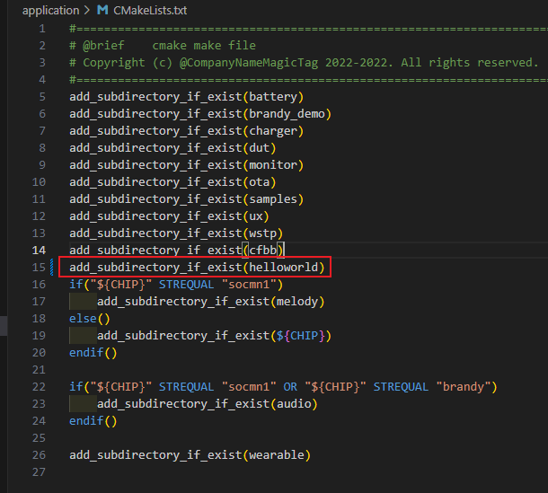
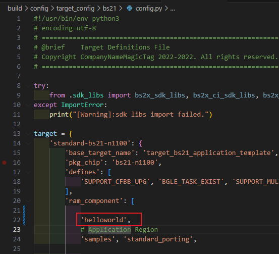

## 使用预设程序

选择点灯案例：点击左侧的“KConfig”,选择Application目录，勾选“Enable Sample”、“Enable the Sample of peripheral”以及需要要编译的Sample名称，并保存。
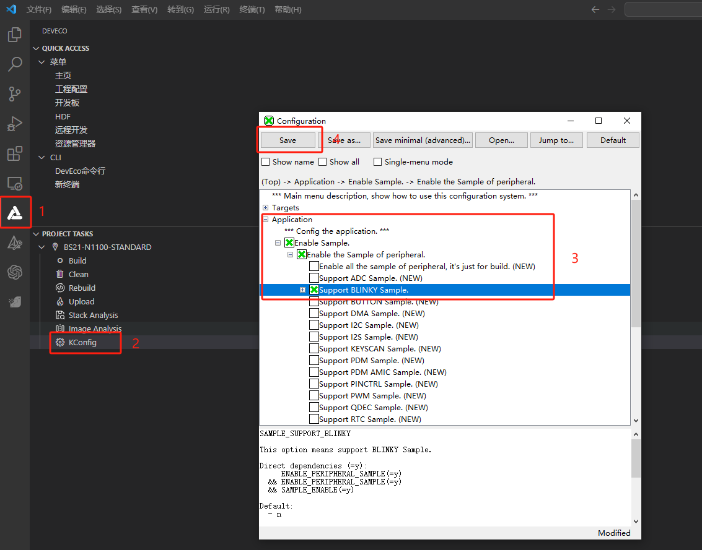  
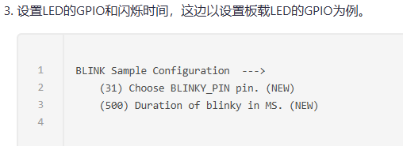  
按下"Save"键保存配置。然后点击左侧“Rebuild”，编译代码。  
关键代码，位于`application\samples\peripheral\blinky\blinky_cmsis.c`
```
static void *blinky_task(const char *arg)
{
    unused(arg);
    uapi_pin_set_mode(CONFIG_BLINKY_PIN, HAL_PIO_FUNC_GPIO);    //设置引脚复用模式为GPIO
    uapi_gpio_set_dir(CONFIG_BLINKY_PIN, GPIO_DIRECTION_OUTPUT);//设置GPIO方向为输出方向
    uapi_gpio_set_val(CONFIG_BLINKY_PIN, GPIO_LEVEL_LOW);       //设置GPIO电平为低电平

    while (1) {
        osal_msleep(CONFIG_BLINKY_DURATION_MS);
        uapi_gpio_toggle(CONFIG_BLINKY_PIN);                    //设置GPIO电平翻转
    }

    return NULL;
}

```

## 新建工程
### 已有工程修改
1. 在 SDK 目录下的 application 中我们可以看到有一个 demo 的工程，该工程为默认编译的工程。既然要新建工程，我们直接 copy 原来的 demo 工程在一个目录下，并且改名为 helloworld，一同将里面的文件名称也改为我们熟悉的 helloworld.c 和 helloworld.h。  
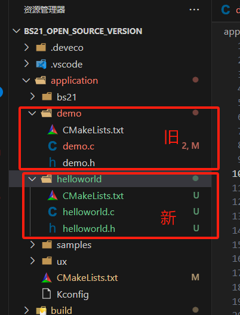  
2. 修改一下.c 和.h 的头文件和宏规范。  
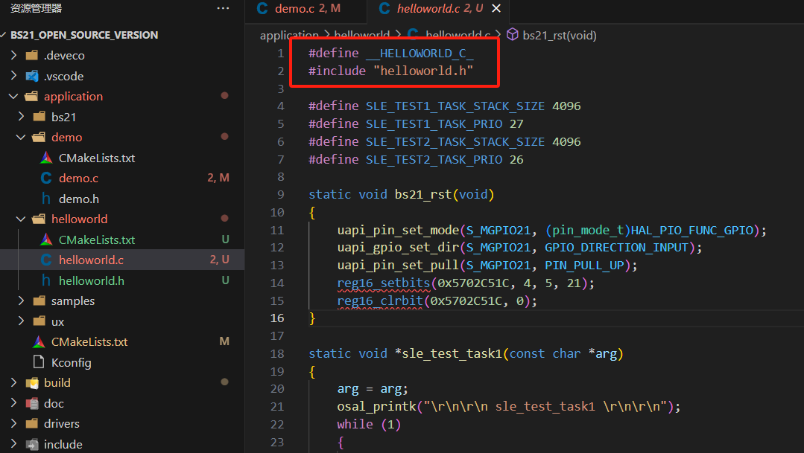  
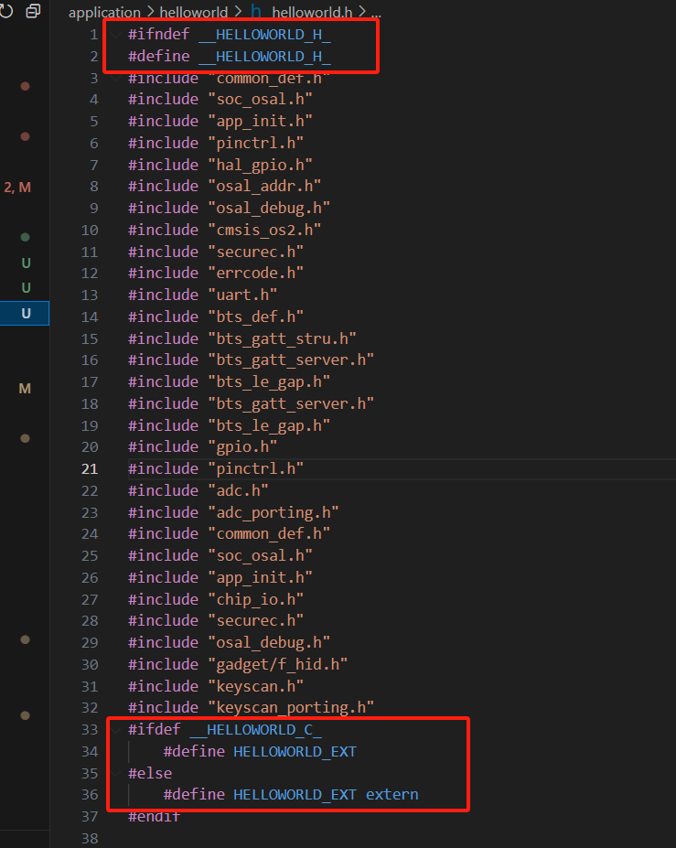  
3. 改一下工程下的 CMakeLists.txt ，把工程命和已有的.c 文件添加进去。 把 application 目录下的 CMakeLists.txt，使用 add_subdirectory_if_exist 添加工程。  
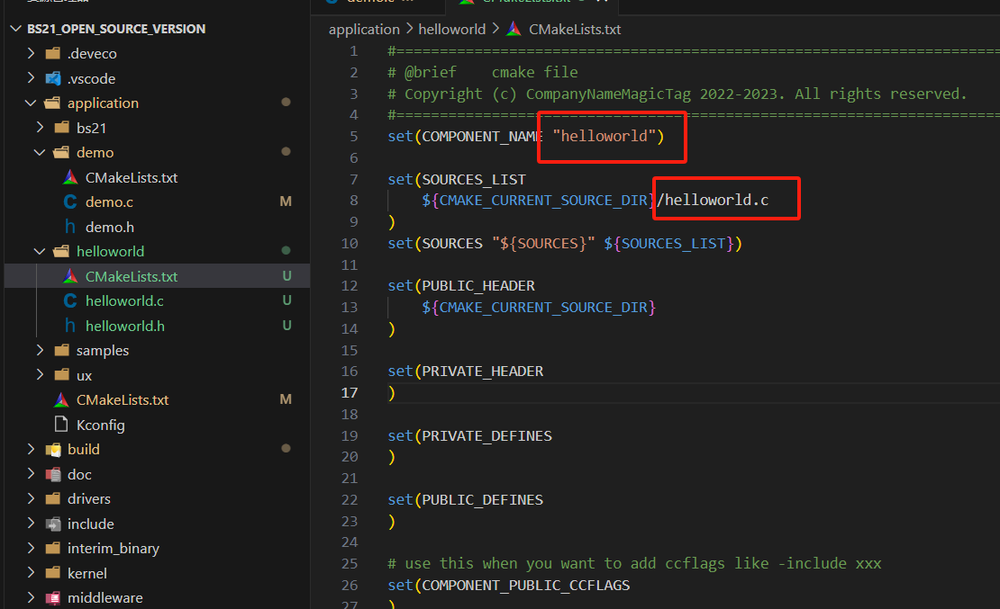  
  
4. 最后，改一下build\config\target_config\bs21\config.py 目录下，ram_component 数组的内容。将我们的工程名添加进去。  
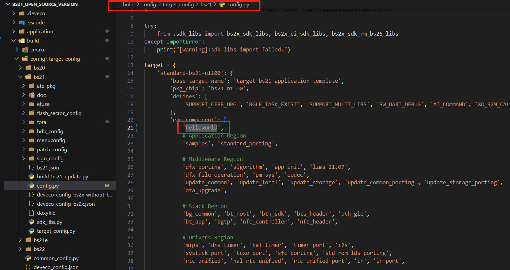  
5. 点击 Upload，出现 Connecting, please reset device...后按下开发板的 RST 按键。等待进度条完成。  
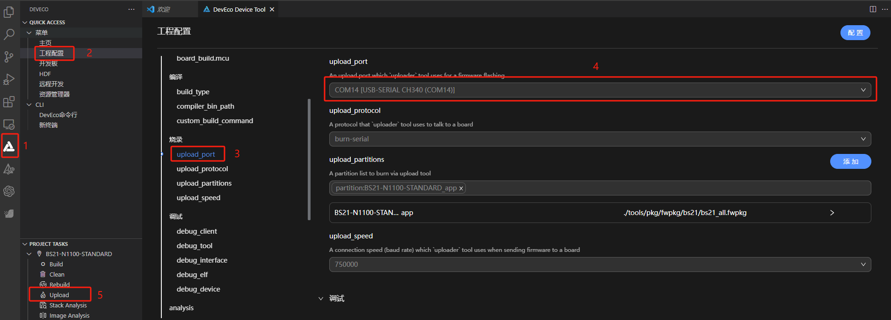  
1. 烧录完成后注意断电复位！插拔 VCC 或者 USB 供电线。  
### 从新开始新建
1. 在 application/samples 中创建一个 demo 代码目录  
   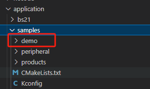
2. 添加用户自定义代码 demo.c、demo.h，同时创建一个空白 CMakeLists.txt 文件。  
   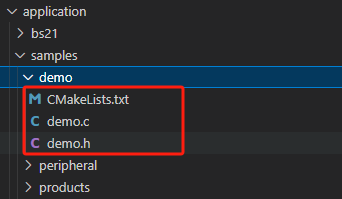
3. 在 CMkakeLists.txt 中为组件模板添加源码文件以及源码头文件路径
```
    set(SOURCES_LIST
        ${CMAKE_CURRENT_SOURCE_DIR}/demo.c
    )

    set(PUBLIC_HEADER_LIST
        ${CMAKE_CURRENT_SOURCE_DIR}
    )

    set(SOURCES "${SOURCES_LIST}" PARENT_SCOPE)
    set(PUBLIC_HEADER "${PUBLIC_HEADER_LIST}" PARENT_SCOPE)

```
在`SOURCES_LIST`中添加.c文件，多个.c文件直接换行加在后面即可；  
在`PUBLIC_HEADER_LIST`中添加.h路径，多个路径直接换行加在后面即可；  
`CMAKE_CURRENT_SOURCE_DIR`表示当前CMkakeLists.txt的路径。  

4. 在demo.c、demo.h中添加自己的业务代码，这里以在demo.c中添加一个创建任务，并在任务中打印消息为例,app_run函数为应用程序的入口函数。
   

```
#include "common_def.h"
#include "osal_debug.h"
#include "cmsis_os2.h"
#include "app_init.h"

#define TASKS_TEST_TASK_STACK_SIZE    0x1000
#define TASKS_TEST_TASK_PRIO          (osPriority_t)(17)
#define TASKS_TEST_DURATION_MS        1000

static void *tasks_test_task(const char *arg)
{
    unused(arg);

    while (1) {
        osal_printk("Hello World  BearPi\r\n");
        osDelay(TASKS_TEST_DURATION_MS);
    }

    return NULL;
}

static void tasks_test_entry(void)
{
    osThreadAttr_t attr;

    attr.name = "TasksTask";
    attr.attr_bits = 0U;
    attr.cb_mem = NULL;
    attr.cb_size = 0U;
    attr.stack_mem = NULL;
    attr.stack_size = TASKS_TEST_TASK_STACK_SIZE;
    attr.priority = TASKS_TEST_TASK_PRIO;

    if (osThreadNew((osThreadFunc_t)tasks_test_task, NULL, &attr) == NULL) {
        /* Create task fail. */
    }
}

/* Run the tasks_test_entry. */
app_run(tasks_test_entry);
```
5. 将demo组件的内的顶层 CMakeLists 添加到其上一层 CMakeLists 下，使构建系统能够执行到 demo 组件的 CMake。  
   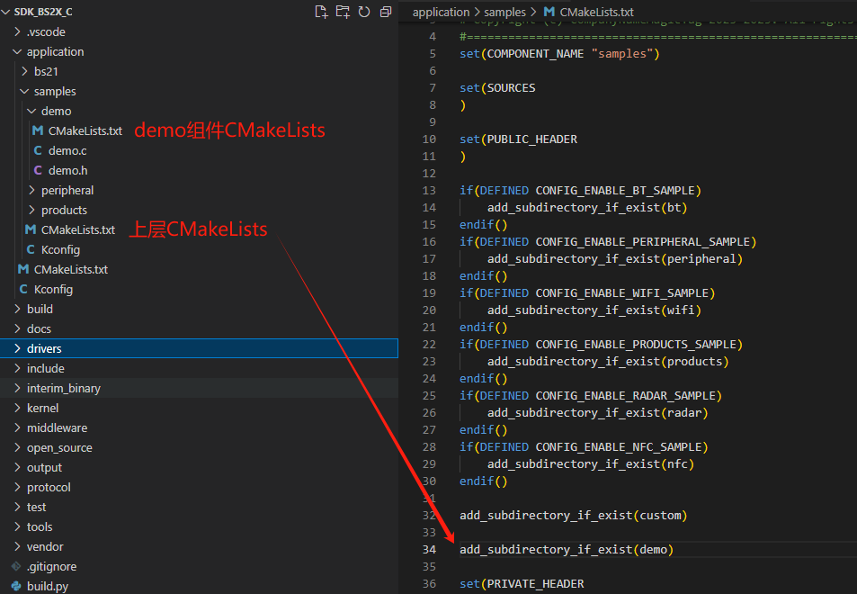
6. 另外也可通过例如CONFIG_ENABLE_MY_SAMPLE宏控制是否编译demo代码,  
   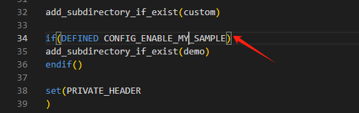  
此功能需要在samples/Kconfig中添加以下代码
```
config ENABLE_MY_SAMPLE
    bool
    prompt "Enable the Sample of demo."
    default n
    depends on SAMPLE_ENABLE
    help
        This option means enable the sample of products.
```
  
7. 点击左侧的“KConfig”,打开配置界面,选中 Enable the Sample of demo并保存即可编译demo工程.  
     
   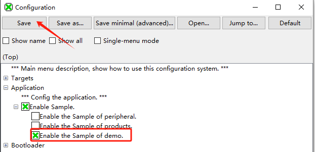

## SLE串口透传
演示如何通过两块开发板实现SLE数据传输测试，A开发板通过串口接收数据，然后通过SLE传输给B开发板，B开发板通过串口将接收到的数据打印出来；同样，B开发板通过串口接收数据，然后通过SLE传输给A开发板，A开发板通过串口将接收到的数据打印出来。在测试中需要一块开发板做为Server端，另外一块开发板做为Client端，两块开发板配对后就可以互发消息了。  
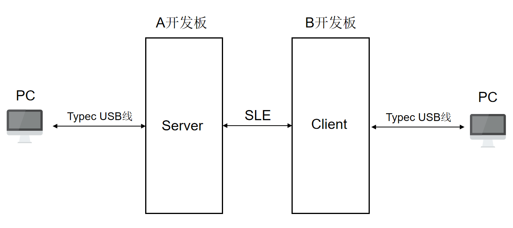  
### 编译 SLE UART Server代码
1. 点击左侧的“KConfig”,打开配置界面。  
  
2. 选择Enable SLE UART Server sample  
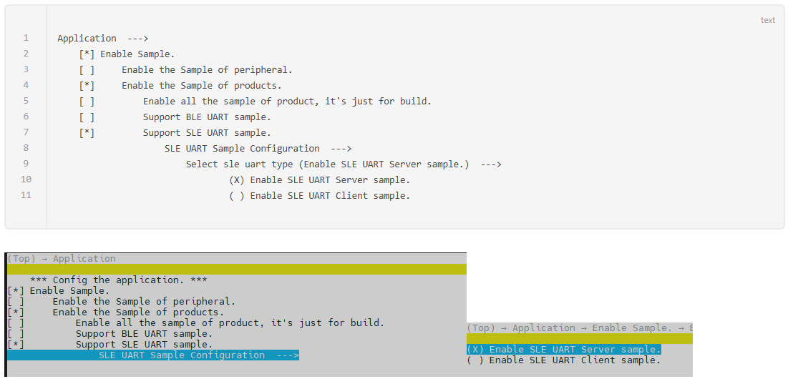  
3. 选择协议  
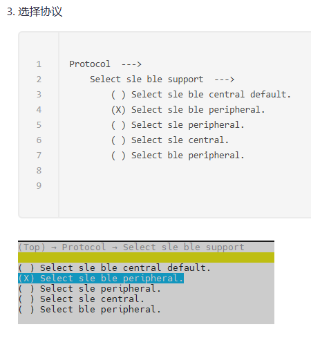  
4. 按下"Save"键保存配置。  
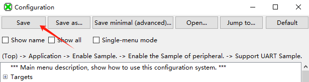  
 关键代码，位于`application\samples\products\sle_uart\sle_uart.c`
```

static void ssaps_server_write_request_cbk(uint8_t server_id, uint16_t conn_id, ssaps_req_write_cb_t *write_cb_para,
    errcode_t status)
{
    osal_printk("%s ssaps write request callback cbk server_id:%x, conn_id:%x, handle:%x, status:%x\r\n",
        SLE_UART_SERVER_LOG, server_id, conn_id, write_cb_para->handle, status);
    if ((write_cb_para->length > 0) && write_cb_para->value) {
        osal_printk("\n sle uart recived data : %s\r\n", write_cb_para->value);
        uapi_uart_write(CONFIG_SLE_UART_BUS, (uint8_t *)write_cb_para->value, write_cb_para->length, 0); //将服务端接收到的数据通过UART发送出来
    }
}


static void sle_uart_server_read_int_handler(const void *buffer, uint16_t length, bool error)
{
    unused(error);
    if (sle_uart_client_is_connected()) {
#ifdef CONFIG_SAMPLE_SUPPORT_LOW_LATENCY_TYPE
    g_buff_data_valid = 1;
    g_uart_buff_len = 0;
    (void)memcpy_s(g_buff, SLE_UART_SERVER_SEND_BUFF_MAX_LEN, buffer, length);
    g_uart_buff_len = length;
#else
    sle_uart_server_send_report_by_handle(buffer, length);                          //将UART中断回调接收到的数据发送给客户端
#endif
    } else {
        osal_printk("%s sle client is not connected! \r\n", SLE_UART_SERVER_LOG);
    }
}

static void *sle_uart_server_task(const char *arg)
{
    ...

    sle_uart_server_init(ssaps_server_read_request_cbk, ssaps_server_write_request_cbk);    //初始化服务端并注册接收中断回调

    ...
    errcode_t ret = uapi_uart_register_rx_callback(CONFIG_SLE_UART_BUS,                     //注册UART中断回调
                                                UART_RX_CONDITION_FULL_OR_SUFFICIENT_DATA_OR_IDLE,
                                                1, sle_uart_server_read_int_handler);
    ...
}

```
5. 编译烧录程序，烧录完成后，按下开发板的 RST 按键。等待进度条完成。  
### 编译 SLE UART Client代码
1. 点击左侧的“KConfig”,打开配置界面。  
  
2. 选择Enable SLE UART Client sample  
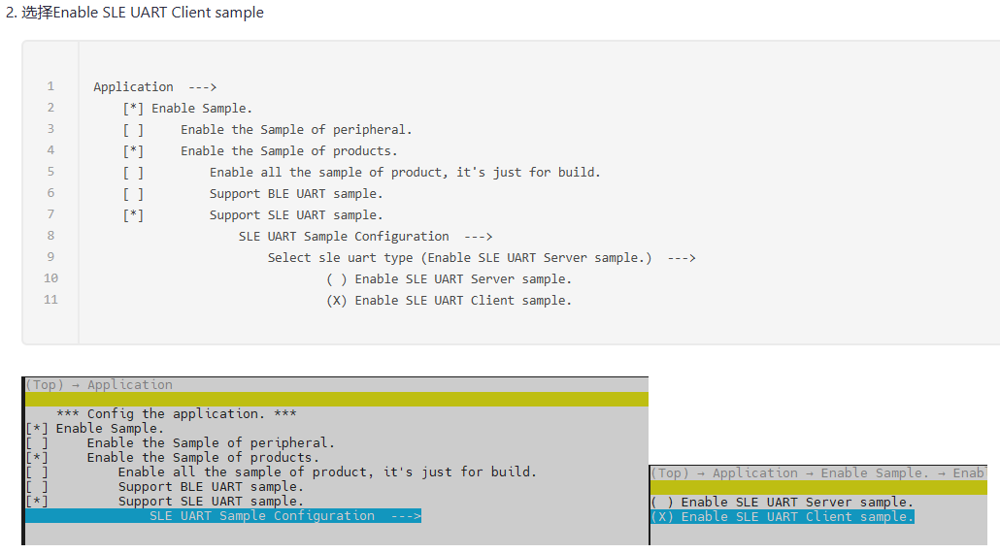  
3. 选择协议  
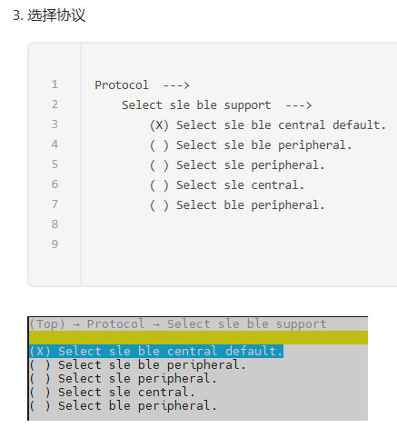  
4. 按下"Save"键保存配置。  
  
关键代码，位于`application\samples\products\sle_uart\sle_uart.c`
```
void sle_uart_notification_cb(uint8_t client_id, uint16_t conn_id, ssapc_handle_value_t *data,
    errcode_t status)
{
    unused(client_id);
    unused(conn_id);
    unused(status);
    osal_printk("\n sle uart recived data : %s\r\n", data->data);
    uapi_uart_write(CONFIG_SLE_UART_BUS, (uint8_t *)(data->data), data->data_len, 0);       //将客户端接收到的数据通过UART发送出来
}

void sle_uart_indication_cb(uint8_t client_id, uint16_t conn_id, ssapc_handle_value_t *data,
    errcode_t status)
{
    unused(client_id);
    unused(conn_id);
    unused(status);
    osal_printk("\n sle uart recived data : %s\r\n", data->data);
    uapi_uart_write(CONFIG_SLE_UART_BUS, (uint8_t *)(data->data), data->data_len, 0);
}

static void sle_uart_client_read_int_handler(const void *buffer, uint16_t length, bool error)
{
    unused(error);
    ssapc_write_param_t *sle_uart_send_param = get_g_sle_uart_send_param();
    uint16_t g_sle_uart_conn_id = get_g_sle_uart_conn_id();
    sle_uart_send_param->data_len = length;
    sle_uart_send_param->data = (uint8_t *)buffer;
    ssapc_write_req(0, g_sle_uart_conn_id, sle_uart_send_param);            //将UART中断回调接收到的数据发送给服务端
}

static void *sle_uart_client_task(const char *arg)
{
    unused(arg);
    /* UART pinmux. */
    uart_init_pin();

    /* UART init config. */
    uart_init_config();

    uapi_uart_unregister_rx_callback(CONFIG_SLE_UART_BUS);
    errcode_t ret = uapi_uart_register_rx_callback(CONFIG_SLE_UART_BUS,             //注册UART中断回调
                                                UART_RX_CONDITION_FULL_OR_SUFFICIENT_DATA_OR_IDLE,
                                                1, sle_uart_client_read_int_handler);
    sle_uart_client_init(sle_uart_notification_cb, sle_uart_indication_cb);         //初始化客户端并注册接收中断回调
    
    if (ret != ERRCODE_SUCC) {
        osal_printk("Register uart callback fail.");
        return NULL;
    }

    return NULL;
}

```
5. 编译烧录程序，烧录完成后，按下开发板的 RST 按键。等待进度条完成。  

### 测试
烧录固件后先启动server设备,再启动client设备，在串口工具的输入框中输入数据并发送，测试server和client设备之间的数据收发，如下图所示。
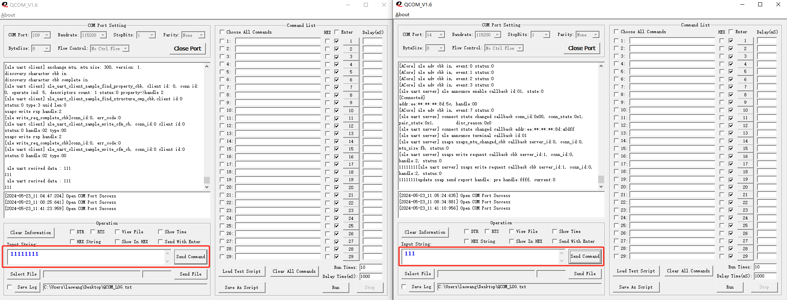

## BLE串口透传
该教程演示如何通过两块开发板实现BLE数据传输测试，A开发板通过串口接收数据，然后通过BLE传输给B开发板，B开发板通过串口将接收到的数据打印出来；同样，B开发板通过串口接收数据，然后通过BLE传输给A开发板，A开发板通过串口将接收到的数据打印出来。在测试中需要一块开发板做为Server端，另外一块开发板做为Client端，两块开发板配对后就可以互发消息了。
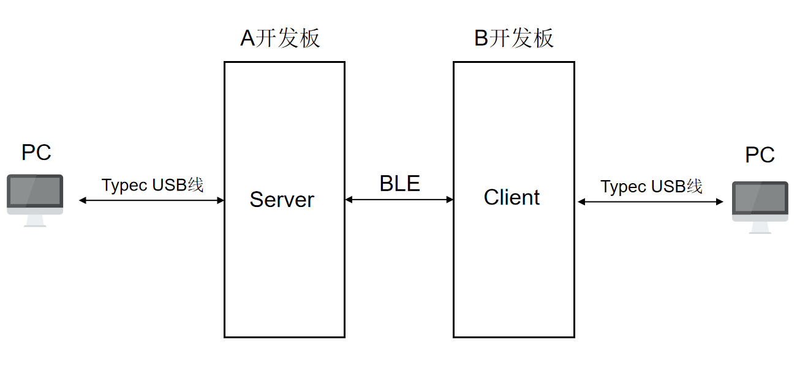
### 编译 BLE UART Server代码
与SLE串口透传一致，只需在Kconfig中选择Enable BLE UART Server sample即可。  
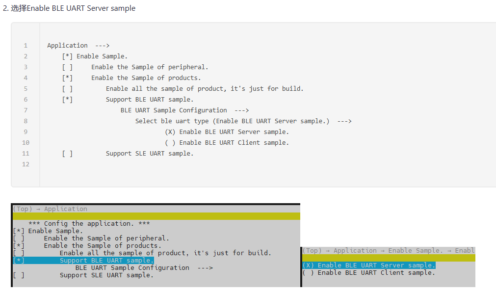  
关键代码，位于`application\samples\products\ble_uart\ble_uart.c`
```
static void *ble_uart_server_task(const char *arg)
{
    unused(arg);
    ble_uart_server_init();                                                     //初始化服务端
    errcode_t ret = uapi_uart_register_rx_callback(CONFIG_BLE_UART_BUS,         //注册uart中断回调 
                                                UART_RX_CONDITION_FULL_OR_SUFFICIENT_DATA_OR_IDLE,
                                                1, ble_uart_read_int_handler);
    if (ret != ERRCODE_SUCC) {
        osal_printk("Register uart callback fail.");
        return NULL;
    }
    while (1) {
        msg_data_t msg_data = { 0 };
        int msg_ret = osal_msg_queue_read_copy(mouse_msg_queue, &msg_data, &msg_rev_size, OSAL_WAIT_FOREVER);
        if (msg_ret != OSAL_SUCCESS) {
            osal_printk("msg queue read copy fail.");
            if (msg_data.value != NULL) {
                osal_vfree(msg_data.value);
            }
            continue;
        }
        if (msg_data.value != NULL) {
            ble_uart_server_send_input_report(msg_data.value, msg_data.value_len);  //向客户端发送数据
            osal_vfree(msg_data.value);
        }
    }
    return NULL;
}

```
### 编译 BLE UART Client代码
在Kconfig中选择Enable BLE UART Client sample即可。  
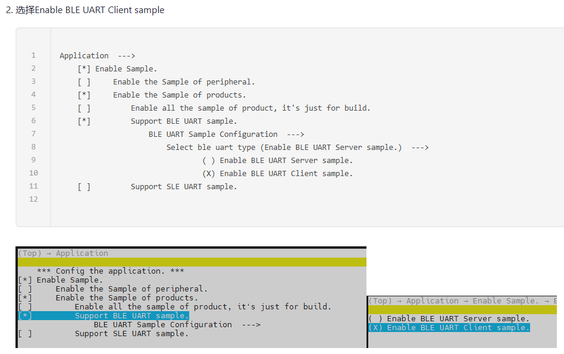  
关键代码，位于`application\samples\products\ble_uart\ble_uart.c`
```
static void *ble_uart_client_task(const char *arg)
{
    unused(arg);
    osal_printk("ble_uart_client_task entry.");
    ble_uart_client_init();                                                 //初始化BLE客户端
    errcode_t ret = uapi_uart_register_rx_callback(CONFIG_BLE_UART_BUS,     //注册uart中断回调
                                                UART_RX_CONDITION_FULL_OR_SUFFICIENT_DATA_OR_IDLE,
                                                1, ble_uart_read_int_handler);
    if (ret != ERRCODE_SUCC) {
        osal_printk("Register uart callback fail.");
        return NULL;
    }
    while (1) {
        msg_data_t msg_data = { 0 };
        int msg_ret = osal_msg_queue_read_copy(mouse_msg_queue, &msg_data, &msg_rev_size, OSAL_WAIT_FOREVER);
        if (msg_ret != OSAL_SUCCESS) {
            osal_printk("msg queue read copy fail.");
            if (msg_data.value != NULL) {
                osal_vfree(msg_data.value);
            }
            continue;
        }
        if (msg_data.value != NULL) {
            uint16_t write_handle = ble_uart_get_write_vlaue_handle();
            ble_uart_client_write_cmd(msg_data.value, msg_data.value_len, write_handle);//向服务端发送数据
            osal_vfree(msg_data.value);
        }
    }
    return NULL;
}

```
## GPIO按键中断测试
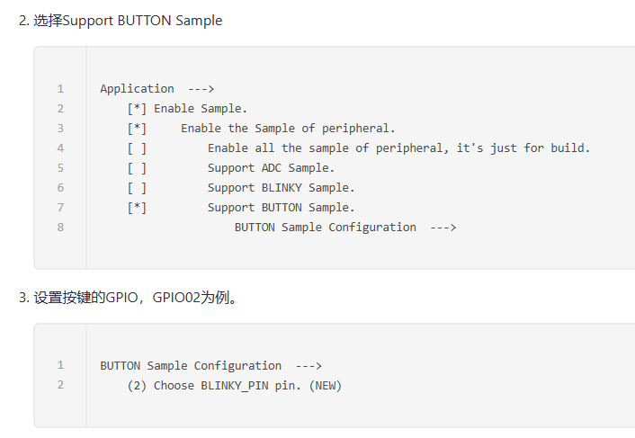  
烧录固件后按下开发的复位按键，用杜邦线将GPIO02与GND短接来模拟按键按下，观察开发板的日志打印。
关键代码，位于`application\samples\peripheral\button\button.c`
```
static void button_entry(void)
{
    uapi_pin_set_mode(CONFIG_BUTTON_PIN, HAL_PIO_FUNC_GPIO);    //设置引脚复用模式为GPIO
    uapi_pin_set_pull(CONFIG_BUTTON_PIN, PIN_PULL_TYPE_UP);     //设置GPIO为上拉模式
    uapi_gpio_set_dir(CONFIG_BUTTON_PIN, GPIO_DIRECTION_INPUT); //设置GPIO方向为输入方向   
    uapi_gpio_register_isr_func(CONFIG_BUTTON_PIN, GPIO_INTERRUPT_DEDGE, gpio_callback_func);//注册GPIO中断回调  
}

```
## ADC采样测试
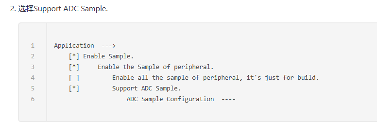  
### Hi2821
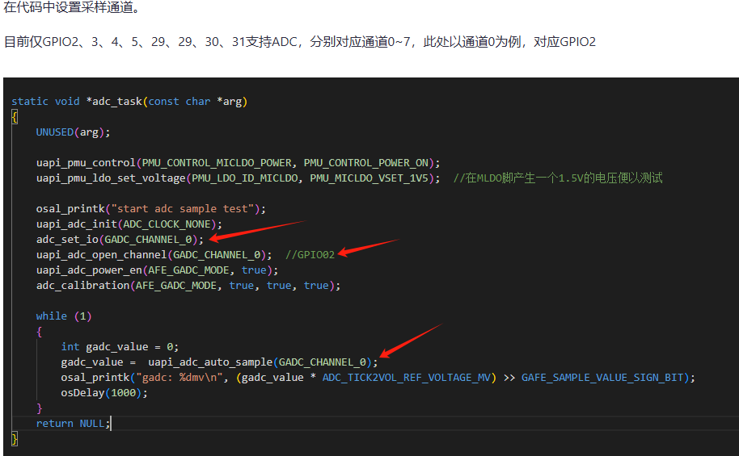  
### Hi3863
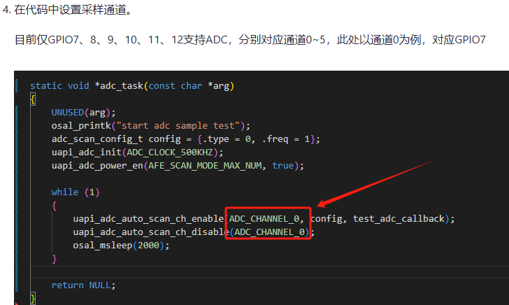  
关键代码，位于`application\samples\peripheral\adc\adc_demo.c`
```
static void *adc_task(const char *arg)
{
    UNUSED(arg);
    osal_printk("start adc sample test");
    adc_scan_config_t config = {.type = 0, .freq = 1};
    uapi_adc_init(ADC_CLOCK_500KHZ);                    //初始化ADC
    uapi_adc_power_en(AFE_SCAN_MODE_MAX_NUM, true);     //使能ADC
    
    while (1)
    {
        uapi_adc_auto_scan_ch_enable(ADC_CHANNEL_0, config, test_adc_callback); //使能ADC通道中断
        uapi_adc_auto_scan_ch_disable(ADC_CHANNEL_0);                           //去使能ADC通道中断
        osal_msleep(2000);
    }
    
    return NULL;
}

```
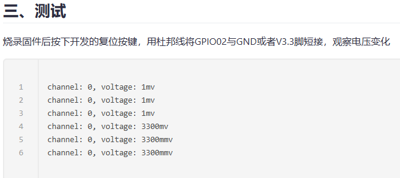
## DMA内存访问测试
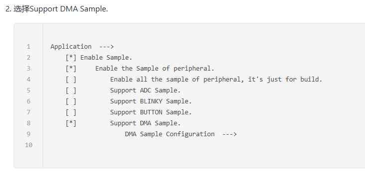  
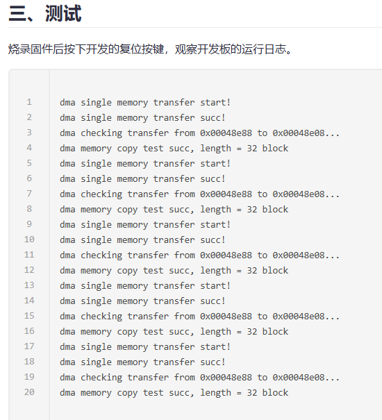  
## I2C主从数据传输测试
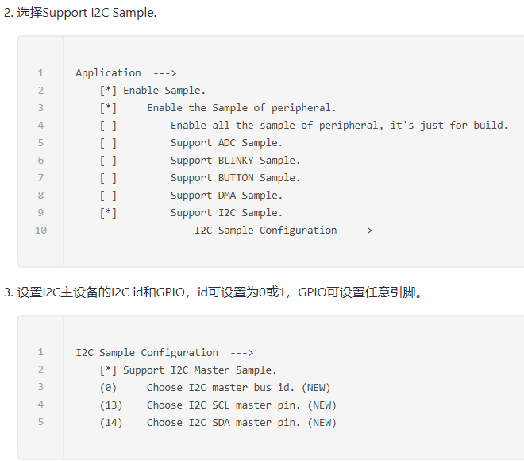  
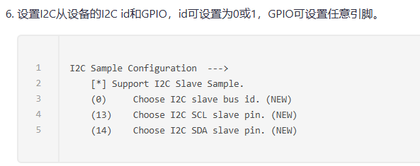  
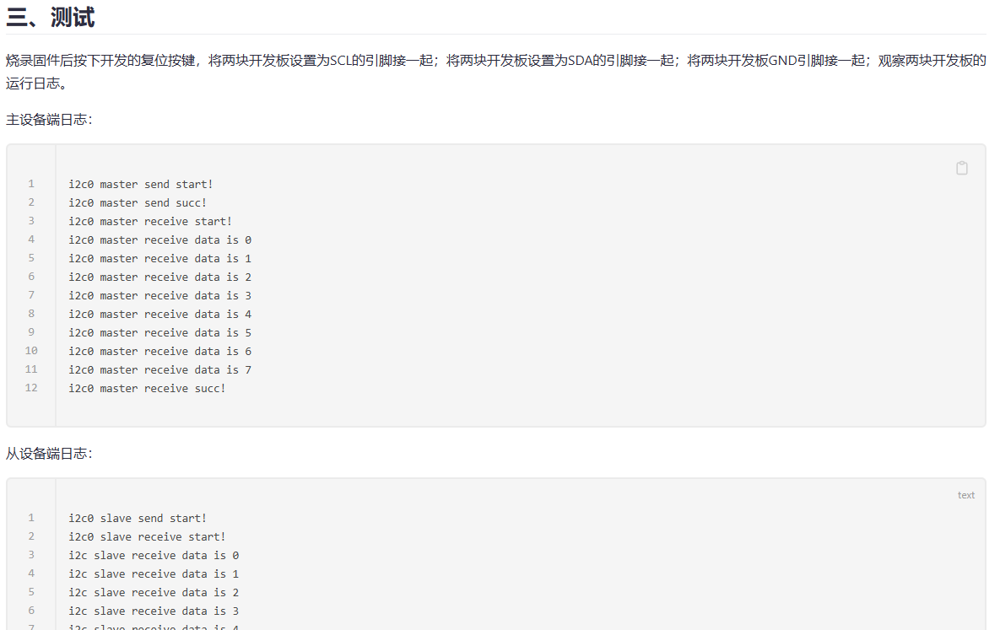  
关键代码，位于`application\samples\peripheral\i2c\i2c_master_demo.c`  
```
static void *i2c_master_task(const char *arg)
{
    unused(arg);

    uint32_t baudrate = I2C_SET_BAUDRATE;
    uint8_t hscode = I2C_MASTER_ADDR;

    /* I2C master init config. */

    app_i2c_init_pin();                                                   //设置引脚复用为I2C
    uapi_i2c_master_init(CONFIG_I2C_MASTER_BUS_ID, baudrate, hscode);     //初始化I2C  
    .....
    return NULL;
}

```
### I2C 驱动OLED屏幕测试
```
static uint32_t ssd1306_SendData(uint8_t *buffer, uint32_t size)
{
    uint16_t dev_addr = I2C_SLAVE2_ADDR;
    i2c_data_t data = {0};
    data.send_buf = buffer;
    data.send_len = size;
    uint32_t retval = uapi_i2c_master_write(CONFIG_I2C_MASTER_BUS_ID, dev_addr, &data);  //发送I2C数据
    if (retval != 0) {
        printf("I2cWrite(%02X) failed, %0X!\n", data.send_buf[1], retval);
        return retval;
    }
    return 0;
}

```


## I2S主从数据传输测试
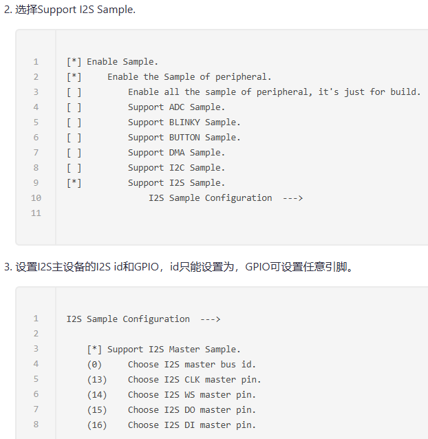  
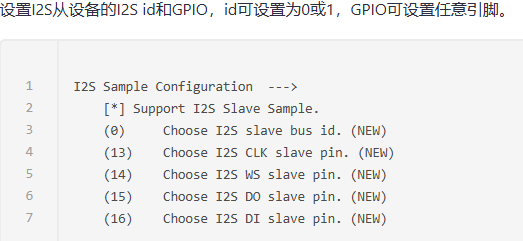  
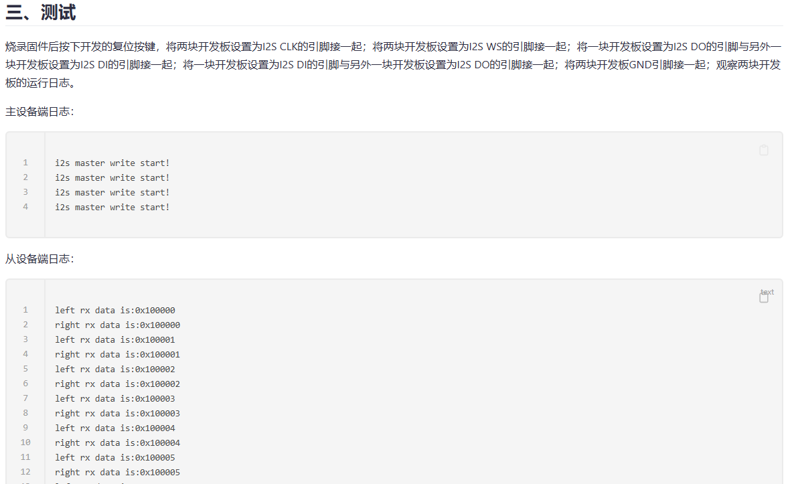  
## SPI主从数据传输测试
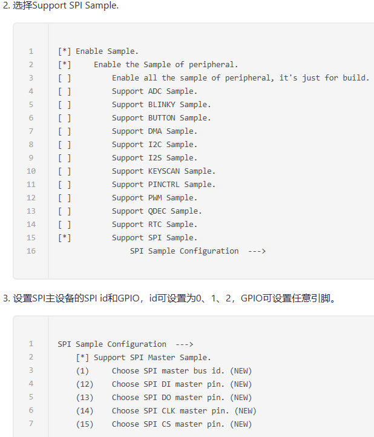  
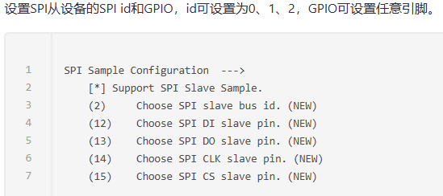  
关键代码，位于`application\samples\peripheral\spi\spi_master_demo.c`  
```
static void *spi_master_task(const char *arg)
{
    unused(arg);
    /* SPI pinmux. */
    app_spi_init_pin();                     //设置引脚复用为SPI

    /* SPI master init config. */
    app_spi_master_init_config();           //初始化SPI

    ...

    return NULL;
}

```
### SPI 驱动OLED屏幕测试
```
static uint32_t ssd1306_SendData(uint8_t *buffer, uint32_t size)
{
    spi_xfer_data_t data = {0};
    data.tx_buff = buffer;
    data.tx_bytes = size;
    uapi_gpio_set_val(CONFIG_SPI_CS_MASTER_PIN, GPIO_LEVEL_LOW);
    uint32_t ret = uapi_spi_master_write(CONFIG_SPI_MASTER_BUS_ID, &data, 0xFFFFFFFF);      //发送SPI数据
    if (ret != 0) {
        printf("spi = %0x master send failed\r\n", ret);
        return ret;
    }
    osal_mdelay(1);
    uapi_gpio_set_val(CONFIG_SPI_CS_MASTER_PIN, GPIO_LEVEL_HIGH);
    return 0;
}

```
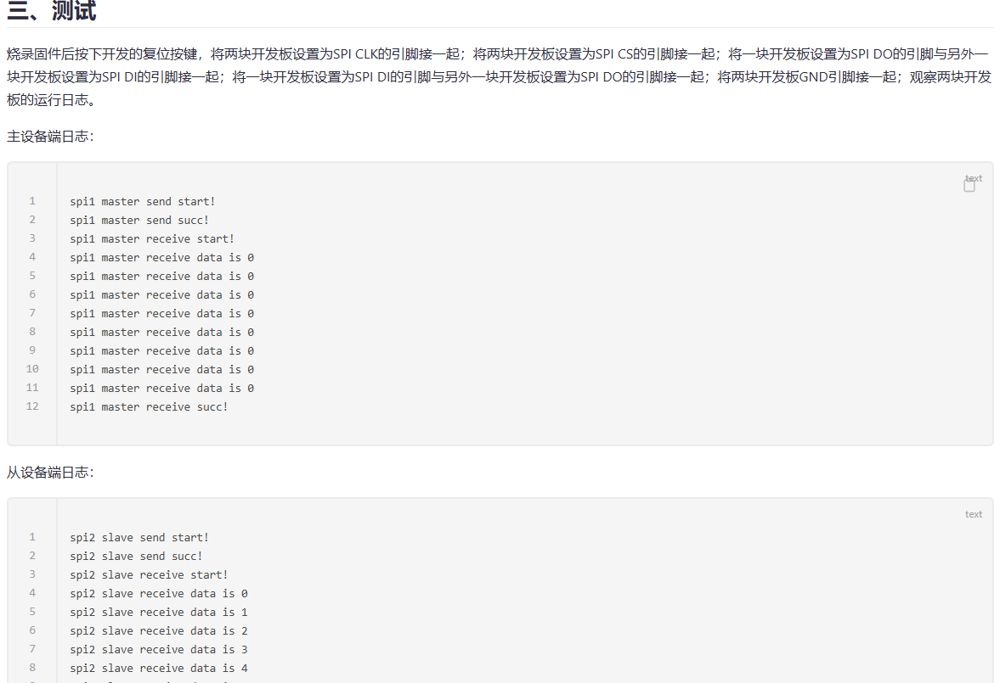  


## KEYSCAN矩阵键盘扫描测试
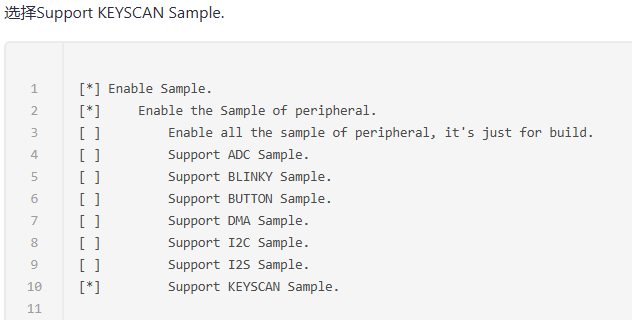  
可自行修改行列对应的GPIO以及键值  
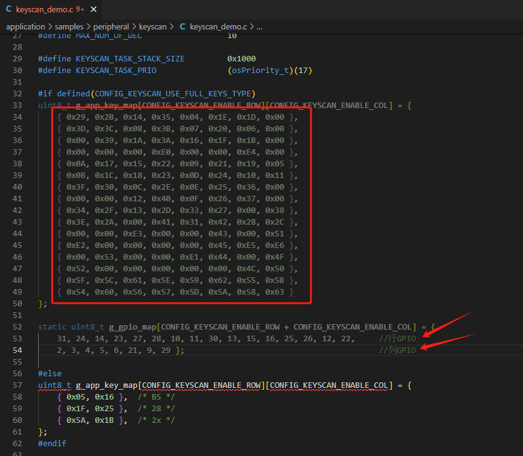  
烧录固件后按下开发的复位按键，任意行GPIO和列GPIO短接，串口日志中会打印对应的键值，当键值为0时不会打印。  
```
keyscan register callback start!
keyscan register callback succ!
keyscan enable start!
keyscan enable start succ!
[pm_sys]pm_sys_entry.
KEY val: 0x29
KEY val: 0x2B
KEY val: 0x14
KEY val: 0x35
KEY val: 0x04
```
## PWM输出测试
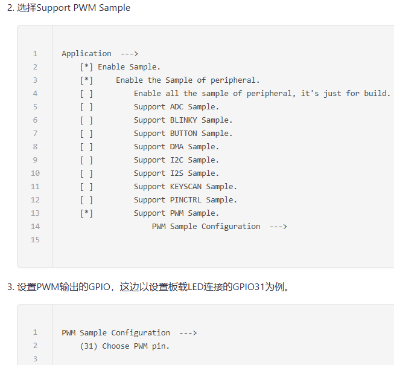  
可在代码中修改高低电平时间，已达到输出不同占空比的PWM波  
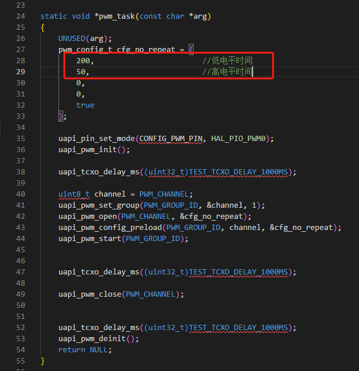  
关键代码，位于`application\samples\peripheral\pwm\pwm_demo.c`
```
static void *pwm_task(const char *arg)
{
    UNUSED(arg);
    pwm_config_t cfg_no_repeat = {
        50,     //低电平
        200,    //高电平
        0,
        0,
        true
    };

    uapi_pin_set_mode(PWM_GPIO, PWM_PIN_MODE);  //设置引脚复用模式为PWM
    uapi_pwm_init();                            //初始化PWM 
    uapi_pwm_open(PWM_CHANNEL, &cfg_no_repeat); //开启PWM通道 

    uapi_tcxo_delay_ms((uint32_t)TEST_TCXO_DELAY_1000MS);
    uapi_pwm_unregister_interrupt(PWM_GROUP_ID);//取消注册PWM中断 
    uapi_pwm_register_interrupt(PWM_GROUP_ID, pwm_sample_callback);//注册PWM中断


    uapi_pwm_set_group(PWM_GROUP_ID, 1 << PWM_CHANNEL); //设置PWM通道对应的组 
    uapi_pwm_start(PWM_GROUP_ID);               //开启PWM


    uapi_tcxo_delay_ms((uint32_t)TEST_TCXO_DELAY_1000MS);

    uapi_pwm_close(PWM_CHANNEL);                //关闭PWM


    uapi_tcxo_delay_ms((uint32_t)TEST_TCXO_DELAY_1000MS);
    uapi_pwm_deinit();                          //去初始化PWM
    return NULL;
}

```
## UART数据传输测试
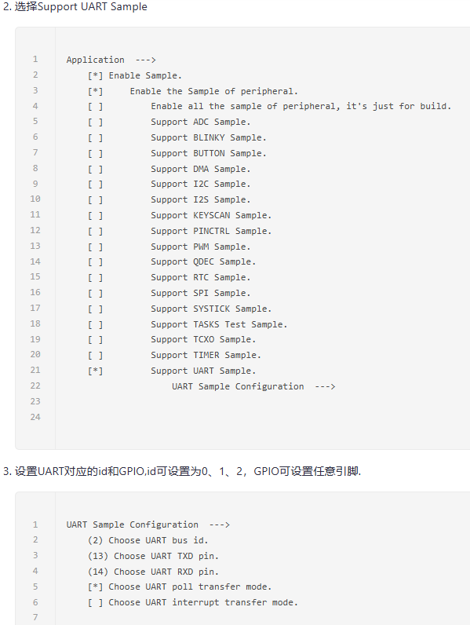  
关键代码，位于`application\samples\peripheral\uart\uart_demo.c`  
```
static void *uart_task(const char *arg)
{
    unused(arg);
    /* UART pinmux. */
    app_uart_init_pin();        //设置引脚复用

    /* UART init config. */
    app_uart_init_config();     //初始化uart

    ......

    while (1) {
        osal_msleep(UART_TASK_DURATION_MS);
#if defined(CONFIG_UART_POLL_TRANSFER_MODE)
        osal_printk("uart%d poll mode send start!, len = %d\r\n", CONFIG_UART_BUS_ID, sizeof(g_app_uart_rx_buff));
        (void)uapi_watchdog_kick();
        if (uapi_uart_write(CONFIG_UART_BUS_ID, g_app_uart_tx_buff, UART_TRANSFER_SIZE, 0) == UART_TRANSFER_SIZE) {     //发送uart数据
            osal_printk("uart%d poll mode send back succ!\r\n", CONFIG_UART_BUS_ID);
        }
        if (uapi_uart_read(CONFIG_UART_BUS_ID, g_app_uart_rx_buff, UART_TRANSFER_SIZE, 0) > 0) {                        //接收uart数据
            osal_printk("uart%d poll mode receive succ!, g_app_uart_rx_buff = %s\r\n", CONFIG_UART_BUS_ID,
                        g_app_uart_rx_buff);
        }

#endif
    ......
    }

    return NULL;
}

```

## 如何修改SLE透传的串口
串口0主要用于烧录+日志打印；

串口1会有协议栈的日志打印，需要配套特殊工具才能看到；

串口2目前SDK中是未使用状态；

所以透传最好是切换到串口2，切换方式如下：

在Kconfig中将UART BUS设置为2，TXD pin和RXD pin 可设置为任意引脚，保存配置后重新编译烧录代码  
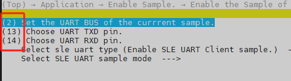  
## SDK 绑定说明
因为星闪SDK目前处于半开源状态，只开放函数接口供用户使用，基于这些接口，你完全可以使用星闪的各种资源。  

SDK 做了绑定之后才开放，这就意味着大家手中的星闪模组或者开发板将不能使用 SDK，因为出厂固件不带绑定信息，导致 SDK 校验失败，导致固件烧录无法运行的情况。  
解决方法：  
我们已经开发了一个绑定信息写入固件，运行固件之后会在模组的内部写入固定的绑定信息，大家只需要烧录一次之后，就能使用 SDK 进行开发。

固件下载地址：https://docs.ai-thinker.com/_media/init_sdk_fw.zip

上述提到的固件写入的是固定的绑定信息，这就意味着大家目前手中的开发板运行了上述固件之后，绑定信息都是一样的。
当然，非安信可生产的星闪(芯片为 bs2821)产品也可以通过这个固件来使用本 SDK，但是这种情况不适合商用！
# 相关链接
安信可星闪SDK开源版本：  
https://gitee.com/Ai-Thinker-Open/Ai-BS21_SDK  
https://github.com/Ai-Thinker-Open/Ai-BS21_SDK  
安信可星闪模组文档：  
https://docs.ai-thinker.com/sle-bs21  
示例代码：  
https://gitee.com/HiSpark/fbb_ws63  
https://gitee.com/hihopeorg_group/near-link  
SDK:http://webapp.hoperun.com:48082/ui/repos/tree/General/hihope-sparklink-artifactory/oh_sdk_20240628.tar.gz
用户名:`developer`
密码:`Nearlink-123`
SDK操作指导:https://gitee.com/hihopeorg_group/near-link/blob/master/OH-SDK/readme.md
星闪技术与西门子PLC通信：  
https://mp.weixin.qq.com/s/Vnh0AFDvqOnr-ZO9t1cokw  
小熊派：  
https://bearpi.cn/core_board/bearpi/pico/h2821/software/%E7%8E%AF%E5%A2%83%E6%90%AD%E5%BB%BAwindows.html  
H2821与H3863区别  
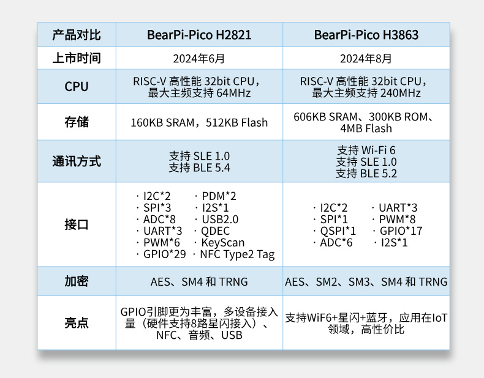  

# H3863
## Wi-Fi STA 连接无线热点测试
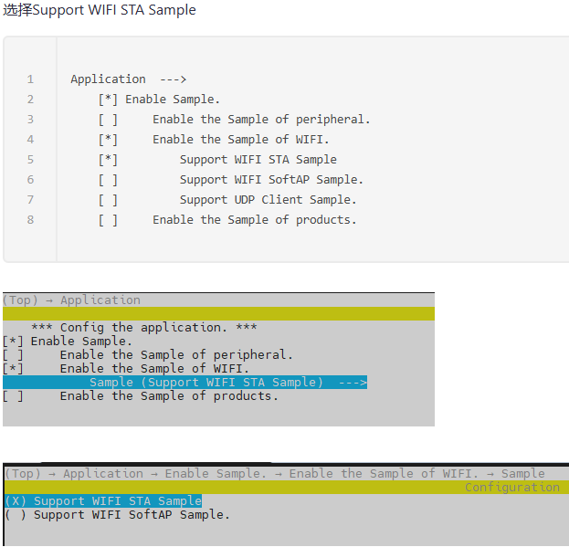  
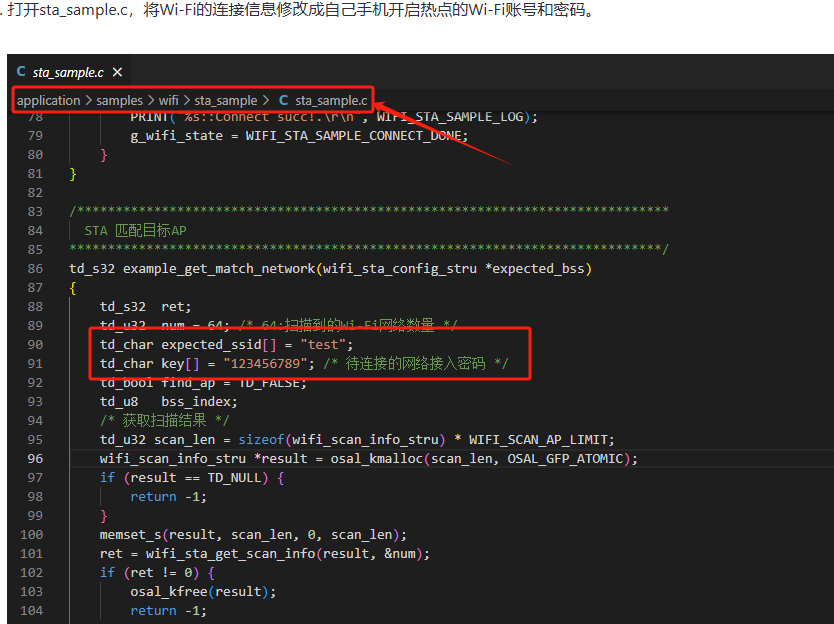  
关键代码，位于`application\samples\wifi\sta_sample\sta_sample.c`  
```
td_s32 example_sta_function(td_void)
{
    td_char ifname[WIFI_IFNAME_MAX_SIZE + 1] = "wlan0"; /* 创建的STA接口名 */
    wifi_sta_config_stru expected_bss = {0}; /* 连接请求信息 */
    struct netif *netif_p = TD_NULL;
    td_u32 wait_count = 0;

    /* 创建STA接口 */
    if (wifi_sta_enable() != 0) {
        return -1;
    }
    PRINT("%s::STA enable succ.\r\n", WIFI_STA_SAMPLE_LOG);

    do {
        (void)osDelay(1); /* 1: 等待10ms后判断状态 */
        if (g_wifi_state == WIFI_STA_SAMPLE_INIT) {
            PRINT("%s::Scan start!\r\n", WIFI_STA_SAMPLE_LOG);
            g_wifi_state = WIFI_STA_SAMPLE_SCANING;
            /* 启动STA扫描 */
            if (wifi_sta_scan() != 0) {
                g_wifi_state = WIFI_STA_SAMPLE_INIT;
                continue;
            }
        } else if (g_wifi_state == WIFI_STA_SAMPLE_SCAN_DONE) {
            /* 获取待连接的网络 */
            if (example_get_match_network(&expected_bss) != 0) {
                PRINT("%s::Do not find AP, try again !\r\n", WIFI_STA_SAMPLE_LOG);
                g_wifi_state = WIFI_STA_SAMPLE_INIT;
                continue;
            }
            g_wifi_state = WIFI_STA_SAMPLE_FOUND_TARGET;
        } else if (g_wifi_state == WIFI_STA_SAMPLE_FOUND_TARGET) {
            PRINT("%s::Connect start.\r\n", WIFI_STA_SAMPLE_LOG);
            g_wifi_state = WIFI_STA_SAMPLE_CONNECTING;
            /* 启动连接 */
            if (wifi_sta_connect(&expected_bss) != 0) {
                g_wifi_state = WIFI_STA_SAMPLE_INIT;
                continue;
            }
        } else if (g_wifi_state == WIFI_STA_SAMPLE_CONNECT_DONE) {
            PRINT("%s::DHCP start.\r\n", WIFI_STA_SAMPLE_LOG);
            g_wifi_state = WIFI_STA_SAMPLE_GET_IP;
            netif_p = netifapi_netif_find(ifname);
            if (netif_p == TD_NULL || netifapi_dhcp_start(netif_p) != 0) {
                PRINT("%s::find netif or start DHCP fail, try again !\r\n", WIFI_STA_SAMPLE_LOG);
                g_wifi_state = WIFI_STA_SAMPLE_INIT;
                continue;
            }
        } else if (g_wifi_state == WIFI_STA_SAMPLE_GET_IP) {
            if (example_check_dhcp_status(netif_p, &wait_count) == 0) {
                break;
            }
            wait_count++;
        }
    } while (1);

    return 0;
}

```
## Wi-Fi SoftAP 开启无线热点测试
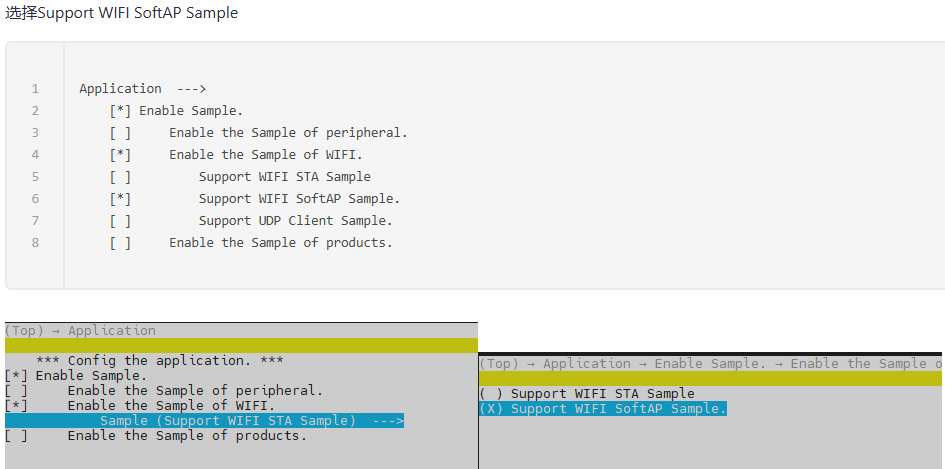  
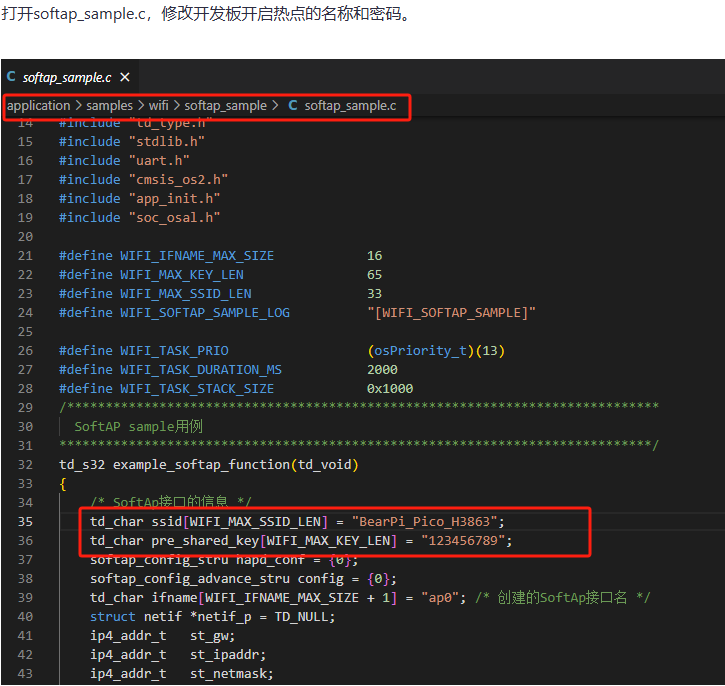  
关键代码，位于`application\samples\wifi\softap_sample\softap_sample.c`  
```

td_s32 example_softap_function(td_void)
{
    /* SoftAp接口的信息 */
    td_char ssid[WIFI_MAX_SSID_LEN] = "BearPi_Pico_H3863";
    td_char pre_shared_key[WIFI_MAX_KEY_LEN] = "123456789";
    softap_config_stru hapd_conf = {0};
    softap_config_advance_stru config = {0};
    td_char ifname[WIFI_IFNAME_MAX_SIZE + 1] = "ap0"; /* 创建的SoftAp接口名 */
    struct netif *netif_p = TD_NULL;
    ip4_addr_t   st_gw;
    ip4_addr_t   st_ipaddr;
    ip4_addr_t   st_netmask;
    IP4_ADDR(&st_ipaddr, 192, 168, 43, 1); /* IP地址设置：192.168.43.1 */
    IP4_ADDR(&st_netmask, 255, 255, 255, 0); /* 子网掩码设置：255.255.255.0 */
    IP4_ADDR(&st_gw, 192, 168, 43, 2); /* 网关地址设置：192.168.43.2 */

    /* 配置SoftAp基本参数 */
    (td_void)memcpy_s(hapd_conf.ssid, sizeof(hapd_conf.ssid), ssid, sizeof(ssid));
    (td_void)memcpy_s(hapd_conf.pre_shared_key, WIFI_MAX_KEY_LEN, pre_shared_key, WIFI_MAX_KEY_LEN);
    hapd_conf.security_type = 3; /* 3: 加密方式设置为WPA_WPA2_PSK */
    hapd_conf.channel_num = 13; /* 13：工作信道设置为13信道 */
    hapd_conf.wifi_psk_type = 0;

    /* 配置SoftAp网络参数 */
    config.beacon_interval = 100; /* 100：Beacon周期设置为100ms */
    config.dtim_period = 2; /* 2：DTIM周期设置为2 */
    config.gi = 0; /* 0：short GI默认关闭 */
    config.group_rekey = 86400; /* 86400：组播秘钥更新时间设置为1天 */
    config.protocol_mode = 4; /* 4：协议类型设置为802.11b + 802.11g + 802.11n + 802.11ax */
    config.hidden_ssid_flag = 1; /* 1：不隐藏SSID */
    if (wifi_set_softap_config_advance(&config) != 0) {
        return -1;
    }
    /* 启动SoftAp接口 */
    if (wifi_softap_enable(&hapd_conf) != 0) {
        return -1;
    }
    /* 配置DHCP服务器 */
    netif_p = netif_find(ifname);
    if (netif_p == TD_NULL) {
        (td_void)wifi_softap_disable();
        return -1;
    }
    if (netifapi_netif_set_addr(netif_p, &st_ipaddr, &st_netmask, &st_gw) != 0) {
        (td_void)wifi_softap_disable();
        return -1;
    }
    if (netifapi_dhcps_start(netif_p, NULL, 0) != 0) {
        (td_void)wifi_softap_disable();
        return -1;
    }
    PRINT("%s::SoftAp start success.\r\n", WIFI_SOFTAP_SAMPLE_LOG);
    return 0;
}

```
## Wi-Fi UDP客户端测试
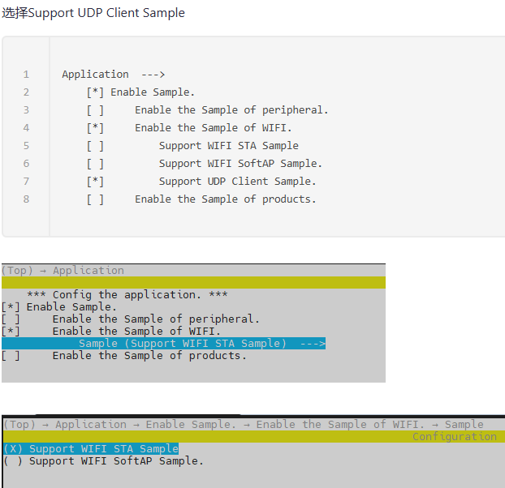  
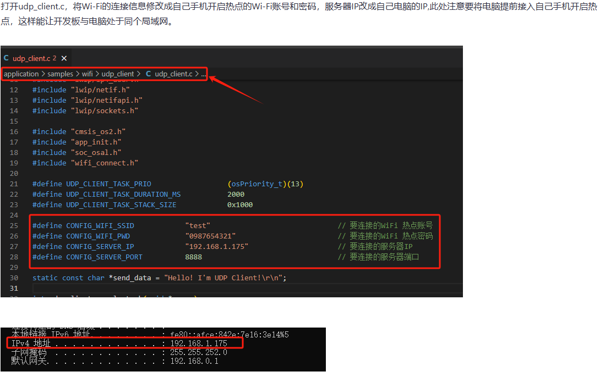  
关键代码，位于`application\samples\wifi\udp_client\udp_client.c`  
```
int udp_client_sample_task(void *param)
{
    param = param;

    // 在sock_fd 进行监听，在 new_fd 接收新的链接
    int sock_fd;

    // 服务器的地址信息
    struct sockaddr_in send_addr;
    socklen_t addr_length = sizeof(send_addr);
    char recvBuf[512];

    // 连接Wifi
    wifi_connect(CONFIG_WIFI_SSID, CONFIG_WIFI_PWD);

    // 创建socket
    printf("create socket start!\r\n");
    if ((sock_fd = socket(AF_INET, SOCK_DGRAM, 0)) == -1) {
        printf("create socket failed!\r\n");
        return 0;
    }
    printf("create socket end!\r\n");
    // 初始化预连接的服务端地址
    send_addr.sin_family = AF_INET;
    send_addr.sin_port = htons(CONFIG_SERVER_PORT);
    send_addr.sin_addr.s_addr = inet_addr(CONFIG_SERVER_IP);
    addr_length = sizeof(send_addr);

    while (1) {
        bzero(recvBuf, sizeof(recvBuf));

        // 发送数据到服务远端
        printf("sendto start!\r\n");
        sendto(sock_fd, send_data, strlen(send_data), 0, (struct sockaddr *)&send_addr, addr_length);
        printf("sendto end!\r\n");
        // 线程休眠一段时间
        osDelay(100);

        // 接收服务端返回的字符串
        recvfrom(sock_fd, recvBuf, sizeof(recvBuf), 0, (struct sockaddr *)&send_addr, &addr_length);
        printf("%s:%d=>%s\n", inet_ntoa(send_addr.sin_addr), ntohs(send_addr.sin_port), recvBuf);
    }

    // 关闭这个 socket
    lwip_close(sock_fd);
    return 0;
}
```
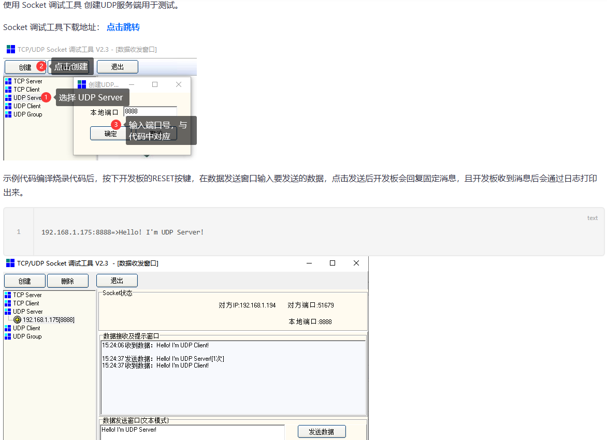