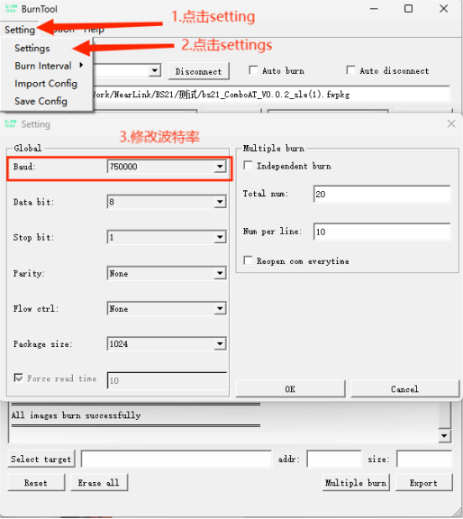

# 使用教程
从机设置——设置MAC地址及进入从机模式  

    AT+SLEMAC?             //查询MAC地址  
    AT+SLEMAC=abcdef000000 //设置MAC地址为abcdef000000（12位）
    AT+SLEMODE=0           //进入从机模式
主机设置——设置为主机模式并连接从机  

    AT+SLEMODE=1  //设置为主机模式
    AT+SLESCAN    //进入主机模式后，扫描附近从机
    AT+SLECONNECT=abcdef000000  //连接扫描到的从机MAC地址

出现SLE_CONNECT字样，此时会自动进入透传模式
## 烧录工具BurnTool
   
连接端口并进入烧录模式（若没有固件则自动进入烧录模式），点击Connect后若没有出现Z”CCC等字样，开发板则按下左侧按钮RTS复位进入烧录模式，模组则手动插拔VDD进入烧录模式
  
非必要步骤，可修改烧录波特率，最高支持750000
   
  