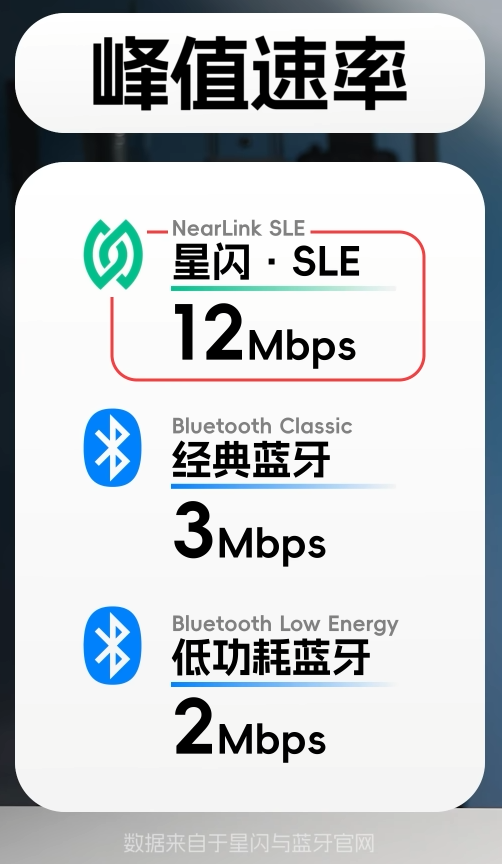
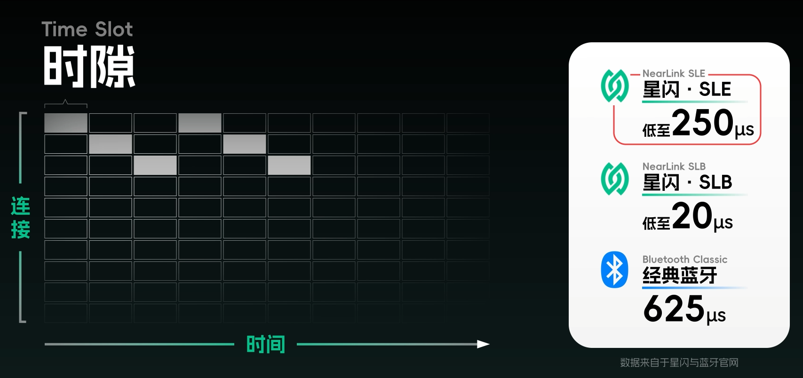
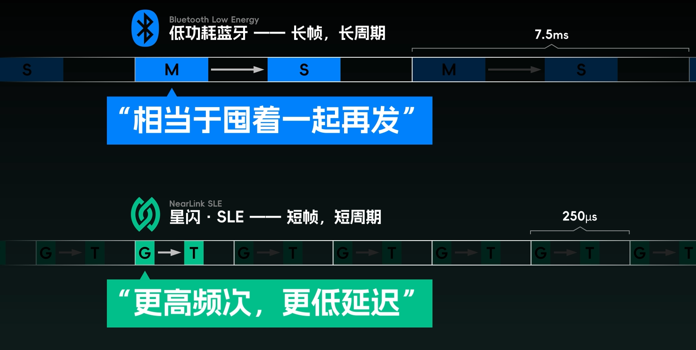
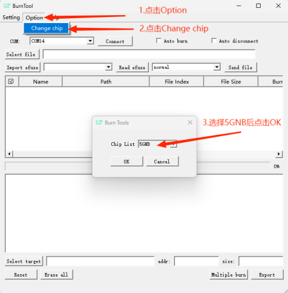
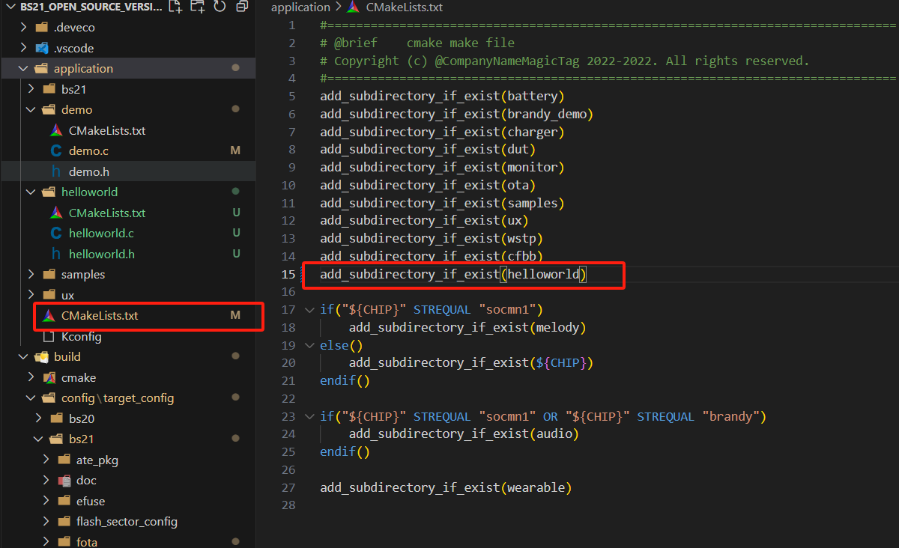
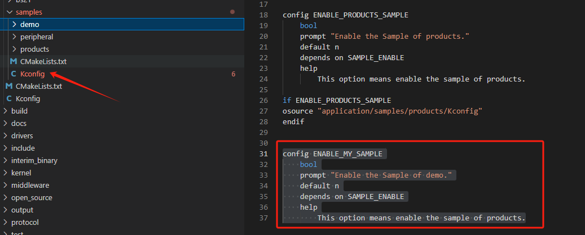
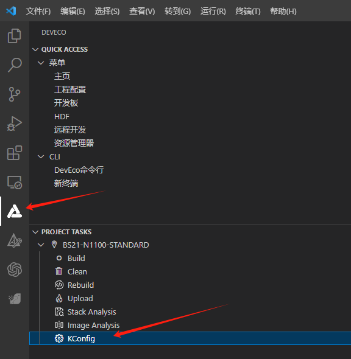

# 星闪入门


蓝牙通信过程短暂占用一个信道，跳频(加密的)

低功耗蓝牙为40个信道  






# AT指令使用教程
从机设置——设置MAC地址及进入从机模式  

    AT+SLEMAC?             //查询MAC地址  
    AT+SLEMAC=abcdef000000 //设置MAC地址为abcdef000000（12位）
    AT+SLEMODE=0           //进入从机模式
主机设置——设置为主机模式并连接从机  

    AT+SLEMODE=1  //设置为主机模式
    AT+SLESCAN    //进入主机模式后，扫描附近从机
    AT+SLECONNECT=abcdef000000  //连接扫描到的从机MAC地址

出现SLE_CONNECT字样，此时会自动进入透传模式

点灯之前要先映射好引脚，指令在 AT 指令手册的最后有:

    AT+SYSIOMAP=38,NC,NC,NC,25,2,26,27,11,12,13,28,29,30,31,NC,0,1,3,NC,NC,4,5,6,9,10,22,NC,N C,14,15,16,NC,NC,NC,NC,23,24,NC


    AT+SYSGPIOWRITE=8,1 //红  
不映射引脚点灯  

    AT+SYSIOMAP=1,11//红  
    AT+SYSGPIOWRITE=1,1
# SDK使用教程
板子选"BS21-N1100",开发板选择"BS21-N1100-STANDARD"    
默认编译为`application\demo`工程
修改下图两个文件即可编译其他工程  


# 烧录工具BurnTool
## 烧录AT固件
选择板子  

   
连接端口并进入烧录模式（若没有固件则自动进入烧录模式），点击Connect后若没有出现Z”CCC等字样，开发板则按下左侧按钮RTS复位进入烧录模式，模组则手动插拔VDD进入烧录模式
  
非必要步骤，可修改烧录波特率，最高支持750000
   
  
## 烧录SDK固件
固件生成目录：Ai-BS21_SDK\tools\pkg\fwpkg\bs21
勾选“Auto burn”和“Auto disconnect”,点击Connect,按一下开发板的复位按键，即可启动烧录程序。

# 新建工程
## 已有工程修改
1. 在 SDK 目录下的 application 中我们可以看到有一个 demo 的工程，该工程为默认编译的工程。既然要新建工程，我们直接 copy 原来的 demo 工程在一个目录下，并且改名为 helloworld，一同将里面的文件名称也改为我们熟悉的 helloworld.c 和 helloworld.h。

2. 修改一下.c 和.h 的头文件和宏规范。  
3. 改一下工程下的 CMakeLists.txt ，把工程命和已有的.c 文件添加进去。 把 application 目录下的 CMakeLists.txt，使用 add_subdirectory_if_exist 添加工程。
4. 最后，改一下build\config\target_config\bs21\config.py 目录下，ram_component 数组的内容。将我们的工程名添加进去。
## 从新开始新建
1. 在 application/样品中创建一个 demo 代码目录  
   
2. 添加用户自定义代码 demo.c、demo.h，同时创建一个空白 CMakeLists.txt 文件。  
   
3. 在 CMkakeLists.txt 中为组件模板添加源码文件以及源码头文件路径
```
    set(SOURCES_LIST
        ${CMAKE_CURRENT_SOURCE_DIR}/demo.c
    )

    set(PUBLIC_HEADER_LIST
        ${CMAKE_CURRENT_SOURCE_DIR}
    )

    set(SOURCES "${SOURCES_LIST}" PARENT_SCOPE)
    set(PUBLIC_HEADER "${PUBLIC_HEADER_LIST}" PARENT_SCOPE)

```
在SOURCES_LIST中添加.c文件，多个.c文件直接换行加在后面即可；  
在PUBLIC_HEADER_LIST中添加.h路径，多个路径直接换行加在后面即可；  
CMAKE_CURRENT_SOURCE_DIR表示当前CMkakeLists.txt的路径。  

4. 在demo.c、demo.h中添加自己的业务代码，这里以在demo.c中添加一个创建任务，并在任务中打印消息为例,app_run函数为应用程序的入口函数。
   

```
#include "common_def.h"
#include "osal_debug.h"
#include "cmsis_os2.h"
#include "app_init.h"

#define TASKS_TEST_TASK_STACK_SIZE    0x1000
#define TASKS_TEST_TASK_PRIO          (osPriority_t)(17)
#define TASKS_TEST_DURATION_MS        1000

static void *tasks_test_task(const char *arg)
{
    unused(arg);

    while (1) {
        osal_printk("Hello World  BearPi\r\n");
        osDelay(TASKS_TEST_DURATION_MS);
    }

    return NULL;
}

static void tasks_test_entry(void)
{
    osThreadAttr_t attr;

    attr.name = "TasksTask";
    attr.attr_bits = 0U;
    attr.cb_mem = NULL;
    attr.cb_size = 0U;
    attr.stack_mem = NULL;
    attr.stack_size = TASKS_TEST_TASK_STACK_SIZE;
    attr.priority = TASKS_TEST_TASK_PRIO;

    if (osThreadNew((osThreadFunc_t)tasks_test_task, NULL, &attr) == NULL) {
        /* Create task fail. */
    }
}

/* Run the tasks_test_entry. */
app_run(tasks_test_entry);
```
5. 将demo组件的内的顶层 CMakeLists 添加到其上一层 CMakeLists 下，使构建系统能够执行到 demo 组件的 CMake。  
   
6. 另外也可通过例如CONFIG_ENABLE_MY_SAMPLE宏控制是否编译demo代码,  
     
此功能需要在samples/Kconfig中添加以下代码
```
config ENABLE_MY_SAMPLE
    bool
    prompt "Enable the Sample of demo."
    default n
    depends on SAMPLE_ENABLE
    help
        This option means enable the sample of products.
```
  
7. 点击左侧的“KConfig”,打开配置界面,选中 Enable the Sample of demo并保存即可编译demo工程.  
   
   


# 使用预设程序

选择电灯案例：点击左侧的“KConfig”,选择Application目录，勾选“Enable Sample”、“Enable the Sample of peripheral”以及需要要编译的Sample名称，并保存。


# 相关链接
星闪SDK开发——环境搭建&新建工程：  
https://bbs.ai-thinker.com/forum.php?mod=viewthread&tid=45222&extra=page%3D1  
星闪技术与西门子PLC通信：  
https://mp.weixin.qq.com/s/Vnh0AFDvqOnr-ZO9t1cokw  
小熊派：  
https://bearpi.cn/core_board/bearpi/pico/h2821/software/%E7%8E%AF%E5%A2%83%E6%90%AD%E5%BB%BAwindows.html  
H2821与H3863区别
