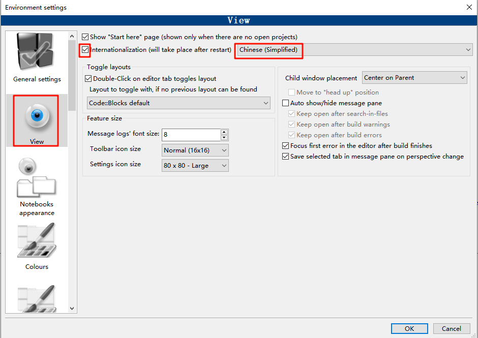
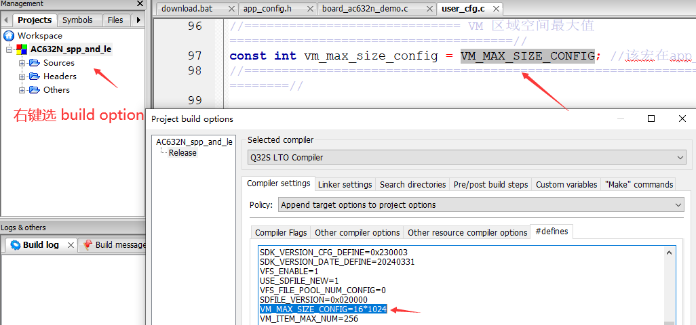
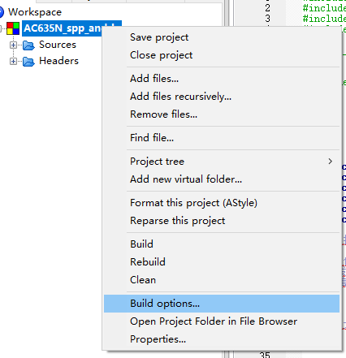
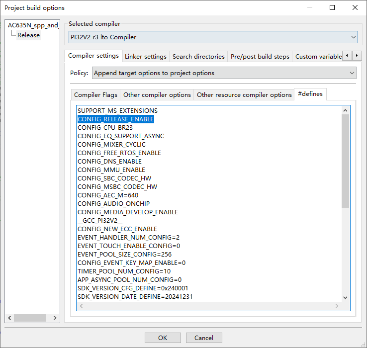
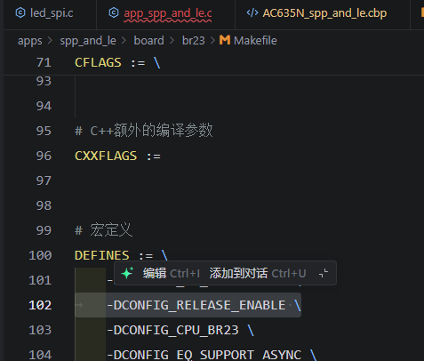
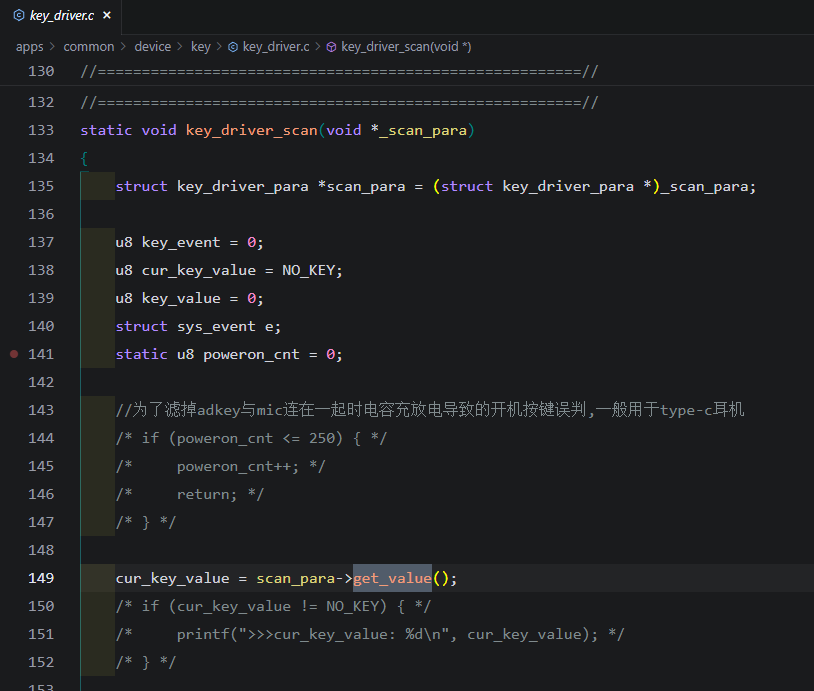

# 置顶链接
## 官方资料
[SDK](https://gitee.com/Jieli-Tech/fw-AC63_BT_SDK)  
[ac695n_soundbox_sdk](https://gitlab.zh-jieli.com/soundbox/novisualization/ac695n_soundbox_sdk)  
[开发文档](https://doc.zh-jieli.com/AC63/zh-cn/master/getting_started/preparation/index.html)  
[芯片信息介绍](https://doc.zh-jieli.com/vue/#/docs/ac63)  
[AC63NN开发指导文档](https://www.kdocs.cn/l/cobIN9PMjvHG)  
[音频技术应用文档入口汇总](https://www.kdocs.cn/l/cpFuA4qTguho)  
[IIS音频接口应用](https://www.kdocs.cn/l/ccV9i2fG0gwq?openfrom=docs)  
[AC632N timer_pwm初始化会出现一段高电平](https://gitee.com/Jieli-Tech/fw-AC63_BT_SDK/issues/IBX3YY)  
[杰理之家论坛](http://bbs.yunthinker.com/)  
## 其他资料
[教程1](https://zhuanlan.zhihu.com/p/568994186)  
[教程2](https://jindu-chen.github.io/2024/07/12/%E3%80%90%E6%9D%B0%E7%90%86%E3%80%91%E6%9D%B0%E7%90%86%E8%8A%AF%E7%89%87%E5%BC%80%E5%8F%91%E7%AC%94%E8%AE%B0/)  
[示例代码](https://gitee.com/OULIHONG1999/jeli-ac632n-test-program.git)  
[基于ac632n芯片实现控制ws2812b彩灯，按键控制案例演示](https://www.bilibili.com/video/BV1D9dFYwEK6/?share_source=copy_web&vd_source=0a59939778588b309551cce446111b0b)  
[基于ac632n芯片实现控制ws2812b彩灯，按键控制](https://gitee.com/OULIHONG1999/jieli-ac632n-ws2812b-dome.git)  
[黑马教程](https://www.yuque.com/icheima/oe12qp/pngr2k8wpe7v66i2)  
[AC632N timer_pwm初始化会出现一段高电平](https://gitee.com/Jieli-Tech/fw-AC63_BT_SDK/issues/IBX3YY)  
# IDE设置
## 设置中文
- [汉化包地址链接](https://pan.baidu.com/s/1Ce7oRSBIa7T4wo4_vPXjsg)  提取码：vtpt  
- 放置汉化文件：解压汉化包，会得到locale文件夹。找到 Code::Blocks 的安装目录，默认路径一般是C:\Program Files (x86)\CodeBlocks，依次进入share→CodeBlocks文件夹，将解压后的locale文件夹复制到该目录下。
- 配置语言设置：打开 Code::Blocks，依次点击Settings→Environment，在View选项下勾选Internationalization，选择Chinese(Simplified)，点击OK后重启软件，即可完成汉化。
  
## 添加.c.h文件


# 杰理开发重点关注：board.c 、 app_config.h、app_main.c
borad.c里面定义了开发板相关的外设io口配置， app_config.h中声明了相关的功能开关
# 杰理SDK编程要点
## 新建任务-- 自定义消息池-- 信号量调度
新建一个c文件，复制这段代码进去
```c
#include "board_config.h"
#include "system/includes.h"
#include "asm/power_interface.h"
#include "app_config.h"

#undef _DEBUG_H_
#define LOG_TAG_CONST       CASE_TASK
#define LOG_TAG             "[CASE_TASK]"
#include "debug.h"
#define LOG_v(t)  log_tag_const_v_ ## t
#define LOG_i(t)  log_tag_const_i_ ## t
#define LOG_d(t)  log_tag_const_d_ ## t
#define LOG_w(t)  log_tag_const_w_ ## t
#define LOG_e(t)  log_tag_const_e_ ## t
#define LOG_c(t)  log_tag_const_c_ ## t
#define LOG_tag(tag, n) n(tag)
const char LOG_tag(LOG_TAG_CONST,LOG_v) AT(.LOG_TAG_CONST) = 0;
const char LOG_tag(LOG_TAG_CONST,LOG_i) AT(.LOG_TAG_CONST) = 1;
const char LOG_tag(LOG_TAG_CONST,LOG_d) AT(.LOG_TAG_CONST) = 0; //log_debug
const char LOG_tag(LOG_TAG_CONST,LOG_w) AT(.LOG_TAG_CONST) = 1;
const char LOG_tag(LOG_TAG_CONST,LOG_e) AT(.LOG_TAG_CONST) = 1;
const char LOG_tag(LOG_TAG_CONST,LOG_c) AT(.LOG_TAG_CONST) = 1;

//系统接口返回值错误码 #include "os/os_error.h"

//新建任务方式,任务有2种驱动方式
//1、发消息事件 来驱动
//2、信号量    来驱动
#define TASK_RUN_MSG      0x01 //消息
#define TASK_RUN_SEM      0x02 //信号量
#define TASK_RUN_WAY      TASK_RUN_MSG //TASK_RUN_SEM //
//消息大小限制
#define MAX_MSG      (16)                    //固定不能改大
#define MAX_BUF      ((MAX_MSG - 2) * 4 - 1) //固定不能改大

//任务的参数定义
#define CASE_TASK_NAME   "case_task" //小于11个字节
#define CASE_TASK_PRIO   2        //任务优先级：1-3
#define CASE_TASK_STACK  512      //任务栈大小：128*n <= 1024
#define CASE_TASK_QSIZE  256      //任务消息池大小：128*n <= 1024

typedef enum{
    CASE_TASK_MSG_0 = 0,
    CASE_TASK_MSG_1,
}CASE_TASK_MSG;

static int case_task_msg_deal(CASE_TASK_MSG msg, u8 *buf, u8 len)
{
    log_info("%s[msg:%d len:%d]", __func__, msg, len);
    int ret = 0;
    switch (msg) {
    case CASE_TASK_MSG_0:
        log_info("CASE_TASK_MSG_0");
        break;
    case CASE_TASK_MSG_1:
        log_info("CASE_TASK_MSG_1");
        log_info_hexdump(buf, len);
        break;
    default:
        break;
    }
    return ret;
}

static int case_task_post_msg(CASE_TASK_MSG msg, u8 *buf, u8 len)
{
    log_info("%s[msg:%d len:%d]", __func__, msg, len);
    int ret = OS_NO_ERR;
    if(buf == NULL){
        ret = os_taskq_post_msg(CASE_TASK_NAME, 1, msg);
    }else{
        if(len > MAX_BUF){
            ret = -1;
            goto _post_end;
        }
        log_debug_hexdump(buf, len);
        static u8 data[MAX_BUF + 5] ALIGNED(4);
        memset(data, 0x00, sizeof(data));
        data[4] = len;
        memcpy(data + 5, buf, len);
        ((u32 *)data)[0] = msg;
        ret = os_taskq_post_type(CASE_TASK_NAME, Q_MSG, MAX_MSG - 1, data);
    }
_post_end:
    if(ret) log_error("%s[ret:%d]", __func__, ret);
    return ret;
}

static int case_task_sem_deal(void)
{
    int ret = OS_NO_ERR;
    log_info("%s", __func__);

    //跑一些耗时操作

    return ret;
}

static OS_SEM case_task_sem;
static int case_task_post_sem(void)
{
    int ret = OS_NO_ERR;
    log_info("%s", __func__);
    ret = os_sem_post(&case_task_sem);
    if(ret) log_error("%s[ret:%d]", __func__, ret);
    return ret;
}

static void case_task(void *p)
{
#if (TASK_RUN_WAY == TASK_RUN_MSG)
    int ret = 0;
    u32 msg[MAX_MSG];
    while (1) {
        clr_wdt();
        memset(msg, 0x00, sizeof(msg));
        ret = os_taskq_pend("taskq", msg, ARRAY_SIZE(msg));
        if (ret != OS_TASKQ) {
            continue;
        }
        if (msg[0] != Q_MSG) {
            continue;
        }
        log_debug("%s[enter_msg:0x%x]", __func__, msg[1]);
        u8 *buf = (u8 *)(msg + 2);
        ret = case_task_msg_deal(msg[1], buf + 1, buf[0]);
        log_debug("%s[exit_msg:0x%x -> ret:%d]", __func__, msg[1], ret);
    }
#endif
#if (TASK_RUN_WAY == TASK_RUN_SEM)
    int ret = 0;
    while (1) {
        clr_wdt();
        ret = os_sem_pend(&case_task_sem, 0);
        /* os_sem_set(&case_task_sem, 0); */
        log_debug("%s[os_sem_pend -> ret:%d]", __func__, ret);
        ret = case_task_sem_deal();
        log_debug("%s[case_task_sem_deal -> ret:%d]", __func__, ret);
    }
#endif
}
int case_task_init(void)
{
    log_info("%s[MAX_BUF:%d]", __func__, MAX_BUF);
    int ret = OS_NO_ERR;
    os_sem_create(&case_task_sem, 0);
    os_sem_set(&case_task_sem, 0);
    /* ret = task_create(case_task, NULL, CASE_TASK_NAME); */
    ret = os_task_create(case_task, NULL, CASE_TASK_PRIO,
                         CASE_TASK_STACK, CASE_TASK_QSIZE, CASE_TASK_NAME);
    if(ret != OS_NO_ERR)
        log_error("%s %s create fail 0x%x", __func__, CASE_TASK_NAME, ret);
    return ret;
}

int case_task_delete(void)
{
    int ret = OS_NO_ERR;
    ret = task_kill(CASE_TASK_NAME);
    log_info("%s[task_kill(%s):%d]", __func__, CASE_TASK_NAME, ret);
    return ret;
}

///测试函数
static void case_task_loop(void *priv)
{
#if (TASK_RUN_WAY == TASK_RUN_MSG)
    static u32 cnt = 0;
    if(cnt > MAX_BUF){
        return;
    }
    if(cnt == MAX_BUF){
        case_task_delete();
    }
    cnt++;
#if 0
    log_info("只发消息---不带参数");
    case_task_post_msg(CASE_TASK_MSG_0, NULL, 0);
#else
    log_info("发消息---并带一个buf数组");
    u8 buf[MAX_BUF];
    memset(buf, 0x00, sizeof(buf));
    for(u8 i = 0;i < sizeof(buf);i++){
        buf[i] = 0x10 + i;
    }
    case_task_post_msg(CASE_TASK_MSG_1, buf, cnt);
#endif
#endif
}
static void case_task_hi_loop(void *priv)
{
#if (TASK_RUN_WAY == TASK_RUN_SEM)
    case_task_post_sem();
#endif
}

int case_task_test(void)
{
    log_info("%s", __func__);
    case_task_init();
    sys_timer_add(NULL, case_task_loop, 1000 * 1);
    /* sys_s_hi_timer_add(NULL, case_task_hi_loop, 1000 * 5); */
    /* sys_hi_timer_add(NULL, case_task_hi_loop, 4); */
}

```

✅ 代码结构全图（非常重要）
```scss
case_task_init()
    └── 创建任务 case_task()
         └── while(1) 等待消息 os_taskq_pend()
              └── case_task_msg_deal() 处理消息:任务收到消息后如何处理就在这里写你的逻辑。

case_task_post_msg()      <-- 主动发消息
case_task_post_sem()      <-- 主动发信号量(切换模式后生效)
case_task_delete()        <-- 删除任务

case_task_test()          <-- 示例：每秒发一次消息
```

用“发送消息”驱动任务
系统队列消息是：
msg[0] = Q_MSG
msg[1] = 自定义消息ID
msg[2] ~ msg[15] = buf 数据

发送不带参数的消息
os_taskq_post_msg(CASE_TASK_NAME, 1, msg);
发送带 buf 的消息
os_taskq_post_type(CASE_TASK_NAME, Q_MSG, MAX_MSG - 1, data);

| data[0..3] | data[4] | data[5..] |
| ---------- | ------- | --------- |
| msg ID     | 长度len   | 实际数据buf   |

## 转事件到最低优先级线程执行
对执行位置有限制的函数
- 关机函数
spple_set_soft_poweroff();
hidkey_set_soft_poweroff();
power_set_soft_poweroff();等等
- 播放提示音
tone_play(TONE_BT_MODE, 1);
- 写flash
syscfg_write();
fwrite();
## 需要转事件到最低优先级执行

```c
#define KEY_EVENT_FROM_TMR      (('T' << 24) | ('M' << 16) | ('R' << 8) | '\0')
void timer_event_to_key(u16 event, u32 value)
{
    struct sys_event e;
    e.type = SYS_KEY_EVENT;
    e.arg  = (void *)KEY_EVENT_FROM_TMR;
    e.u.key.event = event;
    e.u.key.value = value;
    sys_event_notify(&e);
}
static void timer_event_handler(struct sys_event *e)
{
    int ret = 0;
    if ((u32)e->arg == KEY_EVENT_FROM_TMR) {
        u16 event = e->u.key.event;
        u32 value = e->u.key.value;
        log_info("%s[event:%d value:%d]", __func__, event, value);
        switch(event)
        {
        case 1:
            spple_set_soft_poweroff();  //关机函数，必须放最低优先级线程执行
            break;
        case 2:
            tone_play(TONE_BT_MODE, 1); //播放提示音，放最低优先级线程执行
            break;
        case 3:
            u32 var;
            #define CFG_USER_VAR	 2
            ret = syscfg_write(CFG_USER_VAR, &var, sizeof(u32));
            break;
        }
    }
}

timer_event_handler(event);

timer_event_to_key(1, 0);

```



## 实现推送某个函数到指定任务执行
```c
//不带参数的函数
static void callback_func_no_param(void)
{
    printf("%s\n", __func__);
}

//带1个参数的函数
static void callback_func_1_param(int mode)
{
    printf("%s %d\n", __func__, mode);
    bt_set_low_latency_mode(mode);
}

//带2个参数的函数
static void callback_func_2_param(int mode, int eq)
{
    printf("%s %d %d\n", __func__, mode, eq);
    bt_set_low_latency_mode(mode);
    eq_mode_set(eq);
}

//带1个指针参数的函数，可以间接做n个参数的回调
static void callback_func_n_param(int *param)
{
    //取出参数
    int param_num = param[0];
    int mode = param[1];
    int eq = param[2];
    int vbat = param[3];
    printf("%s %d %d %d %d\n", __func__, param_num, mode, eq, vbat);
    bt_set_low_latency_mode(mode);
    eq_mode_set(eq);
    chargestore_set_power_level(vbat);
    free(param);
}

//带1个指针参数的函数，传参是内存地址或者字符串地址
static void callback_func_1_pointer(int *pointer)
{
    u8 *path = (u8 *)pointer;
    printf("%s %x\n", __func__, path);
    tone_play(path, 1);
}

//推送某个函数到指定任务(如"app_core")执行
static void func_callback_in_task(void)
{
    int err;
    int msg[5];
    
    //推送不带参数的函数到app_core任务
    msg[0] = (int) callback_func_no_param;
    msg[1] = 0;//函数无需参数
    err = os_taskq_post_type("app_core", Q_CALLBACK, 2, msg);

    //推送带1个参数的函数到app_core任务
    msg[0] = (int) callback_func_1_param;
    msg[1] = 1;//函数需要1个参数
    msg[2] = 0;//对应参数 mode
    err = os_taskq_post_type("app_core", Q_CALLBACK, 3, msg);

    //推送带2个参数的函数到app_core任务
    msg[0] = (int) callback_func_2_param;
    msg[1] = 2;//函数需要2个参数
    msg[2] = 0;//对应第一个参数 mode
    msg[3] = 1;//对应第二个参数 eq
    err = os_taskq_post_type("app_core", Q_CALLBACK, 4, msg);

    //推送带1个指针参数的函数到app_core任务，参数是指针，可以实现n个参数的等效传参
    int *param = malloc(4 * sizeof(int));
    param[0] = 3;
    param[1] = 0;
    param[2] = 1;
    param[3] = 55;//申请内存存放要传递的参数
    msg[0] = (int) callback_func_n_param;
    msg[1] = 1;//函数需要1个参数
    msg[2] = (int)param;//对应参数 param
    err = os_taskq_post_type("app_core", Q_CALLBACK, 3, msg);

    //推送带1个指针参数的函数到app_core任务
    msg[0] = (int) callback_func_1_pointer;
    msg[1] = 1;//函数需要1个参数
    msg[2] = (int)TONE_BT_CONN;//对应参数 pointer
    err = os_taskq_post_type("app_core", Q_CALLBACK, 3, msg);

    printf("%s %d\n", __func__, err);
}

```

## 注册软件定时器不耗费硬件定时器（sys_timer_add、sys_timeout_add，sys_s_hi_timer_add）规范写法
## 介绍
系统默认使用了 timer1 为系统 1ms 时钟定时用，所有的软件定时器都基于这个 timer1 拓展出来。
拓展出 2 种定时器使用方式：

1. 在中断函数回调执行(切记不可调用延时、耗时、关机、写VM、写flash等操作)
`sys_hi_timer_add()` 定时循环函数，会导致不进低功耗，直到主动删除
`sys_hi_timeout_add()` 定时超时执行一次函数
`sys_s_hi_timer_add()` 定时循环函数，不影响系统进低功耗，周期会变，建议使用此种定时器
`sys_s_hi_timerout_add()` 定时超时执行一次函数
注意点：此种定时器，注册的函数是在中断函数里面回调的，不可添加延时、耗时、关机、写flash、写VM的操作。
要保证回调函数尽快返回，函数执行时间小于0.5ms
单位是 ms， 但是是以 1ms 步进的。
2. 在系统线程中执行， 几乎可执行所有的操作
`sys_timer_add()` 定时循环函数，会影响下次进低功耗的时间点，周期太短会影响功耗。
`sys_timeout_add()` 定时超时执行一次函数
注意点：此种定时器，注册的函数是在线程执行的，优先级依赖于注册的线程的优先级。
单位是 ms，但是是以 10ms 步进的。5ms 等同于 10ms 的。系统是以 10ms 为系统滴答的。
3. 2种定时器不可嵌套使用
由于2种定时器的回调函数，不在同一个地方执行，也不是顺序执行。
hi_timer的回调函数，可以打断，sys_timer的回调函数。
因此禁止以下使用方式：
hi_timer的回调函数，禁止：注册、删除、修改sys_timer定时器
sys_timer的回调函数，修改hi_timer定时器，注意临界操作。
`local_irq_disable();`
`local_irq_enable();`

## 规范写法
循环定时器写法
```c
static u16 timer_loop = 0;

static void timer_loop_func(void *priv)
{
    static u8 cnt = 0;
    cnt++;
    log_info("%s[cnt:%d]", __func__, cnt);
}
void timer_loop_init(void)
{
    log_info("%s[id:%d]", __func__, timer_loop);
    if(timer_loop){
        sys_timer_del(timer_loop);//注册前,要判断是否注册过
        timer_loop = 0;
    }
    timer_loop = sys_timer_add(NULL, timer_loop_func, 5 * 1000); //ms单位
}
void timer_loop_del(void)
{
    log_info("%s[id:%d]", __func__, timer_loop);
    if(timer_loop){
        sys_timer_del(timer_loop);//删除前要判断
        timer_loop = 0;//删除后记得清0
    }
}
```
单次定时器写法
```c
static u16 timer_one  = 0;

static void timer_one_func(void *priv)
{
    static u8 cnt = 0;
    cnt++;
    log_info("%s[cnt:%d]", __func__, cnt);
    //sys_timeout_add注册的只会执行一次,底层会自动删除
    //回调函数内不可调用sys_timeout_del
    timer_one = 0;//ID号清0,必须要有！！！
}
void timer_one_init(void)
{
    log_info("%s[id:%d]", __func__, timer_one);
    if(timer_one){
        sys_timeout_del(timer_one);//注册前,要判断是否注册过
        timer_one = 0;
    }
    timer_one = sys_timeout_add(NULL, timer_one_func, 5 * 1000);//ms单位
}
void timer_one_del(void)
{
    log_info("%s[id:%d]", __func__, timer_one);
    if(timer_one){
        sys_timeout_del(timer_one);
        timer_one = 0;
    }
}
```


## 延时方式汇总
1. 指令数延时（浪费cpu资源）
```c
void delay(unsigned int);
```
`delay(100); //执行100个nop`
受系统频率影响，同样的语句，实际延时时间波动很大

2. 按照系统时钟换算指令数延时（浪费cpu资源）
```c
// 小于10us的执行不精准，不同系统频率下需要自行调整div值
AT_VOLATILE_RAM_CODE
void delay_us_by_nop(u32 usec) 
{
    u32 sys = clk_get("sys");
    u32 cnt, div;
    if(usec == 1)     {  div = 30;}
    else if(usec == 2){  div = 12;}
    else if(usec == 3){  div = 8; }
    else if(usec < 10){  div = 6; }
    else              {  div = 5; }
    cnt = usec * (sys / 1000000L / div);
    while(cnt--){ asm volatile("nop"); }
}
```
`int clk_set_sys_lock(int clk, int lock_en);`
`extern void clk_set_en(u8 en);`
`clk_set_en(0);`
可执行此函数，锁住系统频率不被修改。

3. 定时器计算延时（浪费cpu资源）延时要大于5us
函数是AC632 - BD19的寄存器写法，其他芯片参考sdk对应工程的写法
```c
//有概率会被中断打断，导致延时变大
AT_VOLATILE_RAM_CODE
void delay_us_by_timer0(u32 usec)
{
    usec -= 2;  //usec > 5,减掉此函数执行本身的耗时，48M->2us，24M->5us
    JL_TIMER0->CON = BIT(14);
    JL_TIMER0->CNT = 0;
    JL_TIMER0->PRD = clk_get("lsb") / 2 / 1000000L * usec;
    JL_TIMER0->CON = BIT(0) | BIT(6); //lsb clk 2分频
    while ((JL_TIMER0->CON & BIT(15)) == 0);
    JL_TIMER0->CON = BIT(14);
}

//关中断，临界区延时
AT_VOLATILE_RAM_CODE
void delay_us_by_timer0_irq(u32 usec)
{
    usec -= 2;  //usec > 5,减掉此函数执行本身的耗时，48M->2us，24M->5us
    local_irq_disable();
    JL_TIMER0->CON = BIT(14);
    JL_TIMER0->CNT = 0;
    JL_TIMER0->PRD = clk_get("lsb") / 2 / 1000000L * usec;
    JL_TIMER0->CON = BIT(0) | BIT(6); //lsb clk 2分频
    while ((JL_TIMER0->CON & BIT(15)) == 0);
    JL_TIMER0->CON = BIT(14);
    local_irq_enable();
}

//ms级延时，一般要求不需要精准，不用加关中断
AT_VOLATILE_RAM_CODE
void delay_ms_by_timer0(u32 msec)
{
    JL_TIMER0->CON = BIT(14);
    JL_TIMER0->CNT = 0;
    JL_TIMER0->PRD = clk_get("lsb") / 64 / 1000L * msec;
    JL_TIMER0->CON = BIT(0) | BIT(5) | BIT(4); //lsb clk 64分频
    while ((JL_TIMER0->CON & BIT(15)) == 0);
    JL_TIMER0->CON = BIT(14);
}
```
4. 系统调度延时（不浪费CPU资源）单位：10ms
```c
void os_time_dly(int time_tick);
```
`os_time_dly(1); //参数1，即延时10ms，会切出当前任务，执行其他任务`
小于10ms的延时方式，都会浪费CPU资源。
任务调度延时，只有10ms单位的，改不了 <10ms 的单位。

## VM使用规范
```c
//VM使用规范
//读写flash，不可在hi_timer跟中断函数调用
//VM区域大小 #define CONFIG_VM_LEAST_SIZE      8K //按照8K的倍数
//syscfg_id.h    vm的id取值范围：CFG_USER_DEFINE_BEGIN(1) - CFG_USER_DEFINE_END(49)
//user_cfg_id.h  部分应用用了其中几个值，注意不要重叠
//syscfg_read、syscfg_write返回值：负值对应VM_ERR，正常值就是最后一个参数的值
//vm id不够用时，将几个变量整合成一个结构体的形式

#define CFG_USER_VAR	 2
#define CFG_USER_BUF	 3
#define CFG_USER_STRUCT	 4

typedef struct{
    u32 var1;
    u32 var2;
}var_struct;

static u32 var;
static u8 buf[512]  __attribute__((aligned(4)));
static var_struct var_t;

void vm_op_demo(void)
{
    log_info("%s", __func__);
    int ret = 0;
    //变量形式
    var = 0;
    ret = syscfg_read(CFG_USER_VAR, &var, sizeof(u32)); //变量的数据类型
    log_info("%s[CFG_USER_VAR -> syscfg_read:%d]", __func__, ret);
    if(ret != sizeof(u32)){
        log_error("CFG_USER_VAR -> syscfg_read -> err:%d", ret);
    }else{
        log_info("CFG_USER_VAR:%d", var);
    }
    var++;
    ret = syscfg_write(CFG_USER_VAR, &var, sizeof(u32)); //变量的数据类型
    log_info("%s[CFG_USER_VAR -> syscfg_write:%d]", __func__, ret);
    if(ret != sizeof(u32)){
        log_error("CFG_USER_VAR -> syscfg_write -> err:%d", ret);
    }

    //数组形式
    memset(buf, 0x00, sizeof(buf));
    ret = syscfg_read(CFG_USER_BUF, buf, sizeof(buf));
    log_info("%s[CFG_USER_BUF -> syscfg_read:%d]", __func__, ret);
    if(ret != sizeof(buf)){
        log_error("CFG_USER_BUF -> syscfg_read -> err:%d", ret);
    }else{
        log_info_hexdump(buf, sizeof(buf));
    }
    buf[0]++;
    memset(buf, buf[0], sizeof(buf));
    ret = syscfg_write(CFG_USER_BUF, buf, sizeof(buf));
    log_info("%s[CFG_USER_BUF -> syscfg_write:%d]", __func__, ret);
    if(ret != sizeof(buf)){
        log_error("CFG_USER_BUF -> syscfg_write -> err:%d", ret);
    }

    //结构体形式
    var_t.var1 = 0;
    var_t.var2 = 0;
    ret = syscfg_read(CFG_USER_STRUCT, &var_t, sizeof(var_struct));
    log_info("%s[CFG_USER_STRUCT -> syscfg_read:%d]", __func__, ret);
    if(ret != sizeof(var_struct)){
        log_error("CFG_USER_STRUCT -> syscfg_read -> err:%d", ret);
    }else{
        log_info("CFG_USER_STRUCT:%d %d", var_t.var1, var_t.var2);
    }
    var_t.var1++;
    var_t.var2++;
    ret = syscfg_write(CFG_USER_STRUCT, &var_t, sizeof(var_struct));
    log_info("%s[CFG_USER_STRUCT -> syscfg_write:%d]", __func__, ret);
    if(ret != sizeof(var_struct)){
        log_error("CFG_USER_STRUCT -> syscfg_write -> err:%d", ret);
    }
}
```
查看当前在哪个线程运行
```c
/* --------------------------------------------------------------------------*/
/**
 * @brief 获取当前任务名
 *
 * @return 当前任务名
 */
/* ----------------------------------------------------------------------------*/
const char *os_current_task();
```
判断当前CPU是否处于中断中
判断`cpu_in_irq()`的返回值，0是不在中断中，非0则在中断中
判断当前CPU是否关闭了中断
判断`cpu_irq_disabled()`的返回值，0是没关中断，非0则关闭了中断

# 配置SDK
## 串口调试信息
- 打印函数所在位置的打印
`printf("%s %s %d \\r\\n" ,__FILE__, __func__ , __LINE__) ;`
- 打开PMU的打印，复位后会打印复位源信息
  
VDDIO POR 是首次上电，即芯片从没电到有电，从头跑
VDDIO LVD 是电池电量不够或者VDDIO被扯，导致VDDIO 的电压低于设定的阈值，复位了
WDT 是看门狗超时，复位了
VCM 是芯片vcom引脚，默认的短按就会复位，就是通常板子上的reset键就是用这个脚做的。
PPINR 是设置的长按复位脚，长按引起的复位
SOFT RESET 是P33系统管理的复位，一般是程序里执行了复位函数，如果代码异常了，异常中断里会执行复位函数来复位芯片，比如一些非法操作：除0异常，非法地址访问等等。
DVDD NO OK 是供电方式没有配置对，样机是DCDC供电的，但是配置成了LDO供电方式了
POWER RETURN 软关机唤醒
- 查看操作系统线程cpu占用率
```c
config_system_info = 1; //开启，若没有该变量可以不理会
void os_system_info_output(void); //输出信息，可以定时器5秒调用一次
void os_system_info_reset(void); //重置运行时间
```
注意：仅能查询操作系统线程的cpu占用率，此占用率不包含中断占用的cpu时间
置1`const int config_system_info   = 1;`并添加
```c
    sys_timer_add(NULL, os_system_info_output, 5000);
```

注意：如果程序使用`task_create` 函数创建任务里面会默认把任务加进记录，输出能看到对应的任务输出
`task_create(app_task_handler, NULL, "app_core");`
如果使用 `os_task_create` 是没有把该任务加进记录的此时需要调用多一条函数 ：
`void task_info_add(TaskHandle_t task) `把任务加进记录
```c
void task_info_add(TaskHandle_t task)
//demo
task_info_add(os_task_get_handle("my_task")); //my_task 为创建的任务
```

蓝牙协议的打印:
```c
u8 l2cap_debug_enable = 0xf0;
u8 rfcomm_debug_enable = 0xf;
u8 profile_debug_enable = 0xff;
u8 ble_debug_enable    = 0xff;
u8 btstack_tws_debug_enable = 0xf;
```
```c
//LE part
const char log_tag_const_v_LE_BB  = CONFIG_DEBUG_LIB(1);
const char log_tag_const_i_LE_BB  = CONFIG_DEBUG_LIB(1);
const char log_tag_const_d_LE_BB  = CONFIG_DEBUG_LIB(1);
const char log_tag_const_w_LE_BB  = CONFIG_DEBUG_LIB(1);
const char log_tag_const_e_LE_BB  = CONFIG_DEBUG_LIB(1);
```
- 查看内存分配机制，将其取消注释（调用获取动态可用RAM的接口显示信息）
```c
extern void mem_stats(void);
static void spple_timer_handle_test(void)
{
    log_info("not_bt");
    mem_stats(); // see memory//需打开库打印,调用这个函数，就会有ram状态打印出来
    sys_timer_dump_time();
}
```
```c
//对应log会显示以下信息，physics memory size就是当前可用的malloc空间
[00:00:10.985][Debug]: [HEAP_MEM]Current free heap 56548 bytes, minimum ever free heap 56460 bytes, physics memory size 25344 bytes
```

时钟的打印
函数：clock_dump();需打开库打印
```c
[00:03:28.408][Debug]: [CLOCK][-------------Clock Dump-----------]
[00:03:28.416][Debug]: [CLOCK]---CHIP Ver. : 0x5e01
[00:03:28.426][Debug]: [CLOCK]--Internal OSC CLK : 24000000
[00:03:28.434][Debug]: [CLOCK]--OSC CLK : 0
[00:03:28.444][Debug]: [CLOCK]--PLL SYS CLK : 96000000
[00:03:28.452][Debug]: [CLOCK]--PLL ALNK CLK : 11294117
[00:03:28.460][Debug]: [CLOCK]---SFC CLK : 96000000
[00:03:28.468][Debug]: [CLOCK]---SPI CLK : 96000000
[00:03:28.478][Debug]: [CLOCK]---HSB CLK : 6000000
[00:03:28.486][Debug]: [CLOCK]---LSB CLK : 6000000
[00:03:28.496][Debug]: [CLOCK]---P33 CLK : 6000000
[00:03:28.504][Debug]: [CLOCK]--USB CLK : 48000000
[00:03:28.512][Debug]: [CLOCK]--AUDIO CLK : 48000000
[00:03:28.518][Debug]: [CLOCK]--UART CLK : 48000000
[00:03:28.528][Debug]: [CLOCK]--BT CLK : 48000000
[00:03:28.536][Debug]: [CLOCK]---SYS DVDD : 7
[00:03:28.544][Debug]: [CLOCK]---VDC13    : 7
[00:03:28.552][Debug]: [CLOCK]---RANGE  : 0
[00:03:28.560][Debug]: [CLOCK]---TRIM SYS DVDD : 3
[00:03:28.566][Debug]: [CLOCK]SFC_CON  : 002802b5
[00:03:28.578][Debug]: [CLOCK]SFC_QCNT  : 0000001f
[00:03:28.584][Debug]: [CLOCK]CACHE_CON  : 7ff23120
```

- 若设置扫描蓝牙广播，注意串口输出会一直输出`V~`，在`le_gatt_client.c`中注释掉putchar('V');和putchar('~');
### 删除编译宏定义~~CONFIG_RELEASE_ENABLE~~删除为 “调试版” 固件，保留为 “量产发布版” 固件
量产的时候记得恢复回去。  
  
  
若实际编译烧录后有出入，可以修改这里


如果在编译器里删除以及文件里面删除还是无法执行相关的打印。可以在#ifdef CONFIG_RELEASE_ENABLE的位置，将相关功能使能，后期代码正式版后再置为0.
- 置1开库打印，可以看到更多的打印信息，代码变大
    
        #define LIB_DEBUG    1
- 为0时会重启，为1时会打印最后运行的指针位置。
    ```c
    ///异常中断，asser打印开启
    #ifdef CONFIG_RELEASE_ENABLE
    const int config_asser         = 1;
    #else
    const int config_asser         = 1;
    #endif
    ```
- 注释掉`#define __LOG_LEVEL 0xff`，可以看到更多的打印信息
    ```c
    // #ifdef CONFIG_RELEASE_ENABLE
    // #undef __LOG_LEVEL
    // #define __LOG_LEVEL 0xff
    // #endif
    ```

## 在`apps/spp_and_le/include/app_config.h`中
- 使能CONFIG_APP_SPP_LE对应的工程是`apps\spp_and_le\examples\trans_data`
    
        #define CONFIG_APP_SPP_LE                 1 //SPP + LE or LE's client

## 在`apps\spp_and_le\config\lib_system_config.c`中
- 置0关闭打印时间(若置1无效果，一般需要打开库打印)
    
        const int config_printf_time         = 0;
## 在`apps/spp_and_le/board/br23/board_ac635n_demo_cfg.h`中
- 串口0配置为`IO_PORT_DP`
    
        #define TCFG_UART0_TX_PORT  				IO_PORT_DP                            //串口发送脚配置
- 打开组合按键
    
        #define MULT_KEY_ENABLE						ENABLE 		//是否使能组合按键消息, 使能后需要配置组合按键映射表
- 使能IO按键
    
        #define TCFG_IOKEY_ENABLE					ENABLE_THIS_MOUDLE //是否使能IO按键
- 关闭adkey,否则一直输出`[Info]: [SPP_AND_LE]app_key_evnet: 0,9`
    
        #define TCFG_ADKEY_ENABLE                   DISABLE_THIS_MOUDLE //ENABLE_THIS_MOUDLE //是否使能AD按键
- 使能LED
    
        #define TCFG_PWMLED_ENABLE					ENABLE_THIS_MOUDLE			//是否支持PMW LED推灯模块
- 将系统时钟24M设置为240M
    
        #define TCFG_CLOCK_SYS_HZ					240000000                     //系统时钟设置
- 关闭睡眠，否则一直输出`<>`
    
        #define TCFG_LOWPOWER_LOWPOWER_SEL			0                     //SNIFF状态下芯片是否进入powerdown
- 禁用EQ配置
    
        #define TCFG_EQ_ENABLE                            0     //支持EQ功能
        #define TCFG_PC_MODE_EQ_ENABLE                    0     //pc播歌eq使能
- 禁用旋转编码器
    
        #define TCFG_CODE_SWITCH_ENABLE                   DISABLE_THIS_MOUDLE
- 自动关机时间设置为最大
    
        #define TCFG_AUTO_SHUT_DOWN_TIME 0xFFFF
- 关闭电量检测功能
    
        #define TCFG_SYS_LVD_EN 0
- 关闭EDR功能
    
        #define TCFG_USER_EDR_ENABLE                      0   //EDR功能使能

## 在`apps\spp_and_le\board\br23\board_ac635n_demo_global_build_cfg.h`中
- 勾选OTA
    
        #define CONFIG_APP_OTA_ENABLE                   1       //是否支持RCSP升级(JL-OTA)
- NVS部分
    
        #define CONFIG_VM_LEAST_SIZE                    16K
可以根据需要调整NVS的大小, 这里将原本8K设置为16K。
> sdk已经做好机制，双备份存储，循环写方式，擦除均衡机制。
区域大小 #define CONFIG_VM_LEAST_SIZE 8K //必须按照8K的倍数递增
最小只能定8K，假如定8K大小，实际最大只能存4K数据，最好是定义16K以上的。
理想大小：用户存储的数据量 * 4

修改VM区大小，需要修改2个地方，CONFIG_VM_LEAST_SIZE 和 图片位置保持一致
```c 
//VM使用规范
//读写flash，不可在hi_timer跟中断函数调用
//VM区域大小 #define CONFIG_VM_LEAST_SIZE      8K //按照8K的倍数
//syscfg_id.h    vm的id取值范围：CFG_USER_DEFINE_BEGIN(1) - CFG_USER_DEFINE_END(49)
//user_cfg_id.h  部分应用用了其中几个值，注意不要重叠
//syscfg_read、syscfg_write返回值：负值对应VM_ERR，正常值就是最后一个参数的值
//vm id不够用时，将几个变量整合成一个结构体的形式

#define CFG_USER_VAR	 2
#define CFG_USER_BUF	 3
#define CFG_USER_STRUCT	 4

typedef struct{
    u32 var1;
    u32 var2;
}var_struct;

static u32 var;
static u8 buf[512]  __attribute__((aligned(4)));
static var_struct var_t;

void vm_op_demo(void)
{
    log_info("%s", __func__);
    int ret = 0;
    //变量形式
    var = 0;
    ret = syscfg_read(CFG_USER_VAR, &var, sizeof(u32)); //变量的数据类型
    log_info("%s[CFG_USER_VAR -> syscfg_read:%d]", __func__, ret);
    if(ret != sizeof(u32)){
        log_error("CFG_USER_VAR -> syscfg_read -> err:%d", ret);
    }else{
        log_info("CFG_USER_VAR:%d", var);
    }
    var++;
    ret = syscfg_write(CFG_USER_VAR, &var, sizeof(u32)); //变量的数据类型
    log_info("%s[CFG_USER_VAR -> syscfg_write:%d]", __func__, ret);
    if(ret != sizeof(u32)){
        log_error("CFG_USER_VAR -> syscfg_write -> err:%d", ret);
    }

    //数组形式
    memset(buf, 0x00, sizeof(buf));
    ret = syscfg_read(CFG_USER_BUF, buf, sizeof(buf));
    log_info("%s[CFG_USER_BUF -> syscfg_read:%d]", __func__, ret);
    if(ret != sizeof(buf)){
        log_error("CFG_USER_BUF -> syscfg_read -> err:%d", ret);
    }else{
        log_info_hexdump(buf, sizeof(buf));
    }
    buf[0]++;
    memset(buf, buf[0], sizeof(buf));
    ret = syscfg_write(CFG_USER_BUF, buf, sizeof(buf));
    log_info("%s[CFG_USER_BUF -> syscfg_write:%d]", __func__, ret);
    if(ret != sizeof(buf)){
        log_error("CFG_USER_BUF -> syscfg_write -> err:%d", ret);
    }

    //结构体形式
    var_t.var1 = 0;
    var_t.var2 = 0;
    ret = syscfg_read(CFG_USER_STRUCT, &var_t, sizeof(var_struct));
    log_info("%s[CFG_USER_STRUCT -> syscfg_read:%d]", __func__, ret);
    if(ret != sizeof(var_struct)){
        log_error("CFG_USER_STRUCT -> syscfg_read -> err:%d", ret);
    }else{
        log_info("CFG_USER_STRUCT:%d %d", var_t.var1, var_t.var2);
    }
    var_t.var1++;
    var_t.var2++;
    ret = syscfg_write(CFG_USER_STRUCT, &var_t, sizeof(var_struct));
    log_info("%s[CFG_USER_STRUCT -> syscfg_write:%d]", __func__, ret);
    if(ret != sizeof(var_struct)){
        log_error("CFG_USER_STRUCT -> syscfg_write -> err:%d", ret);
    }
}
```

## 其他
刘工设置的任务大小：
```c
const struct task_info task_info_table[] = {
#if CONFIG_APP_FINDMY
    {"app_core",            1,     0,   640 * 2,   128  },
#else
    {"app_core", 1, 0, 1024, 128},
#endif

    {"sys_event", 7, 0, 512, 0},
    {"btctrler", 4, 0, 512, 256},
    {"btencry", 1, 0, 512, 128},
    {"btstack", 3, 0, 1024, 256},
    {"systimer", 7, 0, 512, 0},
    {"update", 1, 0, 512, 0},
    {"dw_update", 2, 0, 256, 128},
```

# 按键部分

单击：`[Info]: [SPP_AND_LE]app_key_evnet: 0,3`
双击：`[Info]: [SPP_AND_LE]app_key_evnet: 4,3`
三击：`[Info]: [SPP_AND_LE]app_key_evnet: 5,3`
四击：`[Info]: [SPP_AND_LE]app_key_evnet: 6,3`
最多支持五击

长按：
按下：`[Info]: [SPP_AND_LE]app_key_evnet: 1,2`
保持：`[Info]: [SPP_AND_LE]app_key_evnet: 2,2`
松开：`[Info]: [SPP_AND_LE]app_key_evnet: 3,2`
默认三击PB2（下一首next port）关机，单击PB1（电源power port）开机。

利用`apps\common\device\key\iokey.c`和`apps\common\device\key\key_driver.c`官方提供的按键功能实现

在key_driver.c调用注册的scan_para的get_value()接口来获取当前按键按下的键值

打开MULT_KEY_ENABLE后iokey.c获取键值的时候就会使用bit_mark的方式记录被按下的键值

    MARK_BIT_VALUE(bit_mark, ret_value);	//标记被按下的按键
记录下被按下的按键之后, 代码中需要实现组合键的重新映射
```c
#if MULT_KEY_ENABLE
    bit_mark = iokey_value_remap(bit_mark);  //组合按键重新映射按键值
    ret_value = (bit_mark != NO_KEY) ? bit_mark : ret_value;
#endif
```
SDK是调用了一个外部的组合键按键映射表 iokey_remap_data 就是需要自己外部实现组的合键映射表
```c
#if MULT_KEY_ENABLE
extern const struct key_remap_data iokey_remap_data;
static u8 iokey_value_remap(u8 bit_mark)
{
    for (int i = 0; i < iokey_remap_data.remap_num; i++) {
        if (iokey_remap_data.table[i].bit_value == bit_mark) {
            return iokey_remap_data.table[i].remap_value;
        }
    }

    return NO_KEY;
}
#endif
```
如下为官方提供的组合键映射表, 这里新增代码自定义的重映射键值, 
```c
#if MULT_KEY_ENABLE
//组合按键消息映射表
//配置注意事项:单个按键按键值需要按照顺序编号,如power:0, prev:1, next:2
//bit_value = BIT(0) | BIT(1) 指按键值为0和按键值为1的两个按键被同时按下,
//remap_value = 3指当这两个按键被同时按下后重新映射的按键值;
const struct key_remap iokey_remap_table[] = {
	{.bit_value = BIT(0) | BIT(1), .remap_value = 3},
	{.bit_value = BIT(0) | BIT(2), .remap_value = 4},
	{.bit_value = BIT(1) | BIT(2), .remap_value = 5},
};

const struct key_remap_data iokey_remap_data = {
	.remap_num = ARRAY_SIZE(iokey_remap_table),
	.table = iokey_remap_table,
};
#endif
```
当有组合键按下的时候, 与单按键的流程一样, 会先发送key_event给到sys_event_notify()
```c
_notify:
#if TCFG_IRSENSOR_ENABLE
    if (get_irSensor_event() == IR_SENSOR_EVENT_FAR) {  //未佩戴的耳机不响应按键
        return;
    }
#endif
    key_value &= ~BIT(7);  //BIT(7) 用作按键特殊处理的标志
    e.type = SYS_KEY_EVENT;
    e.u.key.init = 1;
    e.u.key.type = scan_para->key_type;//区分按键类型
    e.u.key.event = key_event;
    e.u.key.value = key_value;
    e.u.key.tmr = timer_get_ms();


    scan_para->click_cnt = 0;  //单击次数清0
    scan_para->notify_value = NO_KEY;

    e.arg  = (void *)DEVICE_EVENT_FROM_KEY;
    /* printf("key_value: 0x%x, event: %d, key_poweron_flag: %d\n", key_value, key_event, key_poweron_flag); */
    if (key_poweron_flag) {
        if (key_event == KEY_EVENT_UP) {
            clear_key_poweron_flag();
            return;
        }
        return;
    }
    if (key_event_remap(&e)) {
#if TCFG_SOFTOFF_WAKEUP_KEY_DRIVER_ENABLE
        if (key_wk_send_flag) {
            sys_event_notify(&e);
        } else {
            save_wakeup_key_notify(&e);
        }
        nonsrc_wakeup_flag = 0;
#else
        sys_event_notify(&e);
#endif

#if TCFG_KEY_TONE_EN
        audio_key_tone_play();
#endif
    }
```
会拿到基础的按键动作


# LED屏幕
## 板级头文件配置
```c
//*********************************************************************************//
//                                  UI 配置                                        //
//*********************************************************************************//
#define TCFG_UI_ENABLE 						ENABLE_THIS_MOUDLE//DISABLE_THIS_MOUDLE//UI总开关

/* 选择UI风格 */
#define CONFIG_UI_STYLE                     STYLE_JL_WTACH
// #define CONFIG_UI_STYLE                     STYLE_JL_SOUNDBOX //STYLE_JL_LED7

/* 选择推屏用的SPI设备号 */
#define TCFG_TFT_LCD_DEV_SPI_HW_NUM			1// 1: SPI1    2: SPI2 配置lcd选择的spi口

/* 选择屏幕类型 */
#define TCFG_UI_LED7_ENABLE 			 	DISABLE_THIS_MOUDLE//ENABLE_THIS_MOUDLE 	//UI使用LED7显示需要 ENABLE
#define TCFG_SPI_LCD_ENABLE                 ENABLE_THIS_MOUDLE//DISABLE_THIS_MOUDLE //spi lcd开关
#define TCFG_LCD_OLED_ENABLE				DISABLE_THIS_MOUDLE//ENABLE_THIS_MOUDLE	// oled黑白点阵屏  // 使用 LED7 需要 DISABLE 此处

/* #define LCD_POWER_DOWN_EN                   ENABLE  //lcd屏掉电使能 */
/* 仅led7屏时有效：led7跑ram 不屏蔽中断(需要占据2k附近ram) */
#define TCFG_LED7_RUN_RAM 					DISABLE_THIS_MOUDLE//ENABLE_THIS_MOUDLE 	//led7跑ram 不屏蔽中断(需要占据2k附近ram)

/* 选择具体屏幕驱动 */
// #define TCFG_UI_LED1888_ENABLE			ENABLE_THIS_MOUDLE
// #define TCFG_UI_LCD_SEG3X9_ENABLE 		ENABLE_THIS_MOUDLE 	//UI使用LCD段码屏显示
// #define TCFG_LCD_ST7735S_ENABLE	        ENABLE_THIS_MOUDLE
// #define TCFG_LCD_ST7789VW_ENABLE	        ENABLE_THIS_MOUDLE
// #define TCFG_LCD_SPI_SH8601A_ENABLE         ENABLE_THIS_MOUDLE
// #define TCFG_OLED_SPI_SSD1306_ENABLE		ENABLE_THIS_MOUDLE // 使用 LED7 需要 DISABLE 此处
#define TCFG_LCD_SPI_ICNAC05300_466X466_ENABLE         ENABLE_THIS_MOUDLE

/* tp驱动 */
#define TCFG_TOUCH_PANEL_ENABLE             ENABLE//DISABLE
#define TCFG_TOUCH_USER_IIC_TYPE            0  //0:软件IIC  1:硬件IIC
#define TCFG_TP_BL6133_ENABLE               DISABLE_THIS_MOUDLE//注意: iic 时钟需小于200k。软件IIC，系统192Mhz，TCFG_SW_I2C0_DELAY_CNT需要大于70
#define TCFG_TP_CST820_ENABLE               ENABLE_THIS_MOUDLE
#define TCFG_TP_IT7259E_ENABLE              DISABLE_THIS_MOUDLE
#define TCFG_TP_FT6336G_ENABLE				DISABLE_THIS_MOUDLE
#define TCFG_TP_CST816S_ENABLE              DISABLE_THIS_MOUDLE
#define TCFG_TP_CST816D_ENABLE              DISABLE_THIS_MOUDLE
#define TCFG_TP_SPT511X_ENABLE              DISABLE_THIS_MOUDLE
#define TCFG_TP_INT_IO                      IO_PORTG_05 //TP中断脚
#define TCFG_TP_RESET_IO                    IO_PORTG_06 //TP复位脚
#define TCFG_TP_POWER_IO                    IO_PORTA_05 //TP电源脚

```
## 板级C文件配置
```c

#if (TCFG_UI_ENABLE && (TCFG_SPI_LCD_ENABLE || TCFG_LCD_OLED_ENABLE))
LCD_SPI_PLATFORM_DATA_BEGIN(lcd_spi_data)

#if TCFG_SPI_LCD_ENABLE
    #if (TCFG_LCD_SPI_ICNAC05300_466X466_ENABLE)   
        .pin_reset= IO_PORTA_02,
        .pin_cs	= IO_PORTA_06,
        .pin_bl = IO_PORTB_10,
        .pin_dc	= IO_PORTA_05,
        .pin_en	= IO_PORTB_10,
        .pin_te = NO_CONFIG_PORT,
        // .pin_te = IO_PORTA_03,
    #else
        .pin_reset	= IO_PORTA_02,
        .pin_cs		= IO_PORTA_06,
        .pin_bl		= IO_PORTB_10,      //TCFG_BACKLIGHT_PWM_IO,
        .pin_dc		= NO_CONFIG_PORT,
        .pin_en		= IO_PORTB_10,
        .pin_te		= -1,//IO_PORTA_03,
    #endif
#endif

#if (TCFG_LCD_OLED_ENABLE)
    .pin_reset	= IO_PORTA_05,
    .pin_cs		= IO_PORTA_06,
    .pin_bl		= NO_CONFIG_PORT,
    .pin_dc		= IO_PORTA_03,
    .pin_en		= NO_CONFIG_PORT,
    .pin_te		= NO_CONFIG_PORT,
#endif

#if (TCFG_TFT_LCD_DEV_SPI_HW_NUM == 1)
    .spi_cfg	= SPI1,
    .spi_pdata  = &spi1_p_data,
#elif (TCFG_TFT_LCD_DEV_SPI_HW_NUM == 2)
    .spi_cfg	= SPI2,
    .spi_pdata  = &spi2_p_data,
#endif
LCD_SPI__PLATFORM_DATA_END()
```