# LVGL
常用的图形库
enWin
LVGL 
TouchGFX
QT

## 置顶知识

[LVGL中文开发手册](https://lvgl.100ask.net/master/index.html)
[官方文档](https://docs.lvgl.io/master/index.html)
[LVGL字体转换工具](https://lvgl.io/tools/fontconverter)
[LVGL在线图片转换器](https://lvgl.io/tools/imageconverter)

## LVGL移植

### 拉取代码

```bash
git clone -- recursive https://github.com/lvgl/lvgl.git
```

### 切换版本

切换到最新版本

```bash

cd lvgl
git tag
git checkout v8.3.10
```

## 添加路径

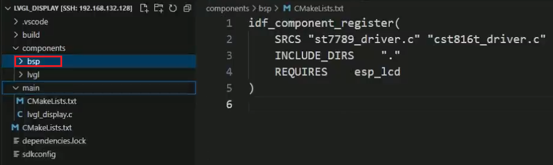
真正移植LVGL的源代码  
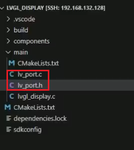

ESP-IDF中menuconfig设置
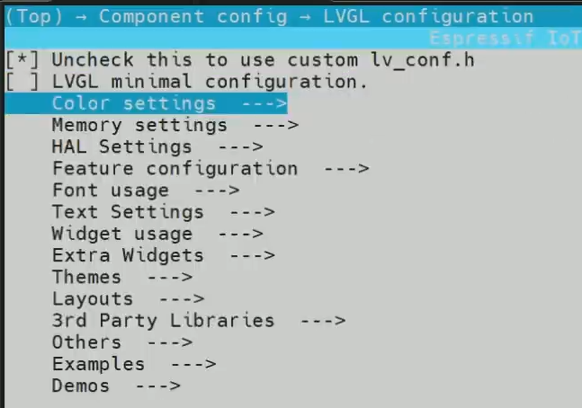
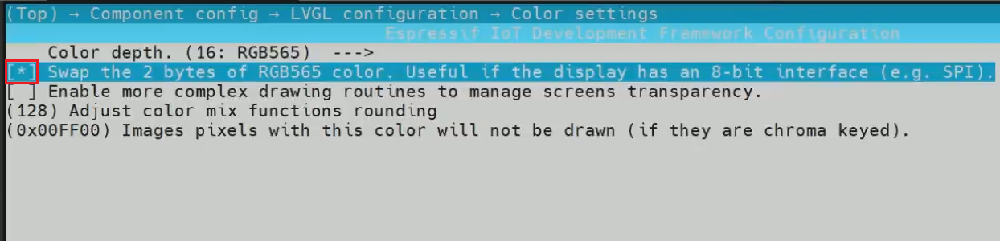  
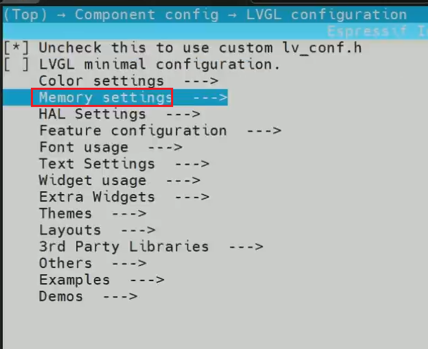  
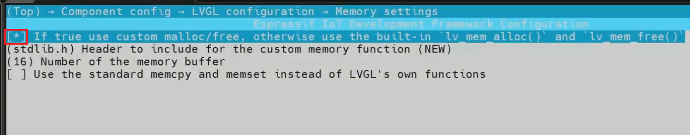  
启用第一个demo
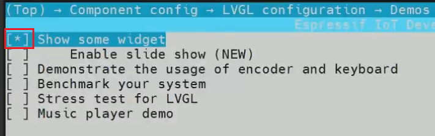

### 移植流程

五个步骤

1. 初始化和注册LVGL显示驱动
2. 初始化和注册LVGL触摸驱动
3. 初始化ST7789硬件接口
4. 初始化CST816T硬件接口
5. 提供一个定时器给LVGL使用

#### 1. 初始化和注册LVGL显示驱动

提供屏幕长和宽，如何写入数据，数据缓冲区
全局显示驱动变量lv_disp_drv_t
缓存是LVGL计算出要显示的内容画面存在这个缓存，写入到显示驱动芯片中
不能使用`malloc`申请的内存，使用`heap_caps_malloc`申请的内存
内存区域大小一般是一个屏幕的1/4到1/6之间，建议使用`MALLOC_CAP_DMA`方式申请
不能超过DMA的传输大小

```

l#v_disp_drv_t disp_drv;

```

## 代码分析

想显示内容，首先得告诉 LVGL 你的显示驱动信息，显示驱动信息包含显
示刷新缓存、显示屏的宽高、显示输出函数这三个信息。
lv_disp_draw_buf_init函数用于初始化显示缓存，把用户定义的缓存设置到draw_buf_dsc
显示缓存描述结构体上，这里要注意，我们使用 esp-idf 内存管理接口 heap_caps_malloc 申
请的缓存一定要用 MALLOC_CAP_INTERNAL | MALLOC_CAP_DMA 修饰，因为 SPI 传输 RGB 数
据用的是 DMA 方式，这种方式无法应用于外部 PSRAM，只能从内部 IRAM 进行申请。
lv_disp_drv_init 函数用于按默认配置初始化一个显示驱动 disp_drv。
之后我们对 disp_drv 这个驱动进行设置，包括显示宽高、缓存、显示数据输出函数，显
示数据输出函数 disp_flush 是需要我们实现的，当 LVGL 进行完界面的绘画后，最终是要调
用这个函数将 RGB 显示数据输出到 LCD 屏上，实现如下

## gif动画制作

esp32-idf提供了gif图片的第三方解码库，我们使用这个库显示图片。大概分为两个步骤，第一个是把图片转换为C语言数组文件，放到源文件中。第二个是编写几行代码调用它。比较简单。 图片转换成C语言数组，我们使用LVGL官方提供的图片转换在线工具进行转换。 LVGL在线图片转换器 https://lvgl.io/tools/imageconverter

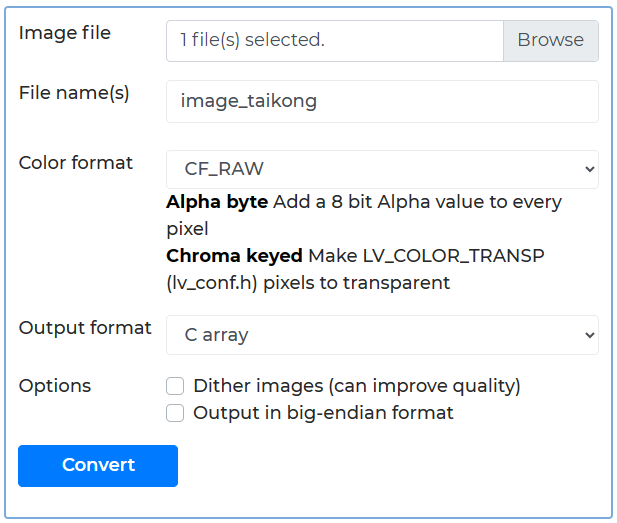
使用转换器的步骤是，先点击Browse选择我们要转换的图片，然后填写图片名称，颜色格式，我们选择CF_RAW，输出格式，选择C数组，最后点击Convert转换，转换完成的c代码，会自动从浏览器下载。如上图片显示，就是我转换太空人图片的设置。 下载好的C文件，我放到了工程main目录下，在VSCode中点击打开它。刚下载好的C文件，前面的13行有关于怎么包含lvgl.h头文件的条件编译，我已经全部删除，然后只写一个包含lvgl.h的include。 原来的代码：

```c
#ifdef __has_include
    #if __has_include("lvgl.h")
        #ifndef LV_LVGL_H_INCLUDE_SIMPLE
            #define LV_LVGL_H_INCLUDE_SIMPLE
        #endif
    #endif
#endif

#if defined(LV_LVGL_H_INCLUDE_SIMPLE)
#include "lvgl.h"
#else
#include "lvgl/lvgl.h"
#endif
```

修改后的代码

```c
#include "lvgl.h"
```

然后需要在main下面的CMakeLists.txt文件中添加它。

```c
idf_component_register(SRCS "image_taikong.c" 后面省略
```

然后我们需要在显示gif图片的C文件里面，使用下面语句声明一下。在lvgl_demo_ui.c文件的开始处，我已经添加进去。

```c
LV_IMG_DECLARE(image_taikong);
```

LVGL显示gif图片的代码，也非常简洁。我们的例程，在开机界面和主界面都显示了这个动图，开机界面显示函数lv_gui_start()和主界面显示函数lv_main_page()都位于main下面的lvgl_demo_ui.c文件中，我们现在可以打开lv_gui_start()函数，看一下调用图片的方法。在函数中看到，显示图片只需要3行代码，首先使用lv_gif_create创建一个对象，然后使用lv_gif_set_src给这个对象指定图片名称，最后使用lv_obj_align设置图片的显示位置。

```c
    // 显示太空人GIF图片
    lv_obj_t *gif_start = lv_gif_create(lv_scr_act());
    lv_gif_set_src(gif_start, &image_taikong);
    lv_obj_align(gif_start, LV_ALIGN_TOP_MID, 0, 20);
```

## 字库文件制作

1. 阿里普惠字体(可采用其他免费字体)：用来显示汉字和数字。 
   LVGL提供的中文字库，只有16像素大小的宋体字。在我们的开发板上看起来很小，费眼睛，而且宋体字也逐步在现在的电子产品中淘汰了。我们这里使用接近于手机显示效果的一种字体，阿里普惠体。这款字体是阿里巴巴提供的一款可以免费商用的字体，可以从下面的网站下载到。 阿里巴巴字体网站：https://www.alibabafonts.com/ 里面针对字体粗细有好几个版本，我下载的是Alibaba PuHuiTi 3.0 - 45 Light。

2. awesome字体： LVGL已经包含了57个awesome图标，如下图所示。
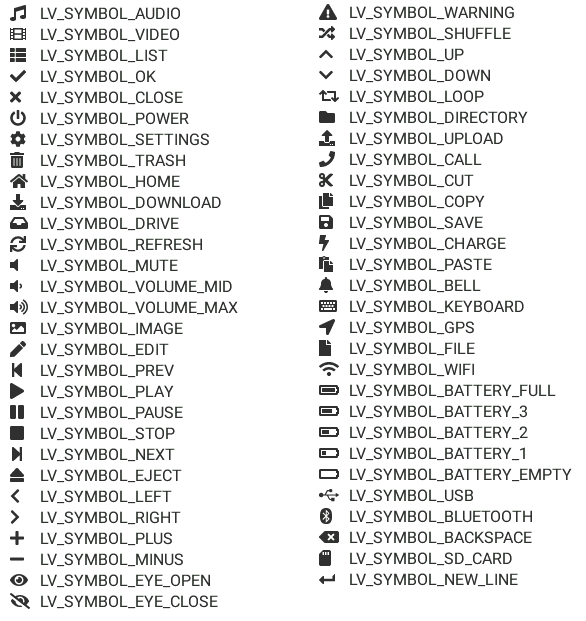
但是这里面，没有我们需要的可以代表温度和湿度的图标，所以我们需要自己再制作两个温湿度图标。
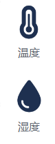
awesome字体的下载链接如下。

官方下载链接：https://fontawesome.com/download

3. 和风天气图标字体：用来显示天气图标。 和风天气官方提供了每个天气状况对应的图标，这些图标可以做成图片显示，也可以做成字体显示，本例程中，我们把它作为字体显示。
和风天气图标官方链接：https://icons.qweather.com/install/

4. LED数码管字体：用来显示时分秒。字体来自网络。
文件名称：Ni7seg.ttf

### 普通字体

把字体转换成C语言数组，可以使用LVGL官方提供的在线转换工具。 lvgl字体制作工具：https://lvgl.io/tools/fontconverter
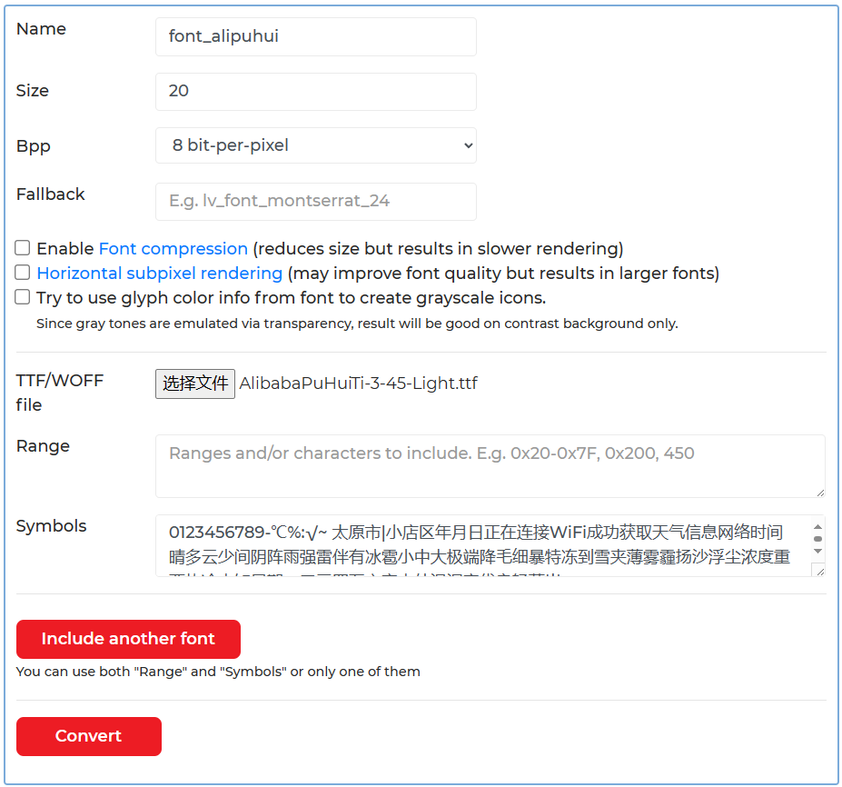
上图所示，是阿里普惠字体的转换示例。
首先定义一个自己的名字，这里我起名为font_alipuhui。

然后像素大小，我这里填了20。

接下来Bpp这里，有3个选项，分别是1 2 3 4 8bit-per-pixel，数字越大，显示效果越好，当然生成的C代码也越大，这里因为我们只需要提取几十个字，不必在乎C代码体积，所以选择效果最好的8。

然后是Fallback，这个是字体回退机制，作用是，在这个字体中，找不到你要用的字符时，就会尝试从这个fallback指定的字体中寻找。在这个例程中，我们没有用到字体回退功能，所以这里空下不填就可以。（如果要填的话，也必须要填已经存在的字体名称）

接下来点击“选择文件”选择我们刚才下载好的字体文件。然后在Symbols窗口中填入我们要显示的文字。最后点击Convert按钮生成字体C文件，会自动下载。 在本例程中，我们使用到的文字如下所示：

0123456789-℃%:√~ 太原市|小店区年月日正在连接WiFi成功获取天气信息网络时间晴多云少间阴阵雨强雷伴有冰雹小中大极端降毛细暴特冻到雪夹薄雾霾扬沙浮尘浓度重严热冷未知星期一二三四五六室内外温湿空优良轻落出

（注意在“0123456789-℃%:√~”后面还有一个空格） （你可以把其中的“太原市小店区”更改成你的城市和行政区）

### awesome字体 
生成awesome字体的配置如下图所示。
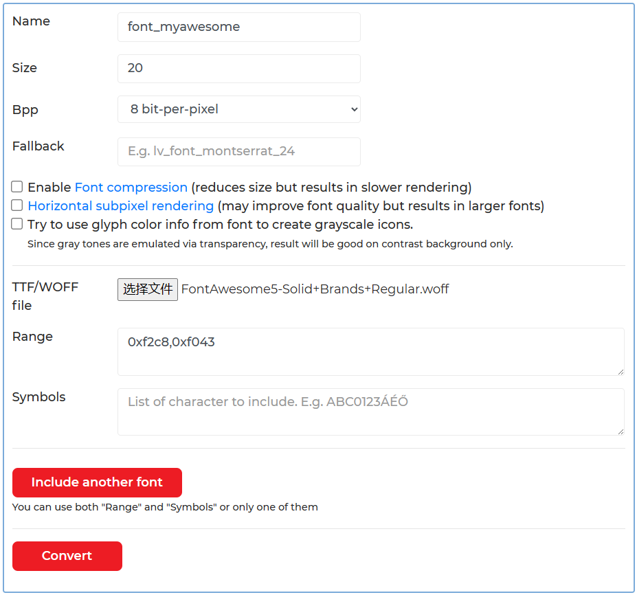
文件名称写为font_myawesome。像素大小设置为20，因为这个图标要和刚才生成的汉字在用一行显示，所以这里的像素也设置为20。Bpp设置为8，Fallback不用填。选择刚才下载的字体文件。在Range一栏里面写入温湿度的Unicode码。因为温湿度的符号用键盘打不出来，所以只能在Range一栏写它的Unicode码。 温湿度符号的Unicode码是多少，可以在awesome官方网站对应符号页面看到。
温度符号页面链接：(https://fontawesome.com/icons/temperature-three-quarters?f=classic&s=solid)

湿度符号页面链接：(https://fontawesome.com/icons/droplet?f=classic&s=solid)

### 图标字体
和风天气图标字体制作配置如下图所示：
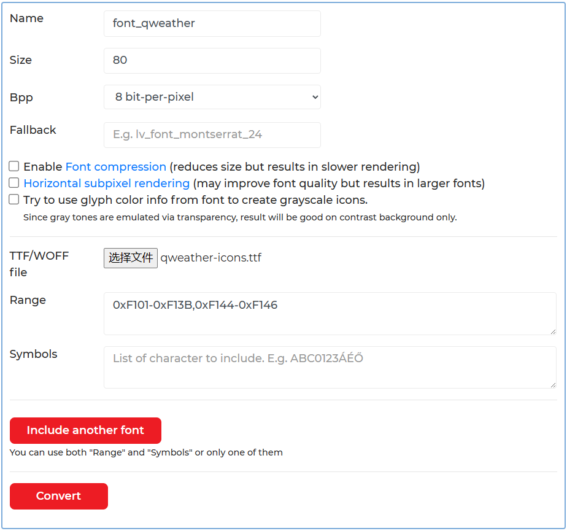
文件名称写为font_qweather，像素大小设置为80，Bpp选择8，Fallback不用填。文件选择刚才下载好的qweather字体。然后还是在Range一栏写入我们需要的图标Unicode码。 天气图标的Unicode码查看，需要使用一个字体编辑软件查看，比如Font Creator。
Font Creator软件下载地址：(https://www.xitongzhijia.net/soft/116980.html)

软件仅供交流学习使用，尊重版权，拒绝盗版，从你我做起。 使用Font Creator软件打开qweather-icon.ttf字体文件，就可以看到每个图标的Unicode码了，如下图所示。
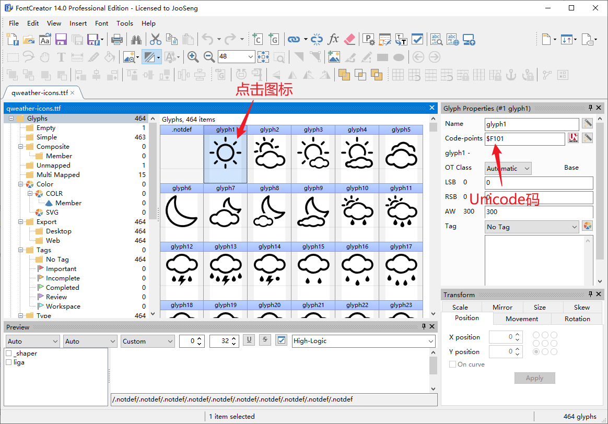
https://dev.qweather.com/docs/resource/icons/ 上面这个链接可以查到各种天气图标对应的图标代码，如下图所示：
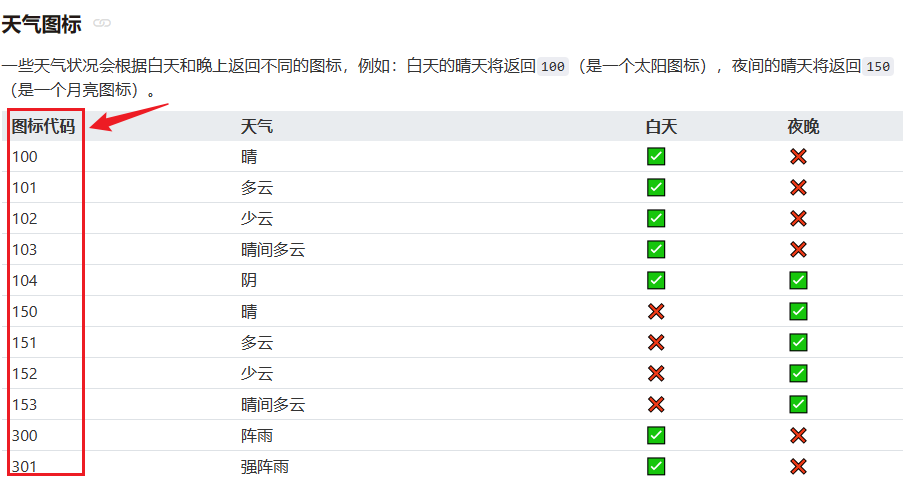
然后根据图标代码，在下面这个链接可以查看各个图标代码对应的图标形状。 https://icons.qweather.com/icons/#sunny
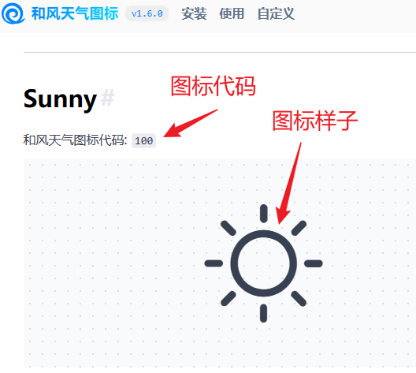
然后把所有的图标代码对应的图标样子的Unicode码，在Font Creator软件中找出来，最后的Unicode码就是 0xF101-0xF13B和0xF144-0xF146 所以在Range中填入：0xF101-0xF13B,0xF144-0xF146，就可以生成我们需要的全部天气图标了。

### 个性化字体 
LED数码管字体的制作，如下图所示。
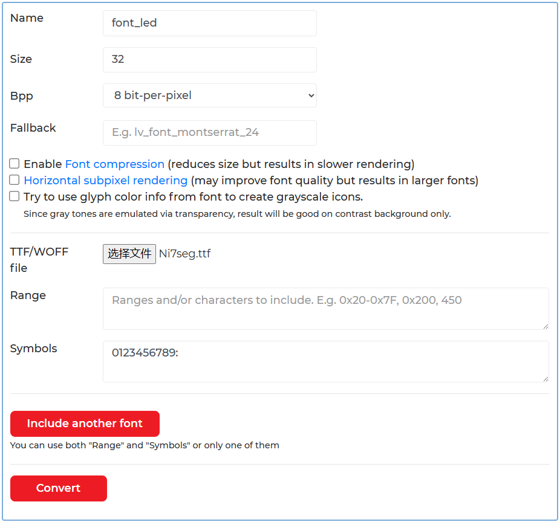
名称写为font_led，像素大小设置为32，Bpp设置为8，Fallback不用填。在Symbols一栏，写入要生成的符号，这里我写的是 0123456789: 注意这里面还有一个冒号，是英文的冒号，不要写成中文的。除了显示时分秒这几个数字以外，显示时钟还需要冒号，例如：12:25:18。

经过上面的一番操作，已经生成了4个字体c文件，接下来看看怎么在工程中使用它们。

把生成的字体c文件，放到了工程中main文件夹下面，如下图所示：
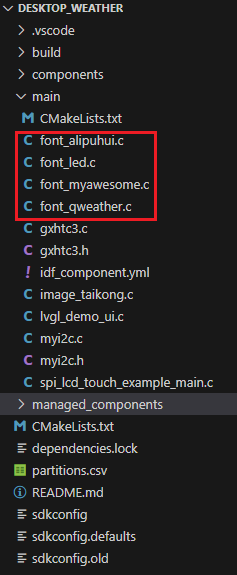
可以在VSCode软件中，点击打开它。文件源文件最前面关于怎么包含头文件lvgl.h的条件编译已经删除，修改为直接包含lvgl.h文件。 原来的：
```c
#ifdef LV_LVGL_H_INCLUDE_SIMPLE
#include "lvgl.h"
#else
#include "lvgl/lvgl.h"
#endif
```
修改为：
```c
#include "lvgl.h"
```
在main下面的CMakeLists.txt文件里面把这些字体文件添加进去。
```c
idf_component_register(SRCS "font_alipuhui.c" "font_myawesome.c" "font_qweather.c" "font_led.c" 后面省略
```
使用这个字体，还需要在使用字体的文件中，声明一下。在lvgl_demo_ui.c文件的开始处，我已经添加进去。
```c
LV_FONT_DECLARE(font_alipuhui);
LV_FONT_DECLARE(font_qweather);
LV_FONT_DECLARE(font_led);
LV_FONT_DECLARE(font_myawesome);
```
然后就可以写程序使用了，使用lv_obj_set_style_text_font函数指定字体，使用lv_label_set_text函数设置显示的内容，在lv_gui_start()函数中就可以看到。 刚才在制作字库的时候，如果字体是在Symbols栏中直接输入字符生成的，就可以直接在lv_label_set_text函数中使用，如下代码所示：
    
    lv_label_set_text(label_wifi, "正在连接WiFi");

如果字体是在Range一栏中使用Unicode码生成的，显示的内容需要使用UTF-8编码，如下代码所示：
    lv_label_set_text(temp_symbol_label2, "\xEF\x8B\x88"); // 温度图标

我们生成字体文件的时候，用的是Unicode码，这里需要的是UTF-8码，所以，需要把Unicode码转换成UTF-8编码才行。转换编码，可以使用下面的在线工具。 UTF-8工具：https://www.cogsci.ed.ac.uk/~richard/utf-8.cgi?input=F146&mode=hex 例如，温度的Unicode是F2C8，转换成UTF-8码后就是EF 8B 88，如下图所示：

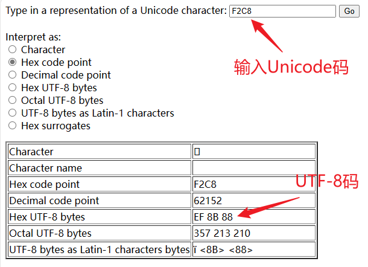