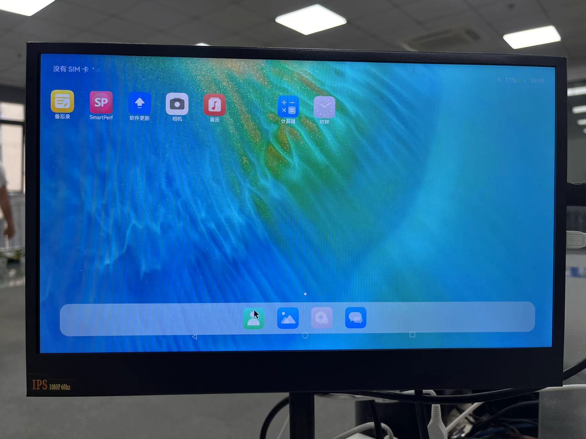
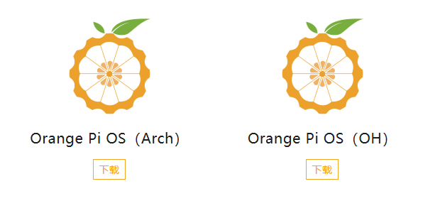
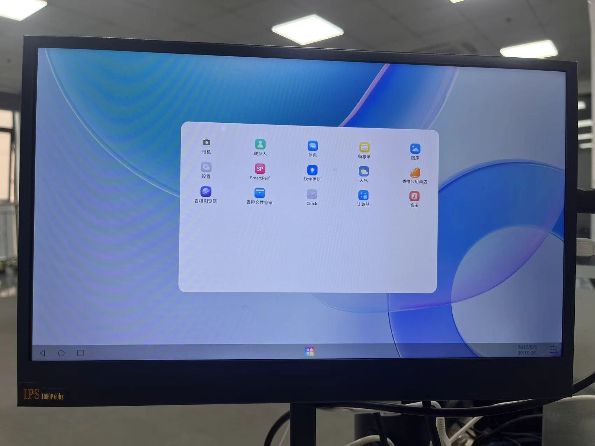

# 官方移植教程
https://gitee.com/openharmony/vendor_kaihong/blob/master/khdvk_3566b/porting-khdvk_3566b-on_standard-demo.md   
时间：至少一周起步，还是每天学习很久的那种
# 使用Purple Pi SDK编译
触觉智能官网产品中心  
http://www.industio.cn/product-item-37.html
https://img01.71360.com/w3/3xpdwd/20240814/879b91b66c76afecee10b81459d6873b.pdf  
烧录镜像后wifi,蓝牙都不正常
需要修改设备树，预计3天。

# 使用Orange Pi 3B烧录
  
仅释放镜像文件，无SDK  
Orange Pi OS（Arch）是一个基于Arch Linux的发行版  
Orange Pi OS（OH）是以 OpenHarmony 为主要技术路线  

蓝牙无法使用