# 置顶命令
验证验证下载的安装包是否完整  
    `md5sum 压缩包.tar.gz`  
查找当前路径下的文件  
`sudo find . -type f -name "*.bmp"`  
压缩  
`tar -xvf LCPI-H3.tar -C LCPI-H3`  
卸载一个软件包  
`sudo apt-get remove`  
清除无用的依赖关系  
`sudo apt-get autoremove`  
`croot` 到工程根目录， `cout` 同理到 out 编译目录  
`make menuconfig`    
`make kernel_menuconfig`    
>修改语言
LANG是环境变量，用于定义系统默认的语言和区域设置  
LANG='zh_CN.UTF-8'   
LANGUAGE变量用于指定多语言环境下的语言优先级  
LANGUAGE='zh_CN:en'   
覆盖了所有其他的本地化设置，强制系统使用指定的语言和字符编码  
LC_ALL='zh_CN.UTF-8'  

>ps | grep udhcpc  
>“ps” 命令用于查看当前系统中的进程状态，“|”这是管道符，用于将前一个命令的输出作为下一个命令的输入。在这个例子中，ps 命令的输出会被传递给 grep 命令。“grep udhcpc”grep 是一个文本搜索工具，用于在输入中搜索包含特定模式的行。在这个例子中，grep udhcpc 会搜索包含字符串 udhcpc 的行。
# 换源
清华源
地址：https://mirrors.tuna.tsinghua.edu.cn/help/ubuntu/
1. 备份  
    `sudo cp /etc/apt/sources.list /etc/apt/sources.list.back`  

2. 编辑，把sources.list文件中所有的deb文件全部注释掉或者删除掉，然后把上面给的国内镜像复制去就可以。  
`vim /etc/apt/sources.list`

3. 更新  
    `sudo apt update`
    `sudo apt upgrade`

# 压缩虚拟机
列出磁盘：你首先使用 disk list 确认虚拟机中有哪些磁盘设备。  
`sudo vmware-toolbox-cmd disk list`  
清理空闲空间：使用 disk wipe 清理文件系统中的空闲空间，确保在收缩时能有效移除未使用的空间。  
`sudo vmware-toolbox-cmd disk wipe /`  
收缩磁盘：最后使用 disk shrink 实际收缩虚拟机磁盘文件大小，释放磁盘空间。  
`sudo vmware-toolbox-cmd disk shrink /`  
# 配置Samba服务
1. 下载和安装 Samba  
    `sudo apt-get update`  
    `sudo apt-get install samba -y`  
    `samba -V`  
2. 配置Samba服务  
    `sudo vim /etc/samba/smb.conf`  
    #在文件末尾填入以下内容  
```
[ROS1]
   comment = share folder
   browseable = yes
   path = /home/huafeng
   valid users = huafeng, huafeng
   write list = huafeng, huafeng
   inherit owner = yes
   browsable = yes
   admin users = huafeng, huafeng
   public = yes
   writable = yes
   create mask = 0755
   read only = No
   directory mode = 0755
```
1. 设置分享账户密码  
    `sudo smbpasswd -a huafeng`  
2. 重启Samba服务  
    `sudo service smbd restart`  

# ADB命令
## 连接ADB  
### 仅有一个设备  
    adb shell  
### 多个设备  
    adb devices  
### 登录到开发板  
    adb -s 设备号或者IP shell 
## 传输文件
### 上传文件 
    adb push .\adb-test.txt /  
    或者
    adb -s 172.32.0.93:5555 push adb-test.txt /  
### 上传文件夹
    adb push .\adb-test\ /   

### 下载开发板 /userdata 目录下的 test_file.txt 到 PC 端。
    adb -s 172.32.0.93:5555 pull /userdata/test_file.txt test_file.txt

# SSH命令 
## 连接SSH  
    ssh 客户端用户名@服务器ip地址
    ssh root@172.32.0.93  
    ssh pico@172.32.0.70  
## 传输文件
    scp test.txt root@172.32.0.93:/root
## 传输文件夹
    scp -r ssh-test root@172.32.0.93:/root
# TFTP命令    
## 传输文件
### 从PC端tftp服务器下载文件到开发板
    tftp 172.32.0.94 -g -r tftp_get.txt
    tftp 172.32.0.94 -g -r sysfs_gpio

### 从开发板上传文件到PC端tftp服务器
    tftp 172.32.0.94 -p -l tftp_push.txt  

# Docker的安装
## 卸载旧版本的 Docker  
    sudo apt-get remove docker docker-engine docker.io containerd runc  
## 使用docker存储库安装
1. 更新 apt 包索引并安装相关软件包以允许 apt 通过 HTTPS 下载安装：  
   
        sudo apt-get update
        sudo apt-get install ca-certificates curl gnupg lsb-release  

2. 添加 Docker 的官方 GPG 密钥：  

        sudo mkdir -p /etc/apt/keyrings
        curl -fsSL https://download.docker.com/linux/ubuntu/gpg | sudo gpg --dearmor -o /etc/apt/keyrings/docker.gpg   

3. 设置存储库：  

        echo "deb [arch=$(dpkg --print-architecture) signed-by=/etc/apt/keyrings/docker.gpg] https://download.docker.com/linux/ubuntu $(lsb_release -cs) stable" | sudo tee -a /etc/apt/sources.list.d/docker.list > /dev/null  

## 使用阿里安装 Docker  
1. 更新 apt 包索引并安装相关软件包以允许 apt 通过 HTTPS 下载安装：  

        sudo apt-get update
        sudo apt-get install ca-certificates curl gnupg lsb-release 

2. 添加阿里云的Docker GPG密钥  
   
        sudo mkdir -p /etc/apt/keyrings
        curl -fsSL https://mirrors.aliyun.com/docker-ce/linux/ubuntu/gpg | sudo gpg --dearmor -o /etc/apt/keyrings/docker.gpg
3. 添加阿里云的Docker源

        echo "deb [arch=$(dpkg --print-architecture) signed-by=/etc/apt/keyrings/docker.gpg] https://mirrors.aliyun.com/docker-ce/linux/ubuntu $(lsb_release -cs) stable" | sudo tee /etc/apt/sources.list.d/docker.list > /dev/null
## 安装 Docker engine  

    sudo apt-get update
    sudo apt-get install docker-ce docker-ce-cli containerd.io docker-compose-plugin
验证安装完成  

    sudo docker -v

## 创建镜像
编写Dockerfile文件  

    vim dockerfile
dockerfile文件内容
```
# 设置基础镜像为Ubuntu 18.04
FROM ubuntu:18.04

# 设置作者信息
MAINTAINER lckfb "service@lckfb.com"

# 设置环境变量，用于非交互式安装
ENV DEBIAN_FRONTEND=noninteractive

# 备份源列表文件
RUN cp -a /etc/apt/sources.list /etc/apt/sources.list.bak

# 将源列表中的 http://.*ubuntu.com 替换为 http://repo.huaweicloud.com
RUN sed -i 's@http://.*ubuntu.com@http://repo.huaweicloud.com@g' /etc/apt/sources.list

# 更新包列表
RUN apt update

# 安装基本的编译工具和依赖
RUN apt install -y build-essential crossbuild-essential-arm64 \
        bash-completion vim sudo locales time rsync bc python

# 安装其他依赖包，这里编译android11sdk需要的环境
RUN apt install -y repo git ssh libssl-dev liblz4-tool lib32stdc++6 \
        expect patchelf chrpath gawk texinfo diffstat binfmt-support \
        qemu-user-static live-build bison flex fakeroot cmake \
        unzip device-tree-compiler python-pip ncurses-dev python-pyelftools \
        subversion asciidoc w3m dblatex graphviz python-matplotlib cpio \
        libparse-yapp-perl default-jre patchutils swig expect-dev u-boot-tools

RUN apt install -y bear

# 再次更新包列表并安装任何未安装的依赖
RUN apt update && apt install -y -f

# 生成本地化语言支持
RUN locale-gen en_US.UTF-8
ENV LANG en_US.UTF-8

# 创建开发板用户
RUN useradd -c 'lckfb user' -m -d /home/lckfb -s /bin/bash lckfb

# sudo免密登录
RUN sed -i -e '/\%sudo/ c \%sudo ALL=(ALL) NOPASSWD: ALL' /etc/sudoers
RUN usermod -a -G sudo lckfb

USER lckfb
#设置docker工作目录为/home/lckfb
WORKDIR /home/lckfb

#容器使用这个内核方法
#docker run --privileged --mount type=bind,source=/home/LCKFB_RK3566/ROCKCHIP_ANDROID11.0_SDK_RELEASE/ROCKCHIP_ANDROID11.0_SDK_RELEASE,target=/home/lckfb/android11 --name="lckfb_android11_sdk" -h lckfb -it lckfb_android11_sdk_cmp
```
## 创建镜像
```
在 Dockerfile 文件的存放目录下，执行构建动作

docker build -t lckfb_android11_sdk_cmp .
# lckfb_android11_sdk_cmp是镜像名称，可随意更改，注意命令最后有一个‘.’
# 此过程需要一段时间，请耐心等待
```

>如果运行`docker build -t lckfb_android11_sdk_cmp .`出现错误：
> 
>=> ERROR [internal] load metadata for docker.io/library/ubuntu:18.04  

修改/etc/docker/daemon.json 文件  

    sudo vi /etc/docker/daemon.json  
将文件内容改为：
```
{
  "registry-mirrors": ["https://ccr.ccs.tencentyun.com/"]
}
```
重启docker

    sudo systemctl restart docker
如果创建镜像时候出现了命令错误可以通过先运行下面进行测试

    docker run --rm -it Ubuntu 18.04 bash
- docker run 是用于创建并运行容器的命令。
- --rm 参数指示 Docker 在容器停止后自动删除该容器。这样可以确保不会在系统中留下不再使用的停止状态容器。
- -it 参数结合了 -i（交互式）和 -t（终端）两个选项，使得容器中的命令可以接收终端输入并显示输出。
- <镜像名称或ID> 是指要基于哪个镜像创建容器。您可以提供镜像的名称或ID来唯一标识一个镜像。
- <要运行的命令> 是您希望在容器中运行的命令或指令。
  
查看镜像

    docker images

## 基于镜像创建容器
    docker run --privileged --mount type=bind,source=/home/wucaicheng/gw_work/EX_DISK_A,target=/home/lckfb --name="lckfb_android11_sdk" -h lckfb -it lckfb_android11_sdk_cmp

- --privileged：在容器内启用特权模式，允许容器内的进程访问所有主机设备。
- --mount type=bind,source=/home/wucaicheng/gw_work/EX_DISK_A,target=/home/lckfb：创建绑定类型的挂载点，将宿主机上的/home/wucaicheng/gw_work/EX_DISK_A目录挂载到容器内的/home/lckfb目录。这使得容器内的应用程序可以访问并操作宿主机上的该目录。
- --name="lckfb_android11_sdk"：为容器指定一个名称，这样可以在后续的Docker命令中使用该名称引用容器。
- -h lckfb：设置容器的主机名为lckfb。
- -it：以交互式和终端的方式运行容器。
- lckfb_android11_sdk_cmp：使用名为lckfb_android11_sdk_cmp的镜像来创建容器。
## 启动容器  

    docker start lckfb_android11_sdk  #启动容器
    docker attach lckfb_android11_sdk #附加到正在运行的名为lckfb_android11_sdk的容器的终端上，以便与容器进行交互

# Docker命令
## docker镜像安装
    sudo docker load -i  ./luckfox_pico_docker.tar 
## 下载安装 docker 容器：
    sudo apt install docker.io -y
## 不用加sudo方法
1. 将用户添加到 Docker 组  
    sudo usermod -aG docker $USER
2. 注销并重新登录，或者运行以下命令使更改生效：

    sudo service docker restart
    newgrp docker

3. 确保用户 luckfox 已经成功添加到 docker 组。可以使用以下命令检查：  
    id luckfox
## 常用命令
    docker pull luckfoxtech/luckfox_pico:1.0      #从 Docker Hub 下载镜像。
    docker images                                 #列出本地所有的镜像。
    docker rmi luckfoxtech/luckfox_pico:1.0       #删除本地一个或多个镜像。
    docker search [image]                         #在 Docker Hub 上搜索镜像。
    docker ps                                     #列出当前运行的容器。
    docker ps -a                                  #列出所有的容器，包括停止的。
    docker start 1758                            #启动一个停止的容器。
    docker stop 1758                             #停止一个运行中的容器。
    docker restart 1758                          #重启一个容器。
    docker exec -it 1758 ls                      #在运行中的容器中执行命令。
    docker exec -it 1758 bash                    #进入一个已经打开的容器
    exit                                         #退出
    docker rm 1758                               #删除一个或多个容器。
## 运行容器
    sudo docker run -it --name luckfox --privileged -v /home/ubuntu/luckfox-pico:/home luckfoxtech/luckfox_pico:1.0 /bin/bash
-it运行一个交互式容器
--name可以为容器指定一个名称，使得容器更易于识别和管理
-v 选项可以将主机上的目录或文件挂载到容器内部。上述例子中，将主机上的 /home/ubuntu/luckfox-pico 目录挂载到容器内的 /home 目录  

    #第二次运行docker环境
    sudo docker start -ai luckfox
## 系统信息
    docker logs 1758                             #查看容器的日志。
    docker inspect 1758                          #查看容器的详细信息。
    docker top 1758                              #查看容器中运行的进程。
# 泰山派
## Docker编译  
    sudo docker start lckfb_android11_sdk
    sudo docker attach lckfb_android11_sdk
    cd ./RK3566/SDK-Linux/
    ./build.sh lunch
    3
## 编译buildroot
    export RK_ROOTFS_SYSTEM=buildroot
    ./build.sh all  
    ./build.sh uboot  
    ./build.sh kernel  
    ./build.sh recovery  
    ./build.sh rootfs  

    ./mkfirmware.sh  
## 编译Debian
    export RK_ROOTFS_SYSTEM=debian  
    ./build.sh all  
    ./mkfirmware.sh 

    source build/envsetup.sh && lunch rk3566_tspi-userdebug && make installclean -j88 && make -j88 && ./mkimage.sh  

    adb root && adb remount && adb push Z:\tspi\Android11_20231007\PublicVersion\device\rockchip\rk356x\bootanimation.zip /system/media/bootanimation.zip

## 编译安卓
    $设置 python2.7
    sudo update-alternatives --install /usr/bin/python python /usr/bin/python2.7 1
    $设置 python3.6
    sudo update-alternatives --install /usr/bin/python python /usr/bin/python3.6 2

    $python版本切换
    sudo update-alternatives --config python
    cd ./RK3566/SDK-Android/
一键编译：
```
cd u-boot && ./make.sh rk3566 && cd ../kernel && make clean && make distclean && make ARCH=arm64 tspi_defconfig rk356x_evb.config android-11.config && make ARCH=arm64 tspi-rk3566-user-v10.img -j16 && cd .. && source build/envsetup.sh && lunch rk3566_tspi-userdebug && make installclean -j16 && make -j16 && ./mkimage.sh
```
打包系统镜像：  
```
 ./build.sh -u
 ```
***
 
# RV1103_Luckfox_Pico_Plus
## 编译buildroot
    ./build.sh lunch
    ./build.sh
    ./build.sh uboot
    ./build.sh kernel

    ./build.sh rootfs
    ./build.sh media
    ./build.sh app
    ./build.sh firmware

## 编译ubuntu
### 加载交叉编译工具链
    cd {SDK_PATH}/tools/linux/toolchain/arm-rockchip830-linux-uclibcgnueabihf/

    source env_install_toolchain.sh
***
>project/cfg/BoardConfig_IPC SDK 配置文件


# LCPI-F1C200S
## 编译Buildroot
    make lcpi_f1c200s_defconfig  
    make savedefconfig  
    make -j8  
### 修改设备树
修改主机名，sh欢迎语，root用户密码，添加用户txt  
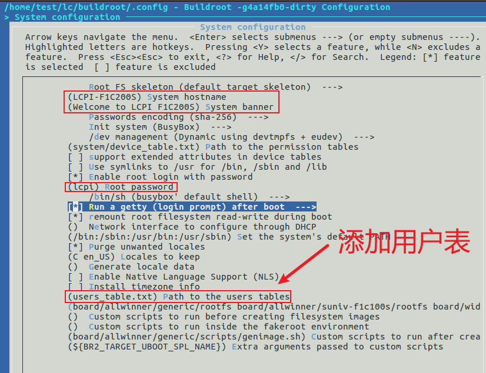
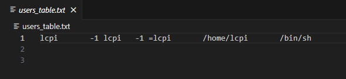 
## 烧录
### NAND烧录
先使用sunxi-fel.exe工具下载u-boot-sunxi-with-spl.bin，启动uboot，进入DFU模式，电脑接入的是DFU设备

    ./sunxi-fel.exe -p uboot ./u-boot-sunxi-with-spl.bin

或者双击使用from-fel-to-dfu.bat脚本
    
然后再通过dfu-util.exe工具将sysimage-nand.img刷进NAND里面。  
    
    ./dfu-util.exe -R -a all -D ./sysimage-nand.img

### TF烧录
使用***Win32DiskImager***软件烧录
## 测试
1. 设置图像格式：  
`media-ctl --set-v4l2 '"ov2640 0-0030":0[fmt:YUYV8_2X8/640x480]'`
2. 拍照测试：  
`fswebcam -d /dev/video0 --no-banner -r 640x480 -S 10 1.jpg`
3. 查看屏幕接口：  
`ls /dev/fb0`
4. 打印字符串到屏幕：  
`echo hello > /dev/tty1`
5. 修改录音配置文件  
`tinymix contents`  
修改方式
修改命令为：tinymix set 序号 内容  
>例如：# tinymix set 2 1 修改序号为2的项的值为on，on  
tinymix set 1 63 修改序号为1的项的值为63  
tinymix set 13 1 修改序号为13的项的值为on  
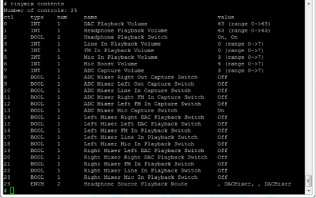  
6. 录制音频
`tinycap /tmp/test.wav`  
结束录音 Ctrl + C   
7. 播放录音  
`tinyplay /tmp/test.wav` 

# LCPI-V831
## 编译Tina
`source build/envsetup.sh`  
`lunch v831_LCPI-tina`  
`make -j12 && pack`  
### 修改设备树
修改主机名  
修改日志输出  
新增板级配置菜单选项  
编译alsa工具（可以使用arecord） 
https://www.cnblogs.com/TheGathering/p/18137803
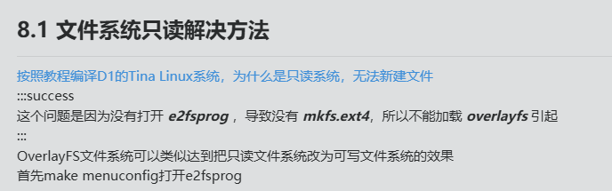
## 烧录
### TF烧录
使用***PhoenixCard***软件烧录 选***启动卡***  
## 测试
1. 网络测试：  
`wifi_connect_ap_test PUMPU 1234567890abc`  
`ping www.baidu.com`
2. 屏幕测试（雪花屏）：  
`cat /dev/urandom > /dev/fb0`
6. 录制音频  
`arecord a.wav`  
结束录音 Ctrl + C   
7. 播放录音  
`aplay a.wav`  
 Ctrl + C  停止   
7. 测试摄像头  
`echo "
from maix import camera, display, image
while(1):
    display.show(camera.capture())" >/root/test.Py`  
`python /root/test.py`  
 Ctrl + C  停止 
 
# LCPI-H3
## 编译安卓4.4
    cd lichee
    ./build.sh config
    1 0 0
    cd android
    source build/envsetup.sh
    lunch dolphin_fvd_p2-eng
    extract-bsp
    make -j16 && pack

镜像路径：lichee/tools/pack/sun8iw7p1_android_dolphin-p2_uart0.img
## 编译安卓7.0
    cd lichee
    ./build.sh config
    6 0 0
    cd android
    source build/envsetup.sh
    lunch dolphin_fvd_p1-eng
    extract-bsp
    make -j16 && pack  

    make installclean -j16 && make -j16 && pack

镜像路径：lichee/tools/pack/sun8iw7p1_android_dolphin-p1_uart0.img
### 编译报错“SSL error when connecting to the Jack server. Try ‘jack-diagnose‘”
需要删除/etc/java-8-openjdk/security/java.security文件中jdk.tls.disabledAlgorithms参数的TLSv1, TLSv1.1配置。
### 修改设备树
修改安卓型号为LCPI-H3,时区改为上海，国家改为中国，语言改为汉语
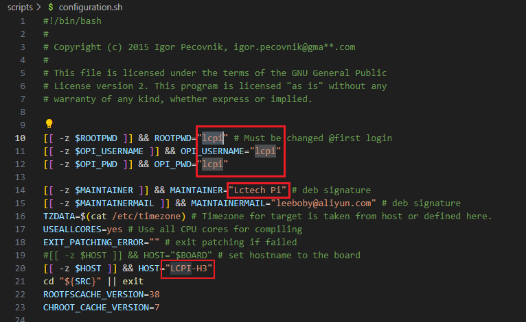
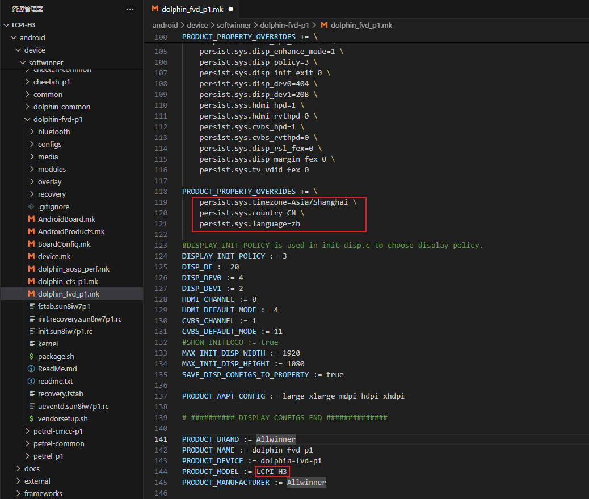
修改开机动画
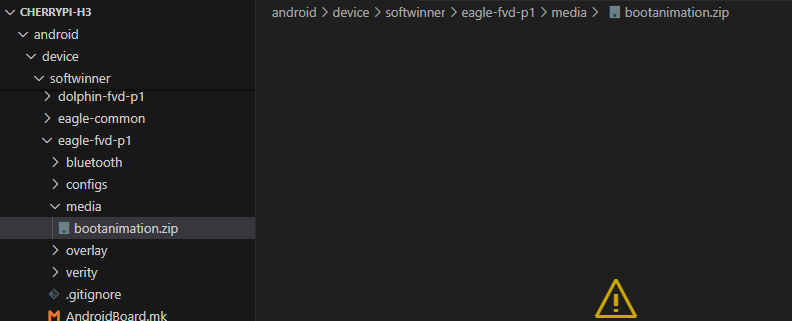
修改桌面壁纸
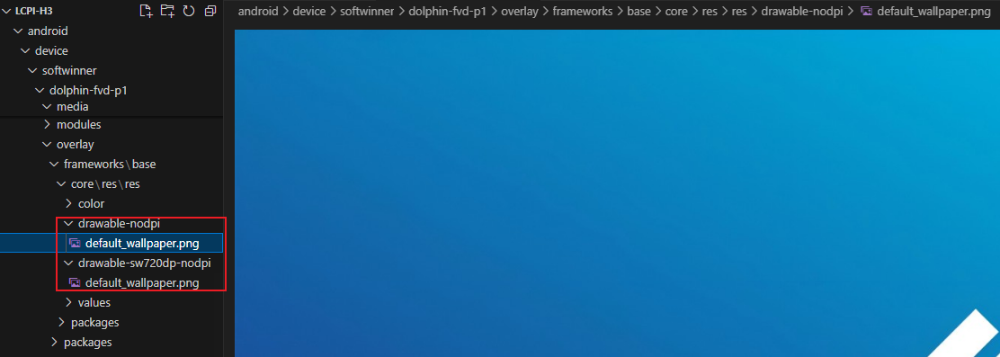
修改开机logo
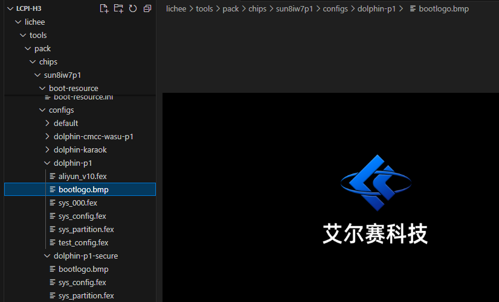

## 编译Ubuntu 20.04

    sudo ./build.sh  

### 一键编译  

    sudo ./build.sh BOARD=orangepipcplus BRANCH=current BUILD_OPT=image RELEASE=bionic BUILD_MINIMAL=no BUILD_DESKTOP=no KERNEL_CONFIGURE=yes

镜像路径：

### 修改设备树
修改主机名为LCPI-RK3566以及root密码为lcpi，普通用户账号为lcpi，密码为lcpi  
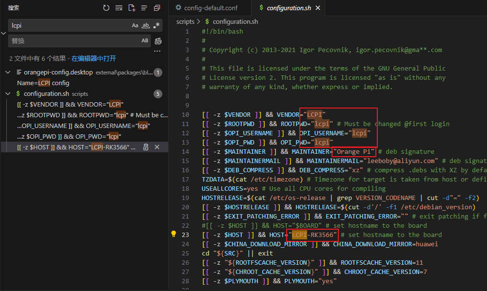

## 烧录
### TF烧录
安卓使用***PhoenixCard***软件烧录 选***启动卡***  
Linux使用***Win32DiskImager***软件烧录

### EMMC烧录
使用***PhoenixCard***软件烧录
选***量产卡***

# LCPI-RK3566
## 编译安卓
    export BOARD=orangepi3b  
    source build/envsetup.sh  
    lunch rk3566_r-userdebug  
    ./build.sh -AUKu 

    make installclean -j16 && make -j16 && pack
    ./build.sh -u

### 修改设备树
修改中文  
build/target/product/full_base.mk    
修改PRODUCT_LOCALES := zh_CN  
修改桌面背景  
修改3处png文件即可替换桌面壁纸  
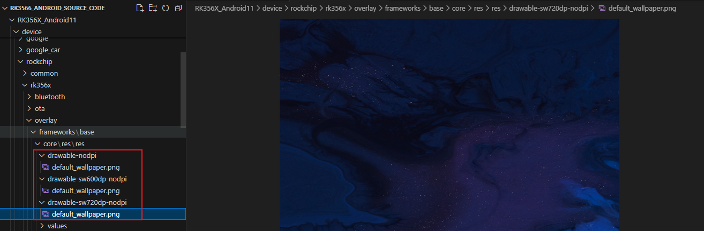

## 编译Linux
### 编译uboot
    sudo ./build.sh BOARD=orangepi3b BRANCH=current BUILD_OPT=u-boot KERNEL_CONFIGURE=no
### 编译Ubuntu22
    sudo ./build.sh BOARD=orangepi3b BRANCH=current BUILD_OPT=image RELEASE=bullseye BUILD_MINIMAL=no BUILD_DESKTOP=no KERNEL_CONFIGURE=no 
    sudo ./build.sh BOARD=LCPI-RK3566 BRANCH=current BUILD_OPT=image RELEASE=bullseye BUILD_MINIMAL=no BUILD_DESKTOP=no KERNEL_CONFIGURE=yes  
### 修改设备树
修改语言
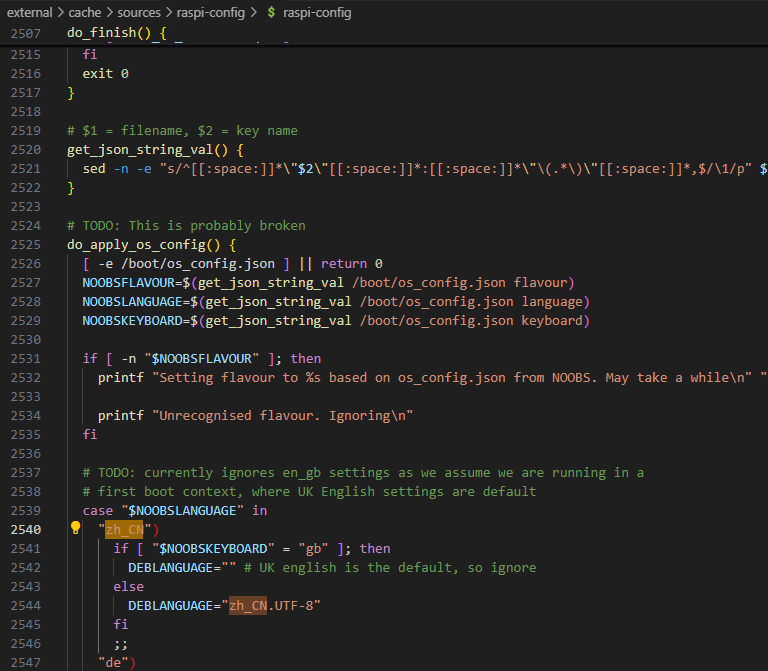

修改桌面背景  
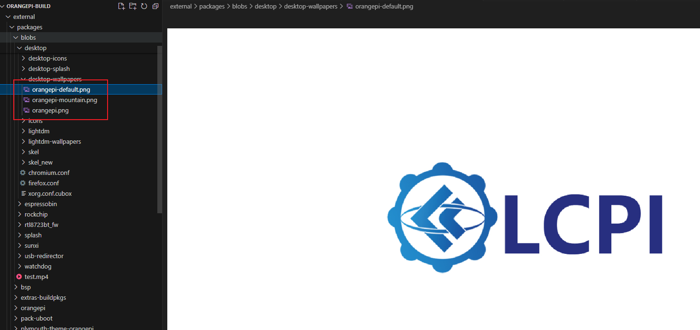
### 编译报错卡Installing [ orangepi-zsh_1.0.2_all.deb ]

apt-get后面加上-o Dpkg::Options::='--force-confdef' -o Dpkg::Options::='--force-confold'
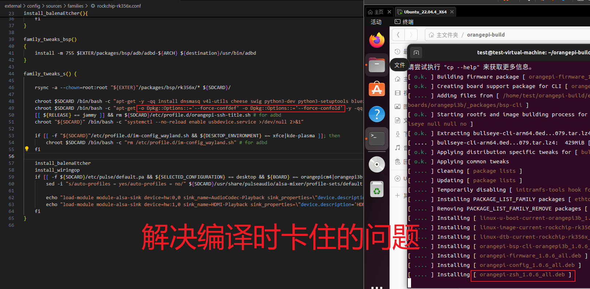
`chroot $SDCARD /bin/bash -c "apt-get -o Dpkg::Options::='--force-confdef' -o Dpkg::Options::='--force-confold' -y -qq install dnsmasq v4l-utils cheese swig python3-dev python3-setuptools bluez libncurses-dev" >> "${DEST}"/${LOG_SUBPATH}/install.log 2>&1`  

## 烧录
### TF烧录
安卓使用***PhoenixCard***软件烧录 选***启动卡*** 
Linux使用***Win32DiskImager***软件烧录  

### EMMC烧录
使用***RKDevTool***软件烧录  
# LCPI-H616
## 编译安卓
    cd longan
    ./build.sh config
    0 1 3
    ./build.sh
    cd android
    source build/envsetup.sh
    lunch cupid_p2-eng
    extract-bsp
    make -j16 && pack  

镜像路径：H616_Android10/longan/out/h616_android10_p2_uart0.img
## 烧录
### TF烧录
安卓使用***PhoenixCard***软件烧录 选***启动卡***  
Linux使用***Win32DiskImager***软件烧录  
### EMMC烧录
使用***RKDevTool***软件烧录

# LCPI-D1
## 编译Tina


## 烧录
### TF烧录
使用***PhoenixCard***软件烧录 选***启动卡*** 
