# 置顶命令
更新包列表`sudo apt update` `sudo apt upgrade`  
删除软件包，例如：
`sudo apt remove ros-noetic-*`  
彻底删除软件包及其残留的配置文件：
`sudo apt purge ros-noetic-*`   
清除无用的依赖关系  `sudo apt autoremove`  
在 Linux 系统中使用 vmhgfs-fuse 工具来挂载 VMware 共享文件夹的`sudo vmhgfs-fuse .host:/ /mnt/hgfs/ -o allow_other`

删除`rm -rf .git`
验证验证下载的安装包是否完整  `md5sum 压缩包.tar.gz`  
查找当前路径下的文件  `sudo find . -type f -name "*.bmp"`  
压缩  `tar -xvf LCPI-H3.tar -C LCPI-H3`  
`croot` 到工程根目录， `cout` 同理到 out 编译目录  
配置编译`make menuconfig` 配置 Linux 内核`make kernel_menuconfig`  

显示版本信息`ffgo`      
显示发行版本`lsb_release -a`  
历史命令  `history`  
使用串口时遇到权限问题  
临时：更改为最大权限  `sudo chmod 777 文件名`  
一劳永逸的办法：`sudo usermod -aG dialout 用户名`  
添加变量   
临时：`source export.sh`  
一劳永逸的办法：
```bash
ls -al   
vim .profile  
(可选)vim ~/.bashrc
source 你要添加的./export.sh  
例如：source esp32/esp-idf/export.sh
```
# 置顶链接
[luckfox](https://wiki.luckfox.com/zh/Core3566/)  
[firefly](https://wiki.t-firefly.com/zh_CN/ROC-RK3566-PC/index.html)  
[industio](http://www.industio.cn/product-item-58.html)  
[radxa](https://docs.radxa.com/rock3)  
[embedfire](https://doc.embedfire.com/linux/rk356x/quick_start/zh/latest/index.html)  
# 置顶知识
>修改语言
LANG是环境变量，用于定义系统默认的语言和区域设置  
LANG='zh_CN.UTF-8'   
LANGUAGE变量用于指定多语言环境下的语言优先级  
LANGUAGE='zh_CN:en'   
覆盖了所有其他的本地化设置，强制系统使用指定的语言和字符编码  
LC_ALL='zh_CN.UTF-8'  
更改已有用户的名称
`usermod -l newname oldname`

>ps | grep udhcpc  
>“ps” 命令用于查看当前系统中的进程状态，“|”这是管道符，用于将前一个命令的输出作为下一个命令的输入。在这个例子中，ps 命令的输出会被传递给 grep 命令。grep 是一个文本搜索工具，用于在输入中搜索包含特定模式的行。在这个例子中，grep udhcpc 会搜索包含字符串 udhcpc 的行。

 VS Code 中可以按 Ctrl+Shift+V键预览 Markdown格式的文本文件
# 备份系统的重要性：
我们的试错成本就会降低，我们可以快速的失败(fast fail)，非常敏捷地进行系统和应用的迭代，提升创新的效率。即使我们把系统玩崩了，重装系统就可以解决问题。git也是。每次编辑前不用将上份代码拷贝留底，写错了直接退回最后提交的版本即可。
# 换源

  
清华源
地址：https://mirrors.tuna.tsinghua.edu.cn/help/ubuntu/  
树莓派地址：https://mirrors.tuna.tsinghua.edu.cn/help/raspbian/
1. 备份  
    `sudo mv /etc/apt/sources.list /etc/apt/sources.list.back`  

2. 编辑，把sources.list文件中所有的deb文件全部注释掉或者删除掉，然后把上面给的国内镜像复制去就可以。  
`vim /etc/apt/sources.list`

1. 更新  
    `sudo apt update`
    `sudo apt upgrade`

## npn换源
由于网络延迟问题，建议将 npm 源切换为国内的镜像源，例如淘宝源，以加快安装速度：  
`npm config set registry https://registry.npmmirror.com`  
`npm install node-red-dashboard`
# 压缩虚拟机
列出磁盘：你首先使用 disk list 确认虚拟机中有哪些磁盘设备。  
`sudo vmware-toolbox-cmd disk list`  
清理空闲空间：使用 disk wipe 清理文件系统中的空闲空间，确保在收缩时能有效移除未使用的空间。  
`sudo vmware-toolbox-cmd disk wipe /`  
收缩磁盘：最后使用 disk shrink 实际收缩虚拟机磁盘文件大小，释放磁盘空间。  
`sudo vmware-toolbox-cmd disk shrink /`  
# 配置Samba服务
1. 下载和安装 Samba  
    `sudo apt-get update`  
    `sudo apt-get install samba -y`  
    `samba -V`  
2. 配置Samba服务  
    `sudo vim /etc/samba/smb.conf`  
    #在文件末尾填入以下内容  
```bash
[LCPI-H616-Linux]
   comment = share folder
   browseable = yes
   path = /home/yexing
   valid users = yexing, yexing
   write list = yexing, yexing
   inherit owner = yes
   browsable = yes
   admin users = yexing, yexing
   public = yes
   writable = yes
   create mask = 0755
   read only = No
   directory mode = 0755
```
3. 设置分享账户密码  
    `sudo smbpasswd -a yexing`  
4. 重启Samba服务  
    `sudo service smbd restart`  

# ADB命令
## 连接ADB  
### 仅有一个设备  
    adb shell  
### 多个设备  
    adb devices  
### 登录到开发板  
    adb -s 设备号或者IP shell 
## 传输文件
### 上传文件 
    adb push .\adb-test.txt /  
    或者
    adb -s 172.32.0.93:5555 push adb-test.txt /  
### 上传文件夹
    adb push .\adb-test\ /   

### 下载开发板 /userdata 目录下的 test_file.txt 到 PC 端。
    adb -s 172.32.0.93:5555 pull /userdata/test_file.txt test_file.txt

# SSH命令 
## 连接SSH  
    ssh 客户端用户名@服务器ip地址
    ssh root@172.32.0.93  
    ssh pico@172.32.0.70  
## 传输文件
    scp test.txt root@172.32.0.93:/root
## 传输文件夹
    scp -r ssh-test root@172.32.0.93:/root
## VSCode使用证书 SSH 登录到 ubuntu
Windows 系统下，打开 powershell，输入如下命令

    ssh-keygen -t ed25519 -C yexingye@outlook.com
一路回车，生成证书。  
C:\Users\${当前用户}\.ssh 目录下找到 `id_ed25519`和`id_ed25519.pub`   
然后打开公钥`id_ed25519.pub`复制里面的内容。在 ubuntu 系统下找到 authorized_keys 文件，将刚才 windows 下生成的 id_ed25519.pub 里面的内容复制到这个 authorized_keys 文件里面。
    
    ls -al
    cd .ssh
    ls
    vim authorized_keys


# TFTP命令    
## 传输文件
### 从PC端tftp服务器下载文件到开发板
    tftp 172.32.0.94 -g -r tftp_get.txt
    tftp 172.32.0.94 -g -r sysfs_gpio

### 从开发板上传文件到PC端tftp服务器
    tftp 172.32.0.94 -p -l tftp_push.txt  


# Git命令
## Git 全局设置:
```bash
git config --global user.name "keNengbu"
git config --global user.email "1312941046@qq.com"
修改主分支默认的名字（可选）：
git config --global init.defaultBranch master  
查看所有的配置
git config -l
```

## 克隆仓库
    git clone 地址
## 创建 git 仓库:
```bash
git init 
touch README.md
git add README.md
git commit -m "first commit"
git remote add origin https://gitee.com/dengshi08/learning-notes.git
git push -u origin "master"
```
  
### 已有仓库?
gitee：

    git remote add origin https://gitee.com/dengshi08/learning-notes.git  
    git push -u origin "master"

github：

    git remote add origin https://github.com/dengshi08/learning-notes.git
    git branch -M main
    git push -u origin main
如要两个都推送,github设置为：

    git remote add origin_github https://github.com/dengshi08/learning-notes.git
    git branch -M master
    git push -u origin_github master
git push是推送代码的指令，指定将当前代码推送到名字为origin的远程分支master。  

输入`ssh-keygen`后一路按回车，就可以快速生成一对公私钥。公钥会放在主目录.ssh文件夹下。使用`cat ~/.ssh/id_rsa.pub`命令查看公钥内容。然后将公钥添加到GitHub账号中https://github.com/settings/ssh/new 随便输入一个标题，并将刚刚生成的公钥复制粘贴到Key一栏

### 后续提交方式
    git add .
    git commit -m "新增了xx功能"
    git push -u origin "master"

## 分支操作
新建分支
```bash
git branch dev
git checkout dev
或
git checkout -b dev
```
`git status`：查看当前仓库的状态，包括哪些文件被修改、哪些文件在暂存区等。  
`git branch`：列出本地所有分支。  
`git branch -D 分支名`：删除分支。 
`git merge <branch_name>`：将指定分支合并到当前分支。  
`git pull <remote_name> <branch_name>`：从远程仓库拉取最新的修改并合并到当前分支。
`git fetch` ：从远程仓库拉取最新代码，但不合并到当前分支。  
## 查看历史
`git log`：查看提交历史。  
`git log --oneline`：以简洁的方式查看提交历史。  
`git diff <commit1> <commit2>`：比较两个提交之间的差异。`git diff `：比较所有差异。`git diff 文件名`：比较指定文件差异。  
## 撤销代码
第一种：有更改，未添加暂存区，未提交`git checkout 文件名` 
第二种：有更改，有添加暂存区，未提交`git reset （可选文件名）`从缓冲区踢出来，变回第一种
第三种：有更改，有添加暂存区，有本地提交`git log``git reset <commit>`变回第一种
## .gitignore文件不起作用的解决办法
    git rm -r --cached .
    git add .gitignore
    git commit -m "update .gitignore"  // windows使用的命令时，需要使用双引号
.gitignore文件,我在使用 GIT 的过程中，明明写好了规则，但问题不起作用，每次还是重复提交，无法忍受。

　　其实这个文件里的规则对已经追踪的文件是没有效果的，所以我们需要使用 rm 命令清除一下相关的缓存内容，这样文件将以未追踪的形式出现，然后再重新添加提交一下 .gitignore 文件里的规则就可以起作用了。
## repo工具：
    curl -o repo https://mirrors.tuna.tsinghua.edu.cn/git/git-repo
    将repo下载到你的主目录。  
赋予repo可执行权限：  

    chmod a+x ~/repo   
将repo添加到系统路径中：  

    export PATH=$PATH:~/
    这将临时把你的主目录添加到系统路径中，你可以将这个命令添加到你的~/.bashrc文件中，以便在每次登录时自动生效。  
    source ~/.bashrc
    repo --version


# Docker的安装
## 卸载旧版本的 Docker  
    sudo apt-get remove docker docker-engine docker.io containerd runc  
## 使用docker存储库安装
1. 更新 apt 包索引并安装相关软件包以允许 apt 通过 HTTPS 下载安装：  
   
        sudo apt-get update
        sudo apt-get install ca-certificates curl gnupg lsb-release  

2. 添加 Docker 的官方 GPG 密钥：  

        sudo mkdir -p /etc/apt/keyrings
        curl -fsSL https://download.docker.com/linux/ubuntu/gpg | sudo gpg --dearmor -o /etc/apt/keyrings/docker.gpg   

3. 设置存储库：  

        echo "deb [arch=$(dpkg --print-architecture) signed-by=/etc/apt/keyrings/docker.gpg] https://download.docker.com/linux/ubuntu $(lsb_release -cs) stable" | sudo tee -a /etc/apt/sources.list.d/docker.list > /dev/null  

## 使用阿里安装 Docker  
1. 更新 apt 包索引并安装相关软件包以允许 apt 通过 HTTPS 下载安装：  

        sudo apt-get update
        sudo apt-get install ca-certificates curl gnupg lsb-release 

2. 添加阿里云的Docker GPG密钥  
   
        sudo mkdir -p /etc/apt/keyrings
        curl -fsSL https://mirrors.aliyun.com/docker-ce/linux/ubuntu/gpg | sudo gpg --dearmor -o /etc/apt/keyrings/docker.gpg
3. 添加阿里云的Docker源

        echo "deb [arch=$(dpkg --print-architecture) signed-by=/etc/apt/keyrings/docker.gpg] https://mirrors.aliyun.com/docker-ce/linux/ubuntu $(lsb_release -cs) stable" | sudo tee /etc/apt/sources.list.d/docker.list > /dev/null
## 安装 Docker engine  

    sudo apt-get update
    sudo apt-get install docker-ce docker-ce-cli containerd.io docker-compose-plugin
验证安装完成  

    sudo docker -v

## 创建镜像
编写Dockerfile文件  

    vim dockerfile
dockerfile文件内容
```dockerfile
# 设置基础镜像为Ubuntu 18.04
FROM ubuntu:18.04

# 设置作者信息
MAINTAINER lckfb "service@lckfb.com"

# 设置环境变量，用于非交互式安装
ENV DEBIAN_FRONTEND=noninteractive

# 备份源列表文件
RUN cp -a /etc/apt/sources.list /etc/apt/sources.list.bak

# 将源列表中的 http://.*ubuntu.com 替换为 http://repo.huaweicloud.com
RUN sed -i 's@http://.*ubuntu.com@http://repo.huaweicloud.com@g' /etc/apt/sources.list

# 更新包列表
RUN apt update

# 安装基本的编译工具和依赖
RUN apt install -y build-essential crossbuild-essential-arm64 \
        bash-completion vim sudo locales time rsync bc python

# 安装其他依赖包，这里编译android11sdk需要的环境
RUN apt install -y repo git ssh libssl-dev liblz4-tool lib32stdc++6 \
        expect patchelf chrpath gawk texinfo diffstat binfmt-support \
        qemu-user-static live-build bison flex fakeroot cmake \
        unzip device-tree-compiler python-pip ncurses-dev python-pyelftools \
        subversion asciidoc w3m dblatex graphviz python-matplotlib cpio \
        libparse-yapp-perl default-jre patchutils swig expect-dev u-boot-tools

RUN apt install -y bear

# 再次更新包列表并安装任何未安装的依赖
RUN apt update && apt install -y -f

# 生成本地化语言支持
RUN locale-gen en_US.UTF-8
ENV LANG en_US.UTF-8

# 创建开发板用户
RUN useradd -c 'lckfb user' -m -d /home/lckfb -s /bin/bash lckfb

# sudo免密登录
RUN sed -i -e '/\%sudo/ c \%sudo ALL=(ALL) NOPASSWD: ALL' /etc/sudoers
RUN usermod -a -G sudo lckfb

USER lckfb
#设置docker工作目录为/home/lckfb
WORKDIR /home/lckfb

#容器使用这个内核方法
#docker run --privileged --mount type=bind,source=/home/LCKFB_RK3566/ROCKCHIP_ANDROID11.0_SDK_RELEASE/ROCKCHIP_ANDROID11.0_SDK_RELEASE,target=/home/lckfb/android11 --name="lckfb_android11_sdk" -h lckfb -it lckfb_android11_sdk_cmp
```
## 创建镜像

在 Dockerfile 文件的存放目录下，执行构建动作
`docker build -t lckfb_android11_sdk_cmp .`  
lckfb_android11_sdk_cmp是镜像名称，可随意更改，注意命令最后有一个‘.’
此过程需要一段时间，请耐心等待


>如果运行docker build -t lckfb_android11_sdk_cmp .出现错误：
> 
>=> ERROR [internal] load metadata for docker.io/library/ubuntu:18.04  

修改/etc/docker/daemon.json 文件  

    sudo vi /etc/docker/daemon.json  
将文件内容改为：
```dockerfile
{
  "registry-mirrors": ["https://ccr.ccs.tencentyun.com/"]
}
```
重启docker

    sudo systemctl restart docker
如果创建镜像时候出现了命令错误可以通过先运行下面进行测试

    docker run --rm -it Ubuntu 18.04 bash
- docker run 是用于创建并运行容器的命令。
- --rm 参数指示 Docker 在容器停止后自动删除该容器。这样可以确保不会在系统中留下不再使用的停止状态容器。
- -it 参数结合了 -i（交互式）和 -t（终端）两个选项，使得容器中的命令可以接收终端输入并显示输出。
- <镜像名称或ID> 是指要基于哪个镜像创建容器。您可以提供镜像的名称或ID来唯一标识一个镜像。
- <要运行的命令> 是您希望在容器中运行的命令或指令。
  
查看镜像

    docker images

## 基于镜像创建容器
    docker run --privileged --mount type=bind,source=/home/wucaicheng/gw_work/EX_DISK_A,target=/home/lckfb --name="lckfb_android11_sdk" -h lckfb -it lckfb_android11_sdk_cmp

- --privileged：在容器内启用特权模式，允许容器内的进程访问所有主机设备。
- --mount type=bind,source=/home/wucaicheng/gw_work/EX_DISK_A,target=/home/lckfb：创建绑定类型的挂载点，将宿主机上的/home/wucaicheng/gw_work/EX_DISK_A目录挂载到容器内的/home/lckfb目录。这使得容器内的应用程序可以访问并操作宿主机上的该目录。
- --name="lckfb_android11_sdk"：为容器指定一个名称，这样可以在后续的Docker命令中使用该名称引用容器。
- -h lckfb：设置容器的主机名为lckfb。
- -it：以交互式和终端的方式运行容器。
- lckfb_android11_sdk_cmp：使用名为lckfb_android11_sdk_cmp的镜像来创建容器。
## 启动容器  

    docker start lckfb_android11_sdk  #启动容器
    docker attach lckfb_android11_sdk #附加到正在运行的名为lckfb_android11_sdk的容器的终端上，以便与容器进行交互

# Docker命令
## docker镜像安装
    sudo docker load -i  ./luckfox_pico_docker.tar 
## 下载安装 docker 容器：
    sudo apt install docker.io -y
## 不用加sudo方法
1. 将用户添加到 Docker 组  
    `sudo usermod -aG docker $USER`
2. 注销并重新登录，或者运行以下命令使更改生效：

    `sudo service docker restart`  
    `newgrp docker`

3. 确保用户 luckfox 已经成功添加到 docker 组。可以使用以下命令检查：  
    `id luckfox`
## 常用命令
    docker pull luckfoxtech/luckfox_pico:1.0      #从 Docker Hub 下载镜像。
    docker images                                 #列出本地所有的镜像。
    docker rmi luckfoxtech/luckfox_pico:1.0       #删除本地一个或多个镜像。
    docker search [image]                         #在 Docker Hub 上搜索镜像。
    docker ps                                     #列出当前运行的容器。
    docker ps -a                                  #列出所有的容器，包括停止的。
    docker start 1758                            #启动一个停止的容器。
    docker stop 1758                             #停止一个运行中的容器。
    docker restart 1758                          #重启一个容器。
    docker exec -it 1758 ls                      #在运行中的容器中执行命令。
    docker exec -it 1758 bash                    #进入一个已经打开的容器
    exit                                         #退出
    docker rm 1758                               #删除一个或多个容器。
## 运行容器
    sudo docker run -it --name luckfox --privileged -v /home/ubuntu/luckfox-pico:/home luckfoxtech/luckfox_pico:1.0 /bin/bash
-it运行一个交互式容器
--name可以为容器指定一个名称，使得容器更易于识别和管理
-v 选项可以将主机上的目录或文件挂载到容器内部。上述例子中，将主机上的 /home/ubuntu/luckfox-pico 目录挂载到容器内的 /home 目录  

    #第二次运行docker环境
    sudo docker start -ai luckfox
## 系统信息
    docker logs 1758                             #查看容器的日志。
    docker inspect 1758                          #查看容器的详细信息。
    docker top 1758                              #查看容器中运行的进程。

# Python 源码编译安装的方法
```bash
sudo apt-get update

sudo apt-get install -y build-essential zlib1g-dev \
libncurses5-dev libgdbm-dev libnss3-dev libssl-dev libsqlite3-dev \
libreadline-dev libffi-dev curl libbz2-dev

wget \
https://www.python.org/ftp/python/3.9.10/Python-3.9.10.tgz
tar xvf Python-3.9.10.tgz

cd Python-3.9.10
./configure --enable-optimizations

make -j4
sudo make altinstall

python3.9 --version
/usr/local/bin/python3.9 -m pip install --upgrade pip
```
## Python 更换 pip 源的方法
`sudo apt-get update`
`sudo apt-get install -y python3-pip`

```bash
mkdir -p ~/.pip
cat <<EOF > ~/.pip/pip.conf

pip3 install <packagename> -i \
https://pypi.tuna.tsinghua.edu.cn/simple --trusted-host pypi.tuna.tsinghua.edu.cn
```

# 下载安装 arm64 版本 balenaEtcher 的方法
## deb 版本
    https://github.com/Itai-Nelken/BalenaEtcher-arm/releases/download/v1.7.9/balena-etcher-electron_1.7.9+5945ab1f_arm64.deb
```bash
sudo apt install -y \ --fix-broken ./balena-etcher-electron_1.7.9+5945ab1f_arm64.deb
```
## AppImage 版本
    https://github.com/Itai-Nelken/BalenaEtcher-arm/releases/download/v1.7.9/balenaEtcher-1.7.9+5945ab1f-arm64.AppImage
给 balenaEtcher 添加权限
```bash
chmod +x balenaEtcher-1.7.9+5945ab1f-arm64.AppImage
```

# 联网
## 串口联网
`nmcli dev wifi` 命令扫描周围的 WIFI 热点
`sudo nmcli dev wifi connect wifi_name password wifi_passwd` 命令连接到指定的 WIFI 热点
`ip addr show wlan0` 命令可以查看 wifi 的 IP 地址  
### nmcli 命令来设置静态 IP 地址
`nmcli con show` 命令可以查看网络设备的名字
```bash
sudo nmcli con mod "Wired connection 1" 
ipv4.addresses "192.168.1.110" 
ipv4.gateway "192.168.1.1" 
ipv4.dns "8.8.8.8" 
ipv4.method "manual"
```
## 图形化联网
`sudo nmtui`  
### nmtui 命令来设置静态 IP 地址
`sudo nmtui`  
选择 `Edit a connection`  
选择`Automatic`  
选择 `Manual`  
选择 `Show`  
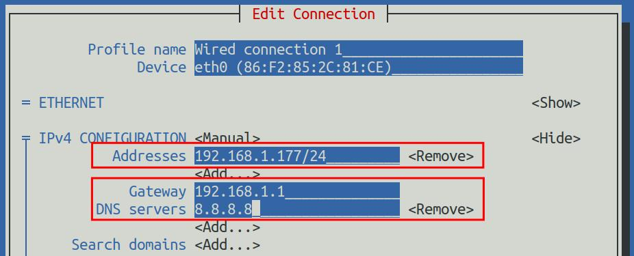  
  


# 香橙派系列命令
执行一些清理工作
`sudo general.sh cleaning`
## 设置 linux 系统终端自动登录的方法
### root 用户自动登录终端的方法

`mkdir -p /etc/systemd/system/getty@.service.d/`  
`mkdir -p /etc/systemd/system/serial-getty@.service.d/`

```bash
cat <<-EOF > \
/etc/systemd/system/serial-getty@.service.d/override.conf
[Service]
ExecStartPre=/bin/sh -c 'exec /bin/sleep 10' 
ExecStart= 
ExecStart=-/sbin/agetty --noissue --autologin root %I \$TERM
Type=idle
EOF
```
```bash
cp /etc/systemd/system/serial-getty@.service.d/override.conf \
/etc/systemd/system/getty@.service.d/override.conf
```
## 禁用linux 桌面版系统自动登录

方法一：
```bash
sudo sed -i \ "s/autologin-user=orangepi/#autologin-user=orangepi/" \
/etc/lightdm/lightdm.conf.d/22-orangepi-autologin.conf  
```
方法二：
`sudo vim /etc/lightdm/lightdm.conf.d/22-orangepi-autologin.conf`
```bash
[Seat:*]
#autologin-user=orangepi #如需自动登录请取消注释
autologin-user-timeout=0
user-session=xfce
```
## root 用户自动登录
`sudo vim /etc/lightdm/lightdm.conf.d/22-orangepi-autologin.conf`
```bash
[Seat:*]
autologin-user=root 
autologin-user-timeout=0
user-session=xfce
```
Ubuntu22.04 不需要设置下面这一步。
`sudo vim /etc/pam.d/lightdm-autologin`
```bash
#Allow access without authentication
#auth required pam_succeed_if.so user != root quiet_success
auth required pam_succeed_if.so user != anything quiet_success
```
## 禁用桌面
`sudo orangepi-config`  
System-Desktop-stop


## 设置中文

### Ubuntu 系统
Applications-Settings-Language Support-Install/Remove Languages-Chinese (simplified)-Apply-把中文拖到最上面-Apply System-Wide-Keyboard input method system-fcitx  
打开Fcitx5配置程序  
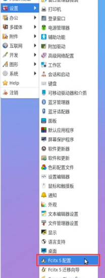
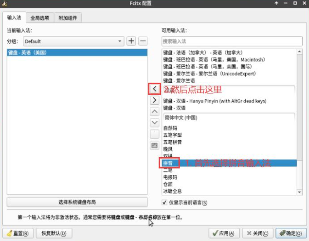
### Debian 系统
`sudo dpkg-reconfigure locales`  
zh_CN.UTF-8 UTF-8  
打开Input Method  
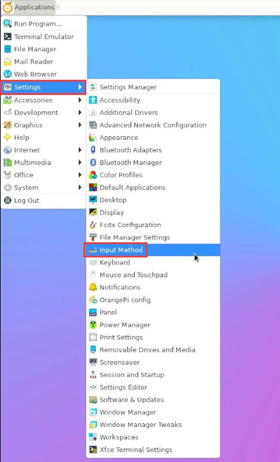  
选择fcitx  
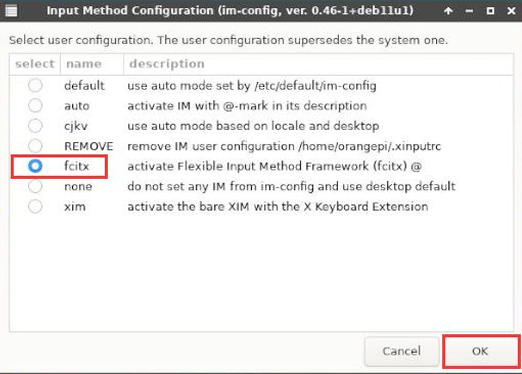  
重启  
打开Fcitx configuration  
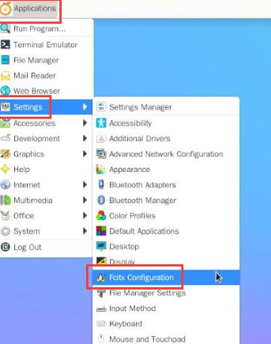  
搜索 GooglePinyin  

如果需要整个系统都显示为中文，可以将/etc/default/locale 中的变量都设置为
zh_CN.UTF-8  
`sudo vim /etc/default/locale`
```bash
# File generated by update-locale
LC_MESSAGES=zh_CN.UTF-8
LANG=zh_CN.UTF-8
LANGUAGE=zh_CN.UTF-8
```


`sudo apt update`
```bash
sudo apt install -y fonts-arphic-bsmi00lp \
fonts-arphic-gbsn00lp fonts-arphic-gkai00mp fcitx fcitx-table* \
fcitx-frontend-gtk* fcitx-frontend-qt* fcitx-config-gtk* im-config \
fcitx-googlepinyin fcitx-ui* zenity geany
```
Applications-Settings-Input Method-OK-Yes-fcitx-OK-Fcitx configuration-将 Google Pinyin 放到最前面


## 安装Docker的方法
Orange Pi 提供的linux镜像已经预装了Docker，只是Docker服务默认没有打开。  
使用enable_docker.sh 脚本可以使能docker 服务，然后就可以开始使用docker命令了，并且在下次启动系统时也会自动启动docker服务。  
`enable_docker.sh`  
`docker run hello-world`  
使用docker命令时，如果提示permissiondenied，请将当前用户加入到docker
用户组，这样不需要sudo就能运行docker命令了。  
orangepi@orangepi:~$ `sudo usermod -aG docker $USER`  
### HomeAssistant 的安装方法
`docker search homeassistant`  
下载HomeAssistant的docker镜像到本地
`docker pull homeassistant/home-assistant`  
查看下刚下载的HomeAssistant的docker镜像
`dockerimageshomeassistant/home-assistant`
```bash
docker run -d --name homeassistant --privileged --restart=unless-stopped -e TZ=Asia/Shanghai -v /home/orangepi/home-assistant:/config --network=host homeassistant/home-assistant:latest
```
停止HomeAssistant 容器的命令  
`docker stop homeassistant`  

## VNC远程登录

`sudo set_vnc.sh`  
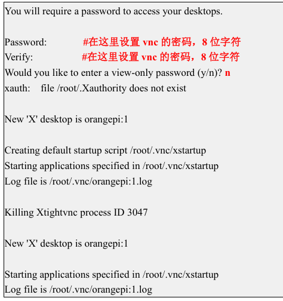
# 烧写模式
## 烧写EMMC
eMMC 一般都是直接焊在主板上，有些虽然是可插拔的，但没有专用的读卡器，因此需要使用板载烧写的方式来更新固件，即板上跑一个小系统，负责从主机或其它存储介质读取固件，再烧写到 eMMC 上。
取决于 eMMC 现存的内容，开发板有两种特殊的启动模式： Rockusb 模式 和 Maskrom 模式。
通常只需要进入 Rockusb 模式 即可升级现有的 Android 或 Ubuntu 系统。这种方式升级方式一般适用于 RK 固件或分区映像。

Maskrom 模式 则是系统未能识别到合法的启动设备而进入的模式。烧写原始固件到 eMMC 必须要进入该模式。
### Rockusb 模式
开发板启动后，CPU 如果在 eMMC 中找到有效的 IDB (IDentity Block)，它将从 eMMC 读取并加载 bootloader，并将执行控制权交给它。
### Maskrom 模式

如果开发板上电后遇到以下情况之一：

eMMC 内容为空。

eMMC 上的 bootloader 损坏。

将 eMMC 数据/时钟引脚接地，eMMC读取数据失败。

CPU 在 eMMC 中就会找不到有效的 IDB (IDentity Block)，转而执行一段小型的 ROM 代码，等待主机通过 USB 上传 bootloader 来初始化 DDR 内存并进入升级状态。这种模式称为 Maskrom 模式 。
# 自动登录系统
```bash
cat /etc/lightdm/lightdm.conf.d/20-autologin.conf

[Seat:*]
user-session=Lubuntu
autologin-user=root
```

# 开机自启动程序  
Firefly Ubuntu Desktop 可以使用以下方法设置开机自启动程序，不过需要注意操作权限和当前环境变量：

    vim /home/firefly/.config/lxsession/Lubuntu/autostart
    @/bin/mkdir /home/firefly/ssddd

# 部署大模型
    curl -fsSL https://ollama.com/install.sh | sh
    ollama run qwen2.5:0.5b
## 增加交换空间（Swap）
创建一个交换文件（例如，增加 1 GB 的交换空间）：

    sudo fallocate -l 1G /swapfile
设置交换文件权限：

    sudo chmod 600 /swapfile

格式化交换文件：

    sudo mkswap /swapfile

启用交换文件：

    sudo swapon /swapfile

确保交换文件在系统重启后自动启用，编辑 /etc/fstab 文件：

    sudo nano /etc/fstab

添加以下行：

    /swapfile none swap sw 0 0

# 泰山派
## Docker编译  
    sudo docker start lckfb_android11_sdk
    sudo docker attach lckfb_android11_sdk
    cd ./RK3566/SDK-Linux/
    ./build.sh lunch
    3
## 编译buildroot
    export RK_ROOTFS_SYSTEM=buildroot
    ./build.sh all  
    ./build.sh uboot  
    ./build.sh kernel  
    ./build.sh recovery  
    ./build.sh rootfs  

    ./mkfirmware.sh  
## 编译Debian
    export RK_ROOTFS_SYSTEM=debian  
    ./build.sh all  
    ./mkfirmware.sh 

    source build/envsetup.sh && lunch rk3566_tspi-userdebug && make installclean -j88 && make -j88 && ./mkimage.sh  

    adb root && adb remount && adb push Z:\tspi\Android11_20231007\PublicVersion\device\rockchip\rk356x\bootanimation.zip /system/media/bootanimation.zip

## 编译安卓
    $设置 python2.7
    sudo update-alternatives --install /usr/bin/python python /usr/bin/python2.7 1
    $设置 python3.6
    sudo update-alternatives --install /usr/bin/python python /usr/bin/python3.6 2

    $python版本切换
    sudo update-alternatives --config python
    cd ./RK3566/SDK-Android/
一键编译：
```
cd u-boot && ./make.sh rk3566 && cd ../kernel && make clean && make distclean && make ARCH=arm64 tspi_defconfig rk356x_evb.config android-11.config && make ARCH=arm64 tspi-rk3566-user-v10.img -j16 && cd .. && source build/envsetup.sh && lunch rk3566_tspi-userdebug && make installclean -j16 && make -j16 && ./mkimage.sh
```
打包系统镜像：  
```bash
 ./build.sh -u
 ```
***
 
# RV1103_Luckfox_Pico_Plus
## 编译buildroot
    ./build.sh lunch
    ./build.sh
    ./build.sh uboot
    ./build.sh kernel

    ./build.sh rootfs
    ./build.sh media
    ./build.sh app
    ./build.sh firmware

## 编译ubuntu
### 加载交叉编译工具链
    cd {SDK_PATH}/tools/linux/toolchain/arm-rockchip830-linux-uclibcgnueabihf/

    source env_install_toolchain.sh
***
>project/cfg/BoardConfig_IPC SDK 配置文件


# LCPI-F1C200S
## 编译Buildroot
    make lcpi_f1c200s_defconfig  
    make savedefconfig  
    make -j8  
### 修改设备树
#### 修改主机名，sh欢迎语，root用户密码，添加用户txt  
  
 
## 烧录
### NAND烧录
先使用sunxi-fel.exe工具下载u-boot-sunxi-with-spl.bin，启动uboot，进入DFU模式，电脑接入的是DFU设备

    ./sunxi-fel.exe -p uboot ./u-boot-sunxi-with-spl.bin

或者双击使用from-fel-to-dfu.bat脚本
    
然后再通过dfu-util.exe工具将sysimage-nand.img刷进NAND里面。  
    
    ./dfu-util.exe -R -a all -D ./sysimage-nand.img

### TF烧录
使用***Win32DiskImager***软件烧录
## 测试
1. 设置图像格式：  
`media-ctl --set-v4l2 '"ov2640 0-0030":0[fmt:YUYV8_2X8/640x480]'`
2. 拍照测试：  
`fswebcam -d /dev/video0 --no-banner -r 640x480 -S 10 1.jpg`
3. 查看屏幕接口：  
`ls /dev/fb0`
4. 打印字符串到屏幕：  
`echo hello > /dev/tty1`
5. 修改录音配置文件  
`tinymix contents`  
修改方式
修改命令为：tinymix set 序号 内容  
>例如：# tinymix set 2 1 修改序号为2的项的值为on，on  
tinymix set 1 63 修改序号为1的项的值为63  
tinymix set 13 1 修改序号为13的项的值为on  
  
6. 录制音频
`tinycap /tmp/test.wav`  
结束录音 Ctrl + C   
7. 播放录音  
`tinyplay /tmp/test.wav` 

# LCPI-V831
## 编译Tina
`source build/envsetup.sh`  
`lunch v831_LCPI-tina`  
`make -j12 && pack`  
### 修改设备树
修改主机名  
修改日志输出  
新增板级配置菜单选项  
编译alsa工具（可以使用arecord） 
### 文件系统只读解决方法
https://www.cnblogs.com/TheGathering/p/18137803  

## 烧录
### TF烧录
使用***PhoenixCard***软件烧录 选***启动卡***  
## 测试
1. 网络测试：  
`wifi_connect_ap_test PUMPU 1234567890abc`  
`ping www.baidu.com`
2. 屏幕测试（雪花屏）：  
`cat /dev/urandom > /dev/fb0`
6. 录制音频  
`arecord a.wav`  
结束录音 Ctrl + C   
7. 播放录音  
`aplay a.wav`  
 Ctrl + C  停止   
7. 测试摄像头  
`echo "
from maix import camera, display, image
while(1):
    display.show(camera.capture())" >/root/test.Py`  
`python /root/test.py`  
 Ctrl + C  停止 
 
# LCPI-H3
## 编译安卓4.4
    cd lichee
    ./build.sh config
    1 0 0
    cd android
    source build/envsetup.sh
    lunch dolphin_fvd_p2-eng
    extract-bsp
    make -j16 && pack

镜像路径：lichee/tools/pack/sun8iw7p1_android_dolphin-p2_uart0.img
## 编译安卓7.0
    cd lichee
    ./build.sh config
    6 0 0
    cd android
    source build/envsetup.sh
    lunch dolphin_fvd_p1-eng
    extract-bsp
    make -j16 && pack  

    make installclean -j16 && make -j16 && pack

镜像路径：lichee/tools/pack/sun8iw7p1_android_dolphin-p1_uart0.img
### 编译报错“SSL error when connecting to the Jack server. Try ‘jack-diagnose‘”解决办法
需要删除/etc/java-8-openjdk/security/java.security文件中jdk.tls.disabledAlgorithms参数的TLSv1, TLSv1.1配置。

    sudo vim /etc/java-8-openjdk/security/java.security  
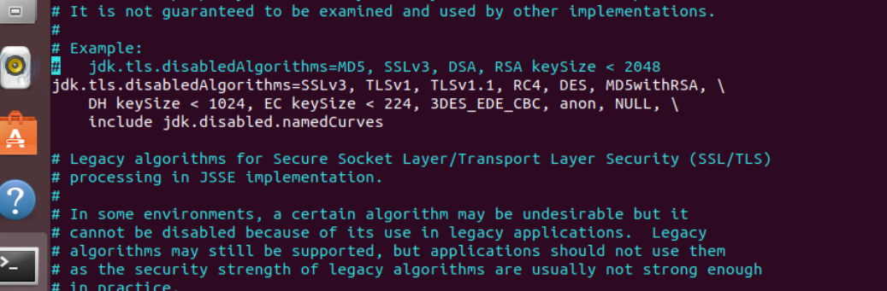
### 修改设备树
#### 修改安卓型号为LCPI-H3,时区改为上海，国家改为中国，语言改为汉语  

#### 修改开机动画  

#### 修改桌面壁纸

#### 修改开机logo  


## 编译Ubuntu 20.04

    sudo ./build.sh  

### 一键编译  

    sudo ./build.sh BOARD=orangepipcplus BRANCH=current BUILD_OPT=image RELEASE=bionic BUILD_MINIMAL=no BUILD_DESKTOP=no KERNEL_CONFIGURE=yes

镜像路径：

### 修改设备树
#### 修改主机名为LCPI-H3以及root密码为lcpi，普通用户账号为lcpi，密码为lcpi，邮箱：admin@lctech-inc.com，网址：www.lcpi.cn  
邮箱：admin@lctech-inc.com，网址：www.lcpi.cn  
http://wiki.lcmaker.com  
  
#### 修改orangepi-config
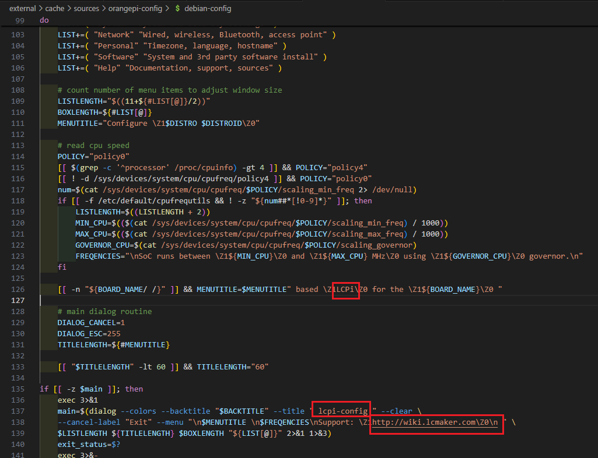  
`www.lcpi.cn`  
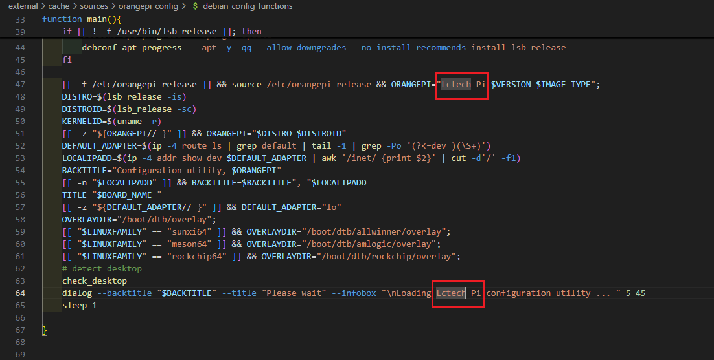  
#### 修改终端窗口名称  
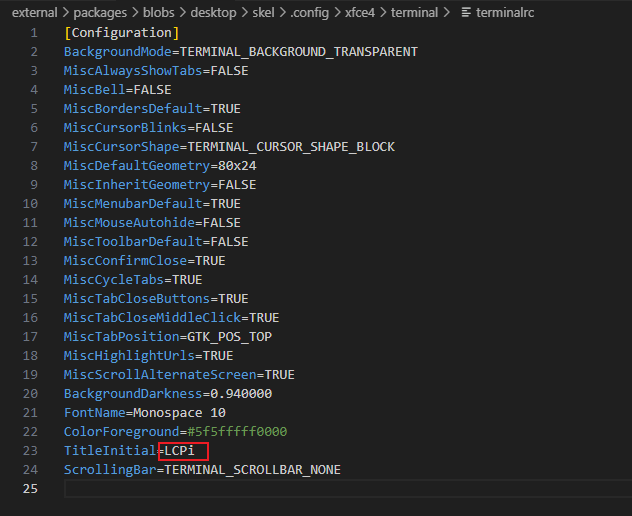  
  
## 烧录
### TF烧录
安卓使用***PhoenixCard***软件烧录 选***启动卡***  
Linux使用***balenaEtcher***软件烧录或者***Win32DiskImager***软件烧录  

### EMMC烧录
安卓使用***PhoenixCard***软件烧录
选***量产卡***
Linux烧录到TF卡上,
运行`nand-sata-install` 
选择`2 Boot from eMMC-sysytem on eMMC``ext4`

Linux先烧录到TF卡，启动进入系统后

1. 运行 `nand-sata-install` 脚本
2. 选择2 Boot from eMMC - sysytem on eMMC
3. 然后会提示选择文件系统的类型，支持 ext2/3/4、f2fs 以及 btrfs 五种文件系统
4. 
# LCPI-RK3566
## 编译安卓
    export BOARD=orangepi3b  
    source build/envsetup.sh  
    lunch rk3566_r-userdebug  
    ./build.sh -AUKu 

    make installclean -j16 && make -j16 && pack
    ./build.sh -u

镜像路径：rockdev/Image-rk3566_r/  
update.img是支持 TF 卡和 eMMC 启动镜像，update_spi_nvme.img 是 NVME SSD 启动镜像  
### 修改设备树

    路径：orangepi-build\kernel\orange-pi-6.6-rk35xx\arch\arm64\boot\dts\rockchip
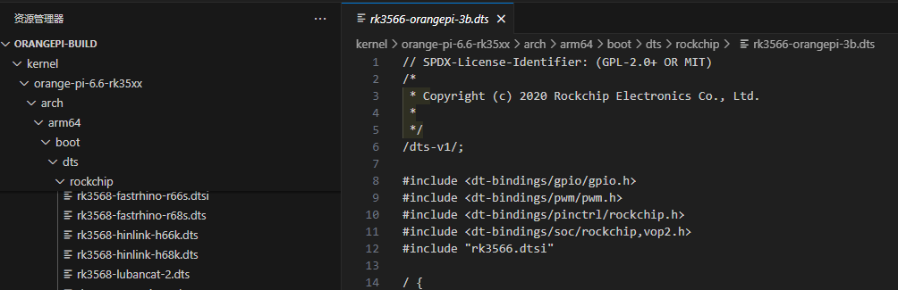  
#### 修改中文  
路径：build/target/product/full_base.mk    
修改`PRODUCT_LOCALES := zh_CN`  
#### 修改桌面背景  
修改3处png文件即可替换桌面壁纸  
  
#### 开机logo更换
找一张你想使用的开机logo图片，最好图片大小尺寸和屏幕的尺寸一样，比如我们这里随便找一张图片用来做测试。选择保存图片到本地。  
一般图片保存到本地以后大多都是png或者jpeg的格式开机logo使用的是bmp格式，所以我们需要进一次图片格式转换，如果你有会用PS等工具的话可以使用他们调整一下图片大小已经旋转方向，最后输出bmp，如果你懒那也没有关系，转bmp的在线工具有很多，这里推进一个在线转换：https://onlineconvertfree.com/zh/convert-format/png-to-bmp/  
把转换完的logo代替kernel目录下的logo.bmp和logo_kernel.bmp。  
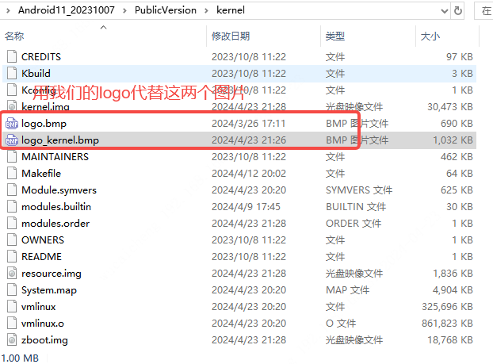  
logo代替完成以后要生效还需要重新编译内核并更新内核，如果编译过程中出现logo相关报错，一般都是logo格式不对，重新生成bmp图片后在尝试编译。图片格式不对会导致错误  

#### 修改系统信息
使用我们提供的sdk编译出来后的Android11系统固件进入关于系统中，默认设备名称和型号都是rk3566_tspi，大家开发自己的产品时候一般希望客户看到的是自己的商品名称，我们可以通用修改rk3566_tspi.mk实现。  
路径：SDK/device/rockchip/rk356x/rk3566_tspi/rk3566_tspi.mk  
```
PRODUCT_MODEL := rk3566_tspi
修改为：
PRODUCT_MODEL := LCPI-RK3566
```
#### 修改修改时区
Android11系统在联网的情况下会自动去同步时间，但是如果时区不是中国时区自动同步以后会有时差，所以我们需要把系统默认的时区修改成中国时区。  
路径:SDK/device/rockchip/rk356x/rk3566_tspi/rk3566_tspi.mk  
```
#添加时区为亚洲上海
PRODUCT_PROPERTY_OVERRIDES += persist.sys.timezone=Asia/Shanghai
```
#### 修改屏幕密度
屏幕密度决定了Android11系统UI的缩放布局以及选择的素材控件等，举个例子如果你屏幕是2K的分辨率，那么你密度就可以调大一点这个图标才协调，如果你用的是这次的3.1寸屏密度大了一个桌面就只能放下几个图标  
路径:SDK/device/rockchip/rk356x/rk3566_tspi/rk3566_tspi.mk。  
```
#修改密度这里是240
PRODUCT_PROPERTY_OVERRIDES += ro.sf.lcd_density=240
```
#### 预制apk
开发板下载系统以后如果有需要用到的apk还需要自己手动安装，加入有100W个手机都需要用到这个apk应用，如果我们每个都去手动安装那基本上是不现实的，我们可以把需要安装的应用内置到系统sdk中，我们装系统的时候自动安装。  
```
SDK/device/rockchip/rk356x/rk3566_tspi
preinstall             //不可卸载应用
preinstall_del         //可卸载卸载，恢复出厂设置复原应用
preinstall_del_forever //可卸载应用，恢复出厂设置不会复原
```
创建了一个preinstall目录并放入了一个yingyongbao.apk（应用宝）  
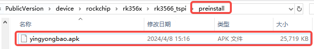  
编译以后会自动生成Android.mk和preinstall.mk  
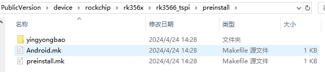  
out目录下生成我们预制的应用  
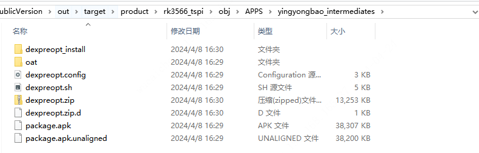  
#### 修改开机动画
开机显示完logo以后会进入系统之前会显示一段开机动画，默认的android系统开机动画是一个android的logo在闪光，我们可以自定自己的开机动画来代替默认开机动画。  
##### 创建文件夹  
创建开机动画文件夹命名为bootanimation，并在文件夹中创建两个文件夹分别为part0,part1和一个文档desc.txt。  
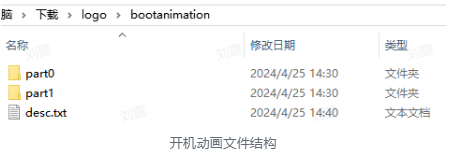  
文件说明：
partN：用于存放动画图片，里面存放着多张连续的图片，开机会去播放里面的图片。如果part0播放完了，接着就来播放part1，以此类推N代表多个part，我们这里就演示两个。  
desc.txt：描述图片信息以及显示的方式  
```
800 480 10
p 1 0 part0
p 0 0 part1
```
第一行：800 480 10分别表示800*480分辨率和一秒钟播放10张图片。  
第二行：p 1 0 part0分别表示p播放、1播放循环次数为一次，播放完后间隔0秒重复播放或播放下一个part。part0指目录。  
第三行：p 0 0 part1分别表示p播放、0播放一直循环播放，播放完后间隔0秒重复播放或播放下一个part。part1指目录。  

##### part目录  
这里以part0目录为例，part1大家举一反三，part中对图片的命名格式有明确要求，如果不按照要求来系统无法识别。规则如下：  

建议使用png格式图片  
图片的序列是连续的  
如果图片个数小于10张图片的命名规则是01.png到09.png  
如果图片个数小于100张图片的命名规则是001.png到099.png  
如果图片个数小于1000张图片的命名规则是0001.png到0999.png 下面素材中提供的图片有117张所以命名就是0001.png到0117.png  
##### 打包压缩资源  
打包这里大家一定要非常注意，不是直接压缩bootanimation目录，这样压缩后会多一层bootanimation目录导致系统无法识别，需要进入bootanimation目录选择所有文件压缩。压缩等级改为仅存储。  
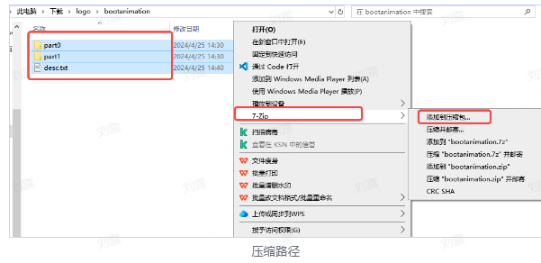  
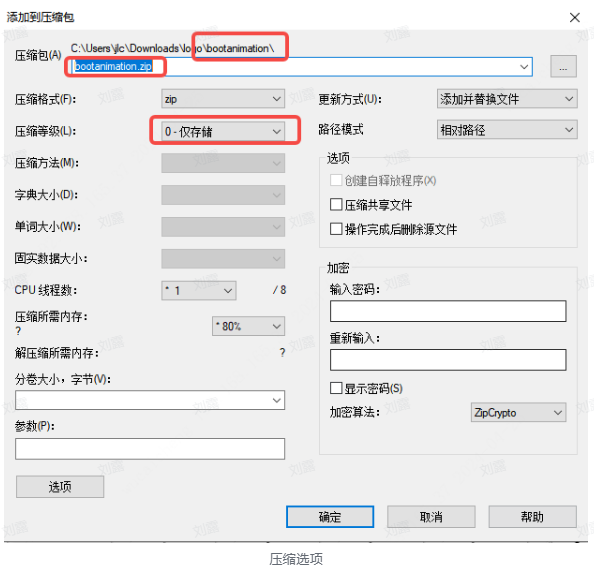  
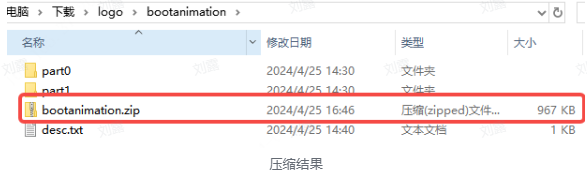  
##### 修改SDK  
把上面准备好的bootanimation.zip资源文件复制到SDK/device/rockchip/rk356x目录下。  
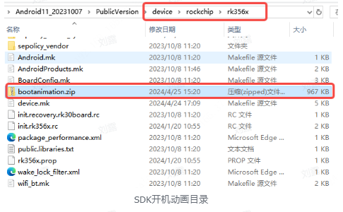  
打开SDK/device/rockchip/rk356x/device.mk文件在末尾追加下面代码。  
```
PRODUCT_COPY_FILES += $(LOCAL_PATH)/bootanimation.zip:system/media/bootanimation.zip
```
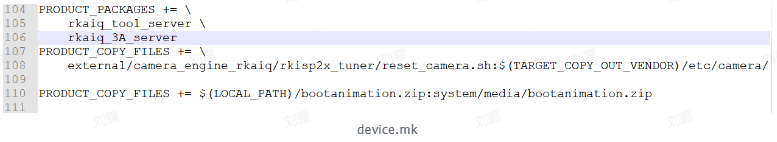  

## 编译Linux
### 编译uboot
    sudo ./build.sh BOARD=orangepi3b BRANCH=legacy BUILD_OPT=u-boot KERNEL_CONFIGURE=no

    
#### 解压 deb 包  
u-boot deb 包路径：  

    ls output/debs/u-boot/  
    dpkg -x xx.deb .

#### 修改u-boot
如果想修改 u-boot 的源码，首先需要关闭源码的下载更新功能（需要完整编译过一次 u-boot 后才能关闭这个功能，否则会提示找不到u-boot 的源码）
```bash
vim userpatches/config-default.conf
IGNORE_UPDATES="yes"
```
开发板使用的 defconfig 配置文件路径：  
orangepi-build/u-boot/v2017.09-rk3588/configs/orangepi-3b-rk3566_defconfig  
开发板使用 dts 文件为：  
orangepi-build/u-boot/v2017.09-rk3588/arch/arm/dts/rk3566-orangepi-3b.dts  

### 编译 Linux 内核
    sudo ./build.sh BOARD=orangepi3b BRANCH=legacy BUILD_OPT=kernel KERNEL_CONFIGURE=no

legacy 分支会编译 linux5.10 内核源码  
current 分支会编译 linux6.6 内核源码  
如果不需要修改内核的配置选项，在运行 build.sh 脚本时，传入KERNEL_CONFIGURE=no 就可临时屏蔽弹出内核的配置界面了。  

    sudo ./build.sh KERNEL_CONFIGURE=no
也可以设置 `orangepi-build/userpatches/config-default.conf`配置文件中的
`KERNEL_CONFIGURE=no`，这样可以永久禁用这个功能

内核默认使用的配置文件以及它存放的路径
config/kernel/linux-rockchip-rk356x-legacy.config
#### 解压 deb 包  
内核相关的 deb 包的路径：  

    ls output/debs/linux-*
    dpkg -x xx.deb .


### 编译Ubuntu22
如果是编译服务器版的镜像，选择编译 Standard 版本
前 RK 提供的 Linux5.10 bsp内核我们定义为 legacy 分支。最新的 Linux6.6 内核我们定义为 current 分支。

    sudo ./build.sh BOARD=orangepi3b BRANCH=legacy BUILD_OPT=image RELEASE=jammy BUILD_MINIMAL=no BUILD_DESKTOP=no KERNEL_CONFIGURE=yes 
    sudo ./build.sh BOARD=orangepi3b BRANCH=legacy BUILD_OPT=image RELEASE=jammy BUILD_MINIMAL=no BUILD_DESKTOP=yes KERNEL_CONFIGURE=yes  
    sudo ./build.sh BOARD=orangepi3b BRANCH=legacy BUILD_OPT=image RELEASE=bookworm BUILD_MINIMAL=no BUILD_DESKTOP=no KERNEL_CONFIGURE=yes  
    sudo ./build.sh BOARD=orangepi3b BRANCH=legacy BUILD_OPT=image RELEASE=bookworm BUILD_MINIMAL=no BUILD_DESKTOP=yes KERNEL_CONFIGURE=yes  

    sudo ./build.sh BOARD=orangepi3b BRANCH=current BUILD_OPT=image RELEASE=jammy BUILD_MINIMAL=no BUILD_DESKTOP=no KERNEL_CONFIGURE=yes  
    sudo ./build.sh BOARD=orangepi3b BRANCH=current BUILD_OPT=image RELEASE=jammy BUILD_MINIMAL=no BUILD_DESKTOP=yes KERNEL_CONFIGURE=yes  
    sudo ./build.sh BOARD=orangepi3b BRANCH=current BUILD_OPT=image RELEASE=bookworm BUILD_MINIMAL=no BUILD_DESKTOP=no KERNEL_CONFIGURE=yes  
    sudo ./build.sh BOARD=orangepi3b BRANCH=current BUILD_OPT=image RELEASE=bookworm BUILD_MINIMAL=no BUILD_DESKTOP=yes KERNEL_CONFIGURE=yes  
### 修改设备树
#### 修改主机名为LCPI-RK3566以及root密码为lcpi，普通用户账号为lcpi，密码为lcpi，邮箱：admin@lctech-inc.com，网址：www.lcpi.cn  

#### 修改语言  


#### 修改桌面背景  

`backgrounds/orangepi/`  
`backgrounds/lcpi/`  
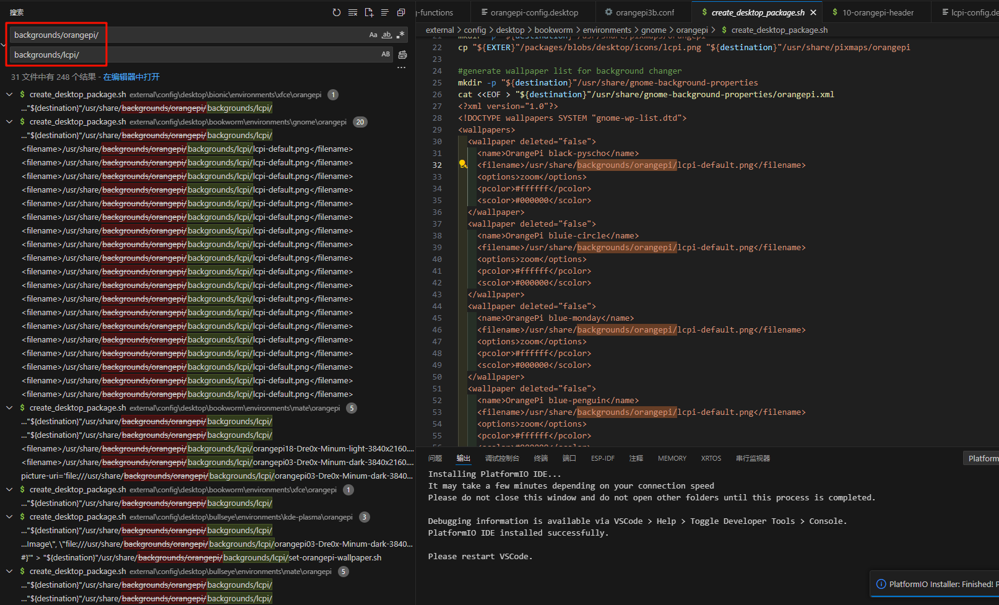
`/usr/share/backgrounds/`  
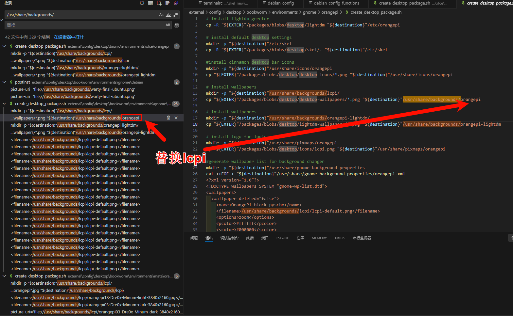
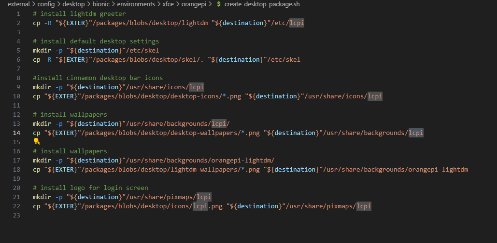
### 编译报错卡Installing [ orangepi-zsh_1.0.2_all.deb ]

apt-get后面加上`-o Dpkg::Options::='--force-confdef' -o Dpkg::Options::='--force-confold'`
  
RK3566整段复制：  
`chroot $SDCARD /bin/bash -c "apt-get -o Dpkg::Options::='--force-confdef' -o Dpkg::Options::='--force-confold' -y -qq install dnsmasq v4l-utils cheese swig python3-dev python3-setuptools bluez libncurses-dev" >> "${DEST}"/${LOG_SUBPATH}/install.log 2>&1`  

### 游览器无法播放声音问题
林总：`sudo snap install chromium`
`sudo apt install chromium-browser -y`
如果你之前有安装老版本的chromium浏览器，可以打开synaptic package manager(新立得包管理器）按CTRL+F搜索chromium-browser字样的包Mark for Unistallation标记删除然后应用。
下面第1个为chromium浏览器主程序，第2个为加速驱动，第3个为多媒体解码器
```bash
wget https://launchpad.net/~canonical-chromium-builds/+archive/ubuntu/stage/+build/9397032/+files/chromium-browser_49.0.2623.108-0ubuntu0.14.04.1.1113_armhf.deb
wget https://launchpad.net/~canonical-chromium-builds/+archive/ubuntu/stage/+build/9397032/+files/chromium-chromedriver_49.0.2623.108-0ubuntu0.14.04.1.1113_armhf.deb
wget https://launchpad.net/~canonical-chromium-builds/+archive/ubuntu/stage/+build/9397032/+files/chromium-codecs-ffmpeg-extra_49.0.2623.108-0ubuntu0.14.04.1.1113_armhf.deb
```
使用cd命令切换到下载的安装包所在文件夹，然后输入如下命令开始安装`sudo dpkg -i chromium*.deb`
如果发现依赖包缺失问题需要安装依赖包，如libgcrypt11缺失
```bash
wget http://ftp.us.debian.org/debian/pool/main/libg/libgcrypt11/libgcrypt11_1.5.0-5+deb7u4_armhf.deb
sudo dpkg -i lib*.deb
sudo dpkg -i chromium*.deb
```
如果还是不行只能使用提供的deb包安装，安装完成后打开chromium浏览器。
或者编译的时候提供放在`/home/yexing/orangepi-build/external/cache/debs/arm64/chromium-browser_107.0.5304.62-0ubuntu1~ppa1~22.04.1_arm64.deb`下
### 无法安装 Balena Etcher解决办法
手动下载 balena-etcher-electron_1.7.9+5945ab1f_arm64.deb 文件，然后将其复制到 /home/yexing/orangepi-build/external/cache/debs/arm64/ 目录中。

    wget https://github.com/Itai-Nelken/BalenaEtcher-arm/releases/download/v1.7.9/balena-etcher-electron_1.7.9+5945ab1f_arm64.deb -P /home/yexing/orangepi-build/external/cache/debs/arm64/
重新运行构建脚本。确保所有依赖项都能正常下载和安装。
## 测试
USB 存储设备测试
`cat /proc/partitions | grep "sd*"`  
使用 mount 命令可以将 U 盘挂载到/mnt 中，然后就能查看 U 盘中的文件了
`sudo mount /dev/sda1 /mnt/`  
`ls /mnt/`  
`df -h | grep "sd"`  

## 编译OpenHarmony4.1
Ubuntu20.04 LTS
### 环境搭建
    sudo apt-get install aptitude
```bash
sudo aptitude install -y binutils binutils-dev git git-lfs gnupg flex bison gperf build-essential zip curl zlib1g-dev gcc-multilib g++-multilib gcc-arm-none-eabi gcc-arm-linux-gnueabi x11proto-core-dev libx11-dev lib32z1-dev ccache libgl1-mesa-dev libxml2-utils xsltproc unzip m4 bc gnutls-bin python3-pip ruby genext2fs device-tree-compiler make libffi-dev e2fsprogs pkg-config perl openssl libssl-dev libelf-dev libdwarf-dev u-boot-tools mtd-utils cpio doxygen liblz4-tool openjdk-8-jre gcc g++ texinfo dosfstools mtools default-jre default-jdk libncurses5 apt-utils wget scons tar rsync git-core libxml2-dev lib32z-dev grsync xxd libglib2.0-dev libpixman-1-dev kmod jfsutils reiserfsprogs xfsprogs squashfs-tools git-lfs
```
```bash
sudo apt-get install -y pcmciautils quota ppp libtinfo-dev libtinfo5 libncurses5-dev libncursesw5 libstdc++6 vim ssh locales gcc-arm-linux-gnueabi
```
### SDk拉取
```bash
repo init -u https://gitee.com/openharmony/manifest -b refs/tags/OpenHarmony-v4.1-Release --no-repo-verify
网络问题请用下面的指令：
repo init -u https://gitee.com/openharmony/manifest -b refs/tags/OpenHarmony-v4.1-Release --no-repo-verify --repo-url=https://mirrors.tuna.tsinghua.edu.cn/git/git-repo

repo sync -c
repo forall -c 'git lfs pull'
```
### 打补丁
https://lark-assets-prod-aliyun.oss-cn-hangzhou.aliyuncs.com/yuque/0/2024/tar/25595614/1721111311055-7e560986-9ef3-4629-a1e1-4aa9a0438e77.tar?OSSAccessKeyId=LTAI4GKnqTWmz2X8mzA1Sjbv&Expires=1732505641&Signature=78gbwZ0VhRCTX%2F6z8ddJi6N1Ml4%3D&response-content-disposition=attachment%3Bfilename*%3DUTF-8%27%27IDO_PurplePiOH_V1A_OHOS4.1r_Patch_20240624.tar  

    tar -xvf  IDO_PurplePiOH_V1A_OHOS4.1r_Patch_20240624.tar
    cd IDO_PurplePiOH_V1A_OHOS4.1r_Patch_20240624/
    ./ido_patch.sh
###  SDK完整编译
    bash build/prebuilts_download.sh
    ./build.sh --product-name purple_pi_oh --ccache	--no-prebuilt-sdk

失败时log索引位置：`./out/purple_pi_oh/error.log`  
固件索引位置：`./out/purple_pi_oh/packages/phone/images/`
### 修改设备树
修改`device/board/industio/purple_pi_oh/kernel/build_kernel.sh`中的"IDO-PurPle-Pi-OH-HDMI"  
编译为MIPI固件则改为： "IDO-PurPle-Pi-OH-MIPI"  
```bash
#eval $MAKE_OHOS_ENV ./make-ohos.sh IDO-PurPle-Pi-OH-HDMI $RAMDISK_ARG ${ENABLE_LTO_O0}  
eval $MAKE_OHOS_ENV ./make-ohos.sh IDO-PurPle-Pi-OH-MIPI $RAMDISK_ARG ${ENABLE_LTO_O0}	  
```
没有接I2C触摸屏， 系统开机后检测不到会重启；如果触摸坏了， 可以在ido-pi-oh3566-mipi-v1.dts⾥ 关闭i2c1
```bash
&i2c1 {
status = "disabled";
 };
```
双频WiFi模块为AW-NM256需要更换hcd⽂件：  
把vendor\industio\purple_pi_oh\bluetooth\src\hardware.c中的"BCM43430A1.hcd"改为 "BCM4345C0.hcd"再编译

## 编译OpenHarmony5.0
Ubuntu22.04 LTS
### 全量SDK获取(无需打补丁)
https://pan.baidu.com/s/1ngEcAr7NgtTwfStgv8WyHg?pwd=1234#list/path=%2F
```shell
md5sum -c md5sum.txt
tar xzvf Purple-Pi-OH-5.0.tar.gz -C .
```
### OHOS5.0 官方源码获取
```bash
repo init -u https://gitee.com/openharmony/manifest -b refs/tags/OpenHarmony-v5.0.0-Release --no-repo-verify

repo sync -c
repo forall -c 'git lfs pull'
```
### 打补丁
https://lark-assets-prod-aliyun.oss-cn-hangzhou.aliyuncs.com/yuque/0/2024/zip/25595614/1729238250989-4bfc6b35-1b8a-44a2-a1c5-16b887719216.zip?OSSAccessKeyId=LTAI4GKnqTWmz2X8mzA1Sjbv&Expires=1732502975&Signature=BKUDHP6agWzb7Zb8CKU14Mf1XIc%3D&response-content-disposition=attachment%3Bfilename*%3DUTF-8%27%27IDO_PurplePiOH_V1A_OHOS5.0r_Patch_241017.zip  
下载后将补丁放到当前代码根目录下，然后进入该补丁内执行命令：

    unzip IDO_PurplePiOH_V1A_OHOS5.0r_Patch_241017.zip
    cd IDO_PurplePiOH_V1A_OHOS5.0r_Patch_241017/
    ./ido_patch.sh
###  SDK完整编译
    bash build/prebuilts_download.sh
    ./build.sh --product-name purple_pi_oh --ccache
    

### 修改设备树
## 烧录
### TF烧录
安卓使用***RKDevTool***软件烧录  
进入MASKROM 模式，插入TF卡到开发板  
高级功能-boot-...-选`MiniLoaderAll.bin`-下载  
选SD，点击切换存储
选升级固件-固件-升级

Linux使用***balenaEtcher***软件烧录或者***Win32DiskImager***软件烧录  
使用***RKDevTool***软件烧录  
导入配置`rk356x_linux_tfcard.cfg`  
第一项选`MiniLoaderAll.bin`,第二项选择需要烧录的镜像.
勾选强制按地址写选项，点击执行

Home Assistant Operating System (HAOS)使用***balenaEtcher***软件烧录  
插上TF卡后连接HDMI屏幕，等待TF烧录至EMMC成功后屏幕会黑屏。  
断电，拔出TF卡，连接电源开机。  
需要使用网口转USB连接至互联网。屏幕会显示IP地址。  
使用网页访问【开发板的 IP 地址:8123】就能看到 Home Assistant 的界面    
或者http://homeassistant.local:8123/

### EMMC烧录
安卓使用***RKDevTool***软件烧录  
进入MASKROM 模式  
高级功能-boot-...-选`MiniLoaderAll.bin`-下载  
选EMMC，点击切换存储
选升级固件-固件-升级  

Linux使用***RKDevTool***软件烧录  
导入配置`rk356x_linux_emmc.cfg`  
第一项选`MiniLoaderAll.bin`,第二项选择需要烧录的镜像.
勾选强制按地址写选项，点击执行
#### 使用 dd 命令烧录的方法  
确认下 eMMC 的设备节点
`ls /dev/mmcblk*boot0 | cut -c1-12`
使用 dd 命令清空下 eMMC，注意 of=参数后面请填入上面命令输出的结果  
`sudo dd bs=1M if=/dev/zero of=/dev/mmcblk0 count=1000 status=progress`
`sudo sync`
dd 命令烧录,if= 参数后面是要填写 Linux 镜像存放的完整路径+Linux 镜像的名字
```shell
sudo dd bs=1M if=Orangepi3b_x.x.x_debian_bullseye_desktop_xfce_linux5.10.160.img of=/dev/mmcblk0 status=progress
sudo sync
```
关机`poweroff`后请拔出 TF 卡，再短按电源按键开机
`df -h`
### SPIFlash+NVMe SSD烧录
#### Linux使用***RKDevTool***软件烧录 
导入配置`rk356x_linux_pcie.cfg`  
第一项选`MiniLoaderAll.bin`,第二项选择`rkspi_loader.img`,第三项选择需要烧录的镜像.  
勾选强制按地址写选项，点击执行  
其中rkspi_loader.img为编译后的UBOOT镜像，路径在`orangepi-build\u-boot\v2017.09-rk3588\rkspi_loader.img`  
#### Linux使用 dd 命令烧录的方法  
1. 插入NVME，先使用TF卡启动  
2. 烧录 u-boot 镜像到 SPI Flash  
`sudo nand-sata-install`  
选择7 Install/Update ther bootloader on SPI Flash  
3. 利用SSH或SCP上传镜像到TF卡中  

nvme 相关的信息`sudo fdisk -l`  
`sudo fdisk -l | grep "nvme0n1"`  
使用 `lspci` 命令可以看到一个 NVMe 相关的 PCI 设备

4. 清空下 NVMe SSD 
```shell
sudo dd bs=1M if=/dev/zero of=/dev/nvme0n1 count=2000 status=progress
sudo sync
```
5. dd 命令烧录,if= 参数后面是要填写 Linux 镜像存放的完整路径+Linux 镜像的名字
```shell
sudo dd bs=1M if=Orangepi3b_x.x.x_debian_bullseye_desktop_xfce_linux5.10.160.img of=/dev/nvme0n1 status=progress
sudo sync
```
关机`poweroff`后请拔出 TF 卡，再短按电源按键开机
`df -h`命令可以看到实际的硬盘容量
#### 安卓使用***RKDevTool***软件烧录  
进入MASKROM后直接选择升级固件
# LCPI-H616
## 编译安卓
    cd longan
    ./build.sh config
    0 1 3
    ./build.sh
    cd android
    source build/envsetup.sh
    lunch cupid_p2-eng
    extract-bsp
    make -j16 && pack  

镜像路径：H616_Android10/longan/out/h616_android10_p2_uart0.img

## 编译Linux
`sudo ./build.sh`
### 编译报错ATF
方法一：使用命令：`sudo ./build.sh  USE_CCACHE=no`  
方法二：在文件userpatches/config-default.conf中，添加`USE_CCACHE=no`就可以继续编译了。
### 修改设备树
#### 修改登录账号和密码，orangepi，orangepi，邮箱：admin@lctech-inc.com，网址：www.lcpi.cn
#### 修改终端输出
```shell
  ___  ____ ___   _____             ____
 / _ \|  _ \_ _| |__  /___ _ __ ___|___ \
| | | | |_) | |    / // _ \ '__/ _ \ __) |
| |_| |  __/| |   / /|  __/ | | (_) / __/
 \___/|_|  |___| /____\___|_|  \___/_____|

Welcome to Orange Pi 3.1.0 Jammy with Linux 6.1.31-sun50iw9  
```
终端线条字修改位置  
  
终端欢迎语修改位置  
  
#### Linux4.9 系统U-boot修改启动阶段显示的图片的方法
在 linux 系统中的位置orangepi-u-boot.bmp如下所示  
`ls /boot/boot.bmp`  
  


#### 启动logo修改  
第一处：  
  
第二处：  
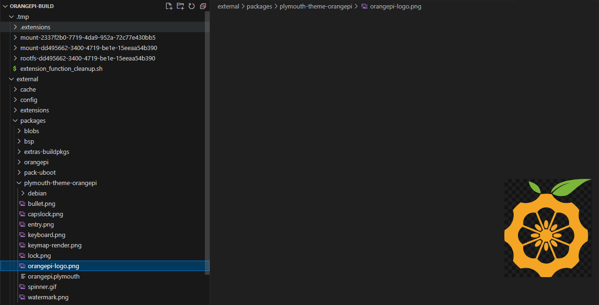  
主要是watermark.png修改
#### 壁纸以及状态栏logo修改  
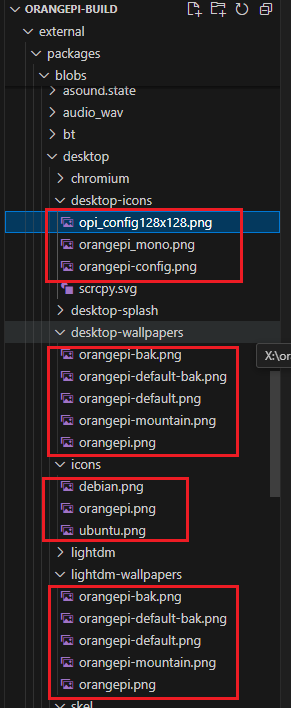  
`/usr/share/backgrounds/orangepi`  
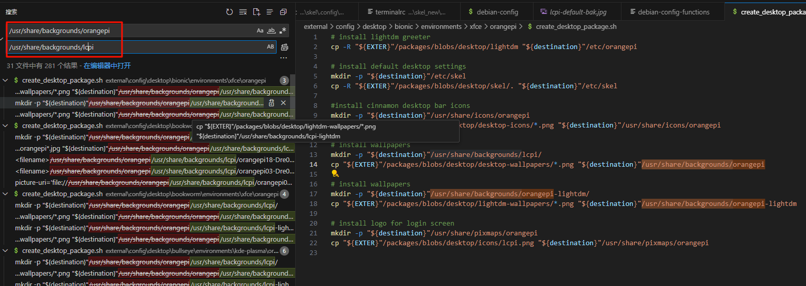  
`/packages/blobs/desktop/icons/orangepi.png`  
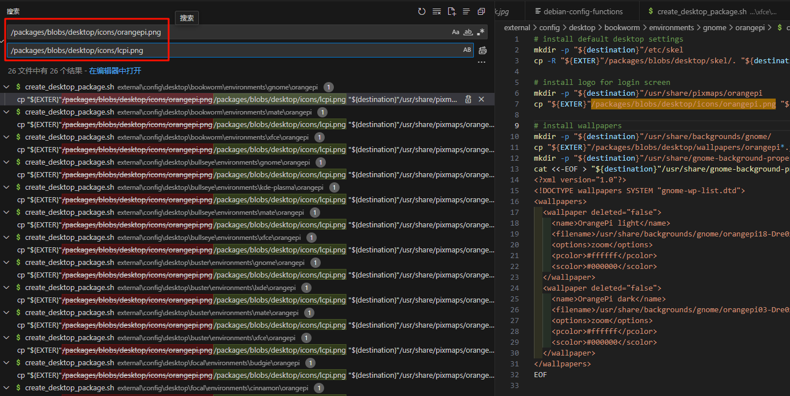  
`/usr/share/icons/orangepi`  
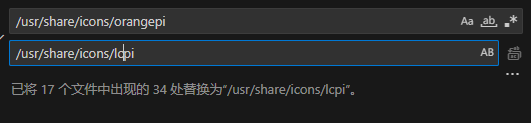  
`orangepi-default.png`  
`lcpi-default.png`  
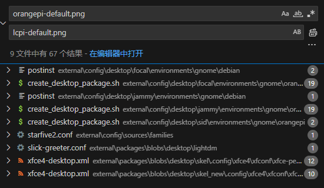
`orangepi-mountain.png`  
`lcpi-mountain.png`  
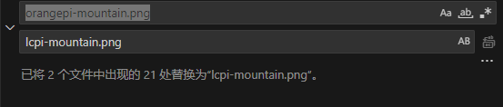  
`orangepi.png`  
`lcpi.png`  
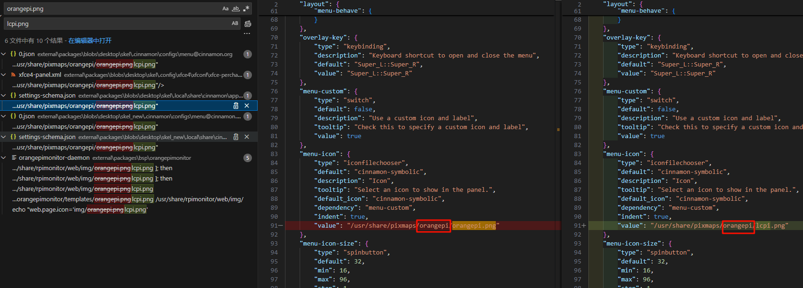  
`/usr/share/pixmaps/orangepi`  
`/usr/share/pixmaps/lcpi`  
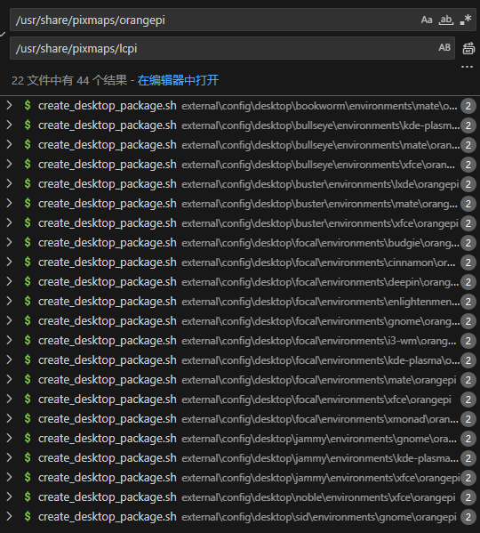  
#### OrangePi config修改位置  
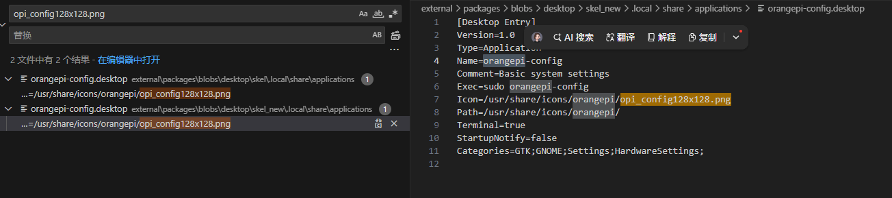  
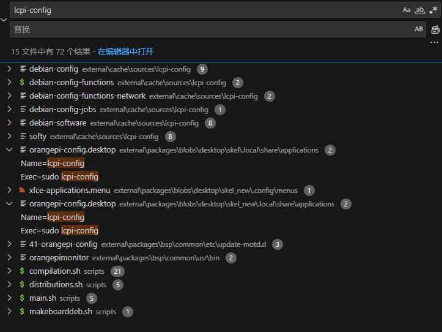  

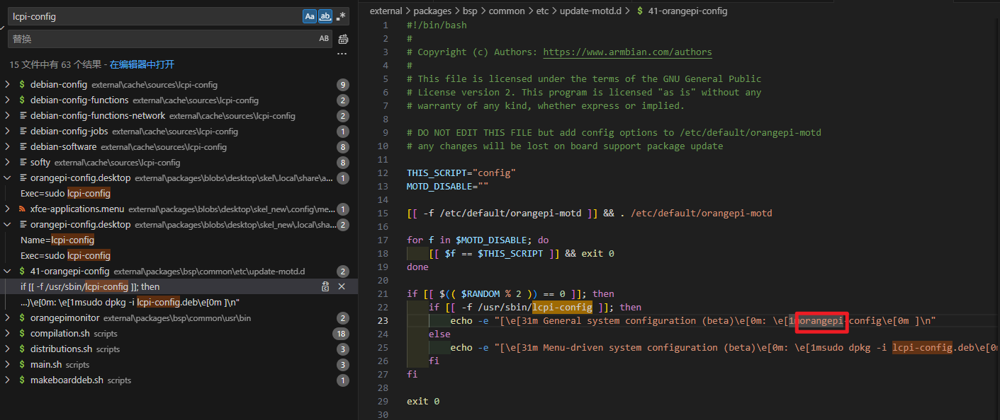  

  
  
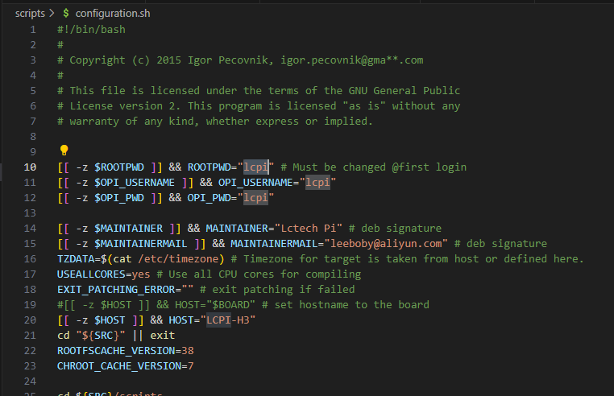  


## 烧录 
### TF烧录
安卓使用***PhoenixCard***软件烧录 选***启动卡***  
Linux使用***balenaEtcher***软件烧录或者***Win32DiskImager***软件烧录  

## 测试
LED测试
```bash
cd /sys/class/leds/orangepi\:green\:status
cd /sys/class/leds/orangepi\:red\:status
echo 0 > brightness
echo 1 > brightness
echo heartbeat > trigger
echo none > trigger
```
# LCPI-D1
## 编译Tina

make -j8 && pack 

### 修改设备树
#### 修改终端输出信息

## 烧录
### TF烧录
使用***PhoenixCard***软件烧录 选***启动卡*** 

## 测试
```bash
RGB 测试指令：
echo 255 > /sys/class/leds/sunxi_led0r/brightness #绿灯亮
echo 0 > /sys/class/leds/sunxi_led0r/brightness #绿灯灭
echo 255 > /sys/class/leds/sunxi_led0g/brightness #红灯亮
echo 0 > /sys/class/leds/sunxi_led0g/brightness #红灯灭
echo 255 > /sys/class/leds/sunxi_led0b/brightness #蓝灯亮
echo 0 > /sys/class/leds/sunxi_led0b/brightness #蓝灯灭
```

WIFI 测试
```bash
ifconfig -a
wifi_connect_ap_test PUMPU 1234567890abc
ping www.baid.com
```
咪头和 3.5mm 音频测试
```bash
alsamixer
录制一段 5 秒钟的音频，输入
 arecord -d 5 /tmp/t.wav 
 播放录音，输入
  aplay /tmp/t.wav
```
LCD 测试  
`echo 1 > /sys/class/disp/disp/attr/colorbar`

# 树莓派

## 烧录
使用***balenaEtcher***软件烧录 可以用来烧录树莓派镜像到SD卡。


烧录完成后打开SD卡的bootfs磁盘里的文件，firstrun.sh文件，这个是上电运行脚本，可以修改一些东西。  
  

## 更新软件包 
默认账号：pi 密码: raspberry

    sudo raspi-config 进入配置模式，选择Interfacing Options，选择SSH，重启树莓派。
    sudo apt update
    sudo apt full-upgrade
    sudo apt autoremove

## 配置网络
`sudo vi /etc/wpa_supplicant/wpa_supplicant.conf`
```bash
country=CN
ctrl_interface=DIR=/var/run/wpa_supplicant GROUP=netdev
update_config=1

network={
    ssid="PUMPU_5G"
    psk="1234567890abc"
    key_mgmt=WPA-PSK2
}
```
## 配置静态IP地址
    route -n 查看路由表
    sudo nano /etc/dhcpcd.conf 编辑配置文件
    sudo reboot
在文件末尾加入：
```bash
interface wlan0
static ip_address=192.168.1.150/24
static routers=192.168.0.1
static domain_name_servers=192.168.0.1 8.8.8.8
static domain_search=114.114.114.114

interface eth0
static ip_address=192.168.0.151/24
static routers=192.168.0.1
static domain_name_servers=192.168.0.1 8.8.8.8
static domain_search=114.114.114.114
```
安装远程桌面
`sudo apt-get install xrdp`
## 备份系统
完整备份
方法一：使用***Win32DiskImager***新建建一个xx.img文件，选择读卡器，点击读取即可备份xx.img里  
方法二：将读卡器插入到树莓派里，点击附件->SD Card Copiers，选择要备份的文件，点击复制，等待完成。  
方法三：使用dd命令备份系统，命令如下：  

    lsblk -l #查看设备名
    sudo dd if=/dev/mmcblk0 of=/dev/sda 
    sudo ps -ef | grep dd #新终端窗口中查看dd命令的进程号
    sudo watch -n 3kill -USR1 pid #pid为上一步的进程号，每隔3秒刷新一次copy进度。
压缩备份:
    df -h
    git clone https://github.com/nanhantianyi/rpi-backup.git &&cd rpi-backup
    sudo ./backup.sh xxx.img #压缩备份
    
## 安装nodejs
方法一：
https://nodejs.org/en/download/  
https://nodejs.cn/download/

    uname -m 查看树莓派的架构
    cd node-v18.12.0-linux-armv7l
    sudo cp -R * /usr/local/
    node -v
    npm -V
    sudo npm install -g node-red
    node-red-start
方法二：  

    sudo apt install build-essential
    bash <(curl -sL https://raw.githubusercontent.com/node-red/linux-installers/master/deb/update-nodejs-and-nodered)

安装
`node-red-node-pi-gpio`  
`node-red-node-serialport`  
`node-red-contrib-timerswitch`
`node-red-node-exec`
### 启动node-red
直接启动：`node-red`  
启动Node-RED的服务`sudo systemctl start nodered`  
参看状态`sudo systemctl status nodered`  
设置开机自启`sudo systemctl enable nodered`  
关闭开机自启`sudo systemctl disable nodered`  

无法启用服务时，创建 Node-RED 服务文件：在系统服务目录中创建一个 nodered.service 文件。
`sudo nano /etc/systemd/system/nodered.service`
```bash
[Unit]
Description=Node-RED
After=network.target

[Service]
ExecStart=/usr/bin/env node-red
User=lhf
Restart=on-failure
KillSignal=SIGINT
SyslogIdentifier=Node-RED
Environment=NODE_OPTIONS=--max_old_space_size=256

[Install]
WantedBy=multi-user.target

```
重新加载 systemd 服务配置以使新服务文件生效：`sudo systemctl daemon-reload`


## 安装中文输入法
偏好设置->Add/remove Software->scim-chewing  

## 点灯
`pinout` 查看树莓派的接口
`nano rpledtest1.py`
`python3 rpledtest1.py`
```py
import RPi.GPIO as GPIO
import time
ledpin = 23
GPIO.setmode(GPIO.BCM)
GPIO.setup(ledpin, GPIO.OUT)
try:
        while True:
                GPIO.output(ledpin, GPIO.HIGH)
                time.sleep(0.2)
                GPIO.output(ledpin, GPIO.LOW)
                time.sleep(0.2)
except KeyboardInterrupt:
        GPIO.cleanup()
```
## 安装虚拟环境
```shell
安装 python3-venv
sudo apt install python3-venv
创建虚拟环境
python3 -m venv ./myenv
激活虚拟环境
source ~/Desktop/Python/myenv/bin/activate
安装所需的 Python 包
pip install paho-mqtt bleak json
如果不再需要虚拟环境
deactivate
```
## 树莓派蓝牙
检查蓝牙适配器状态  

    bluetoothctl show  
找到蓝牙设备的路径  

    bluetoothctl devices  

查看蓝牙信息

    bluetoothctl
    power on/off
    scan on/off


# LCPI-RK3328

  [使用手册](https://wiki.t-firefly.com/zh_CN/ROC-RK3328-CC/index.html)
## 编译安卓

```bash
sudo apt-get install git gnupg flex bison gperf libsdl1.2-dev \
libpulse-dev libwxgtk3.0-gtk3-dev squashfs-tools build-essential zip curl \
libncurses5-dev zlib1g-dev pngcrush schedtool libxml2 libxml2-utils \
xsltproc lzop libc6-dev schedtool g++-multilib lib32z1-dev lib32ncurses5-dev \
libreadline-dev gcc-multilib libswitch-perl
```

    ./build.sh rk3328-roc-cc
    ./FFTools/mkupdate/mkupdate.sh update

镜像路径：rockdev/Image-rk3328_box/update.img
## 编译Buildroot
```bash
sudo apt-get update

sudo apt-get install repo git-core gitk git-gui gcc-arm-linux-gnueabihf u-boot-tools device-tree-compiler \
gcc-aarch64-linux-gnu mtools parted libudev-dev libusb-1.0-0-dev python-linaro-image-tools \
linaro-image-tools gcc-arm-linux-gnueabihf libssl-dev liblz4-tool genext2fs lib32stdc++6 \
gcc-aarch64-linux-gnu g+conf autotools-dev libsigsegv2 m4 intltool libdrm-dev curl sed make \
binutils build-essential gcc g++ bash patch gzip bzip2 perl tar cpio python unzip rsync file bc wget \
libncurses5 libqt4-dev libglib2.0-dev libgtk2.0-dev libglade2-dev cvs git mercurial rsync openssh-client \
subversion asciidoc w3m dblatex graphviz python-matplotlib libc6:i386 libssl-dev texinfo fakeroot \
libparse-yapp-perl default-jre patchutils

sudo apt-get install expect-dev python-dev swig
```
rk3328-buildroot

    ./build.sh firefly-rk3328-buildroot.mk
    ./build.sh rootfs

    ./mkfirmware.sh
    ./build.sh 
    ./build.sh updateimg
## 编译Ubuntu
Ubuntu20.04-Gnome_RK3328_v2.11  
Ubuntu20.04-Minimal_RK3328_v2.11

    ./build.sh firefly-rk3328-ubuntu.mk
    ./mkfirmware.sh
    ./build.sh 
    ./build.sh updateimg

## 编译debian
    git clone https://github.com/FireflyTeam/rk-rootfs-build.git
    cd rk-rootfs-build
    sudo apt-get install binfmt-support qemu-user-static live-build
    sudo dpkg -i ubuntu-build-service/packages/*
    sudo apt-get install -f
编译 32 位 debian：
RELEASE=stretch TARGET=desktop ARCH=armhf./mk-base-debian.sh（开发阶段推荐使用VERSION=debug ARCH=armhf./mk-rootfs-stretch.sh）。
编译 64 位 debian：
RELEASE=stretch TARGET=desktop ARCH=arm64./mk-base-debian.sh（开发阶段推荐使用VERSION=debug ARCH=arm64./mk-rootfs-stretch-arm64.sh）。如果遇到noexec or nodev问题，需要执行mount -o remount,exec,dev xxx（xxx是挂载点）后重新编译。  
执行./mk-image.sh，然后将linaro-rootfs.img移动到../distro/目录。  
修改firefly-rk3328-ubuntu.mk文件，将RK_ROOTFS_IMG属性改成linaro-rootfs.img的路径（即RK_ROOTFS_IMG=distro/linaro-rootfs.img）。


## 烧录
### TF烧录
烧写原始固件使用***SDCard Installer***软件烧录或***balenaEtcher***软件烧录   
烧写RK固件使用***SDDiskTool_v1.78***软件烧录（即SD Firmware Tool）  


### EMMC烧录 
使用***RKDevTool***软件烧录  
进入 Rockusb 模式 或 MASKROM 模式
选升级固件-固件-升级

# STM32MP25X

## 烧录
使用***STM32cubeprogrammer***软件烧录  

测试烧写环境`STM32_Programmer_CLI -c port=usb1`  
烧录：`STM32_Programmer_CLI -c port=usb1 -w ./flashlayout_myir-image-full/optee/FlashLayout_emmc_myb-stm32mp257x-2GB-optee.tsv`  

# 其他问题
sudo apt-get update时报错GPG error
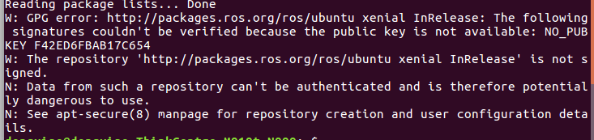  

```bash
# F42ED6FBAB17C654是根据你报错那一行确定的
sudo gpg --keyserver keyserver.ubuntu.com --recv F42ED6FBAB17C654
sudo gpg --export --armor F42ED6FBAB17C654 | sudo apt-key add -
```     
再`sudo apt-get update`
