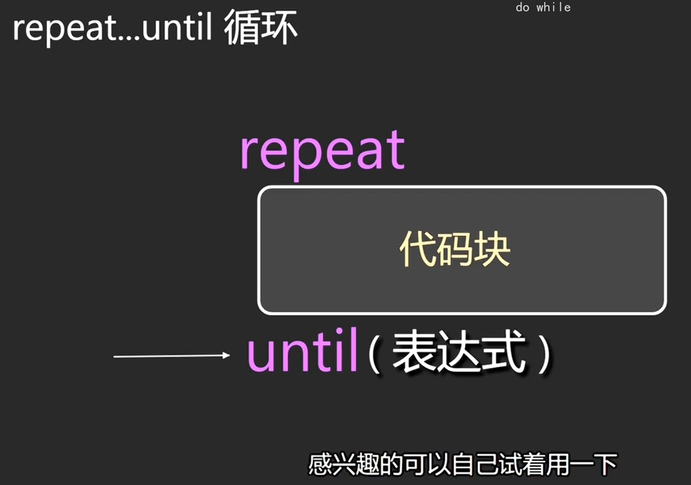
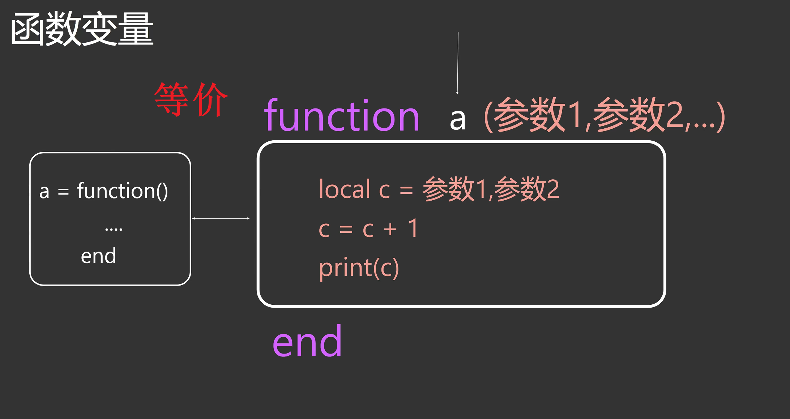
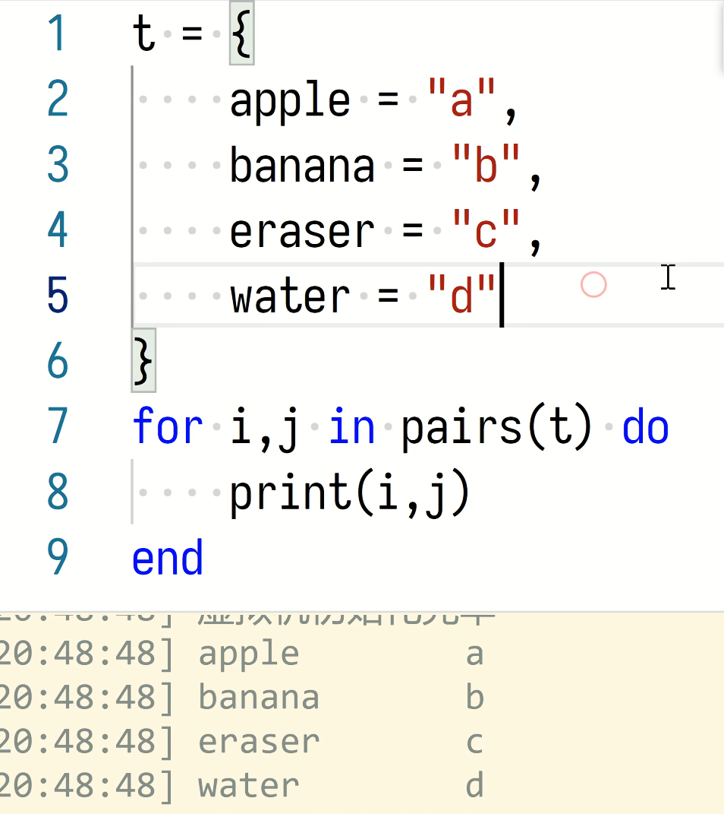

[LuatOS在线模拟器](https://wiki.luatos.com/_static/luatos-emulator/lua.html)  
[Lua在线REPL工具](https://wiki.luatos.com/_static/repl/index.html)  
# 基础语法
字符串连接符号：`..`  
字符串前面加`#`，可以获取长度  

用`--`开头，来写一段单行注释  
也可以用`--[[`开头，`]]`结尾，写一段多行注释。  
# 字符串string
Lua 语言中字符串可以使用以下三种方式来表示：

单引号间的一串字符

双引号间的一串字符

[[和]]间的一串字符
Lua 把 false 和 nil 看作是false，其他的都为true（包括0这个值，也是相当于true）

string.char(0x30)
-- 转换为字符
string.byte(0x30)
-- 转换为十进制


lua字符串是可以存0的，不是C中遇到0就停止的

# 循环
while后面加的是do，for也是do，判断if才是then。

判断变量可以使用这个，相当于C语言中的三目运算符
```lua
a = nil
b = 0  
print(b > 10 and "yes" or "no")
```
结果为no

16进制，大小写都可以
运算可以使用除法运算结合求余运算来进行整除运算，确保小数部分都是0





table数组
可以存数字，字符串，table，function
数组下标从1开始

table默认以数字作为下标，下标也可以是字符串

特殊的table
`_G`
Lua里面所有的全局变量都在`_G`这个table里面

table删减
table.insert (table, [pos ,] value)

在（数组型）表 table 的 pos 索引位置插入 value，其它元素向后移动到空的地方。pos 的默认值是表的长度加一，即默认是插在表的最后。

table.remove (table [, pos])

在表 table 中删除索引为 pos（pos 只能是 number 型）的元素，并返回这个被删除的元素，它后面所有元素的索引值都会减一。pos 的默认值是表的长度，即默认是删除表的最后一个元素。


require只是用来引入外部库的。不需要多次调用。如果需要多次调用，可以在被调用的文件里创建table，再往这table中添加函数，在调用文件中使用该函数即可。

# 迭代器
迭代器是用来遍历table里面所有的值的

`ipairs`用来迭代数字下标的，需要连续下标

`pairs`用来迭代数字以及字符串下标的，不需要连续

`pairs`是用了`next`函数
```lua
t={}
next(t)
输出nil，快速判断这个table是否为空
```