# NAS
NAS（Network Attached Storage）网络附加存储，主要用于存储大量数据，如照片、视频、音乐、文档等。NAS通常安装在服务器上，通过网络访问，可以实现文件共享、远程备份、远程访问等功能。NAS的优点是安全、便捷、经济，缺点是成本高、可靠性差、易捷性差。

第一步，按照我说的光纤连入光猫，光猫连接路由器，路由器连接你的设备。

第二步，你要知道你光猫和自己路由器的后台地址，和用户名、密码。

第三步，先登录路由器的后台地址，输入用户名和密码

第四步，找到你路由器的端口转发（每个路由器都不一样），也有叫端口映射、虚拟服务器

第五步，找到你设备的服务端口，将其转出去。你设备服务端口就是内部端口，转出去的端口就是外部端口

第六步，登录你的光猫，找到端口转发

第七步，同样设置端口转发，之前的外部端口就是现在的内部端口，转出去，在外网访问的端口就是外部端口，建议设置5位。

所以我们需要智能家居，传感器，NAS等等都在这个二级网络当中，所有的交互都交给Home Assistant，我们只需要把Home assistant的端口转出去就行了（这块在Home Assistant安装教程中会讲）或者桥接模式
# Docker安装和基础设置 

## 拿到KEY、IP、Token

HACS（Home Assistant Community Store）这就是Home assistant 的应用插件商店，以后都需要用到这个。

以后安装第三方的内容只需要分清楚intergration集合还是frontend前端UI即可。 
基本上插件、主题都是frontend；设备、卡片、API基本上都是intergation。 

HomemeKit Bridge插件连接到苹果生态
## 安装
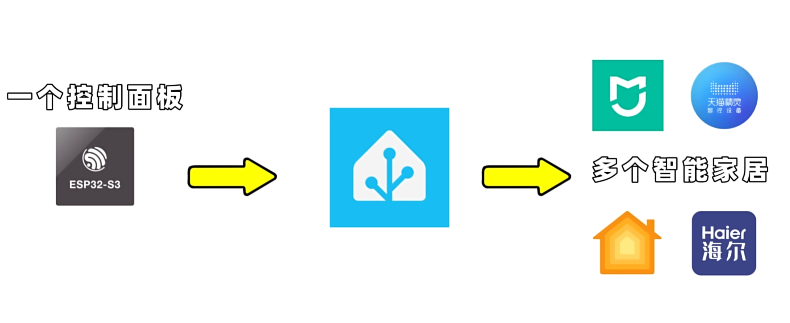
 1、其他NAS系统下使用docker container的官方详细文档：https://www.home-assistant.io/installation/alternative#install-home-assistant-container

2、Linux下使用docker container的官方详细文档：https://www.home-assistant.io/installation/linux#install-home-assistant-container

「苹果控制米家设备-home assistant」
链接：https://pan.quark.cn/s/0c3046ddb3e6Home assistant 稳定版

拉取镜像命令：
docker pull homeassistant/home-assistant:stable

运行镜像命令：
docker run -d -p 8123:8123 homeassistant/home-assistant:stable

docker官网：
https://docs.docker.com/

home assistant官网：
https://www.home-assistant.io/

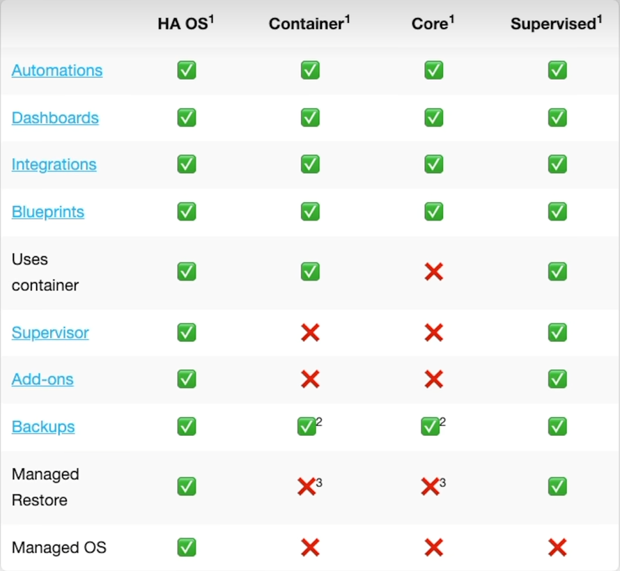
HA版本
Supervised需要Debian12
## 目录结构

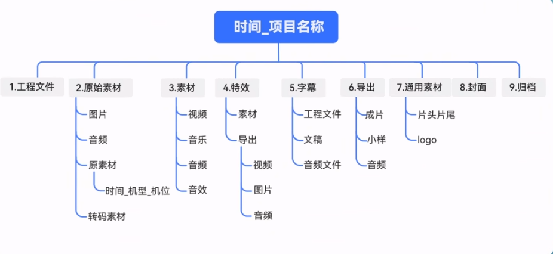


1. 文件夹的管理和命名:日期和项目内容来命名，
例如：2024-06-20_五月天演唱会
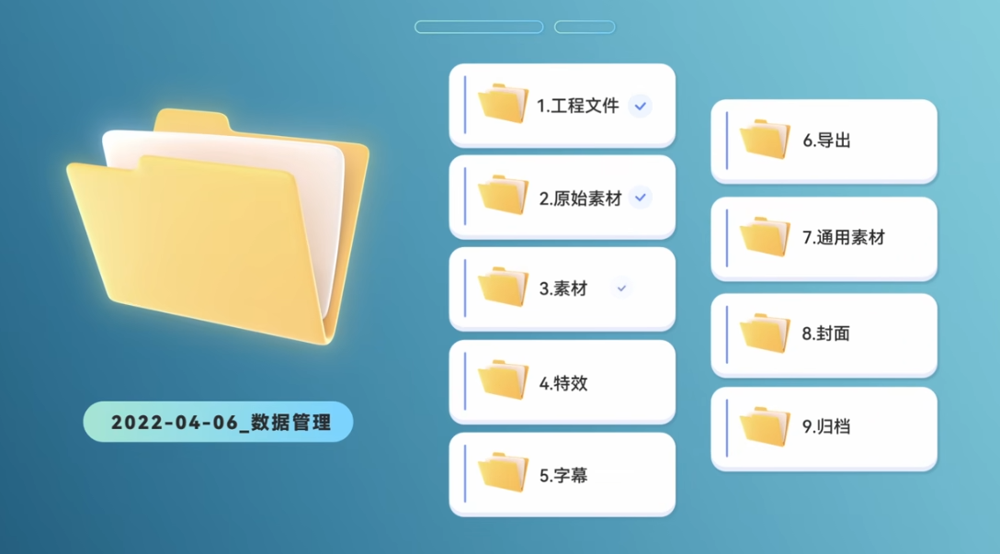
1. 每个文件夹前加上数字，分类成9项，工程文件，原始素材，素材，特效，字幕，导出，通用素材，封面，归档）
2. 文件命名:交代素材信息，时间+机型+机位，
   
3. 导出成片命名:时间_片名_分辨率_编码格式_导出人_备注_版本
数据备份：
三备、二介、异地
烤卡软件推荐
推荐软件:Gate或者Kocard（都是免费的）Silverstack（收费，专业）
1.Gate
https://www.ysjf.com/gate
2.Kocard
http://www.kocard.net/
# 安装 Docker
Docker 官方的提供的安装文档链接如下所示：  
Debian 系统: https://docs.docker.com/engine/install/debian/  
Ubuntu 系统: https://docs.docker.com/engine/install/ubuntu/  
1. 卸载老版本的 Docker 安装包叫做 docker、docker.io 或者 docker-engine：  
`sudo apt-get remove -y docker docker-engine docker.io containerd runc`

2. 添加 docker 官方的软件仓库
   
   Debian 系统使用的命令如下所示
```
sudo apt update  
sudo apt-get install -y ca-certificates curl gnupg lsb-release

curl -fsSL https://download.docker.com/linux/debian/gpg | \
sudo gpg --dearmor -o /usr/share/keyrings/docker-archive-keyring.gpg

echo "deb [arch=$(dpkg --print-architecture) \
signed-by=/usr/share/keyrings/docker-archive-keyring.gpg] \
https://download.docker.com/linux/debian \
$(lsb_release -cs) stable" | sudo tee /etc/apt/sources.list.d/docker.list > /dev/null

```
Ubuntu 系统使用的命令如下所示
```
sudo apt update
sudo apt-get install -y ca-certificates curl gnupg lsb-release

curl -fsSL https://download.docker.com/linux/ubuntu/gpg | \
sudo gpg --dearmor -o /usr/share/keyrings/docker-archive-keyring.gpg

echo "deb [arch=$(dpkg --print-architecture) \
signed-by=/usr/share/keyrings/docker-archive-keyring.gpg] \
https://download.docker.com/linux/ubuntu \
$(lsb_release -cs) stable" | sudo tee /etc/apt/sources.list.d/docker.list > /dev/null
```
3. 安装 Docker Engine
`sudo apt update`
`sudo apt install -y docker-ce docker-ce-cli containerd.io`
>Debian Buster 安装完后如果报错请输入下面的命令来解决：  
echo 1 | update-alternatives --config iptables > /dev/null  
sudo systemctl restart docker

4. 将当前用户加入到 docker 用户组，这样不需要 sudo 就能运行 docker 命
令
`sudo usermod -aG docker $USER`
重启系统

5. 验证 docker 的状态
`systemctl status docker`
可以使用下面的命令测试下 docker，如果能运行 hello-world 说明 docker 能正常
使用  `docker run hello-world`

6. 设置 docker 仓库为国内源的方法
创建 /etc/docker/daemon.json 文件，在其中加入下面的配置  
`sudo vim /etc/docker/daemon.json`
```
{
"registry-mirrors": [ 
   "https://docker.mirrors.ustc.edu.cn"
]
}
```
7. 重启下 docker 服务
`sudo systemctl restart docker`
## Orange Pi 安装 Docker
Orange Pi 提供的linux镜像已经预装了Docker，只是Docker服务默认没有打开。  
使用enable_docker.sh 脚本可以使能docker 服务，然后就可以开始使用docker命令了，并且在下次启动系统时也会自动启动docker服务。  
`enable_docker.sh`  
`docker run hello-world`  
使用docker命令时，如果提示permissiondenied，请将当前用户加入到docker
用户组，这样不需要sudo就能运行docker命令了。  
orangepi@orangepi:~$ `sudo usermod-aG docker $USER`  

# 香橙派派安装HA
## 通过 docker 安装HA
Ubuntu 或者 Debian 系统中安装 Home Assistant 的方法:
1. 搜索下 Home Assistant 的 docker 镜像
`docker search homeassistant`
2. 然后使用下面的命令下载 Home Assistant 的 docker 镜像到本地，镜像大小大概有
1GB 多，下载时间会比较长，请耐心等待下载完成
`docker pull homeassistant/home-assistant`
3. 然后可以使用下面的命令查看下刚下载的 Home Assistant 的 docker 镜像
`docker images homeassistant/home-assistant`
4. 运行 Home Assistant 的 docker 容器了
```
docker run -d \ 
--name homeassistant \ 
--privileged \ 
--restart=unless-stopped \ 
-e TZ=Asia/Shanghai \ 
-v /home/orangepi/home-assistant:/config \
--network=host \
homeassistant/home-assistant:latest
```
5. 在浏览器中输入【开发板的 IP 地址:8123】就能看到 Home Assistant 的界面
6. 停止 Home Assistant 容器的方法
   
         docker ps -a
         停止
         docker stop homeassistant
         删除
         docker rm homeassistant

## 通过 python 安装HA
1. 首先安装依赖包
```bash
sudo apt-get update

sudo apt-get install -y python3 python3-dev python3-venv \
python3-pip libffi-dev libssl-dev libjpeg-dev zlib1g-dev autoconf build-essential \
libopenjp2-7 libtiff5 libturbojpeg0-dev tzdata
```
如果是debian12或Ubuntu24.04 请使用下面的命令：  
```bash
sudo apt-get update

sudo apt-get install -y python3 python3-dev python3-venv \
 python3-pip libffi-dev libssl-dev libjpeg-dev zlib1g-dev autoconf build-essential \
 libopenjp2-7 libturbojpeg0-dev tzdata
```
2. 编译安装 Python3.9  
Debian Bullseye 默认的 Python 版本就是 Python3.9，所以无需编译安装。
Ubuntu Jammy 默认的 Python 版本就是 Python3.10，所以也无需编译安装。

3. 创建 Python 虚拟环境  
UbuntuNoble中是python3.12，因此下面命令中标红的python版本号请修改
为“3.12”，其他的不同linux版本请根据实际情况更改对应的命令。
```
sudo mkdir /srv/homeassistant
sudo chown orangepi:orangepi /srv/homeassistant
cd /srv/homeassistant
python3.9 -m venv .
source bin/activate
```
4. 安装需要的 Python 包  
`python3 -m pip install wheel`
5. 安装 Home Assistant Core  
`pip3 install homeassistant`
6. 运行 Home Assistant Core  
`hass`
1. 在浏览器中输入【开发板的 IP 地址:8123】就能看到 Home Assistant 的界面

## Windows 安装HA
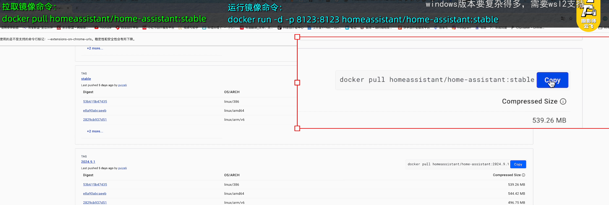
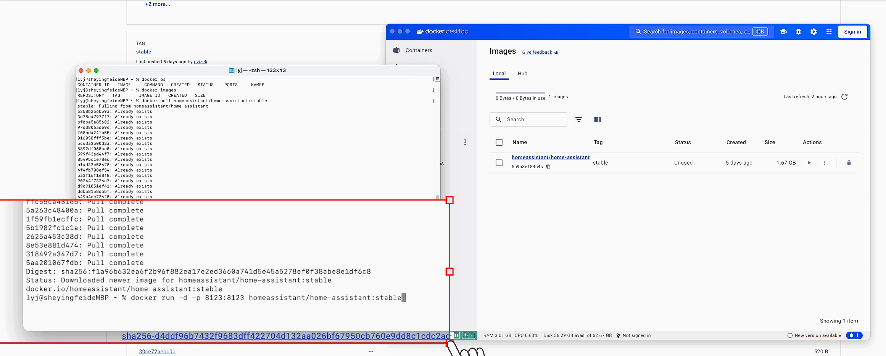
「苹果控制米家设备-home assistant」
链接：https://pan.quark.cn/s/0c3046ddb3e6Home assistant 稳定版

拉取镜像命令：
docker pull homeassistant/home-assistant:stable

运行镜像命令：
docker run -d -p 8123:8123 homeassistant/home-assistant:stable

docker官网：
https://docs.docker.com/

home assistant官网：
https://www.home-assistant.io/
# Home Assistant使用
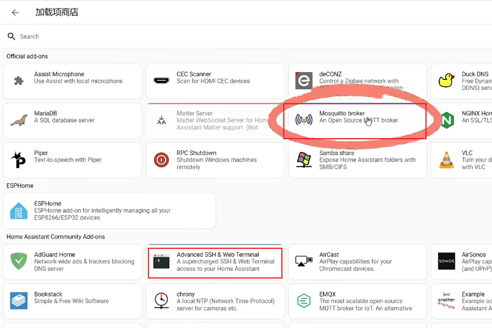
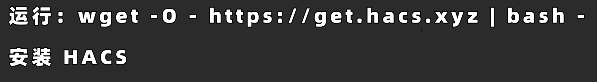
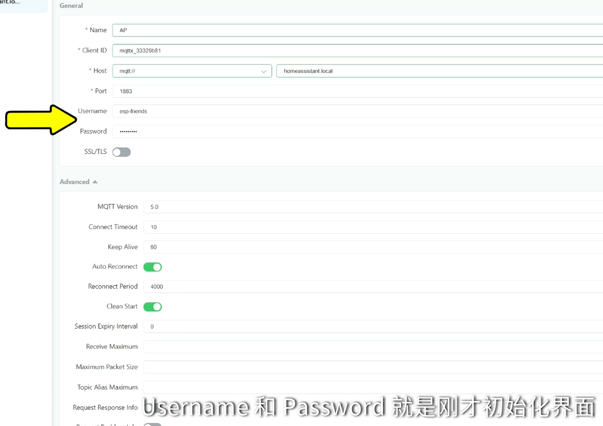
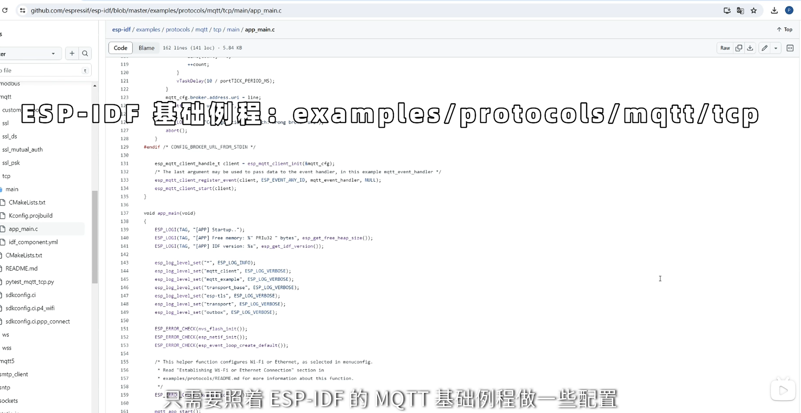
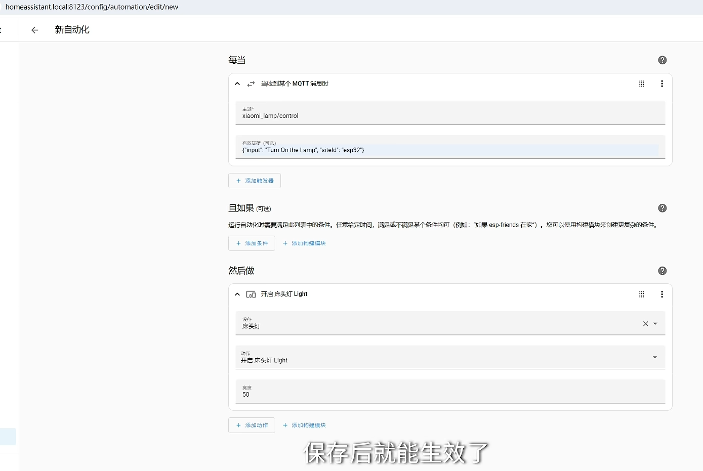
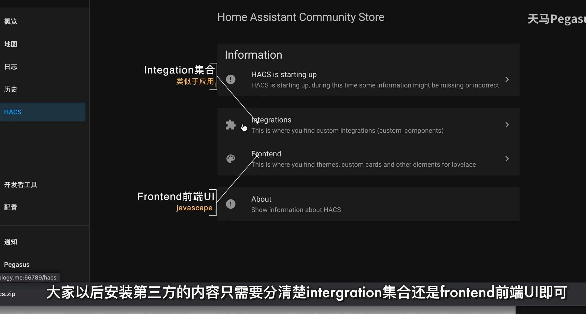
基本上插件、主题都是frontend；设备、卡片、APl基本上都是intergation
# 米家官方集成
https://pan.quark.cn/s/206adbaa7d2e

github项目地址：https://github.com/XiaoMi/ha_xiaomi_home/blob/main/doc/README_zh.md

补充：
1、其他NAS系统下使用docker container的官方详细文档：https://www.home-assistant.io/installation/alternative#install-home-assistant-container
2、Linux下使用docker container的官方详细文档：https://www.home-assistant.io/installation/linux#install-home-assistant-container
3、MacOS和Windows系统下目前没有关于docker container的官方详细文档。