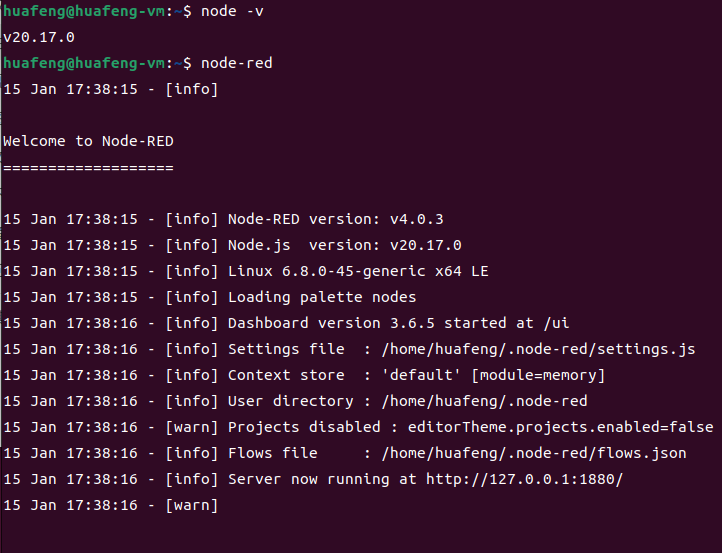

# Node-RED笔记
# 启动NodeRed

打开http://localhost:1880即可启用

```python
let arr = msg.topic.split('/');
// 更新 msg.topic
msg.topic = 'v1/devices/me/rpc/response/' + arr[arr.length - 1];

等效于
    msg.topic = msg.topic.replace('request', 'response'); // 修改主题
```
## 重启nodered

    sudo lsof -i :1880
    sudo kill <PID>
    sudo node-red
