# 基于PHY6252平台完成蓝牙连接与数据的发送与接收
PHY6252 SDK，SP611E实物及对应的原理图和PCB   
1. 学习和掌握蓝牙的基本概念  
2. APP发现设备  
3. 连接进入到控制界面  
4. 驱动灯条  
5. 通过APP切换效果、修改颜色、亮度和速度。  
## 接口
DAT:PA11  
S1:P7,  S2:P15,  S3:P18  
IR:P20, MIC:P14  
J2是烧录串口，第一个从矩形开始是：3.3V，TX(P9)，RX(P10)，GND  

## APP端发送命令示例
1. 开灯 ： 0xA0 0x62 0x01 0x01
2. 关灯 ： 0xA0 0x62 0x01 0x00
3. 切换模式 ： 0xA0 0x63 0x01 0x05 (模式5)
4. 调节亮度 ： 0xA0 0x66 0x01 0x50 (亮度80%)
5. 调节速度 ： 0xA0 0x67 0x01 0x05 (速度5)
6. 设置颜色 ： 0xA0 0x69 0x04 0xFF 0x00 0x00 0x64 (红色，亮度100)   
发送效果颜色指令 0xA0 0x69 0x04 R G B Bn
   - R, G, B: 红绿蓝颜色值 (0-255)
   - Bn: 亮度值 (0-100)
7. 设备同步 ： 0xA0 0x70 0x00

### 广播包
第20个字节是开始修改名称的，为后续字节数。
随后第21个开始是固定0x09，0x5350,24到31为10个字符（即修改名称上限）

# 置顶链接
1. PB-03F-kit规格书  
   [PB-03F-kit规格书 ](https://file.elecfans.com/web2/M00/44/BC/pYYBAGKG_AiAG_nQAO7bHhjUwBU613.pdf)
2. PB-03F-kit相关使用工具  
   https://docs.ai-thinker.com/blue_tooth_pb  
3. PB-03F-kit环境搭建、烧录教程参考  
   【蓝牙5.2 PB-03F教程】二次开发环境搭建  
   https://bbs.ai-thinker.com/forum.php?mod=viewthread&tid=45385&extra=page%3D1&_dsign=7c8fe8cb  
   【蓝牙5.2 PB-03F教程】烧录流程  
   https://bbs.ai-thinker.com/forum.php?mod=viewthread&tid=45392&extra=page%3D1&_dsign=5f5f2ec8  
   【蓝牙5.2 PB-03F教程】蓝牙基础+主从机指令的使用  
   https://bbs.ai-thinker.com/forum.php?mod=viewthread&tid=45396&extra=page%3D1&_dsign=63f9575e  
  【蓝牙5.2 PB-03教程】SDK二次开发入门，认识架构，开始点亮一盏LED  
   https://bbs.ai-thinker.com/forum.php?mod=viewthread&tid=45412&extra=page%3D5&_dsign=7c8fe8cb  
  低功耗实战（电池供电必学）
   https://bbs.ai-thinker.com/forum.php?mod=viewthread&tid=46152&extra=page%3D1  
   【蓝牙5.2 PB-03F教程】GPIO中断
   https://bbs.ai-thinker.com/forum.php?mod=viewthread&tid=45397&extra=page%3D6
4. 非官方教程   
[收发广播包](https://bbs.ai-thinker.com/forum.php?mod=viewthread&tid=45546&extra=page%3D2)  
[OTA代码解析](https://bbs.ai-thinker.com/forum.php?mod=viewthread&tid=44888&extra=page%3D2)  
[OSAL](https://bbs.ai-thinker.com/forum.php?mod=viewthread&tid=45429&extra=page%3D6)  
[OSAL2](https://bbs.ai-thinker.com/forum.php?mod=viewthread&tid=45544&extra=page%3D5)  
[蓝牙协议栈](https://bbs.ai-thinker.com/forum.php?mod=viewthread&tid=45437&extra=page%3D6)  
[SPI](https://bbs.ai-thinker.com/forum.php?mod=viewthread&tid=45446&extra=page%3D6)  
[PWM](https://bbs.ai-thinker.com/forum.php?mod=viewthread&tid=45453&extra=page%3D5)  
[WS2812](https://blog.csdn.net/huaxiu5/article/details/140853344)  
[DMA](https://www.tuyaos.com/viewtopic.php?t=2515)  
[OTA过程](https://bbs.ai-thinker.com/forum.php?mod=viewthread&tid=45564&extra=page%3D3)  
[FLASH](https://bbs.ai-thinker.com/forum.php?mod=viewthread&tid=45416&extra=page%3D6)  

PHY6252是奉加微的产品，ST17H66是伦茨科技的产品。
但是所有的东西都一样的，SDK、文档、下载工具。
还和CC254x差不多，培训视频、文档资料相当多，拿来做参考有助于理解。BLE-CC254x-1.5.2.0.EXE
# 参数
支持低功耗蓝牙：
Bluetooth5.2， Bluetoothmesh；  
蓝牙速率支持：125Kbps， 500Kbps，1Mbps， 2Mbps；支持广播扩展，
多广播，信道选择。  
64KB SRAM,256KB flash, 96KB ROM, 256bit efuse；

# 二次开发
[SDK网址](http://www.phyplusinc.com/support/4.html)  
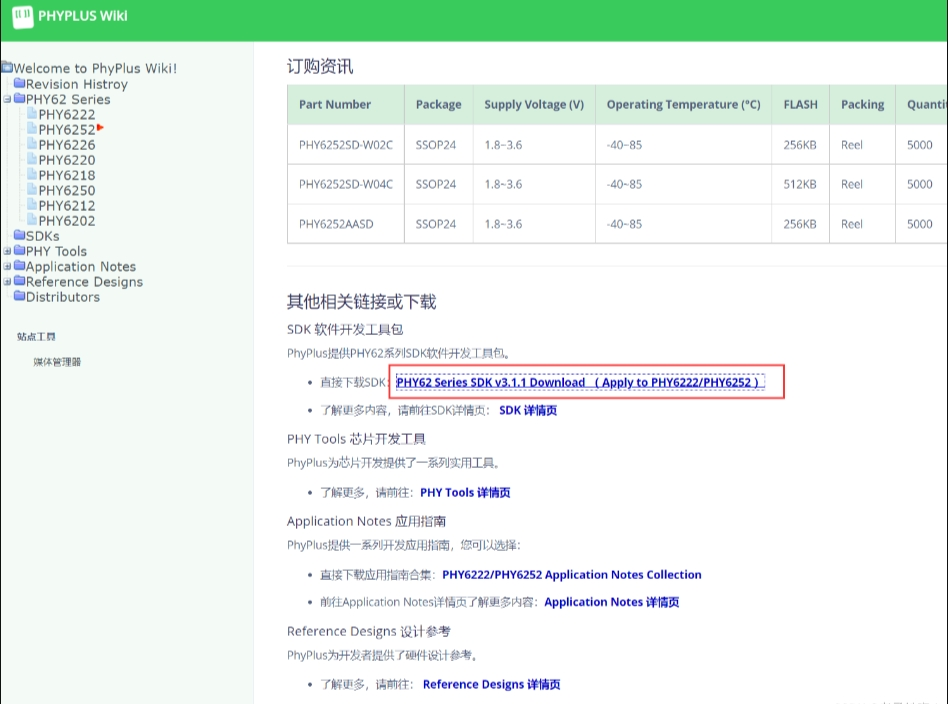  
下载PHY6252芯片的SDK，解压后打开SDK下面的example\peripheral\gpio例程

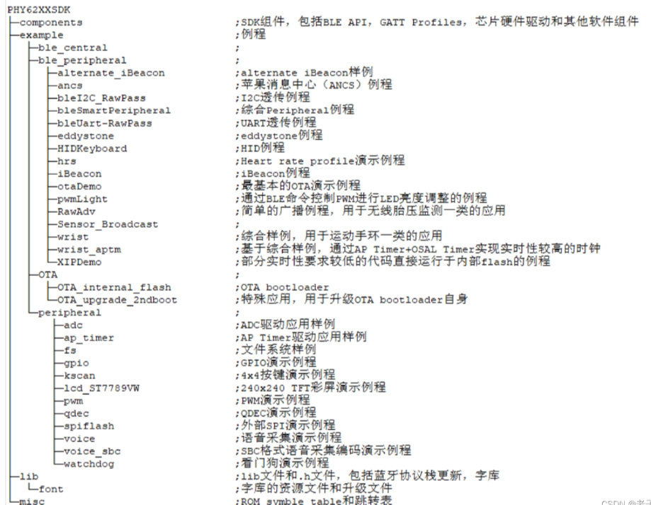
## 关闭低功耗模式
>因为芯片休眠了，LED的输出也会关闭。  
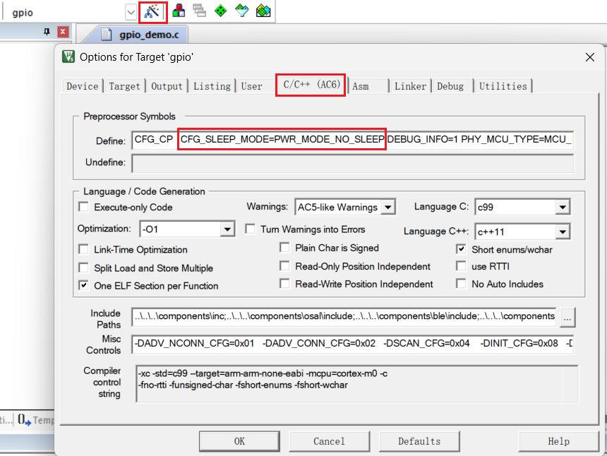  
`CFG_SLEEP_MODE=PWR_MODE_SLEEP`中插入 `_NO`即可：`CFG_SLEEP_MODE=PWR_MODE_NO_SLEEP`
## 点亮蓝色LED（GPIO_18 输出高电平）

修改gpio_demo.c

注释 `void Key_Demo_Init(uint8 task_id)`整个函数，并修改为

```
void Key_Demo_Init(uint8 task_id)
{
        key_TaskID = task_id;// 任务id，先暂时不用管。
  
        // 此写函数默认会调用hal_gpio_pin_init(pin,GPIO_OUTPUT);
        hal_gpio_write(GPIO_P18,HAL_HIGH_IDLE); // GPIO18 输出高电平，点亮LED
}
```
# 编译
  
    After Build - User command #2: fromelf.exe .\Objects\gpio_demo.axf --i32combined --output .\bin\gpio_demo.hex  
注意这一行的 --output .\bin\gpio_demo.hex告诉了我们输出的gpio_demo.hex固件在bin目录下
# 烧录
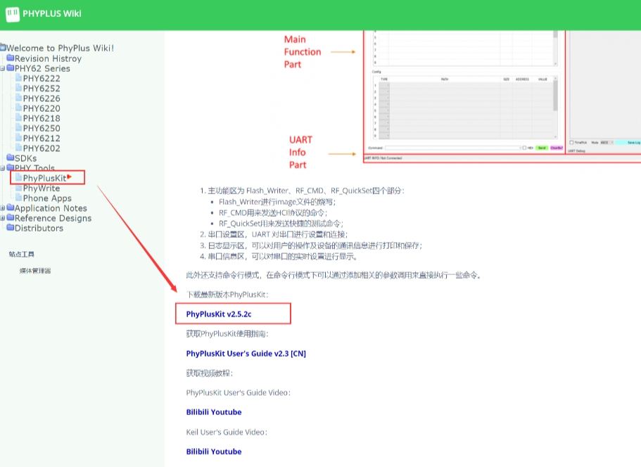  
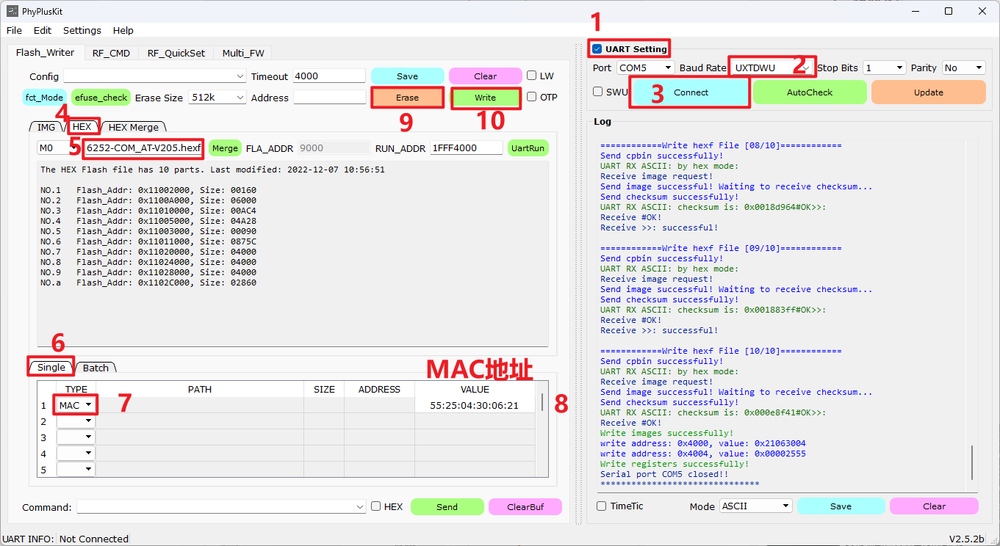  
输入自己想要使用的MAC地址。

出现 `UART TX ASCII: UXTDWU`时说明开发板连接成功。  
此时长按复位按键，大概2s左右后，松开复位键。再进行第9和第10步烧录成功后再按RST复位运行

## Keil烧录
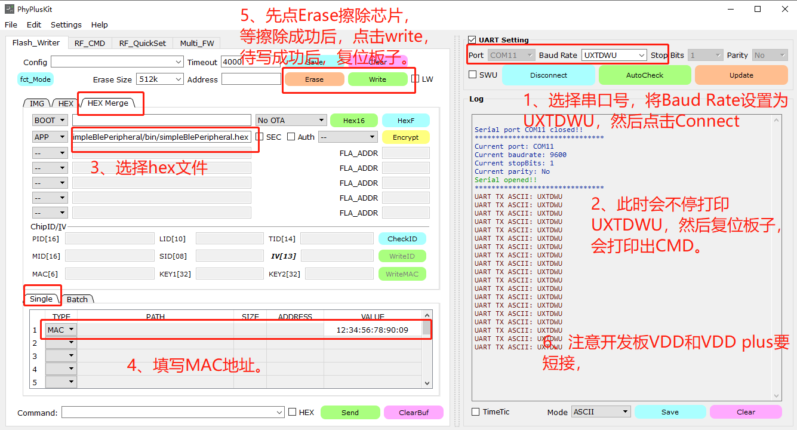  
依次点击HexF，Erase，Write烧录固件
# SWD调试
P2 GPIO2/SWD debug data inout
P3 GPIO3/SWD debug clock
6222/6252 支持 SWD 接口

未关闭SWD调试的情况下可以通过Jlink读出来固件的，可以把SWD的io口拉低屏蔽。

```c
hal_gpio_pin2pin3_control(GPIO_P02,0);
hal gpio pin2pin3 control(GPIO_P03,0);
```
# OSAL（Operating System Abstraction Layer）即操作系统抽象层

一个单片机通用的软件调度器框架 --- 基于任务和事件的OSAL调度器。OSAL最初的概念是由德州仪器TI在ZigBee的协议栈Z-Stack上引入的，严格意义上来说，它并不是一个传统意义的操作系统，但可以实现部分类似操作系统的功能。简单来说就是初始化任务池以及轮询任务池。  
默认情况下，OSAL最大任务数为9，最大事件数为16
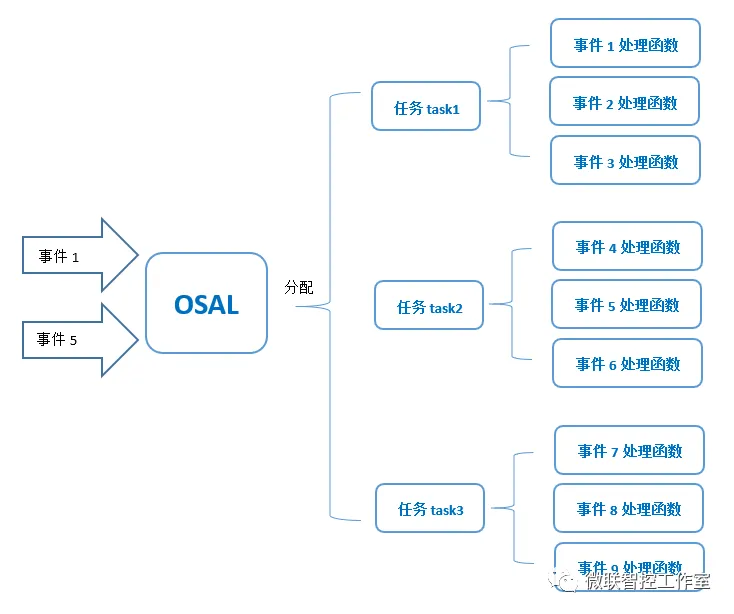  

**任务调度**：采用任务数组tasks_events来管理各层对应的任务事件，tasks_arr是任务事件的处理数组，使用osal_set_event()函数，可以为对应的任务设置事件，使用osal_clear_event()函数，可以清除对应的任务事件。  
**时间管理**：OSAL使用STM32的滴答时钟systick作为时间基准，可以虚拟出多个软件定时器，使用这些软件定时器，可以设置延时任务事件，当延时时间到达后，会为对应的任务事件设置触发标志位，然后执行延时事件。
OSAL调度器主要涉及以下源文件：  
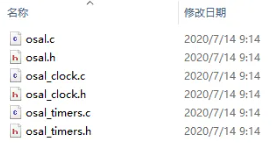  

osal.c和osal.h：主要是任务的注册和调度实现，以及提供任务事件函数设置函数和任务事件清除函数。  

osal_clock.c和osal_clock.h：主要是OSAL调度器使用STM32的滴答时钟systick作为时基，更新系统的软件定时器计数值，以及查找定时任务是否到达定时时间。  

osal_timers.c和osal_timers.h：主要是通过链表的方式管理系统的软件定时器，对外提供软件定时任务的启动函数，软件定时任务的停止函数。  
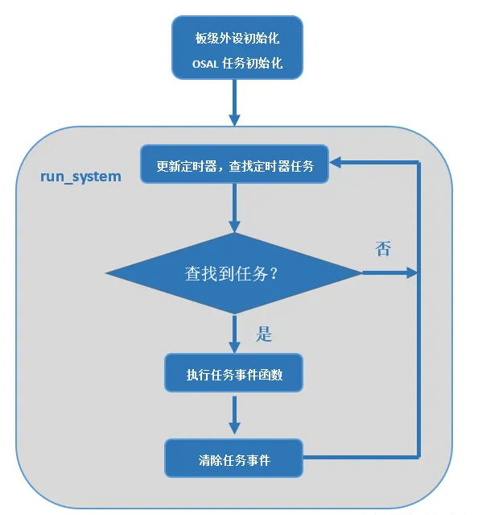   
以上流程图，板级初始化和OSAL任务初始化，在main函数中完成，具体的调用方式可以查看GitHub里面的源代码文件。run_system()函数主要在while(1)大循环中调用，不断更新软件定时器并查找是否有定时任务，如果有立即执行的任务或定时任务，则执行任务事件函数，事件处理函数执行完成后，清除事件标志位。
```c
int app_main(void)
{
    /* 初始化OSAL，包括初始化任务池osalInitTasks() */
    osal_init_system();
    osal_pwrmgr_device( PWRMGR_BATTERY );
    /* Start OSAL */
    osal_start_system(); // 轮询任务池
    return 0;
}
```
其中osal_init_system()会调用osalInitTasks()，做OSAL初始化。
osal_init_system没有公开源码。  
osal_start_system()会调用osal_run_system()，进行osal轮询。  
但是osal_start_system、osal_run_system都没有公开源码。  
用户能看到的是:  
jump_table_base和tasksArr  

run_system()函数主要在osal.c文件中实现，函数的实现方式如下所示：   
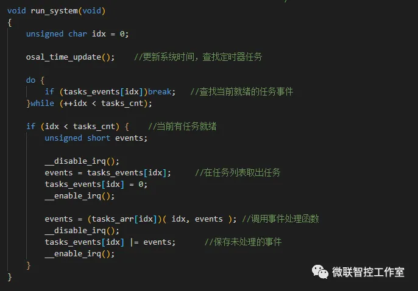  
举个例子：例如我们需要添加一个看门狗的任务来监测系统是否正在运行，并定时进行喂狗操作。那么可以新建任务源文件iwdg_task.c和头文件iwdg_task.h，然后在osal.h文件中定义一个任务ID：IWDG_TASK_ID，这个ID就代表看门狗任务，看门狗任务的一系列事件，可以在头文件iwdg_task.h中进行定义。
源文件iwdg_task.c提供看门狗任务的初始化函数和任务执行函数，每个任务都需要提供任务的初始化函数和任务执行函数，格式如下图所示。  

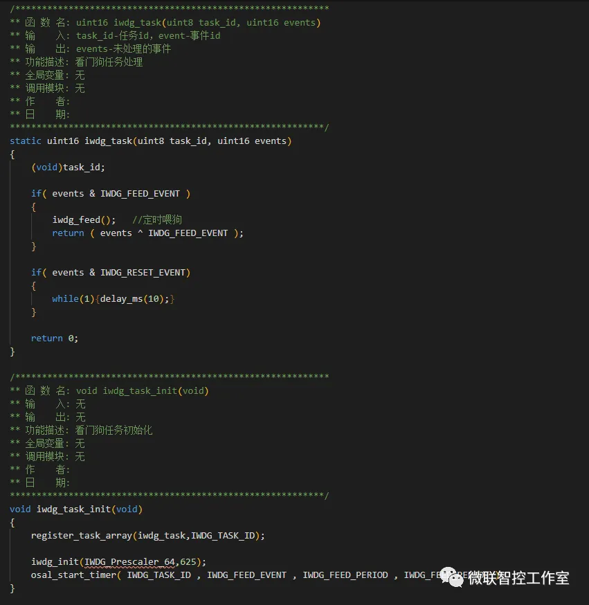  
在函数iwdg_task_init()中，先通过register_task_array()函数，绑定IWDG_TASK_ID任务ID和iwdg_task()任务处理函数，然后再初始化STM32的看门狗外设，最后通过osal_start_timer()函数启动一个定时器，不断定时进行喂狗操作。
喂狗事件IWDG_FEED_EVENT和喂狗周期IWDG_FEED_PERIOD是在头文件iwdg_task.h中进行定义的，这里需要注意的是，每个任务事件都是按位操作的，目前每个任务下面最多定义16个事件如下图所示。
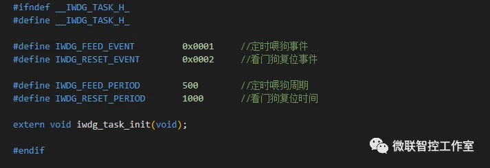  
对于OSAL调度器，以下函数接口使用得比较多：  
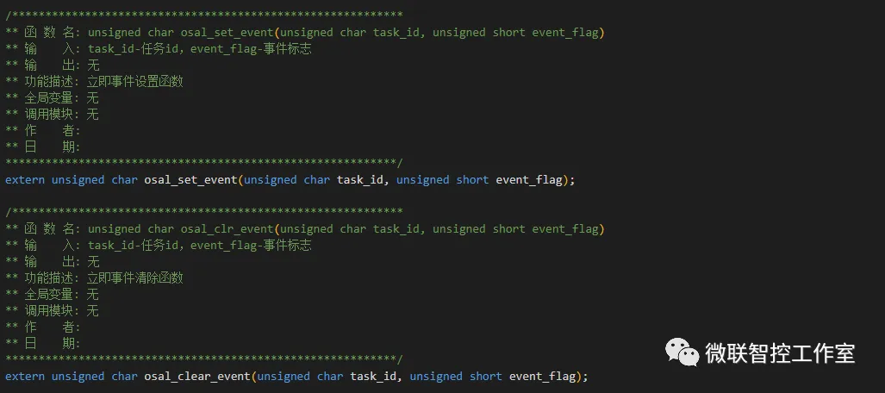  
函数osal_set_event()和函数osal_clear_event()主要用来设置和清除立即执行的任务事件，当任务事件设置后，在run_system()函数中，该事件会立即执行。
函数osal_start_timer()和osal_stop_timer()主要用来设置和停止定时器任务事件，当定时时间到达后事件才会执行。osal_start_timer()的第三个参数timeout_value表示首次执行的超时时间，第四个参数reload_timeout_value表示下一次执行的重装载时间。如果要定时任务事件只触发一次，只需要把第四个参数reload_timeout_value置为0即可。
对于德州仪器TI提供的原生OSAL调度器，还有消息通信机制，不同的任务之间通过消息队列来进行数据传输，以实现任务间的数据访问。但这里为了使调度器简单易用，并没有把消息通信机制一并整合进来，使用这个调度器，多个任务间的数据仍然以共享内存的方式进行访问。  

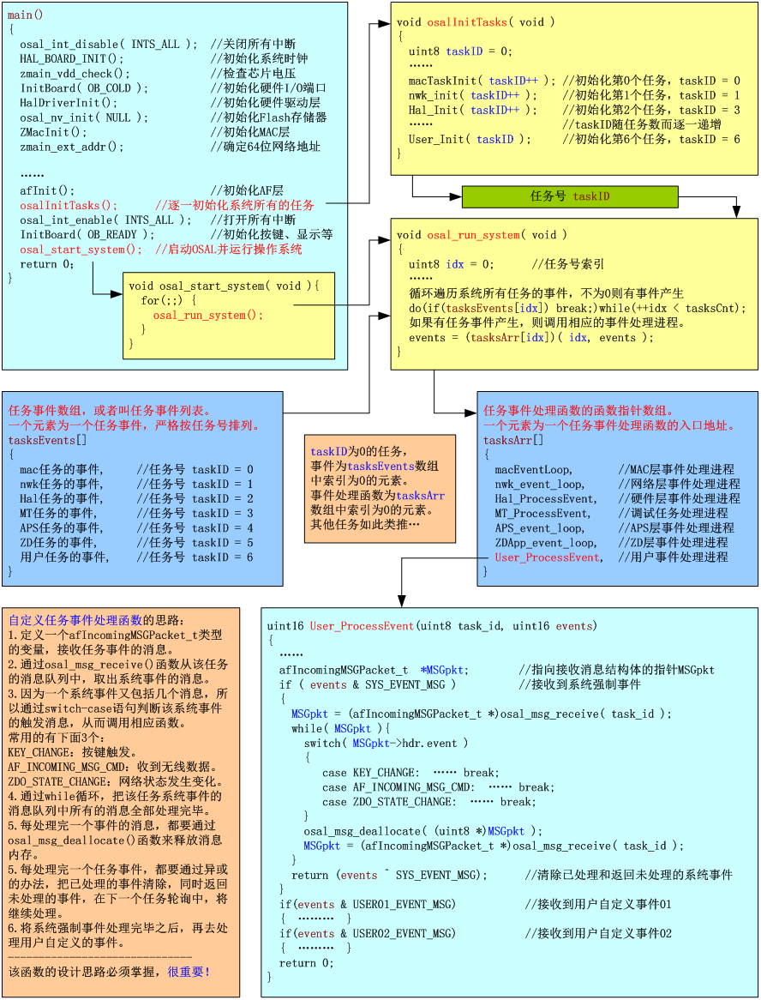  

大致的流程如下：事件发生后-->被打包为消息-->存放到消息队列-->事件处理函数取出消息并进行相应操作  

## 任务池初始化
每一个层次都有一个对应的任务来处理本层次的事务，例如MAC层对应一个MAC层的任务、网络层对应一个网络层的任务、HAL对应一个HAL的任务，以及应用层对应一个应用层的任务等，这些各个层次的任务构成一个任务池，这个任务池也就是上节课讲到的tasksEvents数组，如图所示。  
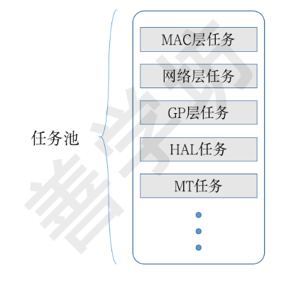  
这个过程跟《OSAL的任务调度原理》章节中创建和初始化任务池是类似的，它们的主要差别在于：

首先，任务池存储的数据结构不同，这里的tasksEvents是一个uint16类型的数组。
其次，tasksEvents支持存放多种类型的任务，例如MAC层的任务、网络层的任务和应用层的任务等。
最后，这里的每一个任务中都可能会包含多个待处理事件。  

前面章节中曾经讲到，tasksEvents中的每个任务可以包含0个或者多个待处理的事件，而这个数组类型变量pTaskEventHandlerFn是一个函数指针类型变量，用于指向事件对应的处理函数，因此这段代码定义了一个事件处理函数数组，这个数组中的每一个元素均表示某一个层次任务的事件处理函数，例如：

- MAC层任务对应的事件处理函数是macEventLoop()，它专门处理MAC层任务中的事件。
- 网络层任务对应的事件处理函数是nwk_event_loop()，它专门处理网络层任务中的事件。
- 应用层任务对应的事件处理函数是zclSampleSw_event_loop()，它专门处理应用层任中的事件。
# PHY6252 BLE
学习奉加的蓝牙工程建议先看最简单的simplebleperipheral.uvprojx工程。看这个工程可以结合PHY蓝牙连接流程.docx文档一起看。其他如bleuart_at,multi工程也有对应的文档，可以先结合文档一起看。
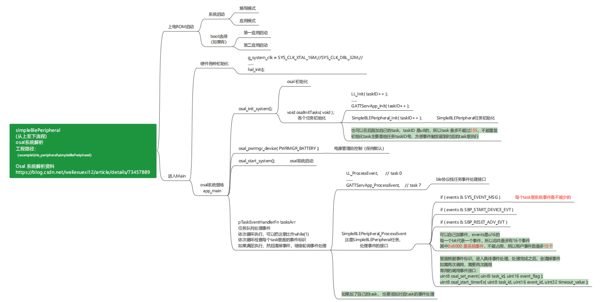  
蓝牙名称默认是BUMBLE-FFFFFFFF
## 主机连接流程  

1. 在SimpleBLECentral_Init配置各种参数，启动START_DEVICE_EVT 事件osal_set_event(simpleBLETaskId, START_DEVICE_EVT);  
1. 收到START_DEVICE_EVT事件：a:GAPCentralRole_StartDevice（初始化central）b: GAPBondMgr_Register(注册配对绑定回调函数)。  
1. 收到GAP_DEVICE_INIT_DONE_EVENT：central初始化完成后gap层会发送此事件到应用层回调函数simpleBLECentralEventCB，然后发送CENTRAL_INIT_DONE_EVT事件 osal_set_event(simpleBLETaskId,CENTRAL_INIT_DONE_EVT);  
1. 收到CENTRAL_INIT_DONE_EVT：调用simpleBLECentral_DiscoverDevice函数，开始扫描广播。  
1. gap层每次扫描到一个广播就发送GAP_DEVICE_INFO_EVENT到应用层回调函数  simpleBLECentralEventCB，并调用simpleBLEAddDeviceInfo函数将扫描到的设备加到设备列表。  
1. 收到GAP_DEVICE_DISCOVERY_EVENT：central扫描结束收到此事件，可以在此事件做相应处理，比如打印扫描到设备地址，地址类型等。然后调用osal_set_event(simpleBLETaskId,CENTRAL_DISCOVER_DEVDONE_EVT);，发送CENTRAL_DISCOVER_DEVDONE_EVT事件。  
1. 收到CENTRAL_DISCOVER_DEVDONE_EVT：收到此事件后调用simpleBLECentral_LinkDevice  GAPCentralRole_EstablishLink连接设备。  
1. 收到GAP_LINK_ESTABLISHED_EVENT：收到此事件时代表连接成功。可以做后续的处理，比如更新MTU，设置PHY mode等，这些根据具体需求来做调用。然后调用osal_start_timerEx( simpleBLETaskId, START_DISCOVERY_SERVICE_EVT,DEFAULT_SVC_DISCOVERY_DELAY );  
1. 收到DEFAULT_SVC_DISCOVERY_DELAY：收到此事件后调用simpleBLECentralStartDiscoveryService GATT_DiscAllPrimaryServices函数来发现peripheral设备的服务和特征。  
1. 收到gatt层发送的SYS_EVENT_MSG事件 simpleBLECentral_ProcessOSALMsg GATT_MSG_EVENT simpleBLECentralProcessGATTMsg simpleBLEGATTDiscoveryEvent，最后到simpleBLEGATTDiscoveryEvent函数，此函数会将发现到服务和特征保存到SimpleClientInfo变量中。  
---------------------------------------------------------------------------
到此为一个基本的连接过程，后面的配对绑定在连接后面处理，原理也是一样的：  
首先在SimpleBLECentral_Init函数配置初始化函数时设置pairMode 为GAPBOND_PAIRING_MODE_INITIATE;  
然后在START_DEVICE_EVT事件处向gapbondmgr层注册配对绑定回调函数GAPBondMgr_Register((gapBondCBs_t*)&simpleBLEBondCB);  
在连接成功后central会自动发起配对。配对过程大部分流程都由gapbondmgr完成，如果在初始化时设置为不需要密钥输入，则不需要应用层参与，如果设置为需要密钥输入，则gapbondmgr会回调simpleBLECentralPasscodeCB函数让用户输入密钥和显示密钥。在配对过程中会在发送事件到simpleBLECentralPairStateCB，如GAPBOND_PAIRING_STATE_STARTED，GAPBOND_PAIRING_STATE_COMPLETE，GAPBOND_PAIRING_STATE_BONDED，让用户做相应处理。  


## 从机连接流程

1. 在SimpleBLEPeripheral_Init配置各种参数，启动START_DEVICE_EVT 事件osal_set_event(simpleBLETaskId, START_DEVICE_EVT);  
1. 收到START_DEVICE_EVT事件：a: GAPRole_StartDevice（初始化peripheral）b: GAPBondMgr_Register(注册配对绑定回调函数)。  
1. 在gapRole_ProcessGAPMsg收到GAP_DEVICE_INIT_DONE_EVENT：收到此事件说明初始化成功，然后调用GAP_UpdateAdvertisingData更新广播数据。  
1. 收到GAP_ADV_DATA_UPDATE_DONE_EVENT事件：继续调用GAP_UpdateAdvertisingData更新扫描回复数据。  
1. 收到GAP_ADV_DATA_UPDATE_DONE_EVENT事件：调用osal_set_event( gapRole_TaskID, START_ADVERTISING_EVT );  
1. 在GAPRole_ProcessEvent收到START_ADVERTISING_EVT事件：然后调用GAP_MakeDiscoverable函数开始广播。  
1. 在gapRole_ProcessGAPMsg收到GAP_MAKE_DISCOVERABLE_DONE_EVENT事件：在此事件下更新相关状态。并等待连接请求，连接过程会由gap层完成，连接成功后会发送相应事件。  
1. 收到GAP_LINK_ESTABLISHED_EVENT事件：说明连接成功。连接成功后可以做后续处理，如连接参数更新，读rssi，开始配对绑定流程等，具体根据需求来调用相关函数。  
--------------------------------------------------------------------------
关于配对绑定流程涉及到的事件参照上文主机配对绑定流程。  
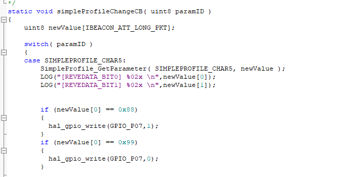
# OTA
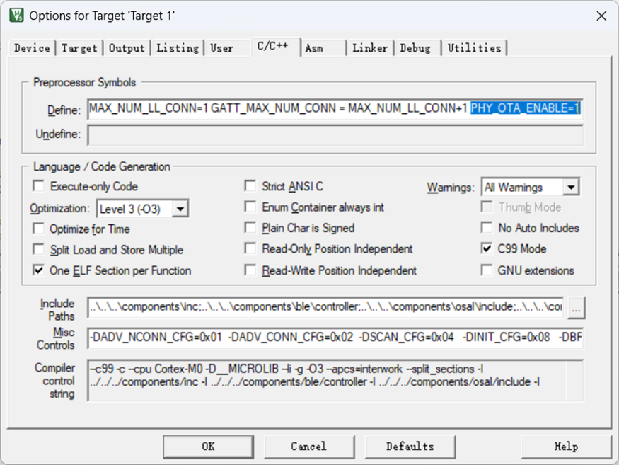  
启用 OTA 功能：再次改造 simpleBlePeripheral 项目，在 C/C++ 选项卡下添加预处理器定义 `PHY_OTA_ENABLE=1`，启用 OTA 功能，然后重新编译生成 hex 文件。
`PHY_OTA_ENABLE=1`其实就是帮你把一些OTA相关代码启用了。    
烧写 OTA 相关固件：打开烧写软件，app 选择新编译的 hex 文件，BOOT 选择 SDK 中 example\OTA\OTA_internal_flash\bin 下预先编译的 ota 的 boot hex。OTA 模式选择 `Single No FCT`（意思是，升级的时候蓝牙app会暂停程序且覆盖写入），进入烧写模式，先 erase 擦除，再 write 烧写。烧写完成后按 reset，开发板即具备 OTA 功能。

首先用户程序要添加OTA服务，如果在运行过程中检测到OTA升级，程序就会跳转到指定地址，运行完全独立的OTA程序。OTA程序会将接收到的数据写入原来用户程序的位置，写入完成后OTA程序会跳转执行下载好的程序。在profile里面添加sbpProfile_ota.c,ota_app_service.c.直接编译下载就可以。
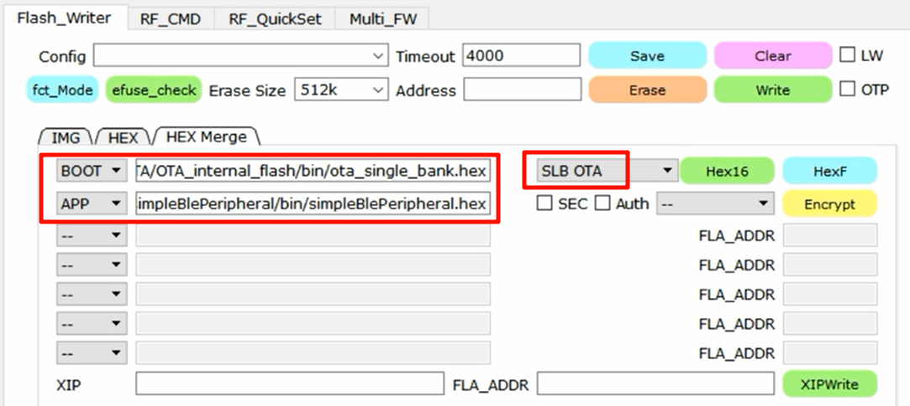  
烧录要内存空间要选择SLB OTA模式  

## APP OTA
以看到下面的界面，app首先会进行连接，然后会显示 特性Enable成功SBH App已准备好，就说明我们的APP已经准备好要对Bumble进行OTA升级了，接下来我们准备升级所需要的hex16文件
  
我们准备一个新版本的simpleBlePeripheral，只需在代码里加一个log以区分新旧版本，我们修改 `simpleBLEPeripheral.c`，在main函数里添加一个log

`SimpleBLEPeripheral_Init`函数的最后加了一行  

      LOG("======================THIS IS NEW OTA VERSION====================\n");
重新编译，生成hex文件，然后我们在烧写工具当中使用HEX Merge选项卡，app选择新编译出来的hex文件，而BOOT选择SDK当中预先编译的ota的boot hex，然后在OTA模式选择 Single No FCT
点击右侧绿色的Hex16按钮，生成hex16文件  
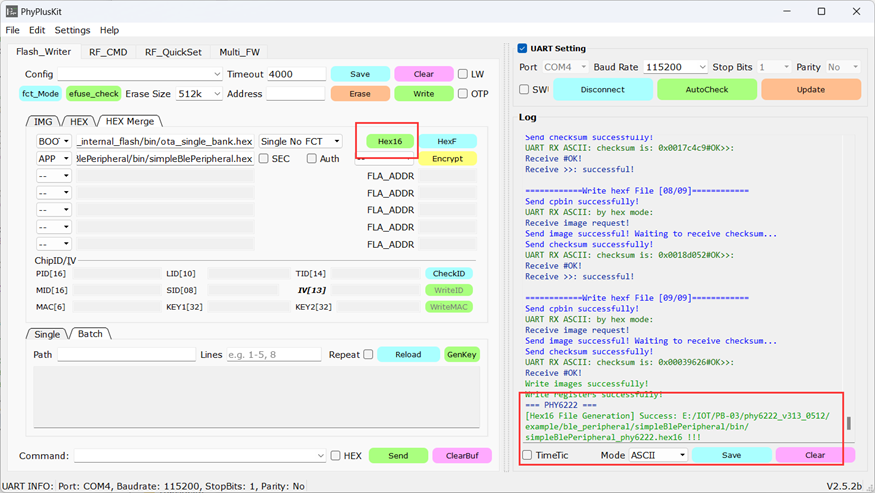
## 代码解析
添加ota_app_service.c文件。将其ota_app_AddService();在app应用程序的初始化函数bleuart_Init如下代码段添加，即完成了对该工程demo的OTA支持。
```c
void bleuart_Init( uint8 task_id )
{
...
  // Initialize GATT attributes
  GGS_AddService( GATT_ALL_SERVICES );            // GAP  0xFFFFFFFF
  GATTServApp_AddService( GATT_ALL_SERVICES );    // GATT attributes
  DevInfo_AddService();                           // Device Information Service
  bleuart_AddService(on_bleuartServiceEvt);
  ota_app_AddService();                     //添加ota服务
  at_Init(); // initial uart for AT cmd first.
...
  osal_set_event( bleuart_TaskID, BUP_OSAL_EVT_START_DEVICE ); 
}
```
当 BLE从机设备和支持BLE OTA的手机APP建立连接之后，就是可以实现BLE设备的OTA升级。
其过程分为三个阶段：
1、启动OTA升级 命令OTA_CMD_START_OTA，可以启动OTA过程。  
2、应用参数传递（此步骤为可选步骤） OTA_CMD_START_OTA命令的参数如果param_size字段不为0，那么自动进入参数传递状态，进行参数的传递。  
3、应用固件传输以及烧写 如果之前的OTA_CMD_START_OTA命令param_size字段为0或者参数传递已经完成，就可以通过OTA_CMD_PARTITION_INFO命令开始块数据的传输。  
通常一个应用固件由2~3个partition组成。目前OTA最多支持16个partition。
实现原理可以参考ota_app_service.c里的代码。  
第一次点击OTA后，手机APP会跟BLE设备断开，BLE设备会从运行应用程序跳转运行OTA bootloder程序，所以其广播的蓝牙名称为PPlusOTA。如下图，我们再次使用手机APP对其连接：  
          
# SimpleBlePeripheral工程解析

这个工程是一个基于Phyplus PHY6222(52)芯片的蓝牙低功耗(BLE)外设示例项目。下面我将从多个方面详细解析这个工程：

## 1. 工程概述

这是一个典型的BLE外设应用程序，实现了基本的BLE广播、连接和数据交换功能。工程基于OSAL（操作系统抽象层）构建，采用事件驱动的编程模型。

## 2. 文件结构

主要源代码文件位于source目录下：

- **main.c**: 系统入口点，初始化硬件和OSAL系统
- **SimpleBLEPeripheral_Main.c**: 应用程序主入口，包含app_main函数
- **OSAL_SimpleBLEPeripheral.c**: OSAL任务初始化，定义了任务优先级和事件处理函数
- **simpleBLEPeripheral.c**: 主应用程序逻辑，包含初始化和事件处理函数
- **simpleBLEPeripheral.h**: 应用程序相关的宏定义和函数声明
- **sbpProfile_ota.c/h**: 自定义GATT服务和特性的实现
- **halPeripheral.c/h**: 硬件抽象层，处理GPIO、按键和LED等外设

## 3. 系统架构

### OSAL任务结构

系统基于OSAL任务调度，在OSAL_SimpleBLEPeripheral.c中定义了以下任务（按优先级排序）：

1. LL_ProcessEvent - 链路层事件处理
2. HCI_ProcessEvent - 主机控制器接口事件处理
3. L2CAP_ProcessEvent - 逻辑链路控制与适配协议事件处理
4. SM_ProcessEvent - 安全管理器事件处理
5. GAP_ProcessEvent - 通用访问配置文件事件处理
6. GATT_ProcessEvent - 通用属性配置文件事件处理
7. GAPRole_ProcessEvent - GAP角色事件处理
8. GAPBondMgr_ProcessEvent - 绑定管理器事件处理（可选）
9. GATTServApp_ProcessEvent - GATT服务应用事件处理
10. SimpleBLEPeripheral_ProcessEvent - 应用程序事件处理

### 应用程序初始化流程

1. 系统启动时，main.c中的app_main()函数被调用
2. 初始化操作系统(osal_init_system)
3. 设置电源管理模式(osal_pwrmgr_device)
4. 启动OSAL系统(osal_start_system)
5. OSAL初始化各个任务(osalInitTasks)
6. 应用程序初始化(SimpleBLEPeripheral_Init)

## 4. BLE功能实现

### 广播实现

工程实现了标准的BLE广播功能：
- 在simpleBLEPeripheral.c中定义了广播数据(advertData)和扫描响应数据(scanRspData)
- 支持配置广播间隔、广播类型和广播通道
- 支持iBeacon格式的广播数据

### GATT服务

工程实现了一个自定义的GATT服务(sbpProfile_ota.c)，包含以下特性：
- 特性4(SIMPLEPROFILE_CHAR4): 用于电源控制，支持读写
- 特性5(SIMPLEPROFILE_CHAR5): 用于复位，支持读写和无响应写
- 特性6(SIMPLEPROFILE_CHAR6): 用于通知，支持读和通知
- 特性7(SIMPLEPROFILE_CHAR7): 支持读和无响应写

### 连接参数更新

工程支持BLE连接参数更新：
- 最小连接间隔: 30ms (DEFAULT_DESIRED_MIN_CONN_INTERVAL)
- 最大连接间隔: 1000ms (DEFAULT_DESIRED_MAX_CONN_INTERVAL)
- 从设备延迟: 0 (DEFAULT_DESIRED_SLAVE_LATENCY)
- 监督超时: 5000ms (DEFAULT_DESIRED_CONN_TIMEOUT)

## 5. 硬件抽象层

halPeripheral.c/h文件实现了硬件抽象层，包括：
- GPIO控制
- 按键处理
- LED控制
- UART通信
- 命令行接口(CLI)

## 6. 高级功能

工程还包含一些高级功能和测试选项：
- OTA固件升级支持(PHY_OTA_ENABLE)
- 可解析私有地址测试(APP_CFG_RPA_TEST)
- 延迟测试(LATENCY_TEST)
- 动态时钟变更测试(DYNAMIC_CLK_CHG_TEST)
- Flash测试(DBG_SPIF_TEST)
- RTC测试(DBG_RTC_TEST)

## 7. 事件处理

应用程序通过SimpleBLEPeripheral_ProcessEvent函数处理各种事件：
- SBP_START_DEVICE_EVT: 启动设备
- SBP_PERIODIC_EVT: 周期性事件，用于发送通知
- SBP_RESET_ADV_EVT: 重置广播
- 其他测试和调试事件

## 总结

这个SimpleBlePeripheral工程是一个完整的BLE外设示例，展示了PHY6222(52)芯片的BLE功能，包括广播、连接、GATT服务和各种高级功能。它采用OSAL事件驱动架构，提供了良好的代码结构和功能模块化，可以作为开发自定义BLE应用的良好起点。
        
# 我的程序
## SPI
 1. 定义灯珠数量、0码、1码,三个颜色通道的结构体；
2. 配置SPI结构体，然后调用hal_spi_bus_init。
3. 定义WS2812设置灯的颜色函数，将三个颜色通道的结构体成员按位与上循环8次左移并判断是否是1还是0赋值为归0码还是归1码。最后循环灯珠数*通道数循环发出去`hal_spi_transmit(&spiflash_spi,mode,tx_buf,rx_buf,tx_len,rx_len)`

## OSAL
在tasksArr定义你自己处理事件的函数，在osalInitTasks中调用你自己的初始化任务（参数传入任务ID）基本是taskID++。任务里面调用`osal_start_reload_timer`重复定时器，无需重复调用 `osal_start_timerEx`一次性定时器（参数：任务ID，事件，触发时间）
在你自己处理事件的函数中用 if (events & TIMER_1S_ONCE )判断是否触发。
## DMA
先初始化SPI总线，然后初始化DMA通道。
`hal_spi_bus_init(&spiflash_spi,spi_cfg);`
`hal_dma_init_channel(dma_cfg);`
```c
osal_start_timerEx( )
uint8 osal_start_timerEx( uint8 taskID, uint16 event_id,  uint32 timeout_value );
/*【调用一次】调用此函数以启动计时器。当定时器到期时，将设置给定的事件位。活动将是为taskID指定的任务设置。此计时器是一次性计时器，这意味着当计时器到期时，它不会重新加载。*/
osal_start_reload_timer( )
uint8 osal_start_reload_timer( uint8 taskID, uint16 event_id,  uint32 timeout_value );

/*【循环调用】调用此函数以启动计时器，当计时器到期时，它将设置一个事件位并重新加载超时值自动。将为taskID指定的任务设置事件。*/
osal_set_event( )
uint8 osal_set_event(uint8 task_id, uint16 event_flag )
/*调用此函数为任务task_id,设置事件标志event_flag。
task_id是接收事件的任务ID。
event_flag是一个2字节的位图，每个比特指定一个事件。有一个系统事件*/（SYS_EVENT_MSG:0x8000），其余事件可以自定义。
```
## 主函数
PB03模组内部没有连接RTC晶振
所以要使用芯片内部的32KRC振荡器
初始化完芯片各个外设就可以初始化OSAL，初始化完成后任务只能通过OSAL轮询调度或者中断来执行。
轮询任务要在OsalInitTasks中初始化，同时要将任务函数的指针按顺序存放到数组里。ADC初始化获取任务ID和执行ADC测量任务。ADC测量任务配置了ADC引脚和触发ADC读取。ADC读取完成后系统会进入回调函数处理数据。回调函数中将ADC数值通过串口发送打印出来。回调函数最后设置定时触发任务。**开蓝牙只能跑到64MHz。**  
## 灯效更新流程
定时器（16ms 间隔）触发更新事件 → 触发渲染事件 → 计算当前模式的灯效 → 通过 SPI 输出到 WS2812。
16ms 间隔对应 62.5Hz 刷新频率，兼顾平滑度和系统负载。
蓝牙设备名称有两种方式：第一种就是放在蓝牙广播包里面携带设备名称0x09，第二种就是放在扫描相应包里面然后拼凑到第一个。所以数据格式不对。

0x0201060303FFE00BFF535004116105000501640709535036313145这是一段蓝牙广播的**原始十六进制数据**，遵循蓝牙低功耗（BLE）的**广告数据（Advertising Data）格式**，用于设备广播时传递自身信息。以下是详细解析，帮你理解每个字段的含义：

---

### 1. **蓝牙广告数据的基本结构**  
蓝牙广告数据由**多个“长度（LEN）+ 类型（TYPE）+ 值（VALUE）”** 的单元组成，每个单元描述设备的一类信息（如设备名、支持的服务、厂商数据等）。  

你提供的原始数据可拆分为：  
`02 01 06 03 03 FFE0 0B FF 53500411610500050164 07 09 535036313145`  

按“`LEN-TYPE-VALUE`”拆分后对应关系如下（和你截图的`Details`一致）：  

| LEN（长度） | TYPE（类型） | VALUE（值）                | 含义说明                                                                 |  
|------------|--------------|---------------------------|--------------------------------------------------------------------------|  
| `02`       | `0x01`       | `06`                      | **Flags（标志位）**：`0x06` 表示设备支持 BLE 且“不支持经典蓝牙（BR/EDR）”   |  
| `03`       | `0x03`       | `FFE0`                    | **16位服务UUID**：`0xFFE0` 是蓝牙预定义的“通用属性配置文件（GATT）”相关服务  |  
| `0B`       | `0xFF`       | `53500411610500050164`    | **厂商自定义数据**：由设备厂商自定义格式，可能包含设备型号、状态等私有信息    |  
| `07`       | `0x09`       | `535036313145`            | **完整本地名称**：解码为字符串是 `SP611E`（设备的广播名称）                 |  


---

### 2. **逐字段解析（结合蓝牙规范）**  
#### （1）`02 01 06` → Flags（标志位）  
- **LEN=02**：表示该单元占 2 字节（`TYPE + VALUE` 共 2 字节）。  
- **TYPE=0x01**：固定为“Flags”类型，定义设备的蓝牙基础特性。  
- **VALUE=06**：二进制是 `0000 0110`，按蓝牙规范：  
  - 第 0 位（最低位）`0` → 不支持“有限发现模式”；  
  - 第 1 位 `1` → 支持“BLE 模式”；  
  - 第 2 位 `1` → 不支持“经典蓝牙（BR/EDR）”；  
  通俗说：**这是一个仅支持 BLE 低功耗模式的设备**。  


#### （2）`03 03 FFE0` → 16位服务UUID  
- **LEN=03**：该单元占 3 字节（`TYPE + VALUE` 共 3 字节）。  
- **TYPE=0x03**：表示“完整的 16 位服务 UUID 列表”。  
- **VALUE=FFE0**：`0xFFE0` 是蓝牙官方预定义的 UUID（属于“通用属性配置文件 GATT”相关服务 ），很多 BLE 设备会广播它表示支持基础通信能力。  


#### （3）`0B FF 53500411610500050164` → 厂商自定义数据  
- **LEN=0B（11 字节）**：该单元占 11 字节（`TYPE + VALUE` 共 11 字节）。  
- **TYPE=0xFF**：固定为“厂商自定义数据”，内容由设备厂商自由定义（需结合厂商文档理解）。  
- **VALUE=53500411610500050164**：  
  - 通常前 2 字节是**厂商 ID**（蓝牙协会分配，`0x5350` 可能是某厂商的自定义 ID ）；  
  - 后面字节可能是设备型号、硬件版本、状态码等私有数据（需厂商文档才能完全解析）。  


#### （4）`07 09 535036313145` → 完整本地名称  
- **LEN=07**：该单元占 7 字节（`TYPE + VALUE` 共 7 字节）。  
- **TYPE=0x09**：表示“完整本地设备名称”。  
- **VALUE=535036313145**：  
  - 按 ASCII 解码：`53`→`S`、`50`→`P`、`36`→`6`、`31`→`1`、`31`→`1`、`45`→`E`，即 **`SP611E`**（设备的广播名称，方便用户识别）。  


---

### 3. **总结：这是什么设备？**  
从数据看，这是一个 **BLE 低功耗设备**，广播名称为 `SP611E`，可能是某厂商（如智能家居、穿戴设备厂商）的自定义设备：  
- 支持 BLE 通信，不支持经典蓝牙；  
- 广播了基础服务 UUID（`0xFFE0` ）和厂商私有数据；  
- 设备名称 `SP611E` 可能是型号（比如某款传感器、蓝牙模块 ）。  

如果要完全解析**厂商自定义数据**（`0B FF ...` 部分），需要找设备厂商的文档，因为这部分是私有协议 。  

如果是开发场景，可通过蓝牙调试工具（如你截图的 App）连接设备，进一步读取 GATT 服务/特征，就能拿到更详细的数据啦～

# 灯带能做的功能
1. 2.4G遥控
2. 亮度调节（1-100）
3. 纯色调节
4. APP预览灯光效果（全场景化UI）
5. 速度调节（1-10）
6. 灯光前进方向（四向，前后，趋于中间，趋于两边）
7. 动态效果（30种）
8. 音乐模式
9. 纯色自定义，渐变自定义（13种）
10. 收藏模式（支持循环播放）
# PHY6252