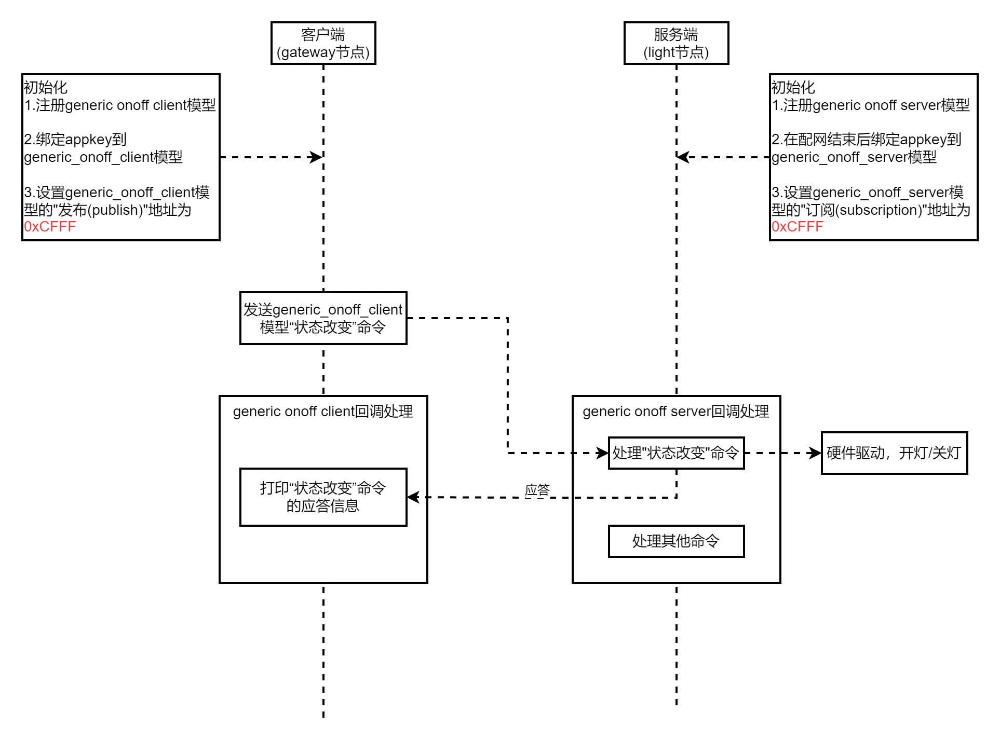
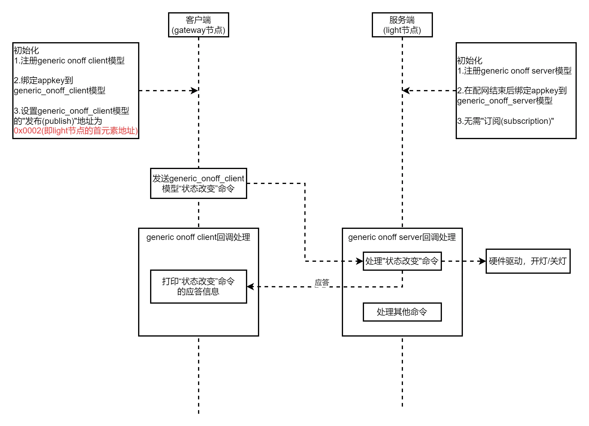
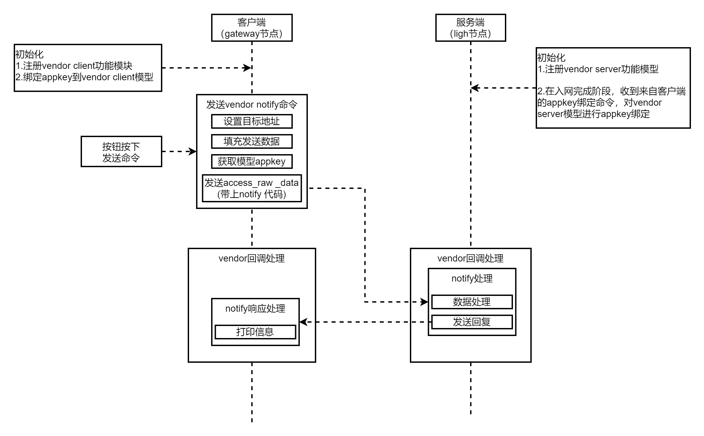

# 置顶链接
1. PB-03F-kit规格书  
   [PB-03F-kit规格书 ](https://file.elecfans.com/web2/M00/44/BC/pYYBAGKG_AiAG_nQAO7bHhjUwBU613.pdf)
2. PB-03F-kit相关使用工具  
   https://docs.ai-thinker.com/blue_tooth_pb  
3. PB-03F-kit环境搭建、烧录教程参考  
   【蓝牙5.2 PB-03F教程】二次开发环境搭建  
   https://bbs.ai-thinker.com/forum.php?mod=viewthread&tid=45385&extra=page%3D1&_dsign=7c8fe8cb  
   【蓝牙5.2 PB-03F教程】烧录流程  
   https://bbs.ai-thinker.com/forum.php?mod=viewthread&tid=45392&extra=page%3D1&_dsign=5f5f2ec8  
   【蓝牙5.2 PB-03F教程】蓝牙基础+主从机指令的使用  
   https://bbs.ai-thinker.com/forum.php?mod=viewthread&tid=45396&extra=page%3D1&_dsign=63f9575e  
  【蓝牙5.2 PB-03教程】SDK二次开发入门，认识架构，开始点亮一盏LED  
   https://bbs.ai-thinker.com/forum.php?mod=viewthread&tid=45412&extra=page%3D5&_dsign=7c8fe8cb  
  低功耗实战（电池供电必学）
   https://bbs.ai-thinker.com/forum.php?mod=viewthread&tid=46152&extra=page%3D1  
   【蓝牙5.2 PB-03F教程】GPIO中断
   https://bbs.ai-thinker.com/forum.php?mod=viewthread&tid=45397&extra=page%3D6
4. 非官方教程   
[收发广播包](https://bbs.ai-thinker.com/forum.php?mod=viewthread&tid=45546&extra=page%3D2)  
[OTA代码解析](https://bbs.ai-thinker.com/forum.php?mod=viewthread&tid=44888&extra=page%3D2)  
[OSAL](https://bbs.ai-thinker.com/forum.php?mod=viewthread&tid=45429&extra=page%3D6)  
[OSAL2](https://bbs.ai-thinker.com/forum.php?mod=viewthread&tid=45544&extra=page%3D5)  
[蓝牙协议栈](https://bbs.ai-thinker.com/forum.php?mod=viewthread&tid=45437&extra=page%3D6)  
[SPI](https://bbs.ai-thinker.com/forum.php?mod=viewthread&tid=45446&extra=page%3D6)  
[PWM](https://bbs.ai-thinker.com/forum.php?mod=viewthread&tid=45453&extra=page%3D5)  
[WS2812](https://blog.csdn.net/huaxiu5/article/details/140853344)  
[DMA](https://www.tuyaos.com/viewtopic.php?t=2515)  
[OTA过程](https://bbs.ai-thinker.com/forum.php?mod=viewthread&tid=45564&extra=page%3D3)  
[FLASH](https://bbs.ai-thinker.com/forum.php?mod=viewthread&tid=45416&extra=page%3D6)  

PHY6252是奉加微的产品，ST17H66是伦茨科技的产品。
但是所有的东西都一样的，SDK、文档、下载工具。
还和CC254x差不多，培训视频、文档资料相当多，拿来做参考有助于理解。BLE-CC254x-1.5.2.0.EXE
# 参数
支持低功耗蓝牙：
Bluetooth5.2， Bluetoothmesh；  
蓝牙速率支持：125Kbps， 500Kbps，1Mbps， 2Mbps；支持广播扩展，
多广播，信道选择。  
64KB SRAM,256KB flash, 96KB ROM, 256bit efuse；

# 二次开发
[SDK网址](http://www.phyplusinc.com/support/4.html)  
  
下载PHY6252芯片的SDK，解压后打开SDK下面的example\peripheral\gpio例程


## 关闭低功耗模式
>因为芯片休眠了，LED的输出也会关闭。  
  
`CFG_SLEEP_MODE=PWR_MODE_SLEEP`中插入 `_NO`即可：`CFG_SLEEP_MODE=PWR_MODE_NO_SLEEP`
## 点亮蓝色LED（GPIO_18 输出高电平）

修改gpio_demo.c

注释 `void Key_Demo_Init(uint8 task_id)`整个函数，并修改为

```
void Key_Demo_Init(uint8 task_id)
{
        key_TaskID = task_id;// 任务id，先暂时不用管。
  
        // 此写函数默认会调用hal_gpio_pin_init(pin,GPIO_OUTPUT);
        hal_gpio_write(GPIO_P18,HAL_HIGH_IDLE); // GPIO18 输出高电平，点亮LED
}
```
# 编译
  
    After Build - User command #2: fromelf.exe .\Objects\gpio_demo.axf --i32combined --output .\bin\gpio_demo.hex  
注意这一行的 --output .\bin\gpio_demo.hex告诉了我们输出的gpio_demo.hex固件在bin目录下
# 烧录
  
  
输入自己想要使用的MAC地址。

出现 `UART TX ASCII: UXTDWU`时说明开发板连接成功。  
此时长按复位按键，大概2s左右后，松开复位键。再进行第9和第10步烧录成功后再按RST复位运行

## Keil烧录
  
依次点击HexF，Erase，Write烧录固件
# SWD调试
P2 GPIO2/SWD debug data inout
P3 GPIO3/SWD debug clock
6222/6252 支持 SWD 接口

未关闭SWD调试的情况下可以通过Jlink读出来固件的，可以把SWD的io口拉低屏蔽。

```c
hal_gpio_pin2pin3_control(GPIO_P02,0);
hal gpio pin2pin3 control(GPIO_P03,0);
```
# OSAL（Operating System Abstraction Layer）即操作系统抽象层

一个单片机通用的软件调度器框架 --- 基于任务和事件的OSAL调度器。OSAL最初的概念是由德州仪器TI在ZigBee的协议栈Z-Stack上引入的，严格意义上来说，它并不是一个传统意义的操作系统，但可以实现部分类似操作系统的功能。简单来说就是初始化任务池以及轮询任务池。  
默认情况下，OSAL最大任务数为9，最大事件数为16  
  

**任务调度**：采用任务数组tasks_events来管理各层对应的任务事件，tasks_arr是任务事件的处理数组，使用osal_set_event()函数，可以为对应的任务设置事件，使用osal_clear_event()函数，可以清除对应的任务事件。  
**时间管理**：OSAL使用STM32的滴答时钟systick作为时间基准，可以虚拟出多个软件定时器，使用这些软件定时器，可以设置延时任务事件，当延时时间到达后，会为对应的任务事件设置触发标志位，然后执行延时事件。
OSAL调度器主要涉及以下源文件：  
  

osal.c和osal.h：主要是任务的注册和调度实现，以及提供任务事件函数设置函数和任务事件清除函数。  

osal_clock.c和osal_clock.h：主要是OSAL调度器使用STM32的滴答时钟systick作为时基，更新系统的软件定时器计数值，以及查找定时任务是否到达定时时间。  

osal_timers.c和osal_timers.h：主要是通过链表的方式管理系统的软件定时器，对外提供软件定时任务的启动函数，软件定时任务的停止函数。  
   
以上流程图，板级初始化和OSAL任务初始化，在main函数中完成，具体的调用方式可以查看GitHub里面的源代码文件。run_system()函数主要在while(1)大循环中调用，不断更新软件定时器并查找是否有定时任务，如果有立即执行的任务或定时任务，则执行任务事件函数，事件处理函数执行完成后，清除事件标志位。
```c
int app_main(void)
{
    /* 初始化OSAL，包括初始化任务池osalInitTasks() */
    osal_init_system();
    osal_pwrmgr_device( PWRMGR_BATTERY );
    /* Start OSAL */
    osal_start_system(); // 轮询任务池
    return 0;
}
```
其中osal_init_system()会调用osalInitTasks()，做OSAL初始化。
osal_init_system没有公开源码。  
osal_start_system()会调用osal_run_system()，进行osal轮询。  
但是osal_start_system、osal_run_system都没有公开源码。  
用户能看到的是:  
jump_table_base和tasksArr  

run_system()函数主要在osal.c文件中实现，函数的实现方式如下所示：   
  
举个例子：例如我们需要添加一个看门狗的任务来监测系统是否正在运行，并定时进行喂狗操作。那么可以新建任务源文件iwdg_task.c和头文件iwdg_task.h，然后在osal.h文件中定义一个任务ID：IWDG_TASK_ID，这个ID就代表看门狗任务，看门狗任务的一系列事件，可以在头文件iwdg_task.h中进行定义。
源文件iwdg_task.c提供看门狗任务的初始化函数和任务执行函数，每个任务都需要提供任务的初始化函数和任务执行函数，格式如下图所示。  

  
在函数iwdg_task_init()中，先通过register_task_array()函数，绑定IWDG_TASK_ID任务ID和iwdg_task()任务处理函数，然后再初始化STM32的看门狗外设，最后通过osal_start_timer()函数启动一个定时器，不断定时进行喂狗操作。
喂狗事件IWDG_FEED_EVENT和喂狗周期IWDG_FEED_PERIOD是在头文件iwdg_task.h中进行定义的，这里需要注意的是，每个任务事件都是按位操作的，目前每个任务下面最多定义16个事件如下图所示。
  
对于OSAL调度器，以下函数接口使用得比较多：  
  
函数osal_set_event()和函数osal_clear_event()主要用来设置和清除立即执行的任务事件，当任务事件设置后，在run_system()函数中，该事件会立即执行。
函数osal_start_timer()和osal_stop_timer()主要用来设置和停止定时器任务事件，当定时时间到达后事件才会执行。osal_start_timer()的第三个参数timeout_value表示首次执行的超时时间，第四个参数reload_timeout_value表示下一次执行的重装载时间。如果要定时任务事件只触发一次，只需要把第四个参数reload_timeout_value置为0即可。
对于德州仪器TI提供的原生OSAL调度器，还有消息通信机制，不同的任务之间通过消息队列来进行数据传输，以实现任务间的数据访问。但这里为了使调度器简单易用，并没有把消息通信机制一并整合进来，使用这个调度器，多个任务间的数据仍然以共享内存的方式进行访问。  

  

大致的流程如下：事件发生后-->被打包为消息-->存放到消息队列-->事件处理函数取出消息并进行相应操作  

## 任务池初始化
每一个层次都有一个对应的任务来处理本层次的事务，例如MAC层对应一个MAC层的任务、网络层对应一个网络层的任务、HAL对应一个HAL的任务，以及应用层对应一个应用层的任务等，这些各个层次的任务构成一个任务池，这个任务池也就是上节课讲到的tasksEvents数组，如图所示。  
  
这个过程跟《OSAL的任务调度原理》章节中创建和初始化任务池是类似的，它们的主要差别在于：

首先，任务池存储的数据结构不同，这里的tasksEvents是一个uint16类型的数组。
其次，tasksEvents支持存放多种类型的任务，例如MAC层的任务、网络层的任务和应用层的任务等。
最后，这里的每一个任务中都可能会包含多个待处理事件。  

前面章节中曾经讲到，tasksEvents中的每个任务可以包含0个或者多个待处理的事件，而这个数组类型变量pTaskEventHandlerFn是一个函数指针类型变量，用于指向事件对应的处理函数，因此这段代码定义了一个事件处理函数数组，这个数组中的每一个元素均表示某一个层次任务的事件处理函数，例如：

- MAC层任务对应的事件处理函数是macEventLoop()，它专门处理MAC层任务中的事件。
- 网络层任务对应的事件处理函数是nwk_event_loop()，它专门处理网络层任务中的事件。
- 应用层任务对应的事件处理函数是zclSampleSw_event_loop()，它专门处理应用层任中的事件。
# PHY6252 BLE
学习奉加的蓝牙工程建议先看最简单的simplebleperipheral.uvprojx工程。看这个工程可以结合PHY蓝牙连接流程.docx文档一起看。其他如bleuart_at,multi工程也有对应的文档，可以先结合文档一起看。
  
蓝牙名称默认是BUMBLE-FFFFFFFF
## 主机连接流程  

1. 在SimpleBLECentral_Init配置各种参数，启动START_DEVICE_EVT 事件osal_set_event(simpleBLETaskId, START_DEVICE_EVT);  
1. 收到START_DEVICE_EVT事件：a:GAPCentralRole_StartDevice（初始化central）b: GAPBondMgr_Register(注册配对绑定回调函数)。  
1. 收到GAP_DEVICE_INIT_DONE_EVENT：central初始化完成后gap层会发送此事件到应用层回调函数simpleBLECentralEventCB，然后发送CENTRAL_INIT_DONE_EVT事件 osal_set_event(simpleBLETaskId,CENTRAL_INIT_DONE_EVT);  
1. 收到CENTRAL_INIT_DONE_EVT：调用simpleBLECentral_DiscoverDevice函数，开始扫描广播。  
1. gap层每次扫描到一个广播就发送GAP_DEVICE_INFO_EVENT到应用层回调函数  simpleBLECentralEventCB，并调用simpleBLEAddDeviceInfo函数将扫描到的设备加到设备列表。  
1. 收到GAP_DEVICE_DISCOVERY_EVENT：central扫描结束收到此事件，可以在此事件做相应处理，比如打印扫描到设备地址，地址类型等。然后调用osal_set_event(simpleBLETaskId,CENTRAL_DISCOVER_DEVDONE_EVT);，发送CENTRAL_DISCOVER_DEVDONE_EVT事件。  
1. 收到CENTRAL_DISCOVER_DEVDONE_EVT：收到此事件后调用simpleBLECentral_LinkDevice  GAPCentralRole_EstablishLink连接设备。  
1. 收到GAP_LINK_ESTABLISHED_EVENT：收到此事件时代表连接成功。可以做后续的处理，比如更新MTU，设置PHY mode等，这些根据具体需求来做调用。然后调用osal_start_timerEx( simpleBLETaskId, START_DISCOVERY_SERVICE_EVT,DEFAULT_SVC_DISCOVERY_DELAY );  
1. 收到DEFAULT_SVC_DISCOVERY_DELAY：收到此事件后调用simpleBLECentralStartDiscoveryService GATT_DiscAllPrimaryServices函数来发现peripheral设备的服务和特征。  
1. 收到gatt层发送的SYS_EVENT_MSG事件 simpleBLECentral_ProcessOSALMsg GATT_MSG_EVENT simpleBLECentralProcessGATTMsg simpleBLEGATTDiscoveryEvent，最后到simpleBLEGATTDiscoveryEvent函数，此函数会将发现到服务和特征保存到SimpleClientInfo变量中。  
---------------------------------------------------------------------------
到此为一个基本的连接过程，后面的配对绑定在连接后面处理，原理也是一样的：  
首先在SimpleBLECentral_Init函数配置初始化函数时设置pairMode 为GAPBOND_PAIRING_MODE_INITIATE;  
然后在START_DEVICE_EVT事件处向gapbondmgr层注册配对绑定回调函数GAPBondMgr_Register((gapBondCBs_t*)&simpleBLEBondCB);  
在连接成功后central会自动发起配对。配对过程大部分流程都由gapbondmgr完成，如果在初始化时设置为不需要密钥输入，则不需要应用层参与，如果设置为需要密钥输入，则gapbondmgr会回调simpleBLECentralPasscodeCB函数让用户输入密钥和显示密钥。在配对过程中会在发送事件到simpleBLECentralPairStateCB，如GAPBOND_PAIRING_STATE_STARTED，GAPBOND_PAIRING_STATE_COMPLETE，GAPBOND_PAIRING_STATE_BONDED，让用户做相应处理。  


## 从机连接流程

1. 在SimpleBLEPeripheral_Init配置各种参数，启动START_DEVICE_EVT 事件osal_set_event(simpleBLETaskId, START_DEVICE_EVT);  
1. 收到START_DEVICE_EVT事件：a: GAPRole_StartDevice（初始化peripheral）b: GAPBondMgr_Register(注册配对绑定回调函数)。  
1. 在gapRole_ProcessGAPMsg收到GAP_DEVICE_INIT_DONE_EVENT：收到此事件说明初始化成功，然后调用GAP_UpdateAdvertisingData更新广播数据。  
1. 收到GAP_ADV_DATA_UPDATE_DONE_EVENT事件：继续调用GAP_UpdateAdvertisingData更新扫描回复数据。  
1. 收到GAP_ADV_DATA_UPDATE_DONE_EVENT事件：调用osal_set_event( gapRole_TaskID, START_ADVERTISING_EVT );  
1. 在GAPRole_ProcessEvent收到START_ADVERTISING_EVT事件：然后调用GAP_MakeDiscoverable函数开始广播。  
1. 在gapRole_ProcessGAPMsg收到GAP_MAKE_DISCOVERABLE_DONE_EVENT事件：在此事件下更新相关状态。并等待连接请求，连接过程会由gap层完成，连接成功后会发送相应事件。  
1. 收到GAP_LINK_ESTABLISHED_EVENT事件：说明连接成功。连接成功后可以做后续处理，如连接参数更新，读rssi，开始配对绑定流程等，具体根据需求来调用相关函数。  
--------------------------------------------------------------------------
关于配对绑定流程涉及到的事件参照上文主机配对绑定流程。  

# OTA
  
启用 OTA 功能：再次改造 simpleBlePeripheral 项目，在 C/C++ 选项卡下添加预处理器定义 `PHY_OTA_ENABLE=1`，启用 OTA 功能，然后重新编译生成 hex 文件。
`PHY_OTA_ENABLE=1`其实就是帮你把一些OTA相关代码启用了。    
烧写 OTA 相关固件：打开烧写软件，app 选择新编译的 hex 文件，BOOT 选择 SDK 中 example\OTA\OTA_internal_flash\bin 下预先编译的 ota 的 boot hex。OTA 模式选择 `Single No FCT`（意思是，升级的时候蓝牙app会暂停程序且覆盖写入），进入烧写模式，先 erase 擦除，再 write 烧写。烧写完成后按 reset，开发板即具备 OTA 功能。

首先用户程序要添加OTA服务，如果在运行过程中检测到OTA升级，程序就会跳转到指定地址，运行完全独立的OTA程序。OTA程序会将接收到的数据写入原来用户程序的位置，写入完成后OTA程序会跳转执行下载好的程序。在profile里面添加sbpProfile_ota.c,ota_app_service.c.直接编译下载就可以。
  
烧录要内存空间要选择SLB OTA模式  

## APP OTA
以看到下面的界面，app首先会进行连接，然后会显示 特性Enable成功SBH App已准备好，就说明我们的APP已经准备好要对Bumble进行OTA升级了，接下来我们准备升级所需要的hex16文件
  
我们准备一个新版本的simpleBlePeripheral，只需在代码里加一个log以区分新旧版本，我们修改 `simpleBLEPeripheral.c`，在main函数里添加一个log

`SimpleBLEPeripheral_Init`函数的最后加了一行  

      LOG("======================THIS IS NEW OTA VERSION====================\n");
重新编译，生成hex文件，然后我们在烧写工具当中使用HEX Merge选项卡，app选择新编译出来的hex文件，而BOOT选择SDK当中预先编译的ota的boot hex，然后在OTA模式选择 Single No FCT
点击右侧绿色的Hex16按钮，生成hex16文件  

## 代码解析
添加ota_app_service.c文件。将其ota_app_AddService();在app应用程序的初始化函数bleuart_Init如下代码段添加，即完成了对该工程demo的OTA支持。
```c
void bleuart_Init( uint8 task_id )
{
...
  // Initialize GATT attributes
  GGS_AddService( GATT_ALL_SERVICES );            // GAP  0xFFFFFFFF
  GATTServApp_AddService( GATT_ALL_SERVICES );    // GATT attributes
  DevInfo_AddService();                           // Device Information Service
  bleuart_AddService(on_bleuartServiceEvt);
  ota_app_AddService();                     //添加ota服务
  at_Init(); // initial uart for AT cmd first.
...
  osal_set_event( bleuart_TaskID, BUP_OSAL_EVT_START_DEVICE ); 
}
```
当 BLE从机设备和支持BLE OTA的手机APP建立连接之后，就是可以实现BLE设备的OTA升级。
其过程分为三个阶段：
1、启动OTA升级 命令OTA_CMD_START_OTA，可以启动OTA过程。  
2、应用参数传递（此步骤为可选步骤） OTA_CMD_START_OTA命令的参数如果param_size字段不为0，那么自动进入参数传递状态，进行参数的传递。  
3、应用固件传输以及烧写 如果之前的OTA_CMD_START_OTA命令param_size字段为0或者参数传递已经完成，就可以通过OTA_CMD_PARTITION_INFO命令开始块数据的传输。  
通常一个应用固件由2~3个partition组成。目前OTA最多支持16个partition。
实现原理可以参考ota_app_service.c里的代码。  
第一次点击OTA后，手机APP会跟BLE设备断开，BLE设备会从运行应用程序跳转运行OTA bootloder程序，所以其广播的蓝牙名称为PPlusOTA。如下图，我们再次使用手机APP对其连接：  
          
# SimpleBlePeripheral工程解析

这个工程是一个基于Phyplus PHY6222(52)芯片的蓝牙低功耗(BLE)外设示例项目。下面我将从多个方面详细解析这个工程：

## 1. 工程概述

这是一个典型的BLE外设应用程序，实现了基本的BLE广播、连接和数据交换功能。工程基于OSAL（操作系统抽象层）构建，采用事件驱动的编程模型。

## 2. 文件结构

主要源代码文件位于source目录下：

- **main.c**: 系统入口点，初始化硬件和OSAL系统
- **SimpleBLEPeripheral_Main.c**: 应用程序主入口，包含app_main函数
- **OSAL_SimpleBLEPeripheral.c**: OSAL任务初始化，定义了任务优先级和事件处理函数
- **simpleBLEPeripheral.c**: 主应用程序逻辑，包含初始化和事件处理函数
- **simpleBLEPeripheral.h**: 应用程序相关的宏定义和函数声明
- **sbpProfile_ota.c/h**: 自定义GATT服务和特性的实现
- **halPeripheral.c/h**: 硬件抽象层，处理GPIO、按键和LED等外设

## 3. 系统架构

### OSAL任务结构

系统基于OSAL任务调度，在OSAL_SimpleBLEPeripheral.c中定义了以下任务（按优先级排序）：

1. LL_ProcessEvent - 链路层事件处理
2. HCI_ProcessEvent - 主机控制器接口事件处理
3. L2CAP_ProcessEvent - 逻辑链路控制与适配协议事件处理
4. SM_ProcessEvent - 安全管理器事件处理
5. GAP_ProcessEvent - 通用访问配置文件事件处理
6. GATT_ProcessEvent - 通用属性配置文件事件处理
7. GAPRole_ProcessEvent - GAP角色事件处理
8. GAPBondMgr_ProcessEvent - 绑定管理器事件处理（可选）
9. GATTServApp_ProcessEvent - GATT服务应用事件处理
10. SimpleBLEPeripheral_ProcessEvent - 应用程序事件处理

### 应用程序初始化流程

1. 系统启动时，main.c中的app_main()函数被调用
2. 初始化操作系统(osal_init_system)
3. 设置电源管理模式(osal_pwrmgr_device)
4. 启动OSAL系统(osal_start_system)
5. OSAL初始化各个任务(osalInitTasks)
6. 应用程序初始化(SimpleBLEPeripheral_Init)

## 4. BLE功能实现

### 广播实现

工程实现了标准的BLE广播功能：
- 在simpleBLEPeripheral.c中定义了广播数据(advertData)和扫描响应数据(scanRspData)
- 支持配置广播间隔、广播类型和广播通道
- 支持iBeacon格式的广播数据

### GATT服务

工程实现了一个自定义的GATT服务(sbpProfile_ota.c)，包含以下特性：
- 特性4(SIMPLEPROFILE_CHAR4): 用于电源控制，支持读写
- 特性5(SIMPLEPROFILE_CHAR5): 用于复位，支持读写和无响应写
- 特性6(SIMPLEPROFILE_CHAR6): 用于通知，支持读和通知
- 特性7(SIMPLEPROFILE_CHAR7): 支持读和无响应写

### 连接参数更新

工程支持BLE连接参数更新：
- 最小连接间隔: 30ms (DEFAULT_DESIRED_MIN_CONN_INTERVAL)
- 最大连接间隔: 1000ms (DEFAULT_DESIRED_MAX_CONN_INTERVAL)
- 从设备延迟: 0 (DEFAULT_DESIRED_SLAVE_LATENCY)
- 监督超时: 5000ms (DEFAULT_DESIRED_CONN_TIMEOUT)

## 5. 硬件抽象层

halPeripheral.c/h文件实现了硬件抽象层，包括：
- GPIO控制
- 按键处理
- LED控制
- UART通信
- 命令行接口(CLI)

## 6. 高级功能

工程还包含一些高级功能和测试选项：
- OTA固件升级支持(PHY_OTA_ENABLE)
- 可解析私有地址测试(APP_CFG_RPA_TEST)
- 延迟测试(LATENCY_TEST)
- 动态时钟变更测试(DYNAMIC_CLK_CHG_TEST)
- Flash测试(DBG_SPIF_TEST)
- RTC测试(DBG_RTC_TEST)

## 7. 事件处理

应用程序通过SimpleBLEPeripheral_ProcessEvent函数处理各种事件：
- SBP_START_DEVICE_EVT: 启动设备
- SBP_PERIODIC_EVT: 周期性事件，用于发送通知
- SBP_RESET_ADV_EVT: 重置广播
- 其他测试和调试事件

## 总结

这个SimpleBlePeripheral工程是一个完整的BLE外设示例，展示了PHY6222(52)芯片的BLE功能，包括广播、连接、GATT服务和各种高级功能。它采用OSAL事件驱动架构，提供了良好的代码结构和功能模块化，可以作为开发自定义BLE应用的良好起点。
# 基于PHY6252平台完成蓝牙连接与数据的发送与接收
PHY6252 SDK，SP611E实物及对应的原理图和PCB   
1. 学习和掌握蓝牙的基本概念  
2. APP发现设备  
3. 连接进入到控制界面  
4. 驱动灯条  
5. 通过APP切换效果、修改颜色、亮度和速度。  
## 接口
DAT:PA11  
S1:P7,  S2:P15,  S3:P18  
IR:P20, MIC:P14  
J2是烧录串口，第一个从矩形开始是：3.3V，TX(P9)，RX(P10)，GND  
## Flash 存储区域映射表
### 256KB Flash ota_single_bank存储区域映射表

| 分区名称          | 起始地址 | 结束地址 | 大小  | 说明                     |
|-------------------|----------|----------|-------|--------------------------|
| Reserved By PhyPlus| 0x0000   | 0x1FFF   | 8KB   |  不可修改 |
| 1st Boot Info     | 0x2000   | 0x2FFF   | 4KB   | BootloaderInfo     |
| 2nd Boot Info     | 0x3000   | 0x3FFF   | 4KB   | App Info     |
| FCDS              | 0x4000   | 0x4FFF   | 4KB   |  FCDS（工厂配置数据存储区）  |
| OTA Bootloader    | 0x5000   | 0x10FFF   | 48KB  | Bootloader |
| App Bank          | 0x11000   | 0x1FFFF  | 60KB  | App Sram          |
| XIP               | 0x20000  | 0x3BFFF  | 112KB  | eXecute In Place（原地执行） |
| FS (UCDS)         | 0x3C000  | 0x3DFFF  | 8KB   | （文件系统 / 用户配置数据区）    |
| Resource          | 0x3E000  | 0x3FFFF  | 8KB   | FlashNVM               |
| FW Storage        | 0x40000  | 0x3FFFF  | 0  |   FW Storage          |  

APP bank和XIP共用172KB空间.除app bank起始地址做限制外。app bank size及xip不做限制
### 256KB Flash ota存储区域映射表
| 分区名称          | 起始地址 | 结束地址 | 大小  | 说明                     |
|-------------------|----------|----------|-------|--------------------------|
| Reserved By PhyPlus| 0x0000   | 0x1FFF   | 8KB   | 不可修改  |
| 1st Boot Info     | 0x2000   | 0x2FFF   | 4KB   | BootloaderInfo     |
| 2nd Boot Info     | 0x3000   | 0x3FFF   | 4KB   | App Info     |
| FCDS              | 0x4000   | 0x4FFF   | 4KB   |  FCDS（工厂配置数据存储区）  |
| SLB Bootloader    | 0x5000   | 0x8FFF   | 16KB  | 单 Bank Bootloader 代码 |
| Resource          | 0x9000   | 0x9FFF   | 8KB   | 资源区（如字体、图标等） |
| App (Map to Sram) | 0x11000   | 0x1FFFF  | 60KB  | App Sram          |
| XIP               | 0x20000  | 0x2BFFF  | 48KB  | eXecute In Place（原地执行） |
| FS (UCDS)         | 0x2C000  | 0x2DFFF  | 8KB   | （文件系统 / 用户配置数据区）    |
| Resource          | 0x2E000  | 0x2DFFF  | 0KB   | FlashNVM               |
| FW Storage        | 0x2E000  | 0x3FFFF  | 72KB  |   FW Storage          |  


## APP端发送命令示例
1. 开灯 ： 0xA0 0x62 0x01 0x01
2. 关灯 ： 0xA0 0x62 0x01 0x00
3. 切换模式 ： 0xA0 0x63 0x01 0x05 (模式5)
4. 调节亮度 ： 0xA0 0x66 0x01 0x50 (亮度80%)
5. 调节速度 ： 0xA0 0x67 0x01 0x05 (速度5)
6. 设置颜色 ： 0xA0 0x69 0x04 0xFF 0x00 0x00 0x64 (红色，亮度100)   
发送效果颜色指令 0xA0 0x69 0x04 R G B Bn
   - R, G, B: 红绿蓝颜色值 (0-255)
   - Bn: 亮度值 (0-100)
7. 设备同步 ： 0xA0 0x70 0x00

### 广播包
第20个字节是开始修改名称的，为后续字节数。
随后第21个开始是固定0x09，0x5350,24到31为10个字符（即修改名称上限）

# 我的程序
## SPI
 1. 定义灯珠数量、0码、1码,三个颜色通道的结构体；
2. 配置SPI结构体，然后调用hal_spi_bus_init。
3. 定义WS2812设置灯的颜色函数，将三个颜色通道的结构体成员按位与上循环8次左移并判断是否是1还是0赋值为归0码还是归1码。最后循环灯珠数*通道数循环发出去`hal_spi_transmit(&spiflash_spi,mode,tx_buf,rx_buf,tx_len,rx_len)`

## OSAL
在tasksArr定义你自己处理事件的函数，在osalInitTasks中调用你自己的初始化任务（参数传入任务ID）基本是taskID++。任务里面调用`osal_start_reload_timer`重复定时器，无需重复调用 `osal_start_timerEx`一次性定时器（参数：任务ID，事件，触发时间）
在你自己处理事件的函数中用 if (events & TIMER_1S_ONCE )判断是否触发。
## DMA
先初始化SPI总线，然后初始化DMA通道。
`hal_spi_bus_init(&spiflash_spi,spi_cfg);`
`hal_dma_init_channel(dma_cfg);`
```c
osal_start_timerEx( )
uint8 osal_start_timerEx( uint8 taskID, uint16 event_id,  uint32 timeout_value );
/*【调用一次】调用此函数以启动计时器。当定时器到期时，将设置给定的事件位。活动将是为taskID指定的任务设置。此计时器是一次性计时器，这意味着当计时器到期时，它不会重新加载。*/
osal_start_reload_timer( )
uint8 osal_start_reload_timer( uint8 taskID, uint16 event_id,  uint32 timeout_value );

/*【循环调用】调用此函数以启动计时器，当计时器到期时，它将设置一个事件位并重新加载超时值自动。将为taskID指定的任务设置事件。*/
osal_set_event( )
uint8 osal_set_event(uint8 task_id, uint16 event_flag )
/*调用此函数为任务task_id,设置事件标志event_flag。
task_id是接收事件的任务ID。
event_flag是一个2字节的位图，每个比特指定一个事件。有一个系统事件*/（SYS_EVENT_MSG:0x8000），其余事件可以自定义。
```
## 主函数
PB03模组内部没有连接RTC晶振
所以要使用芯片内部的32KRC振荡器
初始化完芯片各个外设就可以初始化OSAL，初始化完成后任务只能通过OSAL轮询调度或者中断来执行。
轮询任务要在OsalInitTasks中初始化，同时要将任务函数的指针按顺序存放到数组里。ADC初始化获取任务ID和执行ADC测量任务。ADC测量任务配置了ADC引脚和触发ADC读取。ADC读取完成后系统会进入回调函数处理数据。回调函数中将ADC数值通过串口发送打印出来。回调函数最后设置定时触发任务。**开蓝牙只能跑到64MHz。**  
## 灯效更新流程
定时器（16ms 间隔）触发更新事件 → 触发渲染事件 → 计算当前模式的灯效 → 通过 SPI 输出到 WS2812。
16ms 间隔对应 62.5Hz 刷新频率，兼顾平滑度和系统负载。
蓝牙设备名称有两种方式：第一种就是放在蓝牙广播包里面携带设备名称0x09，第二种就是放在扫描相应包里面然后拼凑到第一个。所以数据格式不对。

1. 添加配网GATT服务
```c
service: 0000ffe0-0000-1000-8000-00805f9b34fb
characteristic: 0000ffe1-0000-1000-8000-00805f9b34fb
```

0x0201060303FFE00BFF535004116105000501640709535036313145这是一段蓝牙广播的**原始十六进制数据**，遵循蓝牙低功耗（BLE）的**广告数据（Advertising Data）格式**，用于设备广播时传递自身信息。以下是详细解析，帮你理解每个字段的含义：

---
 1. **蓝牙广告数据的基本结构**  
蓝牙广告数据由**多个“长度（LEN）+ 类型（TYPE）+ 值（VALUE）”** 的单元组成，每个单元描述设备的一类信息（如设备名、支持的服务、厂商数据等）。  

你提供的原始数据可拆分为：  
`02 01 06 03 03 FFE0 0B FF 53500411610500050164 07 09 535036313145`  

按“`LEN-TYPE-VALUE`”拆分后对应关系如下（和你截图的`Details`一致）：  

| LEN（长度） | TYPE（类型） | VALUE（值）                | 含义说明                                                                 |  
|------------|--------------|---------------------------|--------------------------------------------------------------------------|  
| `02`       | `0x01`       | `06`                      | **Flags（标志位）**：`0x06` 表示设备支持 BLE 且“不支持经典蓝牙（BR/EDR）”   |  
| `03`       | `0x03`       | `FFE0`                    | **16位服务UUID**：`0xFFE0` 是蓝牙预定义的“通用属性配置文件（GATT）”相关服务  |  
| `0B`       | `0xFF`       | `53500411610500050164`    | **厂商自定义数据**：由设备厂商自定义格式，可能包含设备型号、状态等私有信息    |  
| `07`       | `0x09`       | `535036313145`            | **完整本地名称**：解码为字符串是 `SP611E`（设备的广播名称）                 |  


---

2. **逐字段解析（结合蓝牙规范）**  
（1）`02 01 06` → Flags（标志位）  
- **LEN=02**：表示该单元占 2 字节（`TYPE + VALUE` 共 2 字节）。  
- **TYPE=0x01**：固定为“Flags”类型，定义设备的蓝牙基础特性。  
- **VALUE=06**：二进制是 `0000 0110`，按蓝牙规范：  
  - 第 0 位（最低位）`0` → 不支持“有限发现模式”；  
  - 第 1 位 `1` → 支持“BLE 模式”；  
  - 第 2 位 `1` → 不支持“经典蓝牙（BR/EDR）”；  
  通俗说：**这是一个仅支持 BLE 低功耗模式的设备**。  


（2）`03 03 FFE0` → 16位服务UUID  
- **LEN=03**：该单元占 3 字节（`TYPE + VALUE` 共 3 字节）。  
- **TYPE=0x03**：表示“完整的 16 位服务 UUID 列表”。  
- **VALUE=FFE0**：`0xFFE0` 是蓝牙官方预定义的 UUID（属于“通用属性配置文件 GATT”相关服务 ），很多 BLE 设备会广播它表示支持基础通信能力。  


 （3）`0B FF 53500411610500050164` → 厂商自定义数据  
- **LEN=0B（11 字节）**：该单元占 11 字节（`TYPE + VALUE` 共 11 字节）。  
- **TYPE=0xFF**：固定为“厂商自定义数据”，内容由设备厂商自由定义（需结合厂商文档理解）。  
- **VALUE=53500411610500050164**：  
  - 通常前 2 字节是**厂商 ID**（蓝牙协会分配，`0x5350` 可能是某厂商的自定义 ID ）；  
  - 后面字节可能是设备型号、硬件版本、状态码等私有数据（需厂商文档才能完全解析）。  


 （4）`07 09 535036313145` → 完整本地名称  
- **LEN=07**：该单元占 7 字节（`TYPE + VALUE` 共 7 字节）。  
- **TYPE=0x09**：表示“完整本地设备名称”。  
- **VALUE=535036313145**：  
  - 按 ASCII 解码：`53`→`S`、`50`→`P`、`36`→`6`、`31`→`1`、`31`→`1`、`45`→`E`，即 **`SP611E`**（设备的广播名称，方便用户识别）。  


---

 3. **总结：这是什么设备？**  
从数据看，这是一个 **BLE 低功耗设备**，广播名称为 `SP611E`，可能是某厂商（如智能家居、穿戴设备厂商）的自定义设备：  
- 支持 BLE 通信，不支持经典蓝牙；  
- 广播了基础服务 UUID（`0xFFE0` ）和厂商私有数据；  
- 设备名称 `SP611E` 可能是型号（比如某款传感器、蓝牙模块 ）。  

如果要完全解析**厂商自定义数据**（`0B FF ...` 部分），需要找设备厂商的文档，因为这部分是私有协议 。  

如果是开发场景，可通过蓝牙调试工具（如你截图的 App）连接设备，进一步读取 GATT 服务/特征，就能拿到更详细的数据啦～

# 灯带能做的功能
1. 2.4G遥控
2. 亮度调节（1-100）
3. 纯色调节
4. APP预览灯光效果（全场景化UI）
5. 速度调节（1-10）
6. 灯光前进方向（四向，前后，趋于中间，趋于两边）
7. 动态效果（30种）
8. 音乐模式
9. 纯色自定义，渐变自定义（13种）
10. 收藏模式（支持循环播放）
# PHY6252 BLE MESH
[PhyMesh 使用文档](https://docs.qq.com/doc/DTHVPTXdwZFVDeFdZ)  
[PHY6252-SDK-blemesh](https://www.yuque.com/agui-lab/zauxto/gh6yg9)  


## PHY6222 BLE Mesh Light 工程功能详细介绍

这是一个基于PHY6222芯片的BLE Mesh智能灯光控制系统工程，实现了完整的Mesh网络节点功能。

### 🏗️ **工程架构**

**核心组件：**
- **主控芯片**：PHY6222 (ARM Cortex-M0内核)
- **协议栈**：基于Ethermind的BLE Mesh协议栈
- **开发环境**：支持Keil MDK和GCC编译
- **内存配置**：7KB大堆内存，2KB Mesh专用堆内存

### 🌐 **BLE Mesh网络功能**

**1. Mesh协议栈支持**
- 完整的BLE Mesh 1.0协议栈实现
- 支持7层Mesh协议架构（承载层→网络层→传输层→访问层→模型层）
- 自动网络配置和设备入网(Provisioning)
- 支持Relay、Proxy、Friend、Low Power Node功能

**2. 网络管理**
- 自动设备发现和配网
- 网络密钥和应用密钥管理
- 心跳机制和网络健康监控
- 支持多子网和密钥更新

### 💡 **智能灯光控制功能**

**1. 多种灯光模型支持**
- **Generic OnOff Model**：基础开关控制
- **Light HSL Model**：色相、饱和度、亮度控制
- **Light CTL Model**：色温和亮度控制
- **Scene Model**：场景模式存储和切换
- **Vendor Model**：自定义厂商功能

**2. 硬件控制**
- **GPIO引脚定义**：
  - QFN32封装：红(P31)、绿(P32)、蓝(P33)
  - 其他封装：红(P2)、绿(P3)、蓝(P7)
- **PWM控制**：支持精确的亮度和颜色调节
- **LED状态指示**：支持多种颜色和闪烁模式

**3. 灯光效果**
- 8种预定义颜色：关闭、红、绿、蓝、青、黄、品红、白
- 多种闪烁模式：极快、快速、慢速、极慢
- 平滑过渡和渐变效果
- 场景记忆和恢复功能

### 🔧 **设备管理功能**

**1. 配网和绑定**
- 支持PB-ADV和PB-GATT配网方式
- 自动应用密钥绑定
- 设备信息服务(Device Information Service)
- OTA固件升级支持

**2. 状态管理**
- 设备状态持久化存储
- 网络配置信息保存
- 断电恢复功能
- 工厂重置支持


## sdk代码参考

### 应用流程
● 定义功能+注册模块（客户端注册客户端的，服务端注册服务端的）  
  ○ 注册回调（用来处理接收响应）  
● 填目标地址，密码appkey  
● 调用api发送  
### API位置
● MS_config_api.h  
● MS_generic_onoff_api.h  
● vendormodel_client.h  
● vendormodel_server.h  
### 客户端（元素和模型的注册）：
```c
retval = MS_access_create_node(&node_id);
    /* Register Element */
    /**
        TBD: Define GATT Namespace Descriptions from
        https://www.bluetooth.com/specifications/assigned-numbers/gatt-namespace-descriptors


        Using 'main' (0x0106) as Location temporarily.
    */
    element.loc = 0x0106;
    retval = MS_access_register_element
             (
                 node_id,
                 &element,
                 &element_handle
             );


    if (API_SUCCESS == retval)
    {
        /* Register Configuration model client */
        retval = UI_register_config_model_client(element_handle);
    }


    if (API_SUCCESS == retval)
    {
        /* Register Generic OnOff model client */
        retval = UI_register_generic_onoff_model_client(element_handle);
    }


    #ifdef  USE_VENDORMODEL


    if (API_SUCCESS == retval)
    {
        /* Register Vendor Defined model server */
        retval = UI_register_vendor_defined_model_client(element_handle);
    }
```

### 服务端（元素和模型的注册）：

```c
etval = MS_access_create_node(&node_id);
/* Register Element */
/**
TBD: Define GATT Namespace Descriptions from
https://www.bluetooth.com/specifications/assigned-numbers/gatt-namespace-descriptors


Using 'main' (0x0106) as Location temporarily.
*/
element.loc = 0x0106;
retval = MS_access_register_element
    (
    node_id,
    &element,
    &element_handle
    );


if (API_SUCCESS == retval)
{
    /* Register foundation model servers */
    retval = UI_register_foundation_model_servers(element_handle);
}


if (API_SUCCESS == retval)
{
/* Register Generic OnOff model server */
retval = UI_register_generic_onoff_model_server(element_handle);
}


#ifdef  USE_HSL


if (API_SUCCESS == retval)
{
/* Register Light Lightness model server */
retval = UI_register_light_hsl_model_server(element_handle);
}


#endif
#ifdef  USE_CTL


if (API_SUCCESS == retval)
{
/* Register Light Lightness model server */
retval = UI_register_light_ctl_model_server(element_handle);
}


#endif
#ifdef  USE_SCENE


if (API_SUCCESS == retval)
{
/* Register Light Scene model server */
retval = UI_register_scene_model_server(element_handle);
}


#endif
#ifdef  USE_VENDORMODEL


if (API_SUCCESS == retval)
{
    /* Register Vendor Defined model server */
    retval = UI_register_vendor_defined_model_server(element_handle);
}
```

### 地址的分配（gateway节点）：
获取地址列表，增加地址后再发送到配网中的设备
```c
case PROV_EVT_PROVDATA_INFO_REQ:
CONSOLE_OUT ("Recvd PROV_EVT_PROVDATA_INFO_REQ\n");
CONSOLE_OUT ("Status - 0x%04X\n", event_result);
/* Send Provisioning Data */
CONSOLE_OUT ("Send Provisioning Data...\n");
/* Update the next device address if provisioned devices are present in database */
retval = MS_access_cm_get_prov_devices_list
(
&prov_dev_list[0],
    &num_entries,
    &pointer_entries
);


if ((API_SUCCESS == retval) /*&&
(0 != num_entries)*/)
{
    //                UI_prov_data.uaddr = prov_dev_list[num_entries - 1].uaddr +
    //                                     prov_dev_list[num_entries - 1].num_elements;
    UI_prov_data.uaddr = pointer_entries;//地址分配
}


printf("Updating Provisioning Start Addr to 0x%04X\n", UI_prov_data.uaddr);
//Get network key
MS_access_cm_get_netkey_at_offset(0,0,UI_prov_data.netkey);
//Get key refresh state
MS_access_cm_get_key_refresh_phase(0,&key_refresh_state);
key_refresh_state = (MS_ACCESS_KEY_REFRESH_PHASE_2 == key_refresh_state) ? 0x01 : 0x00;
UI_prov_data.ivindex = ms_iv_index.iv_index;
UI_prov_data.flags = ((ms_iv_index.iv_update_state & 0x01) << 1) | key_refresh_state;
blebrr_scan_pl(FALSE);  //by hq
retval = MS_prov_data (phandle, &UI_prov_data);//发送给配网的设备
CONSOLE_OUT ("Retval - 0x%04X\n", retval);
break;
```
#### Publish和Subscribe
Publish（gateway节点）：
```c
UI_prov_data.uaddr = 0xCFFF;
UI_set_publish_address(UI_prov_data.uaddr, UI_generic_onoff_client_model_handle,MS_FALSE);
UI_set_publish_address(UI_prov_data.uaddr, UI_vendor_defined_client_model_handle,MS_FALSE);
```
#### Subscribe（light节点）：
```c
void vm_subscriptiong_delete (MS_NET_ADDR addr)
{
    MS_ACCESS_ADDRESS       sub_addr;
    sub_addr.use_label=0;
    sub_addr.addr=addr;
    MS_access_ps_store_disable(MS_TRUE);
    MS_access_cm_delete_model_subscription(UI_generic_onoff_server_model_handle,&sub_addr);
    #ifdef  USE_LIGHTNESS
    MS_access_cm_delete_model_subscription(UI_light_lightness_server_model_handle,&sub_addr);
    #endif
    #ifdef  USE_CTL
    MS_access_cm_delete_model_subscription(UI_light_ctl_server_model_handle,&sub_addr);
    MS_access_cm_delete_model_subscription(UI_light_ctl_setup_server_model_handle,&sub_addr);
    #endif
    #ifdef  USE_HSL
    MS_access_cm_delete_model_subscription(UI_light_hsl_server_model_handle,&sub_addr);
    MS_access_cm_delete_model_subscription(UI_light_hsl_setup_server_model_handle,&sub_addr);
    #endif
    #ifdef  USE_SCENE
    MS_access_cm_delete_model_subscription(UI_scene_server_model_handle,&sub_addr);
    MS_access_cm_delete_model_subscription(UI_scene_setup_server_model_handle,&sub_addr);
    #endif
    MS_access_ps_store_disable(MS_FALSE);
    MS_access_ps_store_all_record();
}
```

### 设备密钥devicekey
是在配网的过程中，由配网器和入网设备共同生成的，每个节点只有1个，专门给config模型使用的（配置用的）！服务端和客户端一致，才能入网。

流程：
1. 客户端（gateway节点）
  a. 生成devicekey
  b. 获取devicekey（根据需要配置的节点“地址”来获取）
  c. 在config模型的publish绑定中使用
  d. 发送config数据
2. 服务端（light节点）
  a. 生成devicekey
  b. 默认绑定config模型，可以查看
  c. 根据客户端发来的命令，回调处理

以下代码是一些代码片段，需要了解完整内容的话，可以在工程里面进行全局搜索！
客户端（gateway节点）：1.定义生成
```c
#define UI_DEVICE_UUID      {0x25, 0x22, 0x42, 0x54, 0x50, 0x02, 0x10, 0x03, 0x22, 0x14, 0x52, 0x81, 0x11, 0x14, 0x90, 0x22}
```
2.获取devicekey
```c
retval = MS_access_cm_get_device_key_handle
                 (
                     publish_info.addr.addr,
                     &dev_key_handle
                 );
```
3.在设置publish时，用devicekey绑定定config模型
```c
retval = MS_access_cm_set_model_publication
             (
                 model_handle,
                 &publish_info
             );
```

整体参考：
```c
//void UI_set_publish_address(UINT16 addr, MS_ACCESS_MODEL_HANDLE model_handle,UINT8 config_mode)里面的片段
if(config_mode)
{
    publish_info.remote = MS_FALSE;
    retval = MS_access_cm_get_device_key_handle
        (
        publish_info.addr.addr,
        &dev_key_handle//重点
    );

    if (API_SUCCESS == retval)
    {
        publish_info.appkey_index = MS_CONFIG_LIMITS(MS_MAX_APPS) + dev_key_handle;//重点
        CONSOLE_OUT("DevKey -> AppKey Index: 0x%04X\n", publish_info.appkey_index);
    }
}

retval = MS_access_cm_set_model_publication
(
model_handle,
    &publish_info
);
```
4.发送config数据（在publish中配置好了目标地址和devicekey，调用MS_config_api.h里面的API直接发送命令即可）
```c
/* ----------------------------------------- Functions */
/* Model Client - Configuration Models */
/* Send Config Composition Data Get */
void UI_config_client_get_composition_data(UCHAR page)
{
    API_RESULT retval;
    ACCESS_CONFIG_COMPDATA_GET_PARAM  param;
    CONSOLE_OUT
    ("Send Config Composition Data Get\n");
    param.page = page;
    retval = MS_config_client_composition_data_get(&param);
    CONSOLE_OUT
    ("Retval - 0x%04X\n", retval);
}
```
服务端（light节点）：
1.定义生成
```c
/** Unprovisioned device identifier */
//DECL_STATIC PROV_DEVICE_S UI_lprov_device =
PROV_DEVICE_S UI_lprov_device =
{
    /** UUID */
    {0x25, 0x22, 0x42, 0x54, 0x50, 0x02, 0x10, 0x03, 0x22, 0x14, 0x52, 0x81, 0x11, 0x14, 0x90, 0x22},
    /** OOB Flag */
    0x00,
    /**
        Encoded URI Information
        For example, to give a web address, "https://www.abc.com"
        the URI encoded data would be -
        0x17 0x2F 0x2F 0x77 0x77 0x77 0x2E 0x61 0x62 0x63 0x2E 0x63 0x6F 0x6D
        where 0x17 is the URI encoding for https:
    */
    NULL
};
```
2.绑定(默认绑定config模型)
3.回调处理
  
    API_RESULT UI_app_config_server_callback

### 应用密钥appkey
流程
1. 客户端（gateway节点）
  a. 存储appkey
  b. 获取appkey
  c. 自身模型绑定appkey，用于认证“对端设备”的appkey（这里的绑定类似于给功能模型加上密码）
  d. 在publish绑定里面使用appkey，用于给对端设备作认证（相当于填密码）
  e. 发送publish。
2. 服务端（light节点）
  a. 获取appkey
  b. 绑定到模型上
  c. 根据客户端发来的命令，回调处理

#### 客户端（gateway节点）：
1.添加appkey到本地数据库

```c
MS_access_cm_add_appkey
    (
        0, /* subnet_handle */
        param.appkey_index, /* appkey_index */
        &param.appkey[0] /* app_key */
    );
```
2.通过句柄handle获取appkey数据（这里只是用来打印显示）
```c
retval = MS_access_cm_get_app_key
             (
                 handle,
                 &key,
                 &aid
             );

CONSOLE_OUT("App Key[0x%02X]: %02X %02X %02X %02X %02X %02X %02X %02X %02X %02X %02X %02X %02X %02X %02X %02X\r\n",
                    handle, key[0], key[1], key[2], key[3], key[4], key[5], key[6], key[7],
                    key[8], key[9], key[10], key[11], key[12], key[13], key[14], key[15]);

```
3.通过句柄handle来绑定第1步存储本地数据库里面的那个appkey（服务端的模型也要绑定）
```c
retval=MS_access_bind_model_app(UI_generic_onoff_client_model_handle, handle);
#ifdef  USE_VENDORMODEL
retval=MS_access_bind_model_app(UI_vendor_defined_client_model_handle, handle);
CONSOLE_OUT("BINDING App Key %04x (%04x %04x)\n",retval,UI_vendor_defined_client_model_handle,handle);
#endif
```
4.在注册publish时，用appkey绑定应用模型（只需调用索引即可）
```c
/* Set the Publish address for onoff and vendor model Client */
    UI_prov_data.uaddr = 0xCFFF;
    UI_set_publish_address(UI_prov_data.uaddr, UI_generic_onoff_client_model_handle,MS_FALSE);
    UI_set_publish_address(UI_prov_data.uaddr, UI_vendor_defined_client_model_handle,MS_FALSE);

if(config_mode)
    {
        publish_info.remote = MS_FALSE;
        retval = MS_access_cm_get_device_key_handle
                 (
                     publish_info.addr.addr,
                     &dev_key_handle
                 );


        if (API_SUCCESS == retval)
        {
            publish_info.appkey_index = MS_CONFIG_LIMITS(MS_MAX_APPS) + dev_key_handle;
            CONSOLE_OUT("DevKey -> AppKey Index: 0x%04X\n", publish_info.appkey_index);
        }
    }
    else
    {
        publish_info.remote = MS_TRUE;
        publish_info.appkey_index = 0;//重点
        CONSOLE_OUT("AppKey Index: 0x%04X\n", publish_info.appkey_index);
    }

	//重点
    retval = MS_access_cm_set_model_publication
             (
                 model_handle,
                 &publish_info
             );

```
5.发送publish
```c
void UI_generic_onoff_set(UCHAR state)
{
    API_RESULT retval;
    MS_GENERIC_ONOFF_SET_STRUCT  param;
    CONSOLE_OUT
    ("Send Generic Onoff Set\n");
    param.onoff = state;
    param.tid = 0;
    param.optional_fields_present = 0x00;
    retval = MS_generic_onoff_set(&param);//重点
    CONSOLE_OUT
    ("Retval - 0x%04X\n", retval);
}

#define MS_generic_onoff_set(param) \
    MS_generic_onoff_client_send_reliable_pdu \
    (\
     MS_ACCESS_GENERIC_ONOFF_SET_OPCODE,\
     param,\
     MS_ACCESS_GENERIC_ONOFF_STATUS_OPCODE\
    )
```
#### 服务端（light节点）：
1.获取appkey
```c
retval = MS_access_cm_get_app_key
             (
                 handle,
                 &key,
                 &aid
             );

```
2.绑定appkey
```
retval=MS_access_bind_model_app(UI_generic_onoff_server_model_handle, handle);
            #ifdef  USE_LIGHTNESS
retval=MS_access_bind_model_app(UI_light_lightness_server_model_handle, handle);
            CONSOLE_OUT("BINDING App Key %04x (%04x               %04x)\n",retval,UI_light_lightness_server_model_handle,handle);
            #endif
            #ifdef  USE_CTL
retval=MS_access_bind_model_app(UI_light_ctl_server_model_handle, handle);
            CONSOLE_OUT("BINDING App Key %04x (%04x %04x)\n",retval,UI_light_ctl_server_model_handle,handle);
            #endif
            #ifdef  USE_HSL
retval=MS_access_bind_model_app(UI_light_hsl_server_model_handle, handle);
            CONSOLE_OUT("BINDING App Key %04x (%04x %04x)\n",retval,UI_light_hsl_server_model_handle,handle);
            #endif
            #ifdef  USE_SCENE
retval=MS_access_bind_model_app(UI_scene_server_model_handle, handle);
            CONSOLE_OUT("BINDING App Key %04x (%04x %04x)\n",retval,UI_scene_server_model_handle,handle);
            #endif
            #ifdef  USE_VENDORMODEL
retval=MS_access_bind_model_app(UI_vendor_defined_server_model_handle, handle);
            CONSOLE_OUT("BINDING App Key %04x (%04x %04x)\n",retval,UI_vendor_defined_server_model_handle,handle);
            #endif
```

3.接收回调处理
```c
static API_RESULT UI_generic_onoff_server_cb
(
    /* IN */ MS_ACCESS_MODEL_REQ_MSG_CONTEXT*     ctx,
    /* IN */ MS_ACCESS_MODEL_REQ_MSG_RAW*         msg_raw,
    /* IN */ MS_ACCESS_MODEL_REQ_MSG_T*           req_type,
    /* IN */ MS_ACCESS_MODEL_STATE_PARAMS*        state_params,
    /* IN */ MS_ACCESS_MODEL_EXT_PARAMS*          ext_params
)
{
    MS_STATE_GENERIC_ONOFF_STRUCT    param;
    MS_ACCESS_MODEL_STATE_PARAMS     current_state_params;
    API_RESULT                       retval;
    retval = API_SUCCESS;


    /* Check message type */
    if (MS_ACCESS_MODEL_REQ_MSG_T_GET == req_type->type)
    {
        CONSOLE_OUT("[GENERIC_ONOFF] GET Request.\n");
        UI_generic_onoff_model_state_get(state_params->state_type, 0, &param, 0);
        current_state_params.state_type = state_params->state_type;
        current_state_params.state = &param;
        /* Using same as target state and remaining time as 0 */
    }
    else if (MS_ACCESS_MODEL_REQ_MSG_T_SET == req_type->type)
    {
        CONSOLE_OUT("[GENERIC_ONOFF] SET Request.\n");
        retval = UI_generic_onoff_model_state_set(state_params->state_type, 0, (MS_STATE_GENERIC_ONOFF_STRUCT*)state_params->state, 0);
        current_state_params.state_type = state_params->state_type;
        current_state_params.state = (MS_STATE_GENERIC_ONOFF_STRUCT*)state_params->state;
    }


    /* See if to be acknowledged */
    if (0x01 == req_type->to_be_acked)
    {
        CONSOLE_OUT("[GENERIC_ONOFF] Sending Response.\n");
        /* Parameters: Request Context, Current State, Target State (NULL: to be ignored), Remaining Time (0: to be ignored), Additional Parameters (NULL: to be ignored) */
        retval = MS_generic_onoff_server_state_update(ctx, &current_state_params, NULL, 0, NULL);
    }


    return retval;
}
```
### config模型的应用（配置应用）
config模型，专门用来给节点做“配置”用的，例如，订阅、发布、绑定appkey等配置。  


客户端：
初始化
```c
注册config client模型
/* Register Configuration model client */
retval = UI_register_config_model_client(element_handle);
```
设置config client发布地址和devicekey
```c
/* Set the Publish address for Config Client */
UI_set_publish_address(UI_prov_data.uaddr, UI_config_client_model_handle,MS_TRUE);
```
发送获取Composition数据命令

```c
/* Get the Composition data */
UI_config_client_get_composition_data(0x00);
```

服务端：
初始化
```c
注册config server模型
/* Register foundation model servers */
retval = UI_register_foundation_model_servers(element_handle);

APP_config_server_CB_init(UI_app_config_server_callback);


获取devicekey？
UI_sample_get_device_key();
```

不处理Composition命令，返回Composition状态
```c
null
```
客户端：
发送添加appkey命令
```c
/* Add Appkey */
UI_config_client_appkey_add(0, 0, UI_appkey);
```
服务端：
绑定appkey到各个模型
```c
case MS_ACCESS_CONFIG_APPKEY_ADD_OPCODE:
        #ifdef EASY_BOUNDING
        blebrr_scan_pl(FALSE);
        ms_provisioner_addr = saddr;
        vm_subscriptiong_binding_cb();//重要
//        ms_provisioner_addr = saddr;
        #if (CFG_HEARTBEAT_MODE)
        UI_trn_set_heartbeat_subscription(saddr);
        #endif
        #else
//        CONSOLE_OUT("Stop timer\n");
        ms_provisioner_addr = saddr;
//        EM_stop_timer(&procfg_timer_handle);
        blebrr_prov_started = MS_FALSE;
        #endif
        break;
```
客户端：
处理appkey添加完成响应回调
```c
case MS_ACCESS_CONFIG_APPKEY_STATUS_OPCODE:
    {
        CONSOLE_OUT(
            "MS_ACCESS_CONFIG_APPKEY_STATUS_OPCODE\n");
        #ifdef EASY_BOUNDING
        UI_SET_RAW_DATA_DST_ADDR(UI_prov_data.uaddr);
        MS_access_cm_set_transmit_state(MS_NETWORK_TX_STATE, (0<<3)|0);
        /* Set provision started */
        blebrr_prov_started = MS_FALSE;
        EM_stop_timer(&procfg_timer_handle);
        CONSOLE_OUT(
            "PROVISION AND CONFIG DONE!!!\n");
//        UI_config_proxy_set(0);
        /* Send a Generic ON */
        #else
        /* Bind the model to Appkey */
        UI_config_client_model_app_bind(UI_prov_data.uaddr, 0, MS_ACCESS_MODEL_TYPE_SIG, MS_MODEL_ID_GENERIC_ONOFF_SERVER);
        #endif
    }
```
### generic模型的应用示例（订阅、发布）
generic模型，就是sig mesh协议里面规定的一套通用功能模型，各个厂家只要按照协议去设计设备功能，设备之间即可兼容使用！
下面就用元素0x0106里面的“通用开关模型（generic_onoff_model）”来举例，了解并记录SDK里面，具体是如何应用generic模型的！
订阅、发布模式：
  
单播模式：
  
客户端(gateway节点)：
初始化
```c
if (API_SUCCESS == retval)
    {
        /* Register Configuration model client */
        retval = UI_register_config_model_client(element_handle);
    }


    if (API_SUCCESS == retval)
    {
        /* Register Generic OnOff model client */
        retval = UI_register_generic_onoff_model_client(element_handle);
    }


    #ifdef  USE_VENDORMODEL


    if (API_SUCCESS == retval)
    {
        /* Register Vendor Defined model server */
        retval = UI_register_vendor_defined_model_client(element_handle);
    }


    #endif
    UI_config_client_appkey_binding(0,0,UI_appkey);//重点
    printf("0x%08X 0x%08X 0x%02X\n",ms_iv_index.iv_index,ms_iv_index.iv_expire_time,ms_iv_index.iv_update_state);
    UI_prov_data.uaddr = 0x0001;
    //Get network key
    retval = MS_access_cm_get_netkey_at_offset(0,0,UI_prov_data.netkey);


    if(retval == ACCESS_NO_MATCH)     //if can't find netkey,generate it
    {
        UI_netkey_generate(UI_prov_data.netkey);
    }


    //Get key refresh state
    MS_access_cm_get_key_refresh_phase(0,&key_refresh_state);
    key_refresh_state = (MS_ACCESS_KEY_REFRESH_PHASE_2 == key_refresh_state) ? 0x01 : 0x00;
    UI_prov_data.ivindex = ms_iv_index.iv_index;
    UI_prov_data.flags = ((ms_iv_index.iv_update_state & 0x01) << 1) | key_refresh_state;
    retval = UI_set_provision_data(UI_prov_data.uaddr);
    /* Set the Publish address for onoff and vendor model Client */
    UI_prov_data.uaddr = 0xCFFF;//重点
    UI_set_publish_address(UI_prov_data.uaddr, UI_generic_onoff_client_model_handle,MS_FALSE);//重点
    UI_set_publish_address(UI_prov_data.uaddr, UI_vendor_defined_client_model_handle,MS_FALSE);
```
发送“generic_onoff_set”命令
```c
void UI_generic_onoff_set(UCHAR state)
{
    API_RESULT retval;
    MS_GENERIC_ONOFF_SET_STRUCT  param;
    CONSOLE_OUT
    ("Send Generic Onoff Set\n");
    param.onoff = state;
    param.tid = 0;
    param.optional_fields_present = 0x00;
    retval = MS_generic_onoff_set(&param);//重点
    CONSOLE_OUT
    ("Retval - 0x%04X\n", retval);
}

#define MS_generic_onoff_set(param) \
    MS_generic_onoff_client_send_reliable_pdu \
    (\
     MS_ACCESS_GENERIC_ONOFF_SET_OPCODE,\//重点
     param,\
     MS_ACCESS_GENERIC_ONOFF_STATUS_OPCODE\
    )
```
处理generic_onoff回调

```c
API_RESULT UI_generic_onoff_client_cb
(
    /* IN */ MS_ACCESS_MODEL_HANDLE* handle,
    /* IN */ UINT32                   opcode,
    /* IN */ UCHAR*                   data_param,
    /* IN */ UINT16                   data_len
)
{
    API_RESULT retval;
    retval = API_SUCCESS;
    CONSOLE_OUT (
        "[GENERIC_ONOFF_CLIENT] Callback. Opcode 0x%04X\n", opcode);
    appl_dump_bytes(data_param, data_len);


    switch(opcode)
    {
    case MS_ACCESS_GENERIC_ONOFF_STATUS_OPCODE://重点
    {
        CONSOLE_OUT(
            "MS_ACCESS_GENERIC_ONOFF_STATUS_OPCODE\n");
    }
    break;
    }


    return retval;
}
```
服务端（light节点）：
初始化
```c
if (API_SUCCESS == retval)
    {
        /* Register Generic OnOff model server */
        retval = UI_register_generic_onoff_model_server(element_handle);
    }

```
绑定appkey


```c
API_RESULT UI_sample_binding_app_key(void)
{
    MS_APPKEY_HANDLE  handle;
    UINT8*              key;
    UINT8             aid;
    DECL_CONST UINT8  t_key[16] = {0};
    API_RESULT retval;
    CONSOLE_OUT("Fetching App Key for Handle 0x0000\n");
    handle = 0x0000;
    retval = MS_access_cm_get_app_key
             (
                 handle,
                 &key,
                 &aid
             );


    /* Check Retval. Print App Key */
    if (API_SUCCESS == retval)
    {
        CONSOLE_OUT("App Key[0x%02X]: %02X %02X %02X %02X %02X %02X %02X %02X %02X %02X %02X %02X %02X %02X %02X %02X\r\n",
                    handle, key[0], key[1], key[2], key[3], key[4], key[5], key[6], key[7],
                    key[8], key[9], key[10], key[11], key[12], key[13], key[14], key[15]);


        if (0 == EM_mem_cmp(key, t_key, 16))
        {
            /* NO AppKey Bound */
            retval = API_FAILURE;
        }
        else
        {
            /* Found a Valid App Key */
            /* Keeping the retval as API_SUCCESS */
            
            retval=MS_access_bind_model_app(UI_generic_onoff_server_model_handle, handle);//重点
            #ifdef  USE_LIGHTNESS
            retval=MS_access_bind_model_app(UI_light_lightness_server_model_handle, handle);
            CONSOLE_OUT("BINDING App Key %04x (%04x %04x)\n",retval,UI_light_lightness_server_model_handle,handle);
            #endif
            #ifdef  USE_CTL
            retval=MS_access_bind_model_app(UI_light_ctl_server_model_handle, handle);
            CONSOLE_OUT("BINDING App Key %04x (%04x %04x)\n",retval,UI_light_ctl_server_model_handle,handle);
            #endif
            #ifdef  USE_HSL
            retval=MS_access_bind_model_app(UI_light_hsl_server_model_handle, handle);
            CONSOLE_OUT("BINDING App Key %04x (%04x %04x)\n",retval,UI_light_hsl_server_model_handle,handle);
            #endif
            #ifdef  USE_SCENE
            retval=MS_access_bind_model_app(UI_scene_server_model_handle, handle);
            CONSOLE_OUT("BINDING App Key %04x (%04x %04x)\n",retval,UI_scene_server_model_handle,handle);
            #endif
            #ifdef  USE_VENDORMODEL
            retval=MS_access_bind_model_app(UI_vendor_defined_server_model_handle, handle);
            CONSOLE_OUT("BINDING App Key %04x (%04x %04x)\n",retval,UI_vendor_defined_server_model_handle,handle);
            #endif
        }
    }


    #ifdef EASY_BOUNDING
    //Provision ok,stop provision/config timeout handler  by hq
    CONSOLE_OUT("Stop timer\n");
    EM_stop_timer(&procfg_timer_handle);
    blebrr_prov_started = MS_FALSE;
    #endif
    return retval;
}

```
订阅0xCFFF
```c
vm_subscriptiong_add (0xCFFF);//重点

void vm_subscriptiong_add (MS_NET_ADDR addr)
{
    CONSOLE_OUT("vm_subscriptiong_add:%x\n",addr);
    MS_ACCESS_ADDRESS       sub_addr;
    sub_addr.use_label=0;
    sub_addr.addr=addr;
    MS_access_ps_store_disable(MS_TRUE);
    MS_access_cm_add_model_subscription(UI_generic_onoff_server_model_handle,&sub_addr);
    #ifdef  USE_LIGHTNESS
    MS_access_cm_add_model_subscription(UI_light_lightness_server_model_handle,&sub_addr);
    #endif
    #ifdef  USE_CTL
    MS_access_cm_add_model_subscription(UI_light_ctl_server_model_handle,&sub_addr);
    MS_access_cm_add_model_subscription(UI_light_ctl_setup_server_model_handle,&sub_addr);
    #endif
    #ifdef  USE_HSL
    MS_access_cm_add_model_subscription(UI_light_hsl_server_model_handle,&sub_addr);
    MS_access_cm_add_model_subscription(UI_light_hsl_setup_server_model_handle,&sub_addr);
    #endif
    #ifdef  USE_SCENE
    MS_access_cm_add_model_subscription(UI_scene_server_model_handle,&sub_addr);
    MS_access_cm_add_model_subscription(UI_scene_setup_server_model_handle,&sub_addr);
    #endif
    MS_access_ps_store_disable(MS_FALSE);
    MS_access_ps_store_all_record();
}
```
回调处理
```c
static API_RESULT UI_generic_onoff_server_cb
(
    /* IN */ MS_ACCESS_MODEL_REQ_MSG_CONTEXT*     ctx,
    /* IN */ MS_ACCESS_MODEL_REQ_MSG_RAW*         msg_raw,
    /* IN */ MS_ACCESS_MODEL_REQ_MSG_T*           req_type,
    /* IN */ MS_ACCESS_MODEL_STATE_PARAMS*        state_params,
    /* IN */ MS_ACCESS_MODEL_EXT_PARAMS*          ext_params
)
{
    MS_STATE_GENERIC_ONOFF_STRUCT    param;
    MS_ACCESS_MODEL_STATE_PARAMS     current_state_params;
    API_RESULT                       retval;
    retval = API_SUCCESS;


    /* Check message type */
    if (MS_ACCESS_MODEL_REQ_MSG_T_GET == req_type->type)
    {
        CONSOLE_OUT("[GENERIC_ONOFF] GET Request.\n");
        UI_generic_onoff_model_state_get(state_params->state_type, 0, &param, 0);
        current_state_params.state_type = state_params->state_type;
        current_state_params.state = &param;
        /* Using same as target state and remaining time as 0 */
    }
    else if (MS_ACCESS_MODEL_REQ_MSG_T_SET == req_type->type)//重点
    {
        CONSOLE_OUT("[GENERIC_ONOFF] SET Request.\n");
        retval = UI_generic_onoff_model_state_set(state_params->state_type, 0, (MS_STATE_GENERIC_ONOFF_STRUCT*)state_params->state, 0);//重点
        current_state_params.state_type = state_params->state_type;
        current_state_params.state = (MS_STATE_GENERIC_ONOFF_STRUCT*)state_params->state;
    }


    /* See if to be acknowledged */
    if (0x01 == req_type->to_be_acked)
    {
        CONSOLE_OUT("[GENERIC_ONOFF] Sending Response.\n");
        /* Parameters: Request Context, Current State, Target State (NULL: to be ignored), Remaining Time (0: to be ignored), Additional Parameters (NULL: to be ignored) */
        retval = MS_generic_onoff_server_state_update(ctx, &current_state_params, NULL, 0, NULL);
    }


    return retval;
}


static API_RESULT UI_generic_onoff_model_state_set(UINT16 state_t, UINT16 state_inst, void* param, UINT8 direction)
{
    API_RESULT retval;
    UCHAR  proxy_state;
    retval = API_SUCCESS;


    switch (state_t)
    {
    case MS_STATE_GENERIC_ONOFF_T:
    {
        MS_STATE_GENERIC_ONOFF_STRUCT* param_p;
        param_p = (MS_STATE_GENERIC_ONOFF_STRUCT*)param;
        /* Instantaneous Change */
        UI_generic_onoff.onoff = param_p->onoff;
        *param_p = UI_generic_onoff;
        CONSOLE_OUT("[state] current: 0x%02X\n", UI_generic_onoff.onoff);
        CONSOLE_OUT("[state] target: 0x%02X\n", UI_generic_onoff.target_onoff);
        CONSOLE_OUT("[state] remaining_time: 0x%02X\n", UI_generic_onoff.transition_time);
        proxy_state = UI_proxy_state_get();


        if(proxy_state==MS_PROXY_CONNECTED)
        {
            EM_start_timer (&proxy_dly_thandle,    (EM_TIMEOUT_MILLISEC | 100), proxy_dly_generic_onoff, NULL, 0);
        }
        else
        {
            generic_onoff_set_pl(param_p->onoff);//重点
        }


        /* Ignoring Instance and direction right now */
    }
    break;


    default:
        break;
    }


    return retval;
}
```

### vendor模型的应用示例（透传+publish）
vendor模型，即厂家自定义模型，在通用模型中没有的功能，可以在vendor模型中通过自定义的方式来添加厂家特有的功能！  
vendor在SDK里面，有两种应用方法：  
1.以raw的方式（透传），该方式需要填写目标地址和应用密钥  
2.以publish的方式，该方式只需填写目标地址  
#### 应用层流程（raw透传的方式）

vendor模型底层传输处理
```c
vendormodel_client.c
vendormodel_server.c
```
客户端接收处理：
```c
初始化时，MS_vendormodel_client_init把应用层的UI_phy_model_client_cb注册到vendormodel_client_UI_cb上！
收到信息后，先进入vendormodel_client_cb处理，然后再通过vendormodel_client_UI_cb调用应用层的UI_phy_model_client_cb！
```
服务端接收处理：
```c
初始化时，MS_vendormodel_server_init把应用层的UI_phy_model_server_cb注册到vendormodel_server_UI_cb上！
收到信息后，先进入vendormodel_server_cb处理，然后再通过vendormodel_server_UI_cb调用应用层的UI_phy_model_server_c
```
vendor模型应用层处理
客户端：
```c
注册vendor client 模型
/* Register Vendor Defined model server */
retval = UI_register_vendor_defined_model_client(element_handle);

绑定appkey到vendor client模型
UI_config_client_appkey_binding(0,0,UI_appkey);

#ifdef  USE_VENDORMODEL
            retval=MS_access_bind_model_app(UI_vendor_defined_client_model_handle, handle);
            CONSOLE_OUT("BINDING App Key %04x (%04x %04x)\n",retval,UI_vendor_defined_client_model_handle,handle);
            #endif
```
设置目标地址（与publish的区别就是需要在发送时，填写目标地址）
```c
UI_vendor_model_set_raw_addr();//
```
填充发送数据
```c
#if 1
            UINT8      ttl;
            MS_STATE_VENDOR_EXAMPLE_TEST_STRUCT  param;
            ACCESS_CM_GET_DEFAULT_TTL(ttl);
            param.total_len = test_len+7;
            MS_PACK_LE_2_BYTE_VAL(&buffer[marker], param.total_len);
            marker += 2;
            param.is_to_be_ack = ack_en;
            MS_PACK_LE_1_BYTE_VAL(&buffer[marker], param.is_to_be_ack);
            marker++;
            param.message_index = test_index;
            MS_PACK_LE_2_BYTE_VAL(&buffer[marker], param.message_index);
            marker += 2;
            param.osal_tick = osal_sys_tick&0xffff;
            MS_PACK_LE_2_BYTE_VAL(&buffer[marker], param.osal_tick);
            marker += 2;
            param.ttl = ttl;
            MS_PACK_LE_1_BYTE_VAL(&buffer[marker], param.ttl);
            marker++;
            param.data_len = test_len;
            MS_PACK_LE_1_BYTE_VAL(&buffer[marker], param.data_len);
            marker++;


            if(param.data_len)
            {
                EM_mem_set(&buffer[marker], 0, param.data_len);
                marker += param.data_len;
            }


            set_param.vendormodel_param = &buffer[0];
```
获取模型appkey
```c
MS_access_get_appkey_handle
    (
        &vendormodel_client_model_handle,
        &key_handle
    );
```
MS_access_get_appkey_handle
```c
retval = MS_access_raw_data
             (
                 &vendormodel_client_model_handle,
                 req_opcode,
                 dst_addr,
                 key_handle,
                 pdu_ptr,
                 marker,
                 MS_FALSE
             );
```
服务端：
```c
注册vendor server 模型
/* Register Vendor Defined model server */
        retval = UI_register_vendor_defined_model_server(element_handle);

绑定appkey
vm_subscriptiong_binding_cb();

#ifdef  USE_VENDORMODEL
            retval=MS_access_bind_model_app(UI_vendor_defined_server_model_handle, handle);
            CONSOLE_OUT("BINDING App Key %04x (%04x %04x)\n",retval,UI_vendor_defined_server_model_handle,handle);
            #endif
```
vendor回调里面的notify数据处理
```c
case MS_ACCESS_VENDORMODEL_NOTIFY_OPCODE:
    {
        uint16      message_index;
        uint32      osal_tick;
        UINT8       ack;
        UINT8       ttl;
        UINT8       len;
        ACCESS_CM_GET_RX_TTL(ttl);
        data_param = state_params->vendormodel_param;
        MS_UNPACK_LE_1_BYTE(&ack, data_param+marker);
        marker += 1;
        MS_UNPACK_LE_2_BYTE(&message_index, data_param+marker);
        marker += 2;
        MS_UNPACK_LE_2_BYTE(&osal_tick, data_param+marker);
        marker += 3;
        MS_UNPACK_LE_1_BYTE(&len, data_param+marker);
        marker += 1;
        marker = 0;


        if(ack)
        {
            MS_PACK_LE_1_BYTE_VAL(data_param+marker,++vendor_tid);
            marker++;
            MS_PACK_LE_1_BYTE_VAL(data_param+marker,0);
            marker++;
            MS_PACK_LE_2_BYTE_VAL(data_param+marker,message_index);
            marker += 2;
            MS_PACK_LE_2_BYTE_VAL(data_param+marker,osal_tick);
            marker += 2;
            MS_PACK_LE_1_BYTE_VAL(data_param+marker,ttl&0xff);
            marker++;
            MS_PACK_LE_1_BYTE_VAL(data_param+marker,len&0xff);
            marker++;


            if(len)
            {
                EM_mem_set(data_param+marker, 0, len);
                marker += len;
            }


            state_params->vendormodel_param = data_param;
            req_type->to_be_acked = 0x01;
        }


//            printf("[PDU_Rx] Pkt.INDEX:0x%04X\n",message_index);
    }
```
发送回复
```c
/* See if to be acknowledged */
    if (0x01 == req_type->to_be_acked)
    {
//        CONSOLE_OUT(
//            "[VENDOR_EXAMPLE] Sending Response.\n");
        /* Parameters: Request Context, Current State, Target State (NULL: to be ignored), Remaining Time (0: to be ignored), Additional Parameters (NULL: to be ignored) */
        retval = MS_vendormodel_server_state_update(ctx, &current_state_params, NULL, 0, NULL,marker);
    }
```
客户端：
收到回复，打印信息
```c
case MS_ACCESS_VENDORMODEL_NOTIFY_OPCODE:
    {
        uint16      message_index;
        UINT8       ttl;
        marker = 2;
        MS_UNPACK_LE_2_BYTE(&message_index, msg_raw->data_param+marker);
        marker += 4;
        MS_UNPACK_LE_1_BYTE(&ttl, msg_raw->data_param+marker);
        marker ++;
        CONSOLE_OUT("[PDU_Rx] Pkt.INDEX:0x%04X,SRC:0x%04X,DST:0x%04X,TTL:0x%02X,TICK:0x%08X\r\n",
                    message_index,ctx->daddr,saddr,ttl,osal_sys_tick);
    }
    break;
```

## MESH遥控器
基于PHY6252方案做一款MESH遥控器，用于将当前32X31X系列的MESH控制器进行
一键配网。  
该项目分为两个阶段。
阶段1：实现‘一键配网’功能：  
Mesh功能开发，可通过nRFMesh配网；
适配指令协议，可接入BanlanXAPP;
通过蓝牙广播，实现一键配网功能。
阶段2：进一步定义遥控器按键功能，如：遥控功能，群组，分区，中继等。（待定）  

### 代码
充当 BLE-MESH Provisioner 以配网设备。Provisioner 拥有 Configuration Client model 和 Generic OnOff Client model。

bluetooth/esp_ble_mesh/sensor_models/sensor_server 分别演示如何在 Provisioner 中创建 Sensor Client model 以及在未配网设备中创建 Sensor Server model 与 Sensor Setup Server model。


bluetooth/esp_ble_mesh/vendor_models/vendor_client 与 bluetooth/esp_ble_mesh/vendor_models/vendor_server 分别演示如何在 Provisioner 中创建 Vendor Client model 以及在未配网设备中创建 Vendor Server model。
#### 初始部分
1. 在PROV_DEVICE_S UI_lprov_device结构体修改OOB和UUID。
2. 在UI_set_brr_scan_rsp_data函数里的UI_brr_scanrsp_data数组添加厂商数据，修改蓝牙设备名称。（即扫描响应数据）

以上即可APP发现
1. 在bleMesh_Init注释DevInfo_AddService();                           // Device Information Service
2. 添加OTA的GATT服务
在bleMesh.c文件引用#include "ota_app_service.h"头文件  
bleMesh_Init函数调用ota_app_AddService();  
3. 修改MS_limits.h文件的重放保护计数
    
        //#define MS_REPLAY_CACHE_SIZE                           48
        #define MS_REPLAY_CACHE_SIZE                           96
4. 修改MS_access_api.h中的TTL参数

        //#define ACCESS_MAX_TTL                                                          0x05 //0x7F
        #define ACCESS_MAX_TTL                                                          0x0F //修改为15
 **头文件修改**：在 `MS_access_api.h`中，`ACCESS_MAX_TTL` 宏定义已经从 `0x05` (5) 修改为 `0x0F` (15)。

 **应用程序初始化修改**：在 appl_sample_example_phylight.c的 appl_mesh_sample函数中，在Mesh Stack初始化后添加了显式设置默认TTL的代码：
   - 调用 `MS_access_cm_set_default_ttl(15)` 函数将默认TTL设置为15
   - 添加了成功和失败的日志输出，便于调试和确认设置是否生效  
```c
    /* Set default TTL to 15 */
    retval = MS_access_cm_set_default_ttl(15);
    if (API_SUCCESS == retval)
    {
        CONSOLE_OUT("[APPL]: Default TTL set to 15 successfully.\n");
    }
    else
    {
        CONSOLE_OUT("[APPL]: Failed to set default TTL. Error: 0x%04X\n", retval);
    }
```
修改原理

由于 `access_default_ttl` 变量是在预编译库 `libethermind_mesh_core.lib` 中定义的，无法直接修改其初始值，因此通过在应用程序初始化时调用 `MS_access_cm_set_default_ttl()` 函数来显式设置TTL值。这样确保了在Mesh网络运行时使用的是新的TTL值15，而不是之前的默认值5。

现在当设备发送Mesh消息时，默认的TTL值将是15，这意味着消息可以在网络中传播更远的距离（最多经过15跳）。
        
          
5. 修改vendor model ID
在 `vendormodel_common.h` 文件中：
```
// #define MS_MODEL_ID_VENDORMODEL_SERVER                                 0x00000504
// #define MS_MODEL_ID_VENDORMODEL_CLIENT                                 0x00010504
#define MS_MODEL_ID_VENDORMODEL_SERVER                                 0x00005350
#define MS_MODEL_ID_VENDORMODEL_CLIENT                                 0x00015350
```
6. 新增vendor client model 
添加vendormodel_client库文件
在appl_sample_example_phylight.c文件中添加#include "vendormodel_client.h"`#include "prov_pl.h" `头文件

声明一下：
```c
/* 添加缺失的函数声明 */
API_RESULT UI_config_client_cb(
    MS_ACCESS_MODEL_HANDLE *handle,
    UINT32 opcode,
    UCHAR *data_param,
    UINT16 data_len
);

void UI_config_client_appkey_add(UINT16 netkey_index, UINT16 appkey_index, UCHAR *appkey);


API_RESULT UI_phy_model_client_cb(
    /* IN */ MS_ACCESS_MODEL_REQ_MSG_CONTEXT *ctx,
    /* IN */ MS_ACCESS_MODEL_REQ_MSG_RAW *msg_raw,
    /* IN */ MS_ACCESS_MODEL_REQ_MSG_T *req_type,
    /* IN */ MS_ACCESS_VENDORMODEL_STATE_PARAMS *state_params,
    /* IN */ MS_ACCESS_MODEL_EXT_PARAMS *ext_params);

```
定义一下：
```c
/* 添加来自appl_sample_mesh_gateway.c的缺失定义 */
/* Configuration Client Model Handle */
MS_ACCESS_MODEL_HANDLE UI_config_client_model_handle;

/* Appkey to be used for model binding */
DECL_STATIC UCHAR UI_appkey[MS_ACCESS_APPKEY_SIZE] = {0x50, 0x48, 0x59, 0x50, 0x4C, 0x55, 0x53, 0x49, 0x6e, 0x63, 0x41, 0x70, 0x70, 0x4b, 0x65, 0x79};

/* Vendor Model Client Handle */
MS_ACCESS_MODEL_HANDLE UI_vendor_defined_client_model_handle;

/* Raw data destination address */
MS_NET_ADDR ui_raw_data_destnation_address;

/* Macro to set dst address */
#define UI_SET_RAW_DATA_DST_ADDR(addr) \
    (ui_raw_data_destnation_address) = addr

/* Provisioning data structure */
PROV_DATA_S UI_prov_data =
{
    /* NetKey */
    { 0x50, 0x48, 0x59, 0x50, 0x4C, 0x55, 0x53, 0x49, 0x6e, 0x63, 0x4e, 0x65, 0x74, 0x4b, 0x65, 0x79 },
    /* Index of the NetKey */
    0x0000,
    /* Flags bitmask */
    0x00,
    /* Current value of the IV index */
    0x00000000,
    /* Unicast address of the primary element */
    0x0002
};
```
声明句柄`MS_ACCESS_MODEL_HANDLE UI_vendor_defined_client_model_handle;`

设置vendor client模型
```c
API_RESULT UI_register_config_model_client(
    MS_ACCESS_ELEMENT_HANDLE element_handle)
{
    /* Configuration Client */
    API_RESULT retval;
    CONSOLE_OUT("In Model Client - Configuration Models\n");
    retval = MS_config_client_init(
        element_handle,
        &UI_config_client_model_handle,
        UI_config_client_cb);
    CONSOLE_OUT("Config Model Client Registration Status: 0x%04X\n", retval);
    return retval;
}
```
这个是client模型的回调函数
```c
/**
    \brief Client Application Asynchronous Notification Callback.

    \par Description
    Configuration client calls the registered callback to indicate events occurred to the application.

    \param [in] handle        Model Handle.
    \param [in] opcode        Opcode.
    \param [in] data_param    Data associated with the event if any or NULL.
    \param [in] data_len      Size of the event data. 0 if event data is NULL.
*/
API_RESULT UI_config_client_cb(
    /* IN */ MS_ACCESS_MODEL_HANDLE *handle,
    /* IN */ UINT32 opcode,
    /* IN */ UCHAR *data_param,
    /* IN */ UINT16 data_len)
{
    API_RESULT retval;
    retval = API_SUCCESS;
    CONSOLE_OUT(
        "[CONFIG_CLIENT] Callback. Opcode 0x%04X\n", opcode);
    appl_dump_bytes(data_param, data_len);

    switch (opcode)
    {
    case MS_ACCESS_CONFIG_GATT_PROXY_STATUS_OPCODE:
    {
        CONSOLE_OUT(
            "MS_ACCESS_CONFIG_GATT_PROXY_STATUS_OPCODE\n");
    }
    break;

    case MS_ACCESS_CONFIG_HEARTBEAT_PUBLICATION_STATUS_OPCODE:
    {
        CONSOLE_OUT(
            "MS_ACCESS_CONFIG_HEARTBEAT_PUBLICATION_STATUS_OPCODE\n");
    }
    break;

    case MS_ACCESS_CONFIG_SIG_MODEL_APP_LIST_OPCODE:
    {
        CONSOLE_OUT(
            "MS_ACCESS_CONFIG_SIG_MODEL_APP_LIST_OPCODE\n");
    }
    break;

    case MS_ACCESS_CONFIG_COMPOSITION_DATA_STATUS_OPCODE:
    {
        CONSOLE_OUT(
            "MS_ACCESS_CONFIG_COMPOSITION_DATA_STATUS_OPCODE\n");
        /* Add Appkey */
        UI_config_client_appkey_add(0, 0, UI_appkey);
    }
    break;

    case MS_ACCESS_CONFIG_MODEL_SUBSCRIPTION_STATUS_OPCODE:
    {
        CONSOLE_OUT(
            "MS_ACCESS_CONFIG_MODEL_SUBSCRIPTION_STATUS_OPCODE\n");
    }
    break;

    case MS_ACCESS_CONFIG_NETKEY_LIST_OPCODE:
    {
        CONSOLE_OUT(
            "MS_ACCESS_CONFIG_NETKEY_LIST_OPCODE\n");
    }
    break;

    case MS_ACCESS_CONFIG_LOW_POWER_NODE_POLLTIMEOUT_STATUS_OPCODE:
    {
        CONSOLE_OUT(
            "MS_ACCESS_CONFIG_LOW_POWER_NODE_POLLTIMEOUT_STATUS_OPCODE\n");
    }
    break;

    case MS_ACCESS_CONFIG_SIG_MODEL_SUBSCRIPTION_LIST_OPCODE:
    {
        CONSOLE_OUT(
            "MS_ACCESS_CONFIG_SIG_MODEL_SUBSCRIPTION_LIST_OPCODE\n");
    }
    break;

    case MS_ACCESS_CONFIG_VENDOR_MODEL_SUBSCRIPTION_LIST_OPCODE:
    {
        CONSOLE_OUT(
            "MS_ACCESS_CONFIG_VENDOR_MODEL_SUBSCRIPTION_LIST_OPCODE\n");
    }
    break;

    case MS_ACCESS_CONFIG_APPKEY_LIST_OPCODE:
    {
        CONSOLE_OUT(
            "MS_ACCESS_CONFIG_APPKEY_LIST_OPCODE\n");
    }
    break;

    case MS_ACCESS_CONFIG_APPKEY_STATUS_OPCODE:
    {
        CONSOLE_OUT(
            "MS_ACCESS_CONFIG_APPKEY_STATUS_OPCODE\n");
#ifdef EASY_BOUNDING
        UI_SET_RAW_DATA_DST_ADDR(UI_prov_data.uaddr);
        MS_access_cm_set_transmit_state(MS_NETWORK_TX_STATE, (0 << 3) | 0);
#ifdef BLE_CLIENT_ROLE
        blebrr_scan_enable();
#endif
        /* Set provision started */
        blebrr_prov_started = MS_FALSE;
        EM_stop_timer(&procfg_timer_handle);
        CONSOLE_OUT(
            "PROVISION AND CONFIG DONE!!!\n");
        //        UI_config_proxy_set(0);
/* Send a Generic ON */
#else
        /* Bind the model to Appkey */
        UI_config_client_model_app_bind(UI_prov_data.uaddr, 0, MS_ACCESS_MODEL_TYPE_SIG, MS_MODEL_ID_GENERIC_ONOFF_SERVER);
#endif
    }
    break;

    case MS_ACCESS_CONFIG_RELAY_STATUS_OPCODE:
    {
        CONSOLE_OUT(
            "MS_ACCESS_CONFIG_RELAY_STATUS_OPCODE\n");
    }
    break;

    case MS_ACCESS_CONFIG_FRIEND_STATUS_OPCODE:
    {
        CONSOLE_OUT(
            "MS_ACCESS_CONFIG_FRIEND_STATUS_OPCODE\n");
    }
    break;

    case MS_ACCESS_CONFIG_MODEL_APP_STATUS_OPCODE:
    {
        CONSOLE_OUT(
            "MS_ACCESS_CONFIG_MODEL_APP_STATUS_OPCODE\n");
#ifndef EASY_BOUNDING
        //            /* Set the Publish address for Config Client */
        //            UI_set_publish_address(UI_prov_data.uaddr, UI_generic_onoff_client_model_handle,MS_FALSE);
        //            UI_set_publish_address(UI_prov_data.uaddr, UI_vendor_defined_client_model_handle,MS_FALSE);
        UI_SET_RAW_DATA_DST_ADDR(UI_prov_data.uaddr);
        MS_access_cm_set_transmit_state(MS_NETWORK_TX_STATE, (0 << 3) | 0);
        /* Set provision started */
        blebrr_prov_started = MS_FALSE;
        EM_stop_timer(procfg_timer_handle);
        procfg_timer_handle = EM_TIMER_HANDLE_INIT_VAL;
        CONSOLE_OUT(
            "PROVISION AND CONFIG DONE!!!\n");
/* Send a Generic ON */
#endif
    }
    break;

    case MS_ACCESS_CONFIG_NODE_RESET_STATUS_OPCODE:
    {
        CONSOLE_OUT(
            "MS_ACCESS_CONFIG_NODE_RESET_STATUS_OPCODE\n");
    }
    break;

    case MS_ACCESS_CONFIG_DEFAULT_TTL_STATUS_OPCODE:
    {
        CONSOLE_OUT(
            "MS_ACCESS_CONFIG_DEFAULT_TTL_STATUS_OPCODE\n");
    }
    break;

    case MS_ACCESS_CONFIG_NODE_IDENTITY_STATUS_OPCODE:
    {
        CONSOLE_OUT(
            "MS_ACCESS_CONFIG_NODE_IDENTITY_STATUS_OPCODE\n");
    }
    break;

    case MS_ACCESS_CONFIG_HEARTBEAT_SUBSCRIPTION_STATUS_OPCODE:
    {
        CONSOLE_OUT(
            "MS_ACCESS_CONFIG_HEARTBEAT_SUBSCRIPTION_STATUS_OPCODE\n");
    }
    break;

    case MS_ACCESS_CONFIG_KEY_REFRESH_PHASE_STATUS_OPCODE:
    {
        CONSOLE_OUT(
            "MS_ACCESS_CONFIG_KEY_REFRESH_PHASE_STATUS_OPCODE\n");
    }
    break;

    case MS_ACCESS_CONFIG_NETWORK_TRANSMIT_STATUS_OPCODE:
    {
        CONSOLE_OUT(
            "MS_ACCESS_CONFIG_NETWORK_TRANSMIT_STATUS_OPCODE\n");
    }
    break;

    case MS_ACCESS_CONFIG_BEACON_STATUS_OPCODE:
    {
        CONSOLE_OUT(
            "MS_ACCESS_CONFIG_BEACON_STATUS_OPCODE\n");
    }
    break;

    case MS_ACCESS_CONFIG_MODEL_PUBLICATION_STATUS_OPCODE:
    {
        CONSOLE_OUT(
            "MS_ACCESS_CONFIG_MODEL_PUBLICATION_STATUS_OPCODE\n");
    }
    break;

    case MS_ACCESS_CONFIG_NETKEY_STATUS_OPCODE:
    {
        CONSOLE_OUT(
            "MS_ACCESS_CONFIG_NETKEY_STATUS_OPCODE\n");
    }
    break;

    case MS_ACCESS_CONFIG_VENDOR_MODEL_APP_LIST_OPCODE:
    {
        CONSOLE_OUT(
            "MS_ACCESS_CONFIG_VENDOR_MODEL_APP_LIST_OPCODE\n");
    }
    break;
    }

    return retval;
}
```

注册客户端模型

```c
API_RESULT UI_register_vendor_defined_model_client(
    MS_ACCESS_ELEMENT_HANDLE element_handle)
{
    /* Vendor Defined Server */
    API_RESULT retval;
    retval = MS_vendormodel_client_init(
        element_handle,
        &UI_vendor_defined_client_model_handle,
        UI_phy_model_client_cb);

    if (API_SUCCESS == retval)
    {
        CONSOLE_OUT(
            "Vendor Defined Server Initialized. Model Handle: 0x%04X\n",
            UI_vendor_defined_client_model_handle);
    }
    else
    {
        CONSOLE_OUT(
            "[ERR] Vendor Defined Server Initialization Failed. Result: 0x%04X\n",
            retval);
    }

    return retval;
}
```


在appl_mesh_sample函数，appl_mesh_sample_recover函数里面添加客户端模型
```c
    if (API_SUCCESS == retval)
    {
        /* Register Vendor Defined model server */
        retval = UI_register_vendor_defined_model_client(element_handle);
    }
```


添加Appkey
```c
/* Send Config Appkey Add */
void UI_config_client_appkey_add(UINT16 netkey_index, UINT16 appkey_index, UCHAR *appkey)
{
    API_RESULT retval;
    ACCESS_CONFIG_APPKEY_ADD_PARAM param;
    CONSOLE_OUT("Send Config Appkey Add\n");
    param.netkey_index = netkey_index;
    param.appkey_index = appkey_index;
    EM_mem_copy(param.appkey, appkey, MS_ACCESS_APPKEY_SIZE);
    /* Update local database */
    //    MS_access_cm_add_appkey
    //    (
    //        0, /* subnet_handle */
    //        param.appkey_index, /* appkey_index */
    //        &param.appkey[0] /* app_key */
    //    );
    retval = MS_config_client_appkey_add(&param);
    CONSOLE_OUT("Retval - 0x%04X\n", retval);
}

/* Vendor Defined Model Server */
/**
    \brief Server Application Asynchronous Notification Callback.

    \par Description
    Vendor_Example_1 server calls the registered callback to indicate events occurred to the application.

    \param [in] ctx           Context of message received for a specific model instance.
    \param [in] msg_raw       Uninterpreted/raw received message.
    \param [in] req_type      Requested message type.
    \param [in] state_params  Model specific state parameters.
    \param [in] ext_params    Additional parameters.
*/
API_RESULT UI_phy_model_client_cb(
    /* IN */ MS_ACCESS_MODEL_REQ_MSG_CONTEXT *ctx,
    /* IN */ MS_ACCESS_MODEL_REQ_MSG_RAW *msg_raw,
    /* IN */ MS_ACCESS_MODEL_REQ_MSG_T *req_type,
    /* IN */ MS_ACCESS_VENDORMODEL_STATE_PARAMS *state_params,
    /* IN */ MS_ACCESS_MODEL_EXT_PARAMS *ext_params)
{
    API_RESULT retval;
    UINT32 opcode;
    MS_NET_ADDR saddr;
    UINT16 marker = 0;
    retval = API_SUCCESS;
    opcode = msg_raw->opcode;
    saddr = ctx->saddr;

    //    CONSOLE_OUT(
    //    "[VENDOR_EXAMPLE] %04x (d%04x s%04x).\n",ctx->handle,ctx->daddr,ctx->saddr);
    //    CONSOLE_OUT(
    //    "[VENDOR_EXAMPLE] opcode %08x.\n",msg_raw->opcode);
    switch (opcode)
    {
    case MS_ACCESS_VENDORMODEL_STATUS_OPCODE:
    {
    }
    break;

    case MS_ACCESS_VENDORMODEL_INDICATION_OPCODE:
    {
    }
    break;

    case MS_ACCESS_VENDORMODEL_WRITECMD_OPCODE:
    {
        //            CONSOLE_OUT(
        //            "MS_ACCESS_PHY_MODEL_WRITECMD_OPCODE\n");
        switch (state_params->vendormodel_type)
        {
        case MS_STATE_VENDORMODEL_HB_CALLBACK_T:
        {
#if (CFG_HEARTBEAT_MODE)
            UI_update_heartbeat_flag_with_uaddr(saddr);
#endif
        }
        break;
        }
    }
    break;

    case MS_ACCESS_VENDORMODEL_NOTIFY_OPCODE:
    {
        uint16 message_index;
        UINT8 ttl;
        marker = 2;
        MS_UNPACK_LE_2_BYTE(&message_index, msg_raw->data_param + marker);
        marker += 4;
        MS_UNPACK_LE_1_BYTE(&ttl, msg_raw->data_param + marker);
        marker++;
        CONSOLE_OUT("[PDU_Rx] Pkt.INDEX:0x%04X,SRC:0x%04X,DST:0x%04X,TTL:0x%02X,TICK:0x%08X\r\n",
                    message_index, ctx->daddr, saddr, ttl, osal_sys_tick);
    }
    break;

    default:
        CONSOLE_OUT(
            "MS_ACCESS_PHY_MODEL_NONE_OPCODE\n");
        break;
    }

    /* See if to be acknowledged */
    if (0x01 == req_type->to_be_acked)
    {
        CONSOLE_OUT(
            "[PHY_MODEL] Sending Response.\n");
        /* Parameters: Request Context, Current State, Target State (NULL: to be ignored), Remaining Time (0: to be ignored), Additional Parameters (NULL: to be ignored) */
        retval = MS_vendormodel_client_state_update(ctx, state_params, NULL, 0, NULL, marker);
    }

    return retval;
}
```
7. 设置Static OOB
启用Static OOB能力
在appl_sample_example_phylight.c中：
- 将 `UI_PROV_STATIC_OOBINFO` 从 `0x00` 修改为 `PROV_MASK_STATIC_OOBINFO`
- 这使得设备在Provisioning能力协商时会告知Provisioner它支持Static OOB认证。
并添加 `#include "prov_pl.h"` 以使用Static OOB相关函数
```c
    /* Set Static OOB Authentication Value */
    {
        UCHAR static_oob_auth[PROV_AUTHVAL_SIZE_PL] = {
            0x00, 0x00, 0x00, 0x00, 0x00, 0x00, 0x00, 0x00,
            0x00, 0x00, 0x00, 0x00, 0x00, 0x00, 0x00, 0xB2};
        prov_set_static_oob_auth_pl(static_oob_auth, sizeof(static_oob_auth));
        CONSOLE_OUT("[APPL]: Static OOB Authentication value set successfully.\n");
    }
```
设置Static OOB认证值
在 appl_mesh_sample函数中：
- 在Mesh Stack初始化后添加了Static OOB认证值的设置
- 使用16字节的认证值，这与PTS测试标准一致
- 通过 `prov_set_static_oob_auth_pl()` 函数设置认证值
- 添加了相应的日志输出用于调试

Static OOB工作原理

1. **能力协商**：设备在Provisioning过程中会告知Provisioner它支持Static OOB
2. **认证方法选择**：Provisioner可以选择使用Static OOB作为认证方法
3. **认证过程**：双方使用预共享的16字节Static OOB值进行认证，无需用户交互
4. **安全性**：Static OOB提供了比"No OOB"更高的安全性，适合预配置场景

使用说明
静态OOB的值是 对应的设备型号值  
- 当前设置的Static OOB值为：`0x000000000000000000000000000000B2`（16字节）  
前面14个字节为0， 后两个字节为型号值，SP312E对应的型号值是 0x00B2
- 如需修改认证值，可以更改 `appl_mesh_sample()` 函数中的 `static_oob_auth` 数组内容
- Provisioner端也需要配置相同的Static OOB值才能成功完成认证
        
          

8. 设置同步信息
在vendormodel_server.c中的MS_vendormodel_server_state_update函数中的switch (current_state_params->vendormodel_type)判断中加入
```c
    // 处理供应商模型状态操作码的情况
    case MS_ACCESS_VENDORMODEL_STATUS_OPCODE:
    {
        // 将当前状态参数中的供应商模型数据复制到缓冲区中
        // buffer[marker]：从缓冲区的marker位置开始存储
        // current_state_params->vendormodel_param：要复制的供应商模型参数数据
        // data_length：要复制的数据长度（字节数）
        EM_mem_copy(&buffer[marker], current_state_params->vendormodel_param, data_length);

        // 更新缓冲区指针位置，移动到下一个待写入数据的起始位置
        marker += data_length;

        // 设置操作码为供应商模型状态操作码，标识这是一个状态响应
        opcode = MS_ACCESS_VENDORMODEL_STATUS_OPCODE;
    }
    break;
```
从vendormodel_server_cb回调函数中将`MS_UNPACK_LE_2_BYTE`设置为`MS_UNPACK_BE_2_BYTE`

在vendormodel_common.h中将Opcodes码从`0x00D00405`设置为我们公司自定义的格式`0xD05053`后两个字节为厂商ID(0x5350)的小端序 0x50 0x53。

返回去的状态响应指令的opcode定义为`MS_ACCESS_VENDORMODEL_STATUS_OPCODE`，值为`0xD35053`。这样可以确保状态响应指令与设备返回的状态查询或设置结果对应。所以vendormodel_type状态类型修改为：UINT32类型

```c
#define MS_ACCESS_VENDORMODEL_STATUS_OPCODE 0xD35053             // 状态响应指令：设备返回状态查询或设置的结果（对应GET/SET指令）
```
在 appl_sample_example_phylight.c 中UI_phy_model_server_cb函数中添加如下代码：
```c
     switch (opcode)
    {
    case MS_ACCESS_VENDORMODEL_GET_OPCODE:
    {
        CONSOLE_OUT("[SPLED] Attribute Get Opcode: 0x%02X\n", spled_opcode);
        if (spled_opcode == 0x02) // 获取设备数据
        {
            // 根据文档组装响应数据
            // | Version | SysInfoDU | LightStateDU | LightStateExtraDU | FavLfxDU |
            UINT8 *rsp_param = EM_alloc_mem(100); // 假设最大100字节
            if (NULL != rsp_param) {
                UINT16 local_marker = 0;

                rsp_param[local_marker++] = msg_raw->data_param[0]; // TID
                rsp_param[local_marker++] = spled_opcode;

                // Version
                rsp_param[local_marker++] = 0x01;

                // SysInfoDU (示例)
                rsp_param[local_marker++] = 0x0A; // DUType
                rsp_param[local_marker++] = 0; // Length (占位)
                UINT8 sys_info_len_index = local_marker - 1;
                rsp_param[local_marker++] = 1; // McuCount
                // ... 填充其他SysInfoDU字段
                rsp_param[sys_info_len_index] = (local_marker - (sys_info_len_index + 1));

                // LightStateDU (示例)
                rsp_param[local_marker++] = 0x03; // DUType
                rsp_param[local_marker++] = 0; // Length (占位)
                UINT8 light_state_len_index = local_marker - 1;
                rsp_param[local_marker++] = 1; // PortID
                // ... 填充其他LightStateDU字段
                rsp_param[light_state_len_index] = (local_marker - (light_state_len_index + 1));

                current_state_params.vendormodel_type = MS_ACCESS_VENDORMODEL_STATUS_OPCODE;
                current_state_params.vendormodel_param = rsp_param;
                marker = local_marker; // 设置全局marker
                req_type->to_be_acked = 0x01;
            } else {
                CONSOLE_OUT("[SPLED] ERROR: Failed to allocate memory for GET response\n");
                req_type->to_be_acked = 0x00;
                retval = API_FAILURE;
            }
        } else {
            CONSOLE_OUT("[SPLED] Unsupported GET opcode: 0x%02X\n", spled_opcode);
        }
    }
    break;

    case MS_ACCESS_VENDORMODEL_SET_OPCODE:
    case MS_ACCESS_VENDORMODEL_SET_UNACKNOWLEDGED_OPCODE:
    {
        CONSOLE_OUT("[SPLED] Attribute Set/Set Unacknowledged Opcode: 0x%02X\n", spled_opcode);
        data_param = msg_raw->data_param + 2; // 指向Payload
        UINT8 data_len = msg_raw->data_len - 2; // 减去TID和Spled Opcode

        switch (spled_opcode)
        {
        case 0x02: // 获取设备数据
        {
            CONSOLE_OUT("[SPLED] Get Device Data\n");
            if (opcode == MS_ACCESS_VENDORMODEL_SET_OPCODE)
            {
                // 构造响应 - 注意：这里不应该设置vendormodel_type为操作码
                // vendormodel_type应该保持为状态类型，操作码由底层自动处理
                // 0xD3, 0x50, 0x53,
                UINT8 full_rsp[] = {
                     0x01, 0x02, 0x01, 0x0A, 0x00, 0x1A, 0x01, 0x00, 0x02, 0x56, 0x31,
                    0x2E, 0x30, 0x2E, 0x30, 0x32, 0x72, 0x02, 0x02, 0x03, 0x02, 0x00, 0x00, 0x07, 0x80,
                    0x00, 0x00, 0x00, 0x00, 0x00, 0x00, 0x00, 0x03, 0x00, 0x36, 0x01, 0x0A, 0x00,
                    0x01, 0x00, 0x00, 0x05, 0x01, 0x00, 0xFF, 0xFF, 0xFF, 0x00, 0x00, 0x7F, 0x80,
                    0x0A, 0x00, 0x00, 0x10, 0x00, 0xFF, 0x00, 0x00, 0x7F, 0x80, 0x01, 0x03, 0x00, 0xFF,
                    0x00, 0x00, 0x00, 0x00, 0xFF, 0x00, 0x00, 0x00, 0x00, 0xFF, 0x01, 0x03, 0x00, 0xFF,
                    0x00, 0x00, 0x00, 0x00, 0xFF, 0x00, 0x00, 0x00, 0x00, 0xFF, 0x0C, 0x00, 0x0C, 
                    0x01, 0x0A, 0x00, 0x00, 0x00, 0x00, 0x00, 0x00, 0x00, 0x00, 0xFF, 0x00, 0x0D, 0x00, 0x03, 0x01, 0x00, 0x00};

                UINT16 rsp_len = sizeof(full_rsp);
                UINT8 *rsp_param = EM_alloc_mem(rsp_len);

                if (NULL != rsp_param)
                {
                    EM_mem_copy(rsp_param, full_rsp, rsp_len);

                    current_state_params.vendormodel_type = MS_ACCESS_VENDORMODEL_STATUS_OPCODE;
                    current_state_params.vendormodel_param = rsp_param;
                    marker = rsp_len;
                    req_type->to_be_acked = 0x01;
                    
                    // 串口输出响应数据
                    CONSOLE_OUT("[SPLED] Response Data (0x02 - Get Device Data): ");
                    for (int i = 0; i < rsp_len; i++) {
                        CONSOLE_OUT("%02X ", rsp_param[i]);
                    }
                    CONSOLE_OUT("(Length: %d bytes)\n", rsp_len);
                }
                else
                {
                    req_type->to_be_acked = 0x00;
                }
            }
        }
        break;

        case 0x50: // 开关灯
        {
            if (data_len >= 2)
            {
                UINT8 port_id = data_param[0];
                UINT8 on_off = data_param[1];
                CONSOLE_OUT("[SPLED] Port %d Turn %s\n", port_id, on_off ? "ON" : "OFF");
                // 调用底层函数控制灯的开关
                // light_ctrl(port_id, on_off);

                if (opcode == MS_ACCESS_VENDORMODEL_SET_OPCODE)
                {
                    // 构造响应
                    current_state_params.vendormodel_type = MS_ACCESS_VENDORMODEL_STATUS_OPCODE;
                    UINT8 *rsp_param = EM_alloc_mem(4);
                    rsp_param[0] = msg_raw->data_param[0]; // TID
                    rsp_param[1] = spled_opcode;
                    rsp_param[2] = port_id;
                    rsp_param[3] = on_off;
                    current_state_params.vendormodel_param = rsp_param;
                    marker = 4;
                    req_type->to_be_acked = 0x01;
                    
                    // 串口输出响应数据
                    CONSOLE_OUT("[SPLED] Response Data (0x50 - Switch Light): ");
                    for (int i = 0; i < 4; i++) {
                        CONSOLE_OUT("%02X ", rsp_param[i]);
                    }
                    CONSOLE_OUT("(Length: 4 bytes)\n");
                }
            }
        }
        break;

        case 0x51: // 调节亮度
        {
            if (data_len >= 3)
            {
                UINT8 port_id = data_param[0];
                UINT8 type = data_param[1];
                UINT8 brightness = data_param[2];
                CONSOLE_OUT("[SPLED] Port %d, Type %d, Set Brightness: %d\n", port_id, type, brightness);
                // 调用底层函数调节亮度
                // light_set_brightness(port_id, type, brightness);

                if (opcode == MS_ACCESS_VENDORMODEL_SET_OPCODE)
                {
                    // 构造响应
                    current_state_params.vendormodel_type = MS_ACCESS_VENDORMODEL_STATUS_OPCODE;
                    UINT8 *rsp_param = EM_alloc_mem(5);
                    rsp_param[0] = msg_raw->data_param[0]; // TID
                    rsp_param[1] = spled_opcode;
                    rsp_param[2] = port_id;
                    rsp_param[3] = type;
                    rsp_param[4] = brightness;
                    current_state_params.vendormodel_param = rsp_param;
                    marker = 5;
                    req_type->to_be_acked = 0x01;
                    
                    // 串口输出响应数据
                    CONSOLE_OUT("[SPLED] Response Data (0x51 - Set Brightness): ");
                    for (int i = 0; i < 5; i++) {
                        CONSOLE_OUT("%02X ", rsp_param[i]);
                    }
                    CONSOLE_OUT("(Length: 5 bytes)\n");
                }
            }
        }
        break;

        default:
            CONSOLE_OUT("[SPLED] Unknown Spled Opcode: 0x%02X\n", spled_opcode);
            break;
        }

        if (opcode == MS_ACCESS_VENDORMODEL_SET_UNACKNOWLEDGED_OPCODE)
        {
            req_type->to_be_acked = 0x00;
        }
    }
    break;

    case MS_ACCESS_VENDORMODEL_STATUS_OPCODE:
    {
        CONSOLE_OUT("[SPLED] Received STATUS Opcode: 0x%02X\n", spled_opcode);
        // STATUS消息通常是对之前请求的响应，不需要再次回复
        req_type->to_be_acked = 0x00;
        
        // 可以在这里处理接收到的状态数据
        // 例如：更新本地状态、触发回调等
        CONSOLE_OUT("[SPLED] STATUS message received, data length: %d\n", msg_raw->data_len);
        if (msg_raw->data_len > 2) {
            appl_dump_bytes(msg_raw->data_param, msg_raw->data_len);
        }
    }
    break;

    case MS_ACCESS_VENDORMODEL_INDICATION_OPCODE:
    {
        CONSOLE_OUT("[SPLED] Received INDICATION Opcode: 0x%02X\n", spled_opcode);
        // INDICATION消息需要发送CONFIRMATION回复
        if (msg_raw->data_len >= 2) {
            current_state_params.vendormodel_type = MS_ACCESS_VENDORMODEL_CONFIRMATION_OPCODE;
            UINT8 *rsp_param = EM_alloc_mem(2);
            if (NULL != rsp_param) {
                rsp_param[0] = msg_raw->data_param[0]; // TID
                rsp_param[1] = spled_opcode;
                current_state_params.vendormodel_param = rsp_param;
                marker = 2;
                req_type->to_be_acked = 0x01;
            }
        }
    }
    break;

    case MS_ACCESS_VENDORMODEL_CONFIRMATION_OPCODE:
    {
        CONSOLE_OUT("[SPLED] Received CONFIRMATION Opcode: 0x%02X\n", spled_opcode);
        // CONFIRMATION消息是对INDICATION的确认，不需要回复
        req_type->to_be_acked = 0x00;
        CONSOLE_OUT("[SPLED] CONFIRMATION received for previous INDICATION\n");
    }
    break;

    case MS_ACCESS_VENDORMODEL_WRITECMD_OPCODE:
    {
        CONSOLE_OUT("[SPLED] Received WRITECMD Opcode: 0x%02X\n", spled_opcode);
        // WRITECMD消息通常不需要回复
        req_type->to_be_acked = 0x00;
        
        // 处理写命令的具体逻辑
        data_param = msg_raw->data_param + 2; // 指向Payload
        UINT8 data_len = msg_raw->data_len - 2; // 减去TID和Spled Opcode
        
        CONSOLE_OUT("[SPLED] WRITECMD data length: %d\n", data_len);
        if (data_len > 0) {
            appl_dump_bytes(data_param, data_len);
        }
    }
    break;

    case MS_ACCESS_VENDORMODEL_NOTIFY_OPCODE:
    {
        CONSOLE_OUT("[SPLED] Received NOTIFY Opcode: 0x%02X\n", spled_opcode);
        // NOTIFY消息不需要回复
        req_type->to_be_acked = 0x00;
        
        // 处理通知消息的具体逻辑
        data_param = msg_raw->data_param + 2; // 指向Payload
        UINT8 data_len = msg_raw->data_len - 2; // 减去TID和Spled Opcode
        
        CONSOLE_OUT("[SPLED] NOTIFY data length: %d\n", data_len);
        if (data_len > 0) {
            appl_dump_bytes(data_param, data_len);
        }
    }
    break;

    default:
        CONSOLE_OUT("[PHY_MODEL_SERVER_CB] Unhandled Opcode: 0x%08X\n", opcode);
        break;
    }

    // 如果需要回复，则发送状态更新消息
    if (0x01 == req_type->to_be_acked)
    {
        CONSOLE_OUT("[VENDOR_EXAMPLE] Sending Response. Opcode: 0x%08X, Length: %d\n", 
            current_state_params.vendormodel_type, marker);
        
        // 检查参数有效性
        if (NULL == current_state_params.vendormodel_param && marker > 0) {
            CONSOLE_OUT("[VENDOR_EXAMPLE] ERROR: Response data is NULL but length > 0\n");
            retval = API_FAILURE;
        }
        else if (marker == 0) {
            CONSOLE_OUT("[VENDOR_EXAMPLE] WARNING: Response length is 0\n");
        }
        else {
            appl_dump_bytes(current_state_params.vendormodel_param, marker);
        }

        // 发送响应：参数包含请求上下文、当前状态、其他参数（NULL表示忽略）
        retval = MS_vendormodel_server_state_update(ctx, &current_state_params, NULL, 0, NULL, marker);
        
        // 检查发送结果
        if (API_SUCCESS != retval) {
            CONSOLE_OUT("[VENDOR_EXAMPLE] ERROR: Failed to send response, retval: 0x%04X\n", retval);
        } else {
            CONSOLE_OUT("[VENDOR_EXAMPLE] Response sent successfully\n");
        }
        
        // 释放分配的内存（如果有的话）
        if (NULL != current_state_params.vendormodel_param) {
            EM_free_mem(current_state_params.vendormodel_param);
            current_state_params.vendormodel_param = NULL;
        }
    }
    else {
        CONSOLE_OUT("[VENDOR_EXAMPLE] No response required for this message\n");
    }

    return retval;
    }
```


9. mesh点灯

在0x50中
```c
                
                // 调用底层函数控制灯的开关（修复逻辑：1是开灯，0是关灯）
                if (on_off) {
                    // 接收到1：开灯，设置RGB为白色
                    light_ctrl(LIGHT_RED, LIGHT_TOP_VALUE - 1);
                    light_ctrl(LIGHT_GREEN, LIGHT_TOP_VALUE - 1);
                    light_ctrl(LIGHT_BLUE, LIGHT_TOP_VALUE - 1);
                    CONSOLE_OUT("[SPLED] LED turned ON (RGB: %d,%d,%d) (received 1)\n", LIGHT_TOP_VALUE - 1, LIGHT_TOP_VALUE - 1, LIGHT_TOP_VALUE - 1);
                    
                } else {
                    // 接收到0：关灯，设置RGB为0
                    light_ctrl(LIGHT_RED, 0);
                    light_ctrl(LIGHT_GREEN, 0);
                    light_ctrl(LIGHT_BLUE, 0);
                    CONSOLE_OUT("[SPLED] LED turned OFF (received 0)\n");
                }

```
在0x51中
```c
                // 调用底层函数调节亮度
                // 将0-255的亮度值映射到LED控制范围
                uint16_t led_brightness = (brightness * (LIGHT_TOP_VALUE-1)) / 255;
                light_ctrl(LIGHT_RED, led_brightness);
                light_ctrl(LIGHT_GREEN, led_brightness);
                light_ctrl(LIGHT_BLUE, led_brightness);
                CONSOLE_OUT("[SPLED] LED brightness set to: %d (RGB: %d,%d,%d)\n", brightness, led_brightness, led_brightness, led_brightness);
```

10. APP修改名称
在appl_sample_example_phylight.c文件中添加如下代码：
```c
#include "osal_snv.h" // OSAL SNV非易失性存储接口
```
```c
// 设备名称持久化存储相关定义
#define DEVICE_NAME_FILE_ID     0x1001  // 设备名称在文件系统中的ID
#define FS_START_ADDR           0x3D000           // 有效范围：0x3C000  至0x3DFFF
#define FS_SECTOR_COUNT         3       // 文件系统扇区数量(12KB)
#define DEFAULT_DEVICE_NAME "RM1" // 默认设备名称
#define GAP_DEVICE_NAME_LEN     21      // 设备名称最大长度
#define NV_OPER_FAILED          0x0A    // OSAL SNV操作失败错误代码

// 全局变量：当前设备名称
static UCHAR g_current_device_name[GAP_DEVICE_NAME_LEN] = DEFAULT_DEVICE_NAME;
static UINT8 g_current_device_name_len = 3; // "RM1"的长度

```
定义函数
```c

/*********************************************************************
    @fn      saveDeviceNameToFlash

    @brief   将设备名称保存到Flash存储器中
             该函数用于持久化存储设备名称，以便在下次启动时恢复
             包含参数验证和错误处理机制

    @param   name - 指向要保存的设备名称字符串的指针
    @param   nameLen - 设备名称的长度（字节数）

    @return  保存结果状态码：
             - API_SUCCESS: 保存成功
             - API_FAILURE: 参数无效或文件系统写入失败
*/
static API_RESULT saveDeviceNameToFlash(UINT8* name, UINT8 nameLen)
{
    int ret;  // 函数返回值，用于检查操作是否成功
    UINT8 nameBuffer[GAP_DEVICE_NAME_LEN];  // 缓冲区，第一个字节存储长度，后面存储名称
    
    // 步骤1：检查文件系统是否已初始化
    if(!hal_fs_initialized()) {
        CONSOLE_OUT("[FS] File system not initialized\n");
        return API_FAILURE;  // 返回文件系统未初始化错误
    }
    
    // 步骤2：验证输入参数的有效性
    if(nameLen == 0 || nameLen > 10 || name == NULL) {
        // 检查名称长度是否在有效范围内(1-10字节)，以及指针是否为空
        CONSOLE_OUT("[FS] Invalid name parameters\n");
        return API_FAILURE;  // 返回参数错误
    }
    
    // 步骤3：准备写入数据，格式为：[长度][设备名称]
    nameBuffer[0] = nameLen;  // 第一个字节存储设备名称长度
    memcpy(&nameBuffer[1], name, nameLen);  // 复制设备名称到缓冲区
    
    // 步骤4：将格式化的数据写入文件系统
    ret = hal_fs_item_write(DEVICE_NAME_FILE_ID, nameBuffer, nameLen + 1);
    
    // 步骤5：检查写入结果并记录日志
    if(ret == PPlus_SUCCESS) {
        // 写入成功，记录保存的设备名称信息
        CONSOLE_OUT("[FS] Device name saved to flash: %.*s (len=%d)\n", nameLen, name, nameLen);
        return API_SUCCESS;
    } else {
        // 写入失败，记录错误信息
        CONSOLE_OUT("[FS] Failed to save device name: %d\n", ret);
        return API_FAILURE;
    }
}

/*********************************************************************
    @fn      initFileSystemAndLoadDeviceName

    @brief   初始化文件系统并从Flash中加载设备名称
             如果Flash中没有有效的设备名称，则使用默认名称
             该函数在系统启动时调用，用于恢复之前保存的设备名称

    @param   无

    @return  无
*/
void initFileSystemAndLoadDeviceName(void)
{
    int result;
    UINT8 nameBuffer[GAP_DEVICE_NAME_LEN];
    UINT8 nameLen;
    UINT8 i;
    UINT16 actualLen = 0;  // 添加变量来接收实际读取的长度
    
    // 初始化文件系统
    result = hal_fs_init(FS_START_ADDR, FS_SECTOR_COUNT);
    if(result != PPlus_SUCCESS) {
        CONSOLE_OUT("[FS] File system initialization failed, error: %d\n", result);
        // 尝试格式化文件系统
        result = hal_fs_format(FS_START_ADDR, FS_SECTOR_COUNT);
        if(result != PPlus_SUCCESS) {
            CONSOLE_OUT("[FS] File system format failed, error: %d\n", result);
            // 使用默认名称
            memcpy(g_current_device_name, DEFAULT_DEVICE_NAME, strlen(DEFAULT_DEVICE_NAME));
            g_current_device_name_len = strlen(DEFAULT_DEVICE_NAME);
            g_current_device_name[g_current_device_name_len] = '\0';
            CONSOLE_OUT("[FS] Using default device name: %s (len=%d)\n", 
                        g_current_device_name, g_current_device_name_len);
            return;
        }
        // 重新初始化文件系统
        result = hal_fs_init(FS_START_ADDR, FS_SECTOR_COUNT);
        if(result != PPlus_SUCCESS) {
            CONSOLE_OUT("[FS] File system re-initialization failed, error: %d\n", result);
            // 使用默认名称
            memcpy(g_current_device_name, DEFAULT_DEVICE_NAME, strlen(DEFAULT_DEVICE_NAME));
            g_current_device_name_len = strlen(DEFAULT_DEVICE_NAME);
            g_current_device_name[g_current_device_name_len] = '\0';
            CONSOLE_OUT("[FS] Using default device name: %s (len=%d)\n", 
                        g_current_device_name, g_current_device_name_len);
            return;
        }
    }
    
    // 尝试从Flash读取设备名称 - 修复函数调用，添加第4个参数
    result = hal_fs_item_read(DEVICE_NAME_FILE_ID, nameBuffer, GAP_DEVICE_NAME_LEN, &actualLen);
    
    CONSOLE_OUT("[FS] hal_fs_item_read result: %d, actualLen: %d\n", result, actualLen);
    if(result == PPlus_SUCCESS && actualLen > 0) {
        CONSOLE_OUT("[FS] Read data: len=%d, name=", nameBuffer[0]);
        for(i = 1; i <= nameBuffer[0] && i < GAP_DEVICE_NAME_LEN; i++) {
            CONSOLE_OUT("%c", nameBuffer[i]);
        }
        CONSOLE_OUT("\n");
    }
    
    if(result == PPlus_SUCCESS && actualLen > 0 && nameBuffer[0] > 0 && nameBuffer[0] <= 10) {
        // 成功读取到有效的设备名称，验证字符有效性
        nameLen = nameBuffer[0];
        
        // 检查名称中的字符是否有效（字母、数字、下划线、连字符）
        for(i = 1; i <= nameLen; i++) {
            if(!((nameBuffer[i] >= 'a' && nameBuffer[i] <= 'z') ||
                 (nameBuffer[i] >= 'A' && nameBuffer[i] <= 'Z') ||
                 (nameBuffer[i] >= '0' && nameBuffer[i] <= '9') ||
                 nameBuffer[i] == '_' || nameBuffer[i] == '-')) {
                // 发现无效字符，使用默认名称
                CONSOLE_OUT("[FS] Invalid character 0x%02X at position %d in stored name, using default\n", nameBuffer[i], i);
                memcpy(g_current_device_name, DEFAULT_DEVICE_NAME, strlen(DEFAULT_DEVICE_NAME));
                g_current_device_name_len = strlen(DEFAULT_DEVICE_NAME);
                g_current_device_name[g_current_device_name_len] = '\0';
                CONSOLE_OUT("[FS] Using default device name: %s (len=%d)\n", 
                            g_current_device_name, g_current_device_name_len);
                return;
            }
        }
        
        // 名称有效，使用读取的名称
        memcpy(g_current_device_name, &nameBuffer[1], nameLen);
        g_current_device_name_len = nameLen;
        g_current_device_name[g_current_device_name_len] = '\0';
        
        CONSOLE_OUT("[FS] Device name loaded from flash: %s (len=%d)\n", 
                    g_current_device_name, g_current_device_name_len);
    } else {
        // 读取失败或数据无效，使用默认名称
        CONSOLE_OUT("[FS] Read failed or invalid data (result=%d, actualLen=%d), using default\n", result, actualLen);
        memcpy(g_current_device_name, DEFAULT_DEVICE_NAME, strlen(DEFAULT_DEVICE_NAME));
        g_current_device_name_len = strlen(DEFAULT_DEVICE_NAME);
        g_current_device_name[g_current_device_name_len] = '\0';
        
        CONSOLE_OUT("[FS] Using default device name: %s (len=%d)\n", 
                    g_current_device_name, g_current_device_name_len);
    }
}

/*********************************************************************
    @fn      updateDeviceName

    @brief   更新设备名称（简化版本，适用于Mesh应用）

    @param   newName - 新的设备名称
    @param   nameLen - 名称长度（1-10字节）

    @return  API_SUCCESS 或 API_FAILURE
*/
API_RESULT updateDeviceName(UINT8* newName, UINT8 nameLen)
{
    // 限制名称长度
    if(nameLen > 10) nameLen = 10;
    if(nameLen == 0) return API_FAILURE;
    
    // 验证名称字符是否有效（字母、数字、下划线、连字符）
    for(UINT8 i = 0; i < nameLen; i++) {
        UINT8 c = newName[i];
        if(!((c >= 'A' && c <= 'Z') || (c >= 'a' && c <= 'z') || 
             (c >= '0' && c <= '9') || c == '_' || c == '-')) {
            CONSOLE_OUT("[FS] Invalid character in device name: 0x%02X\n", c);
            return API_FAILURE;
        }
    }
    
    // 更新全局设备名称变量
    for(UINT8 i = 0; i < nameLen; i++) {
        g_current_device_name[i] = newName[i];
    }
    g_current_device_name[nameLen] = '\0'; // 添加字符串结束符
    g_current_device_name_len = nameLen;
    
    // 保存设备名称到Flash
    API_RESULT saveResult = saveDeviceNameToFlash(newName, nameLen);
    if(saveResult != API_SUCCESS) {
        CONSOLE_OUT("[FS] Warning: Failed to save device name to flash\n");
    }
    
    // 重新设置广播数据包以反映新的设备名称
    UI_set_brr_scan_rsp_data();
    
    CONSOLE_OUT("[MESH] Device name updated: %.*s (len=%d)\n", nameLen, newName, g_current_device_name_len);
    
    return API_SUCCESS;
}

```
在0x03中：
```c

        case 0x03: // 重命名设备
        {
            if (data_len >= 1 && data_len <= 10) // 设备名称长度限制1-10字节
            {
                // 验证设备名称字符有效性（字母、数字、下划线、短横线）
                UINT8 name_valid = 1;
                for (UINT8 i = 0; i < data_len; i++) {
                    UINT8 ch = data_param[i];
                    if (!((ch >= 'A' && ch <= 'Z') || (ch >= 'a' && ch <= 'z') || 
                          (ch >= '0' && ch <= '9') || ch == '_' || ch == '-')) {
                        name_valid = 0;
                        break;
                    }
                }
                
                if (name_valid) {
                    // 复制设备名称到临时缓冲区并添加字符串结束符
                    char new_device_name[11]; // 最大10字符+结束符
                    EM_mem_copy(new_device_name, data_param, data_len);
                    new_device_name[data_len] = '\0';
                    
                    CONSOLE_OUT("[SPLED] Rename Device to: %s (Length: %d)\n", new_device_name, data_len);
                     
                     // 调用设备名称更新函数（包含保存到Flash的功能）
                     updateDeviceName((UINT8*)new_device_name, data_len);
                    
                    if (opcode == MS_ACCESS_VENDORMODEL_SET_OPCODE)
                    {
                        // 构造响应 - 返回成功状态
                        current_state_params.vendormodel_type = MS_ACCESS_VENDORMODEL_STATUS_OPCODE;
                        UINT8 *rsp_param = EM_alloc_mem(3 + data_len);
                        if (NULL != rsp_param) {
                            rsp_param[0] = msg_raw->data_param[0]; // TID
                            rsp_param[1] = spled_opcode; // 0x03
                            rsp_param[2] = 0x00; // 成功状态码
                            EM_mem_copy(&rsp_param[3], data_param, data_len); // 回显设备名称
                            current_state_params.vendormodel_param = rsp_param;
                            marker = 3 + data_len;
                            req_type->to_be_acked = 0x01;
                            
                            // 串口输出响应数据
                            CONSOLE_OUT("[SPLED] Response Data (0x03 - Rename Device): ");
                            for (int i = 0; i < marker; i++) {
                                CONSOLE_OUT("%02X ", rsp_param[i]);
                            }
                            CONSOLE_OUT("(Length: %d bytes)\n", marker);
                        } else {
                            CONSOLE_OUT("[SPLED] ERROR: Failed to allocate memory for rename response\n");
                            req_type->to_be_acked = 0x00;
                        }
                    }
                } else {
                    CONSOLE_OUT("[SPLED] ERROR: Invalid device name characters\n");
                    if (opcode == MS_ACCESS_VENDORMODEL_SET_OPCODE)
                    {
                        // 构造错误响应
                        current_state_params.vendormodel_type = MS_ACCESS_VENDORMODEL_STATUS_OPCODE;
                        UINT8 *rsp_param = EM_alloc_mem(3);
                        if (NULL != rsp_param) {
                            rsp_param[0] = msg_raw->data_param[0]; // TID
                            rsp_param[1] = spled_opcode; // 0x03
                            rsp_param[2] = 0x01; // 错误状态码：无效字符
                            current_state_params.vendormodel_param = rsp_param;
                            marker = 3;
                            req_type->to_be_acked = 0x01;
                        }
                    }
                }
            } else {
                CONSOLE_OUT("[SPLED] ERROR: Invalid device name length: %d (must be 1-10 bytes)\n", data_len);
                if (opcode == MS_ACCESS_VENDORMODEL_SET_OPCODE)
                {
                    // 构造错误响应
                    current_state_params.vendormodel_type = MS_ACCESS_VENDORMODEL_STATUS_OPCODE;
                    UINT8 *rsp_param = EM_alloc_mem(3);
                    if (NULL != rsp_param) {
                        rsp_param[0] = msg_raw->data_param[0]; // TID
                        rsp_param[1] = spled_opcode; // 0x03
                        rsp_param[2] = 0x02; // 错误状态码：长度无效
                        current_state_params.vendormodel_param = rsp_param;
                        marker = 3;
                        req_type->to_be_acked = 0x01;
                    }
                }
            }
        }
        break;
```

在设置BLE广播扫描响应数据`UI_set_brr_scan_rsp_data`函数中修改扫描响应包
```c
API_RESULT UI_set_brr_scan_rsp_data(void)
{
    UCHAR UI_brr_scanrsp_data[32] =
        {
            0x0F, 0xFF, 0x53, 0x50, 0x01, 0x00, 0xB2, 0x35, 0x20, 0x02, 0x01, 0x09, 0x4A, 0x00, 0x00, 0x00,
            0x0A, 0x09}; // 0x35后6个字节为mac地址
    
    // 声明MAC地址缓冲区
    UCHAR macAddr[6];
    
    // 使用LL_ReadBDADDR读取MAC地址（6字节）
    // LL_ReadBDADDR返回的地址格式为LSB到MSB（小端格式）
    LL_ReadBDADDR(macAddr);
    // hal_flash_read(VENDOR_PRODUCT_MAC_ADDR, macAddr, 6);这个是惨痛的失败，服了搞了我两天。读0x4000只能读到10:03:00:00:30:00
    //  将MAC地址按逆序嵌入到广播数据中（因为LL_ReadBDADDR返回小端格式）
    //  广播数据中MAC地址位置：索引7-12
    UI_brr_scanrsp_data[7] = macAddr[5];  // MAC最高字节
    UI_brr_scanrsp_data[8] = macAddr[4];
    UI_brr_scanrsp_data[9] = macAddr[3];
    UI_brr_scanrsp_data[10] = macAddr[2];
    UI_brr_scanrsp_data[11] = macAddr[1];
    UI_brr_scanrsp_data[12] = macAddr[0]; // MAC最低字节

    CONSOLE_OUT("[ADV_UPDATE] MAC address embedded in broadcast data: %02X:%02X:%02X:%02X:%02X:%02X\n",
                UI_brr_scanrsp_data[7], UI_brr_scanrsp_data[8], UI_brr_scanrsp_data[9], UI_brr_scanrsp_data[10], UI_brr_scanrsp_data[11], UI_brr_scanrsp_data[12]);
    UINT8 data_index = 16;
    // 设备名称部分（动态）
    UI_brr_scanrsp_data[data_index++] = g_current_device_name_len + 1; // 长度字段（数据长度+类型字节）
    UI_brr_scanrsp_data[data_index++] = 0x09;                          // 完整本地名称类型
    // 复制当前设备名称
    for (UINT8 i = 0; i < g_current_device_name_len; i++)
    {
        UI_brr_scanrsp_data[data_index++] = g_current_device_name[i];
    }
    
    CONSOLE_OUT("\n Setting current device name [%s] in scan response data!\n", g_current_device_name);
    
    // 设置扫描响应数据到承载层
    blebrr_set_adv_scanrsp_data_pl(UI_brr_scanrsp_data, data_index);
    return API_SUCCESS;
}
```

在`bleMesh_Init`函数里面GGS_SetParameter函数和GGS_AddService函数之间调用
```c
    /* 初始化文件系统并加载设备名称 */
    initFileSystemAndLoadDeviceName();
```

11. 根据mac地址自动修改广播包
```c
    /* 使用LL_ReadBDADDR读取设备MAC地址用于UUID */
    // LL_ReadBDADDR返回的地址格式：
    // macAddr[0-5]: MAC地址的6个字节，LSB到MSB（小端格式）
    // 实际MAC地址格式：macAddr[5]:macAddr[4]:macAddr[3]:macAddr[2]:macAddr[1]:macAddr[0]
    UCHAR macAddr[6];
    LL_ReadBDADDR(macAddr);
    
    // 将MAC地址按正确顺序嵌入到UUID中（索引8-13）
    // 由于LL_ReadBDADDR返回小端格式，需要逆序读取
    UI_lprov_device.uuid[8] = macAddr[5];   // MAC最高字节 (45)
    UI_lprov_device.uuid[9] = macAddr[4];   // (88)
    UI_lprov_device.uuid[10] = macAddr[3];  // (88)
    UI_lprov_device.uuid[11] = macAddr[2];  // (88)
    UI_lprov_device.uuid[12] = macAddr[1];  // (88)
    UI_lprov_device.uuid[13] = macAddr[0];  // MAC最低字节 (88)
    
    CONSOLE_OUT("[UUID] MAC address loaded into UUID: %02X:%02X:%02X:%02X:%02X:%02X\n",
                UI_lprov_device.uuid[8], UI_lprov_device.uuid[9], UI_lprov_device.uuid[10],
                UI_lprov_device.uuid[11], UI_lprov_device.uuid[12], UI_lprov_device.uuid[13]);
```

#### 探索部分

##### 配网前的广播
- 设备在未配网状态下会发出 配网广播 （Unprovisioned Device Beacon）
- 通过 `UI_setup_prov` 函数启动配网流程
###### 配网成功后的处理
在 `UI_prov_callback` 函数的 PROV_EVT_PROVISIONING_COMPLETE 事件中，配网成功后会：

1. 
   停止配网广播
2. 
   启用代理功能 ( MS_ENABLE_PROXY_FEATURE() )
3. 
   切换到代理模式 ( blebrr_gatt_mode_set(BLEBRR_GATT_PROXY_MODE) )
4. 
   启动代理广播
###### 代理广播的控制
配网成功后，设备会通过 `UI_proxy_start_adv` 函数启动代理广播：

###### 方案1：修改配网完成回调
在 `appl_sample_example_phylight.c` 的配网完成事件中添加广播控制逻辑：
```c
case PROV_EVT_PROVISIONING_COMPLETE:
    if (API_SUCCESS == event_result) {
        // 配网成功后，在这里调用你的广播设置函数
        UI_set_brr_scan_rsp_data();  // 设置包含MAC地址的广播数据
        
        // 启动代理广播
        UI_proxy_start_adv(0x0000, MS_PROXY_NODE_ID_ADV_MODE);
    }
    break;
```
###### 方案2：使用现有的重初始化机制
`UI_sample_reinit` 函数已经实现了根据配网状态控制广播的逻辑：

- 未配网 ：启动配网广播
- 已配网且代理功能启用 ：启动代理广播
- 已配网但代理功能禁用 ：不启动广播
###### 广播控制API
你可以使用以下API来控制广播：

- 启动代理广播 ： MS_proxy_server_adv_start(subnet_handle, proxy_adv_mode)
- 停止代理广播 ： MS_proxy_server_adv_stop()
- 设置广播数据 ： `UI_set_brr_scan_rsp_data`
##### BLE Beacon广播方案
###### mesh_beacon_provisioning.c内部函数
`mesh_beacon_save_provisioning_data`函数保存配网信息到Flash（保留，没用到）  

`simple_xor_encrypt`函数XOR加密/解密  
```c
static void simple_xor_encrypt(uint8_t* data, uint16_t len, const uint8_t* key, uint8_t key_len)
{
    // 遍历每个数据字节
    for (uint16_t i = 0; i < len; i++) {
        // 使用密钥的循环模式进行XOR操作
        // i % key_len 确保当数据长度超过密钥长度时，密钥会重复使用
        data[i] ^= key[i % key_len];
    }
}
```
`load_provisioning_data_from_flash`函数从Flash读取配网信息  
```c
static bool load_provisioning_data_from_flash(void)
{
    API_RESULT ret;
    mesh_beacon_prov_data_t temp_data;
    
    // 从Flash读取数据
    ret = hal_flash_read(MESH_BEACON_PROV_FLASH_ADDR, (uint8_t*)&temp_data, sizeof(temp_data));
    if (ret != PPlus_SUCCESS) {
        LOG("Failed to read provisioning data from flash\r\n");
        return false;
    }
    
    // 验证魔数
    if (temp_data.magic != MESH_BEACON_PROV_MAGIC) {
        LOG("Invalid magic number in flash data\r\n");
        return false;
    }
    
    // 验证版本
    if (temp_data.version != MESH_BEACON_PROV_VERSION) {
        LOG("Unsupported version in flash data\r\n");
        return false;
    }
    
    // 复制数据
    EM_mem_copy(&g_prov_data, &temp_data, sizeof(g_prov_data));
    g_prov_data_valid = true;
    
    LOG("Provisioning data loaded from flash successfully\r\n");
    return true;
}

```
`get_current_mesh_info`函数获取当前Mesh配网信息   
```c
static bool get_current_mesh_info(void)
{
    API_RESULT ret;
    MS_NET_ADDR primary_addr;
    MS_SUBNET_HANDLE subnet_handle;
    uint8_t* appkey_ptr;
    uint8_t aid;
    uint16_t netkey_count = 1;
    uint16_t netkey_index_list[1];
    uint16_t appkey_count = 1;
    uint16_t appkey_index_list[1];
    
    // 获取主单播地址
    ret = MS_access_cm_get_primary_unicast_address(&primary_addr);
    if (ret != API_SUCCESS || primary_addr == MS_NET_ADDR_UNASSIGNED) {
        LOG("Device not provisioned yet\r\n");
        return false;
    }
    
    // 初始化配网数据结构
    EM_mem_set(&g_prov_data, 0, sizeof(g_prov_data));
    g_prov_data.magic = MESH_BEACON_PROV_MAGIC;
    g_prov_data.version = MESH_BEACON_PROV_VERSION;
    g_prov_data.unicast_addr = primary_addr;
    
    // 获取NetKey索引列表
    ret = MS_access_cm_get_netkey_index_list(&netkey_count, netkey_index_list);
    if (ret != API_SUCCESS || netkey_count == 0) {
        LOG("Failed to get NetKey index list\r\n");
        return false;
    }
    
    // 使用第一个NetKey索引
    g_prov_data.netkey_index = netkey_index_list[0];
    
    // 根据NetKey索引查找subnet handle
    ret = MS_access_cm_find_subnet(g_prov_data.netkey_index, &subnet_handle);
    if (ret != API_SUCCESS) {
        LOG("Failed to find subnet for NetKey index %d\r\n", g_prov_data.netkey_index);
        return false;
    }
    
    // 获取NetKey数据
    ret = MS_access_cm_get_netkey_at_offset(subnet_handle, 0, g_prov_data.netkey);
    if (ret != API_SUCCESS) {
        LOG("Failed to get NetKey data\r\n");
        return false;
    }
    
    // 获取AppKey索引列表
    ret = MS_access_cm_get_appkey_index_list(subnet_handle, &appkey_count, appkey_index_list);
    if (ret != API_SUCCESS || appkey_count == 0) {
        LOG("Failed to get AppKey index list\r\n");
        // 如果没有AppKey，使用默认值
        g_prov_data.appkey_index = 0;
        // 使用预设的AppKey数据
        EM_mem_copy(g_prov_data.appkey, g_pre_shared_appkey, 16);
        LOG("Using pre-shared AppKey as fallback\r\n");
    } else {
        // 使用第一个AppKey索引
        g_prov_data.appkey_index = appkey_index_list[0];

        /* 暴力遍历 handle 0~15 找到首个有效 AppKey */
        bool appkey_found = false;
        for (MS_APPKEY_HANDLE handle = 0; handle < 16; handle++) {
            ret = MS_access_cm_get_app_key(handle, &appkey_ptr, &aid);
            if (ret == API_SUCCESS) {
                // 复制AppKey数据
                EM_mem_copy(g_prov_data.appkey, appkey_ptr, 16);
                appkey_found = true;
                LOG("Found AppKey at handle %d\r\n", handle);
                break;
            }
        }
        
        if (!appkey_found) {
            LOG("Failed to get any AppKey data, using pre-shared AppKey\r\n");
            // 使用预设的AppKey数据作为后备
            EM_mem_copy(g_prov_data.appkey, g_pre_shared_appkey, 16);
        }
    }
    
    // 设置其他参数
    g_prov_data.iv_index = 0;  // 可以通过其他API获取实际的IV Index
    g_prov_data.flags = 0;
    
    g_prov_data_valid = true;
    LOG("Current mesh info obtained dynamically, unicast addr: 0x%04X\r\n", primary_addr);
    LOG("NetKey Index: %d, AppKey Index: %d\r\n", g_prov_data.netkey_index, g_prov_data.appkey_index);
    
    return true;
}


```
`send_provisioning_beacon`函数发送配网Beacon广播包  
```c
static void send_provisioning_beacon(void)
{
    // 定义广播包数据结构和明文数据缓冲区
    mesh_beacon_adv_data_t adv_data; // BLE广播包结构（符合AD格式规范）
    uint8_t plain_data[23];          // 明文配网数据（23字节，待加密）
    uint8_t *data_ptr = plain_data;  // 指针用于构建明文数据

    // 检查配网数据有效性，无效则直接返回
    if (!g_prov_data_valid)
    {
        LOG("No valid provisioning data to send\r\n");
        return;
    }

    // 打印调试信息：输出即将发送的配网字段（方便开发调试）
    LOG("[BEACON] Fields to send:\r\n");
    LOG("  NetKey (16): ");
    for (int i = 0; i < 16; i++)
        LOG("%02X ", g_prov_data.netkey[i]);
    LOG("\r\n");
    LOG("  AppKey (16): ");
    for (int i = 0; i < 16; i++)
        LOG("%02X ", g_prov_data.appkey[i]);
    LOG("\r\n");
    LOG("  AppKey Index: %u (0x%04X)\r\n", g_prov_data.appkey_index, g_prov_data.appkey_index);
    LOG("  Unicast Address: 0x%04X\r\n", g_prov_data.unicast_addr);
    LOG("  IV Index: 0x%08X\r\n", g_prov_data.iv_index);
    LOG("  Flags: 0x%02X\r\n", g_prov_data.flags);

    // 构建明文数据（23字节，按协议格式组装）
    // 格式：[NetKey(16字节)] + [AppKey索引(2字节)] + [单播地址(2字节)] + [IV索引(3字节)]
    // 注：AppKey未包含在广播中，采用发送端和接收端预置一致的方案（受广播包大小限制）
    EM_mem_copy(data_ptr, g_prov_data.netkey, 16); // 复制16字节NetKey
    data_ptr += 16;                                // 指针偏移到AppKey索引位置

    // 存储AppKey索引（小端格式：低字节在前）
    *data_ptr++ = (uint8_t)(g_prov_data.appkey_index & 0xFF);        // 低8位
    *data_ptr++ = (uint8_t)((g_prov_data.appkey_index >> 8) & 0xFF); // 高8位

    // 为待配网设备分配递增的单播地址（避免地址冲突）
    static uint16_t next_unicast_addr = 0; // 静态变量，记录下一个分配的地址
    if (next_unicast_addr == 0)
    {
        next_unicast_addr = g_prov_data.unicast_addr + 1; // 初始值为发送端自身地址+1
    }

    // 存储分配的单播地址（小端格式）
    *data_ptr++ = (uint8_t)(next_unicast_addr & 0xFF);        // 低8位
    *data_ptr++ = (uint8_t)((next_unicast_addr >> 8) & 0xFF); // 高8位

    // 存储IV索引（3字节，小端格式，IV索引共24位）
    *data_ptr++ = (uint8_t)(g_prov_data.iv_index & 0xFF);         // 低8位
    *data_ptr++ = (uint8_t)((g_prov_data.iv_index >> 8) & 0xFF);  // 中8位
    *data_ptr++ = (uint8_t)((g_prov_data.iv_index >> 16) & 0xFF); // 高8位

    // 更新下一个待分配的单播地址（确保每个设备地址唯一）
    next_unicast_addr++;

    // 打印调试信息：当前分配的单播地址
    LOG("  Assigned Unicast Address: 0x%04X\r\n", next_unicast_addr - 1);

    // 打印明文数据（调试用，确认数据组装正确）
    LOG("[BEACON] Plain data (23): ");
    for (int i = 0; i < 23; i++)
    {
        LOG("%02X ", plain_data[i]);
    }
    LOG("\r\n");

    // 打印加密密钥（调试用，确认密钥正确）
    LOG("[BEACON] XOR key (16): ");
    for (int i = 0; i < 16; i++)
        LOG("%02X ", g_encryption_key[i]);
    LOG("\r\n");

    // 构建广播数据包头（符合BLE AD结构规范）
    adv_data.length = 27;         // 长度字段：1(type) + 2(company_id) + 1(beacon_type) + 23(encrypted_data)
    adv_data.type = 0xFF;         // AD类型：0xFF表示厂商自定义数据
    adv_data.company_id = 0x5053; // 公司ID（小端存储，用于接收端验证来源）
    adv_data.beacon_type = 0xA1;  // 信标类型（自定义值，用于区分配网信标）

    // 加密配网数据（使用XOR算法，复用解密函数）
    EM_mem_copy(adv_data.encrypted_data, plain_data, 23);                  // 先复制明文到加密缓冲区
    simple_xor_encrypt(adv_data.encrypted_data, 23, g_encryption_key, 16); // 执行XOR加密

    // 打印加密后的数据（调试用，确认加密正确）
    LOG("[BEACON] Encrypted data (23): ");
    for (int i = 0; i < 23; i++)
    {
        LOG("%02X ", adv_data.encrypted_data[i]);
    }
    LOG("\r\n");

    // 打印完整广播包原始字节（调试用，确认AD结构正确）
    uint8_t adv_raw[1 + 1 + 2 + 1 + 23]; // 完整AD结构：len(1) + type(1) + company_id(2) + beacon_type(1) + data(23)
    uint8_t *p = adv_raw;
    *p++ = adv_data.length;
    *p++ = adv_data.type;
    *p++ = (uint8_t)(adv_data.company_id & 0xFF);
    *p++ = (uint8_t)((adv_data.company_id >> 8) & 0xFF);
    *p++ = adv_data.beacon_type;
    for (int i = 0; i < 23; i++)
        *p++ = adv_data.encrypted_data[i];
    LOG("[BEACON] AD structure bytes (%d): ", (int)sizeof(adv_raw));
    for (int i = 0; i < (int)sizeof(adv_raw); i++)
        LOG("%02X ", adv_raw[i]);
    LOG("\r\n");

    // 配置并启动BLE广播
    BLE_gap_set_adv_params(
        GAP_ADTYPE_ADV_NONCONN_IND, // 广播类型：不可连接广播（配网无需建立连接）
        160,                        // 最小广播间隔：160 * 0.625ms = 100ms
        160,                        // 最大广播间隔：100ms（固定间隔发送）
        GAP_FILTER_POLICY_ALL       // 过滤策略：允许所有设备接收
    );

    // 设置广播数据并启用广播
    BLE_gap_set_advscanrsp_data(TRUE, (uint8_t *)&adv_data, sizeof(adv_data)); // 设置广播数据
    BLE_gap_set_adv_enable(TRUE);                                              // 启用广播

    LOG("Provisioning beacon sent, unicast addr: 0x%04X\r\n", g_prov_data.unicast_addr);

    // 启动定时器：5秒后触发停止广播事件（避免持续广播消耗功耗）
    osal_start_timerEx(bleMesh_TaskID, MESH_BEACON_PROV_STOP_ADV_EVT, 5000); // 5000ms=5秒
}

```
`p15_key_event_handler`函数P15按键事件处理函数  
```c
static void p15_key_event_handler(gpio_pin_e pin, gpio_polarity_e type)
{
    // 仅处理P15引脚的下降沿事件（按键按下）
    if (pin == GPIO_P15 && type == POL_FALLING)
    {
        LOG("P15 key pressed, sending provisioning beacon...\r\n");

        // 优先动态获取当前Mesh信息（适用于已配网的发送端）
        if (get_current_mesh_info())
        {
            send_provisioning_beacon(); // 数据有效，发送广播
        }
        else
        {
            LOG("Failed to get mesh info, trying to load from flash...\r\n");
            // 动态获取失败时，尝试从Flash加载历史数据
            if (load_provisioning_data_from_flash())
            {
                send_provisioning_beacon(); // 数据有效，发送广播
            }
            else
            {
                LOG("No valid provisioning data available\r\n"); // 无有效数据，报错
            }
        }
    }
}
```
###### 广播初始化 
在bleMesh.c里面引入头文件`#include "mesh_beacon_provisioning.h" // 自定义配网Beacon头文件`  
定义事件：
```c
#define MESH_BEACON_PROV_STOP_ADV_EVT                       0x0800
```

对事件MESH_BEACON_PROV_STOP_ADV_EVT添加处理：
```c
    if (events & MESH_BEACON_PROV_STOP_ADV_EVT)
    {
        mesh_beacon_stop_provisioning_adv();
        return (events ^ MESH_BEACON_PROV_STOP_ADV_EVT);
    }
```
> 函数原型在mesh_beacon_provisioning.c文件里面
```c
void mesh_beacon_stop_provisioning_adv(void)
{
    BLE_gap_set_adv_enable(FALSE);
    LOG("Provisioning beacon advertising stopped\r\n");
}
```
在bleMesh_ProcessEvent函数里面的 if ( events & BLEMESH_START_DEVICE_EVT )即蓝牙 Mesh 设备启动事件添加：
```c
        // 初始化Mesh Beacon配网功能
        mesh_beacon_provisioning_init();
```
> 函数原型在mesh_beacon_provisioning.c文件里面
```c
void mesh_beacon_provisioning_init(void)
{
    // 配置P15为输入，带上拉 (配网按键)
    hal_gpio_pin_init(GPIO_P15, GPIO_INPUT);
    hal_gpio_pull_set(GPIO_P15, GPIO_PULL_UP);
    
    // 注册P15按键中断
    hal_gpioin_register(GPIO_P15, NULL, p15_key_event_handler);
    hal_gpioin_enable(GPIO_P15);
    
    // 配置P7为输入，带上拉 (开灯按键)
    hal_gpio_pin_init(GPIO_P07, GPIO_INPUT);
    hal_gpio_pull_set(GPIO_P07, GPIO_PULL_UP);
    
    // 注册P7按键中断
    hal_gpioin_register(GPIO_P07, NULL, p7_key_event_handler);
    hal_gpioin_enable(GPIO_P07);
    
    // 配置P18为输入，带上拉 (关灯按键)
    hal_gpio_pin_init(GPIO_P18, GPIO_INPUT);
    hal_gpio_pull_set(GPIO_P18, GPIO_PULL_UP);
    
    // 注册P18按键中断
    hal_gpioin_register(GPIO_P18, NULL, p18_key_event_handler);
    hal_gpioin_enable(GPIO_P18);
    
    LOG("Mesh beacon provisioning initialized (P15=Config, P7=ON, P18=OFF)\r\n");
}
```


###### 待配网设备接收广播
在blebrr_pl.c里面引入头文件`#include "mesh_beacon_provisioning.h" // 自定义配网Beacon头文件`  
待配网设备处理广播报告事件函数：`blebrr_handle_evt_adv_report`  
添加接受到的广播判断  
```c
    
    // 安全的特定配网Beacon检测（避免系统崩溃）
    static uint8_t beacon_processed = 0; // 防重复处理标志
    if (adv && adv->pEvtData && adv->dataLen == 28 && !beacon_processed)
    {
        // 直接检查特定的配网广播包：0x1BFF5350A1...
        if (adv->pEvtData[0] == 0x1B && adv->pEvtData[1] == 0xFF && 
            adv->pEvtData[2] == 0x53 && adv->pEvtData[3] == 0x50 && adv->pEvtData[4] == 0xA1)
        {
            beacon_processed = 1; // 标记已处理，避免重复
            LOG("Found beacon! Starting...\r\n");
            
            // 简单的配网处理：直接调用之前的安全函数
            if (mesh_beacon_handle_received_beacon(&adv->pEvtData[1], adv->dataLen - 1, (int8_t)adv->rssi))
            {
                LOG("Success!\r\n");
            }
            else
            {
                LOG("Failed!\r\n");
                beacon_processed = 0; // 失败时允许重试
            }
            return;
        }
    }
    
```
> mesh_beacon_handle_received_beacon函数原型在mesh_beacon_provisioning.c文件里面

```c
/**
 * @brief 处理接收到的配网Beacon
 * @param data 广播数据
 * @param len 数据长度
 * @param rssi 信号强度
 * @return true 成功处理，false 不是配网Beacon或处理失败
 */
bool mesh_beacon_handle_received_beacon(const uint8_t* data, uint16_t len, int8_t rssi)
{
    
    // 安全检查：验证输入参数
    if (!data || len == 0) {
        LOG("data Failed!\r\n");
        return false;
    }
    
    // 打印接收到的数据用于调试
    LOG("RX data (%d): ", len);
    for (int i = 0; i < len && i < 27; i++) {
        LOG("%02X ", data[i]);
    }
    LOG("\r\n");
    
    // 详细检查第一个字节
    LOG("data[0] = 0x%02X\r\n", data[0]);
    
    // 检查数据长度和格式（实际配网数据是27字节）
    if (len < 27) {
        LOG("Length too short: %d < 27\r\n", len);
        return false;
    }
    
    if (data[0] != 0xFF) {
        LOG("data[0] != 0xFF! (0x%02X)\r\n", data[0]);
        return false;
    }
    
    LOG("Format check passed!\r\n");
    
    // 安全的数据解析
    if (len < 27) {
        LOG("Data too short for parsing\r\n");
        return false;
    }
    
    // 解析配网信标数据
    uint16_t company_id = data[1] | (data[2] << 8);
    uint8_t beacon_type = data[3];
    
    LOG("Company ID: 0x%04X, Beacon Type: 0x%02X\r\n", company_id, beacon_type);
    
    if (company_id != 0x5053 || beacon_type != 0xA1) {
        LOG("Invalid beacon format\r\n");
        return false;
    }
    
    // 解密配网数据（简化版本）
    uint8_t encrypted_data[23];
    for (int i = 0; i < 23; i++) {
        encrypted_data[i] = data[4 + i];
    }
    
    // 使用XOR解密
    uint8_t key[16] = {0x53, 0x70, 0x65, 0x72, 0x6C, 0x6C, 0x4D, 0x65, 0x73, 0x68, 0x42, 0x65, 0x61, 0x63, 0x6F, 0x6E};
    for (int i = 0; i < 23; i++) {
        encrypted_data[i] ^= key[i % 16];
    }
    
    // 输出解密后的数据用于调试
    LOG("Decrypted: ");
    for (int i = 0; i < 23; i++) {
        LOG("%02X ", encrypted_data[i]);
    }
    LOG("\r\n");
    
    // 修正数据解析位置（NetKey占前16字节）
    uint16_t unicast_addr = encrypted_data[18] | (encrypted_data[19] << 8);
    uint16_t appkey_index = encrypted_data[16] | (encrypted_data[17] << 8);
    uint32_t iv_index = encrypted_data[20] | (encrypted_data[21] << 8) | (encrypted_data[22] << 16);
    
    // 验证单播地址有效性
    if (unicast_addr == 0x0000 || unicast_addr == 0xFFFF) {
        LOG("Invalid unicast address: 0x%04X\r\n", unicast_addr);
        return false;
    }
    
    LOG("Parsed: Addr=0x%04X, AppIdx=%d, IV=0x%06X\r\n", unicast_addr, appkey_index, iv_index);
    
    // 检查设备是否已配网
    MS_NET_ADDR current_addr = MS_NET_ADDR_UNASSIGNED;
    API_RESULT ret = MS_access_cm_get_primary_unicast_address(&current_addr);
    if (ret == API_SUCCESS && current_addr != MS_NET_ADDR_UNASSIGNED) {
        LOG("Already provisioned: 0x%04X\r\n", current_addr);
        return true;
    }
    
    // 精简配网实现
    ret = MS_access_cm_add_update_netkey(0, MS_ACCESS_CONFIG_NETKEY_ADD_OPCODE, encrypted_data);
    if (ret != API_SUCCESS) return false;
    
    MS_SUBNET_HANDLE subnet_handle;
    ret = MS_access_cm_find_subnet(0, &subnet_handle);
    if (ret != API_SUCCESS) return false;
    
    ret = MS_access_cm_add_appkey(subnet_handle, appkey_index, encrypted_data);
    if (ret != API_SUCCESS) return false;
    
    ret = MS_access_cm_set_primary_unicast_address(unicast_addr);
    if (ret != API_SUCCESS) return false;
    
    ret = MS_access_cm_set_iv_index(iv_index, 0);
    if (ret != API_SUCCESS) return false;
    
    LOG("Provisioned: 0x%04X\r\n", unicast_addr);
    
    
    // 获取Element句柄
    MS_ACCESS_ELEMENT_HANDLE element_handle;
    ret = MS_access_get_element_handle(unicast_addr, &element_handle);
    if (ret == API_SUCCESS) {
        LOG("Element handle obtained: 0x%04X\r\n", element_handle);
        
        // 注册Foundation模型（配置服务器等 - 必需的基础模型）
        extern API_RESULT UI_register_foundation_model_servers(MS_ACCESS_ELEMENT_HANDLE element_handle);
        ret = UI_register_foundation_model_servers(element_handle);
        if (ret == API_SUCCESS) {
            LOG("Foundation models registered successfully\r\n");
        } else {
            LOG("Failed to register foundation models: 0x%04X\r\n", ret);
        }
        
        // 注册厂商自定义服务器模型（Spled Server: 0x53500001）
        extern API_RESULT UI_register_vendor_defined_model_server(MS_ACCESS_ELEMENT_HANDLE element_handle);
        extern MS_ACCESS_MODEL_HANDLE UI_vendor_defined_server_model_handle;
        ret = UI_register_vendor_defined_model_server(element_handle);
        if (ret == API_SUCCESS) {
            LOG("Vendor server model registered successfully\r\n");
            // 设置全局模型句柄，用于后续消息发送
            g_vendor_model_handle = UI_vendor_defined_server_model_handle;
            LOG("Vendor model handle set: 0x%04X\r\n", g_vendor_model_handle);
        } else {
            LOG("Failed to register vendor server model: 0x%04X\r\n", ret);
        }
        
        // 注册厂商自定义客户端模型（Spled Client: 0x53500002）
        extern API_RESULT UI_register_vendor_defined_model_client(MS_ACCESS_ELEMENT_HANDLE element_handle);
        ret = UI_register_vendor_defined_model_client(element_handle);
        if (ret == API_SUCCESS) {
            LOG("Vendor client model registered successfully\r\n");
        } else {
            LOG("Failed to register vendor client model: 0x%04X\r\n", ret);
        }
        
        // 绑定AppKey到厂商模型
        MS_ACCESS_MODEL_HANDLE model_handle;
        
        // 绑定到厂商服务器模型
          ret = MS_access_get_model_handle(element_handle, MS_MODEL_ID_VENDOR_EXAMPLE_SERVER, &model_handle);
          if (ret == API_SUCCESS) {
              ret = MS_access_bind_model_app(model_handle, appkey_index);
              if (ret == API_SUCCESS) {
                  LOG("Vendor server model bound to AppKey successfully\r\n");
              } else {
                  LOG("Failed to bind vendor server model to AppKey: 0x%04X\r\n", ret);
              }
          }
          
          // 绑定到厂商客户端模型
          ret = MS_access_get_model_handle(element_handle, MS_MODEL_ID_VENDOR_EXAMPLE_CLIENT, &model_handle);
          if (ret == API_SUCCESS) {
              ret = MS_access_bind_model_app(model_handle, appkey_index);
              if (ret == API_SUCCESS) {
                  LOG("Vendor client model bound to AppKey successfully\r\n");
              } else {
                  LOG("Failed to bind vendor client model to AppKey: 0x%04X\r\n", ret);
              }
          }
    } else {
        LOG("Failed to get element handle: 0x%04X\r\n", ret);
    }
    
    // 设置网络传输参数
    ret = MS_access_cm_set_transmit_state(MS_NETWORK_TX_STATE, (8<<3)|3);
    if (ret == API_SUCCESS) {
        LOG("Network transmit state set successfully\r\n");
    } else {
        LOG("Failed to set network transmit state: 0x%04X\r\n", ret);
    }
    
    // 启用Proxy功能
    ret = MS_access_cm_set_features_field(MS_ENABLE, MS_FEATURE_PROXY);
    if (ret == API_SUCCESS) {
        LOG("Proxy feature enabled successfully\r\n");
    } else {
        LOG("Failed to enable proxy feature: 0x%04X\r\n", ret);
    }
    
    // 订阅组地址，确保能接收组消息
    if (g_vendor_model_handle != 0) {
        ret = MS_access_bind_model_app(g_vendor_model_handle, appkey_index);
        if (ret == API_SUCCESS) {
            LOG("Vendor model bound to AppKey successfully\r\n");
            
            // 添加组地址订阅
            MS_ACCESS_ADDRESS group_address;
            group_address.use_label = MS_FALSE;  // 使用地址而不是Label UUID
            group_address.addr = g_group_addr;   // 设置组地址
            ret = MS_access_cm_add_model_subscription(g_vendor_model_handle, &group_address);
            if (ret == API_SUCCESS) {
                LOG("Subscribed to group address 0x%04X successfully\r\n", g_group_addr);
            } else {
                LOG("Failed to subscribe to group address: 0x%04X\r\n", ret);
            }
        } else {
            LOG("Failed to bind vendor model to AppKey: 0x%04X\r\n", ret);
        }
    }
    
    // 保存配网信息到持久化存储
    MS_access_ps_store_all_record();
    LOG("Provisioning data saved to persistent storage\r\n");
    
    // 配网完成后，需要添加组地址订阅以接收遥控器消息
    // 声明外部函数（在appl_sample_example_phylight.c中定义）
    extern void vm_subscriptiong_add(MS_NET_ADDR addr);
    
    // 添加组地址0xC000的订阅，使设备能够接收遥控器的开关灯命令
    vm_subscriptiong_add(0xC000);
    LOG("Added subscription for group address 0xC000\r\n");
    
    // 启动Proxy广播（便于后续GATT连接）
    // extern void UI_proxy_start_adv(MS_SUBNET_HANDLE subnet_handle, UCHAR proxy_adv_mode);
    // UI_proxy_start_adv(0x0000, MS_PROXY_NODE_ID_ADV_MODE);
    // LOG("Proxy advertising started\r\n");
    
    LOG("Complete provisioning process finished successfully\r\n");
    return true;
}
```

###### 添加配网器相关数据结构
在 `appl_sample_example_phylight.c` 添加头文件`#include "mesh_beacon_provisioning.h" `
在`UI_register_vendor_defined_model_server`函数中添加
```c
    /* Vendor Defined Server */
    API_RESULT retval; // 函数返回值
    MS_SUBNET_HANDLE subnet_handle = 0;
    MS_APPKEY_HANDLE appkey_handle = 0;
    uint16_t group_addr = 0xC000; // 默认组地址

    if (API_SUCCESS == retval)
    {
        CONSOLE_OUT("Vendor Defined Server Initialized. Model Handle: 0x%04X\n",
                    UI_vendor_defined_server_model_handle);
        
        // 设置Mesh Beacon配网的模型参数
        mesh_beacon_set_mesh_params(
            UI_vendor_defined_server_model_handle,
            group_addr
        );
        CONSOLE_OUT("Mesh beacon params set for vendor model\n");
    }
```

在`#include "mesh_beacon_provisioning.h" `中添加声明一个函数
```c
void mesh_beacon_set_mesh_params(
    MS_ACCESS_MODEL_HANDLE model_handle,
    uint16_t group_addr);
```
在`#include "mesh_beacon_provisioning.c" `中添加`#include "MS_access_api.h" `和`#include "access_extern.h" `
引用两个：
```c
// Mesh消息发送函数声明
extern API_RESULT MS_access_raw_data(
    MS_ACCESS_MODEL_HANDLE* handle,
    UINT32 opcode,
    MS_NET_ADDR dst_addr,
    MS_APPKEY_HANDLE appkey_handle,
    UCHAR* param,
    UINT16 param_len,
    UCHAR reliable
);

// 获取应用密钥句柄函数声明
extern API_RESULT MS_access_get_appkey_handle(
    MS_ACCESS_MODEL_HANDLE* handle,
    MS_APPKEY_HANDLE* appkey_handle
);
```
```c
// 预置AppKey（需与发送端一致），用于接收端添加AppKey
static uint8_t g_pre_shared_appkey[16] = {0x14, 0x2E, 0x99, 0x97, 0x49, 0x06, 0xE4, 0xB4,
                                          0x86, 0xC4, 0x66, 0xA5, 0xEF, 0x03, 0x5A, 0xD7};

// Mesh控制相关变量
static MS_ACCESS_MODEL_HANDLE g_vendor_model_handle;
static uint16_t g_group_addr = 0xC000;  // 默认组地址
// ==================== 厂商模型ID定义 ====================
// 根据BanlanX文档定义的厂商模型ID
// 厂商模型ID结构：{公司ID(0x5350), 模型ID}
static const MS_ACCESS_MODEL_ID MS_MODEL_ID_VENDOR_EXAMPLE_SERVER = {0x5350, 0x0001};  // Spled Server
static const MS_ACCESS_MODEL_ID MS_MODEL_ID_VENDOR_EXAMPLE_CLIENT = {0x5350, 0x0002};  // Spled Client

```
加入开关函数
```c
static void send_mesh_light_control(uint8_t on_off)
{
    // 构造BanlanX Spled协议消息数据包
    // 格式：[TID(1字节)] + [Spled_Opcode(1字节)] + [PortID(1字节)] + [OnOff(1字节)]
    uint8_t mesh_data[4];
    static uint8_t tid = 0;         // 事务ID（递增，用于去重和消息顺序识别）
    MS_APPKEY_HANDLE appkey_handle; // 应用密钥句柄（用于消息加密）
    API_RESULT ret;                 // 函数返回值（用于错误判断）

    // 检查模型句柄是否有效（未初始化则报错）
    if (g_vendor_model_handle == 0)
    {
        LOG("[MESH] Vendor model handle not set\r\n");
        return;
    }

    // 获取当前模型绑定的应用密钥句柄（用于消息加密）
    ret = MS_access_get_appkey_handle(&g_vendor_model_handle, &appkey_handle);
    if (ret != API_SUCCESS)
    {
        LOG("[MESH] Failed to get appkey handle, ret=0x%04X\r\n", ret);
        return;
    }

    // 填充BanlanX Spled协议消息数据
    // 正确格式：TID + Spled操作码 + PortID + OnOff（共4字节）
    mesh_data[0] = ++tid;  // TID递增（每次发送加1，避免重复处理）
    mesh_data[1] = 0x50;   // Spled操作码：0x50 = opTurnOnOff（开关灯命令）
    mesh_data[2] = 0x01;   // PortID：输出端口ID（单路控制器默认为0x01）
    mesh_data[3] = on_off; // OnOff：开关状态（0=关灯，1=开灯）

    LOG("[SPLED] Sending light control: %s (TID=%d, Port=%d)\r\n", 
        on_off ? "ON" : "OFF", tid, mesh_data[2]);

    // 打印发送的数据（调试用）
    LOG("[SPLED] Payload: ");
    for (int i = 0; i < 4; i++)
    {
        LOG("%02X ", mesh_data[i]);
    }
    LOG("\r\n");

    // 发送Mesh消息（使用Spled Attribute Set Unacknowledged）
    // 操作码：0xD25053（对应"Spled Attribute Set Unacknowledged"）
    // 根据BanlanX文档：不需要回复消息的设置指令使用此操作码
    uint32_t opcode = 0xD25053;

    ret = MS_access_raw_data(
        &g_vendor_model_handle, // 模型句柄（标识发送消息的模型）
        opcode,                 // 操作码（Spled Attribute Set Unacknowledged）
        g_group_addr,           // 目标地址（组地址，实现一对多控制）
        appkey_handle,          // 应用密钥句柄（用于加密消息）
        mesh_data,              // 消息数据
        sizeof(mesh_data),      // 数据长度
        MS_FALSE                // 可靠传输标志：MS_FALSE表示非确认消息（无需回复）
    );

    // 打印发送结果
    if (ret == API_SUCCESS)
    {
        LOG("[SPLED] Light control message sent successfully\r\n");
    }
    else
    {
        LOG("[SPLED] Failed to send light control message, ret=0x%04X\r\n", ret);
    }
}

```

```c

/**
 * @brief P7按键事件处理函数 (开灯)
 * @param pin GPIO引脚
 * @param type 触发类型
 */
static void p7_key_event_handler(gpio_pin_e pin, gpio_polarity_e type)
{
    if (pin == GPIO_P07 && type == POL_FALLING) {
        LOG("P7 key pressed, sending turn ON command...\r\n");
        send_mesh_light_control(1);  // 发送开灯命令
    }
}

/**
 * @brief P18按键事件处理函数 (关灯)
 * @param pin GPIO引脚
 * @param type 触发类型
 */
static void p18_key_event_handler(gpio_pin_e pin, gpio_polarity_e type)
{
    if (pin == GPIO_P18 && type == POL_FALLING) {
        LOG("P18 key pressed, sending turn OFF command...\r\n");
        send_mesh_light_control(0);  // 发送关灯命令
    }
}
```

```c
/**
 * @brief 设置Mesh模型句柄和相关参数
 * @param model_handle Vendor模型句柄
 * @param subnet_handle 子网句柄
 * @param appkey_handle 应用密钥句柄
 * @param group_addr 组地址
 */
void mesh_beacon_set_mesh_params(
    MS_ACCESS_MODEL_HANDLE model_handle,
    uint16_t group_addr)
{
    // 更新全局变量（保存Mesh核心参数）
    g_vendor_model_handle = model_handle;
    g_group_addr = group_addr;

    // 打印参数信息（调试用）
    LOG("Mesh params set: Model=0x%04X, Group=0x%04X\r\n",
        model_handle, group_addr);
}
```

##### mesh_gateway网关方案
###### 添加配网器相关数据结构
在 `appl_sample_example_phylight.c` 中添加

```c
/* 配网器相关定义 */
#define UI_UNPROV_BEACON_LIST_SIZE 10  // 未配网设备列表大小

/* 未配网设备信标列表 */
DECL_STATIC PROV_DEVICE_S UI_rprov_device[UI_UNPROV_BEACON_LIST_SIZE];

/* 未配网设备数量 */
DECL_STATIC CHAR UI_num_devices = 0;

/* 配网句柄 */
DECL_STATIC PROV_HANDLE UI_prov_handle;
```
###### 修改配网回调函数
在 `UI_prov_callback` 中添加对 PROV_EVT_UNPROVISIONED_BEACON 事件的处理：
```c
case PROV_EVT_UNPROVISIONED_BEACON:
    if (UI_UNPROV_BEACON_LIST_SIZE == UI_num_devices)
    {
        CONSOLE_OUT("Device List Full. Dropping Beacon...\n");
        break;
    }
    
    /* 检查设备是否已在列表中 */
    PROV_DEVICE_S* rdev = (PROV_DEVICE_S*)event_data;
    API_RESULT retval = API_SUCCESS;
    
    for (UCHAR i = 0; i < UI_UNPROV_BEACON_LIST_SIZE; i++)
    {
        if (0 == EM_mem_cmp(rdev->uuid, UI_rprov_device[i].uuid, 16))
        {
            retval = API_FAILURE;  // 设备已存在
            break;
        }
    }
    
    if (API_SUCCESS == retval)
    {
        CONSOLE_OUT("Discovered Unprovisioned Device %d\n", UI_num_devices);
        CONSOLE_OUT("UUID: ");
        appl_dump_bytes(rdev->uuid, MS_DEVICE_UUID_SIZE);
        CONSOLE_OUT("OOB: 0x%04X\n", rdev->oob);
        
        /* 添加到设备列表 */
        EM_mem_copy(&UI_rprov_device[UI_num_devices], rdev, sizeof(PROV_DEVICE_S));
        UI_num_devices++;
    }
    break;
```
- PROV_EVT_UNPROVISIONED_BEACON ：发现未配网设备信标，过滤UUID，存储设备信息，并根据承载类型启动配网
- PROV_EVT_PROVDATA_INFO_REQ ：配网器提供配网数据，包括地址分配、网络密钥获取和IV索引管理
- PROV_EVT_PROVISIONING_COMPLETE ：增强了配网完成事件处理，区分配网器和被配网设备角色的不同处理逻辑。


3. 添加配网器功能函数
```c

/**
 * @brief 列出发现的未配网设备
 */
static void UI_list_unprovisioned_devices(void)
{
    if (0 == UI_num_devices)
    {
        CONSOLE_OUT("No unprovisioned devices found\n");
        return;
    }
    
    CONSOLE_OUT("Discovered Unprovisioned Devices:\n");
    for (UCHAR i = 0; i < UI_num_devices; i++)
    {
        CONSOLE_OUT("%d. UUID: ", i);
        appl_dump_bytes(UI_rprov_device[i].uuid, MS_DEVICE_UUID_SIZE);
    }
}

/**
 * @brief 启动配网器模式
 */
void UI_start_provisioner_mode(void)
{
    UCHAR role = PROV_ROLE_PROVISIONER;
    UCHAR brr = PROV_BRR_ADV | PROV_BRR_GATT;  // 支持两种承载
    
    CONSOLE_OUT("Starting Provisioner Mode...\n");
    
    /* 清空设备列表 */
    UI_num_devices = 0;
    EM_mem_set(UI_rprov_device, 0x0, sizeof(UI_rprov_device));
    
    /* 设置为配网器 */
    UI_setup_prov(role, brr);
    
    /* 启用扫描以发现未配网设备 */
    blebrr_scan_enable();
    
    CONSOLE_OUT("Provisioner started. Scanning for devices...\n");
}

/**
 * @brief 配网指定设备
 * @param device_index 设备在列表中的索引
 * @param bearer_type 承载类型 (0: ADV, 1: GATT)
 */
void UI_provision_device(UCHAR device_index, UCHAR bearer_type)
{
    if (device_index >= UI_num_devices)
    {
        CONSOLE_OUT("Invalid device index\n");
        return;
    }
    
    UCHAR brr = (bearer_type == 0) ? PROV_BRR_ADV : PROV_BRR_GATT;
    
    CONSOLE_OUT("Provisioning device %d via %s...\n", 
                device_index, (brr == PROV_BRR_ADV) ? "ADV" : "GATT");
    
    /* 绑定并开始配网 */
    API_RESULT retval = MS_prov_bind(
        brr, 
        &UI_rprov_device[device_index], 
        UI_PROV_DEVICE_ATTENTION_TIMEOUT, 
        &UI_prov_handle
    );
    
    CONSOLE_OUT("Provision bind result: 0x%04X\n", retval);
}
```


###### 新增的配网器功能函数
- ui_check_destnation_address() ：检查目标地址是否已被使用
- UI_set_provision_data() ：设置配网数据和地址分配
- UI_config_client_get_composition_data() ：获取设备组合数据
- UI_config_client_model_app_bind() ：模型应用密钥绑定
- UI_set_publish_address() ：设置模型发布地址
- UI_start_provisioner_mode() ：启动配网器模式，开始扫描未配网设备
- UI_list_unprovisioned_devices() ：列出发现的未配网设备
- UI_provision_device() ：对指定设备进行配网
- UI_provisioner_demo() ：配网器功能演示和使用说明

###### 修改初始化逻辑
在 `UI_sample_reinit` 函数中，可以添加条件判断来决定是作为配网器还是被配网设备启动：
```c
/* 根据某个条件决定启动模式，例如GPIO状态或配置参数 */
if (/* 配网器模式条件 */)
{
    /* 启动配网器模式 */
    UI_start_provisioner_mode();
}
else
{
    /* 原有的被配网设备逻辑 */
    // ... 现有代码
}
```

确保 `UI_prov_data` 结构体包含正确的网络密钥和地址分配逻辑，配网器需要为每个新设备分配唯一的单播地址。

###### 使用流程
1. 1.
   启动配网器模式 ：调用 UI_start_provisioner_mode()
2. 2.
   扫描设备 ：系统自动扫描并发现未配网设备
3. 3.
   查看设备列表 ：调用 UI_list_unprovisioned_devices()
4. 4.
   配网设备 ：调用 UI_provision_device(index, bearer_type)
5. 5.
   配网完成 ：在 UI_prov_callback 中处理配网完成事件
这样就可以实现一个设备作为配网器来配网其他同类设备的功能。配网器会自动发现周围的未配网设备，并可以选择性地对它们进行配网，将它们加入到Mesh网络中。  

###### 按键
- bleMesh.h添加了新的事件定义 BLEMESH_KEY_PROVISION_EVT ，用于按键配网事件
`bleMesh.c`

- 添加了 bsp_button_task.h 和 MS_prov_api.h 头文件引用
- 在 bleMesh_Init 函数中添加了 bleMesh_button_init() 调用
- 在 bleMesh_ProcessEvent 函数中添加了 BLEMESH_KEY_PROVISION_EVT 事件处理
- 2.
`bleMesh.c`

- 添加了 bsp_button_task.h 和 MS_prov_api.h 头文件引用
- 实现了 `bleMesh_key_provision_callback` 按键事件回调函数
- 实现了 `bleMesh_button_init` 按键初始化函数
- 在 bleMesh_Init 函数中添加了按键初始化调用
- 在 bleMesh_ProcessEvent 函数中添加了 BLEMESH_KEY_PROVISION_EVT 事件处理
- 3.
`OSAL_bleMesh.c`

- 添加了 bsp_button_task.h 头文件引用
- 在任务数组中添加了 Bsp_Btn_ProcessEvent 按键任务处理函数
- 在 osalInitTasks 函数中添加了 Bsp_Btn_Init 按键任务初始化

## 当前SDK配网架构限制
### 固定角色设计
PHY6222/6252 SDK基于EtherMind蓝牙Mesh协议栈，采用固定角色设计：

- PROV_ROLE_DEVICE (0x01) - 被配网设备角色
- PROV_ROLE_PROVISIONER (0x02) - 配网者角色
角色在初始化时通过 `MS_prov_setup` 函数确定，运行时无法动态切换。

### 缺失的关键功能
1. 
   角色动态转换API - 没有类似ESP32的 esp_ble_mesh_set_fast_prov_action 功能
2. 
   多级配网架构 - 不支持主配网者/临时配网者的分层结构
3. 
   配网信息传递机制 - 缺少 send_fast_prov_info_set 等扩展配网API
4. 
   地址收集和转移 - 没有临时配网者超时后的地址收集机制
### 现有快速配网功能
SDK确实支持快速配网，但仅限于优化配网完成后的处理流程：

- 通过 `CFG_MESH_FAST_PRO` 宏控制
- 配网成功后立即切换为代理模式并移除GATT承载
- 提高配网效率，但不涉及角色转换
### 技术实现建议
如需实现类似功能，可能需要：

1. 
   应用层扩展 - 在现有配网API基础上开发自定义协议
2. 
   状态管理 - 通过应用逻辑模拟角色转换行为
3. 
   消息路由 - 实现设备间的配网信息传递机制
4. 
   超时处理 - 开发地址收集和网络控制权转移逻辑
但这需要大量的自定义开发工作，且可能影响与标准蓝牙Mesh协议的兼容性。建议考虑使用支持此类扩展功能的其他平台（如ESP32）来实现您描述的分层配网架构。
