# 基于普冉平台写灯条驱动程序； 控制SK6812RGBW灯带   
理解与掌握灯带时序准确的写出灯带时序；  
对着现有611效果，写出对应的效果；（效果名称：Rainbow wave，stack，gradient and comet spin）彩虹波、堆叠、渐变和彗星 旋转  

1. Rainbow wave（波浪）:    
序号46为Red Wave可以理解为黑色与红色混色。其中设置为30颗灯珠时候，熄灭的灯珠个数为6个，亮着为24个。最亮的在24颗中间
序号53为Red Green Wave可以理解为红色与绿色混色。其中设置为30颗灯珠时候，红灯珠个数为6个，可能有6个过度。绿灯珠为18个。  

1. stack（堆叠）：  
序号109为Red to Green Stack为把红色一颗一颗地堆成绿色。堆满后重新开始运行。  

1. gradient（渐变）：  
序号142为每个颜色渐变  

1. comet（彗星）：  
序号11为Red Comet。对于Red Wave而言，最亮的在头。虫子。向着末端去。  

1. spin（旋转）：  
序号121为Red Comet Spin可以理解为头部最亮的在这个灯珠区间内撞来撞去。虫子。  

---
使用PY32F002AF15P63B1H36B  
P2端口BT(BOOT)接到GND   
>资料下载百度网盘
链接：https://pan.baidu.com/s/1jEQwQr2sCpijQ-HPjMjkLQ?pwd=r18h
提取码：r18h
## keil编译PY32需要注意的
1. 保证Keil软件能正常使用。  
2. 安装Pack包，芯片支持包。  
3. 做好准备工作，工程的存储路径，建立相关文件，文件夹命名。  
  
Drivers文件夹下复制粘贴PY32F0xx_HAL_Driver文件夹下的内容。
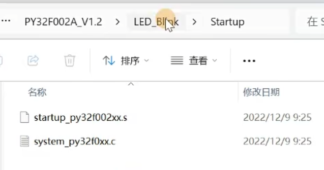
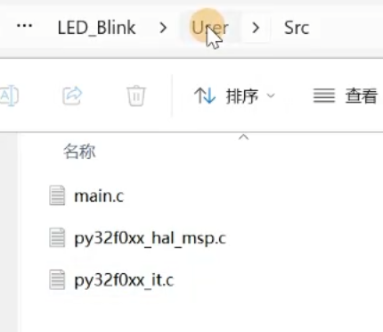
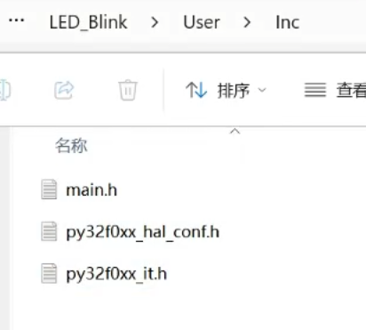
4. 新建工程，装载相关文件。  
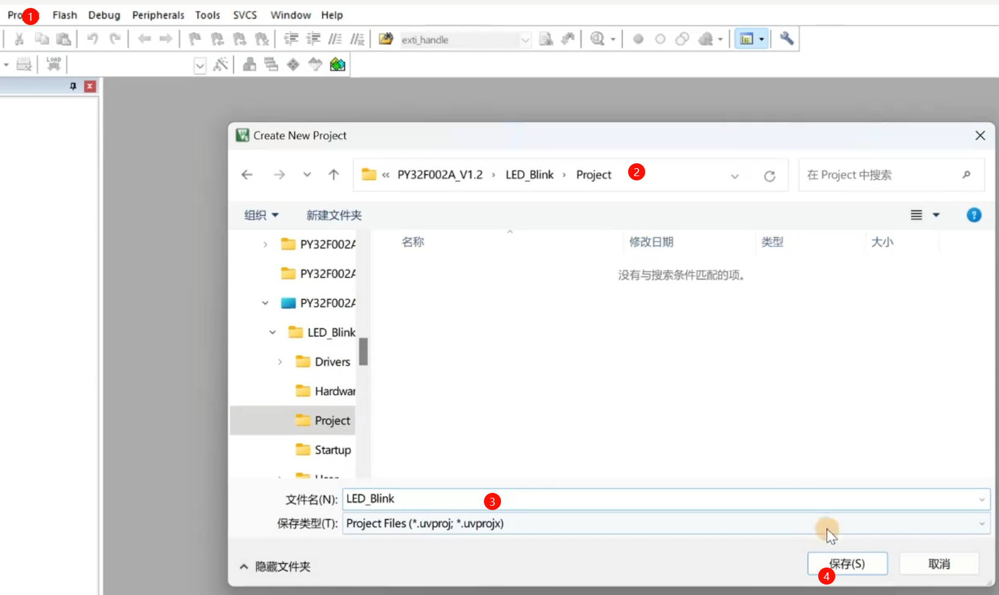
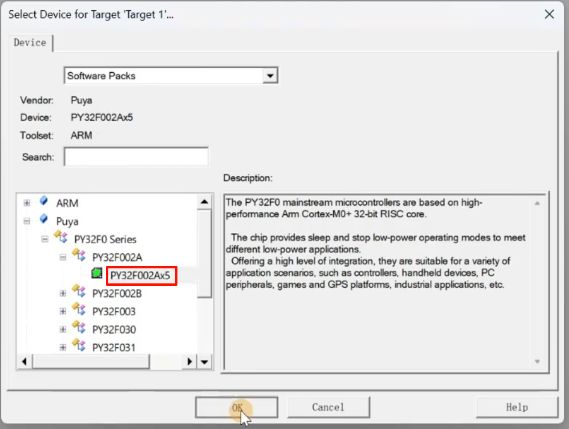
 
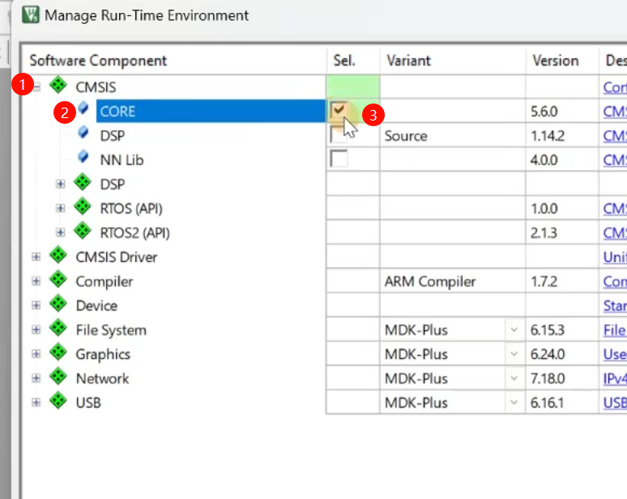

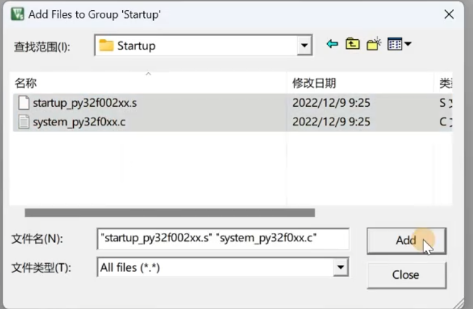
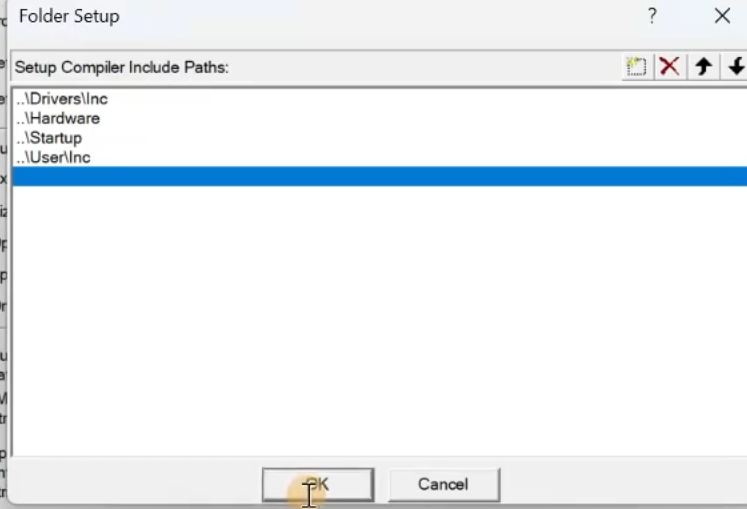
5. 设置相关参数。 
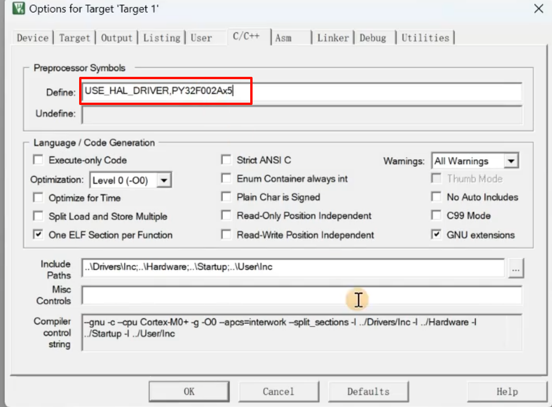
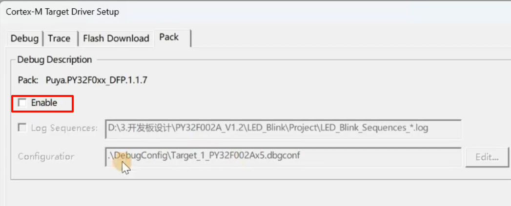
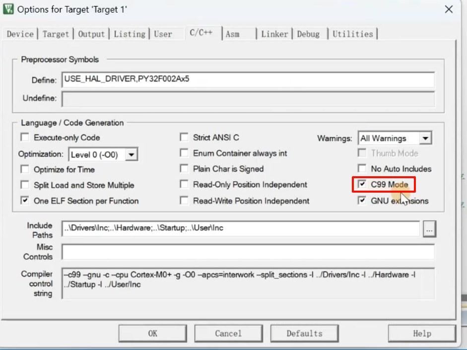
6. 编译、调试、下载。  
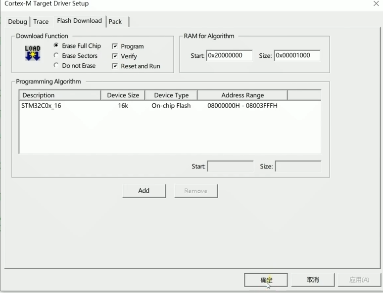

---
## SPI配置
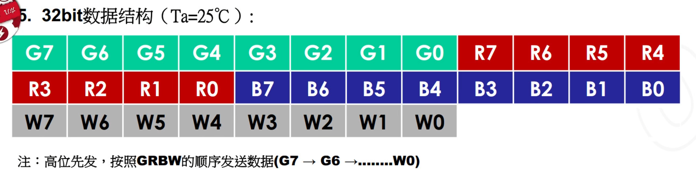
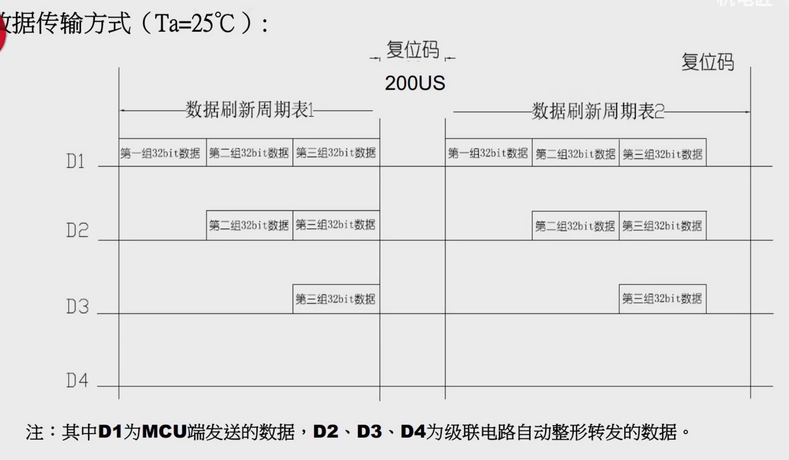
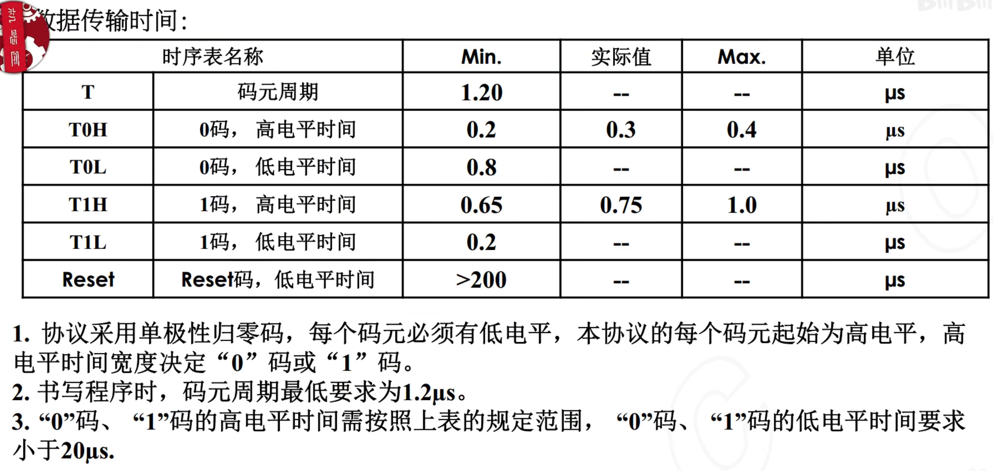
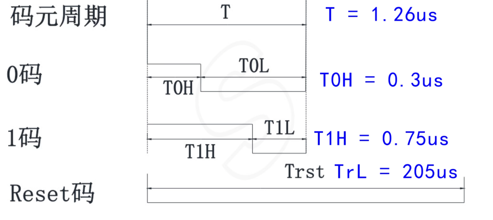

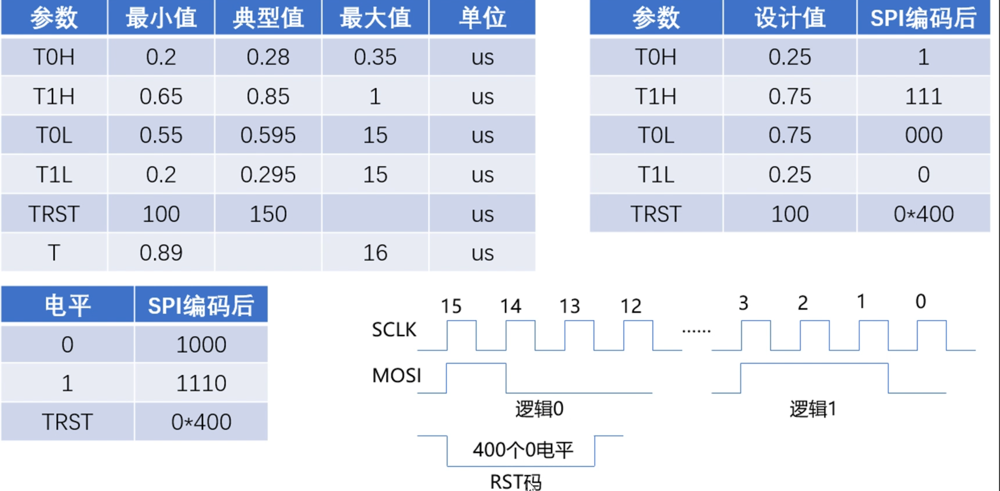
注：控制器发送数据“0"码高电平时间必须小于0.47us；数据“1"码高电平时间必须大于0.58us。  
SPI配置成7.5MHz(实在没办法，原理上是配置为6.4MHz) 
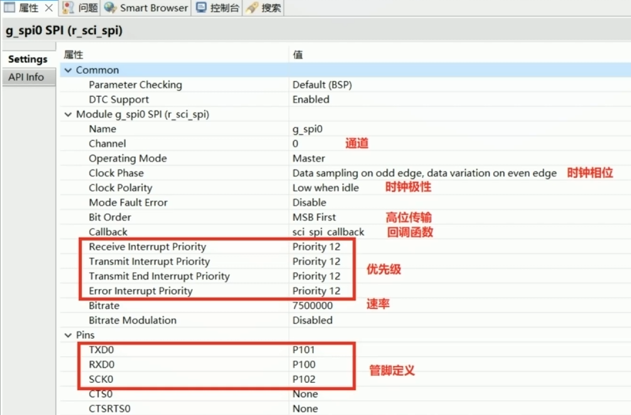  
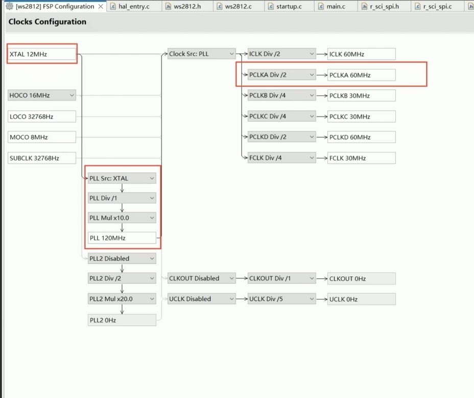  
11000000为一个零码，11111000为一个一码

# 基于SP002E产品写SPI四通道驱动  
按键功能要求参考002规格书    

原理就是将颜色数据存在数组然后通过PWM+DMA或者SPI发送出去。  
对于数组：  
彩虹颜色要将颜色数据值的大小进行变化。  
流动效果，需要将颜色数据在数组里面进行流动变化。  