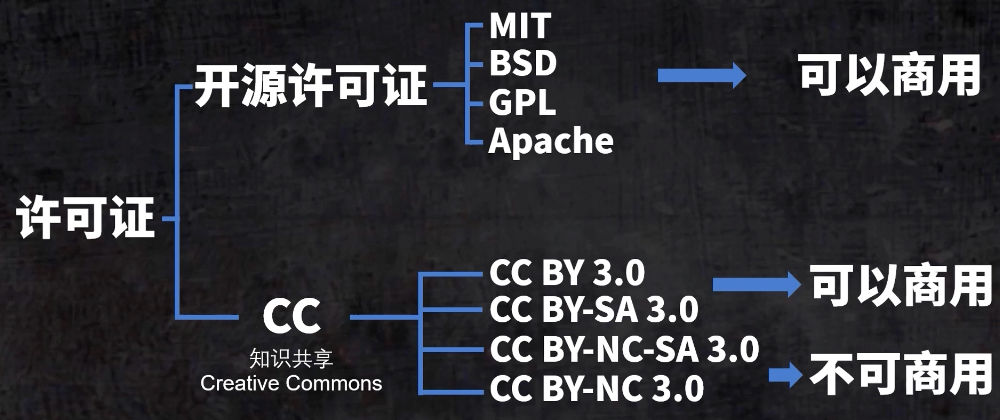

>笔记供自己快速回忆
# 3D_note
关于3D打印机以及3D建模的知识。
- [3D打印](3D_note/3D打印机知识.md)
# AD_note
是学习Altium Designer 24的笔记，包括一些常用操作和技巧，以及一些小工具的介绍。
- [AD笔记](AD_note/AD%E7%AC%94%E8%AE%B0.md)  
# Arduino_note
- [Arduino](Arduino/%E6%89%80%E6%9C%89%E5%9F%BA%E4%BA%8EArduino%E5%BC%80%E5%8F%91%E7%9A%84%E7%AC%94%E8%AE%B0.md) 
# Languages
代码语言类笔记。
- [C语言笔记](Languages/C_note/C.md)
- [LuatOS](Languages/Lua_note/LuatOS.md)
- [Python笔记](Languages/Python_note/Python.md)
# Chips
芯片开发类笔记。
- [Beken](Chips/Beken/Armino.md)  
- [GD32](Chips/GD32_note/GD32.md)  
- [AC6951C](Chips/JIELI_note/AC6951C.md)  
- [PHY6252](Chips/PHY_note/PHY6252.md)
- [PY32](Chips/PY32/PY32.md)
- [STM32WLE5](Chips/STM32_note/%E8%93%9D%E6%A1%A5%E6%9D%AF%E7%89%A9%E8%81%94%E7%BD%91.md)
- [keysking教程](Chips/STM32_note/keysking.md)
- [WS8100](Chips/WISE_note/WS8100.md)
# Circuit_note
是学习电路设计的一些笔记，包括元器件的特性以及电路设计的小技巧。
- [电路笔记](circuit_note/%E7%94%B5%E8%B7%AF%E7%AC%94%E8%AE%B0.md)  
- [芯片选型](circuit_note/%E8%8A%AF%E7%89%87%E9%80%89%E5%9E%8B.md)  
# IoT_note
学习一些物联网通信，平台以及协议的笔记。  
- [BLE](IoT_note/BLE/BLE.md)
- [DMX512](IoT_note/DMX512/DMX512.md)  
- [Edge AI](IoT_note/Edge%20AI/MicroPython.md)  
- [ESP-IDF](IoT_note/ESP-IDF/%E4%BB%A3%E7%A0%81.md)  
- [星闪](IoT_note/NearLink/%E6%98%9F%E9%97%AA%E6%8C%87%E4%BB%A4.md)
- [LED Strip Driver](IoT_note/LED%20Strip%20Driver/LED%20Strip%20Driver.md)
# Linux_note
学习系统编译，驱动开发，内核开发，Linux系统的一些笔记。 
- [Linux命令](Linux_note/%E7%BC%96%E8%AF%91%E7%B3%BB%E7%BB%9F%E7%AC%94%E8%AE%B0.md)  
- [Linux移植](Linux_note/移植系统笔记.md)
# LVGL_note
是学习LVGL的一些笔记，包括一些常用操作和技巧，以及一些小工具的介绍。
- [LVGL笔记](LVGL_note/LVGL%E7%AC%94%E8%AE%B0.md)
# Node-RED_note
Homeassistant，Node-RED以及ThingsBoard的一些笔记。  
- [Homeassistant笔记](Node-RED_note/Homeassistant笔记.md)  
- [Node-RED笔记](Node-RED_note/Node-RED笔记.md)
# ROS2_note
学习ROS2的一些笔记。包括MicroROS的运行，ROS2的一些基础概念。
- [ROS2-MicroROS](ROS2_note/FishBot.md)
# RTOS_note
FreeRTOS，RT-Thread，uCOS-III，lwIP，μITRON，等RTOS的一些笔记。
- [RTOS](RTOS_note/freeRTOS.md)
# AI_note
学习AI相关知识，包括MCP、Skills以及Claude Code实用教程。
- [Claude Code](AI_note/Claude%20Code.md)
- [OpenClaw](AI_note/OpenClaw.md)
# 开源许可

