# MicroROSCar快速入门
1. 将开发板插入TypeC线  
2. 找到固件，右击选择复制文件地址   
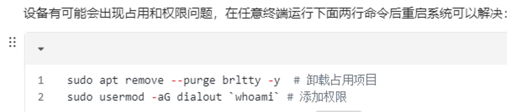  
3. 打开烧录工具MicroROSCar ConfigTool.v1.0.0.alpha.win.exe，刷新端口并粘贴到固件地址栏，点击烧录  
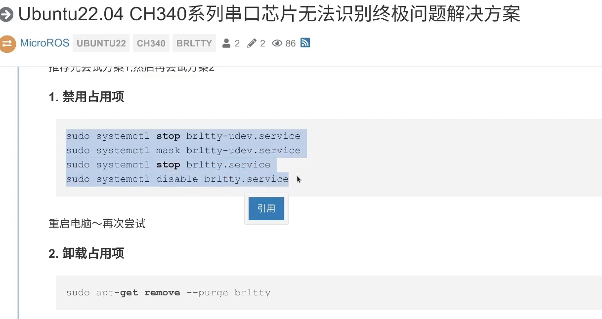  
出现烧录成功提示后配置设备,点击重新扫描配置  
4. 配置网络，我们需要配置wifi_ssid和wifi_pswd ，即wifi的名字和密码。  
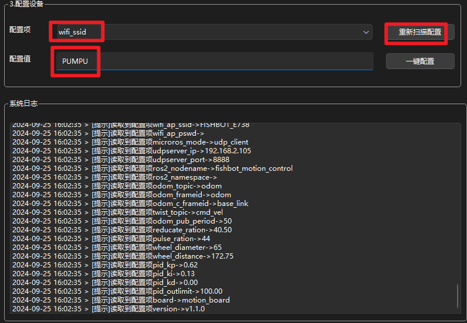  
wifi名称为PUMPU，所以填写PUMPU，接着点击一键配置即可，配置成功下方会有提示。  
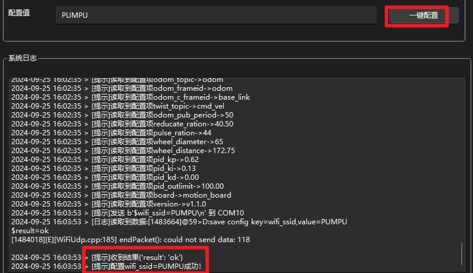  
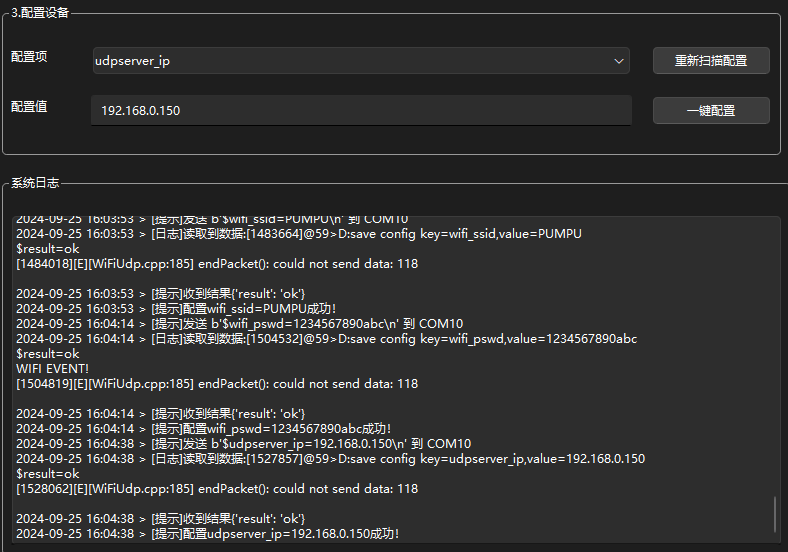  
5. 打开配套的虚拟机Ubuntu_22.04_LTS(ROS2)，密码：123456  
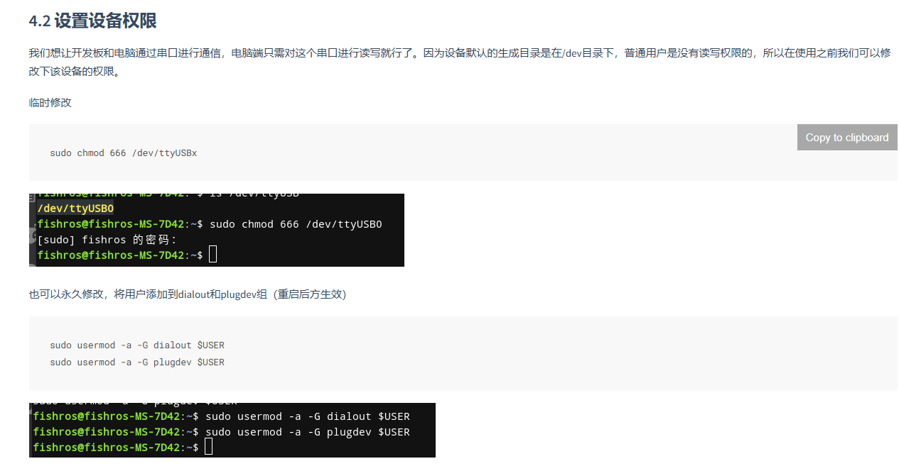  
6. 打开终端，输入`ip -4 a | grep inet`  
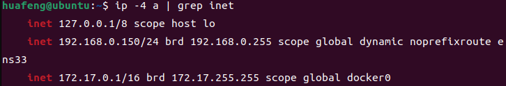
   >一般可以看到多个网卡的，此时可以忽略172(docker)和127(本地)开头的ip地址，剩下的一般就是我们要的ip地址，比如这里的就是192.168.2.105    
7. 接着配置主机IP，选择udpserver_ip，填写刚刚获取到的ip地址，点击一键配置即可，配置成功下方会有提示。  
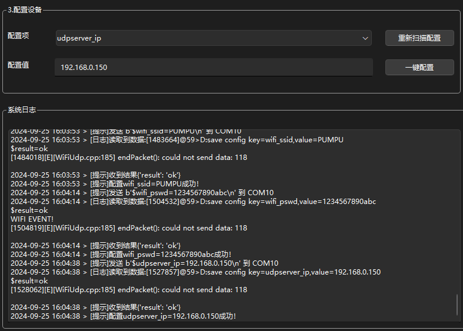    
8. 按下复位键，屏幕显示设备IP，此时说明已经连接成功   
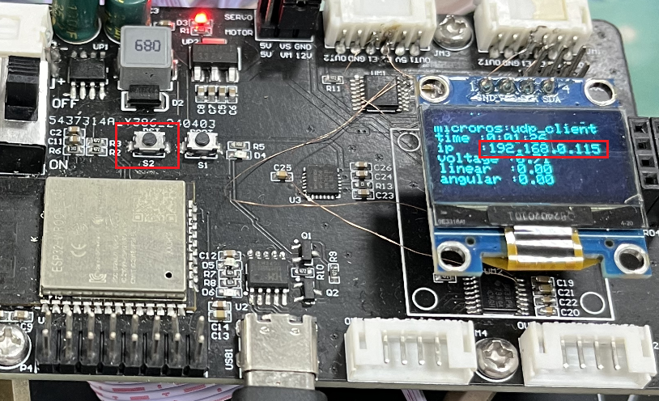  
>确保安装了ROS以及Docker,下面是一键安装指令  
>wget http://fishros.com/install -O fishros && . fishros

9. 启动MicroROS服务,终端输入以下命令  
    
        docker run -it --rm -v /dev:/dev -v /dev/shm:/dev/shm --privileged --net=host microros/micro-ros-agent:$ROS_DISTRO udp4 --port 8888 -v6  

    如因为网路问题无法启动可以尝试国内代理指令：  

        docker run -it --rm -v /dev:/dev -v /dev/shm:/dev/shm --privileged --net=host fishros.org/microros/micro-ros-agent:$ROS_DISTRO udp4 --port 8888 -v6  
    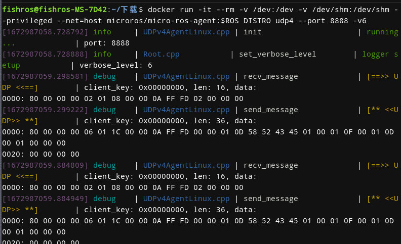  
    正常你将看到终端不断有数据提示，表示正常通信上了
10. 测试键盘控制,前面终端不要关闭，再打开一个终端，输入以下命令  
`ros2 run teleop_twist_keyboard teleop_twist_keyboard`  

    接着按x按键调节下线速度，降低到0.1左右，防止一下子太快飞出去。  

    接着尝试点击j按钮，机器人将逆时针转动,点击k或者空格，机器人将停在原地。  

    根据键盘提示，你可以尝试前进后退，左转右转等命令。  
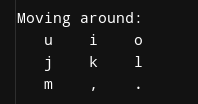  
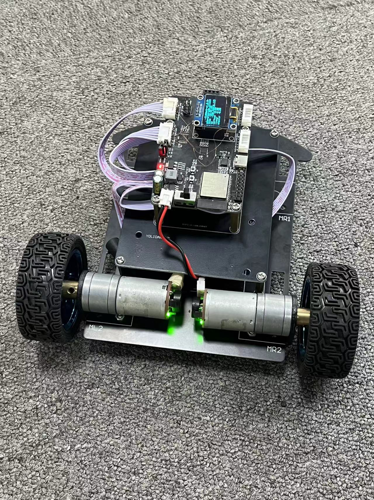  
11. 我们的小车是带编码器的，可以实时输出里程计数据，使用指令  
   `ros2 topic echo /odom`就可以看到实时的机器人位置信息。  
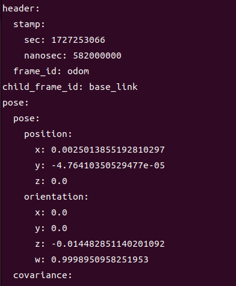

# ROS2
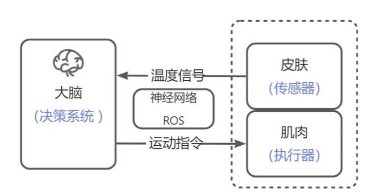  
核心是通讯（稳定、安全、实时的通讯能力）
ROS2文档：
http://docs.ros.org/en/humble/Releases.html

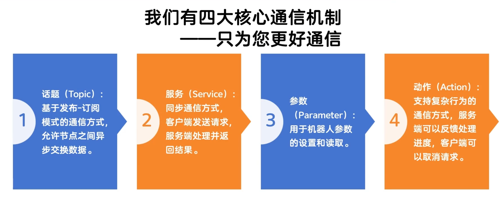
## 右手法则

>我们开发板的Z轴朝上，X轴朝前，此时Y轴应该朝左。接着摊开右手手掌，用大拇指朝向轴的方向，比如朝向X轴，然后握起手掌，那么你握的方向就是正方向。
# ROS2-MicroROS
通讯协议依赖于Agent  

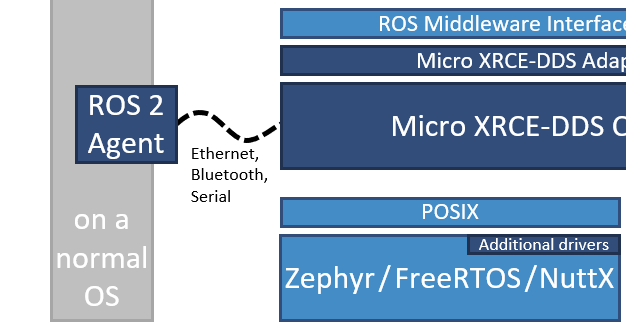
>所谓Agen其实就是一个代理，微控制器可以通过串口，蓝牙、以太网、Wifi等多种协议将数据传递给Agent，Agent再将其转换成ROS2的话题等数据，以此完成通信。  


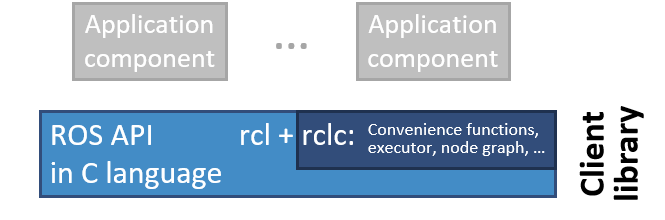  

通过RCLC-API调用MicroROS

串口运行Agent服务

    sudo docker run -it --rm -v /dev:/dev -v /dev/shm:/dev/shm --privileged --net=host microros/micro-ros-agent:$ROS_DISTRO serial --dev /dev/ttyUSB0 -v6
UDP启动Agent服务  

    sudo docker run -it --rm -v /dev:/dev -v /dev/shm:/dev/shm --privileged --net=host microros/micro-ros-agent:$ROS_DISTRO udp4 --port 8888 -v6
### 服务通讯
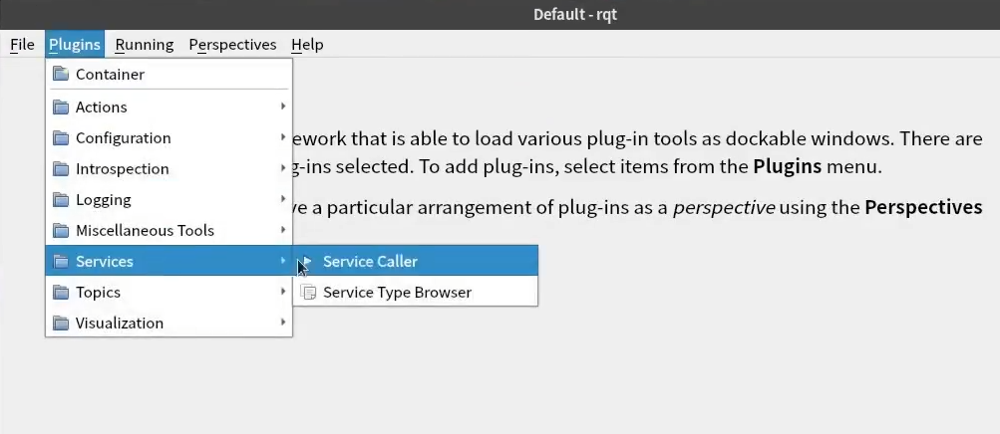  
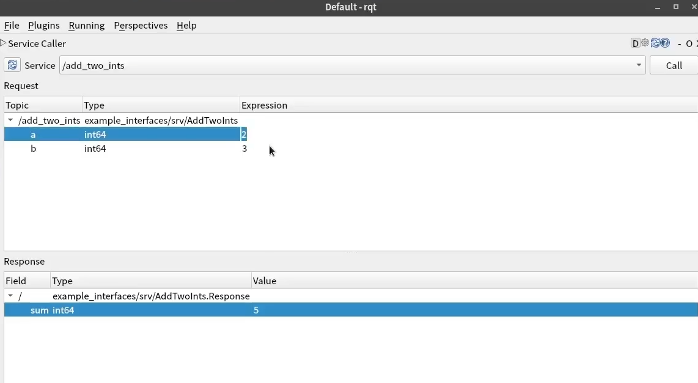
## 使用FishBotROS2OS随身系统  
开机时按下F8键（F11）进入BootMenu启动设备选择界面  
选择ubuntu开头的ROS2GO盘回车即可进入系统
密码fish进入  
等待脚本完成输入fishinstall  
即可使用ros2命令  
## 使用虚拟机Ubuntu22.04
安装VsCode  
安装PIO（仅适用Ubuntu22.04系统，非该系统请直接跳过）  
安装Docker  

    wget http://fishros.com/install -O fishros && . fishros  
    或
    wget http://fishros.com/install -O fishros && bash fishros 

## 使用platformio
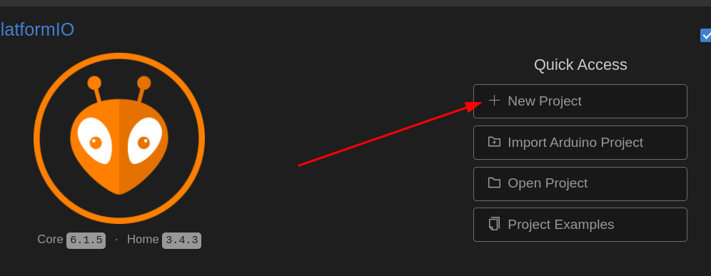

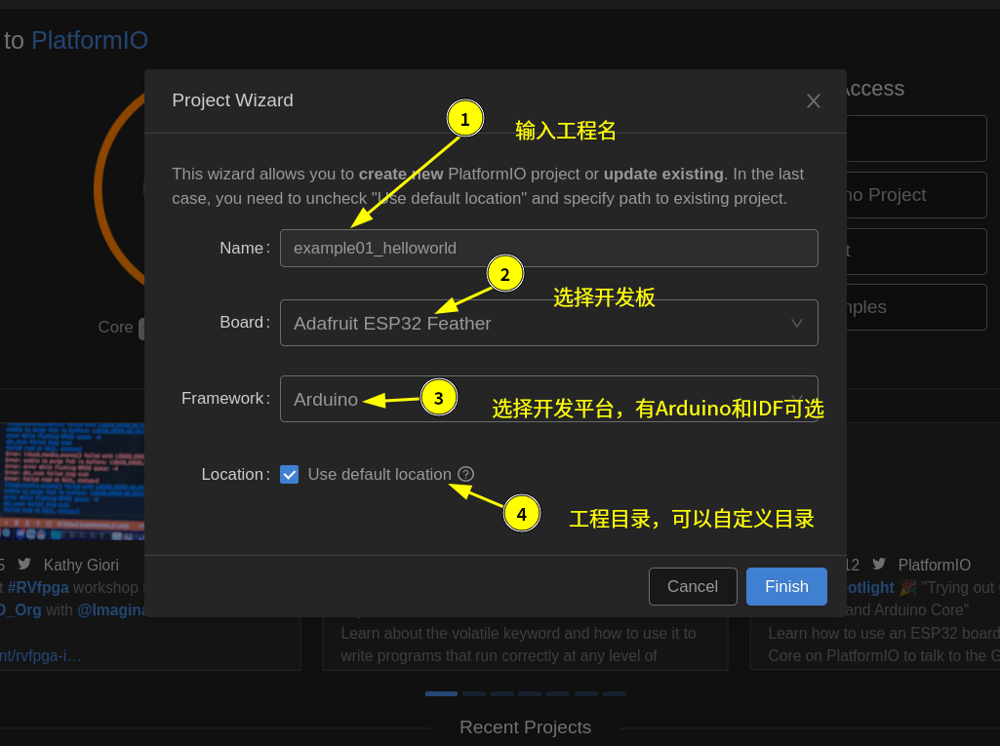
四步新建工程  
1. 输入工程名 example01_helloworld  
2. 选择开发板，这里选择Adafruit ESP32 Feather  
3. 选择开发框架，这里我们用Arduino，PIO还支持IDF（IoT Development FrameWork） 
4.  开发位置可以选择默认的位置，也可以自定义位置  
   
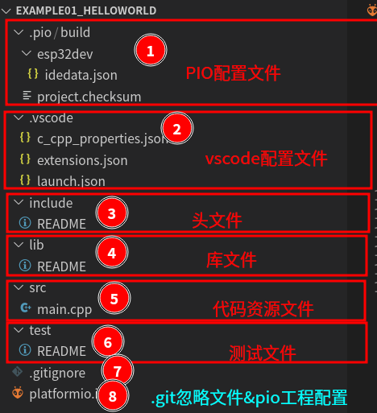

### platformio.ini文件设置
将单片机的主频提高到240MHZ的主频。  
    board_build.f_cpu = 240000000L  
通过修改配置文件，可以修改Serial Monitor的默认波特率。  
    monitor_speed = 115200
```
[env:featheresp32]
platform = espressif32
board = featheresp32
framework = arduino
board_microros_transport = wifi
board_build.f_cpu = 240000000L
monitor_speed = 115200
lib_deps = 
	adafruit/Adafruit SSD1306@^2.5.7
	adafruit/Adafruit GFX Library @ ^1.11.10
	https://github.com/rfetick/MPU6050_light.git
	adafruit/Adafruit BusIO@^1.16.1
    SPI
    Wire
	https://gitee.com/ohhuo/micro_ros_platformio.git
	paulstoffregen/Time@^1.6.1
```
## 加载库的三种方法：
1. 在PlatformIO左侧的项目管理器中点击Libraries，搜索你想要的库，点击Add to Project加入到你的工程中。
2. 通过GIT地址安装。直接在platformio.ini文件中添加lib_deps参数，指定库的GIT地址。  
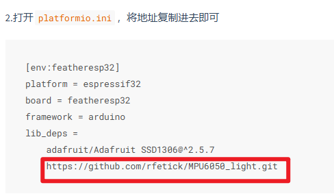  
3. 手动克隆到lib目录  
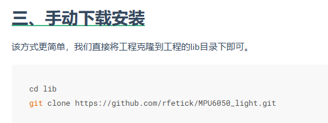  
## 运行第一个机器人
需要三个终端分别运行  

    ros2 run turtlesim turtlesim_node  
    ros2 run turtlesim turtle_teleop_key  
    rqt  
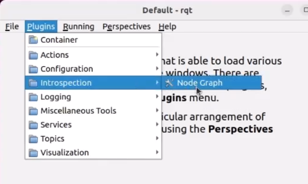  
节点关系：  
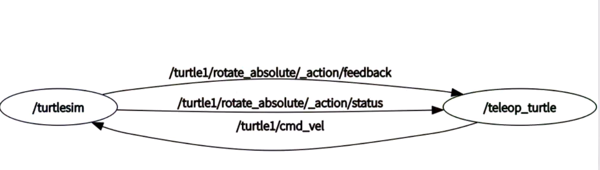


## 其他知识
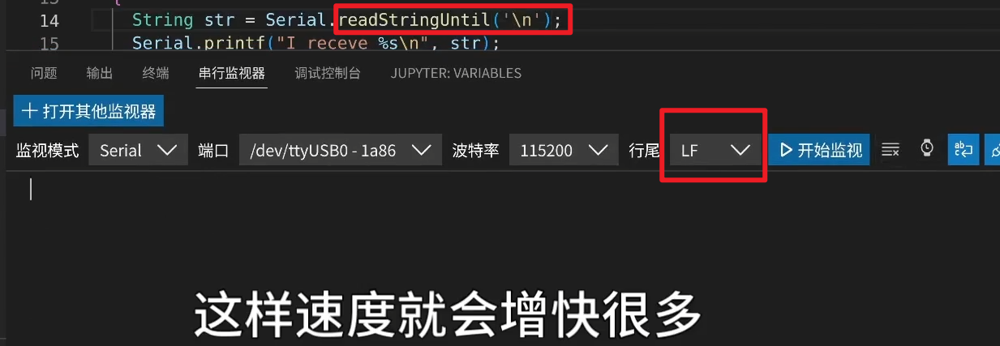  

使用`Serial.readString()`方法读取数据时，串口接收是有个超时时间的,使用`Serial.readStringUntil()`检测到\n立刻返回数据。
```
lsusb //查看端口号
ls /dev/ttyUSB* //查看端口号
whoami //查看当前用户名
whereis ros2    //查找命令所在路径
history //查看历史命令
sudo dpkg -i ./你的软件名称.dab //从网上下载deb安装包后使用命令安装
  
printenv  //列出所有环境变量的列表
| grep对前面的进行过滤  
printenv | grep 你要找的文字名称  
echo $AMENT_PREFIX_PATH  //查看ROS2的路径  
export PATH=/usr/local/bin//临时修改环境变量

```
### CMake知识
#### 创建CMakeLists.txt文件，在CMakeLists.txt文件中添加内容：
```
// 设置CMake的最低版本要求为3.8
cmake_minimum_required(VERSION 3.8)
// 定义项目名称为HelloWorld
project(HelloWorld)
// 添加可执行文件learn_cmake，源文件为hello_world.cpp
add_executable(learn_cmake hello_world.cpp)
```
在新建.c文件编写代码时候，IDE会自动添加CMakeLists.txt文件中，使用的方式是
```c
add_executable(${CMAKE_PROJECT_NAME}
xxx.c
APP/hello_world.c
)
```
最好放到target_sources 中，如下：
```c
target_sources(${CMAKE_PROJECT_NAME} PRIVATE
xxx.c
APP/hello_world.c
)
```
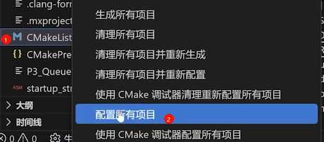
#### 然后在终端输入命令：cmake生成Makefile文件。再使用make命令编译。
    cmake .
    make
    ./learn_cmake
### Python打包知识
#### Linux打包：
    pip install pyinstaller
    pyinstaller -F hello.py //-F表示打包成一个可执行文件
    pyinstaller release_linux.spec

    # 使用PyInstaller将Python脚本打包成一个可执行文件
    # --onefile：将所有文件打包成一个可执行文件
    # --add-data：添加额外的数据文件，格式为"文件路径:目标路径"
    # "path/to/main.ui:ui"：将main.ui文件添加到ui目录下
    # main.py：要打包的Python脚本
    示例:pyinstaller --onefile --add-data "path/to/main.ui:ui" main.py
    Linux打包windows
    pyinstaller --onefile --target-arch=64bit release_win.spec
#### windows打包：

    
    # 创建虚拟环境
    python -m venv venv
    # 激活虚拟环境
    .\venv\Scripts\Activate.ps1
    # 安装pyinstaller
    pip install pyinstaller
    # 安装requests
    pip install requests
    # 安装pyyaml
    pip install pyyaml
    # 安装pyserial
    pip install pyserial
    # 安装PyQt6
    pip install PyQt6
    # 使用pyinstaller打包
    pyinstaller release_win.spec

在打包项目时，PyInstaller 会生成一个 .spec 文件。打开这个文件并编辑其中的 datas 部分。  

## ROS2基础入门
### Python示例程序
`ros2 node list //查看当前运行的节点`  

修改调试信息  
```
export RCUTILS_CONSOLE_OUTPUT_FORMAT=[{function_name}:{line_number}]:{message}
```
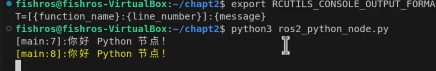

查看节点  
`ros2 node list`  
查看节点信息  
`ros2 node info /cpp_node`
## 问题汇总
### 网络问题
虚拟机选桥接（直接连接到路由器）需要处于同一个子网

### 串口占用问题
    sudo apt remove --purge brltty -y #卸载占用项目
并重启电脑
### 串口USB永久权限设置  

    #单次生效，立即生效
    sudo chmod 666 /dev/ttyUSB0
    #给当前用户添加永久权限，重启生效
    sudo usermod -aG dialout `whoami`
    sudo usermod -aG plugdev `whoami`
  


### Ubuntu22.04 CH340系列串口芯片无法识别终极问题解决方案
1. 禁用占用项
```
sudo systemctl stop brltty-udev.service
sudo systemctl mask brltty-udev.service
sudo systemctl stop brltty.service
sudo systemctl disable brltty.service
```
重启电脑~再次尝试  
1. 卸载占用项
```
sudo apt-get remove --purge brltty
```