## 置顶链接
[GD32移植FreeRTOS](https://geekdaxue.co/read/icheima@gd32/prd695920sk3p9sh#bdtkv1)  
# 任务间的四种交互方式  


消息队列  
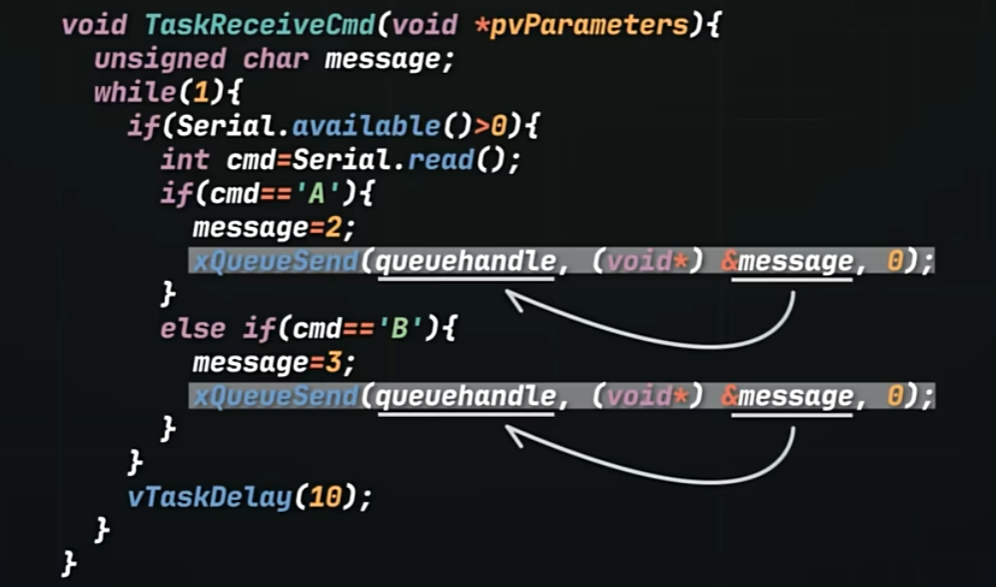  

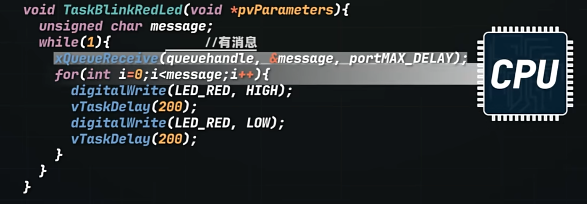

# 移植FreeRTOS
## GD32C231C移植
1. 下载FreeRTOS源码包并解压。下载地址为: https://github.com/FreeRTOS/FreeRTOS/releases  
2. 找个可以编译通过的你需要的例程。  
确保以下配置信息的正确性：  
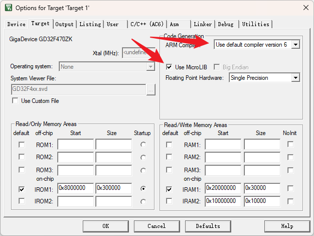  
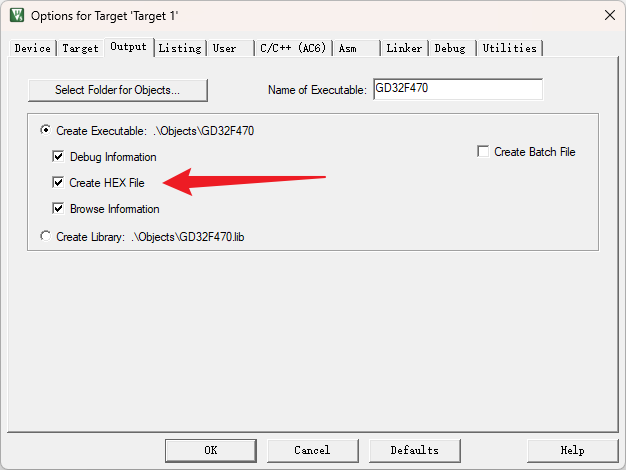  
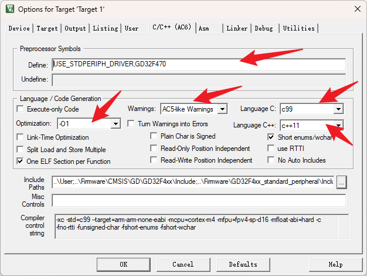  
3. 进入FreeRTOS/Source目录。此目录就是我们要移植的源码。  
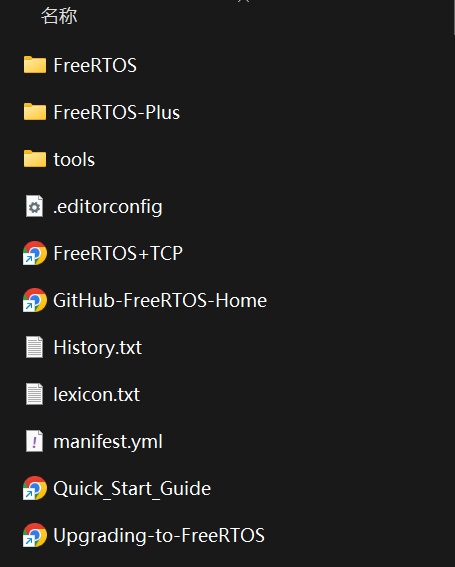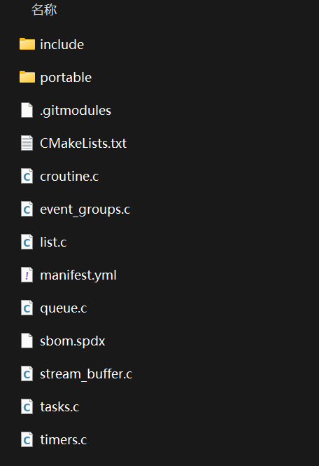  
4. 在你工程目录下，新建一个文件夹FreeRTOS,将以上源码拷贝到这个文件夹中。  
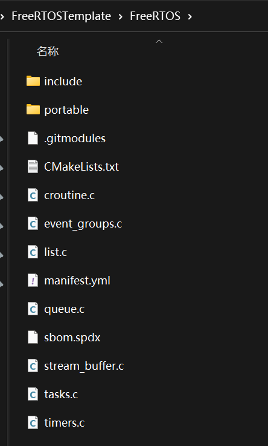  
5. 打开portable目录并删除其他不必要的文件。只保留GCC和MemManag目录  
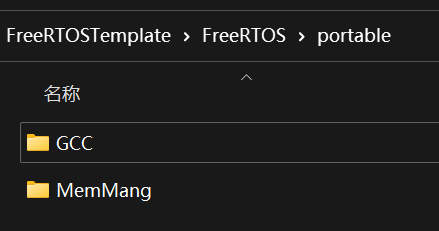  
6. 新建两个Group：FreeRTOS_Core和FreeRTOS_Port  
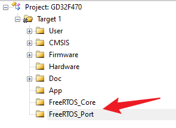  

7. FreeRTOS_Core添加源码。源码为FreeRTOS根目录下的c文件  
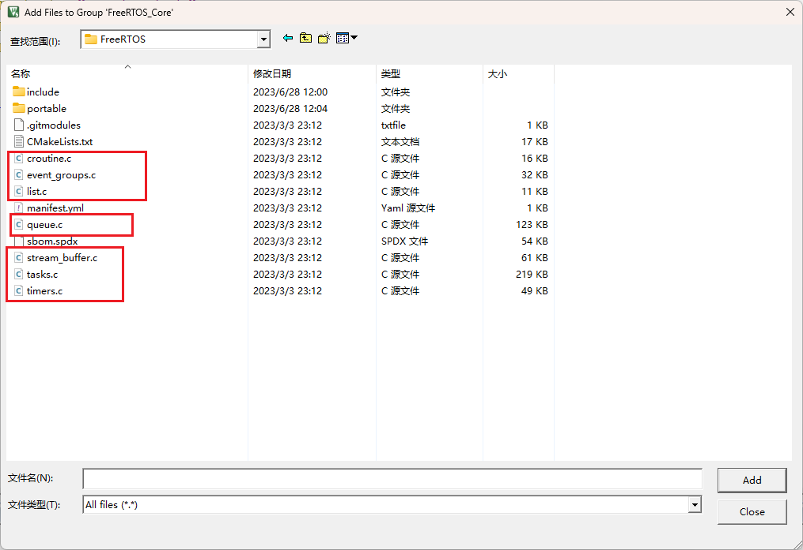  
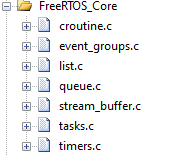
8. FreeRTOS_Port添加源码。源码为FreeRTOS/portable/MemMang下的heap_4.c。源码为FreeRTOS/portable/GCC/ARM_CM4F下的port.c以及portasm.c  
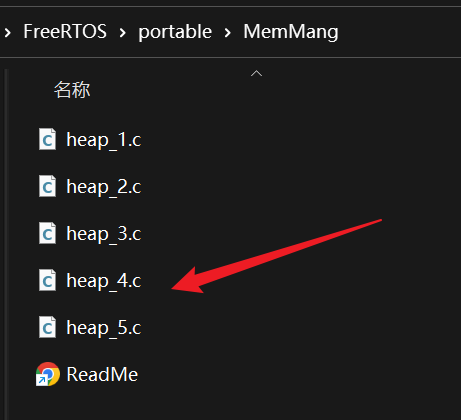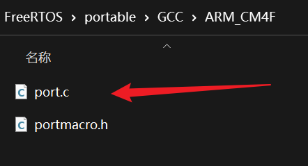  
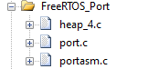  
9. 添加头文件支持。将FreeRTOS/include和FreeRTOS/portable/GCC/ARM_CM4F添加到头文件依赖中。  
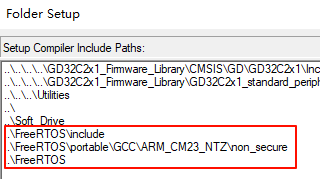  
10. 来到FreeRTOS源码目录中，找到FreeRTOSv202411.00\FreeRTOS\Demo\CORTEX_MPU_M23_Nuvoton_NuMaker_PFM_M2351_IAR_GCC\Projects_NTZ\Keil\Config目录中的FreeRTOSConfig.h文件，进行拷贝。将FreeRTOSConfig.h文件拷贝到项目目录中的FreeRTOS目录下  
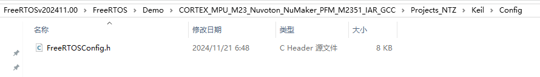  
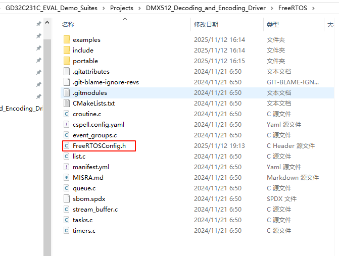  
11. 添加SYS_SUPPORT_OS宏定义  
```c
#ifndef SYS_SUPPORT_OS
/*!
    \brief      this function handles SVC exception
    \param[in]  none
    \param[out] none
    \retval     none
*/
void SVC_Handler(void)
{
    /* if SVC exception occurs, go to infinite loop */
    while(1) {
    }
}

/*!
    \brief      this function handles PendSV exception
    \param[in]  none
    \param[out] none
    \retval     none
*/
void PendSV_Handler(void)
{
    /* if PendSV exception occurs, go to infinite loop */
    while(1) {
    }
}

/*!
    \brief      this function handles SysTick exception
    \param[in]  none
    \param[out] none
    \retval     none
*/
void SysTick_Handler(void)
{
    delay_decrement();
}
#endif
```
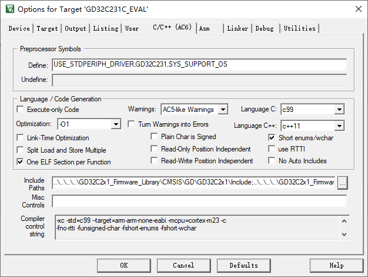  
12.  Systick硬件delay,修改systick.c源码，修改如下  
```c
#ifndef SYS_SUPPORT_OS
void delay_1ms(uint32_t count)
{
    delay = count;
    while(0U != delay) {
    }
}
void delay_decrement(void)
{
    if(0U != delay) {
        delay--;
    }
}
#else
void delay_1us(uint32_t count) {
        uint32_t ticks;
        uint32_t told, tnow, reload, tcnt = 0;
        reload = SysTick->LOAD;
        ticks = count * (SystemCoreClock / 1000000);
        told = SysTick->VAL;
        while(1) {
                tnow=SysTick->VAL;
                if(tnow != told) {
                        if(tnow<told) tcnt+=told-tnow;
                        else tcnt+=reload-tnow+told;
                        told=tnow;
                        if(tcnt>=ticks)break;
                }
        }
}
void delay_1ms(uint32_t count)
{
    uint32_t i;
    for (i=0; i<count; i++)
    {
        delay_1us(1000);
    }
}
#endif
```
注意这里添加了delay_1us实现方式，要使用请在systick.h声明。
>若发现无法进行多任务运行。请删除上面的修改，改为如下代码
```c
#ifdef SYS_SUPPORT_OS
#include "FreeRTOS.h"
#include "task.h"
#endif
```
并改写delay_1ms函数
```c
void delay_1ms(uint32_t count)
{
#ifdef SYS_SUPPORT_OS
    vTaskDelay(pdMS_TO_TICKS(count));
#else
    delay = count;
    while(0U != delay) {}
#endif
}
```


13. 接着在工程main.c中添加如下代码
```c
#include "FreeRTOS.h"
#include "task.h"
#include "timers.h"

#ifndef SYS_SUPPORT_OS
    /* configure the systick */
    systick_config();
#endif

#if (configCHECK_FOR_STACK_OVERFLOW > 0)
/* FreeRTOS 应用栈溢出钩子函数实现 - 当检测到栈溢出时调用 */
void vApplicationStackOverflowHook(TaskHandle_t xTask, char *pcTaskName)
{
    /* 禁用中断以防止错误扩大 */
    taskDISABLE_INTERRUPTS();
    printf("栈溢出错误！任务名称：%s\n", pcTaskName); // 打印溢出任务名称
    /* 无限循环 - 栈溢出属于严重错误，需排查修复 */
    for( ;; );
}
#endif

#if (configSUPPORT_STATIC_ALLOCATION == 1)
/* 空闲任务内存分配函数 - 当 configSUPPORT_STATIC_ALLOCATION 配置为 1 时必需实现 */
void vApplicationGetIdleTaskMemory(StaticTask_t **ppxIdleTaskTCBBuffer,
                                   StackType_t **ppxIdleTaskStackBuffer,
                                   uint32_t *pulIdleTaskStackSize)
{
    /* 定义空闲任务的静态内存（TCB + 栈） */
    static StaticTask_t xIdleTaskTCB;          // 空闲任务控制块（TCB）
    static StackType_t uxIdleTaskStack[configMINIMAL_STACK_SIZE];  // 空闲任务栈
    
    /* 将静态内存地址传递给 FreeRTOS 内核 */
    *ppxIdleTaskTCBBuffer = &xIdleTaskTCB;          // 传递TCB缓冲区地址
    *ppxIdleTaskStackBuffer = uxIdleTaskStack;      // 传递栈缓冲区地址
    *pulIdleTaskStackSize = configMINIMAL_STACK_SIZE;  // 传递栈大小（单位：栈元素个数）
}

/* 定时器任务内存分配函数 - 当 configSUPPORT_STATIC_ALLOCATION 配置为 1 时必需实现 */
void vApplicationGetTimerTaskMemory(StaticTask_t **ppxTimerTaskTCBBuffer,
                                    StackType_t **ppxTimerTaskStackBuffer,
                                    uint32_t *pulTimerTaskStackSize)
{
    /* 定义定时器任务的静态内存（TCB + 栈） */
    static StaticTask_t xTimerTaskTCB;          // 定时器任务控制块（TCB）
    static StackType_t uxTimerTaskStack[configTIMER_TASK_STACK_DEPTH];  // 定时器任务栈
    
    /* 将静态内存地址传递给 FreeRTOS 内核 */
    *ppxTimerTaskTCBBuffer = &xTimerTaskTCB;          // 传递TCB缓冲区地址
    *ppxTimerTaskStackBuffer = uxTimerTaskStack;      // 传递栈缓冲区地址
    *pulTimerTaskStackSize = configTIMER_TASK_STACK_DEPTH;  // 传递栈大小（单位：栈元素个数）
}
#endif
```

14. 至此，FreeRTOS移植完成，可以进行编译运行了。

## keysking教程
[keysking的FreeRTOS教程文档](https://docs.keysking.com/docs/stm32/freertos/cubeConfig)  
## 第一个任务
## 任务切换
## 任务状态
## 优先级与抢占式调度
## 队列
队列是为了解决全局变量中的事件丢失与事件重复。
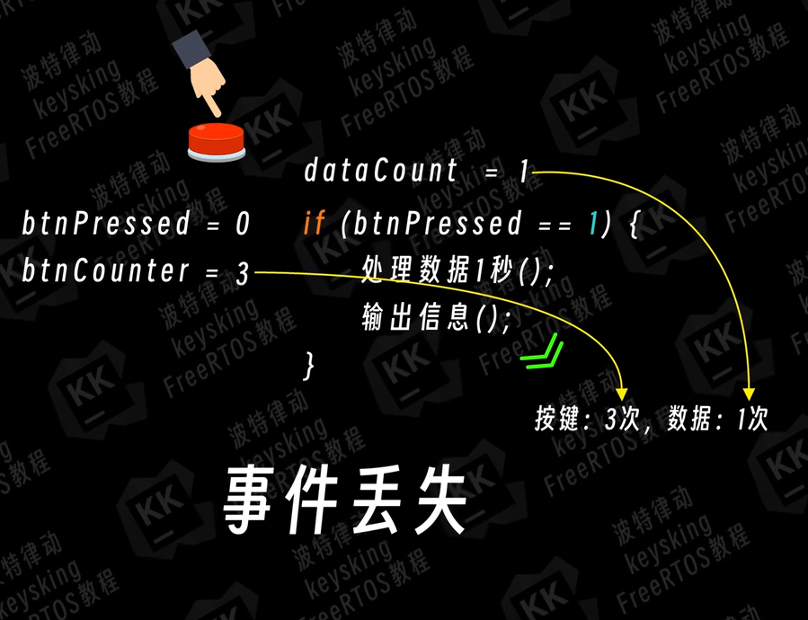
事件丢失：数据处理任务耗时较久，在快速按下按键时，按键任务多次记录多次改变全局变量，但数据处理任务只处理了一次。
事件重复：数据处理任务耗时较久，在长按按下按键时，全局变量依然是处于按下状态值，导致数据处理任务重复处理。
队列在没有数据需要处理的时候，消费者无需像全局变量方案一样一遍又一遍检查是否有新数据需要处理。会将自己置于阻塞态，不占用CPU资源，
先创建队列再创建任务，任务中使用队列接收数据。
```c
BtnQueueHandLe = osMessageQueueNew(16, sizeof(uint32_t), &BtnQueue_attributes);
```
在生产者任务中，产生要传递的数据后调用osMessageQueuePut,将数据传入队列
```c

void Task(void *argument){
    uint32_t btnCount = 0;
    while(1){
        btnCount++;
        osMessageQueuePut(BtnQueueHandLe, &btnCount, 0, osWaitForever);//队列满后永久阻塞灯带，直到队列有空闲位置
    }
}
```
在消费者任务中，调用osMessageQueueGet从队列中接收数据，取出数据。
```c
void Task(void *argument){
    uint32_t btnCount = 0;
    while(1){
        osMessageQueueGet(BtnQueueHandLe, &btnCount, NULL, osWaitForever);//没有数据就阻塞，必须取到数据后才会向下执行。
       }
}
```
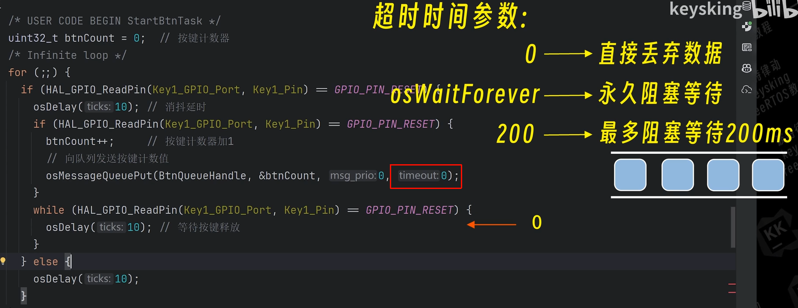
### 复杂数据、中断发送、多对一通信
#### 如何在队列中通过指针传递复杂数据
对于结构体数据往往比较大，往往不直接传递，而是传递结构体指针。

freertos的内存申请函数：`pvPortMalloc`释放函数：`vPortFree`
>malloc申请到的内存来自程序默认的堆空间，而pvPortMalloc申请的则是来自由FreeRTOS管理的专用堆空间
>在生产者申请的内存，在消费者一定要释放掉。

- 在中断中发送数据到队列
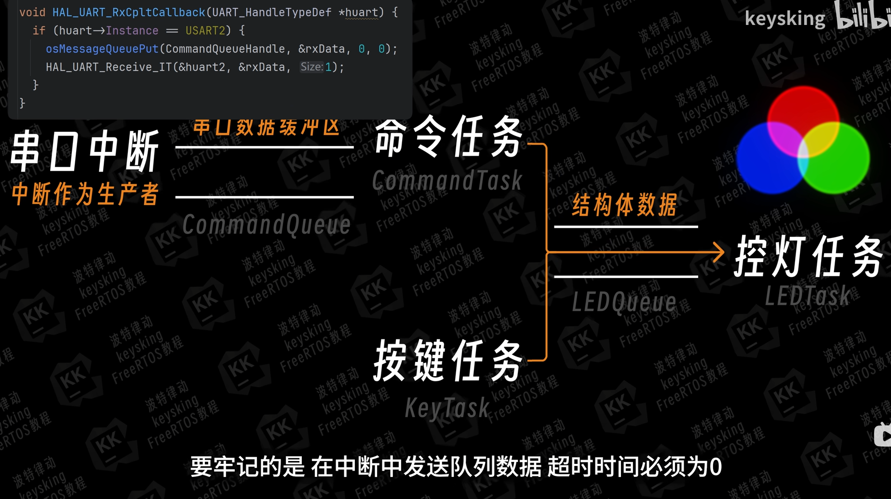

- 使用队列作为串口的数据缓冲区
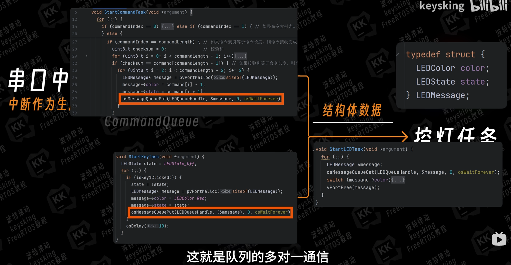