# keysking的STM32教程
[文档](https://docs.keysking.com/)  
[串口助手](https://serial.keysking.com)  
[WS2812上位机](https://ws2812.keysking.com)
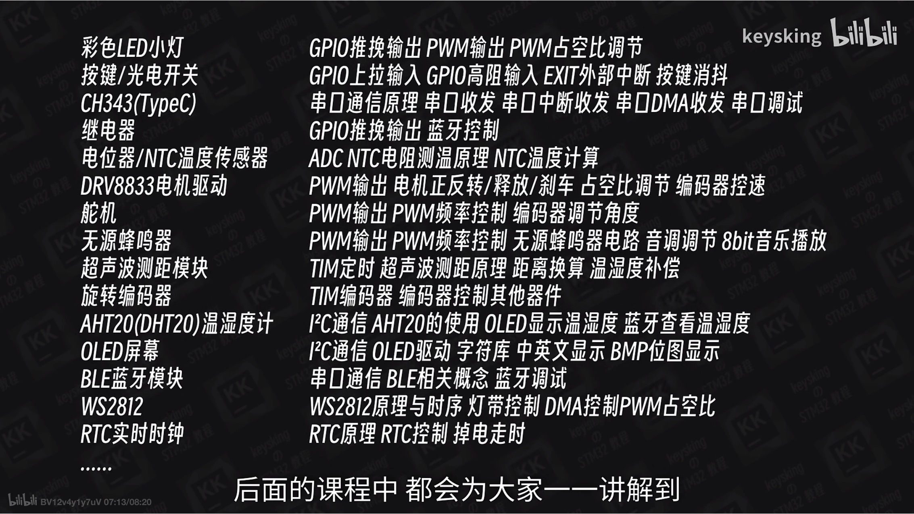
## 安装STM32CubeIDE
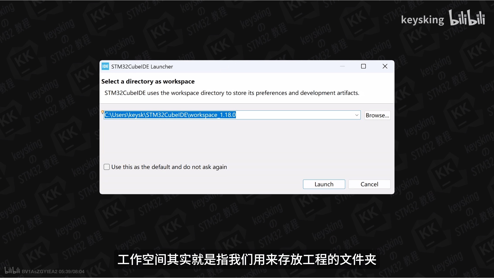

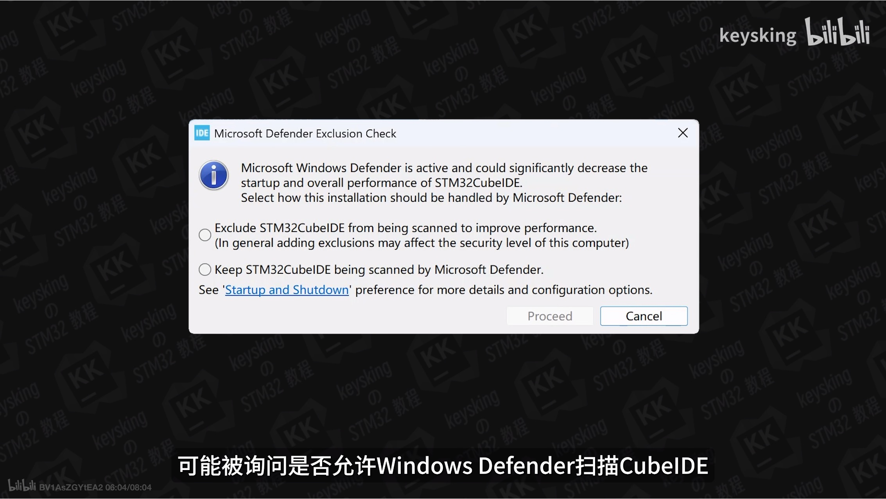

.JPG)
将 STM32CubeIDE 排除在扫描范围之外以提升性能。（一般来说，添加排除项可能会影响这台计算机的安全级别 ）  
让 STM32CubeIDE 继续接受微软 Defender 的扫描。  
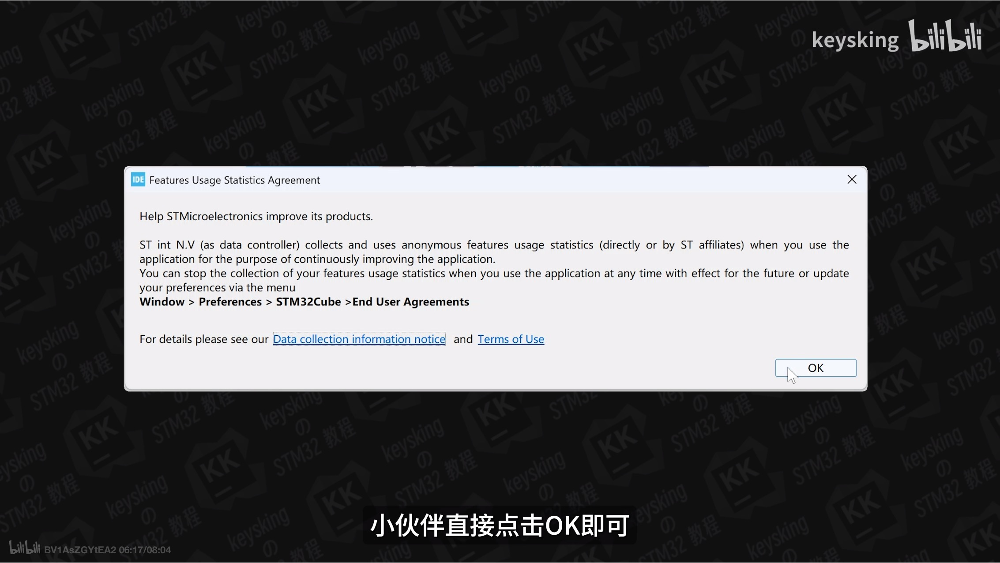
点击同意助力意法半导体改进产品。  
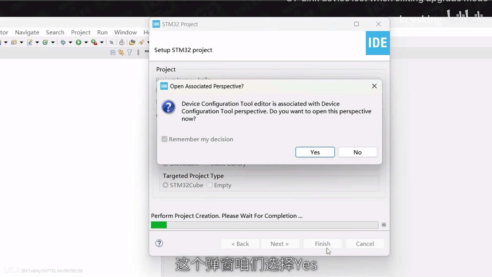
打开关联透视图？  
.JPG)
勾选不在提示的选项会将记忆的选项保存下来，保存在工作空间里面metadate文件夹  
.JPG)

.JPG)

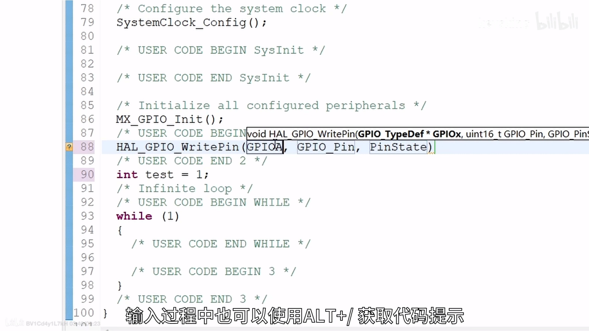

# GPIO
浮空输入下的GPIO内部处于高阻态
相当于芯片内部有一个巨大的电阻，根据电阻越大分压越多的原理，上拉电阻压降几乎为0V

GPIOx_BSRR（端口位设置 / 清除寄存器）、GPIOx_BRR（端口位清除寄存器）、GPIOx_ODR（端口输出寄存器）  
控制单片机就是控制寄存器  
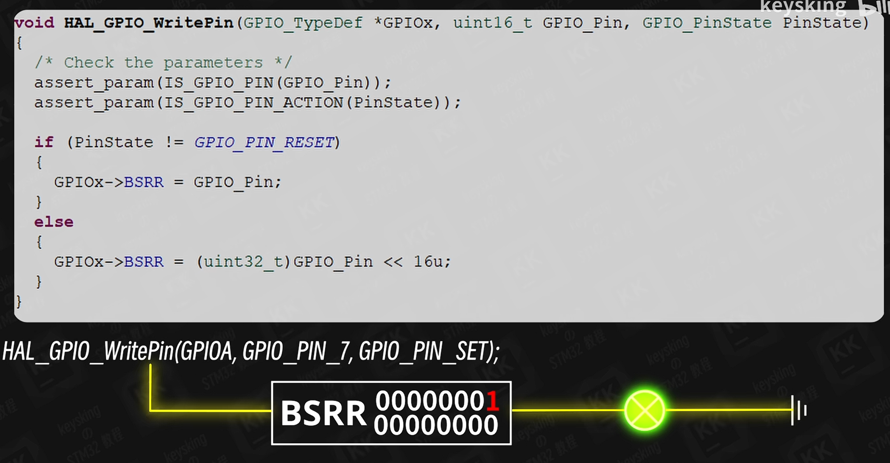  
TTL肖特基触发器（施密特触发器）作用是稳定电平。  
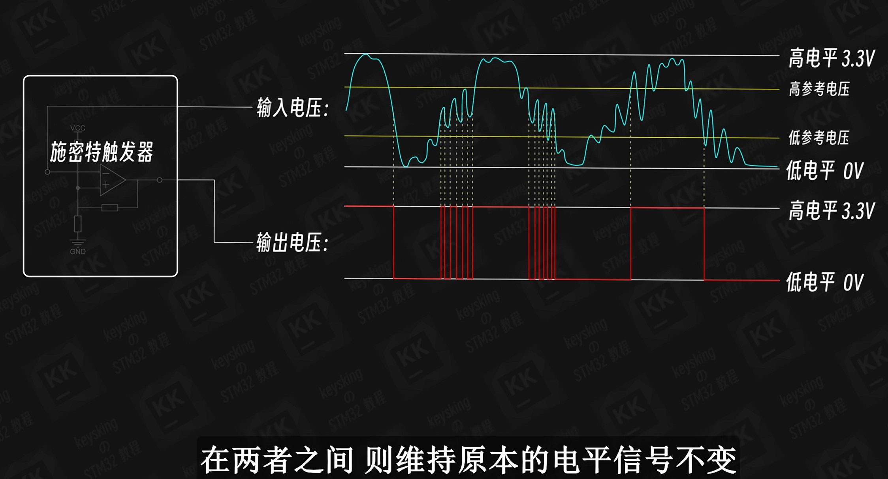
# 中断
中断信号是送到处理器，调用代码进行处理。  
事件信号是送到相应的外设，自行处理。  
响应优先级（次优先级）仅在两中断同时发生时起到辅助作用。  
>配置了GPIO复用功能，但如果没有手动设置下载调试器接口的话，会出现相关接口关闭，下一次可能就烧录不进去。
# 串口
串口是全双工，异步通信。（基于双方各自的时钟）

串口轮询模式改中断只需要在MX里NVIC中使能串口，在发送接收函数名末尾加上_IT即可。

    HAL_UART_Receive_IT(&huart1, &aRxBuffer, 1);
因为不会阻塞程序运行，就不能放到while循环里面了。放里面会还没接收到数据，又开启新中断了。  
又因为串口中断接收完一次后就不再接收了，需要再放在处理串口回调函数最后。  

因为不会阻塞程序运行，不能立刻处理数据。需要在`USART1_IRQHandler`函数中添加处理代码。因为还有处理串口其他中断，需要进入`HAL_UART_IRQHandler`函数中找到 `HAL_UART_RxCpltCallback(&huart1);`函数，在main.c重写该函数。  
只接受到我们想要的字节数，接收才完成会调用`HAL_UART_RxCpltCallback`回调函数。  

    HAL_UART_Transmit_IT(&huart1, (uint8_t *)"hello world", 11);

中断回调函数里面建立数据缓冲区，并且将解析数据的步骤搬出中断，在主循环中进行处理。
main.c
```c
void HAL_UARTEx_RxEventCallback(UART_HandleTypeDef *huart, uint16_t Size)
{
  if (huart == &huart3)
  {
    // 将数据写入命令缓冲区
    uint8_t length = CommandBuffer_Write(receivedData, Size);
    // 继续接收
    HAL_UARTEx_ReceiveToIdle_DMA(&huart3, receivedData, ReceivedDataSize);
    __HAL_DMA_DISABLE_IT(&hdma_usart3_rx, DMA_IT_HT);
  }
}
```
while(1)
```c 
    // 从命令缓冲区获取命令
    uint8_t length = CommandBuffer_GetCommand(command);
    if (length > 0)
    {
      HAL_UART_Transmit_DMA(&huart3, command, length);
      for (int i = 2; i < length - 1; i += 2)
      {
        GPIO_PinState state = GPIO_PIN_SET;
        // 先判断第二个字节，是开灯还是关灯，0x00关灯，0x01开灯
        if (command[i + 1] == 0x00)
        {
          state = GPIO_PIN_RESET;
        }
        // 再判断第一个字节，是红灯还是绿灯还是蓝灯
        if (command[i] == 0x01) // 红灯
        {
          HAL_GPIO_WritePin(LED_RED_GPIO_Port, LED_RED_Pin, state);
        }
        else if (command[i] == 0x02) // 绿灯
        {
          HAL_GPIO_WritePin(LED_GREEN_GPIO_Port, LED_GREEN_Pin, state);
        }
        else if (command[i] == 0x03) // 蓝灯
        {
          HAL_GPIO_WritePin(LED_BLUE_GPIO_Port, LED_BLUE_Pin, state);
        }
      }
    }
```
```c
/**
 * **************************************************************
 * @file        : command.c
 * @author      : keysking
 * @brief       : 利用循环缓冲区实现指令数据缓存
 * **************************************************************
 * @details
 * 指令格式: [包头 0xAA] [数据长度 1字节] [数据 n字节] [校验和 1字节]
 *
 */
#include "command.h"
#include "stdio.h"
#include "string.h"

// 指令的最小长度
#define COMMAND_MIN_LENGTH 4

// 循环缓冲区大小
#define BUFFER_SIZE 128
// 循环缓冲区
static uint8_t buffer[BUFFER_SIZE];
// 循环缓冲区读索引
static uint8_t readIndex = 0;
// 循环缓冲区写索引
static uint8_t writeIndex = 0;

/**
 * @brief 增加读索引
 * @param length 要增加的长度
 */
void CommandBuffer_AddReadIndex(uint8_t length) {
  readIndex += length;
  readIndex %= BUFFER_SIZE;
}

/**
 * @brief 读取第i位数据 超过缓存区长度自动循环
 * @param i 要读取的数据索引
 */

uint8_t CommandBuffer_Read(uint8_t i) {
  uint8_t index = i % BUFFER_SIZE;
  return buffer[index];
}

/**
 * @brief 计算未处理的数据长度
 * @return 未处理的数据长度
 * @retval 0 缓冲区为空
 * @retval 1~BUFFER_SIZE-1 未处理的数据长度
 * @retval BUFFER_SIZE 缓冲区已满
 */
uint8_t CommandBuffer_GetLength() {
  // 读索引等于写索引时，缓冲区为空
  if (readIndex == writeIndex) {
    return 0;
  }
  // 如果缓冲区已满,返回BUFFER_SIZE
  if (writeIndex + 1 == readIndex || (writeIndex == BUFFER_SIZE - 1 && readIndex == 0)) {
    return BUFFER_SIZE;
  }
  // 如果缓冲区未满,返回未处理的数据长度
  if (readIndex < writeIndex) {
    return writeIndex - readIndex;
  } else {
    return BUFFER_SIZE - readIndex + writeIndex;
  }
}

/**
 * @brief 计算缓冲区剩余空间
 * @return 剩余空间
 * @retval 0 缓冲区已满
 * @retval 1~BUFFER_SIZE-1 剩余空间
 * @retval BUFFER_SIZE 缓冲区为空
 */
uint8_t CommandBuffer_GetRemain() { return BUFFER_SIZE - CommandBuffer_GetLength(); }

/**
 * @brief 向缓冲区写入数据
 * @param data 要写入的数据指针
 * @param length 要写入的数据长度
 * @return 写入的数据长度
 */
uint8_t CommandBuffer_Write(uint8_t *data, uint8_t length) {
  // 如果缓冲区不足 则不写入数据 返回0
  if (CommandBuffer_GetRemain() < length) {
    return 0;
  }
  // 使用memcpy函数将数据写入缓冲区
  if (writeIndex + length <= BUFFER_SIZE) {
    memcpy(buffer + writeIndex, data, length);
    writeIndex += length;
  } else {
    uint8_t firstLength = BUFFER_SIZE - writeIndex;
    memcpy(buffer + writeIndex, data, firstLength);
    memcpy(buffer, data + firstLength, length - firstLength);
    writeIndex = length - firstLength;
  }
  return length;
}

/**
 * @brief 尝试获取一条指令
 * @param command 指令存放指针
 * @return 获取的指令长度
 * @retval 0 没有获取到指令
 */
uint8_t CommandBuffer_GetCommand(uint8_t *command) {
  // 寻找完整指令
  while (1) {
    // 如果缓冲区长度小于COMMAND_MIN_LENGTH 则不可能有完整的指令
    if (CommandBuffer_GetLength() < COMMAND_MIN_LENGTH) {
      return 0;
    }
    // 如果不是包头 则跳过 重新开始寻找
    if (buffer[readIndex] != 0xAA) {
      CommandBuffer_AddReadIndex(1);
      continue;
    }
    // 如果缓冲区长度小于指令长度 则不可能有完整的指令
    uint8_t length = CommandBuffer_Read(readIndex + 1);
    if (CommandBuffer_GetLength() < length) {
      return 0;
    }
    // 如果校验和不正确 则跳过 重新开始寻找
    uint8_t sum = 0;
    for (uint8_t i = 0; i < length - 1; i++) {
      sum += CommandBuffer_Read(readIndex + i);
    }
    if (sum != CommandBuffer_Read(readIndex + length - 1)) {
      CommandBuffer_AddReadIndex(1);
      continue;
    }
    // 如果找到完整指令 则将指令写入command 返回指令长度
    for (uint8_t i = 0; i < length; i++) {
      command[i] = CommandBuffer_Read(readIndex + i);
    }
    CommandBuffer_AddReadIndex(length);
    return length;
  }
}

```

通过循环缓冲区缓存数据，并在主循环中进行处理。避免数据粘包，数据丢失。  
该模块适用于串口通信、蓝牙等数据流场景，能够：  
- 缓存不定长指令数据
- 自动识别完整指令
- 处理粘包、半包问题
- 丢弃错误数据
## DMA直接内存访问
代替CPU来搬运数据
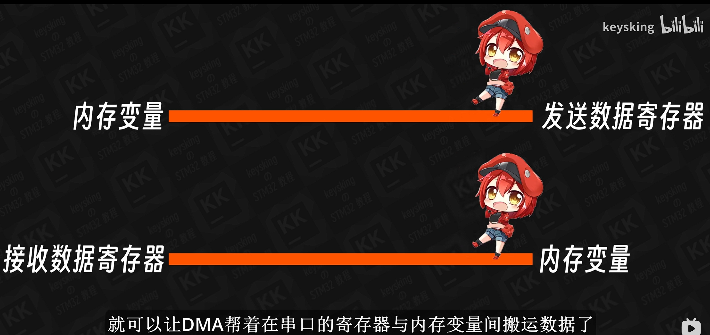
在MX建立两条串口DMA通道。把后缀_IT改为_DMA即可。
如果要接收不定长数据，可以利用串口空闲中断。使用`HAL_UARTEx_ReceiveToIdle_DMA(&huart1, (uint8_t *)aRxBuffer, sizeof(aRxBuffer));`函数。  
相应的回调函数则改为`HAL_UARTEx_RxEventCallback(&huart1, uartEvent);`
```c
void HAL_UARTEx_RxEventCallback(UART_HandleTypeDef *huart, uintl6_t Size)
{
    if (huart == &huart2)
    {
        HAL_UART_Transmit_DMA(&huart2, receiveData, Size);


        HAL_UARTEx_ReceiveToIdle_DMA(&huart2, receiveData, sizeof(receiveData));
        __HAL_DMA_DISABLE_IT(&hdma_usart2_rx, DMA_IT_HT);
    }
}
```
为了避免触发DMA传输过半中断，关闭DMA传输过半中断是`__HAL_DMA_DISABLE_IT(&hdma_usart2_rx, DMA_IT_HT);`串口接受开启时也要关闭。
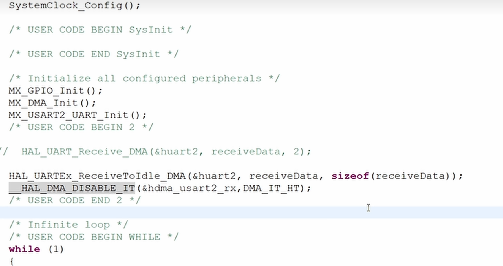
### 校验和
校验和用来校验数据传递过程中是否出错  
计算方式;将前面的数据依次相加，然后取最后1字节数据。  
收到数据包中的校验和后,设备自行计算校验和,然后与收到的校验和进行比较。如果两个数据相同，则说明数据没有出错。若出错忽略此数据包，或请求重新发送数据。  

>有些串口助手支持发送校验和
# IIC
支持多个设备进行通信的通信协议我们称其为总线协议。  
主机发送，从机选择性应答。  
半双工通信，主从模式，总线模式，同步通信。

由主机通过时钟线发送固定频率的脉冲信号来作为IIC总线上所有设备通信的统一时钟源。  
IIC两根线上拉。
从机读取到的电平就是主机在时钟线低电平时设置的电平。

当时钟线处于低电平时主机/从机设置数据线的电平
而时钟线处于高电平时从机/主机读取数据线的电平

ACK应答信号由应答方在时钟线低电平时拉低数据线。

只有主机发送开始和结束信号时才会在时钟线为高时控制数据线，其他阶段都只能在时钟线为低时设置数据线。

I2C地址常用7位地址，但IIC通信中每次发送都是一字节，8位。所以要左移一位。第8位是读写位，0表示写，1表示读。
HAL库会处理好最后一位，默认为0就好了

## OLED
# 看完10以前的代码

# WS2812 PWM+DMA
WS2812芯片会发出三路PWM信号来调节三颗灯珠的亮度，我们要做的就是告诉WS2812每颗小灯的亮度即可。  
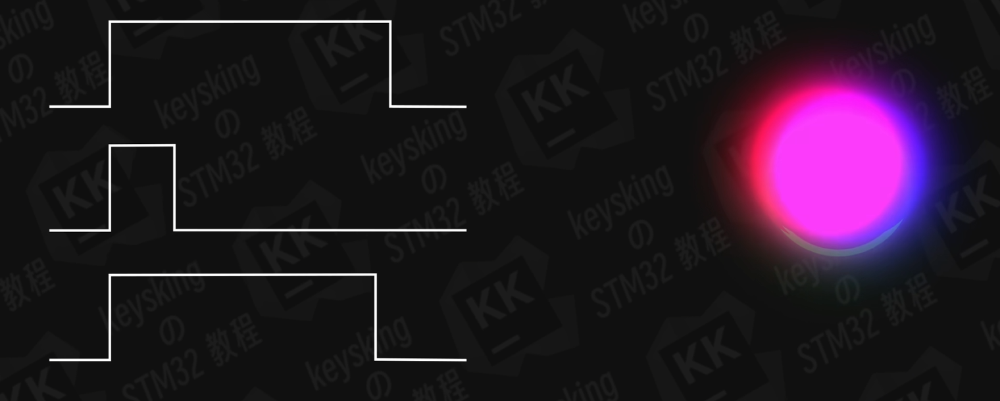
每个颜色的强度一般从弱到强用0~255表示。也就是16进制的FF。一个字节。混出一个颜色可以用3个字节。
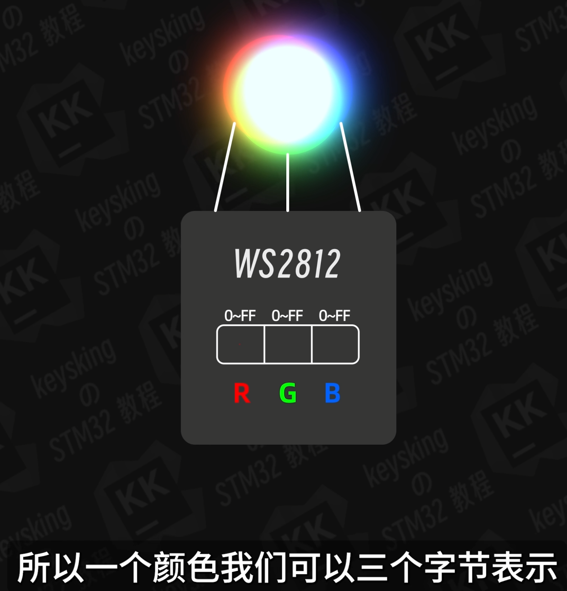  
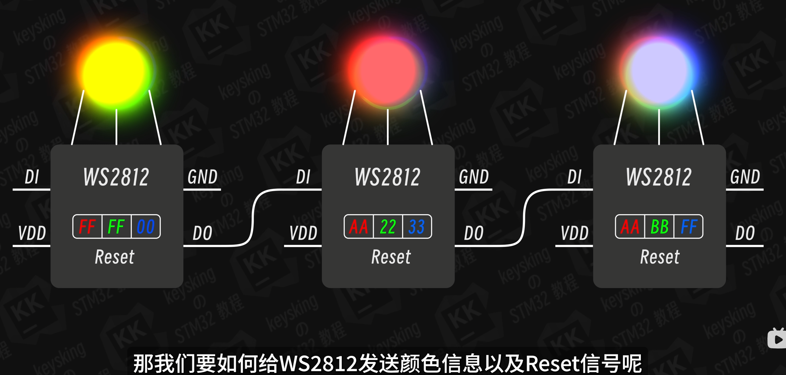  
WS2812采用的通信方式称为归零码，也就是每位数据之间电平必须归为零(低)电平。  
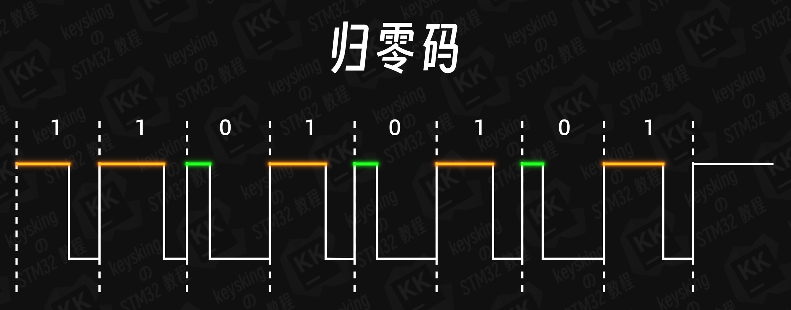  
由于是单线通信，没有时钟线辅助，WS2812规定了信号要以大概800kHz的频率进行发送。  
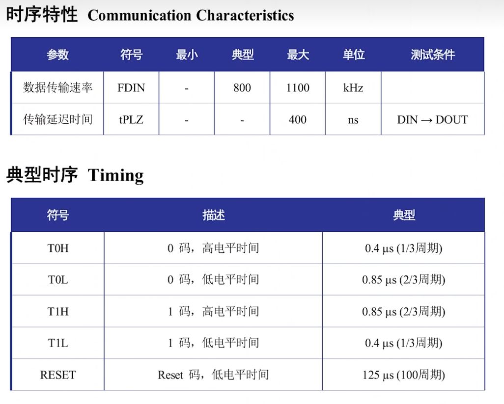  
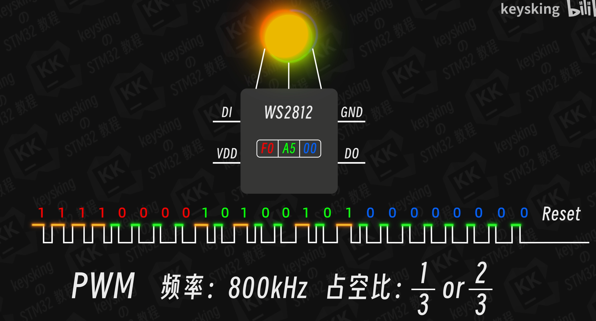
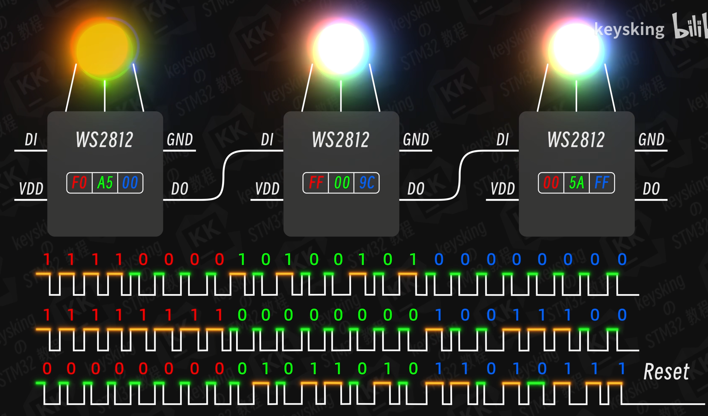  
可以一颗一颗发Reset信号也可以最后发送Reset信号。  
## 如何实现呢？
使用PWM+DMA实现。用DMA快速修改PWM占空比（输出比较寄存器）。  

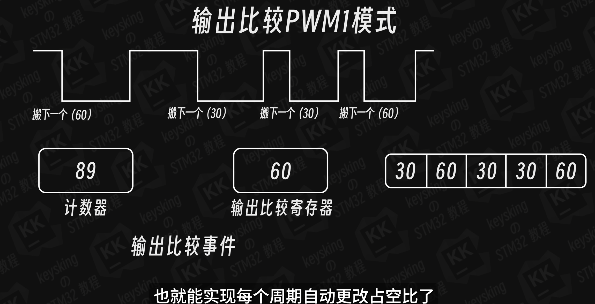  
输出比较PWM1模式下，一个周期中首先输出高电平，当计数器值与输出比较寄存器值相等时，切换为低电平。定时器有一个可以触发DMA的事件。叫做输出比较事件。当计数器的值与输出比较寄存器的值相等时，会触发DMA搬运，将下一个周期的占空比所用到的数据搬运到输出比较寄存器。此时本周期的电平已经切换，不在受影响，也提前为下一个周期准备好了输出比较值。提前将数据数组准备好，DMA就可以在每个周期帮我们搬运新的数据到定时器的输出比较寄存器。也就能实现每个周期自动更改占空比了。  

将DI引脚连接到PB4，将引脚所在TIM设置为内部时钟源。也就是APB1的定时器时钟线72MHz，对应的通道1设置为PWM输出模式。
预分频系数设置为0，自动重装载寄存器设置为90-1（周期）。即72MHz的计数速度，每计90个数自动重装载一次。也就是800kHz的频率。  
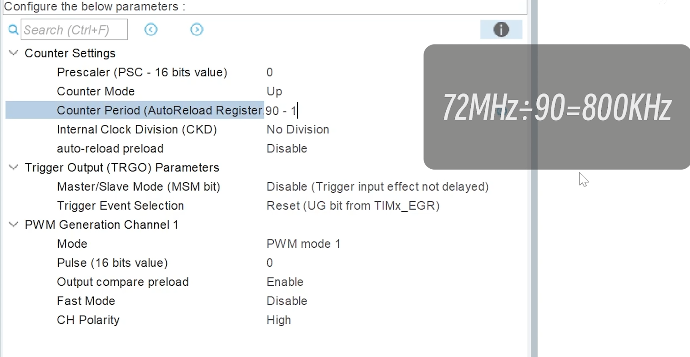
PWM模式1，先高电平后低电平。  
开漏输出，速度高，新建DMA通道（选择输出比较事件），修改为从内存到外设。搬运模式是普通模式，外设地址不自增，内存地址要自增（才能将数组中的数据一个个搬运到寄存器）。输出比较寄存器的大小是16位的，因而每次搬运的数据宽度为半个字Half Word（16位）。
>在 32 位系统中，1 个字 = 32 位 = 4 字节；

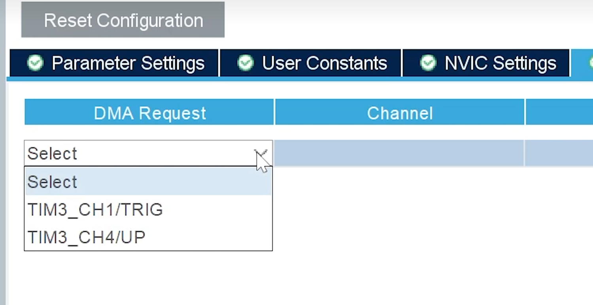
>TIM3有4种DMA搬运事件。  
>TRIG是触发事件，计时器启动、停止、初始化或触发计数都是触发事件。  
>UP是更新事件，也就是计数器重装载时。
>CH1是输出比较事件（内存向外设），当输出比较事件发生时，将数组里的数据搬运到输出比较寄存器。CH4是输入捕获事件（外设向内存）  
>输入捕获寄存器与输出比较寄存器是同一个寄存器。  


### 代码：
CodeReset将输出比较寄存器设为0（PWM占空比为0，即为纯低电平）。    
在`ws2812.h`中引用`#include"tim.h"`
在`ws2812.c`中引用`#include"ws2812.h"`定义`Ws2812_Update()`函数，在里面定义一个各个周期占空比的uintl6_t数组data，通过设置输出比较寄存器的值来控制占空比。  
然后借助DMA动态调节占空比的PWM启动函数HAL_TIM_PWM_Start_DMA
在`main.c`中引用`#include"ws2812.h"`调用`Ws2812_Update()`函数。
```c
#include"ws2812.h"
#define CodeO 30
#define Code1 60
#define CodeReset 0 
void Ws2812_Update() 
{
  static uintl6_t data[] ={
    Codel, Codel, Codel, Codel, Codel, Codel, Codel, Code1,
    CodeO， CodeO， CodeO， CodeO， CodeO， CodeO， CodeO， CodeO,
    CodeO， CodeO， CodeO， CodeO， CodeO， CodeO， CodeO， CodeO,
    CodeReset
    };
    HAL_TIM_PWM_Start_DMA(&htim3, TIM_CHANNEL_l，(uint32_t*)data, sizeof(data)/sizeof(uint16_t));
}
```
如果想在while(1)循环中调用此函数，务必要加一个延时，一是因为DMA函数是非阻塞函数，连续调用的话上一次DMA还没把整个数组搬完，下次调用就将其打断，造成数据混乱。二是因为我们在最后将PWM改了了纯低电平，但是还要等待一会才能构成Reset信号。

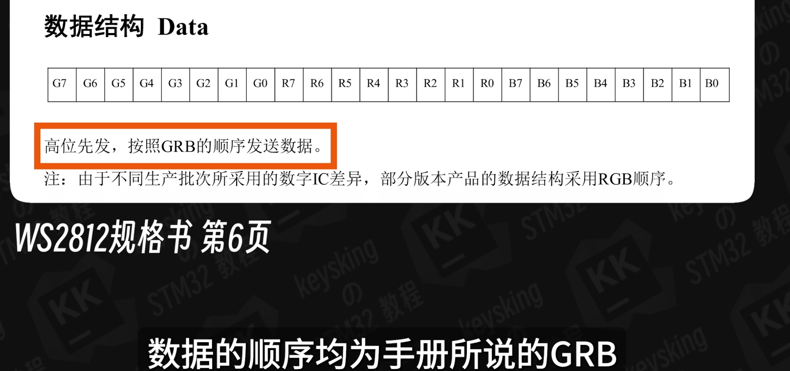

## 实战！上位机通信+WS2812实现彩灯控制系统
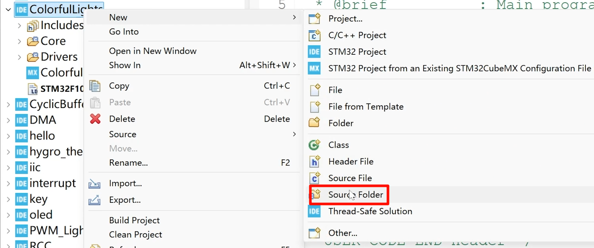
新建两个文件夹`App`以及`Lib`.下面各有Inc，Src。
工程右键选择Properties(属性)
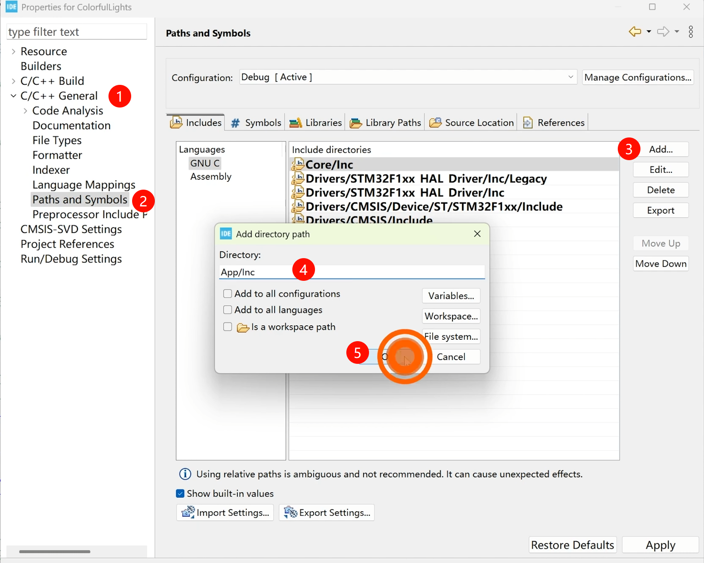
添加App/Inc以及Lib/Inc文件夹。
应用并关闭（Apply and Close）
ws2812.h中宏定义一下灯珠数量。
```c
#define WS2812_NUM 10
```
ws2812.c中定义一个二维数组，用于存放每个灯珠的颜色。数组的大小首先是LED_COUNT代表有10个小灯，随后是3代表小灯有三个颜色。uint8_t类型代表单个颜色用8位表示。
```c

```
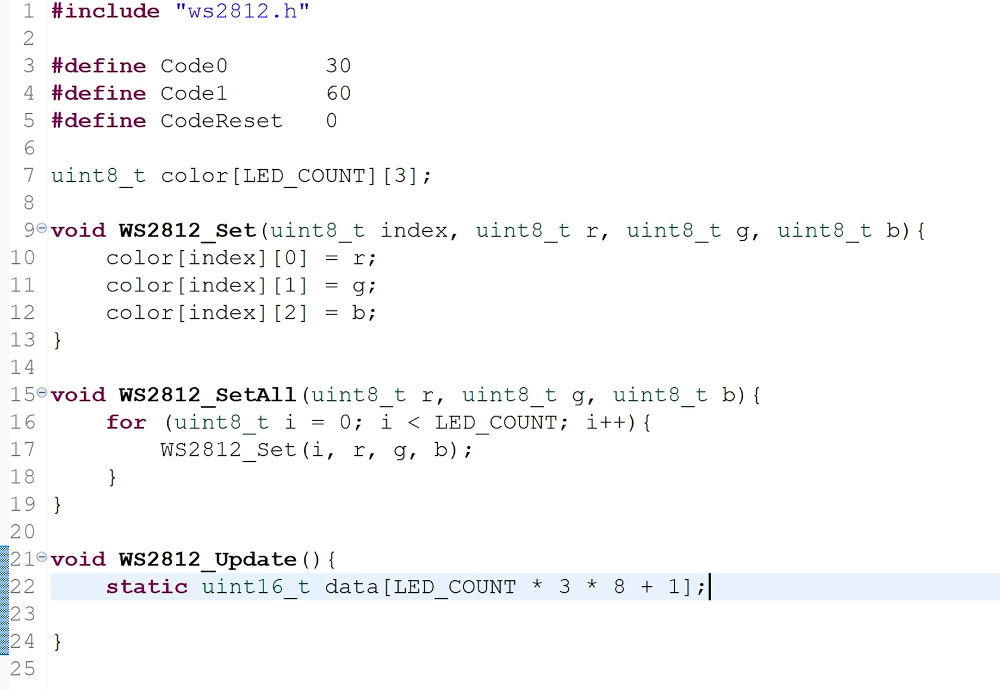
*3是因为每个小灯要发送三个颜色数据，*8是因为每个颜色一个字节8位数据，要8个PWM周期，设置8次占空比来发送。随后的+1则是为最后的Reset信号准备的，将占空比设为0，随后面的PWM的占空比就都为0了。时间一长就形成Reset信号。  

然后将所有小灯的颜色值转化为PWM占空比写入到此数组中。  
转换的算法：
先遍历color变量（二维数组，即每个小灯的颜色）。对于其中一个小灯我们取出三个颜色值，对于一个颜色值的8位数据，我们要根据8为数据每一位上是0还是1来决定对应的PWM占空比是0码还是1码。判断每一位上是0还是1的方法：例如我们要获取第7位上是0还是1，就让数据与上第7位为1，其他位都为0的数。也就是0x80。如果不为0则说明此位上为1，我们就将
代表这一位的占空比设为1码，如果不是则说明此位为0，我们就将代表这一位的占空比设为0码。其他位上也可以如此操作。来一个for循环，j从0到7，每次让数据与上0x80右移j位。也就能知悉每一位上是0还是1，将0码/1码赋值到第j个占空比。
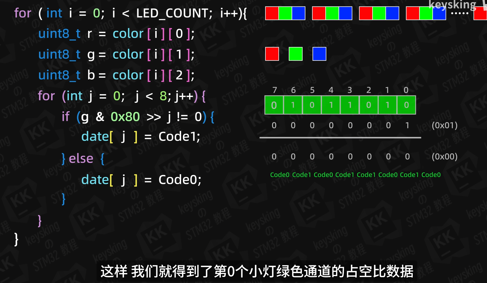
对于第i个小灯，我们则需要再data的数组下标中加上24*i，因为每个小灯会占用3*8=24个字节。（PS：颜色数据是0，但0用0码表示是一个字节（设置ccr输出比较寄存器）） 来存储自己的占空比。
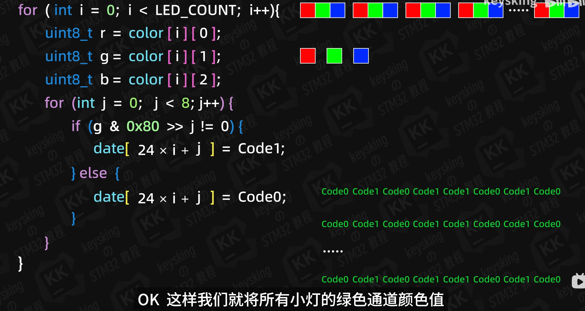
利用C语言的三目运算符可以简化为
`data[24*i+j] = (g &(0x80 >>j) != 0) ? Codel : Code0;`
由于C语言中0为假，非0为真的特性。!=0也可以省略掉。
`data[24*i+j] = (g &(0x80 >>j)) ? Codel : Code0;`
这样当与运算结果不为0时，就赋值为1码。否则就赋值为0码。  
同样红色与蓝色通道的颜色值我们也这样转换。  
区别就是红色通道的占空比数据位置要+8，同理蓝色+16  
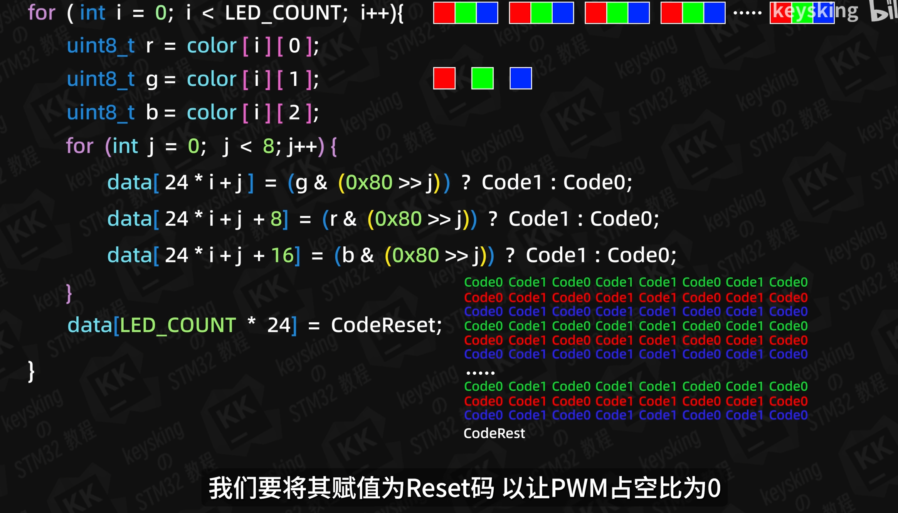  
经过如此操作后便能将color数组中的颜色数据转化为data数组中的PWM占空比信号。
不可避免会出现之前一次DMA还未搬运完，新的控制信号就要重新设置小灯颜色等情况。如果此时计数器的状态不确定的话，肯定会导致第一个PWM周期的占空比不正确，进而导致整个通信错乱。因而我们要再启动PWM信号前先调用`HAL_TIM_PWM_Stop_DMA(&htim3, TIM_CHANNEL_1);`函数，将PWM输出停掉，然后再将计数器设为0：`__HAL_TIM_SetCounter(&htim3, 0);`，保证接下来PWM信号输出时，计数器是从0开始计数的。这样Update函数便能完美地将color变量中的颜色值转换为PWM占空比数据。以归零码的形式发送给WS2812了。

在在`ws2812.h`中声明`void WS2812_Set(uint8_t index,niuint8_t r, uint8_t g, uint8_t b);`函数(设置第index个小灯的颜色为rgb，设置的是color变量。未转化为归零码)。
`void WS2812_SetAll(uint8_t r, uint8_t g, uint8_t b);`函数（设置全部color变量。未转化为归零码）。`void WS2812_Update();`函数。（转化为归零码）
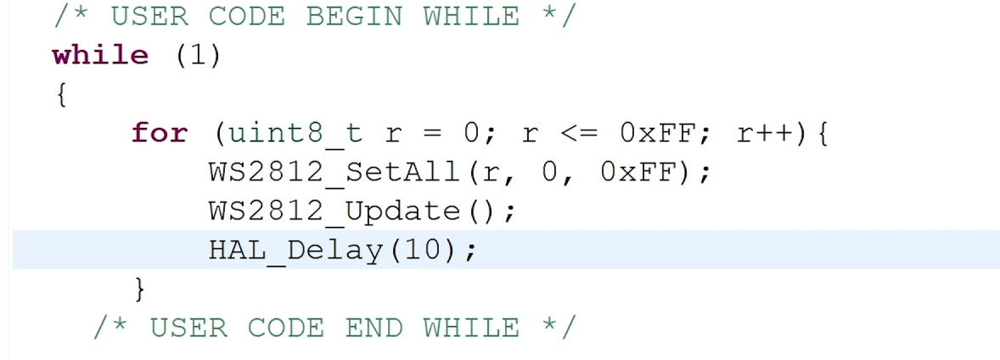

增加一个currentColor变量，用于存放当前小灯的颜色。每次更新了颜色后就将color变量中的数据赋值到currentColor变量中。利用currentColor变量，实现了可以让小灯颜色渐变的函数。在小灯的任务循环函数中，将command设为了static，方便下次循环时还能使用其中的数据。还增加了一个static的type变量。将每次命令的命令类型记录下来，另外还增加了一个static的loopTime变量，loopTime会被获取系统执行毫秒数的HAL_GatTick函数赋值。利用loopTime变量来控制相应逻辑的执行时间，例如闪烁模式下，每500ms将小灯熄灭 或者设为设定的颜色。彩虹模式下，利用loopTime变量计算各小灯的颜色值。而呼吸模式下，利用渐变函数实现小灯的渐亮渐灭。
# SPI
SPI（Serial Peripheral Interface）是一种同步串行通信协议，主要用于嵌入式系统中，用于集成电路之间的短距离有线通信。

SPI 通信有四根线：

SCLK：时钟线，由主机产生

MOSI：主机输出从机输入，主机向从机发送数据

MISO：主机输入从机输出，从机向主机发送数据

CS：片选线，用于选择从机

时钟相位和极性（CPOL、CPHA）：

CPOL：时钟极性，决定时钟信号在空闲时是高电平还是低电平

CPOL = 0 时，SCLK 空闲时为低电平

CPOL = 1 时，SCLK 空闲时为高电平

CPHA：时钟相位，决定数据采样时机

CPHA = 0 时，数据在第一个时钟沿采样

CPHA = 1 时，数据在第二个时钟沿采样

例如：

CPOL = 0，CPHA = 0 时，SCLK 空闲时为低电平，数据在第一个时钟沿采样（上升沿采样）

CPOL = 1，CPHA = 0 时，SCLK 空闲时为高电平，数据在第一个时钟沿采样（下降沿采样）

CPOL = 0，CPHA = 1 时，SCLK 空闲时为低电平，数据在第二个时钟沿采样（下降沿采样）

CPOL = 1，CPHA = 1 时，SCLK 空闲时为高电平，数据在第二个时钟沿采样（上升沿采样）

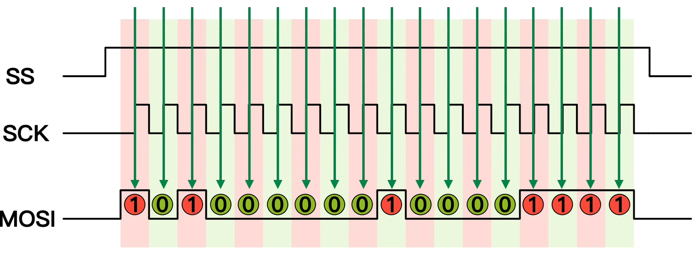
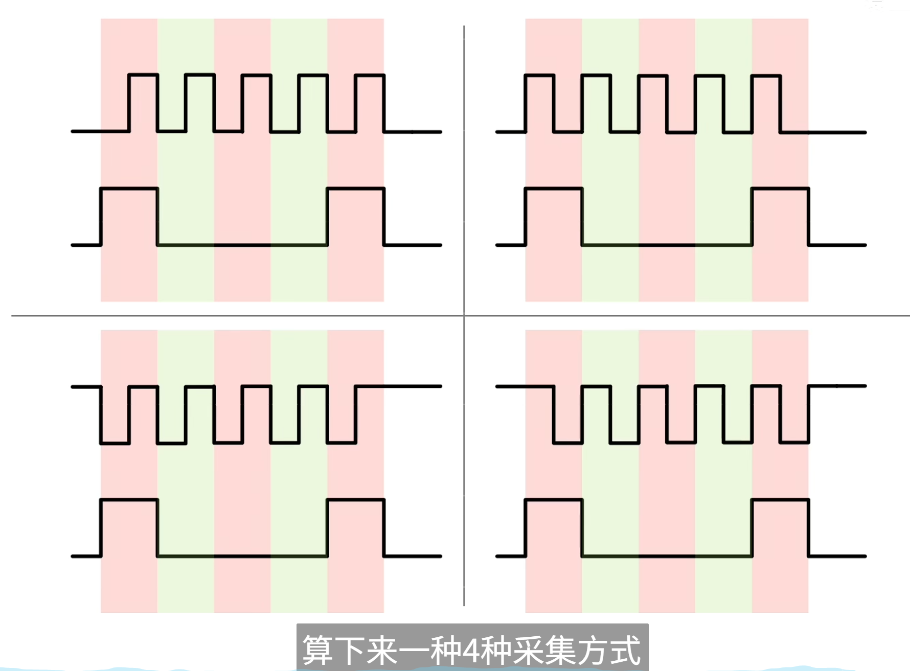
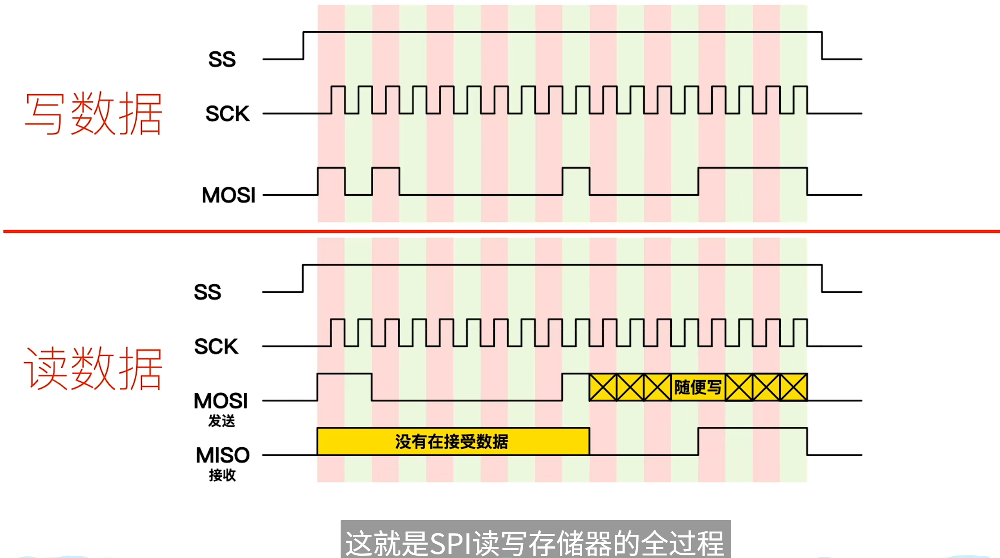
配置 CPOL = 0，CPHA = 0 ，可见 SCLK 空闲时为低电平，数据在第一个时钟沿采样（上升沿采样）

通信波形文件包含在例程zip包中，可以使用【Saleae Logic 2】软件打开查看

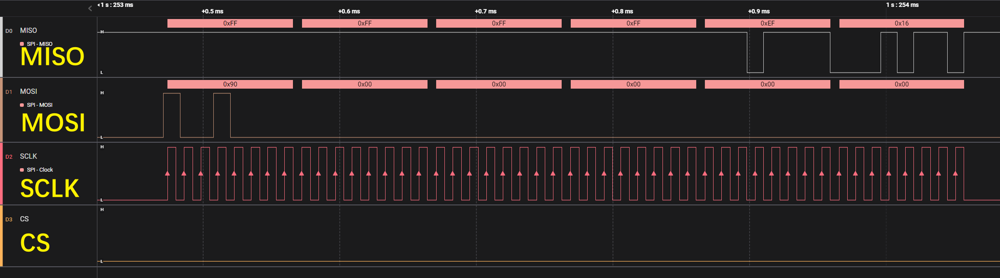

## 配置
开启外部晶振，配置时钟频率，分配引脚：将 PA12、PA15、PB3、PB1 分别设置为 GPIO_Output，并分别设置 User label 为 SPI_SCLK、SPI_MOSI、SPI_MISO、SPI_CS。  
 SPI_SCLK、SPI_MOSI、SPI_CS 配置为高速输出，SPI_MISO 配置为上拉输入。

## 代码
拷贝库文件：将 softSPI.c、dwt_stm32_delay.c 文件拷贝到 Core -> Src 目录下，将 softSPI.h、dwt_stm32_delay.h 文件拷贝到 Core -> Inc 目录下。
添加头文件：在 main.c 中引用头文件#include "softSPI.h"

初始化 SPI 实例结构体： 在 main 函数中初始化 SPI 实例结构体

```c
// 分配 SCLK 引脚
SoftSPI1.SCLK_GPIO = SPI_SCLK_GPIO_Port;
SoftSPI1.SCLK_Pin = SPI_SCLK_Pin;
// 分配 MOSI 引脚
SoftSPI1.MOSI_GPIO = SPI_MOSI_GPIO_Port;
SoftSPI1.MOSI_Pin = SPI_MOSI_Pin;
// 分配 MISO 引脚
SoftSPI1.MISO_GPIO = SPI_MISO_GPIO_Port;
SoftSPI1.MISO_Pin = SPI_MISO_Pin;
// 分配 CS 引脚
SoftSPI1.CS_GPIO = SPI_CS_GPIO_Port;
SoftSPI1.CS_Pin = SPI_CS_Pin;
// 设置 SPI 时钟频率
SoftSPI1.Delay_Time = SPI_FREQ_10KHZ;
// 设置 SPI 时钟极性和相位
SoftSPI1.CPOL = 0;
SoftSPI1.CPHA = 0;
```
初始化 SPI 实例： 在 main 函数中初始化 SPI 实例
```c
// 初始化 SPI 实例
SoftSPI_Init(&SoftSPI1);
```
进行 SPI 通信
使能片选：使用 SoftSPI_CS_Low 函数使能片选
```c
// 使能片选
SoftSPI_CS_Low(&SoftSPI1);
```
收发数据： 使用 SoftSPI_WriteReadBuff 函数发送和接收数据
```c
// 读写数据
SoftSPI_WriteReadBuff(&SoftSPI1, tx_buffer, rx_buffer, 4);
```
关闭片选：使用 SoftSPI_CS_High 函数关闭片选
```c
// 关闭片选
SoftSPI_CS_High(&SoftSPI1);
```
# WS2812 SPI
HCLK配置为了12MHz，MOSI接到我们的2812
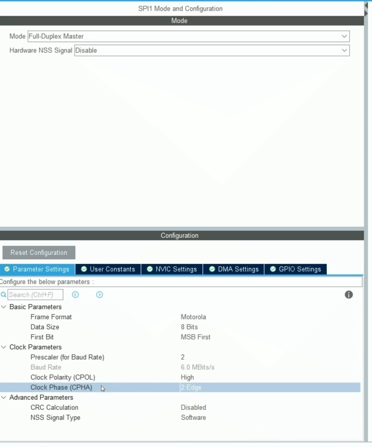
系统采用单总线协议，通过总线上高低电平的时长来区分逻辑0和1。WS2811工作在800kHz频率下，将SPI设置为6.4MHz一即其工作频率的8倍一可以确保每个字节（8位）正好对应一个逻辑位。在这种设置下，‘11111000’（OxF8）代表逻辑1，11000000（0xCO）代表逻辑0。


https://blog.csdn.net/qq_24312945/article/details/134151483
https://blog.csdn.net/qq_24312945/article/details/134152211

