# 比赛注意事项
https://lanqiaocompetition2.acmcoder.com/cand/login
https://dasai.lanqiao.cn/notices/844/
8点30分：登录比赛系统，进行赛前准备。仔细阅读《在线比赛须知》。

2.8点55分：开启录屏软件，比赛全程不得关闭或暂停，并保留录屏文件至少60天。

3.9点00分：正式比赛。选手在比赛系统点击“共享屏幕”，开考后下载试题并解压（试题解压密码见系统公告）。
申请不得超过3次，每次离座不得超过5分钟。

# 置顶链接
大赛官网：https://dasai.lanqiao.cn/  
官网：https://www.4t.wiki  
物联网单片机应用与开发：https://4t.wiki/knowledge/CT127C_V3T  
视频账号：  
B站：https://www.bilibili.com/video/BV17TiUYFEgN/  
https://www.bilibili.com/video/BV1CtmtY5EHt/  
https://www.bilibili.com/video/BV1JY2hYyE3C  
https://www.bilibili.com/video/BV1n1r6YfEDa/  
刷题：https://www.4t.wiki/exercise  
学习路线：https://www.4t.wiki/column  

# 板卡介绍
产品基于 STM32WLE5 Sub-GHz 无线微控制器设计，芯片提供了 256KB FLASH 和 64KB SRAM 存储器，最高主频 48MHz，内部集成 ARM Cortex M4 内核和无线通讯单元，支持LoRa ®、(G)FSK、(G)MSK 和 BPSK 调试模式。产品配置按键、指示灯、调试器、OLED显示屏、通用传感器接口、EEPROM 存储器等 MCU 典型外围器件，单 USB Type C 接口供电，支持串口通讯、程序下载和在线调试功能。 
## 芯片
STM32WLE5CCU6  
STM32WL系列是全球首款LoRa SOC芯片使用cortex-M4内核和semtech的sx126x的sub-GHz射频芯片支持LoRa、(G)FSK、MSK和BPSK。  
## 资源配置

MCU：STM32WLE5，ARM Cortex M4 内核集成 Sub-GHz 单元。  
I2C 接口/0.91 寸 OLED 显示器  
复位按键 1  
用户按键 2  
LED（R） 1  
LED（G） 1  
LED（B） 1  
电位器 1  
EEPROM 1  
USB 转 UART 1  
DAP Link 调试器 1  
通用扩展接口 1   
## 软件工具
IDE：MDK-ARM 集成开发环境（推荐 5.30 及以上版本）   
STM32 Cube MX 6.10 及以上版本   
USB 驱动程序（Windows 10 及以上版本免驱动）  
## 传感模块
温度传感器模块：I2C接口，传感器型号：STS30-DIS-B  
模拟电压输出模块：2路连续可调电压输出，4个LED指示灯  
矩阵键盘模块：2 x 3矩阵按键  
脉冲输出模块：1路模拟电压输出、1路脉冲信号输出、2个LED指示灯  
光敏与红外热释电模块：1路光敏电阻分压输出、1路热释电传感器输出信号。  
# CubeMX配置
关闭HSE，LSE,打开MSI，设置频率为48000KHz。
只包含使用过的库，生成.c.h文件。

>stm32wlxx_hal_conf.h作用:（STM32CubeMX 生成）
>1. 启用或禁用 HAL 库模块
>2. 配置时钟源和时钟频率
>3. 配置中断优先级分组
>4. 调试和跟踪功能配置
>5. 其他全局配置选项
# 代码：
>stdint.h：重命名了char为int8_t，int为int16_t，long为int32_t，long long为int64_t，unsigned char为uint8_t，unsigned int为uint16_t，unsigned long为uint32_t，unsigned long long为uint64_t。


## 中断
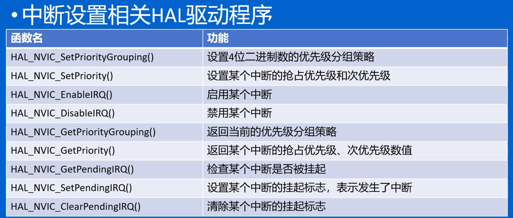
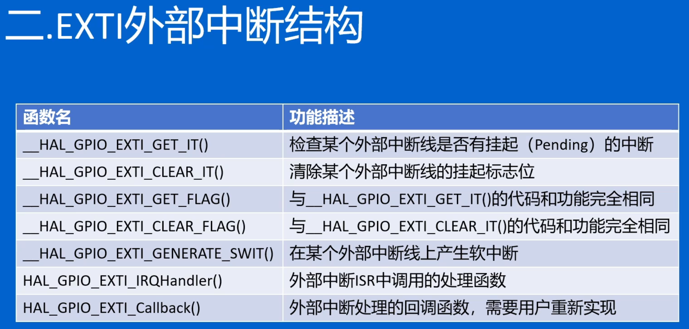
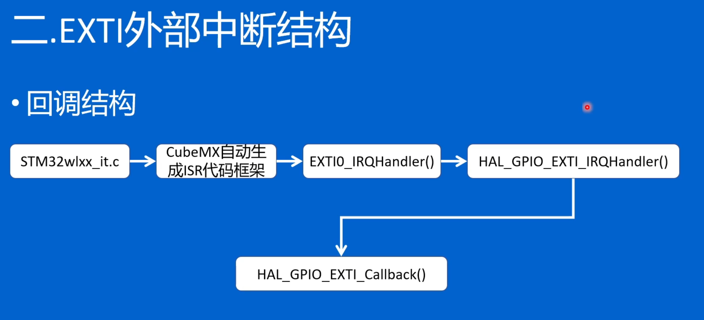
针对按键抖动可能会连续进入两次中断，所以清除中断标志函数放在回调函数后面。
注意修改HAL_GPIO_EXTI_IRQHandler函数,重新用cubeMX生成，会恢复。

## OLED
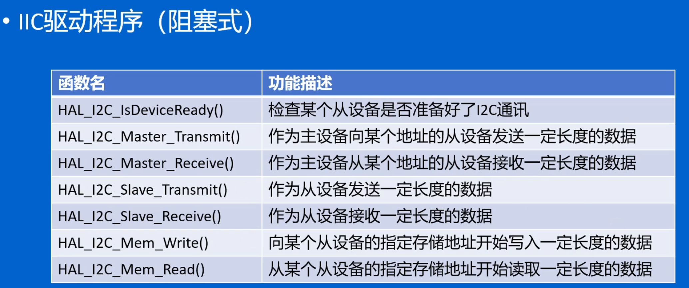
I2C地址：
0xa0存储芯片地址 0x78屏幕地址
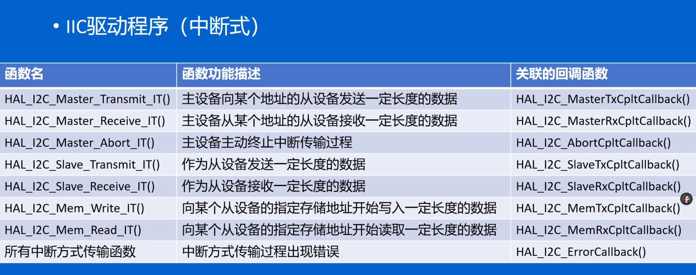
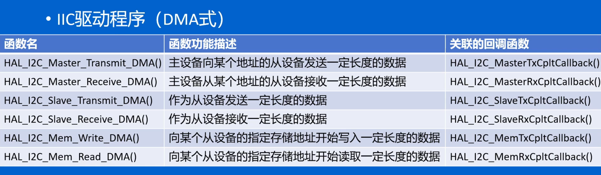

I2C配置Fast Mode

OLED驱动：
在i2c.c中定义
```c
void OLED_Write(uint8_t ucType,uint8_t ucData)
{
    uint8_t pData[2];

    pData[0]=ucType;
    pData[l]= ucData;
    HAL_I2C Master_Transmit(&hi2cl，0x78，pData，2，10);
}
```
在i2c.h中声明    

```c
void OLED_Write(uint8_t ucType,uint8_t ucData);
```
main.c中添加

```c
#include "oled.h"
#include "stdio.h"

uint16_t g_Time_Num;  // 显示计数
uint8_t OLED_buf[20]; // OLED刷新缓存

int main(void)
{
    OLED_Init();
    while (1)
    {
        sprintf((char *)OLED_buf, "Time:%05d", g_Time_Num); // 打印
        OLED_ShowString(0, 0, OLED_buf, 16);                // 显示
        g_Time_Num++;                                       // 数值增加
        HAL_Delay(1000);                                    // 等待


    }
}
```

### OLED基于界面的状态机编程：
新建
task.c
```c
#include "task.h"                                                                               //任务头文件

Interface State = STATE_MAIN;                                                                   //当前显示界面枚举
Interface Old_State = STATE_MAIN;                                                               //之前显示界面枚举
Task_Time_Adj Task_Time;                                                                        //任务运行间隔结构体
KEY_State KEY;                                                                                  //按键按下状态结构体

uint16_t Time_Num;                                                                              //一个随启动时间递增的数

void OLED_Proc(void)                                                                            //OLED任务
{
    uint8_t oled_buf_Line1[20] = {0};                                                           //定义第一行的显示缓存
    uint8_t oled_buf_Line2[20] = {0};                                                           //定义第二行的显示缓存

    if(Task_Time.Oled_Time < OLED_TIME) return;                                                 //如果没有到达运行间隔要求则返回
    Task_Time.Oled_Time = 0;                                                                    //如果到达了运行间隔要求则清零运行间隔并开始运行

    switch(State)                                                                               //根据当前显示界面枚举来选择应该显示什么
    {
    case STATE_MAIN:                                                                        //如果当前显示主界面
        if(Old_State != STATE_MAIN)
        {
            Old_State = STATE_MAIN;    //如果之前不是在主界面 则设置之前显示界面为主界面 并清除屏幕上的全部内容
            OLED_Clear();
        }
        sprintf((char *)oled_buf_Line1, "HELLO_WORLD");                                     //将我们要显示的内容填充进显示缓冲区
        break;                                                                              //结束
    case STATE_TIME_NUM:                                                                    //如果当前显示界面为TIME_NUM界面
        if(Old_State != STATE_TIME_NUM)
        {
            Old_State = STATE_TIME_NUM;    //如果之前不是在TIME_NUM界面 则设置之前显示界面为TIME_NUM界面 并清除屏幕上的全部内容
            OLED_Clear();
        }
        sprintf((char *)oled_buf_Line1, "Time:%05d", Time_Num);                             //将我们要显示的内容填充进显示缓冲区
        break;                                                                              //结束
    }
    OLED_ShowString(0, 0, oled_buf_Line1, 16);                                                  //根据显示缓冲区的内容来将数据刷新到屏幕
    OLED_ShowString(0, 2, oled_buf_Line2, 16);
}

void KEY_Proc(void)                                                                             //按键任务
{
    uint8_t key_val;                                                                            //定义按键键值存储变量 这个变量会实时反应按键状态

    if(Task_Time.Key_Time < KEY_TIME) return;                                                   //如果没有到达运行间隔要求则返回
    Task_Time.Key_Time = 0;                                                                     //如果到达了运行间隔要求则清零运行间隔并开始运行

    if(HAL_GPIO_ReadPin(ASW1_GPIO_Port, ASW1_Pin) == GPIO_PIN_RESET) key_val = ASW1;
    else if(HAL_GPIO_ReadPin(ASW2_GPIO_Port, ASW2_Pin) == GPIO_PIN_RESET) key_val = ASW2;
    else key_val = ASW_None;                                                            //如果没有读取到按键 则认为ASW1和ASW2没有被按下

    KEY.KEY_down = key_val & (KEY.KEY_old ^ key_val);                                           //经典三行消抖
    KEY.KEY_up = ~key_val & (KEY.KEY_old ^ key_val);
    KEY.KEY_old = key_val;

    if(KEY.KEY_down == ASW1)                                                                    //如果按键ASW1按下
    {
        if(State == STATE_MAIN) State = STATE_TIME_NUM;                                         //如果当前在主界面 则切换界面到TIME_NUM界面
        else if(State == STATE_TIME_NUM) State = STATE_MAIN;                                    //如果当前在TIME_NUM界面 则切换界面到主界面
        KEY.KEY_down = ASW_None;                                                                //清除数值 防止多次触发
    }
        if(KEY.KEY_down == ASW2)
    {
        if(State == STATE_MAIN) State = STATE_KEY;
        else if(State == STATE_TIME_NUM) State = STATE_MAIN;
    }
}
```


task.h

```c
#ifndef __TASK_H                                //避免重复定义
#define __TASK_H

#include "main.h"                               //引入头文件
#include "i2c.h"
#include "oled.h"                               //注意oled.h 为非完整代码 需要在i2c.h中补充
#include "stdio.h"

#define OLED_TIME 200                           //任务运行间隔控制
#define KEY_TIME 10


#define ASW_None 0x00                           //按键键值设置 数值可随意设置 不重复即可
#define ASW1 0x01
#define ASW2 0x02

// 定义枚举类型表示不同的界面模式
typedef enum
{
    STATE_MAIN = 0,
    STATE_TIME_NUM
} Interface;

extern Interface State;

//结构体
typedef struct                                  //任务运行间隔计时变量 该数值在SysTick定时器中断中增加 注意添加代码
{
    uint8_t Key_Time;
    uint8_t Oled_Time;
} Task_Time_Adj;

extern Task_Time_Adj Task_Time;


//结构体
typedef struct                                  //三行消抖 按键状态
{
    uint8_t KEY_down;
    uint8_t KEY_up;
    uint8_t KEY_old;
} KEY_State;


extern uint16_t Time_Num;                       //启动时间计时器

void OLED_Proc(void);                           //函数声明
void KEY_Proc(void);

#endif
```
main.c中修改
```c
#include "task.h"                       //任务
int main(void)
{
    OLED_Init(); // OLED初始化

    while (1)
    {
        OLED_Proc(); // OLED刷新任务
        KEY_Proc();  // 按键扫描任务
    }
}
```


在stm32wlxx_it.c中添加
#include "task.h"

其中 void SysTick_Handler(void)函数中添加
```c
    Task_Time.Key_Time++;
    Task_Time.Oled_Time++;
    Time_Num++;
```
## 2x3矩阵按键
行1连接PA12，行2连接PA11。设置为输出。
列1连接PB3，列2连接PA15，列3连接PA0。设置为输入上拉。

main.c
```c
    BSP_Init();                                 //新增 板级支持初始化
```
task.h
```c
#define EX01_B1 0x11                //矩阵键盘 键值 数值随意 不重复即可
#define EX01_B2 0x12
#define EX01_B3 0x13
#define EX01_B4 0x14
#define EX01_B5 0x15
#define EX01_B6 0x16

#define USE_EX01_KB6                //定义 USE_EX01_KB6 表示使用矩阵键盘模块

typedef enum
{
    STATE_MAIN = 0,
    STATE_TIME_NUM,
    STATE_KEY                       //新增按键界面
} Interface;

void BSP_Init(void);
```

task.c
```c
uint8_t Key_Flag;  

void BSP_Init()                                                                         //新增 板级支持初始化
{
    OLED_Init();                                                                        //OLED初始化

#ifdef USE_EX01_KB6                                                                 //如果定义了 USE_EX01_KB6 则编译以下代码 直到遇见的第一个#endif
    GPIO_InitTypeDef GPIO_InitStruct = {0};                                             //初始化结构体

    __HAL_RCC_GPIOB_CLK_ENABLE();                                                       //使能IO时钟
    __HAL_RCC_GPIOA_CLK_ENABLE();

    HAL_GPIO_WritePin(GPIOA, GPIO_PIN_11 | GPIO_PIN_12, GPIO_PIN_RESET);                //初始电平为低电平

    GPIO_InitStruct.Pin = GPIO_PIN_3;
    GPIO_InitStruct.Mode = GPIO_MODE_INPUT;
    GPIO_InitStruct.Pull = GPIO_PULLUP;
    HAL_GPIO_Init(GPIOB, &GPIO_InitStruct);                                             //设置PB3 为上拉输入

    GPIO_InitStruct.Pin = GPIO_PIN_0 | GPIO_PIN_15;
    GPIO_InitStruct.Mode = GPIO_MODE_INPUT;
    GPIO_InitStruct.Pull = GPIO_PULLUP;
    HAL_GPIO_Init(GPIOA, &GPIO_InitStruct);                                             //设置PA0 PA15 为上拉输入

    GPIO_InitStruct.Pin = GPIO_PIN_11 | GPIO_PIN_12;
    GPIO_InitStruct.Mode = GPIO_MODE_OUTPUT_PP;
    GPIO_InitStruct.Pull = GPIO_NOPULL;
    GPIO_InitStruct.Speed = GPIO_SPEED_FREQ_LOW;
    HAL_GPIO_Init(GPIOA, &GPIO_InitStruct);                                             //设置PA11 PA12 为推挽输出

#endif

}
void KEY_Proc(void){

#ifdef USE_EX01_KB6
    if(key_val == ASW_None)                                                             //如果ASW1和ASW2没有被按下 则进行第一行扫描
    {
        HAL_GPIO_WritePin(GPIOA, GPIO_PIN_11, GPIO_PIN_SET);                            //设置第二行为高电平
        HAL_GPIO_WritePin(GPIOA, GPIO_PIN_12, GPIO_PIN_RESET);                          //设置第一行为低电平
        if(HAL_GPIO_ReadPin(GPIOB, GPIO_PIN_3) == GPIO_PIN_RESET) key_val = EX01_B1;    //读取第一列 如果为低电平 则B1被按下（默认PB3为上拉输入 再没有被PA12接地时为高电平
        else if(HAL_GPIO_ReadPin(GPIOA, GPIO_PIN_15) == GPIO_PIN_RESET) key_val = EX01_B2; //如果B1没有被按下 则读取第二列
        else if(HAL_GPIO_ReadPin(GPIOA, GPIO_PIN_0) == GPIO_PIN_RESET) key_val = EX01_B3; //如果B1 B2都没被按下 则读取第三列
        else key_val = ASW_None;                                                        //如果第一行没有按键被按下 则认为没有按键被按下
    }
    if(key_val == ASW_None)                                                             //如果五个按键都没有被按下
    {
        HAL_GPIO_WritePin(GPIOA, GPIO_PIN_12, GPIO_PIN_SET);                            //设置第一行为高电平
        HAL_GPIO_WritePin(GPIOA, GPIO_PIN_11, GPIO_PIN_RESET);                          //设置第二行为低电平
        if(HAL_GPIO_ReadPin(GPIOB, GPIO_PIN_3) == GPIO_PIN_RESET) key_val = EX01_B4;    //读取第一列 如果为低电平 则B4被按下
        else if(HAL_GPIO_ReadPin(GPIOA, GPIO_PIN_15) == GPIO_PIN_RESET) key_val = EX01_B5; //如果B5没有被按下 则读取第二列;
        else if(HAL_GPIO_ReadPin(GPIOA, GPIO_PIN_0) == GPIO_PIN_RESET) key_val = EX01_B6; //如果B4 B5都没被按下 则读取第三列
        else key_val = ASW_None;                                                        //如果第二行没有按键被按下 则认为没有按键被按下
    }
#endif
//三段消抖

    if(KEY.KEY_down == ASW1)
    {
        if(State == STATE_MAIN) State = STATE_TIME_NUM;
        else if(State == STATE_TIME_NUM) State = STATE_KEY;
        else if(State == STATE_KEY) State = STATE_MAIN;
    }
    if(KEY.KEY_down == ASW2)
    {
        if(State == STATE_MAIN) State = STATE_KEY;
        else if(State == STATE_TIME_NUM) State = STATE_MAIN;
        else if(State == STATE_KEY) State = STATE_TIME_NUM;
    }
    if(KEY.KEY_down == EX01_B1)                                                         //按键按下后 传递数值
    {
        Key_Flag = EX01_B1;
    }
    if(KEY.KEY_down == EX01_B2)
    {
        Key_Flag = EX01_B2;
    }
    if(KEY.KEY_down == EX01_B3)
    {
        Key_Flag = EX01_B3;
    }
    if(KEY.KEY_down == EX01_B4)
    {
        Key_Flag = EX01_B4;
    }
    if(KEY.KEY_down == EX01_B5)
    {
        Key_Flag = EX01_B5;
    }
    if(KEY.KEY_down == EX01_B6)
    {
        Key_Flag = EX01_B6;
    }
}
void OLED_Proc(void)
{
    case STATE_KEY:
        if(Old_State != STATE_KEY)
        {
            Old_State = STATE_KEY;
            OLED_Clear();
        }
        sprintf((char *)oled_buf_Line1, "KEY:%03d", Key_Flag);                      //将键值打印进显示缓存
        break;
}
```
## 串口
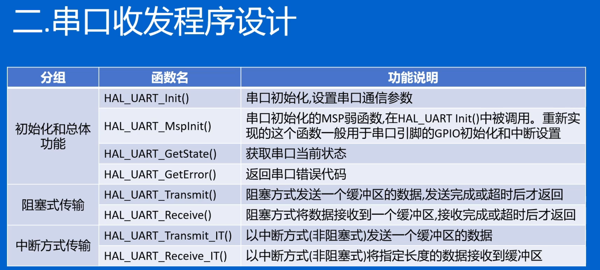
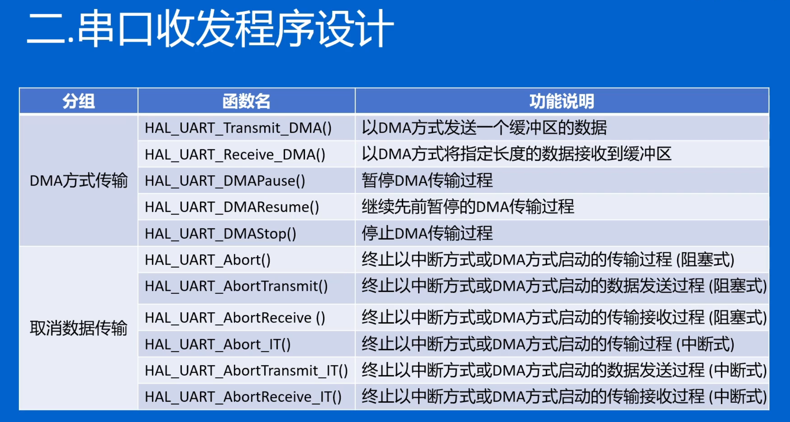
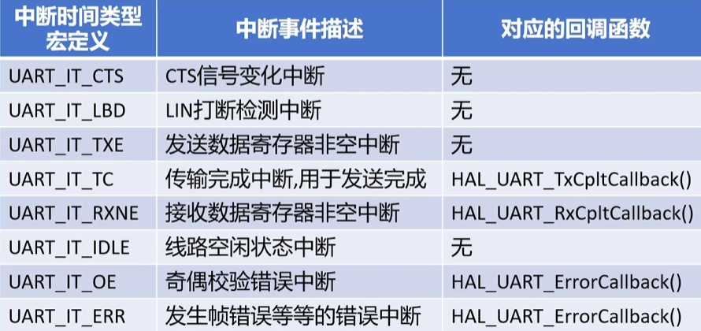
task.h
```c
#include "usart.h"
#include "string.h"
void UART_Proc(void);                           //声明函数
```

task.c
```c
//串口会存在的状态
#define UART_RX_OK 0x01
#define UART_RX_BUSY 0x02
#define UART_RX_IDLE 0x00
//串口状态变量
uint8_t UART_RX_State = UART_RX_IDLE;
//串口接收缓冲区
uint8_t RX_buf[4];

void BSP_Init()
{
#ifdef USE_EX01_KB6

#endif

    HAL_UART_Receive_IT(&huart2, RX_buf, 4);                                                        //以中断方式开始接收数据 接收4位
    UART_RX_State = UART_RX_BUSY;                                                                   //设置串口接收状态位忙状态
}

void KEY_Proc(void)
{
        HAL_UART_Transmit_IT(&huart2, (uint8_t *)"ASW1_Is_Down", sizeof("ASW1_Is_Down") - 1);       //以中断方式发送信息（sizeof会将字符串末尾的/0也算上  所以要减一
}
void UART_Proc(void)                                                                                //串口程序
{
    if(UART_RX_State == UART_RX_OK)                                                                 //轮询检查接收状态是否为接收完成
    {
        UART_RX_State = UART_RX_IDLE;                                                               //如果是接收完成状态 则设置状态为空闲
        if(RX_buf[0] == 'T' && RX_buf[1] == 'i' && RX_buf[2] == 'm' && RX_buf[3] == 'e')            //判断缓冲区内的数据是否为我们的想要的
        {
            uint8_t TX_buf[20];                                                                     //如果是我们想要的 定义一个发送缓冲区
            sprintf((char *)TX_buf, "%d\r\n", Time_Num);                                            //使用sprintf 将要发送的数据添加进缓冲区
            HAL_UART_Transmit(&huart2, TX_buf, strlen((char *)TX_buf), 200);                        //使用阻塞式发送函数 将数据发送出去
        }
        HAL_UART_Receive_IT(&huart2, RX_buf, 4);                                                    //重新开始新的接收
        UART_RX_State = UART_RX_BUSY;                                                               //设置串口状态为忙状态
    }
}

void HAL_UART_RxCpltCallback(UART_HandleTypeDef *huart)                                             //串口接收回调函数
{
    if(huart->Instance == USART2)                                                                   //如果接收来自串口2
    {
        UART_RX_State = UART_RX_OK;                                                                 //设置串口接收状态为接收完成
    }
}
```  

main.c
```c
        UART_Proc();                                      //串口处理函数
```  
### 日记输出
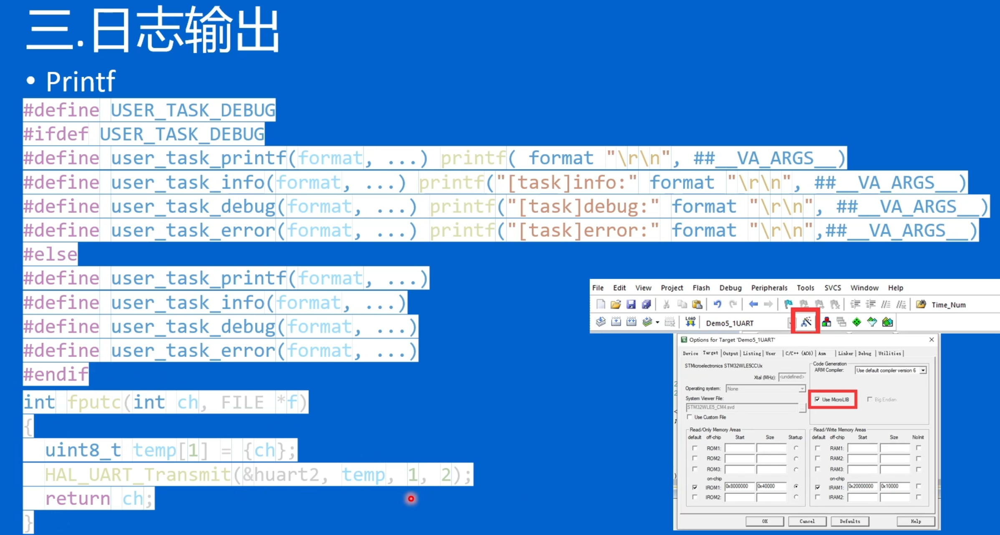
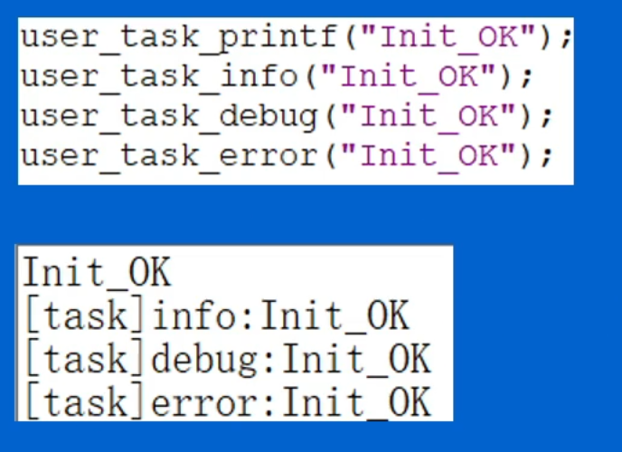
task.c
```c
#define USER_TASK_DEBUG                                                                                                                 //使用USER_TASK_DEBUG 使用这个需要串口重定向 需要使用微库
#ifdef USER_TASK_DEBUG                                                                                                                  //如果使用USER_TASK_DEBUG则编译以下代码
#define user_task_printf(format, ...) printf( format "\r\n", ##__VA_ARGS__)                                                             //将user_task_printf替换为printf并自动增加格式
#define user_task_info(format, ...) printf("[task]info:" format "\r\n", ##__VA_ARGS__)                                                  //...
#define user_task_debug(format, ...) printf("[task]debug:" format "\r\n", ##__VA_ARGS__)                                                //...
#define user_task_error(format, ...) printf("[task]error:" format "\r\n",##__VA_ARGS__)                                                 //...
#else                                                                                                                                   //如果不使用则编译以下代码
#define user_task_printf(format, ...)                                                                                                   //如果不使用则替换为 空格 即删除代码
#define user_task_info(format, ...)                                                                                                     //...
#define user_task_debug(format, ...)                                                                                                    //...
#define user_task_error(format, ...)                                                                                                    //...
#endif

int fputc(int ch, FILE *f)                                                                                                              //串口打印重定向
{
    uint8_t temp[1] = {ch};
    HAL_UART_Transmit(&huart2, temp, 1, 2);
    return ch;
}
```
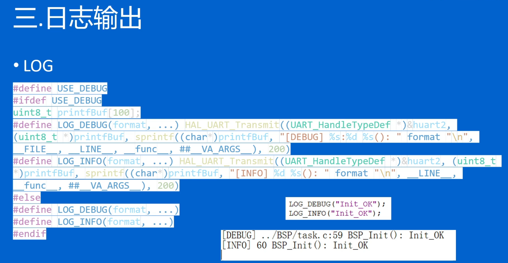
task.c
```c
#define USE_DEBUG                                                                                                                       //使用USE_DEBUG
#ifdef USE_DEBUG                                                                                                                        //如果使用USE_DEBUG 则编译以下代码
uint8_t printfBuf[100];                                                                                                                 //定义发送缓冲区 该日志输入 不需要使用重定向 不需要开启微库 且可使用中断方式打印
#define LOG_DEBUG(format, ...) HAL_UART_Transmit((UART_HandleTypeDef *)&huart2, (uint8_t *)printfBuf, sprintf((char*)printfBuf, "[DEBUG] %s:%d %s(): " format "\n", __FILE__, __LINE__, __func__, ##__VA_ARGS__), 200)
#define LOG_INFO(format, ...) HAL_UART_Transmit((UART_HandleTypeDef *)&huart2, (uint8_t *)printfBuf, sprintf((char*)printfBuf, "[INFO] %d %s(): " format "\n", __LINE__, __func__, ##__VA_ARGS__), 200)
#else
#define LOG_DEBUG(format, ...)
#define LOG_INFO(format, ...)
#endif
```
复制进去后
使用LOG_Debug("hello world");

## 24C02
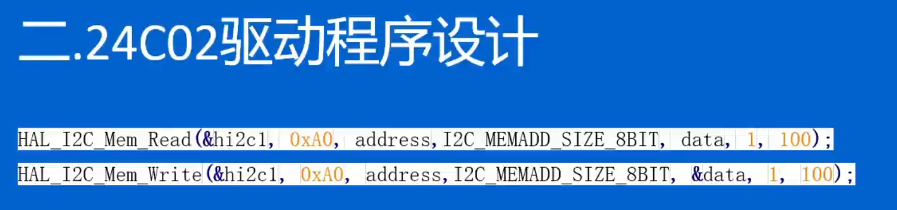
main.c
```c
int main(void)
{
    uint8_t eep_temp;                                         //定义一个临时变量存储24C02的数值
    uint8_t oled_temp[20];                                    //定义一个临时的显示缓冲区来存储显示的数字
    E2P_ReadByte(0x00, &eep_temp);                            //24C02读取0x00位置的数值 存储在临时变量          注意：E2P_ReadByte 需要自行补充 i2c.c
    sprintf((char *)oled_temp, "EEPROM:%3d", eep_temp);       //将要显示的内容大引进缓冲区
    OLED_ShowString(0, 0, oled_temp, 16);                     //显示
    eep_temp++;                                               //开机次数加一
    E2P_WriteByte(0x00, eep_temp);                            //将次数重新存入24C02                            注意：E2P_WriteByte 需要自行补充 i2c.c
    HAL_Delay(1000);                                          //显示1秒钟后进入主循环显示其他内容
    while (1)
    {
        OLED_Proc();
        KEY_Proc();
    }
}
```
i2c.c
```c
void E2P_ReadByte(uint8_t address, uint8_t *data)
{
    HAL_I2C_Mem_Read(&hi2c1, 0xA0, address, I2C_MEMADD_SIZE_8BIT, data, 1, 100);
}

void E2P_WriteByte(uint8_t address, uint8_t data)
{
    HAL_I2C_Mem_Write(&hi2c1, 0xA0, address, I2C_MEMADD_SIZE_8BIT, &data, 1, 100);
}
```
## 温湿度
task.c
```c
float STS30_Proc(void)                                                                              //温度计程序
{
#ifdef USE_EX03_STS30
    uint8_t data_T[2] = {0x24, 0x0B};                                                               //写入数据缓冲区
    uint8_t data_R[2] = {0x00, 0x00};                                                               //读取数据缓冲区

    HAL_I2C_Master_Receive(&hi2c2, 0x94, data_R, 2, 10);                                            //初始化时开启了一次温度转化 现在来读取 或者之前运行过的温度转化 现在读取
    HAL_I2C_Master_Transmit(&hi2c2, 0x94, data_T, 2, 10);                                           //开启温度转化 为下一次运行准备数据

    return (float)((data_R[0] << 8 | data_R[1]) * 175.0 / 65535 - 45);                              //计算并返回温度结果
#endif
    return 0;
}
```
task.h
```c
float STS30_Proc(void);                         //声明温度计函数
```

## 无线单元
STM32WLE5 系列是集成了 SubGHz 单元的无线微控制器，我们可以通过 MCU 内部的
SPI 查询无线通信单元的状态，控制其行为模式。例如控制它实现调频、数据发送、接
收数据，亦或是查询它是否完成了这些命令。
事实上，根据我们提供的封装好的 API 接口，实现简单功能，用户只需要掌握 3 个接口
函数的应用方法即可，这三个函数分别是初始化、发送和接收。
```c
void LORA_Init(void);
void LORA_Tx(uint8_t *ucBuf, uint8_t ucSize);
uint8_t LORA_Rx(uint8_t *ucBuf, uint8_t *ucSize);
```
用户需要掌握并理解这三个函数的参数和返回值含义。
设计复杂的无线通信应用时，可能需要掌握更多的无线通信知识，用户可以根据我们提
供的其它接口函数，结合 STM32WLE 系列 MCU 编程手册、用户手册进行设计。

