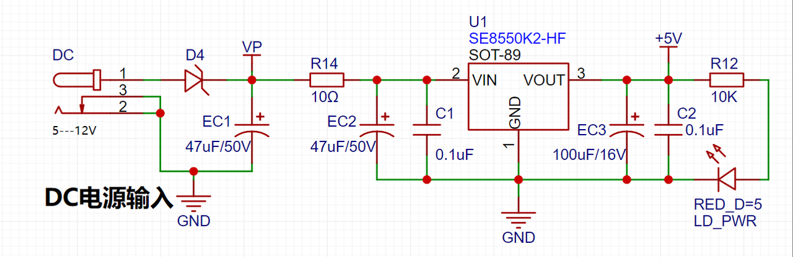

## 电源设计
使用电解电容和陶瓷电容前后顺序并联的方式设计。当电解电容和陶瓷电容并联时，它们能够“高低搭配”，使得电路在高频和低频区域都具有较好的滤波作用。  
> 电解电容滤除低频干扰，而陶瓷电容滤除高频干扰，两者结合可以获得更好的滤波效果。  
> 当电解电容和陶瓷电容并联使用时，电解电容首先过滤掉输入电压中的低频部分，为电路提供稳定的直流电压。这有助于确保电路在低频时的稳定性和可靠性。
随后，陶瓷电容进一步补偿高频波动，滤除高频噪声和脉冲危害。这种高低搭配的滤波方式能够更有效地滤除整个频段的噪声和波动，提高电路的整体性能。
此外，陶瓷电容还可以消除电解电容在高频时产生的感性特性（电容的寄生电感），进一步提高滤波效果。

好像LDO后面电容容值比前面电容容值大一倍

**就近摆放**
肖特基二极管是不是比普通二极管压降低，好像只有0.2V压降  

  

串联小电阻（10Ω）充当保险丝

本项目额外使用了串联小电阻（10Ω）来进行分压操作，一方面减少在高电压情况下LDO由于较大的压差导致发热严重的问题。另一方面，利用了串联的10欧姆小功率电阻过电流小的原理，充当低阻值保险丝，具有电路过流保护或者短路保护作用。（电阻做保险丝这个点，因为电阻在过流状态，处于发热状态，99%都是开路，它基本不会短路。它的故障分析就决定了它基本上以开路为主。也就是烧断掉，不会短在一起。）

串联的小电阻（10Ω）还可降低上电冲击的峰值，避免冲击过高损坏LDO。

如果没有使用电解电容，串联的小电阻（10Ω）也可避免热插拔的时候，导线电感和陶瓷电容形成谐振，因为陶瓷电容具有非常小的ESR，导致LC网络中的阻尼很少，谐振点的增益会很高，加入外部电阻提供阻尼后就可以抑制谐振点的增益。

## 生产注意
同网络导体间距应不小于0.1mm
过孔孔径（内径）尽量不小于0.3mm
过孔孔径（外径）尽量不小于0.5mm

字符与焊盘最小间距是15mm
蛇形信号线间距不小于15mil
网格覆铜，网格线宽线距应不小于0.25mm