## 电源设计
使用电解电容和陶瓷电容前后顺序并联的方式设计。当电解电容和陶瓷电容并联时，它们能够“高低搭配”，使得电路在高频和低频区域都具有较好的滤波作用。  
> 电解电容滤除低频干扰，而陶瓷电容滤除高频干扰，两者结合可以获得更好的滤波效果。  
  
> 当电解电容和陶瓷电容并联使用时，电解电容首先过滤掉输入电压中的低频部分，为电路提供稳定的直流电压。这有助于确保电路在低频时的稳定性和可靠性。

> 随后，陶瓷电容进一步补偿高频波动，滤除高频噪声和脉冲危害。这种高低搭配的滤波方式能够更有效地滤除整个频段的噪声和波动，提高电路的整体性能。

> 此外，陶瓷电容还可以消除电解电容在高频时产生的感性特性（电容的寄生电感），进一步提高滤波效果。  

  

二极管防反接  

>本项目使用串联二极管进行防反接考虑到了本设备供电电压通常高于5V的使用场景，二极管的0.7V压降将不会供电造成影响。当供电电压较低时，由于项目的总体功耗较低，实测供电电流较低（20mA）,由于肖特基二极管 D4(1N5819)独特的结构，相比于通用开关二极管等，VF更低，由下图可见，压降约为0.2V以内。

常规的电路设计中，使用反向并联二极管+串接保险丝的方案也可达成防反接和电路保护目的。

***
串联小电阻（10Ω）充当保险丝

>使用了串联小电阻（10Ω）来进行分压操作，一方面减少在高电压情况下LDO由于较大的压差导致发热严重的问题。另一方面，利用了串联的10欧姆小功率电阻过电流小的原理，充当低阻值保险丝，具有电路过流保护或者短路保护作用。（电阻做保险丝这个点，因为电阻在过流状态，处于发热状态，99%都是开路，它基本不会短路。它的故障分析就决定了它基本上以开路为主。也就是烧断掉，不会短在一起。）

> 串联的小电阻（10Ω）还可降低上电冲击的峰值，避免冲击过高损坏LDO。

>如果没有使用电解电容，串联的小电阻（10Ω）也可避免热插拔的时候，导线电感和陶瓷电容形成谐振，因为陶瓷电容具有非常小的ESR，导致LC网络中的阻尼很少，谐振点的增益会很高，加入外部电阻提供阻尼后就可以抑制谐振点的增益。
***
### 问题  

*好像LDO输出端电容容值比输入端电容容值大一倍*  

*肖特基二极管是不是比普通二极管压降低，好像只有0.2V压降*

**注意PCB设计时：就近摆放**  
***
钳位在电路中是指限制电压的意思，而二极管钳位特指利用二极管将电路中的某点电位进行限制的技术。
>二极管钳位主要利用了二极管的单向导电性。当二极管的正极电压大于负极电压并且导通后，二极管两端的电压被限制在其管压降上，通常硅管的管压降约为0.7V。

>钳位过程：通过二极管的钳位作用，将被钳位的电位强制拉向参考端，从而实现电位的限制。钳位并不改变原信号的波形，只是抬高或降低了信号的基准电位。

>根据二极管连接方式的不同，钳位电路可分为正向钳位电路和负向钳位电路。本项目仅设计了正向钳位。

>正向钳位电路：当二极管的正极接地时，为正向钳位电路。在正半周时，二极管截止；在负半周时，二极管导通，电容被充电至一定电压，使输出电压限制在一定范围内。
负向钳位电路：当二极管的负极接地时，为负向钳位电路。工作原理与正向钳位电路相反。  

电流采样电阻的开尔文接法
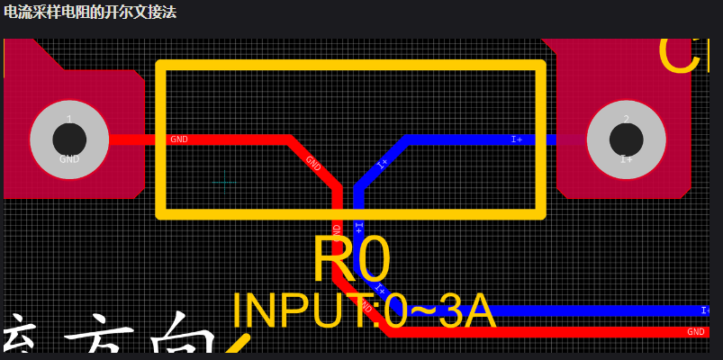

ADC信号走线：10mil或8mil。太宽则在线路过长时，有可能影响信号的完整性。
***
## Layout注意
>1mil=0.0254mm  
大概是除40或者乘40
### 生产规则
同网络导体间距应不小于0.1mm  
过孔孔径（外径）尽量不小于0.5mm（20mil）  
过孔孔径（内径）尽量不小于0.3mm（12mil）  

字符与焊盘最小间距是15mm（60mil）  
蛇形信号线间距不小于15mil  
网格覆铜，网格线宽线距应不小于0.25mm（10mil）  
### PCB设计集锦
> 电源走线先经过电容再到引脚
>

> 不要从焊盘中间出线，顺着焊盘出线  
> 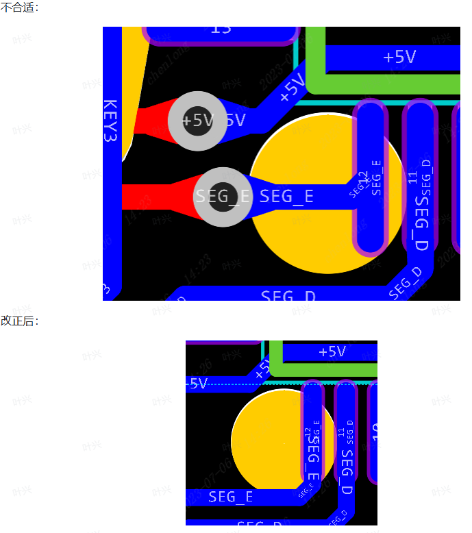

> 尽量拉直过孔和走线
> 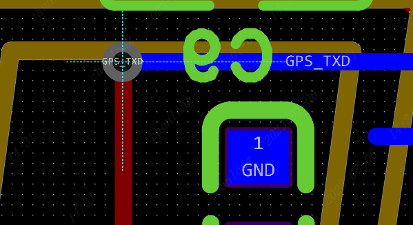  

> 走线要么全部用圆弧要么全部用直线  

> 晶振内部不要走线,包地处理  
> 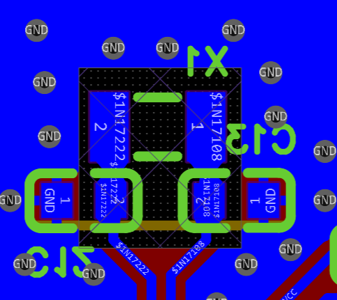  

> 丝印大小不要小于1.2mm
>
## 电源电容选型
有多少个电源就设计多少个电容，电容的选型要考虑电容的耐压、容量、温度特性、纹波电流等参数。

3.1.1. 嵌入式必备知识点
嵌入式软件开发作为计算机科学和电子工程的交叉领域，要求开发人员具备一系列的专业知识和技能。 而基于CW32的嵌入式软件开发必备知识包括以下部分：

## 补充
编程语言：
熟练掌握C（C++）语言，这是嵌入式系统中最常用的编程语言，因为它们提供了直接访问硬件的能力，并且代码执行效率高。
了解汇编语言，用于编写底层驱动、中断处理程序以及性能要求极高的代码段。
对其他编程语言如Python、Java等有一定了解，以便在特定情况下使用。
了解CW32标准库的用法。
数据结构与算法：
熟悉各种数据结构，如数组、链表、栈、队列等，以及常用的算法，如排序、查找、递归等。
能够根据嵌入式系统的资源限制选择合适的数据结构和算法。
计算机体系结构：
了解处理器架构，如ARM、x86等，以及指令集和内存管理。
熟悉嵌入式系统的硬件组成，如微控制器、FPGA、DSP等。
可以很熟练的根据CW32嵌入式芯片的数据手册及用户手册，查找所需外设工作原理。
嵌入式操作系统（深入知识点）：
掌握常用的嵌入式操作系统，如μC/OS、FREERTOS等，了解其内核、进程管理、内存管理、设备管理和文件系统等基本原理。
能够进行操作系统的任务设计、任务管理等，以满足特定应用的需求。
硬件接口与外设：
熟悉常用的硬件接口，如GPIO、串口、SPI、I2C等，并能编写相应的驱动程序。
了解嵌入式系统常用的硬件设备，如传感器、执行器、通信模块等，并能够与之进行交互。
开发工具与环境：
熟练使用集成开发环境（IDE），如KEIL、IAR、VISUAL STUDIO等，进行软件开发和调试。
掌握交叉编译器的使用，以便在开发计算机上编译出能在目标硬件上运行的程序。
熟悉调试器的使用，能够进行软件的断点调试、单步执行、变量查看等。
系统分析与设计：
能够进行项目需求分析，将需求转化为软件功能需求。
掌握软件架构设计的原则和方法，能够设计出高效、可维护的软件系统。
了解嵌入式系统的实时性要求，能够设计出满足实时性要求的软件系统。
测试与验证：
掌握单元测试、集成测试和系统测试的方法和技术，能够对软件进行全面的测试，确保软件功能的正确性和稳定性。
了解嵌入式系统的可靠性要求，能够进行软件的可靠性测试和验证。 只有全面掌握这些知识并具备持续学习的能力，才能成为一名优秀的嵌入式软件开发人员。

CH340系列，V3问题
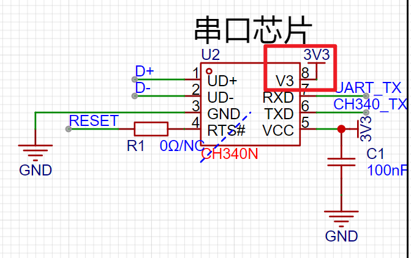
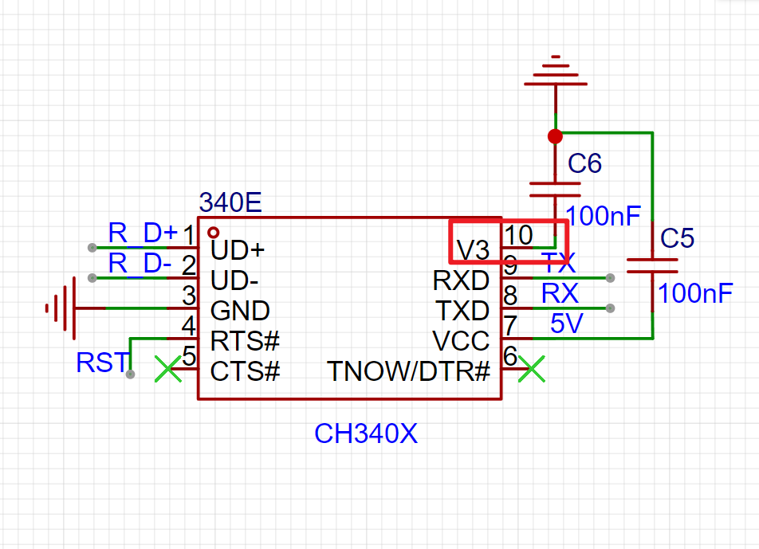

## 锂电池管理芯片
### TP5400
单节锂离子电池充电器和恒定 5V 升压控制器，输出最大 1A 充电电流。
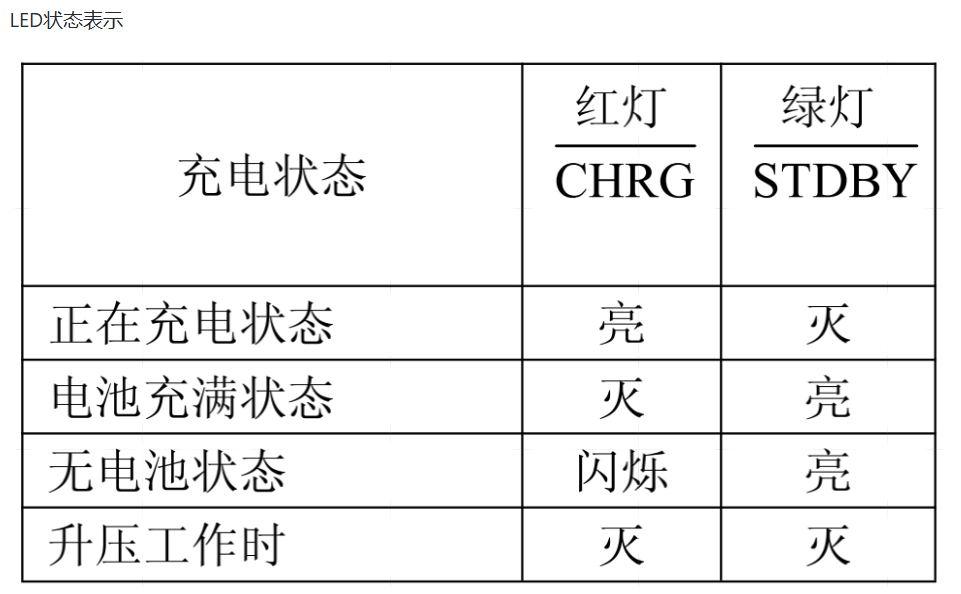  
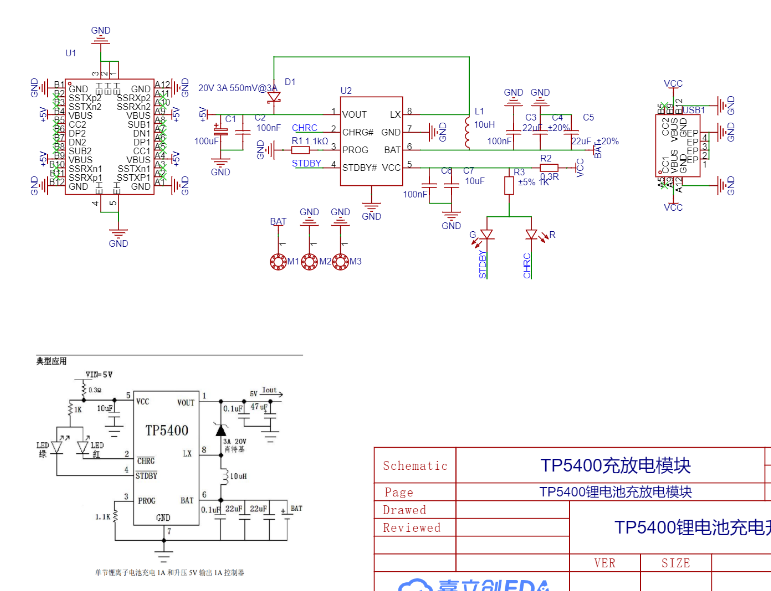

### TP4056
最大充电电流：1000mA
充电截止电压：4.2V
电池过放保护电压：2.4V

最大输出电流：2A   （建议1A内使用）

输出电压：4~12V      (可改成更高输出)
### FM5324GA

## 运放
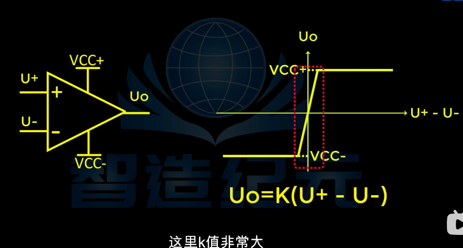
K值一般能达到几十万，线性范围非常小，超出的部分就会约等于正的或者负的电压。（所以同相输入端和反向输入端不要差太大）
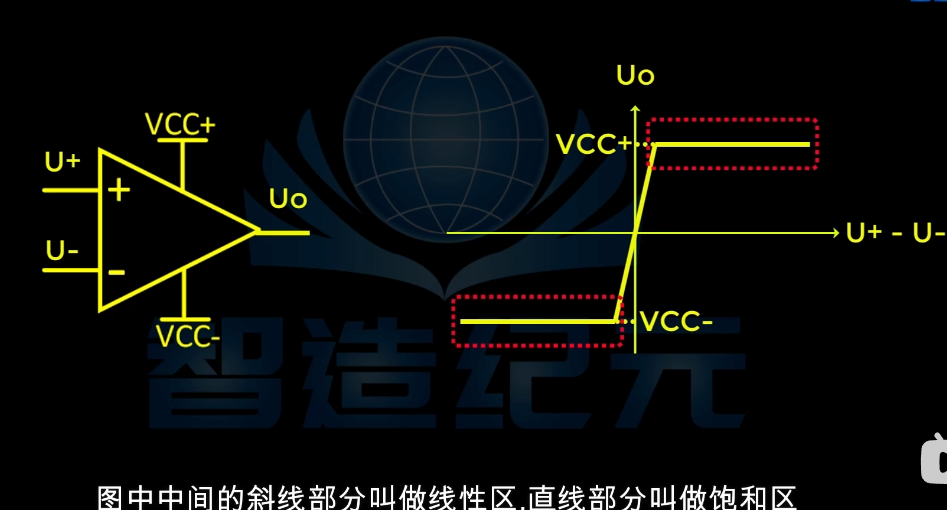
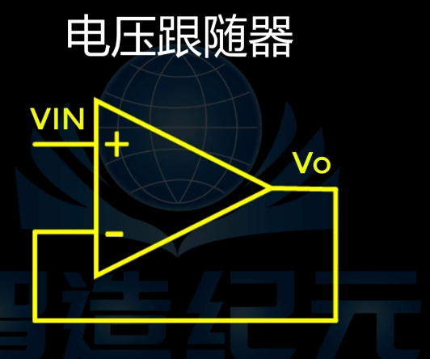
输出值会无限接近于输入值相等  
基于饱和区的特性还能作为比较器  
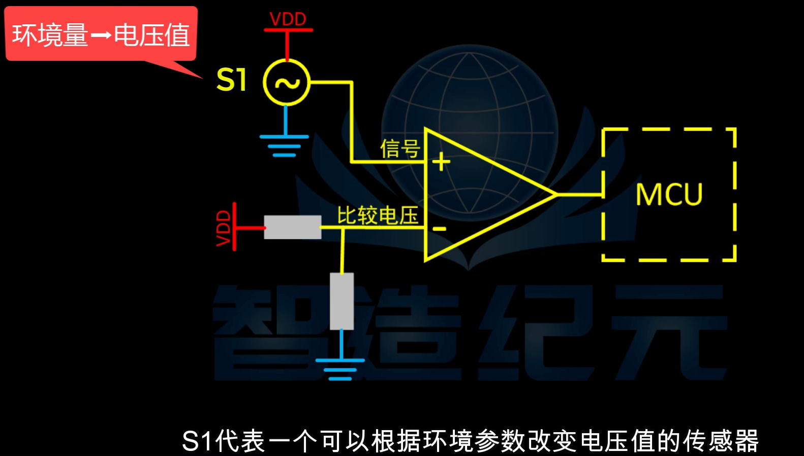
电阻无穷大

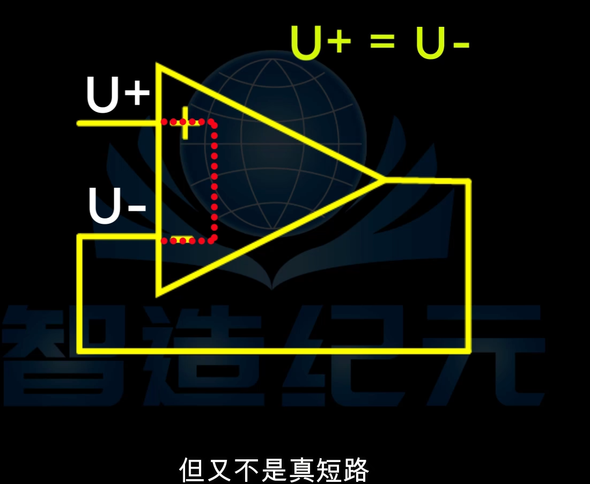
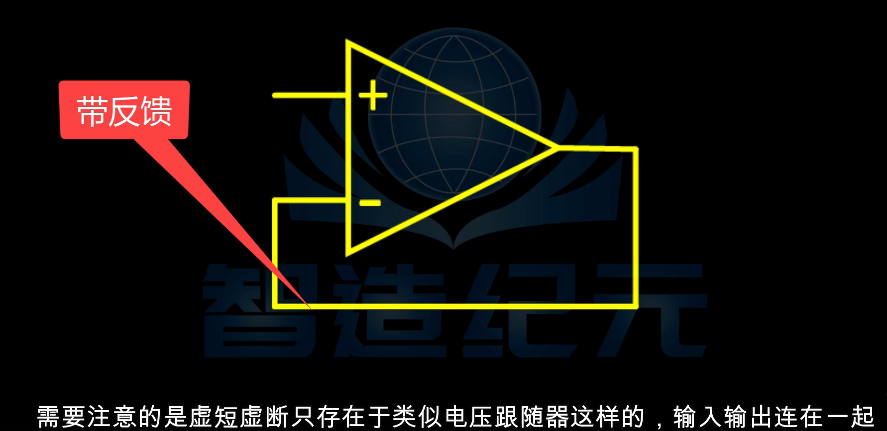
虚短虚断在比较器中是不成立的

# 阻抗匹配
在一个通信系统中，信号源和接收端的阻抗一般都是确定的，我们要做的就是找一根阻抗和他们相等的走线，把他们连接起来，否则的话阻抗不匹配就会产生反射，影响信号质量。
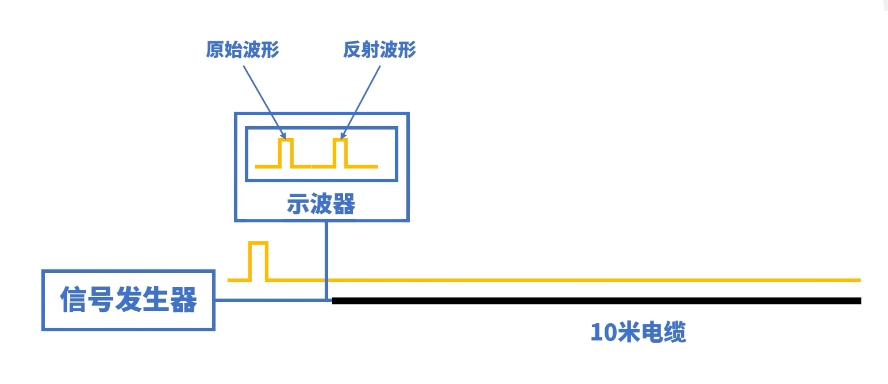  
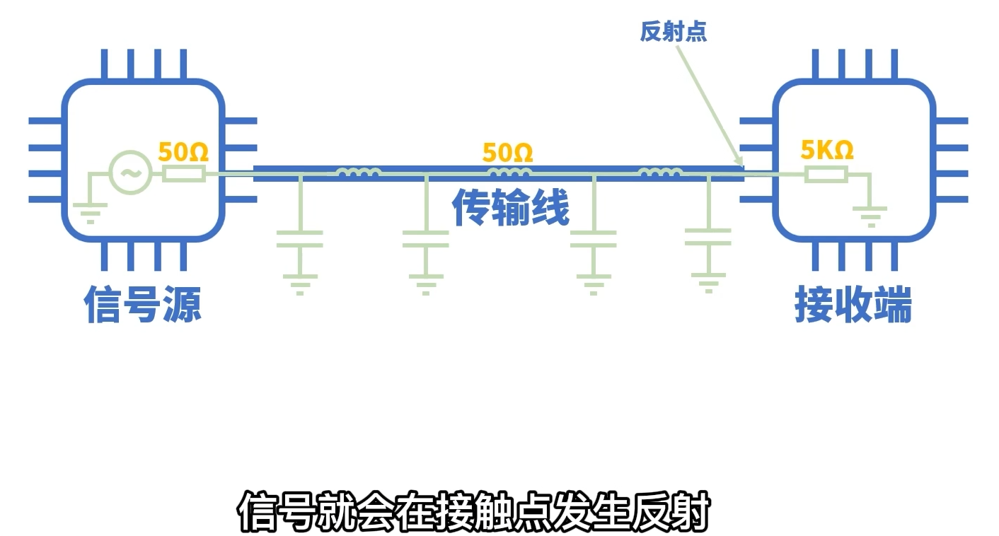  
类似光在不同介质中传播一样，折射率差的越多，反射也就越强烈  
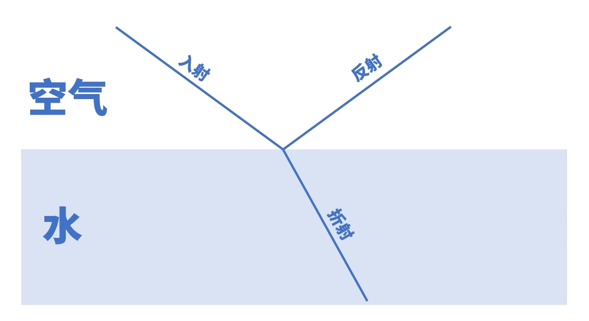  
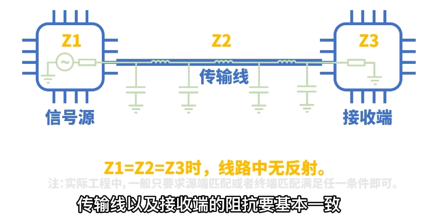  

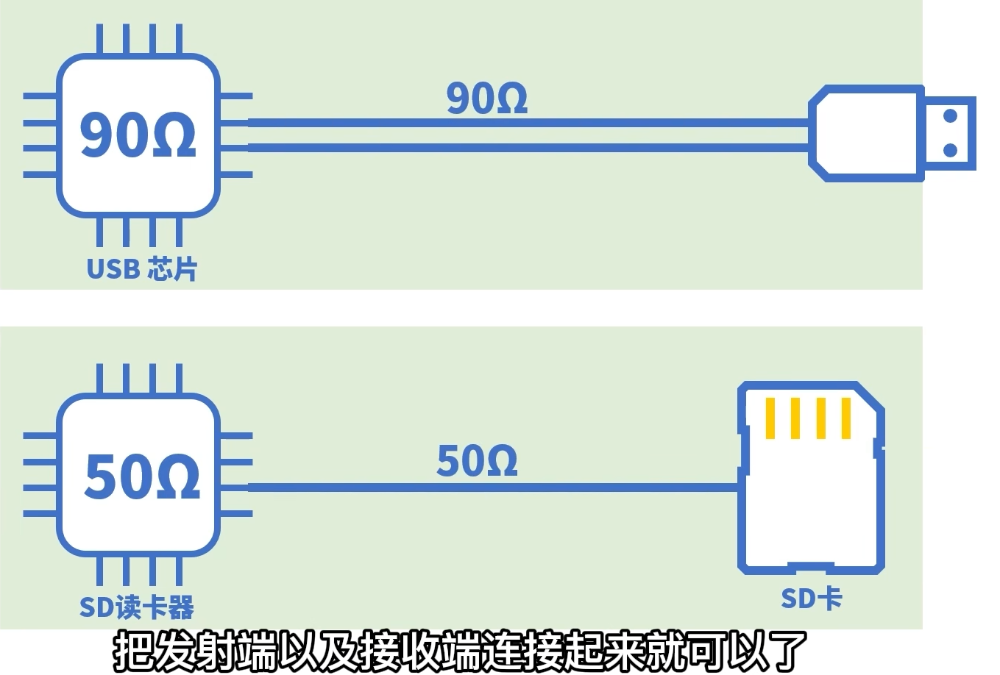  
嘉立创的阻抗计算页面：
https://tools.jlc.com/jlcTools/index.html#/impedanceCalculatenew
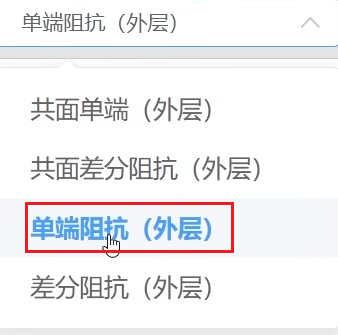  
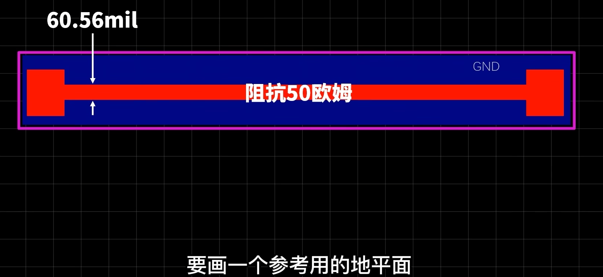  
题外话 ：TDR测单端阻抗 
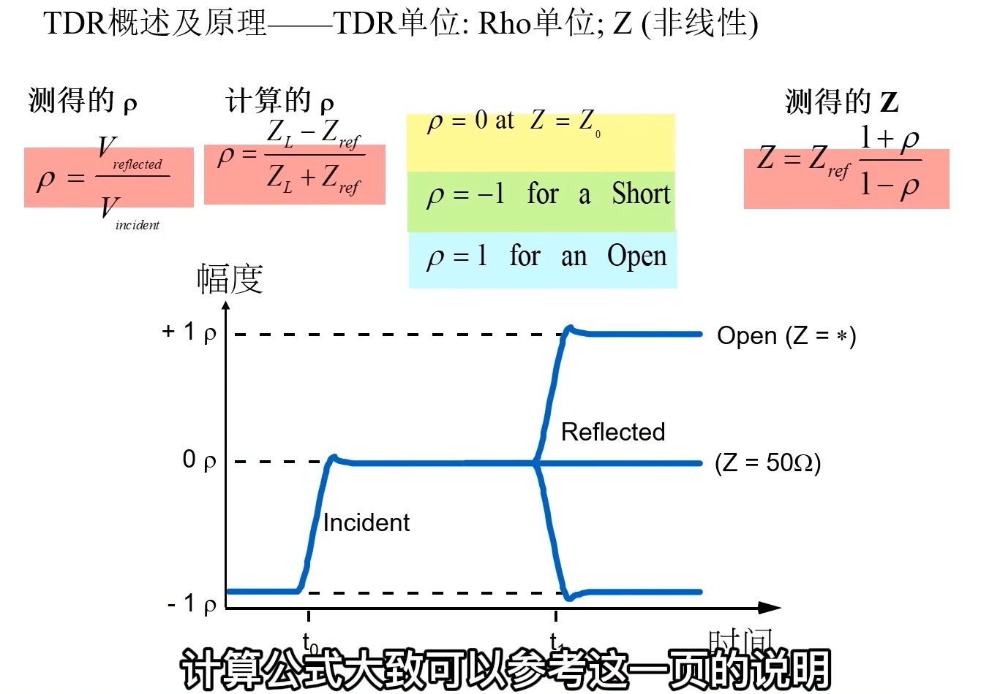

# 尺寸设计
能插入到面包板的PCB尺寸一般为：
1000mil(25.4mm) x51.80
排针中心距离板边为1.27mm
两排针中心点对中心点为900mil(22.86mm)

# 电子元件精度等级

## 一、电阻器精度等级
1. **0.01%（B级）**
   - 这是超高精度的电阻，主要用于精密测量仪器、高端计量设备和对精度要求极高的特殊电路。例如在高精度的惠斯通电桥电路中，用于精确测量微小的电阻变化，其阻值误差范围非常小，能保证测量结果的高度准确性。
2. **0.05%（C级）**
   - 常用于高精度的模拟电路，如高精度的音频功率放大器的反馈网络。在这种电路中，精确的电阻值对于保证音频信号的低失真放大和精准的增益控制至关重要。
3. **0.1%（D级）**
   - 在精密的信号调理电路和高精度的电源电路中有广泛应用。比如在为高精度模数转换器（ADC）提供精准参考电压的分压电路中，使用这种精度的电阻可以确保参考电压的准确性，从而提高ADC的转换精度。
4. **0.25%（F级）**
   - 一般用于要求较高的工业控制电路和较精密的电子设备。例如在自动化生产线上的某些传感器接口电路，精确的电阻有助于准确获取和处理传感器信号。
5. **0.5%（G级）**
   - 在普通的精密电路，如一些要求不太高的运算放大器电路中作为反馈电阻或增益设置电阻使用。例如在简单的比例运算放大器电路中，这种精度的电阻能够满足基本的精度要求。
6. **1%（H级）**
   - 是比较常用的精密电阻等级，应用于各种需要一定精度的电路，如仪器仪表内部的信号处理电路、一些要求稍高的滤波电路等。
7. **5%（J级）**
   - 广泛应用于一般的电子电路，如普通的消费电子产品中的电源电路、简单的LED驱动电路等。在这些电路中，对电阻精度要求不是特别高，5%的误差可以接受。
8. **10%（K级）**
   - 用于对精度要求较低的电路，如一些简单的限流电路、功率电路中的保护电阻等。在这些电路中，主要关注电阻的功率承受能力和大致的阻值范围。
9. **20%（M级）**
   - 一般用于对阻值精度要求很低的场合，如一些低成本、对性能要求不高的电子玩具电路或简易的照明电路中的分压电阻。

## 二、电容器精度等级
1. **±0.1pF（高精度陶瓷电容）**
   - 主要用于高频、高精度的射频（RF）电路，如手机的射频前端电路。在这些电路中，电容的微小变化都会对信号传输产生很大影响，需要极高的精度来确保电路性能。
2. **±1%（C级）**
   - 用于高精度的滤波电路、高精度的振荡电路，如一些专业音频设备中的振荡电路，以保证频率的稳定性。
3. **±2%（D级）**
   - 在要求较高的耦合电路和去耦电路中使用，如在高性能计算机主板的部分电源去耦电路中，确保电源的稳定性。
4. **±5%（J级）**
   - 应用于一般的滤波、耦合和旁路电路，如普通电子产品的电源滤波电容。
5. **±10%（K级）**
   - 用于对电容精度要求不是很高的电路，如一些简单的低频放大电路中的耦合电容。
6. **±20%（M级）**
   - 用于对电容容量精度要求较低的场合，如一些简单的定时电路中的电容，主要是利用电容的充电和放电特性，对精度要求相对较低。

## 三、电感器精度等级
1. **±0.1%（高精度电感）**
   - 用于高精度的谐振电路、高频滤波电路等，如在高精度的无线通信基站的滤波器中，确保滤波效果的精准性。
2. **±1%（A级）**
   - 在要求较高的射频电路和信号处理电路中作为储能元件或滤波元件使用，如在卫星通信设备的部分电路中。
3. **±2%（B级）**
   - 用于一般的高频电路和对电感精度有一定要求的电路，如在普通的蓝牙设备的射频电路中。
4. **±5%（C级）**
   - 在一些对电感精度要求不是很高的低频滤波电路或储能电路中使用，如在简单的DC - DC变换器中的储能电感。
5. **±10%（D级）**
   - 用于对电感精度要求较低的电路，如一些简单的电感式传感器电路，主要利用电感的变化来检测物理量，对电感本身精度要求相对不高。

# 电容的分类与应用场景

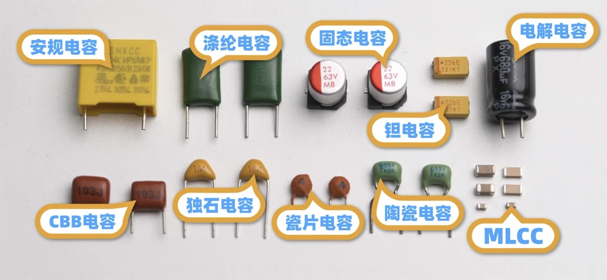  
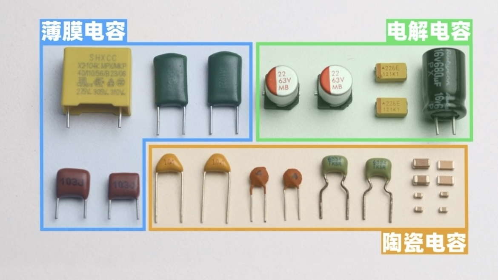  
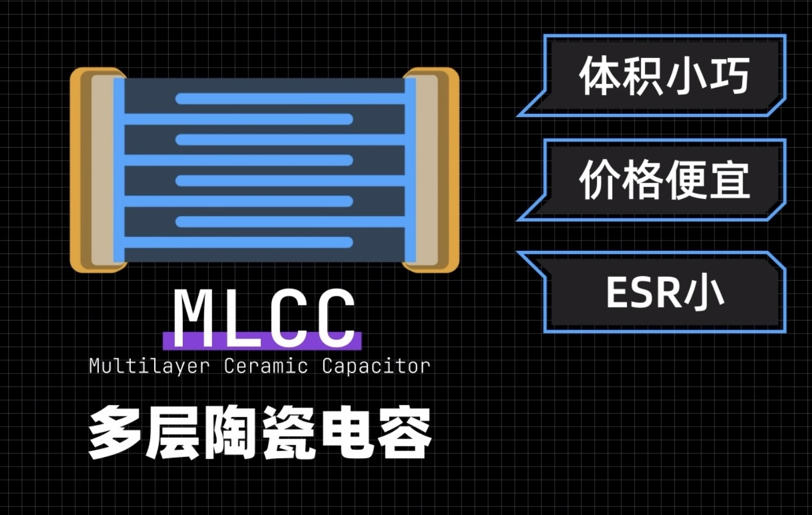  

电解电容主要给电源滤波，电解电容的容量越大，滤波效果越好。
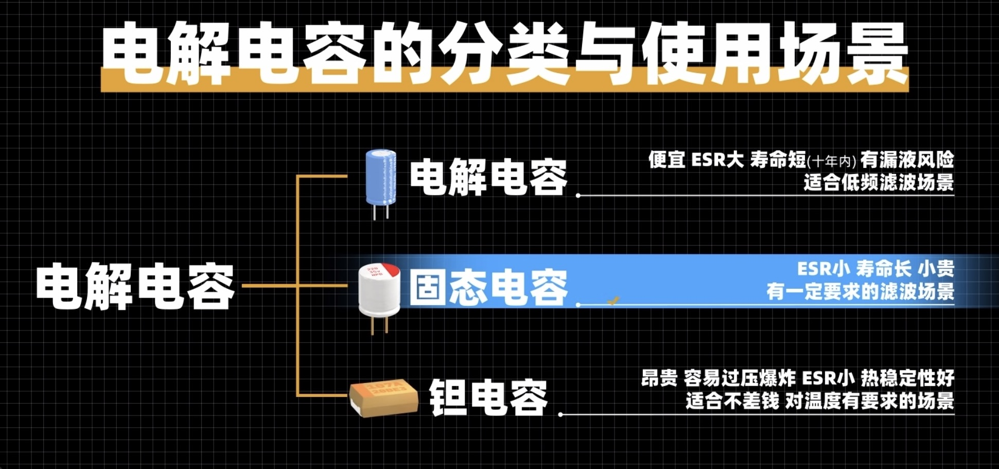  

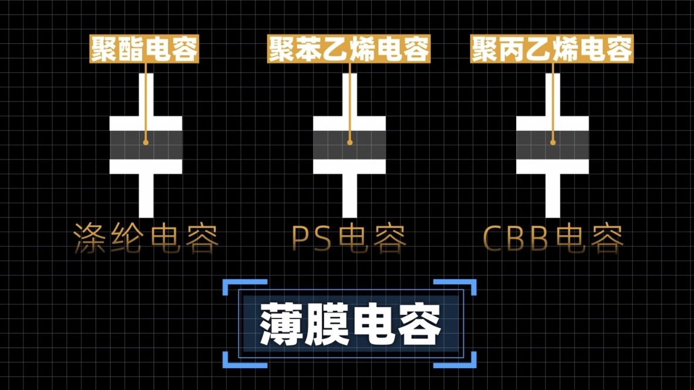  

# CPU GPU NPU的区别到底是什么?

CPU什么都可以计算，但是速度慢，GPU和NPU可以做一些加速计算。  
GPU中CUDA Core计算乘法与加法,Tensor Core计算矩阵,RT Core计算的是光追管线里的光线求交判断。  
NPU计算矩阵运算  

# 高速PCB走线
1. 等长
2. 同组同层
3. 阻抗匹配
4. 3W原则
5. 敏感线包地

## DDR4
DDR4信号可以分为数据线以及地址线  
同组等长<20mil,地址线等长<50mil就可以  
线越粗阻抗越小  
成对的差分线阻抗应该是100欧姆，单端一般是50欧姆。  
做等长的时候将最长的那根线保持不动，其余的做蛇形走线

# 一个按键一颗芯片实现长按开关机
使用一款国产芯片，EC190708。长按开关3秒，芯片1号引脚改变输出电平。接入到带enable的电源芯片，就有电源输出了。
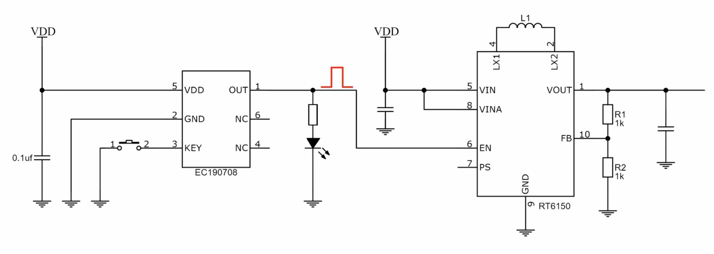
# 升压电路原理
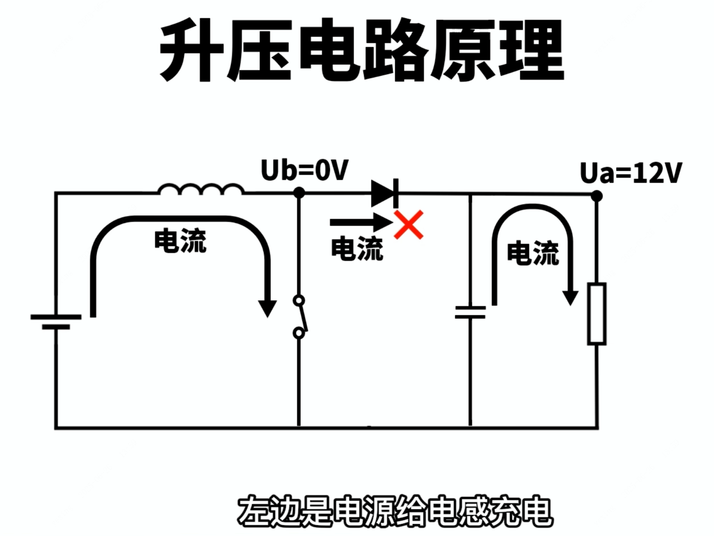

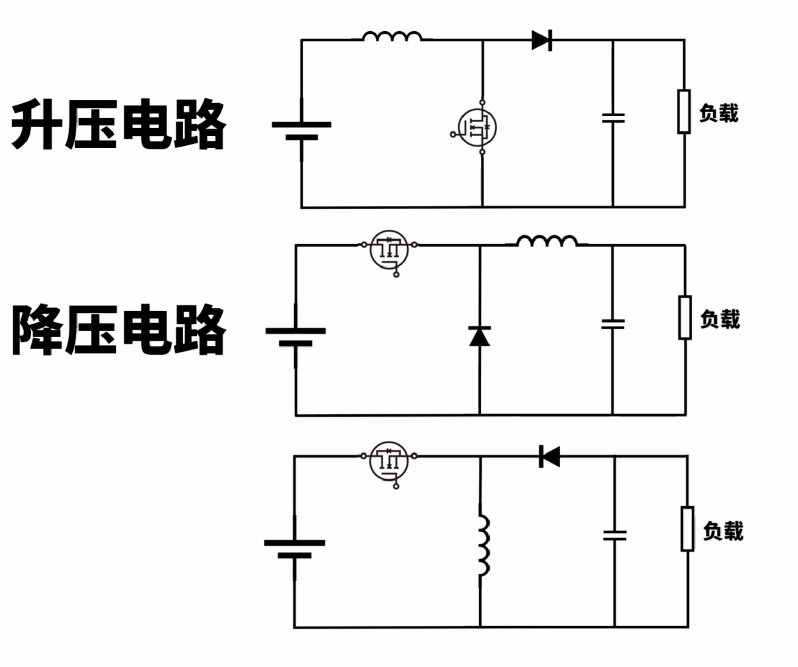
buck-boost 升降压都可以 

# 电流源
原理：不停的改变输出电压来保证输出电流的恒定（有个小人看着电流表在调电压）
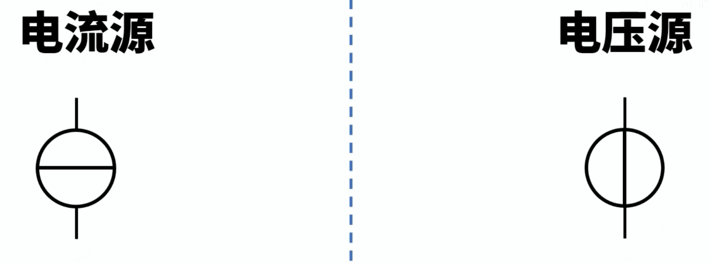
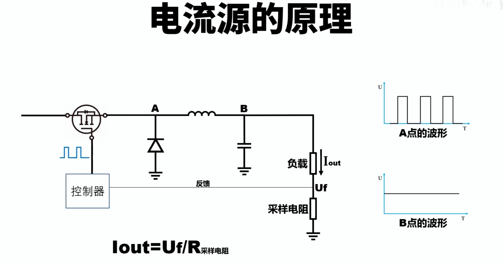
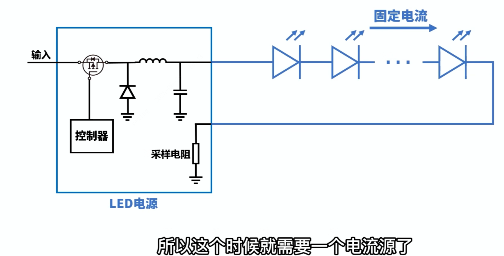
